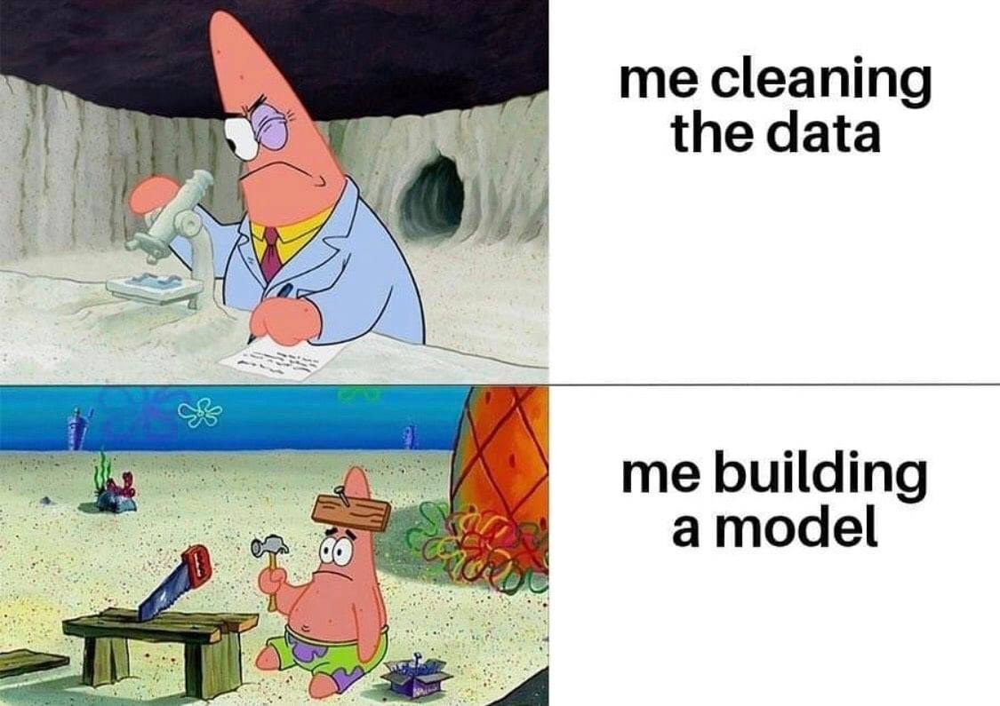

```{r setup, include=FALSE}
library(knitr)

default_source_hook <- knit_hooks$get('source')
default_output_hook <- knit_hooks$get('output')

knit_hooks$set(
  source = function(x, options) {
    paste0(
      "\n::: {.codebox data-latex=\"\"}\n\n",
      default_source_hook(x, options),
      "\n\n:::\n\n")
  }
)

knit_hooks$set(
  output = function(x, options) {
    paste0(
      "\n::: {.codebox data-latex=\"\"}\n\n",
      default_output_hook(x, options),
      "\n\n:::\n\n")
  }
)

knitr::opts_chunk$set(echo = TRUE)
```
# Outline

## Questions so far?

\center

{width=40%}

## Outline

- GLMs assume independence
- Mixed-effects can relax that assumption
- Also allow to incorporate correlation (between species)
  - I.e., JSDM

# Background

- We can formulate the same models
- But now, parameters come from a distribution

## Likelihood formulation: independence


\begin{equation}
\mathcal{L}(\textbf{y};\Theta) = \prod \limits^n_i f(y_i;\Theta)
\end{equation}

We just multiply! (assumes independence)

## Our new likelihood

\begin{equation}
\mathcal{L}(\textbf{y};\symbf{\Sigma}) = \displaystyle \int \prod \limits^n_i f(y_i \vert \textbf{u}) f(\textbf{u};\symbf{\Sigma}) d\textbf{u}
\end{equation}

- Fixed effects: what we had so far
- Random effects: new, come from a distribution
- Mixed effects model: contains both

## The mixed-effects model

\begin{equation}
              \tikz[baseline,remember picture]{
              \node[fill=green!20,anchor=base] (t2)
              {$g$};
            }
            \{
 \tikz[baseline,remember picture]{
              \node[fill=blue!20,anchor=base] (t1)
              {$\text{E}(\textbf{y} \vert \textbf{u})$};
            } 
            \}
            = 
            \tikz[baseline,remember picture]{
            \only<2>{
              \node[fill=purple!20,anchor=base] (t3)
              {$\textbf{X}$};
            }
            \only<1>{
              \node[rectangle,draw,dotted,fill=purple!20,anchor=base] (t3)
              {$\textbf{X}$};
            }
            }
            \tikz[baseline,remember picture]{
            \only<2>{
              \node[rectangle,draw,solid,fill=purple!20,anchor=base] (t4)
              {$\beta$};
            }
            \only<1>{
              \node[fill=purple!20,anchor=base] (t4)
              {$\beta$};
            }
            }
            + 
            \tikz[baseline,remember picture]{
            \only<2>{
             \node[dotted,fill=gray!20,anchor=base] (t5)
              {$\textbf{Z}$};
            }
            \only<1>{
            \node[rectangle,draw,dotted,fill=gray!20,anchor=base] (t5)
              {$\textbf{Z}$};
            }
            } 
             \tikz[baseline,remember picture]{
             \only<2>{
             \node[rectangle,draw,solid,fill=gray!20,anchor=base] (t6)
              {$\textbf{u}$};
            }
            \only<1>{
             \node[fill=gray!20,anchor=base] (t6)
              {$\textbf{u}$};
            }
             }
\end{equation}

\begin{enumerate}
    \item Link-function
        \tikz[na,remember picture]\node[coordinate] (n2) {};
    \item Conditional mean
        \tikz[na,remember picture]\node[coordinate] (n1) {};
    \item \alt<1>{Fixed effects design matrix}{Fixed effects parameter vector}
        \tikz[na,remember picture]\node[coordinate] (n3) {};
    \item\alt<1>{Random effects design matrix}{Random effects parameter vector}
        \tikz[na,remember picture]\node[coordinate] (n4) {};
\end{enumerate}

\begin{tikzpicture}[overlay,remember picture]
        \path[->] (n1) edge [bend right] (t1);
        \path[->] (n2) edge [bend right] (t2);
        \path[->]<1> (n3) edge [bend right] (t3);
        \path[->]<1> (n4) edge [bend right] (t5);
        \path[->]<2> (n3) edge [bend right] (t4);
        \path[->]<2> (n4) edge [bend right] (t6);
\end{tikzpicture}

## The random effects design matrix

- it's the kind of thing as the fixed effects design matrix!

## When to include a random effect

- Unobserved effect vs. observed effect
- To account for pseudo replication
- Nuisance vs. of interest
- If parameter comes from a population

\center 

\textbf{\textcolor{red}{To incorporate (species) correlation}}


## A linear mixed-effects model

\begin{columns}
\column{0.6\textwidth}
\only<1->{
\begin{equation}
 \tikz[baseline,remember picture]{
              \node[fill=blue!20,anchor=base] (t1)
              {$\text{E}(\textbf{y} \vert \textbf{u})$};
            } = 
            \tikz[baseline,remember picture]{
              \node[anchor=base] (t2)
              {$\symbf{\mu}$};
            }
\end{equation}
}

\only<2->{
\begin{equation}
 \tikz[baseline,remember picture]{
              \node[fill=blue!20,anchor=base] (t1)
              {$\textbf{y}$};
            } = 
              \tikz[baseline,remember picture]{
              \node[fill=purple!20,anchor=base] (t3)
              {$\textbf{X}\symbf{\beta}$};
            } + 
            \tikz[baseline,remember picture]{
             \node[fill=gray!20,anchor=base] (t4)
              {$\textbf{Z}\textbf{u}$};
            } + 
            \tikz[baseline,remember picture]{
             \node[fill=yellow!90!black,anchor=base] (t5)
              {$\textbf{e}$};
            }
\end{equation}
}
\only<3->{

with
\begin{math}
 \tikz[baseline,remember picture]{
             \node[fill=gray!20,anchor=base] (t4)
              {$\textbf{u}$};
            } \sim \mathcal{N}(0,\symbf{\Sigma})
\end{math}

\pause 

with
\begin{math}
\tikz[baseline,remember picture]{
             \node[fill=yellow!90!black,anchor=base] (t5)
              {$\textbf{e}$};
            } \sim \mathcal{N}(0,\textbf{I}\sigma^2)
\end{math}
}

\column{0.4\textwidth}

```{r echo=F,out.width="100%", fig.align="right"}
knitr::include_graphics("lmer_lemur_tim_doherty.jpg")
```

\end{columns}


## A linear mixed-effects model

We can rewrite the model in terms of the complete error term.

\begin{columns}
\column{0.6\textwidth}

\begin{equation}
 \tikz[baseline,remember picture]{
              \node[fill=blue!20,anchor=base] (t1)
              {$\textbf{y}$};
            } = 
              \tikz[baseline,remember picture]{
              \node[fill=purple!20,anchor=base] (t3)
              {$\textbf{X}\symbf{\beta}$};
            } +  
            \tikz[baseline,remember picture]{
             \node[fill=yellow!90!black,anchor=base] (t4)
              {$\symbf{\epsilon}$};
            }
  \only<2>{
   \tikz[remember picture,overlay]{
    \draw[->] (t4.south)++(0,-5ex) to (t4);
    \node[xshift=3ex, below=5ex] (t5.south) {$\mathcal{N}(0,\textbf{Z}\symbf{\Sigma}\textbf{Z}^\top+\textbf{I}\sigma^2)$};
    }  
  }
\end{equation}

\column{0.4\textwidth}

```{r echo=F,out.width="100%", fig.align="right"}
knitr::include_graphics("lmer_lemur_tim_doherty.jpg")
```

\end{columns}

  \only<2>{
  \textbf{So, we are including covariance between our errors in the model.}
  }

## The objective function

\begin{equation}
 \tikz[baseline,remember picture]{
              \node[fill=blue!20,anchor=base] (t1)
              {$\textbf{y}$};
            } = 
              \tikz[baseline,remember picture]{
              \node[fill=purple!20,anchor=base] (t3)
              {$\textbf{X}\symbf{\beta}$};
            } + 
            \tikz[baseline,remember picture]{
             \node[fill=gray!20,anchor=base] (t4)
              {$\textbf{Z}\textbf{u}$};
            } + 
            \tikz[baseline,remember picture]{
             \node[fill=yellow!90!black,anchor=base] (t5)
              {$\textbf{e}$};
            }
\end{equation}

with 
\begin{math}
\symbf{\epsilon} =   
 \tikz[baseline,remember picture]{
             \node[fill=gray!20,anchor=base] (t4)
              {$\textbf{Z}\textbf{u}$};
            } +
            \tikz[baseline,remember picture]{
             \node[fill=yellow!90!black,anchor=base] (t5)
              {$\textbf{e}$};
            } 
\end{math} and $\symbf{\epsilon} \sim \mathcal{N}(0,\textbf{Z}\symbf{\Sigma}\textbf{Z}^\top + \textbf{I}\sigma^2)$

we have the marginal distribution $\textbf{y} \sim \mathcal{N}(\textbf{X}\symbf{\beta},\textbf{Z}\symbf{\Sigma}\textbf{Z}^\top + \textbf{I}\sigma^2)$

\textbf{This is not how things are done in practice (because the covariance matrix can get quite big!)}

<!--
- but includes inverse of $\boldsymbol{Z}\boldsymbol{\Sigma}\boldsymbol{Z}^\top + \textbf{I}\sigma^2$
-->

# Estimation
- Penalized quasi-likelihood methods
- Adaptive GH quadrature
- Laplace approximation
- Variational approximations
- Et cetera \footnotesize (see e.g., Bolker et al. 2009) \normalsize

\center Measure of central tendency: Mean or Mode

```{r, echo=F, eval=T, fig.show="hold", out.width="40%", fig.align="center"}
library(ggplot2)

ggplot(data.frame(x=0), aes(x=x))+stat_function(fun = dnorm, n = 101, args = list(mean = 0, sd = 1))+theme_classic()+geom_vline(aes(xintercept=0), col="red",lty="dashed")+theme(text = element_text(size=24))+xlim(c(-3,3))+xlab("Random effect")+ylab("Likelihood")

ggplot(data.frame(x=0), aes(x=x))+stat_function(fun = dgamma, n = 101, args = list(shape = 2, scale = 2))+theme_classic()+geom_vline(aes(xintercept=2), col="red",lty="dashed")+geom_vline(aes(xintercept=4), col="red",lty="dashed")+theme(text = element_text(size=24))+xlim(c(0,14))+ xlab("Random effect")+ylab("Likelihood")
#gamma mode is (k-1)*theta so here 2


```

## Maximum Likelihood Estimation

At the maximum of the likelihood:

- The gradient is zero (tangent is straight)
- The hessian (of -LL) should
  - have positive diagonals
  - positive eigenvalues
  - be symmetric
  - and is thus invertible (we go up in both directions)
- Asymptotic covariance matrix is given by the inverse of the negative Hessian

\begin{center}
\textcolor{red}{These are important concepts to understand error messages and convergence in mixed-models.}
\end{center}

## There are many \texttt{R}-packages

\columnsbegin
\column{0.5\textwidth}
\begin{itemize}
\item \texttt{nlme}
\item \texttt{lme4}
\item \texttt{glmmTMB} (or \texttt{glmmADMB})
\item \texttt{sdmTMB}
\item \texttt{MASS}
\item \texttt{glmmML}
\item \texttt{repeated}
\item \texttt{glmm}
\end{itemize}

\column{0.5\textwidth}
\begin{itemize}
\item \texttt{hglm}
\item \texttt{spaMM}
\item \texttt{gllvm}
\item \texttt{mcmcGLMM}
\item \texttt{INLA}
\item \texttt{inlabru}
\item MCMC frameworks (JAGS, STAN, NIMBLE, greta)
\end{itemize}
\columnsend

\center 

\textbf{\texttt{lme4} and \texttt{glmmTMB} are most commonly used.}

## \texttt{lme4} \footnotesize (Bates et al. 2015) \normalsize

\begin{center}

\begin{itemize}
\item Correlation between random effects
\item Sparse matrices
\item Modern matrix algebra libraries
\item Likelihood profiling
\end{itemize}

\textcolor{red}{Can be fussy about convergence}

\end{center}

## \texttt{glmmTMB} \footnotesize (Brooks et al. 2017) \normalsize

\begin{center}

\begin{itemize}
\item Correlation between and within random effects (e.g., spatial)
\item Uses state-of-the art AD software  \footnotesize (TMB, Kristensen et al. 2015) \normalsize 
\item More supported distributions
\begin{itemize}
  \item Tweedie
  \item Conway-Maxwell-Poisson
  \item Zero-inflation
\end{itemize}
\item Double hierarchical GLMs
\item \textcolor{red}{Can fit GLLVMs}
\end{itemize}

\end{center}

## Specification with formula syntax in \texttt{R}

- We can think of our model in the same way
  - Intercepts for categorical covariates
  - Slopes for continuous covariates
  - Interactions
- Now the "parameters" can be correlated
- With the \texttt{R} syntax we formulate:
  - The design matrix \textbf{Z}
  - The covariance matrix $\symbf{\Sigma}$
- Just as before: intercepts are categorical, slopes for continuous covariates


# \texttt{R} formula

## Random effects \texttt{R} formula

Now some examples of how it works in \texttt{R}. Generally:

`y ~ (continuous and/or categorical | categorical)`

"Nested":

`y ~ (1|a/b)` is the same as `y ~ (1|a:b + b)`
 
"Crossed":

`y ~ (1|a) + (1|b)`


## Variation in mean abundance

$y_{ij} = \textbf{x}_i\symbf{\beta} + \alpha_j, \qquad \text{with } \alpha_j \sim \mathcal{N}(0,\sigma^2)$

```{r, eval = FALSE}
y ~ fixed effects + (1|species)
```

```{r, echo = FALSE, fig.height = 5, cache = TRUE}
x <- rnorm(50)
b <- rnorm(6)

y <- rnorm(x*b[1]+rep(b[2:6],10))

plot(y~x, cex = 3, ylab="Response variable", xlab = "Explanatory variable")
xnew <- seq(min(x)-2,max(x)+2, length.out=100)
lines(xnew, y=b[1]*xnew+b[2], col = "red", lwd = 2)
lines(xnew, y=b[1]*xnew+b[3], col = "orange", lwd = 2)
lines(xnew, y=b[1]*xnew+b[4], col = "blue", lwd = 2)
lines(xnew, y=b[1]*xnew+b[5], col = "forestgreen", lwd = 2)
lines(xnew, y=b[1]*xnew+b[6], col = "brown", lwd = 2)
```

## Variation in environmental responses

$y_{ij} = \textbf{x}_i\symbf{\beta} + z_{i}u_j , \qquad \text{with } u_i \sim \mathcal{N}(0,\sigma^2)$

```{r, eval = FALSE}
y ~ fixed effects + (0+covariate|species)
```

```{r, echo = FALSE, fig.height = 5, cache = TRUE}
x <- rnorm(50)
b <- rnorm(6)

y <- rnorm(b[1]+rowSums(sapply(b[2:6],`*`,x)))

plot(y~x, cex = 3, ylab="Response variable", xlab = "Explanatory variable")
xnew <- seq(min(x)-2,max(x)+2, length.out=100)
lines(xnew, y=b[1]+xnew*b[2], col = "red", lwd = 2)
lines(xnew, y=b[1]+xnew*b[3], col = "orange", lwd = 2)
lines(xnew, y=b[1]+xnew*b[4], col = "blue", lwd = 2)
lines(xnew, y=b[1]+xnew*b[5], col = "forestgreen", lwd = 2)
lines(xnew, y=b[1]+xnew*b[6], col = "brown", lwd = 2)
```


## \small  Variation of mean abundance and environmental responses

$y_{ij} = \textbf{x}_i\symbf{\beta} + \alpha_j + z_iu_j, \text{  with } \left( \begin{array}{c}
    \alpha_j \\
    u_j\\
    \end{array} \right) \sim \mathcal{N}\biggl\{\textbf{0},
    \left( \begin{array}{cc}
    \sigma^2_1 & \textbf{0} \\
    \textbf{0} & \sigma^2_2 \\
    \end{array} \right)\biggr\}$

\footnotesize 
```{r, eval = FALSE}
y ~ fixed effects + (1|species)+(0+covariate|species)
```
\normalsize

```{r, echo = FALSE, fig.height = 5, cache = TRUE}
x <- rnorm(50)
b <- rnorm(5*2)

y <- rnorm(c(do.call(cbind,replicate(5,cbind(1,x),simplify=FALSE))%*%b))

plot(y~x, cex = 3, ylab="Response variable", xlab = "Explanatory variable")
xnew <- seq(min(x)-2,max(x)+2, length.out=100)
lines(xnew, y=b[1]+xnew*b[2], col = "red", lwd = 2)
lines(xnew, y=b[3]+xnew*b[4], col = "orange", lwd = 2)
lines(xnew, y=b[5]+xnew*b[6], col = "blue", lwd = 2)
lines(xnew, y=b[7]+xnew*b[8], col = "forestgreen", lwd = 2)
lines(xnew, y=b[9]+xnew*b[10], col = "brown", lwd = 2)
```

## \small Correlation of mean abundance and enviromental responses

$y_{ij} = \textbf{x}_i\symbf{\beta} + \alpha_j + z_iu_j, \text{  with } \left( \begin{array}{c}
    \alpha_j \\
    u_j\\
    \end{array} \right) \sim \mathcal{N}\biggl\{\textbf{0},
    \left( \begin{array}{cc}
    \sigma^2_1 & \sigma_{12} \\
    \sigma_{21} & \sigma^2_2 \\
    \end{array} \right)\biggr\}$


```{r, eval = FALSE}
y ~ fixed effects + (random slope|random intercept)
```


```{r, echo = FALSE, fig.height = 5, cache = TRUE}
x <- rnorm(50)
b <- sort(rnorm(5*2))

y <- rnorm(c(do.call(cbind,replicate(5,cbind(1,x),simplify=FALSE))%*%b))

plot(y~x, cex = 3, ylab="Response variable", xlab = "Explanatory variable")
xnew <- seq(min(x)-2,max(x)+2, length.out=100)
lines(xnew, y=b[1]+xnew*b[2], col = "red", lwd = 2)
lines(xnew, y=b[3]+xnew*b[4], col = "orange", lwd = 2)
lines(xnew, y=b[5]+xnew*b[6], col = "blue", lwd = 2)
lines(xnew, y=b[7]+xnew*b[8], col = "forestgreen", lwd = 2)
lines(xnew, y=b[9]+xnew*b[10], col = "brown", lwd = 2)
```

# Species correlation

If we fit a GLM to data of multiple species, we assume \textbf{independence}

\textcolor{red}{But, observations of the same species form groups. Co-occurring species have  more similar observations than for other species}

In GLMM language: \textbf{observations of species exhibit correlation}

1) Part of this can be explained by shared environmental responses
2) The other part remains

## Joint Species Distribution Model (JSDM)

- For community data, we want to incorporate correlation of species
- We have \textcolor{red}{Multivariate} data (in contrast to multivariable)
  - Each species is a response variable
  
\begin{equation}
g\{\mathams{E}(\textbf{y}_i \vert \symbf{\epsilon}_i)\} = \symbf{\beta}_0 + \textbf{x}_i^\top\symbf{\beta} + \symbf{\epsilon}_i
\end{equation}

- $\symbf{\epsilon}_i$ is our error
- The error takes care of the left-over variation between species
- so we assume $\symbf{\epsilon}_i \sim \mathcal{N}(\textbf{0}, \symbf{\Sigma})$
- $\symbf{\Sigma}$ is the matrix of species associations

## Spiders: JSADM

\footnotesize

```{r, echo  =FALSE}
data(spider,package="mvabund")
data <- data.frame(spider$abund, spider$x, total = rowSums(spider$abund))
datalong <- reshape(data, 
                    varying = colnames(spider$abund), 
                    v.names = "Count", 
                    idvar = "Site", 
                    timevar = "Species", 
                    direction = "long")

datalong$Species <- factor(datalong$Species, 
                           labels = colnames(spider$abund))
```
```{r, cache = TRUE}
model <- lme4::glmer(Count ~ Species + Species*soil.dry + (0+Species|Site), 
                     family = "poisson", data = datalong)
```

\normalsize

## Species associations: strategies

There few different methods for dealing with this: 

1) "Reduced rank" or "Factor analytic" approach (GLLVMs, tomorrow)
2) Penalize the matrix \footnotesize [Pichler and Hartig 2023](https://doi.org/10.1111/2041-210X.13687)
3) ?

So, we do not usually (explicitly) fit JSDMs unconstrainedly

# Convergence

## Convergence?

```{r echo=F, out.width="50%",fig.show="hold",fig.align="center"}
knitr::include_graphics("convergence_meme.jpg")
```

see [Ben Bolker's GLMM FAQ](https://bbolker.github.io/mixedmodels-misc/glmmFAQ.html), [\texttt{lme4} page on performance](https://cran.r-project.org/web/packages/lme4/vignettes/lmerperf.html), and [the \texttt{glmmTMB} troubleshooting vignette](https://cran.r-project.org/web/packages/glmmTMB/vignettes/troubleshooting.html)

## Assessing arrival at the MLE

\begin{enumerate}
\item Stopping criteria
\begin{itemize}
\item Maximum iterations
\item Gradient close to zero
\item Relative criterion: objective function value improvement
\item Absolute criterion: objective function becomes zero (say)
\end{itemize}
\item Gradient
\item Hessian
\end{enumerate}

## \texttt{lme4} warnings: hessian

\footnotesize

\begin{itemize}
\item \texttt{Warning: Problem with Hessian check (infinite or missing values?)}
\item \texttt{Warning: Hessian is numerically singular: parameters are not uniquely determined}
\item \texttt{Warning: Model failed to converge: degenerate Hessian with 2 negative eigenvalues}
\item \texttt{Warning: Model is nearly unidentifiable: very large eigenvalue - Rescale variables?}
\item \texttt{Warning: Model is nearly unidentifiable: very large eigenvalue ratio - Rescale variables?}
\end{itemize}

<!--- eigendecomp failed-->
<!-- cholesky doesnt work on hessian or zero eigenvalues-->
<!-- - small or negative eigenvalues-->
<!-- - max(eigval) / min(eigval) ")-->
<!-- #min(eigval)/max(eigval)is very small-->


\normalsize

## Singular matrix

- determinant is zero
  - has zero eigenvalue(s)
- does not have inverse

\begin{equation}
\textbf{H} \textbf{A} = \textbf{I}
\end{equation}

## Numerical optimisation: best practices

1. Standardise (center and scale) explanatory variables
2. Try different optimisation routines
3. \textcolor{red}{Different starting values}
4. Rethink your model

## Mixed-effects model troubleshooting

see \href{https://bbolker.github.io/mixedmodels-misc/glmmFAQ.html}{Ben Bolker's GLMM FAQ}

- check data for mistakes
- check model formulation
  - correct distribution and link-function
  - few random effects levels
  - few (non-zero) observations in a category
  - overly complex: drop terms with zero variances
- double-check hessian calculation (finite differences)
- use random effect as fixed effect

\begin{itemize}
\item `?convergence` (and see the last line "convergence issues" for large datasets)
\end{itemize}


## \texttt{glmmTMB} `diagnose()`


# Inference

\begin{center}
We have a good model!
\end{center}

\pause

\begin{columns}

\column{0.4\textwidth}

Now we want to do inference
\begin{itemize}
\item Hypothesis tests (t-test, LRT)/ P-values
\item Model-selection (e.g., with AIC; Akaike 1973)
\item Et cetera ($R^2$).
\end{itemize}

\column{0.6\textwidth}

```{r echo=F,out.width="80%", fig.align="right"}

```

\end{columns}

## Next crisis

- Inference in glmms can be difficult
- Many tools are not well-defined (tests, information criteria, residuals)


## Take away tips

\begin{center}
\textcolor{red}{\href{https://en.wikipedia.org/wiki/No_free_lunch_theorem}{No free lunch in statistics}}
\end{center}

- Scale your predictors
- Carefully consider the model structure
- Keep your model as simple as possible, but not simpler
- Different packages have different benefits
  - \texttt{glmmTMB} vs. \texttt{lme4}
- Try not to -blindly- assume approximations perform well
- Always check (residual) assumptions

\centering

\textcolor{red}{There are many uses for random effects for community ecology}

# End

\center

{width=75%}