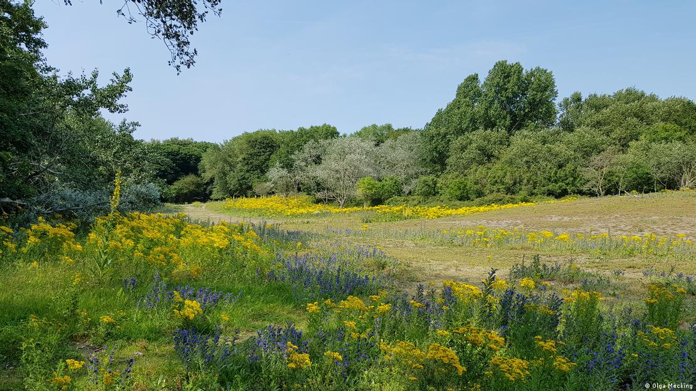
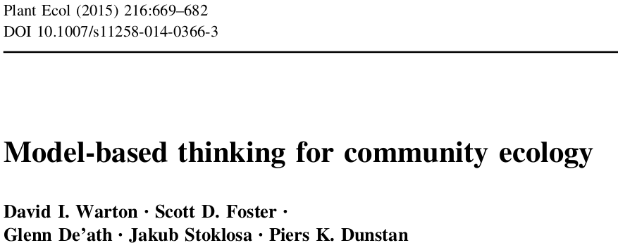
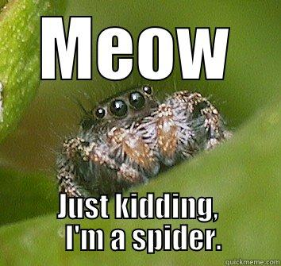
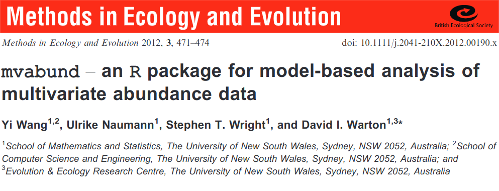

```{r setup, include=FALSE}
library(knitr)

default_source_hook <- knit_hooks$get('source')
default_output_hook <- knit_hooks$get('output')

knit_hooks$set(
  source = function(x, options) {
    paste0(
      "\n::: {.codebox data-latex=\"\"}\n\n",
      default_source_hook(x, options),
      "\n\n:::\n\n")
  }
)

knit_hooks$set(
  output = function(x, options) {
    paste0(
      "\n::: {.codebox data-latex=\"\"}\n\n",
      default_output_hook(x, options),
      "\n\n:::\n\n")
  }
)

knitr::opts_chunk$set(echo = TRUE)
```

# Outline

- Brief recap of sampling theory
- Generalised Linear Models background
  - Because GLLVMs are an extension
- Binomial, Poisson, Negative binomial
- Building on some material from [the GLM workshop](https://github.com/BertvanderVeen/GLM-workshop)

## Sampling data

{width=80%}

A meadow in the Dutch dunes.  \newline

How do we find the total number of species?

# Sampling

## How many plant species are there in this meadow?

\columnsbegin
\column{0.4\textwidth}

\column{0.6\textwidth}

```{r, cache = TRUE, echo = FALSE, fig.height = 5, fig.width = 5}
plot(0:10,0:10,xaxt="n",yaxt="n", type="n", xlab = NA, ylab=NA, xlim=c(0,10),ylim=c(0,10), yaxs="i", xaxs="i")
box(lwd=5)
abline(h=c(2,4,6,8,10), lwd = 2);abline(v=c(2,4,6,8,10), lwd = 2)
points(sample(seq(0,10,length.out=1000), 20, replace = TRUE),sample(seq(0,10,length.out=1000), 20, replace = TRUE), pch = 16, col = sample(1:4, 20, replace = TRUE), cex = 3)
```

We go into the meadow and count plants in quadrats. We find 4 species.
\columnsend

## Resampling the dunes

\columnsbegin
\column{0.5\textwidth}
```{r, cache = TRUE, echo = FALSE, fig.height = 5, fig.width = 5, out.width = "50%", fig.align = "right"}
plot(0:10,0:10,xaxt="n",yaxt="n", type="n", xlab = NA, ylab=NA, xlim=c(0,10),ylim=c(0,10), yaxs="i", xaxs="i")
box(lwd=5)
abline(h=c(2,4,6,8,10), lwd = 2);abline(v=c(2,4,6,8,10), lwd = 2)
points(sample(seq(0,10,length.out=1000), 20, replace = TRUE),sample(seq(0,10,length.out=1000), 20, replace = TRUE), pch = 16, col = sample(c(1,3,6), 20, replace = TRUE), cex = 3)
```
\column{0.5\textwidth}

```{r, cache = TRUE, echo = FALSE, fig.height = 5, fig.width = 5, out.width = "50%", fig.align = "left"}
plot(0:10,0:10,xaxt="n",yaxt="n", type="n", xlab = NA, ylab=NA, xlim=c(0,10),ylim=c(0,10), yaxs="i", xaxs="i")
box(lwd=5)
abline(h=c(2,4,6,8,10), lwd = 2);abline(v=c(2,4,6,8,10), lwd = 2)
points(sample(seq(0,10,length.out=1000), 20, replace = TRUE),sample(seq(0,10,length.out=1000), 20, replace = TRUE), pch = 16, col = sample(3:6, 20, replace = TRUE), cex = 3)
```
\columnsend

\columnsbegin
\column{0.5\textwidth}

```{r, cache = TRUE, echo = FALSE, fig.height = 5, fig.width = 5, out.width = "50%", fig.align = "right"}
plot(0:10,0:10,xaxt="n",yaxt="n", type="n", xlab = NA, ylab=NA, xlim=c(0,10),ylim=c(0,10), yaxs="i", xaxs="i")
box(lwd=5)
abline(h=c(2,4,6,8,10), lwd = 2);abline(v=c(2,4,6,8,10), lwd = 2)
points(sample(seq(0,10,length.out=1000), 20, replace = TRUE),sample(seq(0,10,length.out=1000), 20, replace = TRUE), pch = 16, col = sample(1:6, 20, replace = TRUE), cex = 3)
```

\column{0.5\textwidth}

```{r, cache = TRUE, echo = FALSE, fig.height = 5, fig.width = 5, out.width = "50%", fig.align = "left"}
plot(0:10,0:10,xaxt="n",yaxt="n", type="n", xlab = NA, ylab=NA, xlim=c(0,10),ylim=c(0,10), yaxs="i", xaxs="i")
box(lwd=5)
abline(h=c(2,4,6,8,10), lwd = 2);abline(v=c(2,4,6,8,10), lwd = 2)
points(sample(seq(0,10,length.out=1000), 20, replace = TRUE),sample(seq(0,10,length.out=1000), 20, replace = TRUE), pch = 16, col = sample(1:2, 20, replace = TRUE), cex = 3)
```

\columnsend

We resample the dune meadow, and find different numbers of species: 3, 3, 6, 2. And different compositions. On average we have found 3.5 species per quadrat.

## Sampling variation

1) Each time we sample, we have a slightly different sample
2) Each time we estimate a parameter, it might be slightly different due to this sampling variation
3) The more data we sample, the better we can represent this variability of our estimate
4) And the better we can represent the true richness/cover in the meadow

## Sampling variation

```{r, cache = TRUE, echo = FALSE, fig.height = 5, fig.width = 5, out.width = "5%", fig.align = "center", fig.show = "hold"}
for(i in 1:100){
plot(0:10,0:10,xaxt="n",yaxt="n", type="n", xlab = NA, ylab=NA, xlim=c(0,10),ylim=c(0,10), yaxs="i", xaxs="i")
box(lwd=5)
abline(h=c(2,4,6,8,10), lwd = 2);abline(v=c(2,4,6,8,10), lwd = 2)
points(sample(seq(0,10,length.out=1000), 20, replace = TRUE),sample(seq(0,10,length.out=1000), 20, replace = TRUE), pch = 16, col = sample(1:6, 20, replace = TRUE), cex = 3)
}
```

If we sample many times, we have an accurate picture of the whole meadow (and variability in the number of species in a quadrat that we might find).

## Sampling variation

```{r, cache = TRUE, echo = FALSE, fig.height = 3.5, fig.width = 3.5, fig.align = "center"}
plot(0:100,0:100,xaxt="n",yaxt="n", type="n", xlab = NA, ylab=NA, xlim=c(0,100),ylim=c(0,100), yaxs="i", xaxs="i")
box(lwd=3)
abline(h=seq(0,100,2), lwd = 0.5);abline(v=seq(0,100,2), lwd = 0.5)
points(sample(seq(0,100,length.out=1000), 2000, replace = TRUE),sample(seq(0,100,length.out=1000), 2000, replace = TRUE), pch = 16, col = sample(1:6, 2000, replace = TRUE), cex = 0.5)
```

If we sample in one large (field-sized) quadrat we also have an accurate picture of the whole meadow (and variability in the number of species in a quadrat that we might find).

## Classical approach

\columnsbegin
\column{0.5\textwidth}

Classically:

1) Decide on a distance
2) Fit an ordination
3) Make a plot
4) Do a hypothesis test

\column{0.5\textwidth}



\columnsend

## Statistical modeling

Instead of a focus on data, we consider the \textit{data generating process}

- We collect data
- Decide on a research question for \textit{the population}
- Learn about the variation in the data
  - Which requires formulating a model
- Work out distribution of the estimates
  - And find the "best" estimate
- Conclude if our answer is robust for the population (e.g., fields like this have more than 6 species)

# GLM background

## Generalised Linear Models

For when the assumptions of linear regression fail.

\columnsbegin
\column{0.5\textwidth}

\begin{itemize}
\item Linearity (straight line)
\item Independence of errors
\item Homoscedasticity (same variance for all errors)
\item Normality (distribution of errors)
\end{itemize}

\column{0.5\textwidth}


\columnsend

## Generalised linear models (GLMs)

GLMs as a framework were introduced by Nelder and Wedderburn (1972) uniting many different models. With a special focus on teaching statistics.

- Linear regression
- Logistic regression
- Probit regression
- Complementary log-log regression
- Log-linear regression
- Gamma regression

## Generalised linear models (2)

\columnsbegin
\column{0.5\textwidth}

GLMs extend the linear model framework
to address:

\begin{itemize}
\item Variance changes with the mean
\item Range of \textbf{y} is bounded
\end{itemize}
\column{0.5\textwidth}

{width=80%}

\columnsend
\textbf{The basis of many statistical models in Biology}

## Components of a GLM

- \textcolor{red}{Systematic component: $\eta$}
- \textcolor{blue}{Random component: data/distribution)}
- The link function: connects these components
  - This is not a data transformation
- The variance function

**But no explicit error term**

## GLM Likelihood

- We use MLE for estimation
- With a distribution in the "exponential family" (for fixed $\phi$)

All GLMs have the likelihood:

\begin{equation}
\mathcal{L}(y_i;\Theta) = \text{exp}\{\frac{y_i\textcolor{red}{\eta_i}-b(\textcolor{red}{\eta_i})}{a(\phi)} + c(y_i,\phi)\}
\end{equation}

## Generalised linear model

\begin{equation}
\begin{aligned}
 g\{\mathams{E}(y_i\vert x_i)\} &= \eta_i = \alpha + x_i\beta\\
 \mathams{E}(y_i\vert x_i) &= g^{-1}(\eta_i) = g^{-1}(\alpha + x_i\beta)
 \end{aligned}
\end{equation}

$\text{g}(\cdot)$ is the **link function**

## The link function

<!-- A smooth function with an inverse. -->

\columnsbegin
\column{0.5\textwidth}
- Is a smooth/monotone function
- Has an inverse $g^{-1}(\cdot)$
- Restricts the scale
- $\text{g}(\cdot)$ can be e.g.

\column{0.5\textwidth}

```{r, echo = FALSE, out.height="90%"}
x<-seq(binomial(link=logit)$linkinv(-5),binomial(link=logit)$linkinv(5),length.out=1000)
plot(x=binomial()$linkfun(x),x, cex.main = 5, cex.lab = 5, ylim = c(0,1), xlim = c(-5,5), type = "l", xlab=NA, ylab=NA, xaxt="n", yaxt="n")
abline(v=0,h=0,lty="dashed")
text(-3,.8,"Logit", cex=5)
```
\columnsend
\vspace*{-1.840\baselineskip}
\columnsbegin
\column{0.5\textwidth}

```{r, echo = FALSE, fig.align="center"}
x<-seq(poisson(link=log)$linkinv(-5),poisson(link=log)$linkinv(5),length.out=1000)
plot(x=poisson(link=log)$linkfun(x),x, cex.main = 5, xlim = c(-5,5), type = "l", xlab=NA, ylab=NA, xaxt="n", yaxt="n")
abline(v= 0, h = 0, lty="dashed")
text(-3,125,"Log", cex=5)
```

\column{0.5\textwidth}

```{r, echo = FALSE, fig.align="center"}
x<-seq(-5,5,length.out = 1000)
plot(x=x, 1/x, cex.main = 5, xlim =  c(-5,5),type = "l", xlab=NA, ylab=NA, xaxt="n", yaxt="n")
abline(v= 0, h = 0, lty="dashed")
text(-3,125,"Inverse", cex=5)
```

\columnsend

\vfill

## Variance function

Perhaps most critically, variance changes with the mean:

$$
\text{var}(y_i;\mu_i,\phi) = \frac{\partial^2g(\eta_i)}{\partial\eta_i^2} a(\phi)
$$

- $\phi$: the dispersion parameter, constant over observations
  - Fixed for some response distributions
- $a(\phi)$ is a function of the form $\phi/w_i$ \tiny (McCullagh and Nelder 1989)

## Assumptions

- No outliers
- Independence
- Correct distribution
- Correct link function
- Correct variance function (implied by previous two)

\textcolor{red}{We can check these assumptions with residual plots.}

## Fitting GLMs

Parameters in GLMs need to be estimated **iteratively**.

- More difficult to fit
- Requires numerical *optimisation*
- Susceptible to local convergence

\center

\textcolor{red}{Holds for GLLVMs too}

## Estimating GLMs

```{r, echo = FALSE}
set.seed(12345)
p.orchid = 0.4
n.picks = 100
n.times <- 50
y <- rbinom(n.times, size = n.picks, prob = p.orchid) # Collecting data
```


```{r, cache = TRUE, echo = FALSE, fig.height = 6}
par(mfrow=c(2,2))
ll <- function(p, n.picks, y)sum(dbinom(y, n.picks,p, log = TRUE))
phat <- seq(0.35,0.45,length.out=1000)
lls <- sapply(phat, ll, n.picks = n.picks, y = y)
grad.dbinom=function(y, n.picks, prob) {
    sum(y/prob - (n.picks - y)/(1-prob))
}

p = c(0.36,0.38,0.40, 0.42)
for(i in p){
b<-grad.dbinom(y,n.picks,i)
a<--b*i+ll(i,n.picks,y)
pphat <- phat[order(abs(phat-i),decreasing=FALSE)[1:200]]
plot(lls, x = phat, type = "l", xlab=expression(hat(pi)), ylab="log-Likelihood", lty = "dashed",main = i)
segments(x0=i,x1 = i, y0=ll(0.1,n.picks,y), y1= ll(i,n.picks,y), col="red", lty = "dotted")
lines(x=pphat,y=a+b*pphat, col = "red")
}
```

We need a good algorithm to find the maximum!

## Why is this important?

1) A basic (mathematical) understanding helps apply methods correctly.
2) GLMMs/GLLVMs may not always converge to the MLE. Then, you will get warnings/errors.
3) If you understand them, you might know what to do!

## Often used distributions in ecology

- Binomial: occurrence/counts. Presence of species, number of germinated seeds out of a total
- Poisson: counts. Abundance
- Negative binomial (fixed dispersion): counts. Number of species or abundance
- Gamma: (positive) continuous. Body size or biomass
- Ordinal (cumulative link). Cover classes
- Beta (logit link). Cover (note: not a GLM)

# Binomial

## Binomial GLM use

- When a linear regression is not appropriate :)
- For binary data or counts of successes/failures 

### In ecology

- Predicting species' distributions
- Number of germinated plant seeds
- Prevalence of disease in a population
- Probability of observing a behavior
- Proportion of orchids \emoji{upside-down-face}

## The binomial GLM

Link functions:

\begin{itemize}
\item Logit: $\log(\frac{\pi_i}{1-\pi_i})$ and inverse $\frac{\exp(\eta_i)}{1+\exp(\eta_i)}$ - \textit{the canonical link}
\item Probit: $\Phi^{-1}(\pi_i)$ and inverse  $\Phi(\eta_i)$
\item Complementary log-log: $\log(-\log(1-\pi_i)$ and inverse $1-\exp(-\exp(\eta_i))$
\item \sout{Log-log}
\end{itemize}

- Logit is canonical and easier to interpret
- Probit is sometimes easier mathematically than Logit
- Complementary log-log for counts

## Example: count of wolfspiders in Dutch dunes

- Data originally by [van der Aart et al. (1975)](https://brill.com/view/journals/njz/25/1/article-p1_1.xml?ebody=previewpdf-117261)
- Counts of 12 species, caught with pitfall traps

\hfill {width=50%}

## Spiders: the data

\center
A classical dataset that is commonly re-analyzed

\tiny
```{r, echo  =FALSE, message=FALSE, warning=FALSE}
data(spider, package = "mvabund")
knitr::kable(spider$abund, format="latex", booktabs = T)
```
\normalsize

## Spiders: the environmental data

\tiny
```{r, echo  =FALSE, message=FALSE, warning=FALSE}
knitr::kable(spider$x, format="latex", booktabs = T)
```
\normalsize

- Six environmental variables
  - Soil dry matter content
  - Cover of bare sand
  - Cover of leaves
  - Cover of moss
  - Cover of herb layer
  - Reflection of the soil surface

## Spiders: to long format

\footnotesize
```{r, echo  = TRUE, message=FALSE, warning=FALSE}
data <- data.frame(spider$abund, spider$x, total = rowSums(spider$abund))
datalong <- reshape(data, 
                    varying = colnames(spider$abund), 
                    v.names = "Count", 
                    idvar = "Site", 
                    timevar = "Species", 
                    direction = "long")

datalong$Species <- factor(datalong$Species, 
                           labels = colnames(spider$abund))
```

\normalsize

## Spiders: visually inspect the data

```{r, echo = FALSE, fig.height = 6, warning=FALSE}
par(mfrow=c(3,4))
for(i in 1:12){
plot(Count/total~soil.dry, data = datalong[datalong$Species==colnames(spider$abund)[i],], ylab = "Proportion of total", xlab="Soil dry matter content", main = colnames(spider$abund)[i])  
  lines(smooth.spline(datalong[datalong$Species==colnames(spider$abund)[i],]$Count/datalong[datalong$Species==colnames(spider$abund)[i],]$total~datalong[datalong$Species==colnames(spider$abund)[i],]$soil.dry, cv = TRUE, df = 3), col = "red")
}
```

\centering 

Is there a community-level trend?

## Spiders: fit a model

\footnotesize
```{r}
model1 <- glm(cbind(Count, total)~soil.dry, 
             data = datalong, family="binomial")
coef(model1)
```

\normalsize

- cbind: combines two vectors as columns
- total is the site sum (total spiders at a site)
- Canonical link is used by default
- Intercept and Soil.dry effects are the same for all species

## Modeling spiders

1) Is the same effect for all species realistic?
2) Is the same (average) probability of occurrence for all species realistic?

## Spiders: species-specific effects

\small
```{r}
model2 <- glm(cbind(Count, total)~soil.dry*Species, 
             data = datalong, family="binomial")
```

\normalsize

- One intercept per species, relative to the first species
- One soil.dry effect per species, relative to that of the first species
- \textcolor{red}{one dispersion parameter for all species}

## Binomial regression: interpreting coefficients

\tiny
```{r}
coef(model2)
```

\footnotesize

- Odds for species 1 at soil.dry 0 is `exp(1.13) = 3.10`
- This decreases by `exp(-1.7509)` for every unit of soil dry matter content `3.10*exp(soil.dry*-1.7509) = 3.10*0.17 = 0.527`

## Multispecies modeling

1) Fundamental niche: species have their own preferred environmental conditions ("gleasonian")
2) Some species might still like similar conditions
3) We might be able to separate a community-level effect (e.g., with GLMMs)

## \texttt{mvabund}



GLMs for multiple species (vector GLMs)

# Poisson

## Typical count cases

When the maximum count is not fixed:

- Number of species
- Individuals at a location
  - Pidgeons in a city
- [Bigfoot reports](https://zslpublications.onlinelibrary.wiley.com/doi/abs/10.1111/jzo.13148)
- Wrongful convictions
- Stars in the night sky

## Counts: a multiplicative process

Say that we have the model:

\begin{equation}
\log(\lambda) = \alpha+x_i\beta
\end{equation}

- with $\alpha = 1$ and $\beta = \log(2) \approx 0.693$
- $x_i$ is either 0 or 1: either I was fishing or you were
- `exp(1) = 2.71828` the average number of fish I caught
- `exp(1+log(2)) = exp(1)*2 = 5.437` the average number of fish you caught

So, you caught twice as many fish!

## Poisson assumptions

- An event can occur $0 \ldots\infty$ times
- Events are independent
- The rate of events is constant
- Events cannot occur simultaneously
- \textcolor{red}{\textbf{Variance equals the mean}}

## Example: spiders with \texttt{mvabund}

```{r}
Y <- mvabund::mvabund(spider$abund)
model3 <- mvabund::manyglm(Y ~ soil.dry, 
             family = "poisson", data = spider$x)
```

Here, we assume that the total site abundance is not fixed

## Log-linear regression: interpreting parameters

\columnsbegin
\column{0.5\textwidth}

- A multiplicative process
- (Intercept) = species \textbf{a} log-abundance at soil.dry 0
- Soil dry: `exp(-0.97) = 0.38`, so half the count by `log(0.5)/-0.97 = 0.7145847` increase in soil dry matter content

\column{0.5\textwidth}

```{r, echo = FALSE, fig.height = 12}
par(mar=c(5,8,4,1)+.1)
mvabund::coefplot(model3, cex.ylab = 2, cex.lab = 2, cex.axis = 2)
```

\columnsend

# Negative binomial

## Overdispersion

Our assumption: $\lambda = \text{var}(\textbf{y})$ \newline
Reality: $\lambda \geq \text{var}(\textbf{y}) = \mu + \mu^2\phi$

- Mean = variance
- If there is more variation, this assumption fails
- Consequences: CIs underestimate, biased parameter estimates, inflation in model selection

For our example: spiders generally occur at low abundances, but some places have an extrodinarily large amount of spiders

## Dealing with dispersion: options

- Correct for it (calculate dispersion)
- Fit a different model
  - Negative binomial (overdispersion, \texttt{MASS package})
  - Conway-Maxwell Poisson
  - Generalized Poisson
  - Quasi-likelihood models (not covered here)
  - Mixed models

## Negative binomial distribution

\begin{equation}
\mathcal{L}(y_i;\Theta) = \frac{\Gamma(y_i+\phi)}{\Gamma(\phi)y_i!}\biggl(\frac{\phi}{\mu_i+\phi}\biggr)^\phi \biggl(\frac{\mu_i}{\mu_i+\phi}\biggr)^{y_i}
\end{equation}

- $\text{var}(\textbf{y}) = \symbf{\mu} + \frac{\symbf{\mu}^2}{\phi}$
- For large $\phi$ Poisson!
- Requires more data/information due to extra parameter

## Spiders: residuals vs. fitted

\footnotesize
```{r, fig.height = 4, echo = FALSE}
plot(model3, which = 1)
polygon(x=c(-5,-5,4.5,8), y= c(0,0,10,-8), 
        col = adjustcolor("red", alpha.f=0.5), border = "red")
```

\normalsize

- Residuals fan out: variance increases with the mean
- Count data usually have quadratic mean-variance
- Needs to be accounted for

## Spiders: negative-binomial regression

\footnotesize

```{r}
model4 <- model3 <- mvabund::manyglm(Y ~ soil.dry, 
             family = "negative.binomial", data = spider$x)
```

\normalsize 

```{r, fig.height = 3.8}
plot(model4, which = 1)
```

The residuals look much better.

## Spiders: negative-binomial regression

\columnsbegin
\column{0.5\textwidth}

- Uncertainty has become much larger
- Coefficients have changed

\column{0.5\textwidth}


```{r, echo = FALSE, fig.height = 12}
par(mar=c(5,8,4,1)+.1)
mvabund::coefplot(model4, cex.ylab = 2, cex.lab = 2, cex.axis = 2)
```

\columnsend

# Spiders: hypothesis testing

```{r, echo = FALSE, cache = TRUE}
anova(model4)
```

- Hypothesis testing via **simulation**, so can be slow
- Can be species-specific as well as over the whole model in \texttt{mvabund}
- Robust to misspecified correlation structure

# Spiders: hypothesis testing

\footnotesize

```{r, echo = FALSE, cache = TRUE}
anova(model4, cor.type = "R")
```


# Summary

- We use statistical modeling to find an answer to our question, and incorporate uncertainty
- Always start by assessing properties of your data, and formulate a question
- Most ecological data exhibit strong mean-variance relationships
- Accounting for such properties of data is important
  - To make sure we get a valid result
- Multispecies data requires formulating a hypothesis for community/species trends
  - More data $\to$ more reflection
