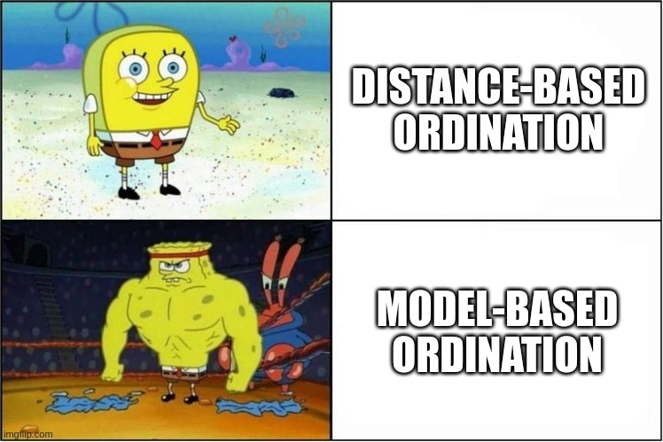
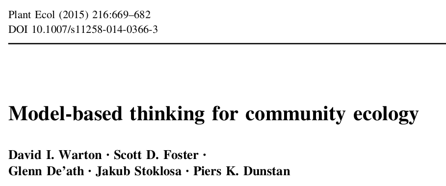
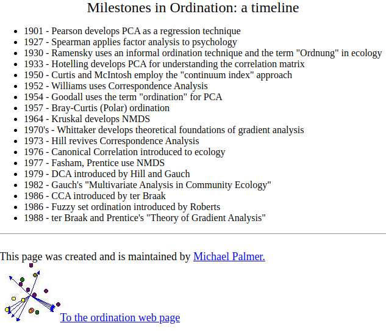
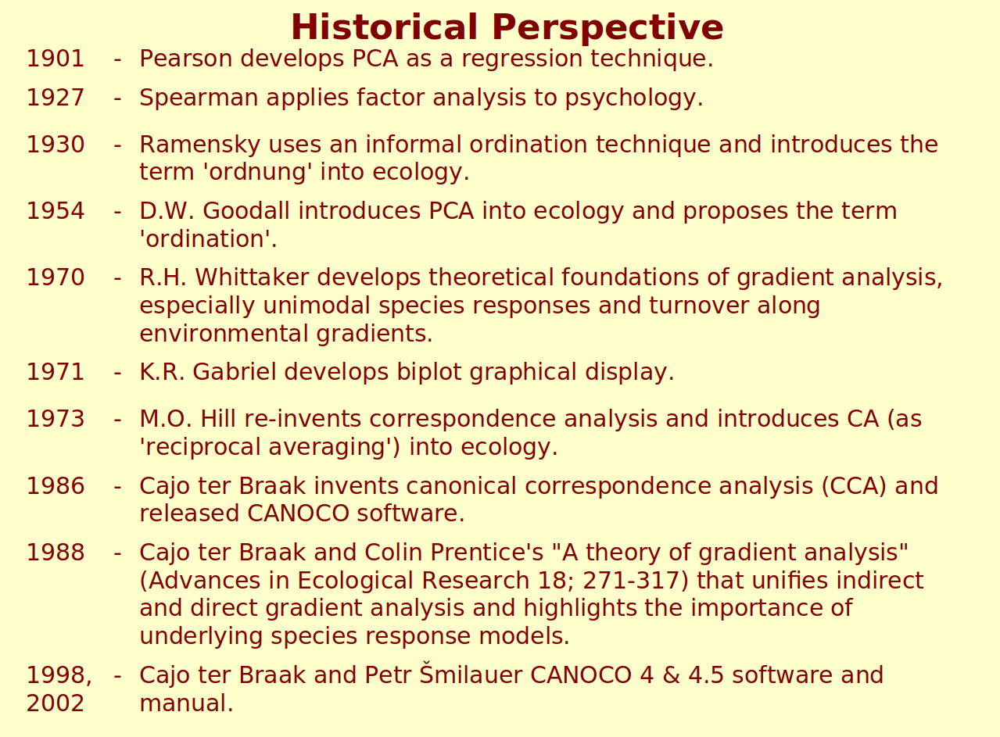
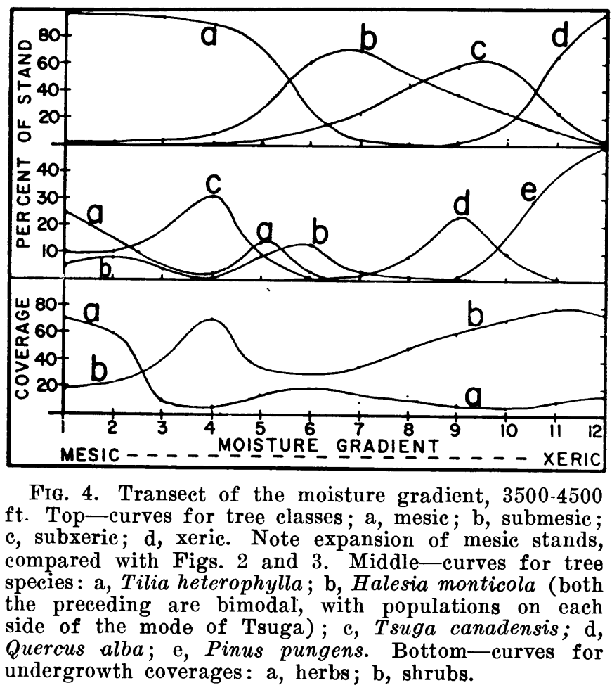
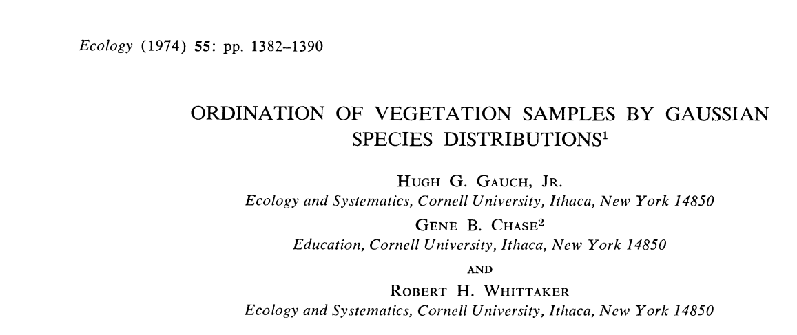
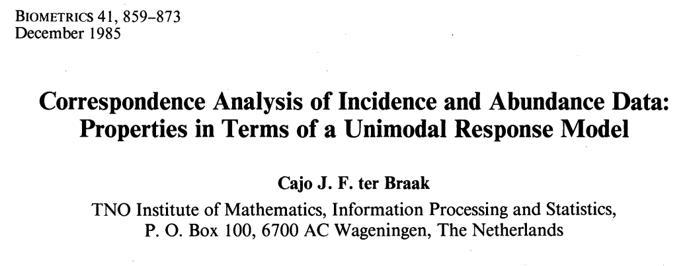
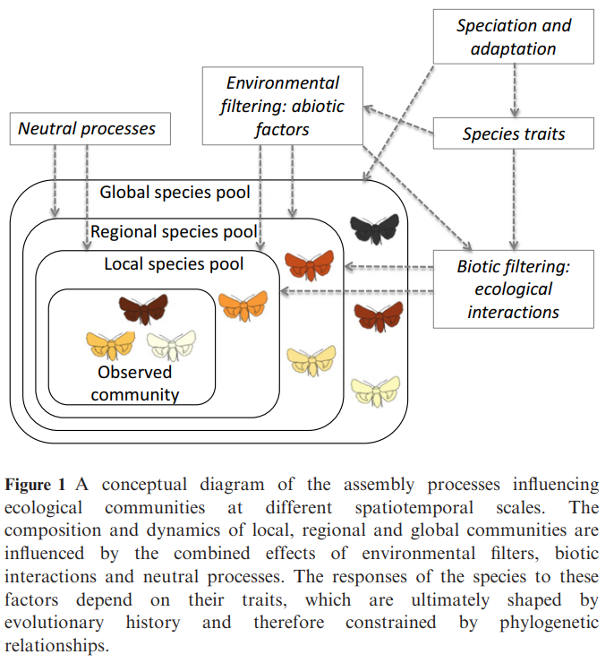

```{r setup, include=FALSE}
library(knitr)

default_source_hook <- knit_hooks$get('source')
default_output_hook <- knit_hooks$get('output')

knit_hooks$set(
  source = function(x, options) {
    paste0(
      "\n::: {.codebox data-latex=\"\"}\n\n",
      default_source_hook(x, options),
      "\n\n:::\n\n")
  }
)

knit_hooks$set(
  output = function(x, options) {
    paste0(
      "\n::: {.codebox data-latex=\"\"}\n\n",
      default_output_hook(x, options),
      "\n\n:::\n\n")
  }
)

knitr::opts_chunk$set(echo = TRUE)
```

# Welcome! \emoji{smile}

\center
{width=60%}

# Intro

[See github for all material](https://github.com/BertvanderVeen/GLLVM-workshop)

Sessions from 14:00 to 20:00 (Monday to Thursday). Sessions will consist of a mix of lectures, in-class discussion, and practical exercises / case studies over Slack and Zoom.

* Monday: Recap and background
* Tuesday: gllvm R-package, classical ordination vs. model-based ordination, unimodal responses
* Wednesday: Ordination with covariates, JSDM, tools, tips and tricks
* Thursday: Beyond \texttt{gllvm}

## How we will do it

Lectures of about 45 minutes \newline
Practicals of about 60 minutes: datasets and R

  - Practical "tasks" serve as guide, not as exhaustive exercise
  - Short, live, demonstrations
  - Then go and explore yourself (and potentially answer practicals)

## Thursday

1. Other \texttt{R}-packages for GLLVMs/JSDMs
2. A brief look at Hierarchical ordination
3. Own data analysis/questions/suggestions
4. Practical option: Applying a few Machine learning methods for ordination (UMAP, LLE, Laplacian eigenmaps, t-SNE, etc.)
 
How does that sound?

## What I hope you take away

1. The \texttt{gllvm} \texttt{R}-package is great!
2. Performing ordination well is hard work
3. Model-based ordination methods do many things better (data properties, diagnostics)
4. One framework for all ordination tools

\center
{width=50%}

## Detailed outline today

* Generalised linear model (GLM) recap
* Practical: `glm` and `mvabund::manyglm`
* Generalised linear mixed model (GLMM) recap
* Practical: `glmmTMB
* Recap classical ordination methods and concepts

\begin{center}
\textcolor{red}{15 minute break 15:45-16:00}
\end{center}
\vspace*{-\baselineskip}
\begin{center}
\textcolor{red}{45 minute break 17:45-18:30}
\end{center}

## Logistics

[All material on github](https://github.com/BertvanderVeen/GLLVM-workshop)

Please make sure you've downloaded data and updated R/packages

## \texttt{R}-packages

- gllvm
- glmmTMB
- mvabund
- HMSC
- sjSDM
- ecopCopula
- labdsv
- umap
- Rdimtools
- vegan
- boral

## Some resources on classical ordination

- [David Zeneley's website](https://www.davidzeleny.net/anadat-r/doku.php/en:ordination)
- [Michael Palmer's website](https://ordination.okstate.edu/overview.htm)
- [Numerical ecology](https://shop.elsevier.com/books/numerical-ecology/legendre/978-0-444-53868-0)
- [Numerical ecology with R](https://link.springer.com/book/10.1007/978-1-4419-7976-6)
- [Data analysis in Community and Landscape cology](https://www.cambridge.org/core/books/data-analysis-in-community-and-landscape-ecology/CF8B1E39A3A586FF7A3C76B514EA96A5)
- [Analysis of ecological communities](https://www.wildblueberrymedia.net/store/analysis-of-ecological-communities)

## Resources on model-based ordination

- [Some of my other workshop repositories](https://github.com/BertvanderVeen)
- [gllvm vignette website](https://jenniniku.github.io/gllvm/)
- [Oxford libraries article](https://www.oxfordbibliographies.com/display/document/obo-9780199830060/obo-9780199830060-0003.xml)
- [Warton 2022](https://link.springer.com/book/10.1007/978-3-030-88443-7)
- [Fahrmeir and Tutz 2001](https://www.amazon.com/Multivariate-Statistical-Modelling-Generalized-Statistics/dp/0387951873)
- [Ovaskainen and Abrego](https://www.cambridge.org/core/books/joint-species-distribution-modelling/0D9FA93EA1DD408332A17266449668B3)
- [Bartholomew et al. 2011](https://onlinelibrary.wiley.com/doi/book/10.1002/9781119970583)
- [Skrondal and Rabe-Hesketh 2004](https://www.taylorfrancis.com/books/mono/10.1201/9780203489437/generalized-latent-variable-modeling-anders-skrondal-sophia-rabe-hesketh)

## Some recommended reading

\columnsbegin
\column{0.5\textwidth}

- [Halvorsen (2012)](http://nhm2.uio.no/botanisk/nbf/temp/Sommerfeltia_35_20121206_PRESS.pdf)
- [Wang et al. (2012)](https://besjournals.onlinelibrary.wiley.com/doi/10.1111/j.2041-210X.2012.00190.x)
- [Warton et al. (2012)](https://besjournals.onlinelibrary.wiley.com/doi/abs/10.1111/j.2041-210X.2011.00127.x)
- [Clark et al. (2014)](https://esajournals.onlinelibrary.wiley.com/doi/abs/10.1890/13-1015.1)
- [Warton et al. (2015)](https://doi.org/10.1016/j.tree.2015.09.007)
- [Warton et al. (2015)](https://link.springer.com/article/10.1007/s11258-014-0366-3)
- [Hui et al. (2015)](https://besjournals.onlinelibrary.wiley.com/doi/10.1111/2041-210X.12236)
- [Pollock et al. (2015)](https://besjournals.onlinelibrary.wiley.com/doi/10.1111/2041-210X.12180)
- [ter  Braak and Smilauer (2015)](https://link.springer.com/article/10.1007/s11258-014-0356-5)
- [Hui et al. (2017)](https://www.tandfonline.com/doi/abs/10.1080/10618600.2016.1164708)
- [Niku et al. (2017)](https://link.springer.com/article/10.1007/s13253-017-0304-7)
- [Ovaskainen et al. (2017)](https://onlinelibrary.wiley.com/doi/full/10.1111/ele.12757)

\column{0.5\textwidth}

- [Roberts (2017)](https://besjournals.onlinelibrary.wiley.com/doi/full/10.1111/2041-210X.12739)
- [Warton et al. (2017)](https://besjournals.onlinelibrary.wiley.com/doi/abs/10.1111/2041-210X.12843)
- [Niku et al. (2019)](https://besjournals.onlinelibrary.wiley.com/doi/abs/10.1111/2041-210X.13303)
- [Niku et al. (2019)](https://journals.plos.org/plosone/article?id=10.1371/journal.pone.0216129)
- [Roberts (2019)](https://esajournals.onlinelibrary.wiley.com/doi/abs/10.1002/ecy.2908)
- [Paul (2020)](https://www.sciencedirect.com/science/article/abs/pii/S1574954120301096)
- [Zurell et al. (2020)](https://onlinelibrary.wiley.com/doi/abs/10.1111/jbi.13608)
- [van der Veen et al. (2021)](https://besjournals.onlinelibrary.wiley.com/doi/full/10.1111/2041-210X.13595)
- [Blanchet et al. (2022)](https://onlinelibrary.wiley.com/doi/abs/10.1111/ele.13525)
- [van der Veen (2022)](https://ntnuopen.ntnu.no/ntnu-xmlui/handle/11250/2980780)
- [van der Veen et al. (2023)](https://besjournals.onlinelibrary.wiley.com/doi/full/10.1111/2041-210X.14035)

\columnsend

## Resources that cover all kinds of ordination methods

(none)

## Motivation



## Motivation

- We need formal, probabilistic, models for community ecology
- That incorporate data properties, rather than transforming our way out of them
- It makes for better/clearer inference
- For nicer for teaching
- Access to tools for testing assumptions
- Overall more flexibility

## Why GLLVMs?

GLLVMs are a formal statistical, fully probabilistic, tool for ordination.

1) To step up your multivariate analysis
2) Maybe you want to incorporate random effects
3) To negate the need of distances

## Disclaimer

- There will be some equations
- \texttt{gllvm} is in active development (some bugs expected, feature requests are very welcome)

# Introduction

## What is this presentation about?

- Part I: a brief history of multivariate analysis (ordination)
- Part II: The JSDM
- Part III: Model-based ordination

## Multivariate analysis

\columnsbegin
\column{0.5\textwidth}

```{r echo=F, fig.align="center", fig.cap="CCA of dune data", message=FALSE}
library(vegan)
data(dune)
data("dune.env")
plot(vegan::cca(dune,dune.env))
```

\column{0.5\textwidth}

```{r echo=F, fig.align="center", fig.cap="JSDM of spider data", fig.show="hold", message=FALSE}
library(gllvm)
data(spider,package="mvabund")
mod <- gllvm(spider$abund,num.lv=2,family="negative.binomial",row.eff="random")
corrplot::corrplot(getResidualCor(mod),type = "lower",order = "AOE")

```

\columnsend

## Use of ordination
 
- One of the most used methods of multivariate analysis 
  - but definitely not the only one
- Arranges species and samples in a low-dimensional space
  - or any column and row quantity really
- Summarizes data
- Find underlying structures (gradients/LVs)

# History

## A brief history of ordination

- Thoughts from community ecology perspective
- A long history

### And me:

```{r,out.width="70%",out.height="70%", fig.align="center", echo=F}

```

## A brief history of ordination

\columnsbegin
\column{0.5\textwidth}

```{r, fig.align="center", echo=F, out.width="99%"}

```

\column{0.5\textwidth}

```{r, fig.align="center", echo=F, out.width="99%"}

```

\columnsend

- Inspired by Michael Palmer's and John Birk's
- But in need of a little update

## In the beginning, there were PCA and FA

```{r, fig.width=15, echo = FALSE, message=FALSE, warning = FALSE}
#see https://stackoverflow.com/questions/7492274/draw-a-chronological-timeline-with-ggplot2
library(ggplot2)
library(dplyr)
library(cowplot)
library(tibble)
library(ggalt)
library(lubridate)

#Create data to plot
data <- tribble( ~start_date, ~event, ~displ,
                ymd("1901-01-01"), "PCA", 0.5,
                ymd("1904-01-01"), "FA", 0.2,
                ymd("1935-01-01"), "CA", 0.5,
                ymd("1936-01-01"), "LDA", 0.2,
                ymd("1936-01-01"), "COR", 0.3,
                ymd("1951-01-01"), "RRR", 0.5,
                ymd("1954-01-01"), "'Ordination'", -0.5,
                ymd("1954-01-01"), "'Gaussian' curve", -0.2,
                ymd("1957-01-01"), "PO", 0.5,
                ymd("1964-01-01"), "RDA", 0.8,
                ymd("1964-01-01"), "NMDS", 0.2,
                ymd("1966-01-01"), "PCoA", 0.5,
                ymd("1970-01-01"), "INDSCAL", 0.9,
                ymd("1970-01-01"), "Whittaker's Gradient analysis", -0.5,
                ymd("1971-01-01"), "Biplot", -0.8,
                ymd("1972-01-01"), "GLM", -1,
                ymd("1973-01-01"), "RA", -1.3,
                ymd("1974-01-01"), "GO", 0.8,
                ymd("1975-01-01"), "MIMIC", 0.7,
                ymd("1979-01-01"), "DCA", 0.5,
                ymd("1979-01-01"), "TWINSPAN", -1.2,
                ymd("1983-01-01"), "constrained NMDS", 0.4,
                ymd("1985-01-01"), "CA unimodal model", -1.1,
                ymd("1986-01-01"), "Canoco", -0.9,
                ymd("1987-01-01"), "Minchin evaluates NMDS", -0.7,
                ymd("1986-01-01"), "CCA", 0.3,
                ymd("1988-01-01"), "Theory of \n gradient analysis", -0.2,
                ymd("1990-01-01"), "I was born", 1,
                ymd("1999-01-01"), "PRC", 0.2,
                ymd("1999-01-01"), "db-RDA", 0.5,
                ymd("1999-01-01"), "Probabilistic PCA", 0.6,
                ymd("2001-01-01"), "vegan", -0.6,
                ymd("2005-01-01"), "Nothing?", -0.1,
                ymd("2010-01-01"), "Nothing??", -0.5,
                ymd("2020-01-01"), "Still nothing?!", -0.9)
col=ifelse(data$displ>0,"white","transparent")
# data[data$displ>0,"displ"]<-sort(data[data$displ>0,]$displ,decreasing = F)#its about incremental improvement
                #ymd("2001-01-01"), "R vegan", -0.5)
#add Yee, Hui, JSDM, VGAM, MGLM, GLLVM, Copula, etc, DCA, NMDS, RDA, PCoA, PRC, add a break for where usual stops, UMAP, t-SNE, 

#Function to shift x-axis to 0 adapted from link shown above

shift_axis <- function(p, xmin, xmax, y=0){
      g <- ggplotGrob(p)
      dummy <- data.frame(y=y)
      ax <- g[["grobs"]][g$layout$name == "axis-b"][[1]]
      p + annotation_custom(grid::grobTree(ax, vp = grid::viewport(y=1, height=sum(ax$height))), 
                            ymax=y, ymin=y) +
        annotate("segment", y = 0, yend = 0, x = xmin, xend = xmax) +
        theme(axis.text.x = element_blank(), 
              axis.ticks.x=element_blank())

    }


#Conditionally set whether text will be above or below the point
vjust = ifelse(data$displ > 0, -1, 1.5)

#plot
p1 <- data %>% 
  ggplot(aes(start_date, displ)) + theme_classic()+
  geom_lollipop(point.size = 1, shape = 2, col = col) +
  geom_text(aes(x = start_date, y = displ, label = event), col = col, data = data,
            hjust = 0, vjust = vjust, size = 5) +
  theme(axis.title = element_blank(),
        axis.text.y = element_blank(),
        axis.ticks.y = element_blank(),
        axis.line = element_blank(),
        axis.text.x = element_text(size = 12)) +
  expand_limits(x = c(ymd("1900-01-01"), ymd("2023-01-01")), y = 1.2) +
  scale_x_date(breaks = scales::pretty_breaks(n = 9))

#and run the function from above
timeline <- shift_axis(p1, ymd("1900-01-01"), ymd("2030-01-01"))

# use to permanently change color of entries
set_col <- function(obj,idx,col.old=c("white","transparent"),col.new){
obj$layers[[2]]$aes_params$colour[obj$layers[[2]]$aes_params$colour%in%col.old][idx]<-col.new
obj$layers[[1]]$aes_params$colour[obj$layers[[1]]$aes_params$colour%in%col.old][idx]<-col.new
obj<-obj+coord_cartesian(clip="off")+theme(plot.margin=margin(0,6,0,0,"cm"))
return(obj)
}
set_col(timeline,1:2,"white","black")
```

## Then, CA was developed

```{r, fig.width=15, echo = FALSE, message=FALSE}
set_col(timeline,1:3,"white","black")
```


## Next, reduced rank regression

```{r, fig.width=15, echo = FALSE, message=FALSE}
set_col(timeline,1,"white","black")
```

## Then, there was "Ordination"

```{r, fig.width=15, echo = FALSE, message=FALSE}
timeline <- set_col(timeline,1:2,"transparent","red")
set_col(timeline,1,"white","black")
timeline<-set_col(timeline,1:2,"red","grey")
```

## Whittaker 1956: Unimodal responses

```{r,out.width="60%",out.height="60%", fig.align="center", echo=F}

```

## Ordination became popular

```{r, fig.width=15, echo = FALSE, message = FALSE}
timeline <- set_col(timeline,1:3,"white","black")
set_col(timeline,1:4,"transparent","red")
timeline <- set_col(timeline,1:4,"red","grey")
```

## Mark Hill's contributions & MIMIC

```{r, fig.width=15, echo = FALSE, message = FALSE}
timeline <- set_col(timeline,1,"transparent","grey")
set_col(timeline,1:5,"white","black")
```

## CTB did his PhD

```{r, fig.width=15, echo = FALSE, message = FALSE}
timeline <- set_col(timeline,1:2,"transparent","red")
set_col(timeline,1,"white","black")
timeline <- set_col(timeline,1:2,"red","grey")
```

- The unimodal model continued

## Unimodal model (2)

```{r,out.width="70%",out.height="70%", fig.align="center", echo=F}

```
```{r,out.width="70%",out.height="70%", fig.align="center", echo=F}

```

## NMDS was shown to be "better"

```{r, fig.width=15, echo = FALSE, message = FALSE}
set_col(timeline,1,"transparent","red")
timeline<-set_col(timeline,1,"red","grey")
```

- The unimodal model
- Development of CCA

## Are species response curves symmetric?

```{r,out.width="70%",out.height="70%", fig.align="center", echo=F}
knitr::include_graphics("Minchin_1987.png")
```

- Skewed might be more realistic
- NMDS is "robust"
- Moving away from process-based

## Results Minchin dataset

```{r, echo=F, message=F, warning=F, fig.height = 6}
library(gllvm)
library(vegan)
# Download the minchin dataset
minchin <- read.csv("https://raw.githubusercontent.com/BertvanderVeen/Examples/master/Minchin87_2b_counts.csv") # Data frmo minchin 1987
# All missing values are zeros
minchin[is.na(minchin)] <- 0
minchin<-minchin[,-1]
# We will first do some classical ordination methods
# Correspondence analysis
CA_minchin <- cca(minchin)
# Detrended CA
DCA_minchin <- decorana(minchin)
logDCA_minchin <- decorana(log1p(minchin))

# NMDS
NMDS_minchin <- metaMDS(minchin, k = 2, trace = F)
par(mfrow=c(2,2))
# Let's have a look at the results
plot(scores(CA_minchin,display="sites"), main="CA",col=rep(1:4,each=12),pch=rep(1:4,each=12), cex = 1.5) # arch effect
plot(scores(DCA_minchin)[,1:2], main="DCA",col=rep(1:4,each=12),pch=rep(1:4,each=12), cex = 1.5) # This has the tongue effect
plot(scores(logDCA_minchin, display="sites"), main="log-DCA",col=rep(1:4,each=12),pch=rep(1:4,each=12), cex = 1.5) # suggestion from paper CTB
plot(NMDS_minchin$points, main="NMDS",col=rep(1:4,each=12),pch=rep(1:4,each=12), cex = 1.5) # This looks pretty OK!
```

## A theory of gradient analysis

```{r, fig.width=15, echo = FALSE, message = FALSE}
set_col(timeline,1,"transparent","red")
timeline<-set_col(timeline,1,"red","grey")
```

\footnotesize{
"Ter Braak and Prentice (1988) developed a theoretical unification of ordination techniques, hence placing gradient analysis on a firm theoretical foundation." (Michael Palmer)
}

## I was born

```{r, fig.width=15, echo = FALSE, message = FALSE}
set_col(timeline,1,"white","gold")
timeline<-set_col(timeline,1,"gold","gray")
```

## vegan

```{r, fig.width=15, echo = FALSE, message = FALSE}
timeline <- set_col(timeline,1:3,"white","black")
set_col(timeline,1,"transparent","red")
timeline <- set_col(timeline,1,"red","gray")
```

## Things slowed down

### Ordination became "descriptive" and uncool

```{r timeline, fig.align="center", fig.width=15, echo = FALSE, message = FALSE}
timeline+coord_cartesian(clip="off")+theme(plot.margin=margin(0,6,0,0,"cm"))
```

## Ordination is well established

- one of the successes currently: so many resources!
  - vegan, anadat
  - many books, websites (Michael Palmer, David Zeleney)
  - I.e., run a search and you will find the answer
- Contemporary ordination methods, not so much (yet)

## Updating the ordination timeline

```{r timeline3, fig.align="center", fig.width=15, echo = FALSE}
#see https://stackoverflow.com/questions/7492274/draw-a-chronological-timeline-with-ggplot2
library(ggplot2)
library(dplyr)
library(cowplot)
library(tibble)
library(ggalt)
library(lubridate)
library(scales)
#Create data to plot
data <- tribble( ~start_date, ~event, ~displ,
                ymd("1996-01-01"), "GTM", 0.5,
                ymd("2000-01-01"), "IsoMap", 0.4,
                ymd("2000-01-01"), "LLE", 0.5,
                ymd("2000-01-01"), "RRVGLM", 0.6,
                ymd("2003-01-01"), "LA-eigenmaps", 0.4,
                ymd("2004-01-01"), "MVU", 0.6,
                ymd("2004-01-01"), "co-CA", 0.3,
                ymd("2004-01-01"), "GLLVM", 0.8,
                ymd("2004-01-01"), "CQO", 0.7,
                ymd("2005-01-01"), "CAO", 0.5,
                ymd("2005-01-01"), "OpenBugs", -0.5,
                ymd("2008-01-01"), "t-SNE", 0.5,
                ymd("2011-01-01"), "Infinite Factors", -0.5,
                ymd("2011-01-01"), "REO", 0.5,
                ymd("2012-01-01"), "Mvabund", -1.2,
                ymd("2013-01-01"), "INLA", -0.1,
                ymd("2013-01-01"), "VAE", -0.3,
                ymd("2010-01-01"), "JSDM(1)", 0.2,
                ymd("2014-01-01"), "RCIM", 0.8,
                ymd("2015-01-01"), "JSDM(2)", -0.2,
                ymd("2015-01-01"), "Model-based thinking", -0.5,
                ymd("2015-01-01"), "Model-based unconstrained ordination", 0.6,
                ymd("2015-01-01"), "Unconstrained ordination with MCMC", -1,
                ymd("2015-01-01"), "Spatial FA", 0.3,
                ymd("2016-01-01"), "Boral", -0.6,
                ymd("2016-01-01"), "TMB", -0.2,
                ymd("2017-01-01"), "glmmTMB", -0.4,
                ymd("2017-01-01"), "HMSC", -1.3,
                ymd("2017-01-01"), "Environment constrained species loadings", 0.9,
                ymd("2017-01-01"), "Nimble", -0.3,
                ymd("2018-01-01"), "dCCA", 0.8,
                ymd("2018-01-01"), "UMAP", 0.5,
                ymd("2018-01-01"), "H-p ordination", 0.7,
                ymd("2019-01-01"), "RCIM(2)", 0.6,
                ymd("2019-01-01"), "TRIMAP", 0.3,
                ymd("2019-01-01"), "gllvm", -0.5,
                ymd("2020-01-01"), "R-HMSC", -1,
                ymd("2020-01-01"), "Ordination with imperfect detection", 0.4,
                ymd("2020-01-01"), "Roberts tests Boral", -0.1,
                ymd("2020-01-01"), "Comparison model-based & distance-based", -0.8,
                ymd("2020-01-01"), "CI in biplot", -0.3,
                ymd("2021-01-01"), "'Generalized matrix factorization'", -.7,
                ymd("2021-01-01"), "glmmTMB(RR)", -0.4,
                ymd("2021-01-01"), "UQO", 0.3,
                ymd("2022-01-01"), "ecoCopula", 0.1,
                ymd("2022-01-01"), "CNO", 0.5,
                ymd("2023-01-01"), "HO", 0.7,
                )
col=ifelse(data$displ>0,"black","grey")
                #ymd("2001-01-01"), "R vegan", -0.5)
#add Yee, Hui, JSDM, VGAM, MGLM, GLLVM, Copula, etc, DCA, NMDS, RDA, PCoA, PRC, add a break for where usual stops, UMAP, t-SNE, 


#functions to revert x date scale see https://github.com/tidyverse/ggplot2/issues/4021

scale_x_date2 <- function(..., rescaler) {
  x <- scale_x_date(...)
  x$rescaler <- rescaler
  x
}

# The default `to` argument of the `rescale()` function is `c(0, 1)`.
# Here, we reverse that.
invert_scale <- function(x, to = c(1, 0), from = range(x)) {
  rescale(x, to, from)
}


#Conditionally set whether text will be above or below the point
vjust = ifelse(data$displ > 0, -1, 1.5)

#plot
p1 <- data %>% 
  ggplot(aes(start_date, displ)) + theme_classic()+
  geom_lollipop(point.size = 1, shape = 2, col = col) +
  geom_text(aes(x = start_date, y = displ, label = event), col = col, data = data,
            hjust = -0, vjust = vjust, size = 5) +
  theme(axis.title = element_blank(),
        axis.text.y = element_blank(),
        axis.ticks.y = element_blank(),
        axis.line = element_blank(),
        axis.text.x = element_text(size = 12)) +
  expand_limits(x = c(ymd("1995-01-01"), ymd("2023-01-01")), y = 1.2)+scale_x_date2(rescaler = invert_scale,breaks = scales::pretty_breaks(n = 10))

#and run the function from above
timeline <- shift_axis(p1, ymd("1995-01-01"), ymd("2023-01-01"))
timeline+coord_cartesian(clip="off")+theme(plot.margin=margin(0,6,0,0,"cm"))
```

## Ditching the machine learning developments

```{r timeline4, fig.align="center", fig.width=15, echo = FALSE}
set_col(timeline,c(1:3,5:6,12,17,32,35),c("black","grey"),"red")
timeline <- set_col(timeline,1:length(c(1:3,5:6,12,17,32,35)),"red","transparent")
```

## Eigenanalysis-based methods

```{r timeline4b, fig.align="center", fig.width=15, echo = FALSE, message = FALSE}
set_col(timeline,c(12,2),"black","red")
timeline<-set_col(timeline,1:2,"red","transparent")
```

## Timeline model-based ordination

```{r timeline5, fig.align="center", fig.width=15, echo = FALSE}
timeline
```

## The 3 schools of ordination

1) \textcolor{orange}{"Simple-method"}

2) \textcolor{blue}{"Algorithm-based"} \footnotesize (also called "distance-based") \normalsize

3) \textcolor{forestgreen}{"Model-based"}

## The 3 schools of ordination

\columnsbegin
\column{0.5\textwidth}

1) \textcolor{orange}{"Simple-method"}

2) \textcolor{blue}{"Algorithm-based"}

3) \textcolor{forestgreen}{"Model-based"}

\column{0.5\textwidth}

\textcolor{orange}{Principal Component Analysis}\newline
\textcolor{orange}{(Detrended) Correspondence Analysis}

\textcolor{blue}{Non-metric multidimensional scaling}\newline
\textcolor{blue}{UMAP}\newline
\textcolor{blue}{t-SNE}

\textcolor{forestgreen}{Row-column interaction models}\newline
\textcolor{forestgreen}{Graphical models (copula)}\newline
\textcolor{forestgreen}{Generalized Linear Latent Variable Models}

\columnsend

##

\vfill
Algorithm-based methods deviated from process-based thinking \newline
Model-based methods *reinforce* process-based thinking \newline
\vspace*{3\baselineskip}

\only<2>{
\centering
\small \textbf{Model-based ordination tries to capture an ecological process.}\newline
 \small \textbf{Algorithm-based ordination makes pretty pictures.}
}

# JSDM

## Joint Species Distribution Modeling

- First suggested by Ovaskainen et al. 2010
- Named by Pollock et al. 2014

\columnsbegin
\column{0.5\textwidth}

```{r,out.width="80%",out.height="80%", fig.align="center", echo=F, fig.cap="Figures from Ovaskainen et al. 2017"}

```


\column{0.5\textwidth}

```{r,out.width="99%",out.height="99%", fig.align="center", echo=F}
knitr::include_graphics("Ovaskainen_et_al_2017_2.png")
```

\columnsend

## Joint Species Distribution Modeling (2)

- A niche process generates data
- Distributions are driven by 1) environment and 2) interactions
- Statistically, interaction = correlation of species
- So we model that:

\begin{equation}
g\{\mathams{E}(y_{ij}\vert\symbf{\epsilon}_i)\} = \beta_{0j} + \textbf{x}_i^\top \symbf{\beta}_j + \color{red}{\epsilon_{ij}}, \qquad \color{red}{\symbf{\epsilon}_i} \sim \mathcal{N}(0,\symbf{\Sigma})
\end{equation}

Can be fit using standard mixed-effects modeling software:

\small

```{r, eval = FALSE}
glmer(abundance~species+x:species+(0+species|sites))
```
\normalsize
\textbf{\textcolor{red}{Problem: Number of parameters grows quadratically}}

## "Fun" ecological inference

```{r,out.width="55%", fig.align="center", echo=F, fig.cap="Warton et al. 2015 Alpine plants"}
knitr::include_graphics("Warton_2015_alpineplants.jpg")
```

- but, $\Sigma$ has $p(p+1)/2$ parameters (which increases quadratically with # species)
- JSDMs usually converge horribly and are slow to fit

# Model-based ordination

## Enter: Generalized Linear Latent Variable Models

- GLLVM for short
- Adds "factor analytic" structure to $\Sigma$
- $\color{red}{\epsilon_{ij}} = \textbf{u}_i^\top \symbf{\theta}_j$
  - i.e. $\color{red}{\symbf{\epsilon}_i} \sim \mathcal{N}(0,\symbf{\Theta}\symbf{\Theta}^\top)$
- Faster and fewer parameters:
  - Number of parameter doesn't grow so fast

\begin{equation}
\symbf{\Sigma} = \begin{bmatrix}
 \theta_{11} & 0 & 0 \\
 \theta_{12} & \theta_{22} & 0 \\
 \vdots & \ddots &  \vdots \\
 \theta_{1j} & \cdots & \theta_{dj} 
 \end{bmatrix}
 \begin{bmatrix}
 \theta_{11} & \theta_{12} & \cdots &  \theta_{1j} \\
  0 & \theta_{22} & \ddots & \vdots \\
  0 & 0 & \cdots & \theta_{dj}
 \end{bmatrix}
\end{equation}

## Huh, this is ordination

- More dimensions, better estimation of $\symbf{\Sigma}$
- Each dimension is a "latent variable" so ordination!

```{r,out.width="90%",out.height="90%", fig.align="center", echo=F}
knitr::include_graphics("REord_Jackson_2011.png")
```

## Recall: Results Minchin dataset

```{r, echo=F, message=F, warning=F, fig.align="center", fig.height = 6, echo = FALSE}
library(gllvm)
library(vegan)
# Download the minchin dataset
minchin <- read.csv("https://raw.githubusercontent.com/BertvanderVeen/Examples/master/Minchin87_2b_counts.csv") # Data frmo minchin 1987
# All missing values are zeros
minchin[is.na(minchin)] <- 0
minchin<-minchin[,-1]
# We will first do some classical ordination methods
# Correspondence analysis
CA_minchin <- cca(minchin)
# Detrended CA
DCA_minchin <- decorana(minchin)
logDCA_minchin <- decorana(log1p(minchin))

# NMDS
NMDS_minchin <- metaMDS(minchin, k = 2, trace = F)
par(mfrow=c(2,2))
# Let's have a look at the results
plot(scores(CA_minchin,display="sites"), main="CA",col=rep(1:4,each=12),pch=rep(1:4,each=12), cex = 1.5) # arch effect
plot(scores(DCA_minchin)[,1:2], main="DCA",col=rep(1:4,each=12),pch=rep(1:4,each=12), cex = 1.5) # This has the tongue effect
plot(scores(logDCA_minchin, display="sites"), main="log-DCA",col=rep(1:4,each=12),pch=rep(1:4,each=12), cex = 1.5) # suggestion from paper CTB
plot(NMDS_minchin$points, main="NMDS",col=rep(1:4,each=12),pch=rep(1:4,each=12), cex = 1.5) # This looks pretty OK!
```


## Results Minchin dataset: gllvm

```{r,fig.align="center", echo=F, fig.height = 6}
#mod <- gllvm(minchin,family="negative.binomial",num.lv=2, row.eff="random",starting.val="res", n.init=3, jitter.var=0.2, trace=T, method="EVA", sd.errors = F)
#save(mod,file="linmodMinchin.RData")
par(mfrow=c(1,2))
load("linmodMinchin.RData")
plot(getLV(mod)%*%diag(mod$params$sigma.lv), xlab="LV1", ylab="LV2", main="linear response GLLVM",col=rep(1:4,each=12),pch=rep(1:4,each=12), cex = 1.5)

#It needs to be with NB!
#ok this works best:
#mod3 <- gllvm(minchin,family="poisson",num.lv=2, trace=T, jitter.var=.2,sd.errors=F,n.init=3, quadratic=T)
#save(mod3,file="quadmodMinchin.RData")
load("quadmodMinchin.RData")
plot(getLV(mod3)%*%diag(mod3$params$sigma.lv), xlab="LV1", ylab="LV2", main="quadratic response GLLVM",col=rep(1:4,each=12),pch=rep(1:4,each=12), cex = 1.5)
```

## Why model-based ordination

1) Model-based methods outperform Algorithm-based methods \newline
2) Model-based methods are conceptually superior \newline
3) Model-based methods are more flexible\newline

\textbf{goal: use one analysis that can answer all questions in a community ecological study}

## Model-based ordination
- More flexible & statistically appropriate
- Now straightforward available
- Very much in active development
- Has a steep learning curve & computational difficulties

Allows us to do all kinds of fun things

- Residual diagnostics
- Species-specific effecs from constrained ordination
- Random-effects
- Flexible models
- Etc.

## Classical ordination $\approx$ model-based 

- PCA $\approx$ Gaussian linear GLLVM
- CA $\approx$ Poisson/Bernoulli/Gamma linear GLLVM
- CCA $\approx$ constrained GLLVM

\textbf{But model-based ordination is much more flexible than that}

## Challenges

- Complex model
  - products of random-effects
  - identifiability
- No analytical solution (need approximate methods)
- Computationally intensive (need fast fitting)
- Non-convex objective function (need robust optimization)
- Usability needs a lot of thought

## Towards the end

- I think model-based ordination is the way
- Developments are very active and we need researchers to push the frontier
  - ask new questions
  - show that existing methods are insufficient
  - apply new advances
  - update the course material
- Computation is again an active topic.
- Learning curve can be/is steep
  - ordination should now be taught differently. The model-based angle

##

Ordination is \textbf{so much more} than "a descriptive method" \newline
It is a framework for complex (reduced rank) multivariate statistical modeling

##

\centering

