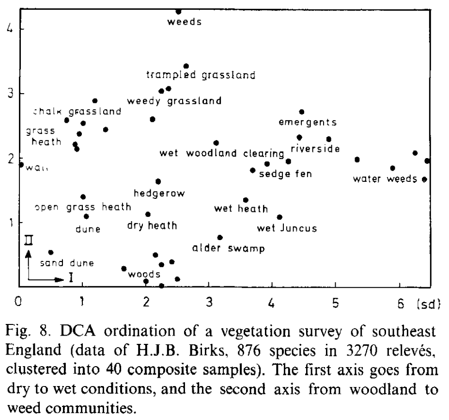
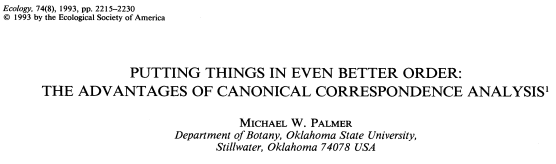

```{r setup, include=FALSE}
library(knitr)

default_source_hook <- knit_hooks$get('source')
default_output_hook <- knit_hooks$get('output')

knit_hooks$set(
  source = function(x, options) {
    paste0(
      "\n::: {.codebox data-latex=\"\"}\n\n",
      default_source_hook(x, options),
      "\n\n:::\n\n")
  }
)

knit_hooks$set(
  output = function(x, options) {
    paste0(
      "\n::: {.codebox data-latex=\"\"}\n\n",
      default_output_hook(x, options),
      "\n\n:::\n\n")
  }
)

knitr::opts_chunk$set(echo = TRUE)
```
# Outline

## Questions so far?

\center

{width=40%}

## Outline

- see workshop gavin if you really want to know this stuff

## Ordination

Goodall (1954) introduced the word "ordination"

1) Ordination summarizes data
2) Ordination **embeds** in a low-dimensional space
3) Ordination **orders** samples and species

## Gradients


- environmental gradient
- ecological gradient
- other gradients

## Latent variables


\centering

**In essence: an unobserved gradient**

## Ecological gradients

\vspace*{\baselineskip}

"Few major complex ecological gradients normally account for most of the variation in species composition."  \tiny (Halvorsen, 2012) \normalsize

## Ordination plot

```{r ord1, echo = FALSE, fig.height = 6, warning=FALSE, fig.align="center"}
mu1 <- -1
mu2 <- 0.5
mu11 <- 1
mu21 <- 1.5
parold<-par()
par(mar=c(5, 5, 0.5, 2) + 0.1)
plot(c(mu1,mu2),c(mu11,mu21),xlab="Dimension 1", ylab="Dimension 2",xaxt="n",yaxt="n",xlim=c(-2,2),ylim=c(-2,2), cex.lab=1.8,type = "n")
abline(v=0,h=0,col="red",lty="dashed", lwd = 1.5)
points(x=mu1,y=mu11,pch=20,col="blue",cex=3)
text(x=mu1,y=mu11,labels = "Species 1",col="blue",pos = 3, cex = 2)
points(x=mu2,y=mu21,pch=20,col="green",cex=3)
text(x=mu2,y=mu21,labels = "Species 2",col="green",pos = 3, cex = 2)
box()
text(-1,1.5,labels=1,col="black", cex = 2)
text(0,2,labels=2,col="black", cex = 2)
text(1,-1,labels=3,col="black", cex = 2)
text(1.2,1.5,labels=4,col="black", cex = 2)
text(-1.5,-1.5,labels=5,col="black", cex = 2)
library(shape)
par(parold)
```

## Ordination plot

```{r ord2, echo = FALSE, fig.height = 6, warning=FALSE, fig.align="center"}
mu1 <- -1
mu2 <- 0.5
mu11 <- 1
mu21 <- 1.5
parold<-par()
par(mar=c(5, 5, 0.5, 2) + 0.1)
plot(c(mu1,mu2),c(mu11,mu21),xlab="Dimension 1", ylab="Dimension 2",xaxt="n",yaxt="n",xlim=c(-2,2),ylim=c(-2,2), cex.lab=1.8,type = "n")
abline(v=0,h=0,col="black",lty="dashed", lwd = 1.5)
points(x=mu1,y=mu11,pch=20,col="blue",cex=3)
text(x=mu1,y=mu11,labels = "Species 1",col="blue",pos = 3, cex = 2)
points(x=mu2,y=mu21,pch=20,col="green",cex=3)
text(x=mu2,y=mu21,labels = "Species 2",col="green",pos = 1, cex = 2)
text(-1,1.5,labels=1,col="black", cex = 2)
text(0,2,labels=2,col="black", cex = 2)
text(1,-1,labels=3,col="black", cex = 2)
text(1.2,1.5,labels=4,col="black", cex = 2)
text(-1.5,-1.5,labels=5,col="black", cex = 2)
arrows(x0=0,y0=0,x1=0.2,y1=0.2, length=0.3, col = "red", lwd = 1.5)
arrows(x0=0,y0=0,x1=-0.5,y1=0.5, length=0.3, col = "red", lwd = 1.5)
arrows(x0=0,y0=0,x1=0.1,y1=-2, length=0.3, col = "red", lwd = 1.5)

library(shape)
par(parold)
```

## Ordination plot

We use it to:

- Get a quick overview of patterns in the data
- Describe species **co-occurrence** patterns

## When to use ordination

Mostly when we want to do dimension reduction. But also when:

\begin{enumerate}
\item We want to determine latent variables
\begin{itemize}
\item Especially when we have not measured the environment
\end{itemize}
\item \alt{We do not have enough data to estimate species effects}{\textbf{We do not have enough data to estimate species effects}}
\item We want to make pretty pictures
\end{enumerate}

## Classification of ordination 

\begin{center}
\textbf{\textcolor{red}{There are many ways to group ordination methods}}
\end{center}

- Indirect or direct
- Linear or unimodal
- Unconstrained or constrained
- Simple-method or distance-based

## Gradient analysis

Indirect gradient analysis: patterns in species composition that may be due to environment, but without studying environmental variables \newline
Direct gradient analysis: estimate how species are affected by environmental variables\newline

Both are used to analyze patterns in ecological communities

## Linear or Unimodal

Ordination (where does the concept come from)
- arranging samples
- three models according to classical methods; linear, unimodal, neither (see slides gavin)

## Unconstrained or constrained

a) Unconstrained ordination: explore main drivers of variation \newline (i.e., indirect gradient analysis)
b) Constrained ordination: filter variation due to covariates \newline (i.e., gradient analysis)
c) \textcolor{grey}{(Concurrent ordination)}

Unconstrained is mostly descriptive, constrained can also be used for hypothesis testing.\newline
Both can be understood as estimating latent variables.\newline
Note: method is different from the figure, but usually referred to with same/similar names

## Ordination as latent variable models

Some ordination methods can be thought of as implementing a latent variable model

- [ter Braak (1985)](https://www.jstor.org/stable/2530959?origin=crossref)
- Jongman et al. (1995)
- [van der Veen et al. (2022, section 3 chapter 1)](https://ntnuopen.ntnu.no/ntnu-xmlui/handle/11250/2980780)

I will write these on the slides, usually they look like:

\begin{equation}
y_{ij} = \beta_{0j} + \textbf{z}_i^\top\symbf{\theta}
\end{equation}

This makes for better comparison with GLLVMs tomorrow.

## Unconstrained ordination

Sometimes simply referred to as "ordination" \newline

## Unconstrained ordination methods
  - Principal Component Analysis \tiny (Pearson, 1901) \normalsize
  - Correspondence Analysis \tiny (Hirschfield, 1935) \normalsize
  - Detrended Correspondence Analysis \tiny (Hill and Gauch, 1980) \normalsize
  - Principal Coordinates Analsysis \tiny (Gower, 1966) \normalsize
  - Non-metric Multidimensional Scaling \tiny (Kruskal, 1964) \normalsize

# Unconstrained ordination

## Unconstrained ordination

\textbf{Goal}: to explore co-occurrence patterns \newline
\textbf{Problem}: data forms high-dimensional space

\columnsbegin
\column{0.6\textwidth}
\begin{itemize}
\item Why do species co-occur?
\begin{itemize}
  \item Similar environmental preferences
  \item Similar history in the environment
  \item Might results in \textit{Interactions}
\end{itemize}
\item But we lack measurements of the environment
\item Thus cannot test anything
\end{itemize}

\column{.4\textwidth}
\center
```{r,out.width="70%",out.height="70%",fig.cap="NIBIO", echo = FALSE}
knitr::include_graphics("heath.jpg")
```
\columnsend

## Unconstrained ordination

```{r, echo=F, eval=T, fig.cap="Hill and Gauch 1980", fig.align="center", out.height="75%"}

```

## The ecological process

\textbf{Ecological gradient theory informs us about the process}

- Type of response curve
- Measured and/or unmeasured components
- Spatial and/or temporal components
- Functional traits or Phylogeny
- Et cetera.

\textbf{Method attempts to capture underlying process}

## Unconstrained ordination

Used to: 

- Visualize patterns in data
- Draw 2D plots
- Generate hypotheses
- Explore drivers of community composition

\centering

\textcolor{red}{\textbf{To infer environmental conditions from species relationships}}

## Dutch Dune data

\footnotesize
```{r, echo = FALSE, eval = TRUE, message=FALSE}
library(vegan)
data(dune); Y <- dune
knitr::kable(head(dune, 10), format="latex", booktabs = T)
```

\normalsize

- Another classical dataset, originally by Jongman et al. (1987)
- Ordinal classes for 30 plant species at 20 sites

## Principal Component Analysis

PCA was developed by Pearson (1901) and implements:

\begin{equation}
\overline{\textbf{Y}} = \textbf{U}\textbf{D}\textbf{V}^\top
\end{equation}

which is the same as the model:

\vspace*{-\baselineskip} <!-- being a bit naughty here-->

\begin{equation}
y_{ij} = \beta_{0j} + \textbf{z}_i^\top\symbf{\theta}_j
\end{equation}

- Intercepts: $\beta_{0j} = \frac{1}{n}\sum \limits^n_{i=1}y_j$
- Site scores: $\textbf{z}_i^\top = \textbf{u}_i^\top$
- Species scores: $\symbf{\theta}_j = \textbf{D}\textbf{v}_j$ \footnotesize (scaling can instead be swept into the site scores) \normalsize
  
\centering
  
\textcolor{red}{\textbf{So: PCA fits assumes linear responses of species to the ordination axis}}

## PCA

- PCA draws a line through the direction of most spread
- Then draws another one orthogonal to that
- Continues until we have as many axes as species
- Usually we only take a few axes
- Troubles with horseshoe effect

## PCA of dune data

```{r dunepca, dev='png', fig.show='hide'}
par(mfrow=c(1,2))
data(dune, package = "vegan") #load data
Y <- dune 
PCA <- prcomp(Y)

biplot(PCA, main = "PCA biplot");plot(PCA, main = "PCA screeplot")
```

## PCA of dune data

`)

## PCA of dune data

- Not generally recommended for community data
- Only for "short" gradients due to linearity assumption
- Mostly useful for Gaussian-distributed responses

## Correspondence analysis

CA was developed by Hirschfield (1935) and implements:

\begin{equation}
\textbf{Y} = \text{diag}(\sqrt{\sum \limits^m_{j=1}y_{ij}})\textbf{U}\textbf{D}\text{diag}(\sum \limits^n_{i=1}\sum \limits^m_{j=1}y_{ij})\textbf{V}^\top\text{diag}(\sqrt{\sum \limits^n_{i=1}y_{ij}})
\end{equation}

which is the same as the model:

\vspace*{-\baselineskip} <!-- being a bit naughty here-->

\begin{equation}
y_{ij} = \textbf{z}_i^\top\symbf{\theta}_j
\end{equation}

- First dimension captures expected frequencies
- Site scores: $\textbf{z}_i^\top = \textbf{u}_{i}^\top\sqrt{\sum \limits^m_{j=1}y_{ij}}$
- Species scores: $\symbf{\theta}_j = \textbf{D}\textbf{v}_{j}\sqrt{\sum \limits^n_{j=1}y_{ij}}\sum \limits^m_{i=1}\sum \limits^n_{j=1}y_{ij}$ \footnotesize (scaling can instead be swept into the site scores) \normalsize
  
\centering
  
\textcolor{red}{\textbf{So: CA fits linear responses of species to the ordination axis}}

## CA as unimodal model

ter Braak (1985) showed that the CA solution approximates the MLEs of the model:

\begin{equation}
\begin{aligned}
\text{g}^{-1}(y_{ij}) &= \alpha_i + \beta_{0j} + \textbf{z}_i^\top\symbf{\theta}_j\\
&= c_j - \frac{1}{2}\frac{(z_i - u_j)^2}{t^2}
\end{aligned}
\end{equation}

- $c_j$ the maximum
- $u_j$ the optimum
- $t$ the tolerance

\centering

\textcolor{red}{\textbf{Also referred to as "species packing"}} \footnotesize (MacArthur 1970) \normalsize

## Unimodal responses

```{r, fig.align="center", echo = FALSE, fig.width=13}
makeTransparent<-function(someColor, alpha=100)
{
  newColor<-col2rgb(someColor)
  apply(newColor, 2, function(curcoldata){rgb(red=curcoldata[1], green=curcoldata[2],
    blue=curcoldata[3],alpha=alpha, maxColorValue=255)})
}

#https://stats.stackexchange.com/questions/12209/percentage-of-overlapping-regions-of-two-normal-distributions
min.f1f2 <- function(x, mu1, mu2, sd1, sd2) {
    f1 <- dnorm(x, mean=mu1, sd=sd1)
    f2 <- dnorm(x, mean=mu2, sd=sd2)
    pmin(f1, f2)
}

mu1 <- -2;    sd1 <- 2
mu2 <- 1;    sd2 <- 1

xs <- seq(min(mu1 - 4*sd1), max(mu1 + 4*sd1), .001)
f1 <- dnorm(xs, mean=mu1, sd=sd1)

par(mar=c(5, 5, 4, 2) + 0.1)
plot(xs, f1, type="n", ylim=c(0, max(f1)+0.01), col="blue",yaxs="i",yaxt="n",xaxt="n",xlab="Ecological gradient 1", ylab="Abundance", cex.lab=1.8,cex.axis=1.8)

# abline(v=mu1-4*sd1, col="red", lty="dashed")
# abline(v=mu1+4*sd1, col="red", lty="dashed")
# 
# abline(v=mu1-3*sd1, col="orange", lty="dashed", )
# abline(v=mu1+3*sd1, col="orange", lty="dashed")
# 
# abline(v=mu1-2*sd1, col="green", lty="dashed")
# abline(v=mu1+2*sd1, col="green", lty="dashed")
text("Good",cex=1.8, x=mu1,y=0.1)
text("Worse",cex=1.8, x=mean(c(mu1-3*sd1,mu1-2*sd1)),y=0.1)
text("Bad",cex=1.8, x=mean(c(mu1-3.7*sd1,mu1-3.7*sd1)),y=0.1)

rect(1e-3,0.3-0.001, xleft=mu1-2*sd1,xright=mu1+2*sd1,col=makeTransparent("green",40),border=makeTransparent("green",40))
rect(1e-3,0.3-0.001, xleft=mu1-3*sd1,xright=mu1-2*sd1,col=makeTransparent("orange",40),border=makeTransparent("orange",40))
rect(1e-3,0.3-0.001, xleft=mu1+3*sd1,xright=mu1+2*sd1,col=makeTransparent("orange",40),border=makeTransparent("orange",40))
rect(1e-3,0.3-0.001, xleft=mu1-4*sd1-1,xright=mu1-3*sd1,col=makeTransparent("red",40),border=makeTransparent("red",40))
rect(1e-3,0.3-0.001, xleft=mu1+4*sd1+1,xright=mu1+3*sd1,col=makeTransparent("red",40),border=makeTransparent("red",40))
lines(xs,f1,col="blue",lwd=2)

arrows(y0=0.12,x0=mu1,x1=mu1-sd1,code = 3,col="black",length=0.2)
text(mu1-sd1/2,0.13,expression("t"[1]),cex=1.8,col="black")
segments(x0=mu1,x1=mu1,y0 = 0,y1=0.2,lty="dashed",col="black")

invisible(Map(axis, side=1,at=mu1, col.axis="black", labels=expression("u"[1]), lwd=0, cex.axis=1.8))
```

## Multiple unimodal responses

```{r, echo = FALSE, message = FALSE, fig.cap=c("Example taken from the coenocliner package (Simpson 2021")}
library(coenocliner)
set.seed(42)
N <- 100 # Number of locations on gradient (samples)
glen <- 4 # Gradient length
grad <- sort(runif(N, -glen/2, glen/2)) # sample locations
M <- 10 # Number of species
sim <- simJamil(n = N, m = M, x = grad, gl = glen, randx = FALSE,
randm = FALSE, expectation = TRUE)
## visualise the response curves
matplot(grad, sim, type = "l", lty = "solid", xlab= "Gradient", ylab = "Probability of occurrence")
## simulate binomial responses from those response curves
sim <- simJamil(n = N, m = M, x = grad, gl = glen, randx = FALSE,
randm = FALSE)
``` 

## CA of dune data

```{r duneCA, dev='png', fig.show='hide', fig.height = 5}
CA <- cca(Y)
plot(CA, type="n", scaling="sites", cex.lab=1.5, cex.axis = 1.5)
points(CA, scaling = "sites", cex = 2, bg = "grey", pch = 21)
points(CA, "species", col="blue", cex=2, scaling="sites", pch = 18)
```

Some R magic for easier reading

## CA of dune data

`)

- Grey points are sites
- Blue names represent species optima

## Detrended Correspondence Analysis 

Developed by Hill and Gauch (1980). "Improves" CA in a few ways:

- Detrends (removing relationships of axes)
- Non-linearly rescales the axes
- I.e., removing "Arch" and "Edge" effects

- No statistical basis for these actions, so difficult to connect to a model.
- Relation to original data becomes fuzzy
- Often introduces its own "tongue" effect
- Sensitive to its settings
- Can sometimes remove also ecological effects

## DCA of dune data

```{r duneDCA, dev='png', fig.show='hide', fig.height = 5}
DCA <- decorana(Y)
plot(DCA, type="n", cex.lab=1.5, cex.axis = 1.5)
points(DCA, cex = 2, bg = "grey", pch = 21)
points(DCA, "species", col="blue", cex=2, scaling="sites", pch = 18)
```

## DCA of dune data

`)

## DCA of dune data

\footnotesize

```{r}
summary(DCA, display = "none")
```

\normalsize
\textcolor{red}{\textbf{Most used statistic of DCA is its axis length}}

## DCA axis length

DCA axis length (in "SD" units) is a statistic often used to decide if a dataset exhibit unimodal responses.

Long axis: turnorver is high \newline
Short axis length: turnover is low \newline

- Species curves span over about 4SD
- Sites further than 4SD apart have few species in common

# Distance-based ordination 

## Distances and transformations

Ordination is a world based on distances and data transformations \newline

Attitude: the right distance measures solves all your issues

- PCA: euclidean distance
- (D)CA: $\chi^2$ distance

Here "distance" has a particular meaning (see workshop by Gavin Simpson)\newline
Distance of sites; represent (dis)similarity in multidimensional space\newline
\textcolor{red}{Downside: no species effects}\newline

\centering
\textbf{\textcolor{red}{Idea: change distance measure to accommodate data properties}}

## Principal Coordinate Analysis

Pretty much PCA of a distance matrix (so also a similar implied model)

1) Calculate distance matrix and element-wise square it
2) Row-center
3) Column-center
4) Apply eigendecomposition with some scaling ($-\frac{1}{2}$)

\centering

\textcolor{red}{\textbf{Sometimes, eigenvalues can be negative}}

## PCoA of dune data

```{r, echo = FALSE, eval = FALSE}
M = vegdist(Y)
eigen(-0.5*(as.matrix(M)-(as.matrix(M)*0+rowMeans(M))-t(as.matrix(M)*0+colMeans(M))+mean(M)))$val
```

```{r dunepcoa, dev='png', fig.show='hide', fig.height = 5, message = FALSE}
PCoA <- cmdscale(vegdist(Y, method = "bray"))
ordiplot(PCoA, type = "n", cex.lab = 1.5, cex.axis = 1.5)
points(PCoA, pch = 21, bg = "grey", cex = 2)
```

## PCoA of Dune data

`)

## NMDS

Unlike PCoA, NMDS is an iterative method that does not rely on an eigendecomposition.

- Developed by Kruskal (1964)
- Popularized by Minchin (1987)
- NMDS minimizes a measure called "stress" (lower is better)
- Invariant to rotation, but usually post-hoc receives a rotation


## NMDS of Dune data

```{r, cache = TRUE}
NMDS <- metaMDS(Y)
ordiplot(NMDS, type = "n", cex.lab = 1.5, cex.axis = 1.5)
points(NMDS, pch = 21, bg = "grey", cex = 2)
```

## NMDS of Dune data

```{r, cache = TRUE, dev='png', fig.show='hide'}
NMDS <- metaMDS(Y)
ordiplot(NMDS, type = "n", cex.lab = 1.5, cex.axis = 1.5)
points(NMDS, pch = 21, bg = "grey", cex = 2)
```

## NMDS of Dune data

`)

## NMDS implied model

- NMDS just makes "pretty" pictures
- It is not a statistical method, so harder to connect to a model
- But see Brady (1985)

# Constrained ordination methods

  - RDA
  - (D)CCA
  - \sout{Distance-based}
    - Note: Superimposition of vectors on NMDS is not constrained ordination
    - Constrained NMDS exists but it is never used

Unconstrained ordination is fun, but what if you want more? \newline
Constrained ordination relates ordination axes to environmental variables.

\textcolor{red}{\textbf{Constrained ordination filters variation due to covariates, and throws the rest away}}

## Dune data covariates

```{r}
data(dune.env, package = "vegan")
X = dune.env
knitr::kable(head(X, 10), format="latex", booktabs = T)
```

## Redundancy Analysis

PCA but with covariates:

1) Estimate $\symbf{\beta}$ in $\overline{\textbf{Y}} = \overline{X}\symbf{\beta}$
2) Apply PCA to the fitted values

So we have the model:

\begin{equation}
y_{ij} = \beta_{0j} + \symbf{x}_i^\top\symbf{B}\symbf{\gamma}_j + \epsilon_{ij}
\end{equation}

- $\symbf{B} = \symbf{\beta}\symbf{V}\textbf{D}^{-1}$ are the canonical coefficients
- $\symbf{\gamma}_j$ are given by $\textbf{v}_j$

So RDA explicitly assumes normality, linearity, homoscedasticity, etc.

## RDA of Dune data

```{r dunerda, dev='png', fig.show='hide'}
RDA <- rda(Y~A1+Moisture+Management+Use+Manure,data=X)
ordiplot(RDA, cex=3, cex.lab = 1.5, cex.axis = 1.5)
```


```{r, echo = FALSE, eval = FALSE}
data(dune.env, package = "vegan")
Y = scale(dune, scale = FALSE); X = dune.env
X = model.matrix(~., dune.env)[,-1] # transform categorical variables
X = scale(X, scale = FALSE) # center predictors
LM <- lm(Y*sqrt(nrow(Y)-1)^-1 ~ 0+ X)
XB <- fitted(LM)
biplot(prcomp(XB))
cancoef <- coef(LM)%*%svd(XB)$v[,1:20]%*%diag(1/svd(XB)$d[1:nrow(X)])
arrows(x0=0, y0=0, x1 = cancoef[,1], y1 = cancoef[,1])
```

## RDA of Dune data

`)

## Canonical Correspondence Analysis

- Same model as CA, but constrained
- Widely acknowledge to be an excellent method
- With weighted average scores (not LC)

## CCA of Dune data

```{r dunecca, dev='png', fig.show='hide'}
CCA <- cca(Y~A1+Moisture+Management+Use+Manure,data=X)
ordiplot(CCA, cex=3, cex.lab = 1.5, cex.axis = 1.5)
```

## CCA of Dune data

`)

## Site scores

\textbf{Weighted Average} scores: should be preferred, less sensitive to noise  \newline
\textbf{Linear Combination} scores



# Conclusion

## Main benefits of these methods

1) Easy to use
2) Loads of resources
3) Isuess, artefacts, usecases are all well known
4) Permutation testing is readily available
5) Variance partitioning is straightforward

## Summary classical methods

- Methods either perform indirect or direct gradient analysis
- Are assumed to have some kind of response model (linear, unimodal, sometimes neither)
- All of these method have an implicit distance measure
- Discrete data: (D)C(C)A, or some distance-based method
- Continuous data and linear responses: PCA or RDA
