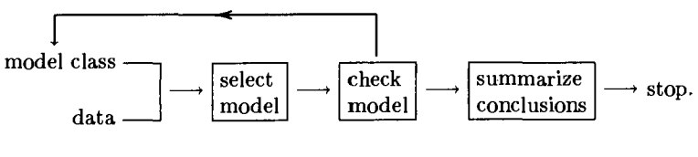
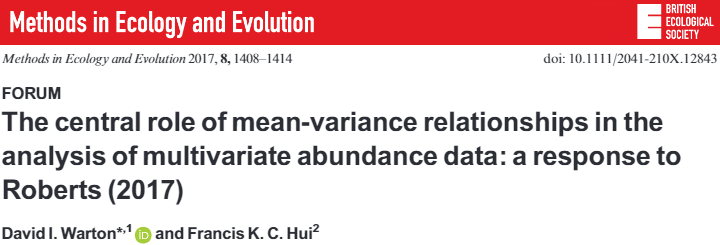
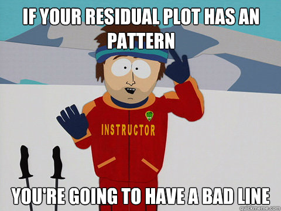
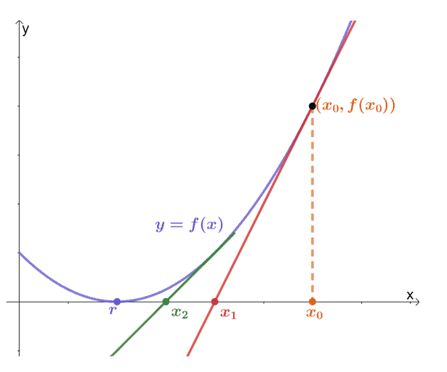

```{r setup, include=FALSE}
library(knitr)

default_source_hook <- knit_hooks$get('source')
default_output_hook <- knit_hooks$get('output')

knit_hooks$set(
  source = function(x, options) {
    paste0(
      "\n::: {.codebox data-latex=\"\"}\n\n",
      default_source_hook(x, options),
      "\n\n:::\n\n")
  }
)

knit_hooks$set(
  output = function(x, options) {
    paste0(
      "\n::: {.codebox data-latex=\"\"}\n\n",
      default_output_hook(x, options),
      "\n\n:::\n\n")
  }
)

knitr::opts_chunk$set(echo = TRUE, dev = "png", dpi = 150)
library(gllvm)
TMB::openmp(parallel::detectCores()-1, autopar = TRUE, DLL = "gllvm")
```

## Model checking



# Assumptions

## VGLMM assumptions

We have made various assumptions in the models we fitted so far:

\begin{enumerate}
\item Species responses are independent (violated $\to$ JSDM, tomorrow)
\item Same dispersion for all species (violated $\to$ vector GLM)
\item Correct distribution and link function
\item Correctly specified model structure (species-specific vs. common effects)
\item No outliers
\end{enumerate}

## Mean-variance



The mean-variance relationship has been one of the main drivers of model-based multivariate methods.

## Wetlands: species dispersion

```{r wetlands-setup, echo=FALSE}
dat <- read.csv("../data/Wetlands.csv")
y <- dat[,tail(1:ncol(dat),14)]
X <- dat[,head(1:ncol(dat),-14)][,-1]
X$Hydro<-as.factor(X$Hydro)
X$Water_Type<-as.factor(X$Water_Type)
dat <- data.frame(y, X)
long <- reshape(dat,
                varying = colnames(y),
                v.names = "Count",
                idvar = "Site",
                timevar = "Species",
                direction = "long")
long$Species <- factor(long$Species, labels = colnames(y))
model2 <- MASS::glm.nb(Count~0+Species + NO3:Species, data = long)
```

\footnotesize

```{r plot2b, fig.height = 6, echo = FALSE}
residuals <- residuals(model2)
stripchart(residuals ~ long$Species, vertical= TRUE, las =2, pch = 1, col = rainbow(ncol(y))[rep(1:ncol(y),times=nrow(y))])
```

\vspace*{-\baselineskip}

Clearly, not all these species have the same (residual) dispersion.

## Randomized Quantile residual \tiny (Dunn and Smyth 1996) \normalsize

- Gold standard residual
- Better suited for small samples and discrete data types
- Exactly normally distributed
- Suitable for all kinds of models

### Continuous
\begin{equation}
r_Q = \Phi^{-1}\biggl\{\mathcal{F}\biggl(y_i;\hat{\mu_i},\hat{\phi}\biggr)\biggr\}
\end{equation}

```{r pgamma, eval=T, fig.align="center",out.width="30%", echo=F, warning=F,message=F, fig.show="hold"}
mu <- 2
y <- rpois(100,mu)

hist(qnorm(ppois(y,mu)), main="", cex.main=2, cex.lab=1.5, col="white", xlab="Normal deviates", ylab="")
hist(ppois(y, mu), main="", cex.main=2, cex.lab=1.5, col="white", xlab="Quantiles", ylab="")
```

# (V)GLMM checking

```{r echo=F, out.width = "70%", fig.align="center"}
knitr:::
```

##  (V)GLMM residuals

\textcolor{red}{Random effect estimates $\hat{\textbf{u}}$ have a very similar relation to the random effect $\textbf{u}$ as the residual $\hat{\symbf{\epsilon}}$ does for the error $\symbf{\epsilon}$.}

### Conditional
\begin{equation}
\text{g}\{\mathbb{E}(y_{ij} \vert \textbf{x}_i)\} =               \tikz[baseline,remember picture]{
              \node[fill=purple!20,anchor=base] (t3)
              {$\textbf{x}_i^\top\hat{\symbf{\beta}}_j$};
            } +
            \tikz[baseline,remember picture]{
             \node[fill=gray!20,anchor=base] (t4)
              {$\textbf{z}_i^\top\hat{\textbf{u}}_j$};
            }
\end{equation}

### Unconditional

\begin{equation}
\text{g}\{\mathbb{E}(y_{ij} \vert \textbf{x}_i)\} =  \tikz[baseline,remember picture]{
              \node[fill=purple!20,anchor=base] (t3)
              {$\textbf{x}_i\hat{\symbf{\beta}}_j$};
            }
\end{equation}

\textbf{How do we calculate the residual?}

- should we condition on the estimate of the random effect?
- simulate from conditional distribution?

\textbf{i.e. a range of options}

## Simulation: grouping of errors

```{r poissim, eval=T, echo=T}
n <- 200
ngroups <- 4
alpha <- 0.5
beta <- -1
x <- rnorm(n, sd = 0.2)

fac<-rep(1:ngroups,each=n/ngroups)
e <- seq(from=-2,to=2,length.out=ngroups)
mu <- exp(alpha + beta*x + e[fac])
y <- rpois(n = n, lambda = mu)
```

## Example: Poisson residuals (grouping)

```{r poisr, eval=T, fig.align="center", echo=F, warning=F,message=F, fig.show="hold", out.width="70%"}
par(mar=c(5,5,4,2))

mod <- glm(y~x, family = "poisson")
mu <- predict.glm(mod, type = "response")

b <- ppois(y,mu)
a <- pmin(b,ppois(y - 1, mu))
quant.resid <- qnorm(runif(n,min=a,max=b))

mu <- predict.glm(mod,type="link")

plot(y=quant.resid, x=mu, main=expression(r[Q]), cex.lab=2, cex=2, xlab="Fitted values", cex.main=2, ylab="Residuals", col=fac, pch=fac, cex.main=4)
lines(loess.smooth(y=quant.resid,x=mu),col="red")
```

## Residual diagnostics: Poisson residuals (grouping)

\columnsbegin
\column{0.5\textwidth}

<!--should transform unconditional residuals due to correlation -->
```{r glmmresid31, eval=T, echo=F, warning=FALSE, message=FALSE}
par(mar=c(5,5,4,2))
n <- 200
ngroups <- 4
alpha <- 0.5
beta <- -1
x <- rnorm(n, sd = 0.2)

fac<-rep(1:ngroups,each=n/ngroups)
e <- seq(from=-2,to=2,length.out=ngroups)
mu <- exp(alpha + beta*x + e[fac])
y <- rpois(n = n, lambda = mu)
library(glmmTMB)
dat <- cbind(y=y,x=x,group=fac)
mod <- glmmTMB(y~x+(1|group), family = "poisson", data = data.frame(dat))

# C-U
mu <- glmmTMB:::predict.glmmTMB(mod, type = "response")

b <- ppois(y,mu)
a <- pmin(b,ppois(y - 1, mu))
quant.resid <- qnorm(runif(n,min=a,max=b))

mu <- glmmTMB:::predict.glmmTMB(mod,type="link", re.form=NA)

plot(y=quant.resid, x=mu, main="Conditional residual - Unconditional fitted", cex.lab=2, cex=2, xlab="Fitted values (u)", cex.main=2, ylab="Residuals (c)", col=fac, pch=fac)
```
<!--- what if we misspecify the random effect -->

\column{0.5\textwidth}

```{r glmmresid31a, eval=T, echo=F}
# C-C
mu <- glmmTMB:::predict.glmmTMB(mod, type = "response")

b <- ppois(y,mu)
a <- pmin(b,ppois(y - 1, mu))
quant.resid <- qnorm(runif(n,min=a,max=b))

mu <- glmmTMB:::predict.glmmTMB(mod,type="link")

plot(y=quant.resid, x=mu, main="Conditional residual - conditional fitted", cex.lab=2, cex=2, xlab="Fitted values (c)", cex.main=2, ylab="Residuals (c)", col=fac, pch=fac)
```

\columnsend

##  GLMM: checking random effect assumptions

- random effect is a type of residual
- $\hat{u}_j$ is an estimate of the mean or mode of $p(u_j \vert y_i)$
- we treat $\hat{u}_j$ as a sample of the random effect distribution
- so we check assumptions (marginal normality, constant variance, independence, no outliers)!
- difficult with small number of groups
- needs to be done for every random effect

##  GLMM diagnostics: outlier in random effects

```{r glmmresid34, eval=T, echo=F}
n <- 200
ngroups <- 4
alpha <- 0.5
beta <- -1
x <- rnorm(n, sd = 0.2)

fac<-rep(1:ngroups,each=n/ngroups)
e <- seq(from=-2,to=2,length.out=ngroups)
e[4] <- 10
mu <- exp(alpha + beta*x + e[fac])
y <- rpois(n = n, lambda = mu)
```

```{r randomd, eval=T, echo=F, out.width='.49\\linewidth', fig.align="center", fig.show="hold"}
par(mar=c(5,5,4,2))

dat <- cbind(y=y,x=x,group=fac)
mod <- glmmTMB(y~x+(1|group), family = "poisson", data = data.frame(dat))

plot(sort(unlist(ranef(mod))),x=qnorm(ppoints(ngroups)), cex.lab=2, cex.axis=2, cex.lab=2, cex=2, cex.main=2, ylab="", xlab="Theoretical quantiles", main="Normal Q-Q")
abline(lm(quantile(unlist(ranef(mod)),c(0.25,0.75))~qnorm(c(0.25,0.75))), lwd=2,lty="dashed")

h <- hist(unlist(ranef(mod)), main="", cex.main=3, cex.lab=3, col=NULL, xlab="Random effect", ylab="", cex.axis = 2)
```

##  GLMM diagnostics: outlier (residuals vs. group)

\columnsbegin
\column{0.5\textwidth}

```{r randomd2a, eval=T, echo=F}
par(mar=c(5,5,4,2))

#Unconditional
mu <- glmmTMB:::predict.glmmTMB(mod, type = "response", re.form=NA)

b <- ppois(y,mu)
a <- pmin(b,ppois(y - 1, mu))
a <- ifelse(a==1,1-1e-6,a)
quant.resid <- qnorm(runif(n,min=a,max=b))

plot(y=quant.resid, x=(1:4)[fac], main="Unconditional residual vs. group", cex.lab=2, cex=2, xlab="Group", cex.main=2, ylab="Residual", col=fac, pch=fac)
```

\column{0.5\textwidth}

```{r randomd2ab, eval=T, echo=F}
#Conditional
mu <- glmmTMB:::predict.glmmTMB(mod, type = "response")

b <- ppois(y,mu)
a <- pmin(b,ppois(y - 1, mu))
a <- ifelse(a==1,1-1e-6,a)
quant.resid <- qnorm(runif(n,min=a,max=b))

plot(y=quant.resid, x=(1:4)[fac], main="Conditional residual vs. group", cex.lab=2, cex=2, xlab="Group", cex.main=2, ylab="", col=fac, pch=fac)
```

\columnsend

## GLMM diagnostics: unequal variance

\columnsbegin
\column{0.5\textwidth}

```{r randomd2b, eval=T, echo=F}
n <- 200
ngroups <- 4
alpha <- 0.5
beta <- -1
x <- rnorm(n, sd = 0.2)

fac<-rep(1:ngroups,each=n/ngroups)
e <- seq(from=-2,to=2,length.out=ngroups)
e[4] <- 10
e2 <- MASS::mvrnorm(1,rep(0,n), diag(rep(c(1,2,3,4),
                                         each=n/ngroups)))
mu <- exp(alpha + beta*x + e[fac] + e2)
y <- rpois(n = n, lambda = mu)
```

```{r randomd2, eval=T, echo=FALSE}
par(mar=c(5,5,4,2))
dat <- cbind(y=y,x=x,group=fac)
mod<-update(mod)
#Unconditional
mu <- glmmTMB:::predict.glmmTMB(mod, type = "response", re.form=NA)

b <- ppois(y,mu)
a <- pmin(b,ppois(y - 1, mu))
a <- ifelse(a==1,1-1e-6,a)
quant.resid <- qnorm(runif(n,min=a,max=b))

plot(y=quant.resid, x=(1:4)[fac], main="Unconditional residual vs. group", cex.lab=2, cex=2, xlab="Group", cex.main=2, ylab="Residual", col=fac, pch=fac)
```

\column{0.5\textwidth}

```{r randomd2ab2, eval=T, echo=F}
# Conditional
mu <- glmmTMB:::predict.glmmTMB(mod, type = "response")

b <- ppois(y,mu)
a <- pmin(b,ppois(y - 1, mu))
a <- ifelse(a==1,1-1e-6,a)
quant.resid <- qnorm(runif(n,min=a,max=b))

plot(y=quant.resid, x=(1:4)[fac], main="Conditional residual vs. group", cex.lab=2, cex=2, xlab="Group", cex.main=2, ylab="", col=fac, pch=fac)
```

\columnsend

# Model comparison

## What makes a good statistical model?

One that helps to answer your research question:

- Accurately represents the data generating process
- Not too difficult to interpret
- Is robust

\pause

\textbf{Principle of parsimony}: if two competing models fit the data equally well, prefer the simpler one.

A more complex model will always fit better, but it may overfit. Complexity must be justified.

## Omitted variable bias

Occurs when we omit a variable that truly matters, i.e., we have:

\begin{equation}
\text{g}\{\mathbb{E}(y_i \vert x_{i1},x_{i2})\} = \alpha + x_{i1}\beta_1+x_{i2}\beta_2
\end{equation}

but fit without $x_{i2}$. The consequence:

\begin{equation}
y_i = \alpha + x_{i1}\beta_1+\epsilon_i, \quad \text{with } \epsilon_i = x_{i2}\beta_2+\epsilon_i^\star
\end{equation}

- $\epsilon_i$ may be correlated with $x_{i1}$
- Causes \textbf{biased} parameter estimates and incorrect standard errors
- Not including a confounding variable is worse than including it

## Likelihood ratio test

Is improved fit due to noise or is the alternative model actually better?

Procedure

- Fit two models: $M_0$ with $k$ parameters and $M_1$ with $r$
- Calculate likelihood ratio $\Lambda = \log\biggl(\frac{\mathcal{L}(\textbf{y};\Theta_0)_{M_0}}{\mathcal{L}(\textbf{y};\Theta_1)_{M_1}}\biggr)$
- $\mathcal{L}(\textbf{y};\Theta_0)_{M_0} \leq \mathcal{L}(\textbf{y};\Theta_1)_{M_1}$
- $-2\Lambda \sim \mathcal{\chi}^2(k_1-k_0)$ under the null
- $p\geq0.05$ difference in likelihood is due to sampling

## LRT approximation assumptions

- $n\to\infty$
- $\Theta_0$ contained in $\Theta_1$: nested models
- The true parameter is in the interior of the parameter space
- Model is "identifiable"
- Hessian matrix is sufficiently close to the Fisher information
- $y_i$ are independent

\textbf{These assumptions may fail, especially in models more complex than VGLMs} \newline
Alternatively: LRT by simulation.

## Boundary issues

Variances $\sigma^2$ are positive only. If we compare to a model without random effect, it is like saying $\sigma^2=0$: the null is "on the boundary", and the sampling distribution has a spike at zero.

```{r, echo = FALSE, fig.height = 5}
set.seed(123)
n <- 10000
df <- 3
mass_at_0 <- 0.5
weight_chisq <- 1 - mass_at_0

samples <- numeric(n)

for (i in 1:n) {
    if (runif(1) < mass_at_0) {
        samples[i] <- 0
    } else {
        samples[i] <- rchisq(1, df)
    }
}

hist(samples, probability = TRUE, breaks = 50, col = "gray",
     main = "Mixture of Chi-squared Distribution with Mass at 0 and 3",
     xlab = "Value", ylab = "Density")

x_vals <- seq(0, max(samples), length.out = 100)
chisq_density <- dchisq(x_vals, df)
lines(x_vals, weight_chisq * chisq_density, col = "red", lwd = 2, lty = "dashed")

abline(v = 3, col = "orange", lwd = 2, lty = 2)
```

So two things can happen: we can be too optimistic (test on the boundary) or too conservative (due to mass at 0), either way it is not pretty.

## Wald-statistic

The wald-statistic is reported in `summary`:

\begin{equation}
W = (\hat{\theta}-\theta)^2/var(\hat{\theta})
\end{equation}

we test if the parameter estimate is different from zero. For this, we make the following assumptions:

- We have a good estimate of the standard error
- The estimator is normally distributed (large samples)
- The estimator is centered around the true parameter

## Information criteria

A different paradigm:\newline
Find the best model amongst a set of models.

Best:

- Penalise complexity (number of parameters)
- By fit (likelihood)

Most commonly:

1) AIC: Akaike's Information Criterion \footnotesize (Akaike 1974) \normalsize
2) BIC: Bayesian Information Criterion \footnotesize (Schwarz 1978) \normalsize

\center

\textbf{Lower = better}

## Akaike's Information Criterion

\begin{equation}
\text{AIC} = -2\mathcal{L}(\textbf{y};\Theta)+2k
\end{equation}

- Penalizes model complexity
- (approximately) Measures information loss to the true data generating process
- Asymptotically

AIC tends to select too complex models with little data. Finite sample correction (Sugiura 1978):
\begin{equation}
\text{AIC}_\text{c} = \text{AIC}+\frac{2k(k+1)}{n-k-1}
\end{equation}

\center

\textbf{Find the model that predicts best}

## Bayesian Information Criterion

\begin{equation}
\text{BIC} = -2\mathcal{L}(\textbf{y};\Theta)+k\log(n)
\end{equation}

So the penalty is different. \newline

\center

\textbf{Find the model closest to the "true" model}

## Connection of AIC and LRT

Rule of thumb: difference of 2 points means a model is better

\begin{equation}
\begin{aligned}
\Delta\text{AIC} =&  \text{AIC}_{M_1}-\text{AIC}_{M_0}\\
&=  2\mathcal{L}(\textbf{y};\Theta_0) - 2\mathcal{L}(\textbf{y};\Theta_1) + 2k_1 - 2k_0\\
&=  -2\Lambda + 2(k_1-k_0)
\end{aligned}
\end{equation}

\textbf{So AIC with a rule of $\delta = 2$ can be seen as a more liberal LRT} \footnotesize (Sutherland et al. 2023) \normalsize

## The cult of (A)IC

[Presentation by Mark Brewer](https://www.youtube.com/watch?v=lEDpZmq5rBw)

\textbf{"Always use (A)IC for model comparison"}

\columnsbegin
\column{0.5\textwidth}
My perspectives

- Use common sense
- Do not blindly test all models ("dredging"): by chance, unrelated predictors will be selected
- Use model comparison techniques in moderation

\column{0.5\textwidth}


\columnsend

\textbf{Don't take the "best" model paradigm too seriously}

# Example 2

## Example 2: Swiss birds

```{r swiss, echo = FALSE}
library(gllvm)
invisible(TMB::openmp(parallel::detectCores()-1,autopar=TRUE,DLL="gllvm"))
avi_dat <- read.csv('../data/SwissBirds.csv')
y <- as.matrix(avi_dat[,1:56])
X <- avi_dat[,-c(1:56)]
X <- X[rowSums(y)>0, ]
y <- y[rowSums(y)>0,]
X<-X[,-which(apply(X,2,anyNA))]
X <- data.frame(sapply(X,function(x)if(is.numeric(x)){scale(x)}else{x}, simplify = FALSE))
```

We had this model:

\footnotesize

```{r mod3, cache = TRUE, warning=FALSE}
model3 <- gllvm(y, X = X, formula = ~(bio_1+bio_12|1),
                family = "binomial", num.lv = 0, beta0com = TRUE)
```

Let's compare it to:

\footnotesize

```{r, mod4, cache = TRUE, warning=FALSE}
model4 <- gllvm(y, X = X, formula = ~(bio_12|1),
                row.eff = ~bio_1+bio_12, studyDesign = X,
                family = "binomial", num.lv = 0, beta0com = TRUE)
```

and perhaps

\footnotesize

```{r, mod5, cache = TRUE, warning=FALSE}
model5 <- gllvm(y, X = X, formula = ~(bio_12|1),
                family = "binomial", num.lv = 0, beta0com = TRUE)
```

## Example 2: the models

The ecological assumptions of the models are a little different:

1) The first model assumes correlated species-specific responses to temperature and precipitation
2) The second model assumes a common mean temperature effect, with species-specific variation in precipitation
3) The third model assumes no responses to temperature at all

So complexity is 1) > 2) > 3)

The models are nested, so we can use a hypothesis test, or information criteria, for comparison.

## Example 2: residuals

The residuals of all three look OK:

```{r, echo  =FALSE, fig.height = 7}
par(mfrow=c(2,3))
plot(model3, which = 2)
plot(model4, which = 2)
plot(model5, which = 2)
plot(model3, which = 1)
plot(model4, which = 1)
plot(model5, which = 1)
```

## Example 2: comparison

\tiny
```{r}
anova(model4, model5) # model with mean temperature effect is "better"
```

```{r}
anova(model3, model4) # Model with temperature REs is "better"; note null on the boundary
```

But, anova assumes (a.o.) that the null is *not* on the boundary.

## Example 2: examining the REs

\footnotesize

```{r, fig.height = 6}
qqnorm(coef(model3,"Br")["bio_1",])
qqline(coef(model3, "Br")["bio_1",])
```

Some outliers; this might affect the variance estimate. \newline
We might want to consider adjusting the model (e.g., add covariates, change link function).

## Example 2: adjusting the model

\tiny

```{r mod6, cache = TRUE, fig.height = 6}
model6 <- gllvm(y, X = X, formula = ~(bio_1+bio_12+slp|1), family = "binomial", num.lv = 0, beta0com = TRUE)
qqnorm(coef(model6,"Br")["bio_1",])
qqline(coef(model6, "Br")["bio_1",])
```

After adjusting the model, the REs look a bit better.

<!-- model-selection, confidence intervals, tests? -->

<!-- hypothesis test is conservative when the null is on the boundary (when there is no random effect; variance is zero. FAQ BB, so inflated Type I/II error) -->
<!-- - wald tests are then also unreliable -->
<!-- - do not consider significance of random effects? -->

## Example 2: information criteria

\footnotesize

```{r}
AIC(model3, model6) # lower is "better"
AICc(model3, model6)
BIC(model3, model6)
```

# Convergence

All of this assumes our model has converged. If the model has not converged, it may not be valid in any way.

\pause

How do we know we have converged?

\columnsbegin
\column{0.7\textwidth}

At the MLE: gradient $= 0$, Hessian positive definite.

\vspace{0.5em}

Stopping criteria:

\begin{itemize}
\item Gradient $\approx 0$ \textcolor{green!60!black}{(good)}
\item $\ell$ improvement $<$ threshold \textcolor{green!60!black}{(good)}
\item Max iterations reached \textcolor{red}{(bad)}
\item Hessian check fails \textcolor{red}{(bad)}
\end{itemize}

\column{0.3\textwidth}

```{r tangent-img, echo=FALSE, out.width="\\textwidth"}

```

\columnsend

## Convergence: what to do

\begin{itemize}
\item Standardise all continuous covariates before fitting
\item Near-zero variance estimate: the random effect may be unnecessary; consider dropping it
\item Check for warnings: gradient, Hessian, or maximum iterations reached
\item Increase maximum iterations or tighten tolerance: \texttt{maxit = 10000}, \texttt{reltol = 1e-14}
\item Try different starting values: \texttt{starting.val = "res"} or \texttt{"zero"}
\item Try a different optimizer: \texttt{optimizer = "optim"} or \texttt{"nlminb"}
\item Few levels ($<5$): treat the effect as fixed instead
\end{itemize}

\center \footnotesize see \href{https://bbolker.github.io/mixedmodels-misc/glmmFAQ.html}{Ben Bolker's GLMM FAQ} for general advice \normalsize

## Checking convergence in \texttt{gllvm}

\begin{itemize}
\item \texttt{fit\$convergence == 0}: relative convergence criterion met
\item \texttt{max(abs(c(fit\$TMBfn\$gr()))) < 0.01}: gradients near zero
\item \texttt{all(eigen(-fit\$Hess\$Hess.full)\$values < 0)}: Hessian negative definite
\item Warning \texttt{"sd.errors could not be calculated, due to singular fit"}: Hessian not invertible
\end{itemize}

\footnotesize see \href{https://cran.r-project.org/web/packages/gllvm/vignettes/vignette10.html}{gllvm convergence vignette} \normalsize

## Technical caveats

\begin{itemize}
\item \textbf{Hypothesis testing}: Wald statistics and $p$-values are approximate; interpret with caution
\item \textbf{Variance testing}: $H_0: \sigma^2 = 0$ is on the boundary of the parameter space; LRT accepts alternative too often
\item \textbf{Model selection}: AIC is available but treat as informal; boundary issues apply
\end{itemize}

\pause

\textcolor{red}{And even more so for VGLMMs}

- Always check (residual) assumptions

