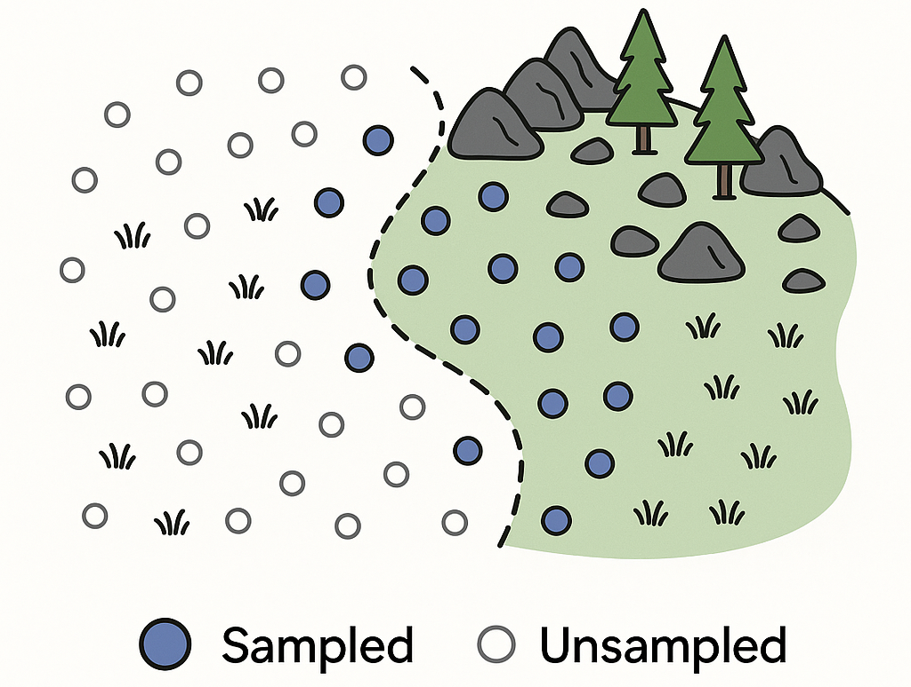
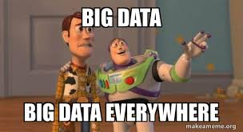

```{r setup, include=FALSE}
library(knitr)

default_source_hook <- knit_hooks$get('source')
default_output_hook <- knit_hooks$get('output')

knit_hooks$set(
  source = function(x, options) {
    paste0(
      "\n::: {.codebox data-latex=\"\"}\n\n",
      default_source_hook(x, options),
      "\n\n:::\n\n")
  }
)

knit_hooks$set(
  output = function(x, options) {
    paste0(
      "\n::: {.codebox data-latex=\"\"}\n\n",
      default_output_hook(x, options),
      "\n\n:::\n\n")
  }
)

knitr::opts_chunk$set(echo = TRUE)
```

# Background

## The goal of this presentation

Instill basic thinking about study design and data properties. \newline
It may be a bit boring.

## Gathering data

\begin{center}
You go out, register species at multiple sites
\end{center}

\alt<2>{

\begin{figure}
\includegraphics[width=0.6\linewidth]{heath_picture_sites.png}
\caption{Geir-Harald Strand / NIBIO}
\end{figure}

}{
\begin{figure}
\includegraphics[width=0.6\linewidth]{heath_picture.png}
\caption{Geir-Harald Strand / NIBIO}
\end{figure}

}

## What does community data look like?

\centering

\begin{figure}
\includegraphics[width=0.4\linewidth]{Ovaskainen_et_al_2017_3.png}
\caption{Ovaskainen et al. (2017) Fig. 3}
\end{figure}

## Goal: analysis of sparse data

Shelford's law of tolerance (1931) tells us:

- There are specialist and generalist species
- So, most species occur at few places

```{r, fig.align="center", fig.width=13, echo = FALSE}
makeTransparent<-function(someColor, alpha=100)
{
  newColor<-col2rgb(someColor)
  apply(newColor, 2, function(curcoldata){rgb(red=curcoldata[1], green=curcoldata[2],
    blue=curcoldata[3],alpha=alpha, maxColorValue=255)})
}

# https://stats.stackexchange.com/questions/12209/percentage-of-overlapping-regions-of-two-normal-distributions
min.f1f2 <- function(x, mu1, mu2, sd1, sd2) {
    f1 <- dnorm(x, mean=mu1, sd=sd1)
    f2 <- dnorm(x, mean=mu2, sd=sd2)
    pmin(f1, f2)
}

mu1 <- -2;    sd1 <- 2
mu2 <- 1;    sd2 <- 1

xs <- seq(min(mu1 - 4*sd1), max(mu1 + 4*sd1), .001)
f1 <- dnorm(xs, mean=mu1, sd=sd1)

par(mar=c(5, 5, 4, 2) + 0.1)
plot(xs, f1, type="n", ylim=c(0, max(f1)+0.01), col="blue",yaxs="i",yaxt="n",xaxt="n",xlab="Latent dimension", ylab="Abundance", cex.lab=1.8,cex.axis=1.8)

# abline(v=mu1-4*sd1, col="red", lty="dashed")
# abline(v=mu1+4*sd1, col="red", lty="dashed")
# 
# abline(v=mu1-3*sd1, col="orange", lty="dashed", )
# abline(v=mu1+3*sd1, col="orange", lty="dashed")
# 
# abline(v=mu1-2*sd1, col="green", lty="dashed")
# abline(v=mu1+2*sd1, col="green", lty="dashed")
text("Good",cex=1.8, x=mu1,y=0.1)
text("Worse",cex=1.8, x=mean(c(mu1-3*sd1,mu1-2*sd1)),y=0.1)
text("Bad",cex=1.8, x=mean(c(mu1-3.7*sd1,mu1-3.7*sd1)),y=0.1)

rect(1e-3,0.3-0.001, xleft=mu1-2*sd1,xright=mu1+2*sd1,col=makeTransparent("green",40),border=makeTransparent("green",40))
rect(1e-3,0.3-0.001, xleft=mu1-3*sd1,xright=mu1-2*sd1,col=makeTransparent("orange",40),border=makeTransparent("orange",40))
rect(1e-3,0.3-0.001, xleft=mu1+3*sd1,xright=mu1+2*sd1,col=makeTransparent("orange",40),border=makeTransparent("orange",40))
rect(1e-3,0.3-0.001, xleft=mu1-4*sd1-1,xright=mu1-3*sd1,col=makeTransparent("red",40),border=makeTransparent("red",40))
rect(1e-3,0.3-0.001, xleft=mu1+4*sd1+1,xright=mu1+3*sd1,col=makeTransparent("red",40),border=makeTransparent("red",40))
lines(xs,f1,col="blue",lwd=2)

arrows(y0=0.12,x0=mu1,x1=mu1-sd1,code = 3,col="black",length=0.2)
text(mu1-sd1/2,0.13,expression("t"[1]),cex=1.8,col="black")
segments(x0=mu1,x1=mu1,y0 = 0,y1=0.2,lty="dashed",col="black")

invisible(Map(axis, side=1,at=mu1, col.axis="black", labels=expression("u"[1]), lwd=0, cex.axis=1.8))

```

## Getting results

You have got your data, and are ready to do some ecology! \newline

Answering ecological questions starts at a good study design. \newline

In the absence of a good study design, or due to inherent properties of the process under study, a model helps.

The purpose of modeling is to get a good answer to our questions.

# Sampling
## Process-based thinking

 I will reiterate this multiple times, but:
 
1. There is a sampling process
2. There is an ecological process

Our data is the result of both, our primary interest is the latter
 
## Minimizing impact of the sampling process

We can minimize the effects of sampling by considering its effects \textit{a-priori}

\columnsbegin
\column{0.5\textwidth}

There are many sampling designs in community ecology

- Opportunistic (eek)
- Random sampling
- Systematic sampling
- Stratified sampling
- Stratified-random sampling
- Adaptive sampling
- Cluster sampling
- Paired sampling

\column{0.5\textwidth}
\includegraphics{sampling.png}
\columnsend

\pause

Sampling design affects our sample size, and the ecological results. It needs to be taken into account during analysis.

\tikzset{
  mybox/.style={
    draw=red,
    very thick,
    rectangle,
    rounded corners,
    inner sep=10pt,
    fill = white,
    text width = 0.8\paperwidth,
    align = center
  }
}
    
\pause
    
\begin{tikzpicture}[remember picture, overlay]
\node[mybox] at (current page.center){Does it give data that you can do the ecology with?};
\end{tikzpicture}

## Aspects of how we sample

Statistically, the important thing is that samples are \textbf{independent}

\columnsbegin
\column{0.5\textwidth}

- Space
- Time
- Species
- Hierarchical designs

\column{0.5\textwidth}
\includegraphics[width=0.8\linewidth]{sample.jpg}
\columnsend

Can mess that up (and often do), consequence: biased results and inflated Type error

## Preferential sampling

"I want to survey community A"

or

"I sample on an elevation gradient"

a) You have predefined your community; the predefinition affects your results
b) You have predefined your environment; the predefinition affects your results

\pause

You self-limited the scope of your study, self-selected results for diversity, composition, environment, and so on.

## Preferential sampling

{width=80%}

## Detection bias

This one is not often covered, but certain species are harder to sample (identify or find) than others. \newline

- Not considering it: you assume perfect detection
- Plants are easier than moving things
- Plants or flower are seasonal
- Pollinators fly at particular conditions
- Insects have different life stages (some easier to detect)
- Some people are better at finding things

\hfill {width=30%}

## Classification error

\columnsbegin
\column{0.5\textwidth}
Classification mistakes introduce error: we confuse a species with another.
\column{0.5\textwidth}
\includegraphics{classification.png}
\columnsend

Exacerbated if you have multiple observers.

## Measurement error

\columnsbegin
\column{0.5\textwidth}

- Measuring the environment (elevation, moisture)
- In responses of species (counts or cover data)
- eDNA data
- Can be due to faulty instrument calibration
- Experiment gone wrong
- Sample omitted, miswritten, or wrongly entered in excel

\column{0.5\textwidth}
\includegraphics{measure.jpg}
\columnsend

## To do ecology

We need to carefully consider how our data is sampled and what our analysis needs to accommodate.

\hfill {width=60%}

# Data properties

\columnsbegin
\column{0.5\textwidth}
Let's say you collected your data without too much sampling error. \newline

\vspace*{\baselineskip}

Data of ecological communities has various common properties that tend to get in the way.
\column{0.5\textwidth}
\centering
\includegraphics{dataproperties.jpg}
\columnsend

## Strong mean-variance relationships

Unless your data come from a normal distribution, the variance depends on the mean

- Ecological often have strong mean-variance relationships
- This will much up your results if not accommodated
- For example, overdispersion biases results

\centering

{width=60%}

## Sample size

Field work is hard, takes time, costs money.

\columnsbegin
\column{0.5\textwidth}

- Community ecological studies often have low samples
- And are noisy
- Combined with strong mean-variance relations this causes issues
- Studies are overpowered and lack information
- Drawing conclusions is sometimes not possible
- Can largely be avoided with power analysis

\column{0.5\textwidth}
\includegraphics{fieldwork.png}
\columnsend

## Dimensionality

There are often many species in the data; sieving through results is difficult, and analysis can be computationally intensive. \newline
\vspace*{\baselineskip}

At the same time, data are sparse.

\centering

{width=65%}

## Sparsity: zero-inflation

Zero-inflation is not immediately an issue. \newline

- Zero-inflation is only until after applying an analysis
- Sometimes, covariates can account for it
- \footnotesize For example; sampling an elevation gradient and some plants only occur in the lowlands \normalsize
- If we cannot explain it, we need to accommodate it

\vspace*{-\baselineskip}

```{r, fig.align="center", echo = FALSE, fig.height = 3}
par(mar=c(5,4,1,2))
# Set seed for reproducibility
set.seed(42)

# Matrix dimensions
n_species <- 30
n_sites <- 25

# Create a sparse presence/absence matrix (mostly zeros)
community_matrix <- matrix(0, nrow = n_species, ncol = n_sites)

# Fill in some presences to simulate high turnover
for (i in 1:n_species) {
  # Each species occurs in 1-3 random sites
  sites_present <- sample(n_sites, sample(1:3, 1))
  community_matrix[i, sites_present] <- 1
}

# Plot using image (rotate to match axis orientation)
image(t(apply(community_matrix, 2, rev)), col = c("white", "black"),
      axes = FALSE, xlab = "Species", ylab = "Site", main = "Sparse community ecological data")

# Add axis labels
axis(1, at = seq(0, 1, length.out = n_sites), labels = 1:n_sites, cex.axis = 0.7)
axis(2, at = seq(0, 1, length.out = n_species), labels = rev(1:n_species), las = 1, cex.axis = 0.7)

```

## Non-linearity

\centering

This is a big one in community ecology.


## Compositionality

Some data are inherently composition; magnitude of counts are meaningless. Not addressing it biases results; library depth for example.

- Overdispersion
- Bias
- Inflated Type I error
- Bad ordinations

\centering


# Models

Traditional methods of analysis in community ecology are not good at dealing with many of these issues.


## Models to the rescue


## General attitude

This too I will reiterate a few times:

\centering

\textbf{We adjust the model, not the data}

# Summary

## Summary

- Most of these can be accommodated \footnotesize with contemporary methods \normalsize
- Not all of them in the \texttt{gllvm} package
- Choose the appropriate model, not the software you like
- We will explore some in the workshop
- Some are more difficult to accommodate than others
- Sparsity, sample size issues, and misclassification are tough
- Many issues do not show in traditional methods
- Models will be more honest to you

\centering

{width=40%}

## So what do we do with them?

- Detection bias: repeatedly sample and estimate detection probability
- Classification error: difficult to deal with, could estimate confusion
- Measurement error: estimate it
- Nested designs: random effects
- Space, time: spatial/temporal random effects
- Strong mean-variance: \footnotesize residual diagnostics and adjust distribution \normalsize
- Sample size: \footnotesize regularisation, dimension reduction, simplify model \normalsize
- Dimensionality: dimension reduction
- Zero-inflation: add covariates or change distribution
- Non-linearity: adjust the model to accommodate
- Compositionality: offset or intercepts

\centering

<!-- \hfill {width=35%} -->


## Ecological implications

If you do not address it, don't trust your results \tiny nuanced details apply \normalsize \newline
But, sometimes things are safe to ignore \tiny consult an expert \normalsize

\pause

There of course additional ecological considerations for interpretation.

For example:

- Systems not in equilibrium
- High turnover or beta diversity
- Multicollinearity in the environment
- Rare species; how do we deal with them?

And so on.
