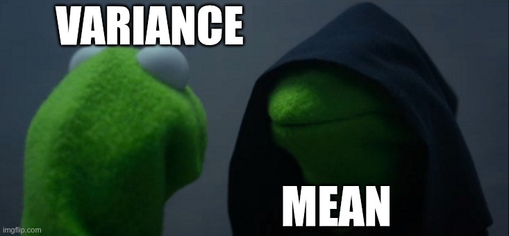
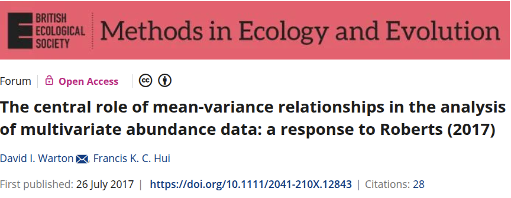
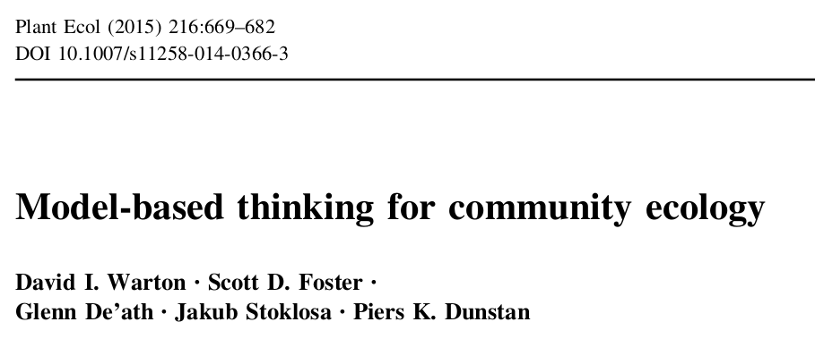

```{r setup, include=FALSE}
library(knitr)

default_source_hook <- knit_hooks$get('source')
default_output_hook <- knit_hooks$get('output')

knit_hooks$set(
  source = function(x, options) {
    paste0(
      "\n::: {.codebox data-latex=\"\"}\n\n",
      default_source_hook(x, options),
      "\n\n:::\n\n")
  }
)

knit_hooks$set(
  output = function(x, options) {
    paste0(
      "\n::: {.codebox data-latex=\"\"}\n\n",
      default_output_hook(x, options),
      "\n\n:::\n\n")
  }
)

knitr::opts_chunk$set(echo = TRUE)
```

# Outline

## Gathering data

\begin{center}
We go out, register species at multiple sites
\end{center}

\alt<2>{

\begin{figure}
\includegraphics[width=0.6\linewidth]{heath_picture_sites.png}
\caption{Geir-Harald Strand / NIBIO}
\end{figure}

}{
\begin{figure}
\includegraphics[width=0.6\linewidth]{heath_picture.png}
\caption{Geir-Harald Strand / NIBIO}
\end{figure}

}

## What does community data look like?

\centering

\begin{figure}
\includegraphics[width=0.4\linewidth]{Ovaskainen_et_al_2017_3.png}
\caption{Ovaskainen et al. (2017) Fig. 3}
\end{figure}

## Now pick an analysis

\centering

\includegraphics[width=0.95\linewidth]{minefield.png}

## Outline of the workshop

\small

\begin{tabular}{ll}
\toprule
Day & Topics \\
\midrule
1 & Vector GLMs $\to$ Vector GLMMs $\to$ Model checking \\
2 & Hierarchical responses $\to$ JSDMs $\to$ Diversity \\
3 & Model-based ordination $\to$ Constrained/concurrent $\to$ Conditioning \\
4 & Unimodal responses $\to$ Spatial/temporal $\to$ Own data \\
\bottomrule
\end{tabular}

\normalsize

\vspace*{\baselineskip}

This lecture: why model-based methods, properties of community data, and how models address them.

## From VGLMs and JSDMs to ordination and beyond

\begin{itemize}
\item \textbf{VGLMs}: multispecies regression; species-specific responses to the environment
\item \textbf{JSDMs}: add residual species correlations; why do species co-occur after accounting for the environment?
\item \textbf{Ordination}: latent variables become the primary object; what are the main unmeasured gradients driving the community?
\end{itemize}

\pause

Each step builds on the previous. All use the same statistical framework (GLLVMs).

# Why not classical methods?

## Community ecology

We collect data on many species at many sites. We want to understand:

- Which species co-occur, and why?
- How do species respond to the environment?
- How do communities change across gradients?
- What drives diversity?

\pause

Classical ordination methods (NMDS, CCA, RDA, PCA, PCoA, ...) have been the dominant tools for decades. \newline

\pause

\textcolor{red}{They have serious limitations.}

## You may already know these methods

Classical methods are well-established and widely expected:

- Many reviewers and journals still expect NMDS, CCA, PERMANOVA
- Textbooks and courses often teach only classical methods

\pause

\textbf{In simple cases} (short gradients, balanced designs, no hierarchical structure) they are reasonable approximations.

\pause

\textbf{When they fail:} long gradients, sparse count data, hierarchical study designs, prediction under new conditions.

\pause

This workshop teaches the framework that makes the approximation explicit and testable. \newline
\texttt{gllvm}, \texttt{Hmsc}, and \texttt{mvabund} are now standard tools in the community ecology literature.

## A strategy by necessity

Community ecology needed tools for multispecies data long before the statistical machinery existed to model it properly.

\begin{itemize}
\item Distance matrices and transformations were the best available options in the 1970s--90s
\item They became standard practice: embedded in textbooks, software, and reviewer expectations
\item Not a principled choice, but a practical one: there was no better alternative
\end{itemize}

\pause

The field built its analytical culture around these tools. \newline

\pause

Now there is.

## What do classical methods assume?

\footnotesize

\begin{tabular}{p{2.0cm}p{3.2cm}p{4.2cm}}
\toprule
Method & Purpose & Assumptions \\
\midrule
PCA & Unconstrained & Gaussian; linear; constant variance \\
RDA & Constrained & Gaussian; linear; constant variance \\
CA & Unconstrained & Approximate species packing \\
CCA & Constrained & Approximate species packing \\
DCA & Unconstrained & Approximate species packing; rescaled \\
NMDS & Unconstrained & Distance metric reflects ecological similarity \\
db-RDA & Constrained visualisation & Distance metric reflects ecological similarity \\
PERMANOVA & Hypothesis test & Homogeneous within-group dispersion \\
\bottomrule
\end{tabular}

\normalsize

\pause

\centering A single process-oriented framework can address all of these tasks. We will return to this throughout the workshop.

## What do classical methods do well?

These methods have been the backbone of community ecology for 50+ years, and for good reason:

\begin{itemize}
\item \textbf{Easy to use}: \texttt{vegan} is well-documented; functions are fast and accessible
\item \textbf{Known behavior}: artifacts and failure modes are well-characterised; large published literature
\item \textbf{Computationally fast}: eigenvalue decomposition scales well; permutation is parallelisable
\item \textbf{Permutation inference}: PERMANOVA and ANOSIM require no distributional assumptions for the test statistic
\item \textbf{Variance partitioning}: straightforward with \texttt{vegan::varpart()}
\item \textbf{Widely understood}: biplots and triplots are familiar to most referees and readers
\end{itemize}

\pause

\centering \textcolor{red}{They work best when gradients are short, data are not too sparse, and exploration rather than inference or prediction is the goal.}

## Pattern recognition or process modelling?

Classical methods excel at exploration and visualisation: they reveal \textit{what} the community looks like.

\pause

Ecology asks a different question: \textit{why} does the community look that way?

\begin{itemize}
\item Why do species co-occur after accounting for the environment?
\item How do communities respond to change?
\item What processes generate the diversity we observe?
\end{itemize}

\pause

Pattern recognition cannot answer process questions. A model for the data-generating process can.

## Classical methods: no random effects

Classical ordination cannot accommodate hierarchical study designs:

- Repeated measurements of sites
- Plots nested in sites
- Spatial or temporal autocorrelation

\pause

Adding a random effect to CCA or NMDS is not possible. \newline

In model-based analysis, mixed effects are a natural extension of the model, the same tools you use in a GLMM.

## Classical methods: no uncertainty

NMDS and CA ordination scores have no standard errors. \newline

\pause

- You cannot test whether a species' position on the ordination axis is significantly different from zero
- You cannot propagate uncertainty in ordination scores to downstream analyses
- Biplots give the impression of precision that is not there

\pause

Model-based methods inherit full uncertainty quantification from the statistical model.

## Classical methods: no prediction

Distance-based methods do not define a model for the data. \newline

\pause

- NMDS cannot predict the expected occurrence of a species at a new site
- CCA cannot forecast community composition under future climate
- Species richness cannot be derived from an NMDS ordination

\pause

Model-based methods define a data-generating process. Predictions for new sites, new conditions, and derived quantities follow from the model.

## Classical methods: transformation or distances

Community data is sparse, overdispersed, and non-normal. Classical methods apply one of two workarounds:

\columnsbegin[T]
\column{0.5\textwidth}

\textbf{Data transformation}
\begin{itemize}
\item $\log(y+1)$, square root, presence/absence
\item Does not remove the mean-variance trend \footnotesize (O'Hara \& Kotze 2010) \normalsize
\item Variance not stabilized; back-transformed estimates are biased
\end{itemize}

\centering
{width=75%}

\column{0.5\textwidth}

\textbf{Distance matrix}
\begin{itemize}
\item Bray-Curtis, Jaccard, Euclidean, \ldots
\item Discards raw data structure
\item Mean-variance assumptions become implicit in the metric \footnotesize (Warton et al.\ 2012) \normalsize
\end{itemize}

\columnsend

\pause

\textbf{Case in point}: Minchin (1987) showed CA/DCA fails on skewed response data. Ter Braak's fix was log-DCA \footnotesize (ter Braak \& Prentice 1988) \normalsize: adjusting the data to fit the method, not the method to fit the data.

\pause

\centering \textbf{We adjust the model, not the data.}

## Distance-based methods confound location and dispersion

\small [Warton et al. (2012)](https://besjournals.onlinelibrary.wiley.com/doi/full/10.1111/j.2041-210X.2011.00127.x): when communities differ only in mean abundance (a location effect), Bray-Curtis ordination suggests a dispersion effect. \normalsize

```{r confound, echo=FALSE, fig.height=2.5, fig.width=8, message=FALSE, warning=FALSE}
library(vegan)
set.seed(42)
n <- 15; p <- 25; phi <- 1
Y1 <- matrix(rnbinom(n*p, mu = 8,   size = phi), n, p)
Y2 <- matrix(rnbinom(n*p, mu = 0.4, size = phi), n, p)
Y  <- rbind(Y1, Y2)
grp <- rep(1:2, each = n)
invisible(capture.output(nmds <- metaMDS(Y, k = 2, trace = FALSE)))
par(mfrow = c(1,2), mar = c(4,4,2,1))
plot(nmds$points, col = grp, pch = c(1,2)[grp], cex = 1.5,
     xlab = "MDS1", ylab = "MDS2",
     main = "NMDS (Bray-Curtis)", cex.main = 0.9)
legend("topright", c("High mean abund.","Low mean abund."),
       col = 1:2, pch = 1:2, cex = 0.7)
m1 <- colMeans(Y1); v1 <- apply(Y1, 2, var)
m2 <- colMeans(Y2); v2 <- apply(Y2, 2, var)
plot(log(c(m1,m2)+0.01), log(c(v1,v2)+0.01),
     col = rep(1:2, each = p), pch = 16, cex = 1.2,
     xlab = "log mean", ylab = "log variance",
     main = "Mean-variance: same relationship", cex.main = 0.9)
legend("topleft", c("High abund.","Low abund."), col=1:2, pch=16, cex=0.7)
```

\footnotesize Low-abundance group appears more dispersed in NMDS. The mean-variance plot shows both groups share the same relationship. \textcolor{red}{There is no dispersion effect.} The apparent dispersion is an artefact of Bray-Curtis weighting. \normalsize


# Why model-based?

## The model-based alternative

\footnotesize Two papers that directly motivated this workshop: \normalsize

\columnsbegin
\column{0.5\textwidth}
\centering



\tiny Warton \& Hui (2017): mean-variance relationships are central; distance-based analyses get them wrong \normalsize

\column{0.5\textwidth}
\centering



\tiny Warton et al. (2015): a framework for model-based thinking in community ecology \normalsize

\columnsend

## Contemporary model-based methods

In classical ecology, ordination \textit{is} the analysis. In the GLLVM framework, ordination is the tool of choice when it is not possible to estimate species-specific parameters.

\pause

\begin{itemize}
\item \textbf{VGLMs / VGLMMs}: full rank; one parameter per species per covariate
\item \textbf{JSDMs}: incorporate species correlations via latent variables
\item \textbf{Ordination}: dimension reduction; effects summarised through latent variables
\end{itemize}

\pause

We begin with full-rank models on Days 1--2 because they make fewer assumptions. Ordination is introduced on Day 3, once the foundations are in place.

\vspace*{0.5\baselineskip}

\footnotesize All three can be fitted with the \texttt{gllvm} R package. \normalsize

## Models are not a panacea

\begin{itemize}
\item \textbf{Asymptotic results}: inference relies on large-sample approximations; standard errors and p-values can be unreliable for small datasets or sparse community matrices
\item \textbf{Likelihood approximations}: \texttt{gllvm} uses a variational approximation; it is fast but not exact, and quality varies with model complexity and data sparsity
\item \textbf{Computationally intensive}: complex models with many species and latent variables are slow; Bayesian alternatives (e.g.\ \texttt{Hmsc}) are slower still
\item \textbf{Steep learning curve}: model specification, convergence diagnosis, and interpretation require more statistical knowledge than running \texttt{vegan}
\end{itemize}

\pause

\centering \textit{The goal is not to replace judgment with software, but to make assumptions explicit and estimable.}

## Two processes, one model

Our data results from two distinct processes:

\columnsbegin
\column{0.5\textwidth}

\textbf{The ecological process}

\begin{itemize}
\item Species-environment relationships
\item Co-occurrence and interactions
\item Diversity and community assembly
\end{itemize}

\centering Our primary interest.

\column{0.5\textwidth}

\textbf{The sampling process}

\begin{itemize}
\item Hierarchical study design
\item Preferential or opportunistic sampling
\item Imperfect detection
\end{itemize}

\centering A source of noise.

\columnsend

\pause

\textbf{Classical methods}: sampling accommodated through study design alone. \newline
\textbf{Model-based}: random effects for hierarchical designs, offsets for effort, detection submodels; the model reflects how the data was collected.

## Joint Species Abundance Distribution Models

After accounting for the environment, species still co-occur more (or less) than expected:

\begin{itemize}
\item Unmeasured gradients affect multiple species simultaneously
\item Biotic interactions leave a signature in co-occurrence
\end{itemize}

\pause

Classical methods treat co-occurrence as a pattern to visualise. JSADMs model it as a process: residual species correlations, estimated jointly with species-environment relationships.

\pause

The latent variables in a JSADM represent unmeasured structure in the ecological process: not distances, not ordination scores, but model parameters with standard errors.

## Shelford's law makes community data sparse

Ordination can represent sparse data in only a few dimensions.


```{r, fig.align="center", fig.width=6, fig.height=3.5, out.width="\\textwidth", echo=FALSE}
makeTransparent <- function(someColor, alpha=100) {
  newColor <- col2rgb(someColor)
  apply(newColor, 2, function(curcoldata){
    rgb(red=curcoldata[1], green=curcoldata[2],
        blue=curcoldata[3], alpha=alpha, maxColorValue=255)
  })
}
mu1 <- -2; sd1 <- 2
xs <- seq(min(mu1 - 4*sd1), max(mu1 + 4*sd1), .001)
f1 <- dnorm(xs, mean=mu1, sd=sd1)
par(mar=c(2.5, 3.5, 0, 0.5) + 0.1, mgp=c(1, 1, 0))
plot(xs, f1, type="n", ylim=c(0, max(f1)+0.01), col="blue", yaxs="i", yaxt="n", xaxt="n", xlab = NA, ylab="Abundance", cex.lab=1.3, cex.axis=1.3)

rect(1e-3, 0.3-0.001, xleft=mu1-2*sd1, xright=mu1+2*sd1,
     col=makeTransparent("green",40), border=makeTransparent("green",40))
rect(1e-3, 0.3-0.001, xleft=mu1-3*sd1, xright=mu1-2*sd1,
     col=makeTransparent("orange",40), border=makeTransparent("orange",40))
rect(1e-3, 0.3-0.001, xleft=mu1+3*sd1, xright=mu1+2*sd1,
     col=makeTransparent("orange",40), border=makeTransparent("orange",40))
rect(1e-3, 0.3-0.001, xleft=mu1-4*sd1-1, xright=mu1-3*sd1,
     col=makeTransparent("red",40), border=makeTransparent("red",40))
rect(1e-3, 0.3-0.001, xleft=mu1+4*sd1+1, xright=mu1+3*sd1,
     col=makeTransparent("red",40), border=makeTransparent("red",40))
lines(xs, f1, col="blue", lwd=2)
arrows(y0=0.12, x0=mu1, x1=mu1-sd1, code=3, col="black", length=0.1)
text(mu1-sd1/2, 0.13, expression("t"[1]), cex=1.5, col="black")
segments(x0=mu1, x1=mu1, y0=0, y1=0.2, lty="dashed", col="black")
invisible(Map(axis, side=1, at=mu1, col.axis="black",
              labels=expression("u"[1]), lwd=0, cex.axis=1.5))

text("Good",  cex=1.5, x=mu1, y=0.1)
text("Worse", cex=1.5, x=mean(c(mu1-3*sd1, mu1-2*sd1)), y=0.1)
text("Bad",   cex=1.5, x=mean(c(mu1-3.7*sd1, mu1-3.7*sd1)), y=0.1)
```

Species occur only where conditions fall within their tolerance range; most sites fall outside that range for most species, making sparse community matrices the rule, not the exception.

## What ordination brings

When data are too sparse to estimate species-specific parameters, ordination summarises the main gradients via latent variables:

\begin{itemize}
\item Response-scale dimension reduction: no transformation, no distance metric
\item Uncertainty in ordination scores propagates to all downstream inference
\item Predictions for new sites and derived quantities follow from the model
\end{itemize}

\pause

The cost: rank constraints on species responses induce bias. The number of latent dimensions must be chosen, and the axes require interpretation. Use ordination when the data cannot support a full-rank model.

## Prediction matters for community ecology

A model for the data opens up a coherent framework for forecasting:

\begin{itemize}
\item \textbf{Species}: occurrence probability or abundance at unvisited sites or future conditions
\item \textbf{Communities}: composition, turnover, and beta diversity across gradients
\item \textbf{Diversity}: richness as the sum of occurrence probabilities; no separate estimator needed
\end{itemize}

\pause

\footnotesize Non-parametric estimators work around the absence of a model. When a model is available, richness, diversity indices, and uncertainty follow directly. \normalsize

\pause

\centering \textit{The same model used for ordination can forecast diversity under climate change.}

## Summary: classical approach vs. GLLVM

\footnotesize

| Problem | Classical approach | GLLVM |
|---|---|---|
| Count/binary data | $\log(y+1)$ transformation | Poisson, NB, or binomial distribution |
| Long gradient (arch) | DCA rescaling (heuristic) | Unimodal response model |
| Nested / repeated design | None | Random effects |
| Species correlation | Ignored | JSDM / residual covariance |
| No environment measured | NMDS | Unconstrained ordination |
| Uncertainty | None | Standard errors and CIs |

\normalsize

\pause

\centering \textbf{We adjust the model, not the data.}

\pause

\centering

\textbf{Models will be more honest to you than transformations.}
