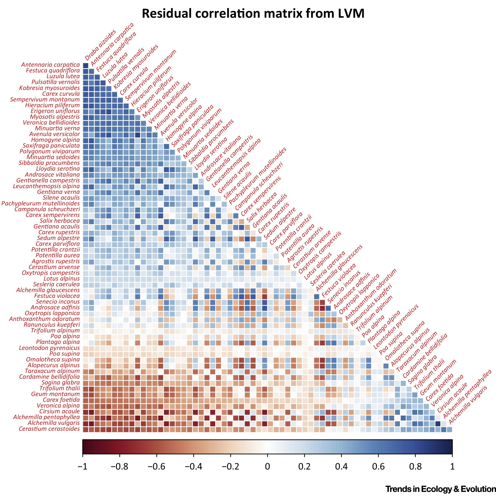
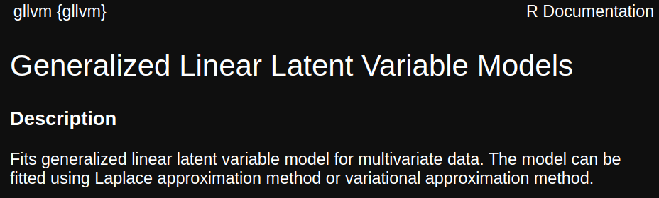

```{r setup, include=FALSE}
library(knitr)

default_source_hook <- knit_hooks$get('source')
default_output_hook <- knit_hooks$get('output')

knit_hooks$set(
  source = function(x, options) {
    paste0(
      "\n::: {.codebox data-latex=\"\"}\n\n",
      default_source_hook(x, options),
      "\n\n:::\n\n")
  }
)

knit_hooks$set(
  output = function(x, options) {
    paste0(
      "\n::: {.codebox data-latex=\"\"}\n\n",
      default_output_hook(x, options),
      "\n\n:::\n\n")
  }
)

knitr::opts_chunk$set(echo = TRUE)
```


## Philosophy

- Adjust the model, not the data
- If you're not sure how to adjust the model, you just need to figure out
- Unlike "classically" where the data is adjusted to make the method fit

## Classical approach

\columnsbegin
\column{0.5\textwidth}

Classically:

1) Decide on a distance
2) Apply a multivariate analysis
3) Make a plot
4) Do a hypothesis test

\column{0.5\textwidth}


\columnsend


# Welcome! \emoji{smile}

\center
{width=60%}

# Intro

[See github for all material](https://github.com/BertvanderVeen/GLLVM-workshop)

Sessions from 14:00 to 20:00 (Tuesday to Friday). Sessions will consist of a mix of lectures, in-class discussion, and practical exercises / case studies over Slack and Zoom.

* Tuesday: Properties of community data, VGLMs and VGLMMs
* Wednesday: Model checking, hierarchical environmental responses, JSDM
* Thursday: Model-based ordination, Ordination with covariates, Unimodal responses
* Friday: Other packages, Beyond \texttt{gllvm}, article reanalysis, analysis of own data

## How we will do it

Lectures of about 45-60 minutes \newline
Practicals of about 45-60 minutes: datasets and R

  - Practical "tasks" that get more complex
  - Short, live, demonstrations

## Friday

Start an hour sooner? Poll in the slack.

1. Other \texttt{R}-packages for GLLVMs/JSDMs
2. A brief look at Hierarchical ordination
3. Article reanalysis
  - You can send suggestions, the main requirement is published data
4. Own data analysis/questions/suggestions

How does that sound?

## What I hope you take away

1. The \texttt{gllvm} \texttt{R}-package is great!
2. Performing multivariate analysis well is hard work
3. Model-based ordination methods do many things better (data properties, diagnostics)
4. One Method To Rule Them All

## Logistics

[All material on github](https://github.com/BertvanderVeen/GLLVM-workshop)

Please make sure you've downloaded data and updated R/packages

## \texttt{R}-packages

- gllvm
- glmmTMB
- mvabund
- HMSC
- sjSDM
- ecopCopula
- vegan
- boral

and some spatial packages

- terra
- sf
- maptiles

## Some resources on classical ordination

- [David Zeneley's website](https://www.davidzeleny.net/anadat-r/doku.php/en:ordination)
- [Michael Palmer's website](https://ordination.okstate.edu/overview.htm)
- [Numerical ecology](https://shop.elsevier.com/books/numerical-ecology/legendre/978-0-444-53868-0)
- [Numerical ecology with R](https://link.springer.com/book/10.1007/978-1-4419-7976-6)
- [Data analysis in Community and Landscape ecology](https://www.cambridge.org/core/books/data-analysis-in-community-and-landscape-ecology/CF8B1E39A3A586FF7A3C76B514EA96A5)
- [Analysis of ecological communities](https://www.wildblueberrymedia.net/store/analysis-of-ecological-communities)

## Resources on model-based ordination

- [Some of my other workshop repositories](https://github.com/BertvanderVeen)
- [gllvm vignette website](https://jenniniku.github.io/gllvm/)
- [Oxford libraries article](https://www.oxfordbibliographies.com/display/document/obo-9780199830060/obo-9780199830060-0003.xml)
- [Warton 2022](https://link.springer.com/book/10.1007/978-3-030-88443-7)
- [Fahrmeir and Tutz 2001](https://www.amazon.com/Multivariate-Statistical-Modelling-Generalized-Statistics/dp/0387951873)
- [Ovaskainen and Abrego](https://www.cambridge.org/core/books/joint-species-distribution-modelling/0D9FA93EA1DD408332A17266449668B3)
- [Bartholomew et al. 2011](https://onlinelibrary.wiley.com/doi/book/10.1002/9781119970583)
- [Skrondal and Rabe-Hesketh 2004](https://www.taylorfrancis.com/books/mono/10.1201/9780203489437/generalized-latent-variable-modeling-anders-skrondal-sophia-rabe-hesketh)
- [Zuur and Ieno (2025)](https://www.highstat.com/Books/WZM_Vol1/WorldOfZIMVOL3TOC.pdf)

## Some recommended reading

\columnsbegin
\column{0.5\textwidth}

- [Halvorsen (2012)](http://nhm2.uio.no/botanisk/nbf/temp/Sommerfeltia_35_20121206_PRESS.pdf)
- [Wang et al. (2012)](https://besjournals.onlinelibrary.wiley.com/doi/10.1111/j.2041-210X.2012.00190.x)
- [Warton et al. (2012)](https://besjournals.onlinelibrary.wiley.com/doi/abs/10.1111/j.2041-210X.2011.00127.x)
- [Clark et al. (2014)](https://esajournals.onlinelibrary.wiley.com/doi/abs/10.1890/13-1015.1)
- [Warton et al. (2015)](https://doi.org/10.1016/j.tree.2015.09.007)
- [Warton et al. (2015)](https://link.springer.com/article/10.1007/s11258-014-0366-3)
- [Hui et al. (2015)](https://besjournals.onlinelibrary.wiley.com/doi/10.1111/2041-210X.12236)
- [Pollock et al. (2015)](https://besjournals.onlinelibrary.wiley.com/doi/10.1111/2041-210X.12180)
- [ter  Braak and Smilauer (2015)](https://link.springer.com/article/10.1007/s11258-014-0356-5)
- [Hui et al. (2017)](https://www.tandfonline.com/doi/abs/10.1080/10618600.2016.1164708)
- [Niku et al. (2017)](https://link.springer.com/article/10.1007/s13253-017-0304-7)
- [Ovaskainen et al. (2017)](https://onlinelibrary.wiley.com/doi/full/10.1111/ele.12757)

\column{0.5\textwidth}

- [Roberts (2017)](https://besjournals.onlinelibrary.wiley.com/doi/full/10.1111/2041-210X.12739)
- [Warton et al. (2017)](https://besjournals.onlinelibrary.wiley.com/doi/abs/10.1111/2041-210X.12843)
- [Niku et al. (2019)](https://besjournals.onlinelibrary.wiley.com/doi/abs/10.1111/2041-210X.13303)
- [Niku et al. (2019)](https://journals.plos.org/plosone/article?id=10.1371/journal.pone.0216129)
- [Roberts (2019)](https://esajournals.onlinelibrary.wiley.com/doi/abs/10.1002/ecy.2908)
- [Paul (2020)](https://www.sciencedirect.com/science/article/abs/pii/S1574954120301096)
- [Zurell et al. (2020)](https://onlinelibrary.wiley.com/doi/abs/10.1111/jbi.13608)
- [van der Veen et al. (2021)](https://besjournals.onlinelibrary.wiley.com/doi/full/10.1111/2041-210X.13595)
- [Blanchet et al. (2022)](https://onlinelibrary.wiley.com/doi/abs/10.1111/ele.13525)
- [van der Veen (2022)](https://ntnuopen.ntnu.no/ntnu-xmlui/handle/11250/2980780)
- [van der Veen et al. (2023)](https://besjournals.onlinelibrary.wiley.com/doi/full/10.1111/2041-210X.14035)
- [Korhonen et al. (2024)](https://besjournals.onlinelibrary.wiley.com/doi/full/10.1111/2041-210X.14437)
- [van der Veen et al. (2024)](https://arxiv.org/abs/2408.05333)
- [Tang et al. (2025)](https://jdssv.org/index.php/jdssv/article/view/133)

\columnsend

## Resources that cover all kinds of ordination methods

(none)


# Introduction

## Motivation


## Motivation

- We need formal, probabilistic, models for community ecology
- That incorporate data properties, rather than transforming our way out of them
- It makes for better/clearer inference
- For nicer for teaching
- Access to tools for testing assumptions
- Overall more flexibility

## Why GLLVMs?

GLLVMs are a formal statistical, fully probabilistic, tool for multivariate analysis.

1) To step up your multivariate analysis
2) Maybe you want to incorporate random effects
3) Negates the need for distances


## Multivariate analysis

\columnsbegin
\column{0.5\textwidth}

```{r echo=F, fig.align="center", fig.cap="CCA of dune data", message=FALSE}
library(vegan)
data(dune)
data("dune.env")
plot(vegan::cca(dune,dune.env))
```

\column{0.5\textwidth}

```{r echo=F, fig.align="center", fig.cap="JSDM of spider data", fig.show="hold", message=FALSE}
library(gllvm)
data(spider,package="mvabund")
mod <- gllvm(spider$abund,num.lv=2,family="negative.binomial",row.eff="random")
corrplot::corrplot(getResidualCor(mod),type = "lower",order = "AOE")

```

\columnsend

## Use of ordination
 
- One of the most used methods of multivariate analysis 
  - but definitely not the only one
- Arranges species and samples in a low-dimensional space
  - or any column and row quantity really
- Summarizes data
- Find underlying structures (gradients/LVs)

# History

## A brief history of ordination

\columnsbegin
\column{0.5\textwidth}

```{r, fig.align="center", echo=F, out.width="99%"}
knitr::include_graphics("MP_timeline_17-04-2023.png")
```

\column{0.5\textwidth}

```{r, fig.align="center", echo=F, out.width="99%"}
knitr::include_graphics("J_Birks_timeline.png")
```

\columnsend

- Inspired by Michael Palmer's and John Birk's
- But in need of a little update

## The rich history of multivariate analysis

```{r, fig.width=15, echo = FALSE, message=FALSE, warning = FALSE}
#see https://stackoverflow.com/questions/7492274/draw-a-chronological-timeline-with-ggplot2
library(ggplot2)
library(dplyr)
library(cowplot)
library(tibble)
library(ggalt)
library(lubridate)

#Create data to plot
data <- tribble( ~start_date, ~event, ~displ,
                ymd("1901-01-01"), "PCA", 0.5,
                ymd("1904-01-01"), "FA", 0.2,
                ymd("1935-01-01"), "CA", 0.5,
                ymd("1936-01-01"), "LDA", 0.2,
                ymd("1936-01-01"), "COR", 0.3,
                ymd("1951-01-01"), "RRR", 0.5,
                ymd("1954-01-01"), "'Ordination'", -0.5,
                ymd("1954-01-01"), "'Gaussian' curve", -0.2,
                ymd("1957-01-01"), "PO", 0.5,
                ymd("1964-01-01"), "RDA", 0.8,
                ymd("1964-01-01"), "NMDS", 0.2,
                ymd("1966-01-01"), "PCoA", 0.5,
                ymd("1970-01-01"), "INDSCAL", 0.9,
                ymd("1970-01-01"), "Whittaker's Gradient analysis", -0.5,
                ymd("1971-01-01"), "Biplot", -0.8,
                ymd("1972-01-01"), "GLM", -1,
                ymd("1973-01-01"), "RA", -1.3,
                ymd("1974-01-01"), "GO", 0.8,
                ymd("1975-01-01"), "MIMIC", 0.7,
                ymd("1979-01-01"), "DCA", 0.5,
                ymd("1979-01-01"), "TWINSPAN", -1.2,
                ymd("1983-01-01"), "constrained NMDS", 0.4,
                ymd("1985-01-01"), "CA unimodal model", -1.1,
                ymd("1986-01-01"), "Canoco", -0.9,
                ymd("1987-01-01"), "Minchin evaluates NMDS", -0.7,
                ymd("1986-01-01"), "CCA", 0.3,
                ymd("1988-01-01"), "Theory of \n gradient analysis", -0.2,
                ymd("1999-01-01"), "PRC", 0.2,
                ymd("1999-01-01"), "db-RDA", 0.5,
                ymd("1999-01-01"), "Probabilistic PCA", 0.6,
                ymd("2001-01-01"), "vegan", -0.6)

shift_axis <- function(p, xmin, xmax, y=0){
      g <- ggplotGrob(p)
      dummy <- data.frame(y=y)
      ax <- g[["grobs"]][g$layout$name == "axis-b"][[1]]
      p + annotation_custom(grid::grobTree(ax, vp = grid::viewport(y=1, height=sum(ax$height))), 
                            ymax=y, ymin=y) +
        annotate("segment", y = 0, yend = 0, x = xmin, xend = xmax) +
        theme(axis.text.x = element_blank(), 
              axis.ticks.x=element_blank())

    }


#Conditionally set whether text will be above or below the point
vjust = ifelse(data$displ > 0, -1, 1.5)

#plot
p1 <- data %>% 
  ggplot(aes(start_date, displ)) + theme_classic()+
  geom_lollipop(point.size = 1, shape = 2, col = "black") +
  geom_text(aes(x = start_date, y = displ, label = event), col =  "black", data = data,
            hjust = 0, vjust = vjust, size = 5) +
  theme(axis.title = element_blank(),
        axis.text.y = element_blank(),
        axis.ticks.y = element_blank(),
        axis.line = element_blank(),
        axis.text.x = element_text(size = 12)) +
  expand_limits(x = c(ymd("1900-01-01"), ymd("2023-01-01")), y = 1.2) +
  scale_x_date(breaks = scales::pretty_breaks(n = 9))

#and run the function from above
timeline <- shift_axis(p1, ymd("1900-01-01"), ymd("2030-01-01"))
timeline
```

\pause 

Seems like everything stops at the turn of the millennium?


\tikzset{
  mybox/.style={
    draw=red,
    very thick,
    rectangle,
    rounded corners,
    inner sep=10pt,
    fill = white,
    align = center,
    text width = 0.8\paperwidth
  }
}

\pause

\begin{tikzpicture}[remember picture, overlay]
\node[mybox] at (current page.center){Except that it doesn't.};
\end{tikzpicture}

# Contemporary multivariate analysis

- Vector GLM(M)s
- Joint Species Distribution Models
- Model-based ordination

All three of these can be fitted with the \texttt{gllvm} \texttt{R}-package.

## Vector Generalised Linear (Mixed effects) Models

We can fit specialised mixed-effects models to community data:

\begin{equation}
g\{\mathams{E}(y_{ij}\vert\symbf{\lambda}_i)\} = \beta_{0j} + \textbf{x}_i^\top \symbf{\beta}_j + \textbf{z}_i^\top\symbf{\lambda}_j, \qquad \symbf{\lambda}_j \sim \mathcal{N}(\symbf{\mu},\symbf{\Sigma})
\end{equation}

- The time that we were computationally limited is long past
- We can analyse multivariate data like any other
- Leverage information across all species in our data to learn about community processes

## Joint Species Distribution Modeling

- First suggested by Ovaskainen et al. 2010
- Named by Pollock et al. 2014

\columnsbegin
\column{0.5\textwidth}

```{r,out.width="80%",out.height="80%", fig.align="center", echo=F, fig.cap="Figures from Ovaskainen et al. 2017"}
knitr::include_graphics("Ovaskainen_et_al_2017_1.png")
```

\column{0.5\textwidth}

```{r,out.width="99%",out.height="99%", fig.align="center", echo=F}
knitr::include_graphics("Ovaskainen_et_al_2017_2.png")
```

\columnsend

## Joint Species Distribution Modeling (2)

- A niche process generates data
- Distributions are driven by 1) environment and 2) interactions
- Statistically, interaction = correlation of species
- So we model that:

\begin{equation}
g\{\mathams{E}(y_{ij}\vert\symbf{\epsilon}_i)\} = \beta_{0j} + \textbf{x}_i^\top \symbf{\beta}_j + \color{red}{\epsilon_{ij}}, \qquad \color{red}{\symbf{\epsilon}_i} \sim \mathcal{N}(0,\symbf{\Sigma})
\end{equation}

Can be fit using standard mixed-effects modeling software:

\small

```{r, eval = FALSE}
glmer(abundance~species+x:species+(0+species|sites))
```
\normalsize
\textbf{\textcolor{red}{Problem: Number of parameters grows quadratically}}

## "Fun" ecological inference

```{r,out.width="55%", fig.align="center", echo=F, fig.cap="Warton et al. 2015 Alpine plants"}

```

## Model-based ordination

- Generalised Linear Latent Variable Model
- Adds "factor analytic" structure to $\Sigma$
- $\color{red}{\epsilon_{ij}} = \textbf{u}_i^\top \symbf{\gamma}_j$
- i.e. $\color{red}{\symbf{\epsilon}_i} \sim \mathcal{N}(0,\symbf{\Gamma}\symbf{\Gamma}^\top)$
- Faster and fewer parameters:
- Number of parameter doesn't grow so fast

\begin{equation}
\symbf{\Sigma} = \begin{bmatrix}
\gamma_{11} & 0 & 0 \\
\gamma_{12} & \gamma_{22} & 0 \\
\vdots & \ddots &  \vdots \\
\gamma_{1j} & \cdots & \gamma_{dj} 
\end{bmatrix}
\begin{bmatrix}
\gamma_{11} & \gamma_{12} & \cdots &  \gamma_{1j} \\
0 & \gamma_{22} & \ddots & \vdots \\
0 & 0 & \cdots & \gamma_{dj}
\end{bmatrix}
\end{equation}

## The Minchin dataset

```{r, echo=F, message=F, warning=F, fig.align="center", fig.height = 6, echo = FALSE}
library(gllvm)
library(vegan)
# Download the minchin dataset
minchin <- read.csv("https://raw.githubusercontent.com/BertvanderVeen/Examples/master/Minchin87_2b_counts.csv") # Data frmo minchin 1987
# All missing values are zeros
minchin[is.na(minchin)] <- 0
minchin<-minchin[,-1]
# We will first do some classical ordination methods
# Correspondence analysis
CA_minchin <- cca(minchin)
# Detrended CA
DCA_minchin <- decorana(minchin)
logDCA_minchin <- decorana(log1p(minchin))

# NMDS
NMDS_minchin <- metaMDS(minchin, k = 2, trace = F)
par(mfrow=c(2,2))
# Let's have a look at the results
plot(scores(CA_minchin,display="sites"), main="CA",col=rep(1:4,each=12),pch=rep(1:4,each=12), cex = 1.5) # arch effect
plot(scores(DCA_minchin)[,1:2], main="DCA",col=rep(1:4,each=12),pch=rep(1:4,each=12), cex = 1.5) # This has the tongue effect
plot(scores(logDCA_minchin, display="sites"), main="log-DCA",col=rep(1:4,each=12),pch=rep(1:4,each=12), cex = 1.5) # suggestion from paper CTB
plot(NMDS_minchin$points, main="NMDS",col=rep(1:4,each=12),pch=rep(1:4,each=12), cex = 1.5) # This looks pretty OK!
```


```{r minch2, fig.align="center", echo=F, fig.height = 6, dev = "png", fig.show = "none"}
#mod <- gllvm(minchin,family="negative.binomial",num.lv=2, row.eff="random",starting.val="res", n.init=3, jitter.var=0.2, trace=T, method="EVA", sd.errors = F)
#save(mod,file="linmodMinchin.RData")
par(mfrow=c(1,2))
load("linmodMinchin.RData")
plot(getLV(mod)%*%diag(mod$params$sigma.lv), xlab="LV1", ylab="LV2", main="linear response GLLVM",col=rep(1:4,each=12),pch=rep(1:4,each=12), cex = 1.5)

#It needs to be with NB!
#ok this works best:
#mod3 <- gllvm(minchin,family="poisson",num.lv=2, trace=T, jitter.var=.2,sd.errors=F,n.init=3, quadratic=T)
#save(mod3,file="quadmodMinchin.RData")
load("quadmodMinchin.RData")
plot(getLV(mod3)%*%diag(mod3$params$sigma.lv), xlab="LV1", ylab="LV2", main="quadratic response GLLVM",col=rep(1:4,each=12),pch=rep(1:4,each=12), cex = 1.5)
```

\only<2>{
\begin{tikzpicture}[remember picture, overlay]
    \fill[white,opacity=0.8] (current page.south west) rectangle (current page.north east);
\end{tikzpicture}
\begin{center}
\begin{tikzpicture}[remember picture,overlay]
    \node[anchor=center] at (current page.center) {\includegraphics[width=0.75\textwidth]{Introduction_files/figure-beamer/minch2-1.png}};
\end{tikzpicture}
\end{center}
}


## Why model-based

- Flexibility
- Accommodate properties of data and sampling processes
- Now straightforward available and fast
- More advanced ecological inference and prediction

We can do all kinds of fun things

- Residual diagnostics
- Species-specific effects from constrained ordination
- Random-effects
- Flexible models
- Etc.

## Challenges

- Complex model
  - products of random-effects
  - identifiability
- No analytical solution (need approximate methods)
- Computationally intensive (need fast fitting)
- Non-convex objective function (need robust optimization)
- Usability needs a lot more improvements

# The \texttt{gllvm} \texttt{R}-package

Many people have put a lot of work into development of the methods presented here

## The \texttt{gllvm} \texttt{R}-package

- Fast
- Easy to use
- Many different model structures
- (Un)constrained ordination with random-effects
- Tools for ordination (biplot) and regression (model selection, statistical uncertainties)
- (very) Active support via github (Jenni Niku, me \emoji{smiling-face})

\textbf{Jenni Niku, Wesley Brooks, Riki Herliansyah, Francis K.C. Hui, Pekka Korhonen, Sara Taskinen, Bert van der Veen and David I. Warton (2025). gllvm:
  Generalized Linear Latent Variable Models. R package version 2.0.2}

## \texttt{gllvm}


- Originally published in 2019 by Niku et al. 
- For JSDM, unconstrained, and residual ordination
- Since then it has been considerably extended
- Models are fitted in C++ with Template Model Builder \tiny (Kristensen et al. 2015) \normalsize

## Likelihood approximation

\begin{equation}
\mathcal{L}(\Theta) =\sum \limits_{i=1}^n \log\biggl\{ \displaystyle\int \prod \limits_{j=1}^m f\biggl(y_{ij} \vert \textbf{z}_i, \Theta\biggr)h\biggl(\textbf{z}_i\biggr) d\textbf{z}_i \biggr\},
\label{gllvm}
\end{equation}

The package has three methods for approaching the estimation:

- Laplace approximation (LA)
- Variational approximation (VA)
- Extended variational approximation (EVA)

\centering
\textcolor{red}{\textbf{Sometimes we want or need to switch between these}}

## Main function: `gllvm(.)`



This has many arguments

\columnsbegin
\column{0.4\textwidth}

- `y` (community data)
- `X` (environment)
- `TR` (traits)
- `data`
- `formula`
- `family`

\column{0.6\textwidth}

- `num.lv` (unconstrained ord.)
- `num.lv.c` (concurrent ord.)
- `num.RR` (constrained ord.)
- `lv.formula`
- `sd.errors` (can take long)
- `method` (LA, VA, EVA)

\columnsend

## `gllvm(.)` arguments continued

\small

\columnsbegin
\column{0.5\textwidth}

- `studyDesign`
- `dist`
- `colMat`
- `colMat.rho.struct`
- `corWithin`
- `quadratic`
- `row.eff`
- `offset`
- `randomB`
- `randomX`
- `beta0com`
- `zeta.struc` (only applies to ordinal)

\column{0.5\textwidth}

- `link` (only applies to binomial)
- `Ntrials` (only applies to binomial)
- `Power` (only applies to tweedie)
- `seed` (for reproducibility)
- `scale.X` (for 4th corner)
- `return.terms`
- `gradient.check` (convergence check)
- `disp.formula` (dispersion parameters)
- `control`
- `control.va`
- `control.start`

\columnsend


## Distributions in \texttt{gllvm}

\footnotesize 

\begin{table}[h]
\begin{tabu} to \linewidth {*4{X}}
\toprule
Type of data & Distribution & Method & Link\\
\midrule
Normal & Gaussian & VA/LA & identity\\
Counts & Poisson & VA/LA & log \\
& NB & VA/LA & log \\
& ZIP & VA/LA  & log \\
& ZINB & VA/LA & log \\
& binomial & VA/LA & probit \\
& binomial & LA & logit \\ 
Binary & Bernoulli & EVA VA/LA & probit logit \\
Ordinal & Multinomial & VA & cumulative probit \\
Biomass & Tweedie & EVA/LA & log \\
Positive continuous & Gamma & VA/LA &log \\
& Exponential & VA/LA & log \\
Percent cover & beta & LA/EVA & probit/logit \\
\tiny with zeros or ones \normalsize & ordered beta & EVA & probit \\
\bottomrule
\end{tabu}
\end{table}
\normalsize

## Functions in the package

\columnsbegin
\column{0.5\textwidth}

- `gllvm()`
- `logLik()`
- `summary()`
- `confint()`
- `predict()`
- `coefplot()`

\column{0.5\textwidth}

- `randomCoefplot()`
- `plot()` and `residuals()`
- `se()` and `vcov()`
- `getLV()`
- `getLoadings()`
- `predictLVs()`
- `phyloPlot`
- `VP()` and `plotVP()`

\columnsend 

\columnsbegin
\column{0.99\textwidth}

- `getPredictErr()`
- `getResidualCor()` and `getResidualCov()`
- `getEnvironmentalCor()` and `getEnvironmentalCov()`
- `optima()` and `tolerances()`
- `simulate()`

\column{0.01\textwidth}<!--dummy column for alignment-->
\columnsend

## Model structures

\footnotesize 

- Covariates outside of ordination: `X` and `formula` ("conditioning" or "covariate-adjusted")
- Unconstrained ordination: `num.lv` and (optional) `quadratic`
- Constrained ordination:  `num.RR` and (optional) `lv.formula` or `randomB` or `quadratic`
- Concurrent ordination: `num.lv.c` and (optional) `lv.formula` or `randomB` or `quadratic`
- Fourth-corner LVM: `X` and `TR` and `formula` and (optional) `randomX` or  `beta0comm`
- Random species effects: `formula` and `X` and (optional) `beta0comm`
  - Phylogenetic effects: `colMat` and `colMat.rho.struct`
- Random site effects: `row.eff` and (optional) `dist` or `studyDesign`

\centering
\textcolor{red}{\textbf{Some of these can be combined, not all}} \newline
\textcolor{red}{E.g., no traits with constrained/concurrent ordination}
\tiny that might be the only limitation at present

## Insight into the algorithm

Little shiny app here: https://bertvdveen.shinyapps.io/shinygllvm/ \newline
Or, e.g., : `gllvm(y, family = "poisson", TMB = FALSE, plot = TRUE) `

## Multiple starting values

\footnotesize 

One "quirk" about such models: they can give different solutions each time. \texttt{gllvm} strategy \tiny (think: \texttt{lme4} + `metaMDS` combined) \normalsize:

- `starting.val`: different types of (smartly) generated starting values
- `jitter.var`: add a little noise to starting values
- `optimizer`: changing it can help at times
- `n.init`: run model multiple times and pick best
- `n.init.max`: maximum number of tries before exit


## Where to go

\centering

Bugs: https://github.com/JenniNiku/gllvm/issues \newline
Questions: https://github.com/JenniNiku/gllvm/discussions \newline
Examples: https://jenniniku.github.io/gllvm/ \newline

Citing: `citation("gllvm")`

# Outline

* ~~Introduction~~
* Brainstorm community data
* Vector GLMs
* Multispecies random effects

\begin{center}
\textcolor{red}{15-20 minute break 15:30-15:45}
\end{center}
\begin{center}
\textcolor{red}{45 minute break 17:45-18:30}
\end{center}


##

\centering

