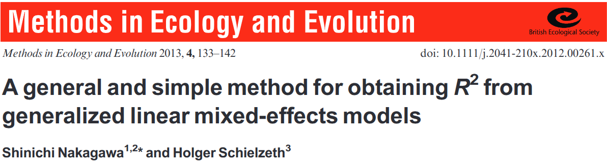
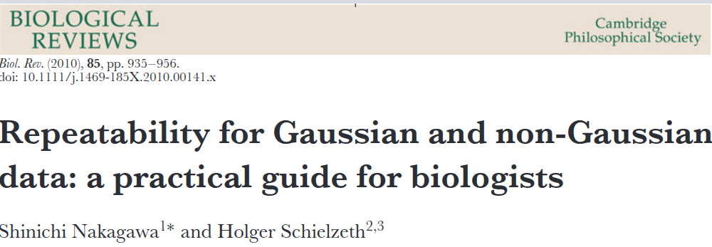

```{r setup, include=FALSE}
library(knitr)

default_source_hook <- knit_hooks$get('source')
default_output_hook <- knit_hooks$get('output')

knit_hooks$set(
  source = function(x, options) {
    paste0(
      "\n::: {.codebox data-latex=\"\"}\n\n",
      default_source_hook(x, options),
      "\n\n:::\n\n")
  }
)

knit_hooks$set(
  output = function(x, options) {
    paste0(
      "\n::: {.codebox data-latex=\"\"}\n\n",
      default_output_hook(x, options),
      "\n\n:::\n\n")
  }
)

knitr::opts_chunk$set(echo = TRUE)
library(gllvm)
TMB::openmp(parallel::detectCores()-1, autopar = TRUE, DLL = "gllvm")
```

# Outline

## Questions so far?

\center

{width=40%}

## Outline

- GLMs assume independence
- Mixed-effects can relax that assumption
- Also allow to incorporate correlation (between species)
  - I.e., JSDM

# Background

- We can formulate the same models
- But now, parameters come from a distribution

## Random-effects

When to include a random effect:

- Unobserved effect
- To account for pseudo replication
- Nuisance
- To induce correlation
- Shrinkage

## The mixed-effects model

\begin{equation}
              \tikz[baseline,remember picture]{
              \node[fill=green!20,anchor=base] (t2)
              {$g$};
            }
            \{
 \tikz[baseline,remember picture]{
              \node[fill=blue!20,anchor=base] (t1)
              {$\text{E}(\textbf{y} \vert \textbf{u})$};
            } 
            \}
            = 
            \tikz[baseline,remember picture]{
            \only<2>{
              \node[fill=purple!20,anchor=base] (t3)
              {$\textbf{X}$};
            }
            \only<1>{
              \node[rectangle,draw,dotted,fill=purple!20,anchor=base] (t3)
              {$\textbf{X}$};
            }
            }
            \tikz[baseline,remember picture]{
            \only<2>{
              \node[rectangle,draw,solid,fill=purple!20,anchor=base] (t4)
              {$\beta$};
            }
            \only<1>{
              \node[fill=purple!20,anchor=base] (t4)
              {$\beta$};
            }
            }
            + 
            \tikz[baseline,remember picture]{
            \only<2>{
             \node[dotted,fill=gray!20,anchor=base] (t5)
              {$\textbf{Z}$};
            }
            \only<1>{
            \node[rectangle,draw,dotted,fill=gray!20,anchor=base] (t5)
              {$\textbf{Z}$};
            }
            } 
             \tikz[baseline,remember picture]{
             \only<2>{
             \node[rectangle,draw,solid,fill=gray!20,anchor=base] (t6)
              {$\textbf{u}$};
            }
            \only<1>{
             \node[fill=gray!20,anchor=base] (t6)
              {$\textbf{u}$};
            }
             }
\end{equation}

\begin{enumerate}
    \item Link-function
        \tikz[na,remember picture]\node[coordinate] (n2) {};
    \item Conditional mean
        \tikz[na,remember picture]\node[coordinate] (n1) {};
    \item \alt<1>{Fixed effects design matrix}{Fixed effects parameter vector}
        \tikz[na,remember picture]\node[coordinate] (n3) {};
    \item\alt<1>{Random effects design matrix}{Random effects parameter vector}
        \tikz[na,remember picture]\node[coordinate] (n4) {};
\end{enumerate}

\begin{tikzpicture}[overlay,remember picture]
        \path[->] (n1) edge [bend right] (t1);
        \path[->] (n2) edge [bend right] (t2);
        \path[->]<1> (n3) edge [bend right] (t3);
        \path[->]<1> (n4) edge [bend right] (t5);
        \path[->]<2> (n3) edge [bend right] (t4);
        \path[->]<2> (n4) edge [bend right] (t6);
\end{tikzpicture}

## Likelihood formulation: independence

\begin{equation}
\mathcal{L}(\textbf{y};\Theta) = \prod \limits^n_i f(y_i;\Theta)
\end{equation}

We just multiply! (assumes independence)

## Our new likelihood

\begin{equation}
\mathcal{L}(\textbf{y};\symbf{\Sigma}) = \displaystyle \int \prod \limits^n_i f(y_i \vert \textbf{u}) f(\textbf{u};\symbf{\Sigma}) d\textbf{u}
\end{equation}

- Fixed effects: what we had so far
- Random effects: new, come from a distribution
- Mixed effects model: contains both

## Estimation
- Penalized quasi-likelihood methods
- Adaptive GH quadrature
- Laplace approximation (gllvm)
- Variational approximations (gllvm)
- Et cetera \footnotesize (see e.g., Bolker et al. 2009) \normalsize

\center Measure of central tendency: Mean or Mode

```{r, echo=F, eval=T, fig.show="hold", out.width="40%", fig.align="center"}
library(ggplot2)

ggplot(data.frame(x=0), aes(x=x))+stat_function(fun = dnorm, n = 101, args = list(mean = 0, sd = 1))+theme_classic()+geom_vline(aes(xintercept=0), col="red",lty="dashed")+theme(text = element_text(size=24))+xlim(c(-3,3))+xlab("Random effect")+ylab("Likelihood")

ggplot(data.frame(x=0), aes(x=x))+stat_function(fun = dgamma, n = 101, args = list(shape = 2, scale = 2))+theme_classic()+geom_vline(aes(xintercept=2), col="red",lty="dashed")+geom_vline(aes(xintercept=4), col="red",lty="dashed")+theme(text = element_text(size=24))+xlim(c(0,14))+ xlab("Random effect")+ylab("Likelihood")
#gamma mode is (k-1)*theta so here 2


```

## There are many \texttt{R}-packages

\columnsbegin
\column{0.5\textwidth}
\begin{itemize}
\item \texttt{nlme}
\item \texttt{lme4}
\item \texttt{glmmTMB} (or \texttt{glmmADMB})
\item \texttt{sdmTMB}
\item \texttt{MASS}
\item \texttt{glmmML}
\item \texttt{repeated}
\item \texttt{glmm}
\end{itemize}

\column{0.5\textwidth}
\begin{itemize}
\item \texttt{hglm}
\item \texttt{spaMM}
\item \texttt{gllvm}
\item \texttt{mcmcGLMM}
\item \texttt{INLA}
\item \texttt{inlabru}
\item MCMC frameworks (JAGS, STAN, NIMBLE, greta)
\end{itemize}
\columnsend

\center 

\textbf{\texttt{lme4} and \texttt{glmmTMB} are most commonly used.}

## \texttt{lme4} \footnotesize (Bates et al. 2015) \normalsize

\begin{center}

\begin{itemize}
\item Correlation between random effects
\item Sparse matrices
\item Modern matrix algebra libraries
\item Likelihood profiling
\item Uses Laplace approximation
\end{itemize}

\end{center}

\textcolor{red}{Can be fussy about convergence \footnotesize (and cannot fit VGLMMs)} 

## \texttt{glmmTMB} \footnotesize (Brooks et al. 2017) \normalsize

\begin{center}

\begin{itemize}
\item Very versatiile
\item Correlation between and within random effects (e.g., spatial)
\item Uses state-of-the art AD software  \footnotesize (TMB, Kristensen et al. 2015) \normalsize 
\item Many supported distributions
\begin{itemize}
  \item Tweedie
  \item Conway-Maxwell-Poisson
  \item Zero-inflation
\end{itemize}
\item Double hierarchical GLMs
\item Uses Laplace approximation
\end{itemize}

\end{center}

\textcolor{red}{Can fit VGLMMs and GLLVMs}

## gllvm

\begin{itemize}
\item Geared to multispecies data
\item Correlation between random effects and (some) within (spatial, temporal)
\item Uses state-of-the art AD software  \footnotesize (TMB, Kristensen et al. 2015) \normalsize 
\item Random-effects matrix if assumed the same for all species
\item Many supported distributions (not as many as \texttt{glmmTMB} yet)
\item Uses Variational (default), Laplace, or a combination (EVA)
\end{itemize}

\textcolor{red}{Least fussy in convergence}

# VGLMM

VGLMMs are GLMMs on steroids

- We have extra dispersion parameters
- There are many random effects
- The covariance matrix is the same across responses
- Things can get quite slow
- Optimization tends to be (even) more sensitive

## Random effects in \texttt{gllvm}

In the \texttt{gllvm} \texttt{R}-package there are three formula interfaces:

- `row.eff` \only<2->{: for species-common fixed/random effects}
- `formula` \only<3->{: for species-specific fixed/random effects}
- `lv.formula` \only<4->{: for effects in the ordination}

\only<4->{For now, we focus on `formula`}

## Random effects in \texttt{gllvm}

Our model is of the form:

\begin{equation}
\eta_{ij} = \textbf{x}_i^\top\symbf{\beta}_j
\end{equation}

but now, $\symbf{\beta}_j$ is a random effect (intercept or slope). Specifically, $\symbf{\beta}_j \sim \mathcal{N}(\symbf{\mu}, \Sigma)$

\pause 

- $\symbf{\mu}$: the "common effect" from before
- $\symbf{\Sigma}$: variation in species random effects

## The "common effect" from before

These are controlled with `row.eff`

- `row.eff` is a mixed-effects formula
- `row.eff = ~1` omits the common effects
- `row.eff = "random` incorporates row-specific random effects
- `row.eff = (1|group) + NO3` is a random effect and a fixed effect
- Can also incorporate spatial or temporal random effects

## Random effects \texttt{R} formula in \texttt{gllvm}

Now some examples of how it works in \texttt{R}. Generally:

`formula = ~ (0 + continuous | categorical)` \newline \hfill \tiny (the 0 is to omit an intercept term) \normalsize

"Nested":

`formula = ~ (1|a/b)` is the same as `formula = ~ (1|a:b + b)`
 
"Crossed":

`y ~ (1|a) + (1|b)`

Effects within the same brackets are assumed to be correlated

## Variation in mean abundance

$y_{ij} = \alpha_j, \qquad \text{with } \alpha_j \sim \mathcal{N}(\mu_\alpha,\sigma^2_\alpha)$

```{r, eval = FALSE}
formula = ~ (1|1), beta0com = TRUE
```

\columnsbegin
\column{0.5\textwidth}

```{r, echo = FALSE, fig.height = 7, cache = TRUE}
mu <- rnorm(1)
a <- rnorm(5, mu, sd = 0.5)

y <- replicate(10, rnorm(a, mean  = mu))

plot(c(y)~rep(1:5,times=10), cex = 3, ylab="Response variable", xlab = "Species", main = expression(sigma^2 == 1/4), cex.main = 3)
points(1, y=a[1], col = "red", cex = 3, pch = 19)
points(2, y=a[2], col = "orange", cex = 3, pch = 19)
points(3, y=a[3], col = "blue", cex = 3, pch = 19)
points(4, y=a[4], col = "forestgreen", cex = 3, pch = 19)
points(5, y=a[5], col = "brown", cex = 3, pch = 19)
abline(h = mu, col = "gray", lty = "dashed", lwd = 3)
```

\column{0.5\textwidth}

```{r, echo = FALSE, fig.height = 9, cache = TRUE}
a <- rnorm(5, mu, sd = 2)

y <- replicate(10, rnorm(a, mean  = mu))

plot(c(y)~rep(1:5,times=10), cex = 3, ylab="Response variable", xlab = "Species", main = expression(sigma^2 ==4), cex.main = 3)
points(1, y=a[1], col = "red", cex = 3, pch = 19)
points(2, y=a[2], col = "orange", cex = 3, pch = 19)
points(3, y=a[3], col = "blue", cex = 3, pch = 19)
points(4, y=a[4], col = "forestgreen", cex = 3, pch = 19)
points(5, y=a[5], col = "brown", cex = 3, pch = 19)
abline(h = mu, col = "gray", lty = "dashed", lwd = 3)
```

\columnsend

## Variation in environmental responses

$y_{ij} = \mu_\alpha + x_i\beta_j, \qquad \text{with } \beta_j \sim \mathcal{N}(\mu_\beta,\sigma^2_\beta)$

```{r, eval = FALSE}
formula= ~ (0+covariate|1), beta0com = TRUE
```

\columnsbegin
\column{0.5\textwidth}

```{r, echo = FALSE, fig.height = 9, cache = TRUE}
x <- rnorm(20)
mub = rnorm(1)
b <- rnorm(5, mub, sd = 0.5)

y <- rnorm(length(x)*5, mu+kronecker(b,x), sd = 0.5)

plot(y~kronecker(rep(1, 5), x), cex = 3, ylab="Response variable", xlab = "Explanatory variable", main = expression(sigma^2 == 1/4), cex.main = 3)
xnew <- seq(min(x)-2,max(x)+2, length.out=100)
lines(xnew, y=mu+xnew*b[1], col = "red", lwd = 2)
lines(xnew, y=mu+xnew*b[2], col = "orange", lwd = 2)
lines(xnew, y=mu+xnew*b[3], col = "blue", lwd = 2)
lines(xnew, y=mu+xnew*b[4], col = "forestgreen", lwd = 2)
lines(xnew, y=mu+xnew*b[5], col = "brown", lwd = 2)
abline(a = mu, b = mub, col="grey", lty = "dashed", lwd = 3)
```

\column{0.5\textwidth}

```{r, echo = FALSE, fig.height = 9, cache = TRUE}
x <- rnorm(20)
mub = rnorm(1)
b <- rnorm(5, mub, sd = 2)

y <- rnorm(length(x)*5, mu+kronecker(b,x), sd = 0.3)

plot(y~kronecker(rep(1, 5), x), cex = 3, ylab="Response variable", xlab = "Explanatory variable", main = expression(sigma^2 == 4), cex.main = 3)
xnew <- seq(min(x)-2,max(x)+2, length.out=100)
lines(xnew, y=mu+xnew*b[1], col = "red", lwd = 2)
lines(xnew, y=mu+xnew*b[2], col = "orange", lwd = 2)
lines(xnew, y=mu+xnew*b[3], col = "blue", lwd = 2)
lines(xnew, y=mu+xnew*b[4], col = "forestgreen", lwd = 2)
lines(xnew, y=mu+xnew*b[5], col = "brown", lwd = 2)
abline(a = mu, b = mub, col="grey", lty = "dashed", lwd = 3)
```

\columnsend

## \small  Variation of mean abundance and environmental responses

$y_{ij} = \alpha_j + x_i\beta_j, \text{  with } \left( \begin{array}{c}
    \alpha_j \\
    \beta_j\\
    \end{array} \right) \sim \mathcal{N}\biggl\{\begin{array}{c}
    \mu_\alpha \\
    \mu_\beta\\
    \end{array},
    \left( \begin{array}{cc}
    \sigma^2_\alpha & 0 \\
    0 & \sigma^2_\beta \\
    \end{array} \right)\biggr\}$

\footnotesize 
```{r, eval = FALSE}
formula= ~ (1|1)+(0+covariate|1), beta0com = TRUE
```
\normalsize

\columnsbegin

\column{0.5\textwidth}

```{r, echo = FALSE, fig.height = 9, cache = TRUE}
y <- rnorm(length(x)*5, rep(a, times = length(x))+kronecker(b,x), sd = 0.5)
plot(y~kronecker(rep(1, 5), x), cex = 3, ylab="Response variable", xlab = "Explanatory variable", main = expression(sigma^2 == 1/4), cex.main = 3)
xnew <- seq(min(x)-2,max(x)+2, length.out=100)
lines(xnew, y=a[1]+xnew*b[1], col = "red", lwd = 2)
lines(xnew, y=a[2]+xnew*b[2], col = "orange", lwd = 2)
lines(xnew, y=a[3]+xnew*b[3], col = "blue", lwd = 2)
lines(xnew, y=a[4]+xnew*b[4], col = "forestgreen", lwd = 2)
lines(xnew, y=a[5]+xnew*b[5], col = "brown", lwd = 2)
abline(a = mu, b = mub, col="grey", lty = "dashed", lwd = 3)
```

\column{0.5\textwidth}

```{r, echo = FALSE, fig.height = 9, cache = TRUE}
y <- rnorm(length(x)*5, rep(a, times = length(x))+kronecker(b,x), sd = 2)
plot(y~kronecker(rep(1, 5), x), cex = 3, ylab="Response variable", xlab = "Explanatory variable", main = expression(sigma^2 == 4), cex.main = 3)
xnew <- seq(min(x)-2,max(x)+2, length.out=100)
lines(xnew, y=a[1]+xnew*b[1], col = "red", lwd = 2)
lines(xnew, y=a[2]+xnew*b[2], col = "orange", lwd = 2)
lines(xnew, y=a[3]+xnew*b[3], col = "blue", lwd = 2)
lines(xnew, y=a[4]+xnew*b[4], col = "forestgreen", lwd = 2)
lines(xnew, y=a[5]+xnew*b[5], col = "brown", lwd = 2)
abline(a = mu, b = mub, col="grey", lty = "dashed", lwd = 3)
```

\columnsend

## \small Correlation of mean abundance and enviromental responses

$y_{ij} = \alpha_j + x_i\beta_j, \small \text{  with } \left( \begin{array}{c}
    \alpha_j \\
    \beta_j\\
    \end{array} \right) \sim \mathcal{N}\biggl\{\begin{array}{c}
    \mu_\alpha \\
    \mu_\beta\\
    \end{array},
    \left( \begin{array}{cc}
    \sigma^2_\alpha & \sigma_\alpha\sigma_\beta \rho \\
    \sigma_\beta \sigma_\alpha\rho & \sigma^2_\beta \\
    \end{array} \right)\biggr\}$

\footnotesize 
```{r, eval = FALSE}
formula= ~ (covariate|1), beta0com = TRUE
```
\normalsize

\columnsbegin
\column{0.5\textwidth}

```{r, echo = FALSE, fig.height = 9, cache = TRUE}
par <- MASS::mvrnorm(5, c(mu,mub), matrix(c(1,-0.8,-0.8,1),2,2))
a <- par[,1]
b <- par[,2]
y <- rnorm(length(x)*5, rep(a, times = length(x))+kronecker(b,x), sd = 0.3)

plot(y~kronecker(rep(1, 5), x), cex = 3, ylab="Response variable", xlab = "Explanatory variable", main = expression(rho == -0.8), cex.main = 3)
xnew <- seq(min(x)-2,max(x)+2, length.out=100)
lines(xnew, y=a[1]+xnew*b[1], col = "red", lwd = 2)
lines(xnew, y=a[2]+xnew*b[2], col = "orange", lwd = 2)
lines(xnew, y=a[3]+xnew*b[3], col = "blue", lwd = 2)
lines(xnew, y=a[4]+xnew*b[4], col = "forestgreen", lwd = 2)
lines(xnew, y=a[5]+xnew*b[5], col = "brown", lwd = 2)
abline(a = mu, b = mub, col="grey", lty = "dashed", lwd = 3)
```

\column{0.5\textwidth}

```{r, echo = FALSE, fig.height = 9, cache = TRUE}
par <- MASS::mvrnorm(5, c(mu,mub), matrix(c(1,0.8,0.8,1),2,2))
a <- par[,1]
b <- par[,2]
y <- rnorm(length(x)*5, rep(a, times = length(x))+kronecker(b,x), sd = 0.3)

plot(y~kronecker(rep(1, 5), x), cex = 3, ylab="Response variable", xlab = "Explanatory variable", main = expression(rho == 0.8), cex.main = 3)
xnew <- seq(min(x)-2,max(x)+2, length.out=100)
lines(xnew, y=a[1]+xnew*b[1], col = "red", lwd = 2)
lines(xnew, y=a[2]+xnew*b[2], col = "orange", lwd = 2)
lines(xnew, y=a[3]+xnew*b[3], col = "blue", lwd = 2)
lines(xnew, y=a[4]+xnew*b[4], col = "forestgreen", lwd = 2)
lines(xnew, y=a[5]+xnew*b[5], col = "brown", lwd = 2)
abline(a = mu, b = mub, col="grey", lty = "dashed", lwd = 3)
```

\columnsend

## Number of levels

In typical mixed-effects models, the rule of thumb is 5 levels to estimate a variance \newline

- Here, the species are our "levels" (so we usually have many)
- Few species: not a good variance estimate
- Fewer species: not a good correlation estimate

# Example 1

Remember: we have 14 species. Enough for variances, not for correlations.

In the previous presentation, we saw that NO3 had no statistically significant effect. We thus expect **shrinkage** (inverse related to variance - so low variance) from a random effects model.

## Wetland macroinvertebrates

```{r, echo = FALSE}
dat <- read.csv("../data/Wetlands.csv")
# data2018<-data[data$Year=="2018",]
# row.names(data2018) <- data2018$Site
y <- dat[,tail(1:ncol(dat),14)]
X <- dat[,head(1:ncol(dat),-14)][,-1]
X$Hydro<-as.factor(X$Hydro)
X$Water_Type<-as.factor(X$Water_Type)
```
\tiny

Always standardise (center, scale) your covariates with numerical optimisation, and for comparison of effects.

```{r X}
X <- data.frame(sapply(X,function(x)if(is.numeric(x)){scale(x)}else{x}, simplify = FALSE))
```

```{r glmm, warning=FALSE, cache = TRUE}
model1 <- gllvm(y, X = X, formula = ~NO3, beta0com = TRUE, family = "negative.binomial", num.lv = 0)
model2 <- gllvm(y, X = X, formula = ~(0+NO3|1), beta0com = TRUE, family = "negative.binomial", num.lv = 0)
```

## Wetlands: summary

\tiny
```{r sum2, echo = FALSE}
summary(model2)
```

## Results: plots

\columnsbegin
\column{0.5\textwidth}

\tiny

```{r sum2b, fig.height = 9}
plot(summary(model2))
```

\column{0.5\textwidth}

\tiny

```{r rcoef2, fig.height = 9}
randomCoefplot(model2)
```


\columnsend

## Results: comparison

\columnsbegin
\column{0.5\textwidth}


```{r coef1, fig.height = 9, echo = FALSE}
coefplot(model1, xlim = list(c(-10,10)))
```

\column{0.5\textwidth}


```{r rcoef1, fig.height = 9, echo = FALSE}
randomCoefplot(model2, xlim = list(c(-10,10)))
```

\columnsend

We see: the "extreme" results (CI but also estimates) have been reigned in.

## Wetlands: two effects

Let's add more effects

\footnotesize

```{r mod3, cache = TRUE}
model3 <- gllvm(y, X = X, formula = ~(1|1)+(0+NO3|1)+(0+SO4|1),
                beta0com = TRUE, family = "negative.binomial", num.lv = 0)
```

## Intraclass correlation

Here, we did not incorporate correlation. But, we can represent similarity of species in terms of (partial) *intraclass* correlation

\begin{equation}
ICC_p = \frac{\text{\text{var}(SO4)}}{\text{var}(I+NO3+SO4)}
\end{equation}

\footnotesize
```{r ic1}
(sigma <- diag(model3$params$sigmaB))
sigma[2]/sum(sigma)
```


<!-- ## Results: turnover -->

<!-- \columnsbegin -->
<!-- \column{0.5\textwidth} -->
<!-- \tiny -->

<!-- ```{r} -->
<!-- S <- model1$params$sigmaB -->
<!-- x <- matrix(c(0, 1, 0,0,1,1), ncol = 2) -->
<!-- corrplot::corrplot(cov2cor(t(x)%*%S%*%x)) -->
<!-- ``` -->

<!-- \normalsize -->

<!-- \column{0.5\textwidth} -->

<!-- \vspace{2\baselineskip} -->

<!-- So, regardless of the water type, we expect to see the same community. \newline -->

<!-- We'll give you something more interesting to look at in the exercise! -->

<!-- \columnsend -->


# Variation

## What this all means ecologically

We usually assume that an effect with higher variance, has a larger impact on the composition of a community.

\pause

We can connect these statistical concepts to more familiar ecological concepts \footnotesize (pub. in prep.)

- Alpha diversity: (average) within-site variation
- Beta diversity: between-site variation
- Gamma diversity: total variation

And formulate our model accordingly.

## Alpha diversity: within sites

$y_{ij} = \alpha_{j}+x_i\beta_j$

\begin{equation}
\begin{aligned}
\text{var}(\alpha_i+x_i\beta_j) &= \mathbb{E}(\alpha^2)+\mathbb{E}(\beta_j^2) \\
&= \sigma_\alpha^2 + x_i^2\sigma_\beta^2
\end{aligned}
\end{equation}

## Gamma diversity: across sites

$y_{ij} = \alpha_{ij}+x_i\beta_j$

\begin{equation}
\begin{aligned}
\text{var}_{ij}(\alpha_j+x_i\beta_j) &= \mathbb{E}_j\{\text{var}_i(\eta_{ij})\} + \text{var}_j\{\mathbb{E}_i(\eta_{ij})\} \\ &= \sigma^2_\alpha+\sigma^2_\beta\{\bar{x}+\text{var}(x_i)\}
\end{aligned}
\end{equation}

## Beta diversity: between sites

$y_{ij} = \alpha_{j}+x_i\beta_j$

$\text{cov}(\alpha_j+x_i\beta_j,\alpha_j+x_k\beta_j) = \sigma^2_\alpha + x_kx_i\sigma^2_\beta$

So, the change in beta diversity is:

$\text{cov}(\alpha_j+x_i\beta_j,\alpha_j+x_k\beta_j) - \text{cov}(\alpha_j+x_i\beta_j,\alpha_j+x_l\beta_j) = x_i(x_k - x_l)\sigma^2_\beta$


## $R^2_{GLMM}$ and repeatability






## Correlation and diversity

When calculating diversity, we need to take the correlation into consideration. For beta diversity:

\begin{equation}
\text{cov}(\alpha_j + \textbf{x}_i^\top\symbf{\beta}_j, \alpha_j + \textbf{x}_k^\top\symbf{\beta}_j) = \textbf{x}_i^\top\Sigma\textbf{x}_k
\end{equation}

The correlation parameters represent parallel change in the community on gradients

and similarly for the change in beta diversity.

# Example 2

For the Swiss birds, we have 56 species, so we can do a little more.

In the previous presentation, we saw that the effect of slope was a statistically significant. Treated as random, it is not.

```{r swiss, echo  =FALSE, message=FALSE, warning=FALSE}
avi_dat <- read.csv('../data/SwissBirds.csv')
y <- as.matrix(avi_dat[,1:56])
X <- avi_dat[,-c(1:56)]
X <- X[rowSums(y)>0, ]
y <- y[rowSums(y)>0,]
X<-X[,-which(apply(X,2,anyNA))]
X <- data.frame(sapply(X,function(x)if(is.numeric(x)){scale(x)}else{x}, simplify = FALSE))
# data <- data.frame(y, X)
# datalong <- reshape(data, 
#                     varying = colnames(y), 
#                     v.names = "occ", 
#                     idvar = "Site", 
#                     timevar = "Species", 
#                     direction = "long")
# 
# datalong$Species <- factor(datalong$Species, 
#                            labels = colnames(y))

# invisible(TMB::openmp(7,autopar=TRUE, DLL = "gllvm"))
# system.time(model4 <- gllvm(y, X = X, formula = ~(0+slp|1), family = "binomial", num.lv = 0))
# options(glmmTMB.cores=7,autopar=TRUE)
# system.time(model5 <- glmmTMB::glmmTMB(occ~0+Species + slp + (0+slp|Species), family=binomial(link='probit'), data = datalong))
```

\scriptsize 

## Example 2: correlated effects

\footnotesize

```{r cor, cache = TRUE}
model6 <- gllvm(y, X = X, formula = ~(slp+asp|1), 
                family = "binomial", num.lv = 0, 
                beta0com = TRUE)
```

Perhaps, birds prefer flat areas in the sun.

## Example 2: correlated effects

\scriptsize

```{r corsum, echo = FALSE}
summary(model6)
```

Birds with a high(er) baseline occurrence tend to respond more positively to canopy cover.

## Example 2: correlated effects

\footnotesize

```{r cor2, fig.height = 5}
randomCoefplot(model6)
```

\vspace{-\baselineskip}

## Intraclass correlation

We can also do this with correlated effects. \hfill \footnotesize var(a+b) = var(a)+var(b) + 2cov(a+b)

\scriptsize

\begin{equation}
ICC_p = \frac{\text{\text{var}(slope)}}{\sum \Sigma_\beta}
\end{equation}

\pause

\footnotesize

```{r ic2}
Sigma <- model6$params$sigmaB
sigma <- diag(model6$params$sigmaB)
sigma[2]/sum(Sigma)
```

The model predicts that 26% of the change in community composition is due to slope.

Steeper areas have lower species richness (due to the negative average effect).

## Predicting diversity

As we have explicit equations for diversity, we can predict is using the model.

We take the parameter estimates for the variances, plug-in new values for the covariates (account for scaling), and put it on a map.

\footnotesize

```{r maprep, echo = FALSE, warning=FALSE, message=FALSE}
slp_scale <- scale(avi_dat$slp)
asp_scale<-scale(avi_dat$asp)
source("switzerland/slope.R")
x = as.matrix(data.frame(1,(values(slope)-attr(slp_scale,"scaled:center"))/attr(slp_scale,"scaled:scale"),(values(aspect)-attr(asp_scale,"scaled:center"))/attr(asp_scale,"scaled:scale")))
alpha = slope
terra::values(alpha) = rowSums(x*(x%*%model6$params$sigmaB))
```

## Predicting alpha diversity

```{r map, dpi = 300, echo = FALSE, cache = TRUE, warning=FALSE,message=FALSE}
library(ggplot2)
library(tidyr)
library(dplyr)
dat <- as.data.frame(alpha,xy=TRUE) %>%
  pivot_longer(cols = -c(x, y), names_to = "layer", values_to = "value")

plt<-ggplot() +         # layer 3
  theme_classic()+theme(axis.text=element_blank(), axis.ticks=element_blank())+scale_fill_viridis_c(name="Alpha diversity", na.value="white")+geom_raster(data=dat, aes(x=x, y=y, fill = value), interpolate=TRUE)+coord_fixed()+xlab(NULL)+ylab(NULL)+ggtitle("Bird alpha diversity (due to mean abundance, aspect and slope)")
plt
```

## Alpha diversity

\footnotesize

Alpha diversity can more flexibly be estimated as:

```{r bigmodel1, cache = TRUE, echo = -1, eval = FALSE}
# will take a while to run
model7 <- gllvm(y, X = cbind(X, Site = factor(1:nrow(y))), 
                formula = ~diag(1|Site)+(slp+asp|1), 
                family = "binomial", num.lv = 0, 
                beta0com = TRUE, Ab.struct = "diagonal",
                optim.method = "L-BFGS-B", sd.errors = FALSE)
```

but note that site-specific variance is not equal to alpha diversity.

## Gamma diversity

\footnotesize

Gamma diversity can be more flexibly estimated as:

```{r bigmodel2, cache = TRUE, echo = -1, eval = FALSE}
# will take a while to run
model8 <- gllvm(y, X = cbind(X, Site = factor(1:nrow(y))), 
                formula = ~(1|1) + diag(1|Site)+(slp+asp|1), 
                family = "binomial", num.lv = 0, beta0com = TRUE, 
                Ab.struct = "diagonal", optim.method = "L-BFGS-B",
                sd.errors = FALSE)
```

but also nicely corresponds to `row.eff = ~(1|site)` perhaps


## Philosophy

So, our attitude becomes a little different. We can adjust the model, to formulate a certain measure of diversity.

<!-- ## Turnover -->

<!-- - Turnover (i.e., community change) is a represent by intraclass correlation \newline -->
<!-- - Variances of slopes represent the pace of change in the community as we move through the landscape -->
<!-- - Variances of intercepts represent the  -->

<!-- # Species correlation -->

<!-- If we fit a GLM to data of multiple species, we assume \textbf{independence} -->

<!-- \textcolor{red}{But, observations of the same species form groups. Co-occurring species have  more similar observations than for other species} -->

<!-- In GLMM language: \textbf{observations of species exhibit correlation} -->

<!-- 1) Part of this can be explained by shared environmental responses -->
<!-- 2) The other part remains -->

<!-- ## Joint Species Distribution Model (JSDM) -->

<!-- - For community data, we want to incorporate correlation of species -->
<!-- - We have \textcolor{red}{Multivariate} data (in contrast to multivariable) -->
<!--   - Each species is a response variable -->

<!-- \begin{equation} -->
<!-- g\{\mathams{E}(\textbf{y}_i \vert \symbf{\epsilon}_i)\} = \symbf{\beta}_0 + \textbf{x}_i^\top\symbf{\beta} + \symbf{\epsilon}_i -->
<!-- \end{equation} -->

<!-- - $\symbf{\epsilon}_i$ is our error -->
<!-- - The error takes care of the left-over variation between species -->
<!-- - so we assume $\symbf{\epsilon}_i \sim \mathcal{N}(\textbf{0}, \symbf{\Sigma})$ -->
<!-- - $\symbf{\Sigma}$ is the matrix of species associations -->

<!-- ## Spiders: JSADM -->

<!-- \footnotesize -->

<!-- ```{r, echo  =FALSE} -->
<!-- data(spider,package="mvabund") -->
<!-- data <- data.frame(spider$abund, spider$x, total = rowSums(spider$abund)) -->
<!-- datalong <- reshape(data,  -->
<!--                     varying = colnames(spider$abund),  -->
<!--                     v.names = "Count",  -->
<!--                     idvar = "Site",  -->
<!--                     timevar = "Species",  -->
<!--                     direction = "long") -->

<!-- datalong$Species <- factor(datalong$Species,  -->
<!--                            labels = colnames(spider$abund)) -->
<!-- ``` -->
<!-- ```{r, cache = TRUE} -->
<!-- model <- lme4::glmer(Count ~ Species + Species*soil.dry + (0+Species|Site),  -->
<!--                      family = "poisson", data = datalong) -->
<!-- ``` -->

<!-- \normalsize -->

<!-- ## Species associations: strategies -->

<!-- There few different methods for dealing with this:  -->

<!-- 1) "Reduced rank" or "Factor analytic" approach (GLLVMs, tomorrow) -->
<!-- 2) Penalize the matrix \footnotesize [Pichler and Hartig 2023](https://doi.org/10.1111/2041-210X.13687) -->
<!-- 3) ? -->

<!-- So, we do not usually (explicitly) fit JSDMs unconstrainedly -->

# Summary

Everything gets more difficult when we use mixed-effects models:

- Wald-statistic and p-values no longer (really) apply
- Hypothesis test does not always work well (on the boundary)
- Model selection does not usually work well
- Residuals are harder to define
- We should test extra (random effect) assumptions

\pause

\textcolor{red}{And even more so for VGLMMs}

## Take away tips

\begin{center}
\textcolor{red}{\href{https://en.wikipedia.org/wiki/No_free_lunch_theorem}{No free lunch in statistics}}
\end{center}

- There are loads of fun things to do with VGLMMs
- Particularly for diversity calculations
- Keep your model as simple as possible, but not simpler
- Different packages have different benefits
  - \texttt{gllvm} vs. \texttt{glmmTMB} vs. \texttt{lme4}

\centering

\textcolor{red}{There are many uses for random effects for community ecology}

# End

\center

{width=75%}