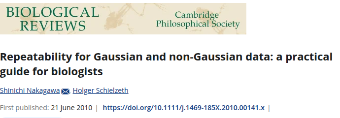
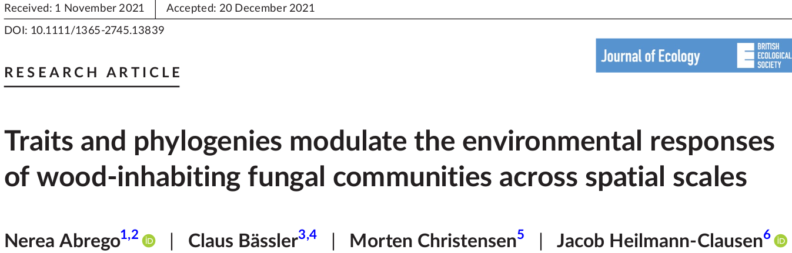

```{r setup, include=FALSE}
library(knitr)

default_source_hook <- knit_hooks$get('source')
default_output_hook <- knit_hooks$get('output')

knit_hooks$set(
  source = function(x, options) {
    paste0(
      "\n::: {.codebox data-latex=\"\"}\n\n",
      default_source_hook(x, options),
      "\n\n:::\n\n")
  }
)

knit_hooks$set(
  output = function(x, options) {
    paste0(
      "\n::: {.codebox data-latex=\"\"}\n\n",
      default_output_hook(x, options),
      "\n\n:::\n\n")
  }
)

library(knitr)
hook_output <- knit_hooks$get("output")
knit_hooks$set(output = function(x, options) {
  lines <- options$output.lines
  if (is.null(lines)) {
    return(hook_output(x, options))  # pass to default hook
  }
  x <- unlist(strsplit(x, "\n"))
  more <- "..."
  if (length(lines)==1) {        # first n lines
    if (length(x) > lines) {
      # truncate the output, but add ....
      x <- c(head(x, lines), more)
    }
  } else {
    x <- c(more, x[lines], more)
  }
  # paste these lines together
  x <- paste(c(x, ""), collapse = "\n")
  hook_output(x, options)
})

knitr::opts_chunk$set(echo = TRUE)
library(gllvm)
TMB::openmp(parallel::detectCores()-1, autopar = TRUE, DLL = "gllvm")
```

# Background 

## Questions so far?

\center

{width=40%}

## Random-effects

When to include a random effect:

- Unobserved effect
- To account for pseudo replication
- Nuisance
- To induce correlation
- Shrinkage

## Why "random" effects?

"Random" is in contrast to "fixed":

\begin{itemize}
\item Fixed effects are \textbf{maximised}: the likelihood is optimised directly over $\hat{\symbf{\beta}}$
\item Random effects are \textbf{marginalised}: $\textbf{u}$ is integrated out of the likelihood
\end{itemize}

\pause

Random effects are stochastic: like the data, they come from a distribution $\mathbf{u} \sim \mathcal{N}(\mathbf{0}, \symbf{\Sigma})$.  \textcolor{red}{A \textbf{mixed-effects model} contains both.}

## Our new likelihood

\begin{equation}
\mathcal{L}(\textbf{y};\symbf{\Sigma}) = \displaystyle \int \prod \limits^n_i f(y_i \vert \textbf{u}) \mathcal{N}(\textbf{u};\symbf{\Sigma}) d\textbf{u}
\end{equation}

We approximate with:

- Penalized quasi-likelihood methods
- Adaptive GH quadrature
- Laplace approximation (gllvm)
- Variational approximations (gllvm)

## Estimation and $\textbf{u}\vert \textbf{y}$

The posterior can be skewed for non-Gaussian responses (right); mode-based methods (Laplace) and mean-based methods (Variational) then give different results:

```{r, echo=F, eval=T, fig.show="hold", out.width="40%", fig.align="center"}
library(ggplot2)

ggplot(data.frame(x=0), aes(x=x))+stat_function(fun = dnorm, n = 101, args = list(mean = 0, sd = 1))+theme_classic()+geom_vline(aes(xintercept=0), col="red",lty="dashed")+theme(text = element_text(size=24))+xlim(c(-3,3))+xlab("Random effect")+ylab("Likelihood")

ggplot(data.frame(x=0), aes(x=x))+stat_function(fun = dgamma, n = 101, args = list(shape = 2, scale = 2))+theme_classic()+geom_vline(aes(xintercept=2), col="red",lty="dashed")+geom_vline(aes(xintercept=4), col="red",lty="dashed")+theme(text = element_text(size=24))+xlim(c(0,14))+ xlab("Random effect")+ylab("Likelihood")
#gamma mode is (k-1)*theta so here 2


```

## The mixed-effects model

\begin{equation}
              \tikz[baseline,remember picture]{
              \node[fill=green!20,anchor=base] (t2)
              {$g$};
            }
            \{
 \tikz[baseline,remember picture]{
              \node[fill=blue!20,anchor=base] (t1)
              {$\text{E}(\textbf{y} \vert \textbf{u})$};
            }
            \}
            =
            \tikz[baseline,remember picture]{
            \only<2>{
              \node[fill=purple!20,anchor=base] (t3)
              {$\textbf{X}$};
            }
            \only<1>{
              \node[rectangle,draw,dotted,fill=purple!20,anchor=base] (t3)
              {$\textbf{X}$};
            }
            }
            \tikz[baseline,remember picture]{
            \only<2>{
              \node[rectangle,draw,solid,fill=purple!20,anchor=base] (t4)
              {$\beta$};
            }
            \only<1>{
              \node[fill=purple!20,anchor=base] (t4)
              {$\beta$};
            }
            }
            +
            \tikz[baseline,remember picture]{
            \only<2>{
             \node[dotted,fill=gray!20,anchor=base] (t5)
              {$\textbf{Z}$};
            }
            \only<1>{
            \node[rectangle,draw,dotted,fill=gray!20,anchor=base] (t5)
              {$\textbf{Z}$};
            }
            }
             \tikz[baseline,remember picture]{
             \only<2>{
             \node[rectangle,draw,solid,fill=gray!20,anchor=base] (t6)
              {$\textbf{u}$};
            }
            \only<1>{
             \node[fill=gray!20,anchor=base] (t6)
              {$\textbf{u}$};
            }
             }
\end{equation}

\begin{enumerate}
    \item Link-function
        \tikz[na,remember picture]\node[coordinate] (n2) {};
    \item Conditional mean
        \tikz[na,remember picture]\node[coordinate] (n1) {};
    \item \alt<1>{Fixed effects design matrix}{Fixed effects parameter vector}
        \tikz[na,remember picture]\node[coordinate] (n3) {};
    \item\alt<1>{Random effects design matrix}{Random effects parameter vector}
        \tikz[na,remember picture]\node[coordinate] (n4) {};
\end{enumerate}

\begin{tikzpicture}[overlay,remember picture]
        \path[->] (n1) edge [bend right] (t1);
        \path[->] (n2) edge [bend right] (t2);
        \path[->]<1> (n3) edge [bend right] (t3);
        \path[->]<1> (n4) edge [bend right] (t5);
        \path[->]<2> (n3) edge [bend right] (t4);
        \path[->]<2> (n4) edge [bend right] (t6);
\end{tikzpicture}


## There are many \texttt{R}-packages

\columnsbegin
\column{0.5\textwidth}
\begin{itemize}
\item \texttt{nlme}
\item \texttt{lme4}
\item \texttt{glmmTMB} (or \texttt{glmmADMB})
\item \texttt{sdmTMB}
\item \texttt{MASS}
\item \texttt{glmmML}
\item \texttt{repeated}
\item \texttt{glmm}
\end{itemize}

\column{0.5\textwidth}
\begin{itemize}
\item \texttt{hglm}
\item \texttt{spaMM}
\item \texttt{gllvm}
\item \texttt{mcmcGLMM}
\item \texttt{INLA}
\item \texttt{inlabru}
\item MCMC frameworks (JAGS, STAN, NIMBLE, greta)
\end{itemize}
\columnsend


## \texttt{glmmVA} \footnotesize (gllvm) \normalsize

\begin{center}

\begin{itemize}
\item Long-format interface for multispecies data
\item Species-specific fixed and random effects
\item \texttt{lme4}-style formula for random effects
\item Uses variational approximation \footnotesize (same as \texttt{gllvm}) \normalsize
\item Familiar syntax; bridges VGLMs to VGLMMs
\end{itemize}

\end{center}


## Random effects in \texttt{gllvm}

In the \texttt{gllvm} \texttt{R}-package there are three formula interfaces:

- `glmmVA` \only<2->{: for ordinary GLM(M)s}
- `row.eff` \only<3->{: for species-common fixed/random effects}
- `formula` \only<4->{: for species-specific fixed/random effects}
- `lv.formula` \only<5->{: for effects in the ordination}

## Random effects syntax in \texttt{gllvm::glmmVA}

Now some examples of how it works in \texttt{R}. Generally:

`formula = ~ (0 + covariate | grouping)` \newline \hfill \tiny (the 0 is to omit an intercept term) \normalsize

"Nested":

`formula = ~ (1|a/b)` is the same as `formula = ~ (1|a:b + b)`

"Crossed":

`y ~ (1|a) + (1|b)`

Effects within the same brackets are assumed to be correlated

## Random effects syntax: implications

LHS determines the size of $\symbf{\Sigma}$; RHS the number of draws per $1 \ldots n$ site ($p$ species).

\vspace{0.5em}

\begin{center}
\footnotesize
\begin{tabular}{lccc}
\toprule
Formula & $\symbf{\Sigma}$ & REs per site & Total REs \\
\midrule
\texttt{(1|Site)} & $1 \times 1$ & $1$ & $n$ \\
\texttt{(0+Species|Site)} & $p \times p$ & $p$ & $p \cdot n$ \\
\texttt{(Species|Site)} & $(p+1) \times (p+1)$ & $p+1$ & $(p+1) \cdot n$ \\
\bottomrule
\end{tabular}
\normalsize
\end{center}


# GLMMs for community ecology

- Hierarchical study designs are easily accommodated
- Quantify variation in species environmental responses
- Rare species borrow strength from the community: shrinkage to the mean
- Variance components summarize community-level structure: ICC and repeatability
- Covariance components can summarize niche attributes
- Correlation relaxes vital assumptions; species independence

\centering

\textcolor{red}{Some examples follow}

```{r wetlands-long, echo=FALSE, message=FALSE, warning=FALSE}
dat <- read.csv("../data/Wetlands.csv")
y <- dat[,tail(1:ncol(dat),14)][,-14]
X <- dat[,head(1:ncol(dat),-14)][,-1]
X$Hydro <- as.factor(X$Hydro)
X$Water_Type <- as.factor(X$Water_Type)
X <- data.frame(sapply(X, function(x) if(is.numeric(x)) scale(x) else x, simplify=FALSE))
long <- data.frame(y, X, Site=factor(1:nrow(y)))
long <- reshape(long, varying=colnames(y), v.names="Count",
                idvar="Site", timevar="Species", direction="long")
long$Species <- factor(long$Species, labels=colnames(y))
```

## What VGLMMs add

A VGLM estimates one fixed effect per species: it describes species' mean responses but cannot say how much they vary.

\begin{itemize}
\item \textbf{Variance components} ($\sigma^2$): how large is between-species variation in responses? Quantifies environmental filtering and niche variation.
\item \textbf{Shrinkage}: rare species borrow strength from the community mean; estimates are regularized rather than fit freely to noise.
\item \textbf{ICC and repeatability}: translate variance components into interpretable fractions. How much variation is explained by site? By species identity?
\end{itemize}

## Variation in mean abundance

$y_{ij} = \mu_\alpha + \alpha_j, \qquad \text{with } \alpha_j \sim \mathcal{N}(0,\sigma^2_\alpha)$

```{r, eval = FALSE}
y ~ (1|Species)
```

\columnsbegin
\column{0.5\textwidth}

```{r, echo = FALSE, fig.height = 9, cache = TRUE}
mu <- rnorm(1)
a <- rnorm(5, mu, sd = 0.5)

y <- replicate(10, rnorm(a, mean  = mu))

plot(c(y)~rep(1:5,times=10), cex = 3, ylab="Response variable", xlab = "Species", main = expression(sigma^2 == 1/4), cex.main = 3)
points(1, y=a[1], col = "red", cex = 3, pch = 19)
points(2, y=a[2], col = "orange", cex = 3, pch = 19)
points(3, y=a[3], col = "blue", cex = 3, pch = 19)
points(4, y=a[4], col = "forestgreen", cex = 3, pch = 19)
points(5, y=a[5], col = "brown", cex = 3, pch = 19)
abline(h = mu, col = "gray", lty = "dashed", lwd = 3)
```

\column{0.5\textwidth}

```{r, echo = FALSE, fig.height = 9, cache = TRUE}
a <- rnorm(5, mu, sd = 2)

y <- replicate(10, rnorm(a, mean  = mu))

plot(c(y)~rep(1:5,times=10), cex = 3, ylab="Response variable", xlab = "Species", main = expression(sigma^2 ==4), cex.main = 3)
points(1, y=a[1], col = "red", cex = 3, pch = 19)
points(2, y=a[2], col = "orange", cex = 3, pch = 19)
points(3, y=a[3], col = "blue", cex = 3, pch = 19)
points(4, y=a[4], col = "forestgreen", cex = 3, pch = 19)
points(5, y=a[5], col = "brown", cex = 3, pch = 19)
abline(h = mu, col = "gray", lty = "dashed", lwd = 3)
```

\columnsend

## Variation in environmental responses

$y_{ij} = \mu_\alpha + x_i\mu_\beta + x_i\beta_j, \qquad \text{with } \beta_j \sim \mathcal{N}(0,\sigma^2_\beta)$

```{r, eval = FALSE}
y ~ covariate + (0+covariate|Species)
```

\columnsbegin
\column{0.5\textwidth}

```{r, echo = FALSE, fig.height = 9, cache = TRUE}
x <- rnorm(20)
mub = rnorm(1)
b <- rnorm(5, mub, sd = 0.5)

y <- rnorm(length(x)*5, mu+kronecker(b,x), sd = 0.5)

plot(y~kronecker(rep(1, 5), x), cex = 3, ylab="Response variable", xlab = "Explanatory variable", main = expression(sigma^2 == 1/4), cex.main = 3)
xnew <- seq(min(x)-2,max(x)+2, length.out=100)
lines(xnew, y=mu+xnew*b[1], col = "red", lwd = 2)
lines(xnew, y=mu+xnew*b[2], col = "orange", lwd = 2)
lines(xnew, y=mu+xnew*b[3], col = "blue", lwd = 2)
lines(xnew, y=mu+xnew*b[4], col = "forestgreen", lwd = 2)
lines(xnew, y=mu+xnew*b[5], col = "brown", lwd = 2)
abline(a = mu, b = mub, col="grey", lty = "dashed", lwd = 3)
```

\column{0.5\textwidth}

```{r, echo = FALSE, fig.height = 9, cache = TRUE}
x <- rnorm(20)
mub = rnorm(1)
b <- rnorm(5, mub, sd = 2)

y <- rnorm(length(x)*5, mu+kronecker(b,x), sd = 0.3)

plot(y~kronecker(rep(1, 5), x), cex = 3, ylab="Response variable", xlab = "Explanatory variable", main = expression(sigma^2 == 4), cex.main = 3)
xnew <- seq(min(x)-2,max(x)+2, length.out=100)
lines(xnew, y=mu+xnew*b[1], col = "red", lwd = 2)
lines(xnew, y=mu+xnew*b[2], col = "orange", lwd = 2)
lines(xnew, y=mu+xnew*b[3], col = "blue", lwd = 2)
lines(xnew, y=mu+xnew*b[4], col = "forestgreen", lwd = 2)
lines(xnew, y=mu+xnew*b[5], col = "brown", lwd = 2)
abline(a = mu, b = mub, col="grey", lty = "dashed", lwd = 3)
```

\columnsend

## \small  Variation of mean abundance and environmental responses

$y_{ij} = \mu_\alpha + \alpha_j + x_i(\mu_\beta + \beta_j), \text{  with } \left( \begin{array}{c}
    \alpha_j \\
    \beta_j\\
    \end{array} \right) \sim \mathcal{N}\biggl(\begin{array}{c}
    0 \\
    0\\
    \end{array},
    \begin{array}{cc}
    \sigma^2_\alpha & 0 \\
    0 & \sigma^2_\beta \\
    \end{array}\biggr)$

\footnotesize
```{r, eval = FALSE}
y ~ covariate + (covariate||Species)
```
\normalsize

\columnsbegin

\column{0.5\textwidth}

```{r, echo = FALSE, fig.height = 9, cache = TRUE}
y <- rnorm(length(x)*5, rep(a, times = length(x))+kronecker(b,x), sd = 0.5)
plot(y~kronecker(rep(1, 5), x), cex = 3, ylab="Response variable", xlab = "Explanatory variable", main = expression(sigma^2 == 1/4), cex.main = 3)
xnew <- seq(min(x)-2,max(x)+2, length.out=100)
lines(xnew, y=a[1]+xnew*b[1], col = "red", lwd = 2)
lines(xnew, y=a[2]+xnew*b[2], col = "orange", lwd = 2)
lines(xnew, y=a[3]+xnew*b[3], col = "blue", lwd = 2)
lines(xnew, y=a[4]+xnew*b[4], col = "forestgreen", lwd = 2)
lines(xnew, y=a[5]+xnew*b[5], col = "brown", lwd = 2)
abline(a = mu, b = mub, col="grey", lty = "dashed", lwd = 3)
```

\column{0.5\textwidth}

```{r, echo = FALSE, fig.height = 9, cache = TRUE}
y <- rnorm(length(x)*5, rep(a, times = length(x))+kronecker(b,x), sd = 2)
plot(y~kronecker(rep(1, 5), x), cex = 3, ylab="Response variable", xlab = "Explanatory variable", main = expression(sigma^2 == 4), cex.main = 3)
xnew <- seq(min(x)-2,max(x)+2, length.out=100)
lines(xnew, y=a[1]+xnew*b[1], col = "red", lwd = 2)
lines(xnew, y=a[2]+xnew*b[2], col = "orange", lwd = 2)
lines(xnew, y=a[3]+xnew*b[3], col = "blue", lwd = 2)
lines(xnew, y=a[4]+xnew*b[4], col = "forestgreen", lwd = 2)
lines(xnew, y=a[5]+xnew*b[5], col = "brown", lwd = 2)
abline(a = mu, b = mub, col="grey", lty = "dashed", lwd = 3)
```

\columnsend

## \small Correlation of mean abundance and environmental responses

$y_{ij} = \mu_\alpha + \alpha_j + x_i(\mu_\beta + \beta_j), \small \left( \begin{array}{c}
    \alpha_j \\
    \beta_j\\
    \end{array} \right) \sim \mathcal{N}\biggl(\begin{array}{c}
    0 \\
    0\\
    \end{array},
    \begin{array}{cc}
    \sigma^2_\alpha &  \sigma_{\alpha,\beta} \\ %\sigma_\alpha\sigma_\beta \rho
    \sigma_{\beta,\alpha} & \sigma^2_\beta \\
    \end{array}\biggr)$

\footnotesize
```{r, eval = FALSE}
y ~ covariate + (covariate|Species)
```
\normalsize

\columnsbegin
\column{0.5\textwidth}

```{r, echo = FALSE, fig.height = 9, cache = TRUE}
par <- MASS::mvrnorm(5, c(mu,mub), matrix(c(1,-0.8,-0.8,1),2,2))
a <- par[,1]
b <- par[,2]
y <- rnorm(length(x)*5, rep(a, times = length(x))+kronecker(b,x), sd = 0.3)

plot(y~kronecker(rep(1, 5), x), cex = 3, ylab="Response variable", xlab = "Explanatory variable", main = expression(rho == -0.8), cex.main = 3)
xnew <- seq(min(x)-2,max(x)+2, length.out=100)
lines(xnew, y=a[1]+xnew*b[1], col = "red", lwd = 2)
lines(xnew, y=a[2]+xnew*b[2], col = "orange", lwd = 2)
lines(xnew, y=a[3]+xnew*b[3], col = "blue", lwd = 2)
lines(xnew, y=a[4]+xnew*b[4], col = "forestgreen", lwd = 2)
lines(xnew, y=a[5]+xnew*b[5], col = "brown", lwd = 2)
abline(a = mu, b = mub, col="grey", lty = "dashed", lwd = 3)
```

\column{0.5\textwidth}

```{r, echo = FALSE, fig.height = 9, cache = TRUE}
par <- MASS::mvrnorm(5, c(mu,mub), matrix(c(1,0.8,0.8,1),2,2))
a <- par[,1]
b <- par[,2]
y <- rnorm(length(x)*5, rep(a, times = length(x))+kronecker(b,x), sd = 0.3)

plot(y~kronecker(rep(1, 5), x), cex = 3, ylab="Response variable", xlab = "Explanatory variable", main = expression(rho == 0.8), cex.main = 3)
xnew <- seq(min(x)-2,max(x)+2, length.out=100)
lines(xnew, y=a[1]+xnew*b[1], col = "red", lwd = 2)
lines(xnew, y=a[2]+xnew*b[2], col = "orange", lwd = 2)
lines(xnew, y=a[3]+xnew*b[3], col = "blue", lwd = 2)
lines(xnew, y=a[4]+xnew*b[4], col = "forestgreen", lwd = 2)
lines(xnew, y=a[5]+xnew*b[5], col = "brown", lwd = 2)
abline(a = mu, b = mub, col="grey", lty = "dashed", lwd = 3)
```

\columnsend

## Number of levels

In typical mixed-effects models, the rule of thumb is 5 levels to estimate a variance \newline

- Here, the species are our "levels" (so we usually have many)
- Few species: not a good correlation estimate
- Fewer species: not a good variance estimate

## Species correlation: from $\sigma^2$ to $\Sigma$

$\beta_j \sim \mathcal{N}(\mu_\beta, \sigma^2)$ independently for each species $j$:

\begin{itemize}
\item All species share the same variance $\sigma^2$
\item All species share the same mean $\mu_\beta$
\item Species responses are independent draws from this distribution
\end{itemize}

\pause

To model \textbf{correlation} between species responses, we need a full covariance matrix:

\begin{equation}
\symbf{\beta} \sim \mathcal{N}(\symbf{\mu}, \symbf{\Sigma}), \quad \symbf{\Sigma} \text{ is } p \times p
\end{equation}

\begin{itemize}
\item $\symbf{\Sigma}$ allows $\text{cov}(\beta_j, \beta_k) \neq 0$: some species respond similarly
\item Estimating $\symbf{\Sigma}$ requires $p(p+1)/2$ parameters: infeasible when $n \ll p$
\end{itemize}

# Example 1

Remember: we have 14 species. Enough for variances, not for correlations.

In the previous presentation, we saw that NO3 had no statistically significant effect. A small estimated variance produces strong **shrinkage** toward the community mean: species-specific estimates are regularized rather than fit freely to noisy data.

## Wetland macroinvertebrates

```{r glmm, warning=FALSE, cache = TRUE}
model1 <- glmmVA(Count~NO3:Species,
          family = "negative.binomial", data = long)
model2 <- glmmVA(Count~(0+NO3|Species), 
          family = "negative.binomial", data = long)
```

## Wetlands: summary

\tiny
```{r sum2, echo = FALSE}
summary(model2)
```
\normalsize
\texttt{Random effects} gives $\hat{\sigma}^2 = 0.023$ for the NO3 slope, near-homogeneous species responses.

## Results: plots

\columnsbegin
\column{0.5\textwidth}

```{r sum2b, fig.height = 9, echo = FALSE}
plot(summary(model1))
```

\column{0.5\textwidth}

```{r rcoef2, fig.height = 9, echo = FALSE}
par(mar = c(4,7,2,1))
REs <- ranef(model2, condVar = TRUE)
UI <- REs+qnorm(1-0.05/2)*sqrt(attr(REs,"condVar")[[1]])
LI <- REs-qnorm(1-0.05/2)*sqrt(attr(REs,"condVar")[[1]])
plot(x = REs, y = 1:length(REs), xlab = "Estimate", xlim = range(UI,LI), type = "n", yaxt = "n", ylab = NA)
col = rep("black", length(REs))
col[sign(LI)!=sign(UI)] <- "gray"
points(x = REs, y = 1:length(REs),pch = "x", col = col)
segments(x0 = LI, x1 = UI, y0 = 1:length(REs), y1 = 1:length(REs), col = col)
abline(v=0)
```

\columnsend

Random slopes (right) are pulled toward zero relative to fixed effects (left): species with limited data borrow strength from the community mean rather than tracking noise.

## \texttt{glmmVA}: random slope for all species

$\beta_j \sim \mathcal{N}(\mu_\beta, \sigma^2_\beta), \quad j = 1, \ldots, p$

\footnotesize

```{r mva, cache=TRUE, warning=FALSE}
model2b <- glmmVA(Count ~ NO3 + (0+NO3|Species),
                  family = "negative.binomial", data = long)
```

```{r mva-sigma, echo=FALSE}
model2b$params$sigma
```

\normalsize

\begin{itemize}
\item Each species gets its own NO3 effect
\item All effects drawn from the same $\mathcal{N}(\mu_\beta, \sigma^2_\beta)$
\item Small $\hat\sigma^2$: species NO3 responses are near-homogeneous; consistent with the non-significant fixed effect
\item Same model as \texttt{formula = \textasciitilde(0+NO3|1)} in \texttt{gllvm}
\end{itemize}

## Average community NO3 response

\columnsbegin
\column{0.5\textwidth}

```{r psum2b, fig.height = 9, echo = FALSE}
plot(summary(model2b))
```

\column{0.5\textwidth}

```{r resmod2b, fig.height = 9, echo = FALSE}
par(mar = c(4,7,2,1))
REs <- ranef(model2b, condVar = TRUE)
UI <- REs+qnorm(1-0.05/2)*sqrt(attr(REs,"condVar")[[1]])
LI <- REs-qnorm(1-0.05/2)*sqrt(attr(REs,"condVar")[[1]])
plot(x = REs, y = 1:length(REs), xlab = "Estimate", xlim = range(UI,LI), type = "n", yaxt = "n", ylab = NA)
col = rep("black", length(REs))
col[sign(LI)!=sign(UI)] <- "gray"
points(x = REs, y = 1:length(REs),pch = "x", col = col)
segments(x0 = LI, x1 = UI, y0 = 1:length(REs), y1 = 1:length(REs), col = col)
abline(v=0)
```

\columnsend

Community-mean NO3 effect (left); species-specific deviations from that mean (right). All deviations are near zero: species respond similarly to NO3, consistent with the small estimated $\hat{\sigma}^2$.

## Wetlands: two effects

Let's add more effects

\footnotesize

```{r mod3, cache = TRUE}
model3 <- glmmVA(Count ~(1|Species)+(0+NO3|Species)+(0+SO4|Species),
                family = "negative.binomial", data = long)
```

## Variance components

What fraction of between-species variation is due to SO4?

\footnotesize
```{r ic1}
(sigma <- model3$params$sigma)
sigma[grep("SO4", names(sigma))] / sum(sigma)
```
\normalsize

SO4 is a stronger environmental filter than NO3: sulphate availability structures macroinvertebrate community composition.

## Full species covariance: not yet

\footnotesize

```{r mva-full, eval=FALSE}
# 13 species on LHS: need a 13x13 covariance from 14 sites
m_full <- glmmVA(Count ~ NO3 + (0+Species|Site),
                 data = long, family = "negative.binomial",
                 sd.errors = FALSE)
```

\normalsize

$13 \times 13 \to 13*(13+1)/2 = 91$ variance parameters from $14*13 = 182$ observations: computationally expensive. \newline

\textcolor{red}{Often doesn't converge, or is terribly slow.}

\pause

\textcolor{red}{Ordination reduces residual species covariance to a few latent dimensions. More tomorrow.}

# From \texttt{glmmVA} to \texttt{gllvm}

- \texttt{glmmVA} calls \texttt{gllvm} internally wrapping \texttt{row.eff}
- The \texttt{formula} interface provides species-specific random effects in wide format (with mean effects)
- VGLMMs: the covariance structure is shared across all species, but own dispersion
- Potentially species-specific response types

## \texttt{glmmVA} is a wrapper around \texttt{row.eff}

\texttt{glmmVA} internally calls \texttt{gllvm(..., row.eff = formula, ...)}:

\footnotesize

```{r bridge, eval=FALSE}
glmmVA(Count ~ Species + (0+NO3|Species), ...)
# strips the response, passes the formula as row.eff:
gllvm(y, studyDesign=X, row.eff=~(0+NO3|Species), ...)
```

\normalsize

\pause

\texttt{gllvm}'s \texttt{formula} interface is the wide-format equivalent:

\footnotesize

```{r bridge2, eval=FALSE}
gllvm(y, X=X, formula=~(0+NO3|1), beta0com=TRUE, ...)
```

\normalsize

\texttt{|Species} (long format) $\equiv$ \texttt{|1} (wide format): one $\mathcal{N}(\mu, \sigma^2)$ for all species. \newline
\texttt{formula} gives species-specific $\beta_j$; \texttt{row.eff} gives site-level effects shared across species.

## \texttt{gllvm}: the VGLMM engine

\texttt{glmmVA} covers the long-format case. \texttt{gllvm} is the underlying engine and exposes the full model directly.

\begin{itemize}
\item Wide-format (matrix) data: species $\times$ sites
\item Species-specific distributions and dispersion parameters
\item All three formula interfaces simultaneously
\end{itemize}

\footnotesize
```{r, eval=FALSE}
# Long format: single data frame
glmmVA(Count ~ Species + (0+NO3|Species), data = long, ...)
# Wide format: response matrix and covariate matrix, no data= argument
gllvm(y, X = X, formula = ~(0+NO3|1), ...)
```
\normalsize

\textcolor{red}{For VGLMMs we use \texttt{gllvm} directly from here on}

## \texttt{row.eff}: common effects in \texttt{gllvm}

In \texttt{glmmVA}, the formula interface covers all random effects. In \texttt{gllvm}, \texttt{row.eff} is the interface to effects for the rows of the response matrix.

\pause

- `row.eff` is a mixed-effects formula
- `row.eff = ~1` omits the common effects
- `row.eff = "random"` incorporates row-specific random effects
- `row.eff = (1|group) + NO3` is a random effect and a fixed effect
- Can also incorporate spatial or temporal random effects

# Example 2

For the Swiss birds, we have 56 species, so we can do a little more.

In the previous presentation, we saw that the effect of slope was statistically significant. Treated as random, it is not.

```{r swiss, echo  =FALSE, message=FALSE, warning=FALSE}
avi_dat <- read.csv('../data/SwissBirds.csv')
y <- as.matrix(avi_dat[,1:56])
X <- avi_dat[,-c(1:56)]
X <- X[rowSums(y)>0, ]
y <- y[rowSums(y)>0,]
X<-X[,-which(apply(X,2,anyNA))]
X <- data.frame(sapply(X,function(x)if(is.numeric(x)){scale(x)}else{x}, simplify = FALSE))
```

## Example 2: fitting correlated effects

\footnotesize

```{r cor, cache = TRUE}
model6 <- gllvm(y, X = X, formula = ~(bio_1+bio_12|1),
                family = binomial(), num.lv = 0,
                beta0com = TRUE)
```

Birds that prefer warm conditions also prefer drier conditions?

## Example 2: summary

\scriptsize

```{r corsum, echo = FALSE, output.lines = 14:30}
summary(model6)
```

Indeed! Coupled climatic filtering in community assembly.

## Example 2: coefficient plot

\footnotesize

```{r cor2, fig.height = 5}
randomCoefplot(model6)
```

\vspace{-\baselineskip}

Sorting along temperature and precipitation: joint filtering.

# ICC

\begin{itemize}
\item How much does community composition vary between sites relative to within sites?
\item How consistent is a species' environmental response across contexts?
\item Niche concepts, ICC and repeatability answer these questions from variance components directly.
\end{itemize}

## ICC and repeatability in community ecology

Common in behavioral ecology and animal breeding.

\begin{itemize}
\item VGLMMs produce variance components naturally: ICC and repeatability give these an ecological interpretation
\item Neither requires additional modelling: they follow directly from $\hat{\symbf{\Sigma}}$ and $\hat{\sigma}^2$
\item Applicable wherever there is a grouping structure: sites, reserves, years
\end{itemize}

\centering
{width=80%}

## Intraclass correlation in community ecology

\textbf{ICC}: correlation between two observations from the same class:

\begin{equation*}
\text{ICC}_p = \frac{\sigma^2_p}{\sigma^2_1 + \sigma^2_p + \cdots} = \text{corr}(u_{jp}, u_{kp})
\end{equation*}

\begin{itemize}
\item \textbf{(1|Site)}: ICC$_\text{site}$: what fraction of variation is explained by site? High ICC: site effects dominate community composition; species co-respond to shared environmental conditions.
\item \textbf{(1|Species)}: ICC$_\text{sp}$: what fraction is explained by species identity? High ICC: species differ strongly in mean abundance.
\item Correlated random effects: total variance is $\text{sum}(\symbf{\Sigma})$, not the diagonal alone; ICC is still computable but the off-diagonal must be included
\end{itemize}

## Repeatability in community ecology

\textbf{Repeatability} is a special case of ICC where the denominator also includes the observation-level (residual) variance, the within-group variation attributable to sampling noise. For a binomial logit model (Nakagawa \& Schielzeth 2010):

\begin{equation*}
R = \frac{\sigma^2_\text{group}}{\sigma^2_\text{group} + \pi^2/3}
\end{equation*}

\begin{itemize}
\item \textbf{Site repeatability}: how similar is community composition on two plots from the same site? Answers: how strongly does site structure the community?
\item \textbf{Species repeatability}: how consistent is a species' environmental response across contexts? Answers: how \textit{fixed} is a species' niche across sites?
\end{itemize}

# Example 3

59 wood-decaying fungal species on 1666 dead logs across 53 Scandinavian nature reserves (Abrego 2021). Dead wood volume, tree type, and reserve connectivity are key habitat drivers.

Logs (plots) nested within reserves (sites): a natural hierarchical structure for ICC and repeatability.

## Wood-decaying fungi (Abrego 2021)

\centering

{width=80%}

\flushleft \footnotesize Does community composition differ more \textit{within} reserves (log-level variation) or \textit{between} reserves (reserve-level variation)?

## Fungi: model

```{r fungi-data, echo=FALSE, message=FALSE, warning=FALSE}
fy <- read.csv("../data/fungiY.csv", row.names=1)
fX <- read.csv("../data/fungiX.csv", row.names=1)
fy <- fy[, colMeans(fy > 0) > 0.05]
```

\footnotesize

```{r fungi-rep, cache=TRUE, warning=FALSE}
m_rep <- gllvm(fy, X=fX,
               studyDesign=data.frame(RESERVE=fX$RESERVE),
               formula=~(0+DBH.CM|1),
               row.eff=~(1|RESERVE),
               family="binomial", num.lv=0,
               beta0com=FALSE)
```

\normalsize

\begin{itemize}
\item \texttt{formula}: species-specific random DBH slope ($\sigma^2_\text{DBH}$); species vary in how strongly they filter by log size
\item \texttt{row.eff}: reserve-level random effect ($\sigma^2_\text{res}$); shared reserve context affects all species
\end{itemize}

## Species repeatability

\footnotesize

How consistent is a species' DBH (log diameter) response across reserves?

```{r fungi-icc-sp}
sigma_dbh <- as.numeric(m_rep$params$sigmaB)
sigma_dbh / (sigma_dbh + pi^2/3)
```

\normalsize

A high value would mean a species' sensitivity to log diameter is a stable niche attribute; a low value means it varies unpredictably across reserves.

## Site repeatability

\footnotesize

How similar is community composition on two logs from the same reserve?

```{r fungi-icc-site}
sigma2_site <- m_rep$params$sigma["(Intercept)|RESERVE"]^2
sigma2_site / (sigma2_site + pi^2/3)
```

\normalsize

A high value means reserve identity is the dominant driver of community composition; a low value means within-reserve log-to-log variation dominates. Both use $\pi^2/3$ as the latent-scale residual for binomial data.

# End

\center

{width=75%}