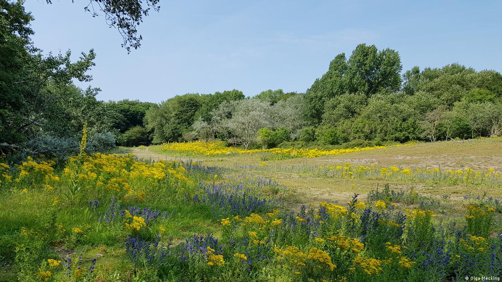
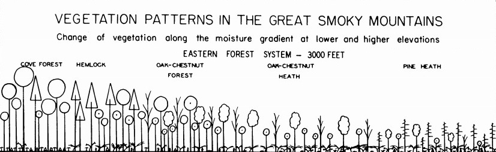
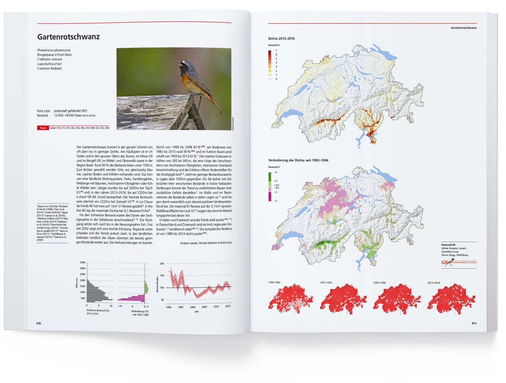

```{r setup, include=FALSE}
library(knitr)

default_source_hook <- knit_hooks$get('source')
default_output_hook <- knit_hooks$get('output')

knit_hooks$set(
  source = function(x, options) {
    paste0(
      "\n::: {.codebox data-latex=\"\"}\n\n",
      default_source_hook(x, options),
      "\n\n:::\n\n")
  }
)

knit_hooks$set(
  output = function(x, options) {
    paste0(
      "\n::: {.codebox data-latex=\"\"}\n\n",
      default_output_hook(x, options),
      "\n\n:::\n\n")
  }
)

knitr::opts_chunk$set(echo = TRUE)
```

# Outline

- Data collection and common data types
- Generalised Linear Models background
  - Assumption checking 
- "Vector" models
- GLMMs
  - Estimating variation in species responses
  - Estimating correlation in species responses
- Model diagnostics and selection

- Building on some material from [the GLM workshop](https://github.com/BertvanderVeen/GLM-workshop)

## Statistical modeling

Instead of a focus on data, we consider the \textit{data generating process}

- We collect data
- Decide on a research question for \textit{the population}
- Learn about the variation in the data
  - Which requires formulating a model
- Work out distribution of the estimates
  - And find the "best" estimate
- Conclude if our answer is robust for the population

## Sampling data

{width=80%}

A meadow in the Dutch dunes.  \newline

How do we find the total number of species?

# Sampling

## How many plant species are there in this meadow?

\columnsbegin
\column{0.4\textwidth}

\column{0.6\textwidth}

```{r, cache = TRUE, echo = FALSE, fig.height = 5, fig.width = 5}
plot(0:10,0:10,xaxt="n",yaxt="n", type="n", xlab = NA, ylab=NA, xlim=c(0,10),ylim=c(0,10), yaxs="i", xaxs="i")
box(lwd=5)
abline(h=c(2,4,6,8,10), lwd = 2);abline(v=c(2,4,6,8,10), lwd = 2)
points(sample(seq(0,10,length.out=1000), 20, replace = TRUE),sample(seq(0,10,length.out=1000), 20, replace = TRUE), pch = 16, col = sample(1:4, 20, replace = TRUE), cex = 3)
```

\columnsend

\vspace*{-2\baselineskip}

We go into the meadow and count plants in quadrats. We find 4 species.

## Resampling the dunes

\columnsbegin
\column{0.5\textwidth}
```{r, cache = TRUE, echo = FALSE, fig.height = 5, fig.width = 5, out.width = "50%", fig.align = "right"}
plot(0:10,0:10,xaxt="n",yaxt="n", type="n", xlab = NA, ylab=NA, xlim=c(0,10),ylim=c(0,10), yaxs="i", xaxs="i")
box(lwd=5)
abline(h=c(2,4,6,8,10), lwd = 2);abline(v=c(2,4,6,8,10), lwd = 2)
points(sample(seq(0,10,length.out=1000), 20, replace = TRUE),sample(seq(0,10,length.out=1000), 20, replace = TRUE), pch = 16, col = sample(c(1,3,6), 20, replace = TRUE), cex = 3)
```
\column{0.5\textwidth}

```{r, cache = TRUE, echo = FALSE, fig.height = 5, fig.width = 5, out.width = "50%", fig.align = "left"}
plot(0:10,0:10,xaxt="n",yaxt="n", type="n", xlab = NA, ylab=NA, xlim=c(0,10),ylim=c(0,10), yaxs="i", xaxs="i")
box(lwd=5)
abline(h=c(2,4,6,8,10), lwd = 2);abline(v=c(2,4,6,8,10), lwd = 2)
points(sample(seq(0,10,length.out=1000), 20, replace = TRUE),sample(seq(0,10,length.out=1000), 20, replace = TRUE), pch = 16, col = sample(3:6, 20, replace = TRUE), cex = 3)
```
\columnsend

\columnsbegin
\column{0.5\textwidth}

```{r, cache = TRUE, echo = FALSE, fig.height = 5, fig.width = 5, out.width = "50%", fig.align = "right"}
plot(0:10,0:10,xaxt="n",yaxt="n", type="n", xlab = NA, ylab=NA, xlim=c(0,10),ylim=c(0,10), yaxs="i", xaxs="i")
box(lwd=5)
abline(h=c(2,4,6,8,10), lwd = 2);abline(v=c(2,4,6,8,10), lwd = 2)
points(sample(seq(0,10,length.out=1000), 20, replace = TRUE),sample(seq(0,10,length.out=1000), 20, replace = TRUE), pch = 16, col = sample(1:6, 20, replace = TRUE), cex = 3)
```

\column{0.5\textwidth}

```{r, cache = TRUE, echo = FALSE, fig.height = 5, fig.width = 5, out.width = "50%", fig.align = "left"}
plot(0:10,0:10,xaxt="n",yaxt="n", type="n", xlab = NA, ylab=NA, xlim=c(0,10),ylim=c(0,10), yaxs="i", xaxs="i")
box(lwd=5)
abline(h=c(2,4,6,8,10), lwd = 2);abline(v=c(2,4,6,8,10), lwd = 2)
points(sample(seq(0,10,length.out=1000), 20, replace = TRUE),sample(seq(0,10,length.out=1000), 20, replace = TRUE), pch = 16, col = sample(1:2, 20, replace = TRUE), cex = 3)
```

\columnsend

We resample the dune meadow, and find different numbers of species: 3, 3, 6, 2. And different compositions. On average we have found 3.5 species per quadrat.

## Sampling variation

1) Each time we sample, we have a slightly different sample
2) Each time we estimate a parameter, it might be slightly different due to this sampling variation
3) The more data we sample, the better we can represent this variability of our estimate
4) And the better we can represent the true richness/cover in the meadow

## Sampling variation

```{r, cache = TRUE, echo = FALSE, fig.height = 5, fig.width = 5, out.width = "5%", fig.align = "center", fig.show = "hold"}
for(i in 1:100){
plot(0:10,0:10,xaxt="n",yaxt="n", type="n", xlab = NA, ylab=NA, xlim=c(0,10),ylim=c(0,10), yaxs="i", xaxs="i")
box(lwd=5)
abline(h=c(2,4,6,8,10), lwd = 2);abline(v=c(2,4,6,8,10), lwd = 2)
points(sample(seq(0,10,length.out=1000), 20, replace = TRUE),sample(seq(0,10,length.out=1000), 20, replace = TRUE), pch = 16, col = sample(1:6, 20, replace = TRUE), cex = 3)
}
```

If we sample many times, we have an accurate picture of the whole meadow (and variability in the number of species in a quadrat that we might find).

## Sampling variation

```{r, cache = TRUE, echo = FALSE, fig.height = 3.5, fig.width = 3.5, fig.align = "center"}
plot(0:100,0:100,xaxt="n",yaxt="n", type="n", xlab = NA, ylab=NA, xlim=c(0,100),ylim=c(0,100), yaxs="i", xaxs="i")
box(lwd=3)
abline(h=seq(0,100,2), lwd = 0.5);abline(v=seq(0,100,2), lwd = 0.5)
points(sample(seq(0,100,length.out=1000), 2000, replace = TRUE),sample(seq(0,100,length.out=1000), 2000, replace = TRUE), pch = 16, col = sample(1:6, 2000, replace = TRUE), cex = 0.5)
```

If we sample in one large (field-sized) quadrat we also have an accurate picture of the whole meadow (and variability in the number of species in a quadrat that we might find).

## Statistical modeling

Instead of a focus on data, we consider the \textit{data generating process}

- We collect data
- Decide on a research question for \textit{the population}
- Learn about the variation in the data
  - Which requires formulating a model
- Work out distribution of the estimates
  - And find the "best" estimate
- Conclude if our answer is robust for the population (e.g., fields like this have more than 6 species)

# Species-environment

## The ecological process

What do we know of the processes that generate these data?

- Meta-community theory
- Assembly processes (filtering)
- Ecological gradient theory

\pause

Multispecies models provide a statistical connection to these ecological frameworks. We do not just use a fancy tool, we use a fancy tool because we believe it aligns well with our understanding of the ecological process.

## The ecological process (2)

{height=60%}

## On ecological communities

The concept of an ecological community is of limited use. By definition:

**An ecological community is a group or association of two or more species occupying the same geographical area at the same time**

- We often think of ecological communities as groups
- We can also think of a community as a continuum that changes along a gradient \tiny (Austun 1985) \normalsize
- We can also think of them as the species in our data

\pause

Connecting model outputs to ecological concepts requires some deep thoughts

## An ecological gradient



## Response curves


## Multispecies models

There are multiple statistical frameworks for studying the processes:

- Generalised Linear Models
- Generalised Linear Mixed-effects Models
- Generalised Additive Models \tiny (not covered here) \normalsize
- Generalised Linear Latent Variable Models

\pause

Or ecologically:

- Species distribution models
- Joint Species Distribution Models
- Ordination

\pause

and more. Each method has its limitations (assumptions). It is up to us to assess which are appropriate.

# GLM background

## Generalised linear models (GLMs)

GLMs as a framework were introduced by Nelder and Wedderburn (1972) uniting many different models. With a special focus on teaching statistics.

- Linear regression
- Logistic regression
- Probit regression
- Complementary log-log regression
- Log-linear regression
- Gamma regression

## Generalised Linear Models

For when the assumptions of linear regression fail.

\columnsbegin
\column{0.5\textwidth}

\begin{itemize}
\item Linearity (straight line)
\item Independence of errors
\item Homoscedasticity (same variance for all errors)
\item Normality (distribution of errors)
\end{itemize}

\column{0.5\textwidth}


\columnsend

## Generalised linear models (2)

\columnsbegin
\column{0.5\textwidth}

GLMs extend the linear model framework
to address:

\begin{itemize}
\item Variance changes with the mean
\item Range of \textbf{y} is bounded
\end{itemize}
\column{0.5\textwidth}

{width=80%}

\columnsend
\textbf{The basis of many statistical models in Biology}

## Components of a GLM

- \textcolor{red}{Systematic component: $\eta$}
- \textcolor{blue}{Random component: data/distribution)}
- The link function: connects these components
  - This is not a data transformation
- The variance function

**But no explicit error term**

## GLM Likelihood

- We use MLE for estimation
- With a distribution in the "exponential family" (for fixed $\phi$)

All GLMs have the likelihood:

\begin{equation}
\mathcal{L}(y_i;\Theta) = \text{exp}\{\frac{y_i\textcolor{red}{\eta_i}-b(\textcolor{red}{\eta_i})}{a(\phi)} + c(y_i,\phi)\}
\end{equation}

## Generalised linear model

\begin{equation}
\begin{aligned}
 g\{\mathams{E}(y_i\vert x_i)\} &= \eta_i = \alpha + x_i\beta\\
 \mathams{E}(y_i\vert x_i) &= g^{-1}(\eta_i) = g^{-1}(\alpha + x_i\beta)
 \end{aligned}
\end{equation}

$\text{g}(\cdot)$ is the **link function**

## The link function

<!-- A smooth function with an inverse. -->

\columnsbegin
\column{0.5\textwidth}
- Is a smooth/monotone function
- Has an inverse $g^{-1}(\cdot)$
- Restricts the scale
- $\text{g}(\cdot)$ can be e.g.

\column{0.5\textwidth}

```{r, echo = FALSE, out.height="90%"}
x<-seq(binomial(link=logit)$linkinv(-5),binomial(link=logit)$linkinv(5),length.out=1000)
plot(x=binomial()$linkfun(x),x, cex.main = 5, cex.lab = 5, ylim = c(0,1), xlim = c(-5,5), type = "l", xlab=NA, ylab=NA, xaxt="n", yaxt="n")
abline(v=0,h=0,lty="dashed")
text(-3,.8,"Logit", cex=5)
```
\columnsend
\vspace*{-1.840\baselineskip}
\columnsbegin
\column{0.5\textwidth}

```{r, echo = FALSE, fig.align="center"}
x<-seq(poisson(link=log)$linkinv(-5),poisson(link=log)$linkinv(5),length.out=1000)
plot(x=poisson(link=log)$linkfun(x),x, cex.main = 5, xlim = c(-5,5), type = "l", xlab=NA, ylab=NA, xaxt="n", yaxt="n")
abline(v= 0, h = 0, lty="dashed")
text(-3,125,"Log", cex=5)
```

\column{0.5\textwidth}

```{r, echo = FALSE, fig.align="center"}
x<-seq(-5,5,length.out = 1000)
plot(x=x, 1/x, cex.main = 5, xlim =  c(-5,5),type = "l", xlab=NA, ylab=NA, xaxt="n", yaxt="n")
abline(v= 0, h = 0, lty="dashed")
text(-3,125,"Inverse", cex=5)
```

\columnsend

\vfill

## Variance function

Perhaps most critically, variance changes with the mean:

$$
\text{var}(y_i;\mu_i,\phi) = \frac{\partial^2g(\eta_i)}{\partial\eta_i^2} a(\phi)
$$

- $\phi$: the dispersion parameter, constant over observations
  - Fixed for some response distributions
- $a(\phi)$ is a function of the form $\phi/w_i$ \tiny (McCullagh and Nelder 1989)

## Fitting GLMs

Parameters in GLMs need to be estimated **iteratively**.

- More difficult to fit
- Requires numerical *optimisation*
- Susceptible to local convergence

\center

\textcolor{red}{Holds for GLLVMs too}

## Estimating GLMs

```{r, echo = FALSE}
set.seed(12345)
p.orchid = 0.4
n.picks = 100
n.times <- 50
y <- rbinom(n.times, size = n.picks, prob = p.orchid) # Collecting data
```


```{r, cache = TRUE, echo = FALSE, fig.height = 6}
par(mfrow=c(2,2))
ll <- function(p, n.picks, y)sum(dbinom(y, n.picks,p, log = TRUE))
phat <- seq(0.35,0.45,length.out=1000)
lls <- sapply(phat, ll, n.picks = n.picks, y = y)
grad.dbinom=function(y, n.picks, prob) {
    sum(y/prob - (n.picks - y)/(1-prob))
}

p = c(0.36,0.38,0.40, 0.42)
for(i in p){
b<-grad.dbinom(y,n.picks,i)
a<--b*i+ll(i,n.picks,y)
pphat <- phat[order(abs(phat-i),decreasing=FALSE)[1:200]]
plot(lls, x = phat, type = "l", xlab=expression(hat(pi)), ylab="log-Likelihood", lty = "dashed",main = i)
segments(x0=i,x1 = i, y0=ll(0.1,n.picks,y), y1= ll(i,n.picks,y), col="red", lty = "dotted")
lines(x=pphat,y=a+b*pphat, col = "red")
}
```

We need a good algorithm to find the maximum!

## Why is this important?

1) A basic (mathematical) understanding helps apply methods correctly.
2) GLMMs/GLLVMs may not always converge to the best solution immediately.
3) This can help to diagnose your model.

## Often used distributions in ecology

- Binomial: occurrence/counts. Presence of species, number of germinated seeds out of a total
- Poisson: counts. Abundance
- Negative binomial (fixed dispersion): counts. Number of species or abundance
- Gamma: (positive) continuous. Body size or biomass
- Ordinal (cumulative link). Cover classes
- Beta (logit link). Cover (note: not a GLM)

# Example 1

## Example: Swiss bird occurrence

**Observation** process: see if a bird is present (or we might hear it) \newline
**Alternatively**: The proportion of a species in a place \newline
**Alternatively**: Count of birds in the forest

There are often many ways to observe the same ecological process. We need to **disentangle** this from the ecological process.

## Example: Swiss birds

- Data by Schmid et al. (1998): the Swiss breeding bird atlas
- Occurrence of 56 species at 2524 locations recorded over a 4-year period



## The data

\tiny
```{r, echo  =FALSE, message=FALSE, warning=FALSE}
avi_dat <- read.csv('../data/SwissBirds.csv')
y <- as.matrix(avi_dat[,1:56])
X <- avi_dat[,-c(1:56)]
knitr::kable(head(y), format="latex", booktabs = T)
```
\normalsize

## The environmental variables

\tiny
```{r, echo  =FALSE, message=FALSE, warning=FALSE}
knitr::kable(head(X), format="latex", booktabs = T)
```
\normalsize

- Bioclimatic variables (bioclim)
- Topography (slope, aspect, TPI, TWI) from a DEM
- Potential evapotranspiration (PET) from solar radiation
- Moisture index, degree days above  zero
- Vegetation structure from LiDAR

## The binomial GLM

\begin{equation}
p(y_{ij} = 1) = p_{ij} = g^{-1}(\eta_{ij})
\end{equation}

## The binomial GLM

Link functions:

\begin{itemize}
\item Logit: $\log(\frac{\pi_i}{1-\pi_i})$ and inverse $\frac{\exp(\eta_i)}{1+\exp(\eta_i)}$ - \textit{the canonical link}
\item Probit: $\Phi^{-1}(\pi_i)$ and inverse  $\Phi(\eta_i)$
\item Complementary log-log: $\log(-\log(1-\pi_i)$ and inverse $1-\exp(-\exp(\eta_i))$
\item \sout{Log-log}
\end{itemize}

- Logit is canonical and easier to interpret
- Probit is sometimes easier mathematically than Logit
- Complementary log-log for counts

## Data format

There are two ways to format these data: \newline
**Wide format**: Species as columns (as presented) \newline
**Long format**: Species is one column, and "Site" is another column

The format of the data does not affect the model. Some functions accept long format, other wide format, but the formulation of the model is up to us.

## Swiss birds: to long format

\footnotesize
```{r, echo  = TRUE, message=FALSE, warning=FALSE}
data <- data.frame(y, X)
datalong <- reshape(data, 
                    varying = colnames(y), 
                    v.names = "occ", 
                    idvar = "Site", 
                    timevar = "Species", 
                    direction = "long")

datalong$Species <- factor(datalong$Species, 
                           labels = colnames(y))
```

\normalsize

## Swiss birds: visually inspect the data

```{r, echo = FALSE, fig.height = 6, warning=FALSE}
par(mfrow=c(1,3))

plot(occ~slp, data = datalong, ylab = "Occurrence", xlab="Slope", type = "n") 
rug(datalong$slp)

for(i in 1:ncol(y)){
  lines(smooth.spline(datalong[datalong$Species==colnames(y)[i],]$occ~datalong[datalong$Species==colnames(y)[i],]$slp, cv = TRUE, df = 3), col = "grey")
}

lines(smooth.spline(datalong$occ~datalong$slp, cv = TRUE, df = 2), col = "red")

plot(occ~ddeg0, data = datalong, ylab = "Occurrence", xlab="Degree days above zero", type = "n") 
rug(datalong$ddeg0)

for(i in 1:ncol(y)){
  lines(smooth.spline(datalong[datalong$Species==colnames(y)[i],]$occ~datalong[datalong$Species==colnames(y)[i],]$ddeg0, cv = TRUE, df = 3), col = "gray")
}

lines(smooth.spline(datalong$occ~datalong$ddeg0, cv = TRUE, df = 2), col = "red")

plot(occ~bio_1, data = datalong, ylab = "Occurrence", xlab="Bioclim 1", type = "n") 
rug(datalong$bio_1)

for(i in 1:ncol(y)){
  lines(smooth.spline(datalong[datalong$Species==colnames(y)[i],]$occ~datalong[datalong$Species==colnames(y)[i],]$bio_1, cv = TRUE, df = 3), col = "gray")
}

lines(smooth.spline(datalong$occ~datalong$bio_1, cv = TRUE, df = 2), col = "red")
```

\centering 

Is there a community-level trend?

## Swiss birds: fit a model

\footnotesize
```{r}
model1 <- glm(occ~slp, 
             data = datalong, family="binomial")
coef(model1)
```

\normalsize

Here we assume that the intercept and slp effect are the same for all species

## Multispecies modeling

1) Is the same effect for all species realistic?
2) Is the same (average) probabiliity of occurrence for all species realistic?

\pause

3) We usually assume that species have their own preferred environmental conditions
4) Some species might still like similar conditions; there is a common component
5) We can separate this out with GLMMs or with a "sum-to-zero" contrast

## Swiss birds: species-specific effects

\small
```{r}
model2 <- glm(occ~slp*Species, 
             data = datalong, family="binomial")
```

\normalsize

- One intercept per species
- One slp effect per species
- But all are relative to the first species

## Swiss birds: species-specific effects

\small
```{r}
model3 <- glm(occ ~ 0 + Species + slp:Species, 
             data = datalong, family="binomial")
```

\normalsize

The same model, but a bit easier to interpret

- One intercept per species
- One slp effect per species
- Not relative to each other (prevents post-hoc processing of tests and CI)

## Swiss birds: results

```{r, echo = FALSE, fig.height=6}
est = coef(model3)
# asymptotic CI because the profiling from confint took too long (I am impatient)
CI = data.frame(UI = est+sqrt(diag(vcov(model3)))*1.96, LI = est-sqrt(diag(vcov(model3)))*1.96)

par(mfrow=c(1, 2))

plot(est[1:ncol(y)], 1:ncol(y), main = "Intercept", xlim = c(range(CI[1:ncol(y),])), xlab = "Estimate", ylab = "Species")
segments(CI$LI[1:ncol(y)], 1:ncol(y), CI$UI[1:ncol(y)], 1:ncol(y))
abline(v=0,lty="dashed")

plot(est[-c(1:ncol(y))], 1:ncol(y), main = "Slope", xlim = c(range(CI[-c(1:ncol(y)),])), xlab = "Estimate", yaxt = "n", ylab = NA)
segments(CI$LI[-c(1:ncol(y))], 1:ncol(y), CI$UI[-c(1:ncol(y))], 1:ncol(y))
abline(v=0,lty="dashed")
```


## Interpreting Binomial GLM coefficients  
  
- Below one we are more likely to not observe the species \pause
- The likelihood of observing the species 1 at flat ground is `exp(-0.663)/(1+exp(-0.663)) = 0.34` \footnotesize (given by the intercept) \normalsize \pause
  - At 0.5 there is equal probability to observe and not \pause
- Odds ratio for the first species at slp 0 is `exp(-0.663) = 0.52:1` \pause
  - We are two times more likely to not observe the species on flat ground, than to observe it \pause
- This decreases by `exp(-0.17)` for every unit of slp `0.52*exp(-0.17) = 0.52*0.84 = 0.44` \pause

## Contrasts

There are other "contrast" treatments in R than "dummy"

- We can instead use "sum-to-zero" contrasts
  - If the sum is zero, the mean must be too
  - The coefficient of the last species is set to the negative sum

\tiny
  
```{r}
(contr <- contr.sum(levels(datalong$Species)))
```

\normalsize  

## Swiss birds: \footnotesize species-specific responses with common effect \normalsize

\tiny

```{r}
model4 <- glm(occ~0+slp+Species + slp:Species, data = datalong, family = "binomial", 
              contrasts = list(Species = contr))
coef(model4)[1]
```

\normalsize

- The intercept is the same for all species
- One slp effect that is the same for all species (the mean of effects)
- One slp effect per species, relative to the common effect

The benefit: the average effect gets a statistical test. \newline
By design corresponds to the result from our previous model: `mean(coef(model3)[-c(1:ncol(y))]) = ` `r mean(coef(model3)[-c(1:ncol(y))])`


## Swiss birds

The three models have the same number of parameters, but are just differently parameterized. So, their log-likelihoods and AIC are the same:

```{r}
AIC(model2, model3, model4)
```

## Swiss birds:  \footnotesize species-specific responses with common effect \normalsize

\tiny

```{r, echo  =FALSE}
summary(model4)
```

\normalsize

## Swiss birds:  conclusions

We can conclude that fewer bird species occur in steep places \newline
Most species are more negatively affected than the average \newline
Some species are positively affected by slope, but most negatively

```{r, echo = FALSE, fig.height = 4}
hist(coef(model4)[1]+coef(model4)[-c(1:47)], xlab = "Estimate", main = "Slope", breaks= 40)
abline(v=mean(coef(model4)[1]+coef(model4)[-c(1:47)]), col = "red", lty = "dashed")
```

## Interpreting the coefficients

Or with `predict`:

\tiny

```{r}
predict(model3, newdata = 
          data.frame(Species = factor("Falco_subbuteo", levels = colnames(y)), slp = 1), 
        type = "response")
```

# Example 2

## Example: macroinvertebrate counts in USA desert

**Observation** process: count of macroinvertebrates in three "dips" \newline
**Alternatively**: The proportion of a species in a dip \newline
**Alternatively**: Was this species found in the dip

## Example: macroinvertebrate counts in USA desert

- Data by [Pina and Lougheed 2022](https://link.springer.com/article/10.1007/s13157-022-01647-2#Sec50)
- Counts of 14 species, in 2018 and 2019, in 14 wetlands
- Main goal: assess impacts of water quality on macroinvertebrates


## The abundance data

\tiny
```{r, echo  =FALSE, message=FALSE, warning=FALSE}
dat <- read.csv("../data/Wetlands.csv")
# data2018<-data[data$Year=="2018",]
# row.names(data2018) <- data2018$Site
y <- dat[,tail(1:ncol(dat),14)][,-14]
X <- dat[,head(1:ncol(dat),-14)][,-1]
X$Hydro<-as.factor(X$Hydro)
X$Water_Type<-as.factor(X$Water_Type)
knitr::kable(y, format="latex", booktabs = T)
```
\normalsize

## The environment data

\tiny
```{r, echo  =FALSE, message=FALSE, warning=FALSE}
knitr::kable(head(X), format="latex", booktabs = T)
```
\normalsize

- 11 environmental variables
  - Water chemistry
  - Water type
  - Presence of hydro power
  - Permanent or temporary wetland


\footnotesize
```{r, echo  = FALSE, message=FALSE, warning=FALSE}
X <- data.frame(sapply(X,function(x)if(is.numeric(x)){scale(x)}else{x}, simplify = FALSE))
dat <- data.frame(y, X, total = rowSums(y))
long <- reshape(dat, 
                    varying = colnames(y), 
                    v.names = "Count", 
                    idvar = "Site", 
                    timevar = "Species", 
                    direction = "long")

long$Species <- factor(long$Species, 
                           labels = colnames(y))
```

\normalsize

## Visually inspect the data: categorical covariate

```{r, echo = FALSE, fig.height = 6, warning=FALSE}
par(mfrow=c(3,5), oma = c(4,4,0,0))
for(i in 1:ncol(y)){
plot(log1p(Count/total)~Water_Type, data = long[long$Species==colnames(y)[i],], ylab = NA, xlab=NA, main = colnames(y)[i])  
}
mtext("log(Proportion of total count+1)", side = 2, outer = TRUE, line = 0.5)
mtext("Water type", side = 1, outer = TRUE, line = 0.5)
```

\centering 

\vspace*{-\baselineskip}

Is there a common effect?

## Visually inspect the data: continuous covariate

```{r, echo = FALSE, fig.height = 6, warning=FALSE}
par(mfrow=c(3,5), oma = c(4,4,0,0))
for(i in 1:ncol(y)){
plot(log1p(Count/total)~NO3, data = long[long$Species==colnames(y)[i],], ylab = NA, xlab=NA, main = colnames(y)[i])  
  lines(smooth.spline(log1p(long[long$Species==colnames(y)[i],]$Count/long[long$Species==colnames(y)[i],]$total)~long[long$Species==colnames(y)[i],]$NO3, cv = TRUE, df = 3), col = "red")
}
mtext("log(Proportion of total count+1)", side = 2, outer = TRUE, line = 0.5)
mtext("NO3", side = 1, outer = TRUE, line = 0.5)
```

\centering 

\vspace*{-\baselineskip}

Is there a common effect?

## Wetlands: \footnotesize species-specific responses with common effect \normalsize

\tiny

```{r, echo = -c(1,3)}
contr <- contr.sum(levels(long$Species))
model5 <- glm(Count~0+Species+NO3+NO3:Species, data = long, family = "poisson", contrasts = list(Species = contr))
coef(model5)
```

\normalsize

## Wetlands: \footnotesize species-specific responses with common effect \normalsize

Count data is usually overdispersed; we might want to switch to a NB.

```{r, echo = -c(1,3)}
model6<- MASS::glm.nb(Count~0+Species+NO3+NO3:Species, data = long, contrasts = list(Species = contr))
coef(model6)
```

## Wetlands:  conclusions

We can conclude that NO3 has, **on average**, a negative effect on our species pool \footnotesize (but this is not statistically significant) \normalsize \newline
Some species are more negatively affected than the average, some more positive \newline
Some species are positively affected by NO3, but most negatively

## Interpreting the coefficients

\tiny
```{r, echo = FALSE}
coef(model6)
```

\footnotesize

- Negative means a decrease in the response and positive increase
- More specifically here: the coefficient is multiplicative decrease in `exp(intercept)` for a unit change in `NO3`
- E.g., for "Ephemeroptera": `exp(2.243)*exp(-0.038+ 0.062) = 9.4*1.025`

# Vector GLMs

\vfill

\centering

\begin{columns}

\column{0.5\textwidth}

\begin{itemize}
\item One GLM per species
\item Each gets their own dispersion parameter
\item Slightly more flexible than what we have done so far
\end{itemize}

\column{0.5\textwidth}

\centering
\includegraphics[width = 0.6\textwidth]{vglm.jpeg}

\end{columns}

\centering

\includegraphics[height=0.4\textheight]{mvabund.png}

## Fitting vector GLMs

A few software implementations exist:

- The \texttt{VGAM} \texttt{R}-package
- The \texttt{glmmTMB} \texttt{R}-package
- The \texttt{gllvm} \texttt{R}-package

Clearly, we will use the last one. 

## VGLM Likelihood

- We use MLE for estimation
- With a distribution in the "exponential family" (for fixed $\phi$)

All GLMs have the likelihood:

\begin{equation}
\mathcal{L}(y_{ij};\Theta) = \text{exp}\{\frac{y_{ij}\textcolor{red}{\eta_{ij}}-b(\textcolor{red}{\eta_{ij}})}{a(\phi_j)} + c(y_{ij},\phi_j)\}
\end{equation}

So, now we have $\phi_j$ instead of $\phi$

## \texttt{gllvm}


- Originally published in 2019 by Niku et al. \tiny I "joined in" shortly after \normalsize
- For model-based multivariate analysis of community ecological data
- Models are fitted in C++ \tiny (Kristensen et al. 2015) \normalsize
- Can fit many different models: VGLM(M), JSDM, and ordination

## VGLM in gllvm

\tiny

\vspace{-\baselineskip}

```{r, fig.height=5}
model7 <- gllvm::gllvm(y, X = X, formula = ~NO3, family = "negative.binomial", num.lv = 0)
gllvm::coefplot(model7)
```

\footnotesize (the "species" covariate is implicit) \normalsize

## Does NO3 improve the model?

\tiny

\vspace{-\baselineskip}

```{r, fig.height=5}
model8 <- gllvm::gllvm(y, formula = ~1, family = "negative.binomial", num.lv = 0)
anova(model7, model8)
```

\normalsize

NO3 does not improve the model.

## Does NO3 improve the model?

\tiny

\vspace{-\baselineskip}

```{r, fig.height=5}
AIC(model7, model8)
```

\normalsize

There are `14` more parameters in model7 than model8, so AIC needs to be `14*2` points lower.

<!-- ## VGLM in gllvm -->

<!-- \tiny -->

<!-- ```{r, fig.height = 5} -->
<!-- plot(model7, which = 4) -->
<!-- ``` -->

## Comparison to an "ordinary" NB GLM

\footnotesize

```{r}
model9 <- gllvm::gllvm(y, X = X, formula = ~NO3, family = "negative.binomial", 
                       disp.formula = rep(1, ncol(y)), num.lv = 0)

data.frame(VGLM = c(coef(model7, "Xcoef")), GLM = c(coef(model9, "Xcoef")))
```

\footnotesize Here: the difference is not so big (also confirmed by AIC). Tends to get worse with more species.

## Comparison NB GLM: standard errors

\footnotesize

```{r}
data.frame("VGLM" = c(model7$sd$Xcoef), "GLM" = c(model9$sd$Xcoef))
```

## Downsides

- VGLM defaults to 1 dispersion parameter per species
- VGLM assumes 1 parameter per species per covariate
- This does not tend to work very well for real (sparse) community data
- VGLM assumes independence of species
- Does not include random effects (pseudoreplication, autocorrelation)

## Summary

- GLMs are fun, but not usually suitable for multispecies data
- VGLMs; fitting one model per species gives more flexibility
- This facilitates adding components that are shared across species
- Which is especially helpful when working with random effects

\centering
\textcolor{red}{So far we have assumed that species do not influence each other}