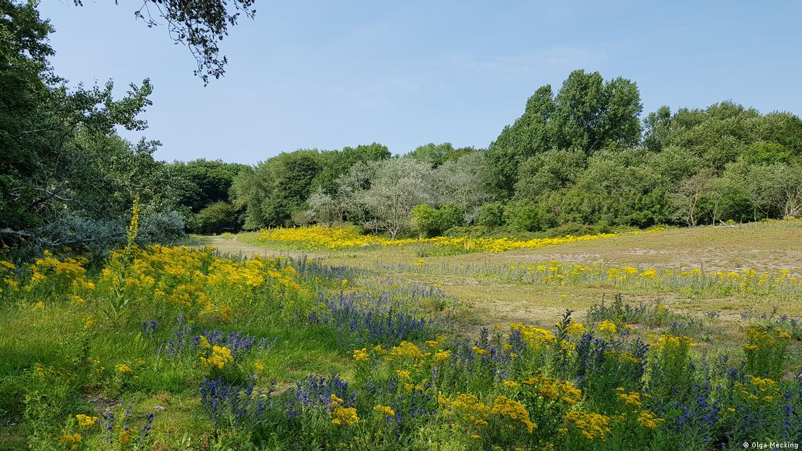
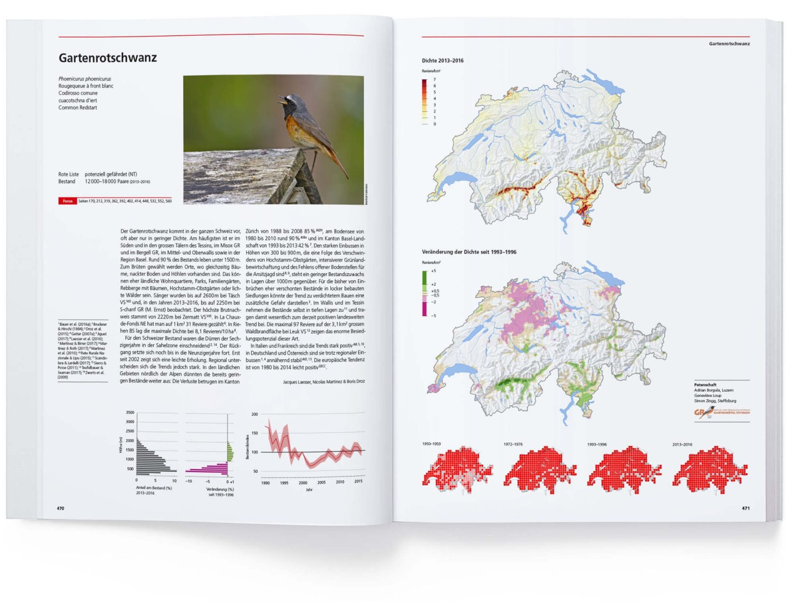
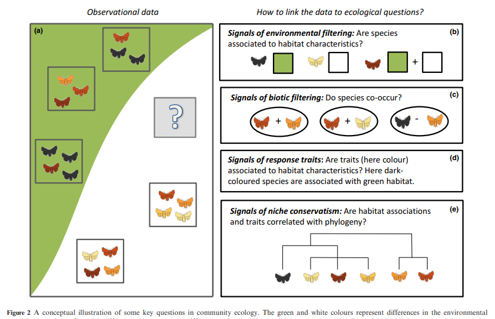
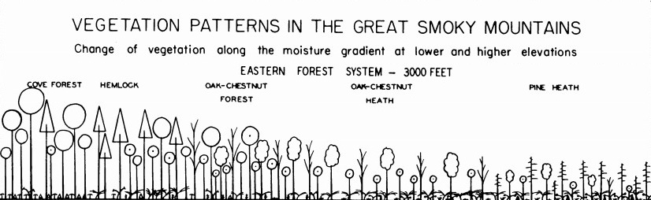
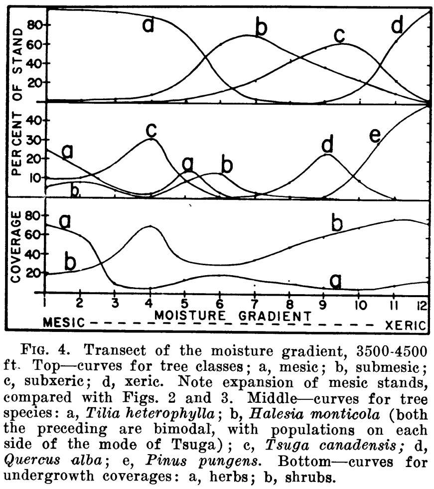
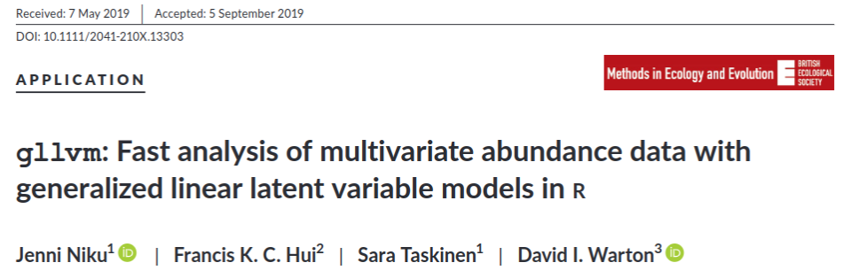

```{r setup, include=FALSE}
library(knitr)

default_source_hook <- knit_hooks$get('source')
default_output_hook <- knit_hooks$get('output')

knit_hooks$set(
  source = function(x, options) {
    paste0(
      "\n::: {.codebox data-latex=\"\"}\n\n",
      default_source_hook(x, options),
      "\n\n:::\n\n")
  }
)

knit_hooks$set(
  output = function(x, options) {
    paste0(
      "\n::: {.codebox data-latex=\"\"}\n\n",
      default_output_hook(x, options),
      "\n\n:::\n\n")
  }
)

knitr::opts_chunk$set(echo = TRUE)
```

# GLM background

## Sampling data

{width=80%}

A meadow in the Dutch dunes.  \newline

How do we find the total number of species?

## How many plant species are there in this meadow?

\columnsbegin
\column{0.4\textwidth}

\column{0.6\textwidth}

```{r, cache = TRUE, echo = FALSE, fig.height = 5, fig.width = 5}
plot(0:10,0:10,xaxt="n",yaxt="n", type="n", xlab = NA, ylab=NA, xlim=c(0,10),ylim=c(0,10), yaxs="i", xaxs="i")
box(lwd=5)
abline(h=c(2,4,6,8,10), lwd = 2);abline(v=c(2,4,6,8,10), lwd = 2)
points(sample(seq(0,10,length.out=1000), 20, replace = TRUE),sample(seq(0,10,length.out=1000), 20, replace = TRUE), pch = 16, col = sample(1:4, 20, replace = TRUE), cex = 3)
```

\columnsend

\vspace*{-2\baselineskip}

We go into the meadow and count plants in quadrats. We find 4 species.

## Resampling the dunes

\columnsbegin
\column{0.5\textwidth}
```{r, cache = TRUE, echo = FALSE, fig.height = 5, fig.width = 5, out.width = "50%", fig.align = "right"}
plot(0:10,0:10,xaxt="n",yaxt="n", type="n", xlab = NA, ylab=NA, xlim=c(0,10),ylim=c(0,10), yaxs="i", xaxs="i")
box(lwd=5)
abline(h=c(2,4,6,8,10), lwd = 2);abline(v=c(2,4,6,8,10), lwd = 2)
points(sample(seq(0,10,length.out=1000), 20, replace = TRUE),sample(seq(0,10,length.out=1000), 20, replace = TRUE), pch = 16, col = sample(c(1,3,6), 20, replace = TRUE), cex = 3)
```
\column{0.5\textwidth}

```{r, cache = TRUE, echo = FALSE, fig.height = 5, fig.width = 5, out.width = "50%", fig.align = "left"}
plot(0:10,0:10,xaxt="n",yaxt="n", type="n", xlab = NA, ylab=NA, xlim=c(0,10),ylim=c(0,10), yaxs="i", xaxs="i")
box(lwd=5)
abline(h=c(2,4,6,8,10), lwd = 2);abline(v=c(2,4,6,8,10), lwd = 2)
points(sample(seq(0,10,length.out=1000), 20, replace = TRUE),sample(seq(0,10,length.out=1000), 20, replace = TRUE), pch = 16, col = sample(3:6, 20, replace = TRUE), cex = 3)
```
\columnsend

\columnsbegin
\column{0.5\textwidth}

```{r, cache = TRUE, echo = FALSE, fig.height = 5, fig.width = 5, out.width = "50%", fig.align = "right"}
plot(0:10,0:10,xaxt="n",yaxt="n", type="n", xlab = NA, ylab=NA, xlim=c(0,10),ylim=c(0,10), yaxs="i", xaxs="i")
box(lwd=5)
abline(h=c(2,4,6,8,10), lwd = 2);abline(v=c(2,4,6,8,10), lwd = 2)
points(sample(seq(0,10,length.out=1000), 20, replace = TRUE),sample(seq(0,10,length.out=1000), 20, replace = TRUE), pch = 16, col = sample(1:6, 20, replace = TRUE), cex = 3)
```

\column{0.5\textwidth}

```{r, cache = TRUE, echo = FALSE, fig.height = 5, fig.width = 5, out.width = "50%", fig.align = "left"}
plot(0:10,0:10,xaxt="n",yaxt="n", type="n", xlab = NA, ylab=NA, xlim=c(0,10),ylim=c(0,10), yaxs="i", xaxs="i")
box(lwd=5)
abline(h=c(2,4,6,8,10), lwd = 2);abline(v=c(2,4,6,8,10), lwd = 2)
points(sample(seq(0,10,length.out=1000), 20, replace = TRUE),sample(seq(0,10,length.out=1000), 20, replace = TRUE), pch = 16, col = sample(1:2, 20, replace = TRUE), cex = 3)
```

\columnsend

We resample the dune meadow, and find different numbers of species: 3, 3, 6, 2. And different compositions. On average we have found 3.5 species per quadrat.

## Sampling variation

```{r, cache = TRUE, echo = FALSE, fig.height = 5, fig.width = 5, out.width = "5%", fig.align = "center", fig.show = "hold"}
for(i in 1:100){
plot(0:10,0:10,xaxt="n",yaxt="n", type="n", xlab = NA, ylab=NA, xlim=c(0,10),ylim=c(0,10), yaxs="i", xaxs="i")
box(lwd=5)
abline(h=c(2,4,6,8,10), lwd = 2);abline(v=c(2,4,6,8,10), lwd = 2)
points(sample(seq(0,10,length.out=1000), 20, replace = TRUE),sample(seq(0,10,length.out=1000), 20, replace = TRUE), pch = 16, col = sample(1:6, 20, replace = TRUE), cex = 3)
}
```

If we sample many times, we have an accurate picture of the whole meadow (and variability in the number of species in a quadrat that we might find).

## Statistical modeling

Instead of a focus on data, we consider the \textit{data generating process}

- We collect data
- Decide on a research question for \textit{the population}
- Learn about the variation in the data
  - Which requires formulating a model
- Work out distribution of the estimates
  - And find the "best" estimate
- Conclude if our answer is robust for the population (e.g., fields like this have more than 6 species)


## Generalised linear models (GLMs)

GLMs as a framework were introduced by Nelder and Wedderburn (1972) uniting many different models. With a special focus on teaching statistics.

- Linear regression
- Logistic regression
- Probit regression
- Complementary log-log regression
- Log-linear regression
- Gamma regression

## Generalised Linear Models

For when the assumptions of linear regression fail; GLMs extend the framework to address bounded responses and mean-dependent variance.

\columnsbegin
\column{0.5\textwidth}

Assumptions of linear regression:

\begin{itemize}
\item Linearity (straight line)
\item Independence of errors
\item Homoscedasticity (same variance for all errors)
\item Normality (distribution of errors)
\end{itemize}

\pause

GLMs address:

\begin{itemize}
\item Variance changes with the mean
\item Range of \textbf{y} is bounded
\end{itemize}

\column{0.5\textwidth}


\columnsend

\textbf{The basis of many statistical models in Biology}

## Components of a GLM

\columnsbegin
\column{0.5\textwidth}

- \textcolor{red}{Systematic component: $\eta$}
- \textcolor{blue}{Random component: data/distribution}
- The link function: connects these components (not a data transformation)
- The variance function


\column{0.5\textwidth}

**No explicit error term; parameters estimated by MLE from the exponential family likelihood:**


\columnsend

\pause

\begin{equation}
\mathcal{L}(y_i;\Theta) = \text{exp}\left\{\frac{y_i\textcolor{red}{\eta_i}-b(\textcolor{red}{\eta_i})}{a(\phi)} + c(y_i,\phi)\right\}
\end{equation}

## Generalised linear model

\begin{equation}
\begin{aligned}
 g\{\mathams{E}(y_i\vert x_i)\} &= \eta_i = \alpha + x_i\beta\\
 \mathams{E}(y_i\vert x_i) &= g^{-1}(\eta_i) = g^{-1}(\alpha + x_i\beta)
 \end{aligned}
\end{equation}

$\text{g}(\cdot)$ is the **link function**

## The link function

<!-- A smooth function with an inverse. -->

\columnsbegin
\column{0.5\textwidth}
\begin{itemize}
\item Is a smooth/monotone function
\item Has an inverse $g^{-1}(\cdot)$
\item Restricts the scale
\item $\text{g}(\cdot)$ can be e.g.
\end{itemize}
\column{0.5\textwidth}
\columnsbegin
\column{0.5\textwidth}

```{r, echo = FALSE, out.height = "26%"}
par(mar=c(2,0,4,0))
x<-seq(binomial(link=logit)$linkinv(-5),binomial(link=logit)$linkinv(5),length.out=1000)
plot(x=binomial()$linkfun(x),x, cex.main = 5, cex.lab = 5, ylim = c(0,1), xlim = c(-5,5), type = "l", xlab=NA, ylab=NA, xaxt="n", yaxt="n")
abline(v=0,h=0,lty="dashed")
text(-3,.8,"Logit", cex=5)
```

```{r, echo = FALSE, out.height = "26%"}
par(mar=c(2,0,4,0))
x<-seq(poisson(link=log)$linkinv(-5),poisson(link=log)$linkinv(5),length.out=1000)
plot(x=poisson(link=log)$linkfun(x),x, cex.main = 5, xlim = c(-5,5), type = "l", xlab=NA, ylab=NA, xaxt="n", yaxt="n")
abline(v= 0, h = 0, lty="dashed")
text(-3,125,"Log", cex=5)
```

\column{0.5\textwidth}

```{r, echo = FALSE, out.height = "26%"}
par(mar=c(2,0,4,0))
plot.new()
```

```{r, echo = FALSE, out.height = "26%"}
par(mar=c(2,0,4,0))
x<-seq(-5,5,length.out = 1000)
plot(x=x, 1/x, cex.main = 5, xlim =  c(-5,5),type = "l", xlab=NA, ylab=NA, xaxt="n", yaxt="n")
abline(v= 0, h = 0, lty="dashed")
text(-3,125,"Inverse", cex=5)
```

\columnsend
\columnsend

\vfill

## Variance function

Variance changes with the mean:

$$
\text{var}(y_i;\mu_i,\phi) = \frac{\partial^2 b(\eta_i)}{\partial\eta_i^2} a(\phi)
$$

- $\phi$: the dispersion parameter, constant over observations
  - Fixed for some response distributions
- $a(\phi)$ is a function of the form $\phi/w_i$ \tiny (McCullagh and Nelder 1989)

## Often used distributions in ecology

- Binomial: occurrence/counts. Presence of species, number of germinated seeds out of a total
- Poisson: counts. Abundance
- Negative binomial (fixed dispersion): counts. Number of species or abundance
- Gamma: (positive) continuous. Body size or biomass
- Ordinal (cumulative link). Cover classes
- Beta (logit link). Cover (note: not a GLM)

## The binomial GLM

\begin{equation}
p(y_{ij} = 1) = p_{ij} = g^{-1}(\eta_{ij})
\end{equation}

\pause

Link functions:

\begin{itemize}
\item Logit: $\log(\frac{\pi_i}{1-\pi_i})$ and inverse $\frac{\exp(\eta_i)}{1+\exp(\eta_i)}$ - \textit{the canonical link}
\item Probit: $\Phi^{-1}(\pi_i)$ and inverse  $\Phi(\eta_i)$
\item Complementary log-log: $\log(-\log(1-\pi_i)$ and inverse $1-\exp(-\exp(\eta_i))$
\item \sout{Log-log}
\end{itemize}

- Logit is canonical and easier to interpret
- Probit is sometimes easier mathematically than Logit
- Complementary log-log for counts

## The Poisson and negative binomial GLM

For count responses, the canonical link is log:

\begin{equation}
\mathams{E}(y_{ij}) = \mu_{ij} = \exp(\eta_{ij})
\end{equation}

\pause

\begin{itemize}
\item Poisson: $\text{var}(y_{ij}) = \mu_{ij}$ \quad (equidispersion)
\item Negative binomial: $\text{var}(y_{ij}) = \mu_{ij} + \mu_{ij}^2/\phi$ \quad (overdispersion)
\end{itemize}

\pause

Count data in ecology is almost always overdispersed; the negative binomial is the default choice.

# Example 1

## Example: Swiss bird occurrence

**Observation** process: see if a bird is present (or we might hear it) \newline
**Alternatively**: The proportion of a species in a place \newline
**Alternatively**: Count of birds in the forest

There are often many ways to observe the same ecological process. We need to **disentangle** this from the ecological process.

## Example: Swiss birds

- Data by Schmid et al. (1998): the Swiss breeding bird atlas
- Occurrence of 56 species at 2524 locations recorded over a 4-year period



## The data

\tiny
```{r, echo  =FALSE, message=FALSE, warning=FALSE}
avi_dat <- read.csv('../data/SwissBirds.csv')
y <- as.matrix(avi_dat[,1:56])
X <- avi_dat[,-c(1:56)]
knitr::kable(head(y), format="latex", booktabs = T)
```
\normalsize

## The environmental variables

\tiny
```{r, echo  =FALSE, message=FALSE, warning=FALSE}
knitr::kable(head(X), format="latex", booktabs = T)
```
\normalsize

- Bioclimatic variables (bioclim)
- Topography (slope, aspect, TPI, TWI) from a DEM
- Potential evapotranspiration (PET) from solar radiation
- Moisture index, degree days above zero
- Vegetation structure from LiDAR

## Data format

There are two ways to format these data: \newline
**Wide format**: Species as columns (as presented) \newline
**Long format**: Species is one column, and "Site" is another column

The format of the data does not affect the model. Some functions accept long format, other wide format, but the formulation of the model is up to us.

## Swiss birds: to long format

\footnotesize
```{r, echo  = TRUE, message=FALSE, warning=FALSE}
data <- data.frame(y, X)
datalong <- reshape(data, 
                    varying = colnames(y), 
                    v.names = "occ", 
                    idvar = "Site", 
                    timevar = "Species", 
                    direction = "long")

datalong$Species <- factor(datalong$Species, 
                           labels = colnames(y))
```

\normalsize

## Swiss birds: visually inspect the data

```{r, echo = FALSE, fig.height = 6, warning=FALSE}
par(mfrow=c(1,3))

plot(occ~slp, data = datalong, ylab = "Occurrence", xlab="Slope", type = "n") 
rug(datalong$slp)

for(i in 1:ncol(y)){
  lines(smooth.spline(datalong[datalong$Species==colnames(y)[i],]$occ~datalong[datalong$Species==colnames(y)[i],]$slp, cv = TRUE, df = 3), col = "grey")
}

lines(smooth.spline(datalong$occ~datalong$slp, cv = TRUE, df = 2), col = "red")

plot(occ~ddeg0, data = datalong, ylab = "Occurrence", xlab="Degree days above zero", type = "n") 
rug(datalong$ddeg0)

for(i in 1:ncol(y)){
  lines(smooth.spline(datalong[datalong$Species==colnames(y)[i],]$occ~datalong[datalong$Species==colnames(y)[i],]$ddeg0, cv = TRUE, df = 3), col = "gray")
}

lines(smooth.spline(datalong$occ~datalong$ddeg0, cv = TRUE, df = 2), col = "red")

plot(occ~bio_1, data = datalong, ylab = "Occurrence", xlab="Bioclim 1", type = "n") 
rug(datalong$bio_1)

for(i in 1:ncol(y)){
  lines(smooth.spline(datalong[datalong$Species==colnames(y)[i],]$occ~datalong[datalong$Species==colnames(y)[i],]$bio_1, cv = TRUE, df = 3), col = "gray")
}

lines(smooth.spline(datalong$occ~datalong$bio_1, cv = TRUE, df = 2), col = "red")
```

\centering 

Is there a community-level trend?

## Swiss birds: fit a model

\footnotesize
```{r}
model1 <- gllvm::glmmVA(occ ~ slp,
                        data = datalong, family = "binomial")
coef(model1, "row.params.fixed")
```

\normalsize

Here we assume that the intercept and slp effect are the same for all species

## Multispecies modeling

1) Is the same effect for all species realistic?
2) Is the same (average) probability of occurrence for all species realistic?

\pause

3) We usually assume that species have their own preferred environmental conditions
4) Some species might still like similar conditions; there is a common component
5) We can separate this out with GLMMs or with a "sum-to-zero" contrast

## Swiss birds: species-specific effects

\small
```{r}
model2 <- gllvm::glmmVA(occ ~ slp*Species,
                        data = datalong, family = binomial)
```

\normalsize

- One intercept per species
- One slp effect per species
- But all are relative to the first species

## Swiss birds: slopes without reference

\small
```{r, echo = -c(1, 3:12)}
invisible(TMB::openmp(parallel::detectCores()-1))
model3 <- gllvm::glmmVA(occ ~ Species + slp:Species,
                        data = datalong, family = binomial)

p <- length(unique(datalong$Species))
ints <- c(model3$params$beta0,model3$params$row.params.fixed[1:(p-1)])
slps <- model3$params$row.params.fixed[-c(1:(p-1))]
covs <- model3$Hess$cov.mat.mod
row.names(covs) <- colnames(covs) <- names(model3$TMBfn$par)
X <- model.matrix(~dummy,data.frame(dummy=factor(1:56)))
covsi <- covs[c(which(row.names(covs)%in%"b"), 1:(p-1)), c(which(row.names(covs)%in%"b"), 1:(p-1))]
sei <- sqrt(rowSums(X*(X%*%covsi))) # se without contrast
ses <- model3$sd$row.params.fixed[-c(1:(p-1))]
```

\normalsize

The same model, but a bit easier to interpret

- One intercept per species
- One slp effect per species
- Slopes are not relative to each other (prevents post-hoc processing of tests and CI)

## Swiss birds: results

```{r, echo = FALSE, fig.height=6}
par(mfrow=c(1,2))
plot(y = 1:p, ints, main = "Intercept", xlab = "Estimate", ylab = "Species", xlim = c(-5.5,3.5))
abline(v=0,lty="dashed")
segments(y0 =  1:p, y1 = 1:p, x0 = ints + qnorm(1-0.975)*sei, x1 = ints + qnorm(0.975)*sei)

plot(y = 1:p, slps, main = "Slope", xlab = "Estimate", ylab = "Species", xlim = c(-.5,.2))
abline(v=0,lty="dashed")
segments(y0 =  1:p, y1 = 1:p, x0 = slps + qnorm(1-0.975)*ses, x1 = slps + qnorm(0.975)*ses)
```

## Interpreting Binomial GLM coefficients  
  
- Below one we are more likely to not observe the species \pause
- The likelihood of observing the species 1 at flat ground is \texttt{exp(`r round(ints[1],3)`)/(1+exp(`r round(ints[1],3)`)) = `r round(plogis(ints[1]),2)`} \footnotesize (given by the intercept) \normalsize \pause
  - At 0.5 there is equal probability to observe and not \pause
- Odds ratio for the first species at slp 0 is \texttt{exp(`r round(ints[1],3)`) = `r round(exp(ints[1]),2)`:1} \pause
  - We are two times more likely to not observe the species on flat ground, than to observe it \pause
- This decreases by \texttt{exp(`r round(slps[1],3)`)} for every unit of slp \texttt{`r round(exp(ints[1]),2)`*exp(`r round(slps[1],3)`) = `r round(exp(ints[1]),2)`*`r round(exp(slps[1]),2)` = `r round(exp(ints[1])*exp(slps[1]),2)`} \pause

## Contrasts

There are other "contrast" treatments in R than "dummy"

- We can instead use "sum-to-zero" contrasts
  - If the sum is zero, the mean must be too
  - The coefficient of the last species is set to the negative sum

\tiny

```{r}
contrasts(datalong$Species) <- contr.sum(levels(datalong$Species))
contr.sum(4)
```

\normalsize

## Swiss birds: \footnotesize species-specific responses with common effect \normalsize

\tiny

```{r, echo = -3}
model4 <- gllvm::glmmVA(occ ~ slp + Species + slp:Species, data = datalong,
                        family = binomial)

coef(model4, "row.params.fixed")[1]
```

\normalsize

- One intercept per species
- One slp effect that is the same for all species (the mean of effects)
- One slp effect per species, relative to the common effect

The benefit: the average effect gets a statistical test. \newline
By design corresponds to the result from our previous model: `mean(coef(model3, "row.params.fixed")[grep("slp", names(coef(model3, "row.params.fixed")))]) = ` `r mean(coef(model3, "row.params.fixed")[grep("slp", names(coef(model3, "row.params.fixed")))])`

## Swiss birds

The three models have the same number of parameters, but are just differently parameterized. So, their log-likelihoods and AIC are the same:

```{r}
AIC(model2, model3, model4)
```

## Swiss birds:  \footnotesize species-specific deviations to common effects \normalsize


\small
```{r, echo = FALSE}
p <- length(unique(datalong$Species))
ints <- model4$params$row.params.fixed[2:p]
slps <- model4$params$row.params.fixed[(p+1):(2*p-1)]
X <- rbind(diag(55),-1) #make it 1 entry smaller; all relative to the avg. effect
covs <- model4$Hess$cov.mat.mod
colnames(covs) <- row.names(covs) <- names(model4$TMBfn$par)
covsi <- covs[2:p,2:p]
sei <- sqrt(rowSums(X*(X%*%covsi)))
covss <- covs[(p+1):(2*p-1),(p+1):(2*p-1)]
ses <- sqrt(rowSums(X*(X%*%covss)))
ints2 <- X%*%ints
slps2 <- X%*%slps
```

```{r, echo = FALSE, fig.height=6}
par(mfrow=c(1,2))
plot(y = 1:p, ints2, main = "Intercept", xlab = "Estimate", ylab = "Species", xlim = c(-5.5,3.5))
abline(v=0,lty="dashed")
segments(y0 =  1:p, y1 = 1:p, x0 = ints2 + qnorm(1-0.975)*sei, x1 = ints2 + qnorm(0.975)*sei)

plot(y = 1:p, slps2, main = "Slope", xlab = "Estimate", ylab = "Species", xlim = c(-.5,.2))
abline(v=0,lty="dashed")
segments(y0 =  1:p, y1 = 1:p, x0 = slps2 + qnorm(1-0.975)*ses, x1 = slps2 + qnorm(0.975)*ses)
```

\footnotesize Intercept: common `r round(model4$params$beta0, 3)`, mean of effects `r round(mean(ints2), 3)`. Slope: common `r round(model4$params$row.params.fixed[1], 3)`, mean of effects `r round(mean(slps2), 3)`. \normalsize


## Swiss birds:  conclusions

We can conclude that fewer bird species occur in steep places \newline
Most species are more negatively affected than the average \newline
Some species are positively affected by slope, but most negatively

```{r, echo = FALSE, fig.height = 4}
hist(slps2, xlab = "Estimate", main = "Slope", breaks = 20)
abline(v = mean(slps2), col = "red", lty = "dashed")
```

## Interpreting the coefficients

Or with `predict`:

\tiny

```{r}
predict(model3, newX =
          data.frame(Species = factor("Falco_subbuteo", levels = colnames(y)), slp = 1),
        type = "response")
```

# Species-environment

## The ecological process

What do we know of the processes that generate these data?

- Meta-community theory
- Assembly processes (filtering)
- Ecological gradient theory

\pause

Multispecies models provide a statistical connection to these ecological frameworks. We do not just use a fancy tool, we use a fancy tool because we believe it aligns well with our understanding of the ecological process.

## The ecological process (2)

{height=60%}

## On ecological communities

The concept of an ecological community is of limited use. By definition:

**An ecological community is a group or association of two or more species occupying the same geographical area at the same time**

- We often think of ecological communities as groups
- We can also think of a community as a continuum that changes along a gradient \tiny (Austin 1985) \normalsize
- We can also think of them as the species in our data

\pause

In the models we fit: each species gets its own intercept (baseline occurrence or abundance) and its own slope (response to the gradient). The community is the collection of those species-level curves, estimated jointly.

## An ecological gradient



## Response curves



## Estimating response curves

Whittaker's curves show each species has its own optimum and tolerance along an environmental gradient. In a statistical model:

\begin{itemize}
\item The intercept captures the species' baseline abundance
\item The slope captures how it responds to the gradient
\item Together: one response curve per species
\end{itemize}

\pause

When data are sufficient, we estimate these directly: one GLM per species, or a VGLM for all species simultaneously.

\pause

\textcolor{red}{When data are too sparse to estimate one curve per species, ordination is the tool of choice}: that is Day 3.

The common effect is the Whittakerian community signal; species-specific deviations are the Gleasonian individual responses \tiny (see Roberts, 2020) \normalsize.

# Example 2

## Example: macroinvertebrate counts in USA desert

- Data by [Pina and Lougheed 2022](https://link.springer.com/article/10.1007/s13157-022-01647-2#Sec50)
- Counts of 13 macroinvertebrate species in 14 wetlands
- NO3 concentration as an ecological gradient: species sort along it via environmental filtering

\columnsbegin
\column{0.5\textwidth}

**Observation** process: count of macroinvertebrates in three "dips" \newline
**Alternatively**: proportion of a species in a dip \newline
**Alternatively**: presence/absence

\column{0.5\textwidth}


\columnsend

## The abundance data

\tiny
```{r, echo  =FALSE, message=FALSE, warning=FALSE}
dat <- read.csv("../data/Wetlands.csv")
# data2018<-data[data$Year=="2018",]
# row.names(data2018) <- data2018$Site
y <- dat[,tail(1:ncol(dat),14)][,-14]
X <- dat[,head(1:ncol(dat),-14)][,-1]
X$Hydro<-as.factor(X$Hydro)
X$Water_Type<-as.factor(X$Water_Type)
knitr::kable(y, format="latex", booktabs = T)
```
\normalsize

## The environment data

\tiny
```{r, echo  =FALSE, message=FALSE, warning=FALSE}
knitr::kable(head(X), format="latex", booktabs = T)
```
\normalsize

- 11 environmental variables
  - Water chemistry
  - Water type
  - Presence of hydro power
  - Permanent or temporary wetland


\footnotesize
```{r, echo  = FALSE, message=FALSE, warning=FALSE}
X <- data.frame(sapply(X,function(x)if(is.numeric(x)){scale(x)}else{x}, simplify = FALSE))
dat <- data.frame(y, X, total = rowSums(y))
long <- reshape(dat, 
                    varying = colnames(y), 
                    v.names = "Count", 
                    idvar = "Site", 
                    timevar = "Species", 
                    direction = "long")

long$Species <- factor(long$Species, 
                           labels = colnames(y))
```

\normalsize

## Visually inspect the data: categorical covariate

```{r, echo = FALSE, fig.height = 6, warning=FALSE}
par(mfrow=c(3,5), oma = c(4,4,0,0))
for(i in 1:ncol(y)){
plot(log1p(Count/total)~Water_Type, data = long[long$Species==colnames(y)[i],], ylab = NA, xlab=NA, main = colnames(y)[i])  
}
mtext("log(Proportion of total count+1)", side = 2, outer = TRUE, line = 0.5)
mtext("Water type", side = 1, outer = TRUE, line = 0.5)
```

\centering 

\vspace*{-\baselineskip}

Is there a common effect?

## Visually inspect the data: continuous covariate

```{r, echo = FALSE, fig.height = 6, warning=FALSE}
par(mfrow=c(3,5), oma = c(4,4,0,0))
for(i in 1:ncol(y)){
plot(log1p(Count/total)~NO3, data = long[long$Species==colnames(y)[i],], ylab = NA, xlab=NA, main = colnames(y)[i])  
  lines(smooth.spline(log1p(long[long$Species==colnames(y)[i],]$Count/long[long$Species==colnames(y)[i],]$total)~long[long$Species==colnames(y)[i],]$NO3, cv = TRUE, df = 3), col = "red")
}
mtext("log(Proportion of total count+1)", side = 2, outer = TRUE, line = 0.5)
mtext("NO3", side = 1, outer = TRUE, line = 0.5)
```

\centering 

\vspace*{-\baselineskip}

Is there a common effect?

## Wetlands: \footnotesize species-specific responses with common effect \normalsize

\tiny

```{r, echo = -c(1,3)}
contrasts(long$Species) <- contr.sum(levels(long$Species))
model5 <- gllvm::glmmVA(Count ~ Species + NO3 + NO3:Species, data = long,
                        family = "poisson")
coef(model5, "row.params.fixed")
```

\normalsize

## Wetlands: \footnotesize species-specific responses with common effect \normalsize

Count data is usually overdispersed; we might want to switch to a NB.

\tiny

```{r, echo = -2}
model6 <- gllvm::glmmVA(Count ~ Species + NO3 + NO3:Species, data = long,
                        family = "negative.binomial")
coef(model6, "row.params.fixed")
```

\normalsize

## Wetlands: response curves

```{r, echo = FALSE, fig.height = 5}
p_w <- ncol(y)
int_devs_w <- c(model6$params$row.params.fixed[1:(p_w-1)], -sum(model6$params$row.params.fixed[1:(p_w-1)]))
no3_devs_w <- c(model6$params$row.params.fixed[(p_w+1):(2*p_w-1)], -sum(model6$params$row.params.fixed[(p_w+1):(2*p_w-1)]))
int_all <- model6$params$beta0 + int_devs_w
slp_all <- model6$params$row.params.fixed[p_w] + no3_devs_w
NO3_seq <- seq(min(long$NO3), max(long$NO3), length.out = 50)
par(mfrow = c(3, 5), mar = c(1.5, 1.5, 1.5, 0.5), oma = c(2, 2, 0, 0))
for(i in 1:ncol(y)){
  fitted_curve <- exp(int_all[i] + slp_all[i] * NO3_seq)
  plot(NO3_seq, fitted_curve, type = "l", main = colnames(y)[i],
       xlab = "", ylab = "", cex.main = 0.6)
  points(long[long$Species == colnames(y)[i], "NO3"],
         long[long$Species == colnames(y)[i], "Count"],
         pch = 16, cex = 0.5, col = "grey")
}
mtext("NO3", side = 1, outer = TRUE, line = 0.5)
mtext("Count", side = 2, outer = TRUE, line = 0.5)
```

## Wetlands:  conclusions

Species sort along the NO3 gradient consistent with environmental filtering: some tolerate high NO3, most are negatively affected. \newline
The average effect of NO3 is negative \footnotesize (but not statistically significant at this sample size) \normalsize \newline
Species-specific responses are heterogeneous: some are positively affected, most negatively

## Interpreting the coefficients

```{r, echo = FALSE}
ep_idx <- which(colnames(y) == "Ephemeroptera")
ep_int <- int_all[ep_idx]
common_no3 <- model6$params$row.params.fixed[p_w]
ep_no3 <- no3_devs_w[ep_idx]
```

\tiny
```{r, echo = FALSE}
coef(model6, "row.params.fixed")
```

\footnotesize

- Negative means a decrease in the response and positive increase
- More specifically here: the coefficient is multiplicative decrease in `exp(intercept)` for a unit change in `NO3`
- E.g., for "Ephemeroptera": \texttt{exp(`r round(ep_int,3)`)*exp(`r round(common_no3,3)` + `r round(ep_no3,3)`) = `r round(exp(ep_int),2)`*`r round(exp(common_no3+ep_no3),3)`}

## What NO3 does not explain

Species responses to NO3 account for part of the community structure. But species also co-occur in structured ways that NO3 alone does not capture:

\begin{itemize}
\item Biotic interactions
\item Unmeasured environmental gradients
\item Shared evolutionary history
\end{itemize}

\pause

Accounting for this residual co-occurrence structure requires modelling species associations directly. That is the topic of Days 2 and 3.

# Vector GLMs

\vfill

\centering

\columnsbegin
\column{0.5\textwidth}

\begin{itemize}
\item One GLM per species
\item Each species gets its own dispersion parameter $\phi_j$ (vs.\ a shared $\phi$)
\item Slightly more flexible than what we have done so far
\end{itemize}

\column{0.5\textwidth}

\centering
\includegraphics[width = 0.6\textwidth]{vglm.jpeg}

\columnsend

\centering

\includegraphics[height=0.4\textheight]{mvabund.png}

## Fitting vector GLMs

A few software implementations exist:

- The \texttt{VGAM} \texttt{R}-package
- The \texttt{glmmTMB} \texttt{R}-package
- The \texttt{gllvm} \texttt{R}-package

Clearly, we will use the last one.

## \texttt{gllvm}



- Originally published in 2019 by Niku et al. \tiny I "joined in" shortly after \normalsize
- For model-based multivariate analysis of community ecological data
- Models are fitted in C++ \tiny (Kristensen et al. 2015) \normalsize
- Can fit many different models: VGLM(M), JSDM, and ordination

## VGLM in gllvm

\tiny

\vspace{-\baselineskip}

```{r, fig.height=5}
model7 <- gllvm::gllvm(y, X = X, formula = ~NO3, family = "negative.binomial", num.lv = 0)
gllvm::coefplot(model7)
```

\footnotesize (the dummy contrasting is now implicit) \normalsize

## Does NO3 improve the model?

\tiny

\vspace{-\baselineskip}

```{r, fig.height=5}
model8 <- gllvm::gllvm(y, formula = ~1, family = "negative.binomial", num.lv = 0)
anova(model7, model8)
```

\normalsize

NO3 does not improve the model.

## Does NO3 improve the model?

\tiny

\vspace{-\baselineskip}

```{r, fig.height=5}
AIC(model7, model8)
```

\normalsize

There are `14` more parameters in model7 than model8, so AIC needs to be `14*2` points lower.

<!-- ## VGLM in gllvm -->

<!-- \tiny -->

<!-- ```{r, fig.height = 5} -->
<!-- plot(model7, which = 4) -->
<!-- ``` -->

## Comparison to an "ordinary" NB GLM

\footnotesize

```{r}
model9 <- gllvm::gllvm(y, X = X, formula = ~NO3, family = "negative.binomial", 
                       disp.formula = rep(1, ncol(y)), num.lv = 0)

data.frame(VGLM = c(coef(model7, "Xcoef")), GLM = c(coef(model9, "Xcoef")))
```

\footnotesize Here: the difference is not so big (also confirmed by AIC). Tends to get worse with more species.

## Comparison NB GLM: standard errors

\footnotesize

```{r}
data.frame("VGLM" = c(model7$sd$Xcoef), "GLM" = c(model9$sd$Xcoef))
```

## Downsides of VGLMs

- One dispersion parameter per species: more parameters to estimate
- VGLM assumes 1 parameter per species per covariate
- This does not tend to work very well for real (sparse) community data
- VGLM assumes independence of species
- Does not include random effects (pseudoreplication, autocorrelation); VGLMMs address this next

## Summary

- GLMs are fun, but not usually suitable for multispecies data
- VGLMs; fitting one model per species gives more flexibility
- This facilitates adding components that are shared across species
- Which is especially helpful when working with random effects

\centering
\textcolor{red}{So far we have assumed that species do not influence each other}