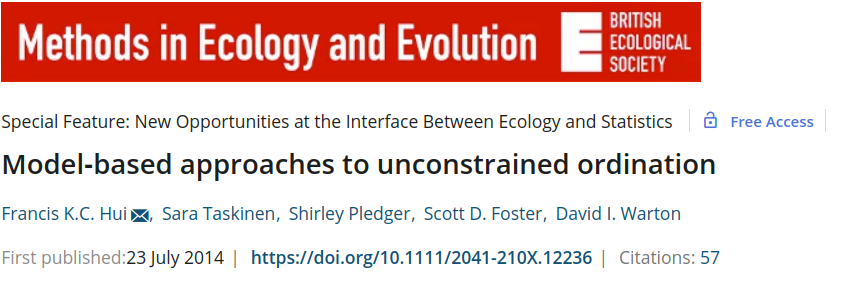

```{r setup, include=FALSE}
library(knitr)

default_source_hook <- knit_hooks$get('source')
default_output_hook <- knit_hooks$get('output')

knit_hooks$set(
  source = function(x, options) {
    paste0(
      "\n::: {.codebox data-latex=\"\"}\n\n",
      default_source_hook(x, options),
      "\n\n:::\n\n")
  }
)

knit_hooks$set(
  output = function(x, options) {
    paste0(
      "\n::: {.codebox data-latex=\"\"}\n\n",
      default_output_hook(x, options),
      "\n\n:::\n\n")
  }
)

knitr::opts_chunk$set(echo = TRUE)
```
# Outline

- GLLVMs background
- Difference to classical methods
- \texttt{gllvm} \texttt{R}-package

## Questions so far?

\center

{width=40%}

# Background

## Model-based thinking for community ecology

\textcolor{red}{Warton et al. 2015}

- Classical methods ignore properties of the ecological process
- They are purely algorithmic (and severely outdated)
- There are few links to theory

## Model-based analysis

- Accounts for properties of the ecological process
- Is flexible
- Has clear connections with testable hypotheses
- Are computationally intensive \emoji{woozy-face}
- Provides diagnostic tools

## Some other (approximate) latent variable models

\columnsbegin
\column{.8\textwidth}
\begin{itemize}
\item \small Principal Component Analysis  \tiny (Pearson 1901) \small
\item Factor analysis \tiny (Spearman 1904)  \small
\item Redundancy Analysis \tiny (Rao 1964)  \small
\item Principal Coordinate Analysis \tiny (Gower 1966) \small
\item Correspondence Analysis \tiny (Benzecri 1973) \small
\item Detrended Correspondence Analysis \tiny (Hill and Gauch 1980) \small
\item Canonical Correspondence Analysis \tiny (ter Braak 1986) \small

\item \textcolor{red}{Non-metric Multidimensional Scaling} \tiny (Kruskal 1964) \small
\item \textcolor{red}{t-SNE} \tiny (van der Maaten 2008) \small
\item \textcolor{red}{UMAP} \tiny (McInnes and Healy 2018) \normalsize
\end{itemize}
\column{0.33\textwidth}

```{r, echo=F, eval=T, fig.align="center", out.width="99%"}

```

\columnsend
\only<2>{
\begin{center}
\textcolor{red}{GLLVM replaces all of these, and does it better.}
\end{center}
}

##

```{r, echo=F, eval=TRUE, fig.align="center", out.height="75%"}

```

## Contemporary multivariate methods

- Multivariate GLMs \tiny (Wang et al. 2012) \normalsize
- Vector GAMs \tiny (Yee et al. 1996,2003,2010,2015) \normalsize
- Joint SDMs \tiny (Pollock et al. 2014 , Clark et al. 2014) \normalsize
- Row-column interaction models  \tiny (Hawinkel  et al. 2019) \normalsize
- Generalized Linear Latent Variable Models \tiny (Skrondal and Rabe-Hesketh 2004, Hui et al. 2015, Warton et al. 2015, Ovaskainen et al. 2017) \normalsize

\only<2>{\textcolor{red}{and many more} \tiny (e.g., clustering) \normalsize}

## Goals of ordination

\begin{itemize}
\item To order sites and species along gradients
\item To reduce dimensions (because there are many)
\begin{itemize}
\item for unconstrained ordination: species
\item for constrained ordination: species and predictors
\end{itemize}
\item generally: to facilitate inference on (sparse) multivariate data
\end{itemize}

# GLLVM

## Generalized Linear Latent Variable Model (GLLVM)

\columnsbegin
\column{.8\textwidth}
\begin{itemize}
\item A framework for model-based multivariate analysis
\item That does dimension reduction (i.e., ordination)
\item There is no distance measure
\item You do need to specify: 
\begin{enumerate}  
  \item A distribution
  \item A link function
  \item The model its structure
\end{enumerate}
\item Latent variables are found by \textit{best fit} (and the first is not always the most important)
\item We (can) treat them as random effect when appropriate
\end{itemize}  
\column{.2\textwidth}

```{r echo=F, eval=T, out.width="99%"}
knitr::include_graphics("MathCaution.png")
```

\columnsend

## Response distribution

\begin{equation}
\tikzmarknode{t1}{\highlight{green}{y_{ij}}}
\sim
\tikzmarknode{t2}{\highlight{blue}{f}}
\biggl\{
\tikzmarknode{t3}{\highlight{yellow}{g^{-1}}}
\biggl(
\tikzmarknode{t4}{\highlight{red}{\eta_{ij}}}
              \biggr),
\tikzmarknode{t5}{\highlight{grey}{\phi_j}}
\biggr\}
\end{equation}

\begin{enumerate}
    \item<2> Community data
        \tikz[na,remember picture]\node[coordinate] (n1) {};
    \item<3> Response distribution
        \tikz[na,remember picture]\node[coordinate] (n2) {};
    \item<4> (inverse) Link function
        \tikz[na,remember picture]\node[coordinate] (n3) {};
    \item<5> Linear predictor ("the model")
        \tikz[na,remember picture]\node[coordinate] (n4) {};
   \item<6> Dispersion parameter
        \tikz[na,remember picture]\node[coordinate] (n5) {};
\end{enumerate}


\begin{tikzpicture}[overlay,remember picture]
        \draw<2>[->] (n1) -| ([xshift=0.1cm]n1) |- ([xshift=0.1cm, yshift = 0.3cm]n1) -| (t1);
        \draw<3>[->] ([xshift=-0.5cm, yshift = 0.2cm]n2) |- ([xshift=-0.5cm, yshift = 0.3cm]n2) -| (t2);
        \draw<4>[->] (n3) -| (t3);
        \draw<5>[->] (n4) -| (t4);
        \draw<6>[->] (n5) -| (t5);
\end{tikzpicture}


## Latent variable distribution

\begin{equation}
\tikzmarknode{t1}{\highlight{yellow}{\textbf{z}_{i}}} \sim \mathcal{N}(\textbf{0}, \textbf{I})
\end{equation}

- In unconstrained ordination, we assume LVs to be multivariate standard normal in distribution
  - They absorb all residual variation, so we assume $\symbf{z}_i =\symbf{\epsilon}_i$
- This is similar to classical ordination methods (orthogonality)
- But in GLLVMs they are random effects (more appropriate)
- In constrained ordination this is different (see)

## GLLVM Likelihood

\begin{equation}
\mathcal{L}(\Theta) =\sum \limits_{i=1}^n \log\biggl\{ \displaystyle\int \prod \limits_{j=1}^m \tikzmarknode{t1}{\highlight{blue}{f}}\biggl(\tikzmarknode{t2}{\highlight{blue}{y_{ij}}} \vert \tikzmarknode{t3}{\highlight{yellow}{\textbf{z}_i}}, \Theta\biggr)h\biggl(\tikzmarknode{t4}{\highlight{yellow}{\textbf{z}_i}}\biggr) d\tikzmarknode{t5}{\highlight{yellow}{\textbf{z}_i}} \biggr\},
\label{gllvm2}
\end{equation}

\textcolor{red}{\textbf{Take away: ugly integral sign that we cannot analytically solve}}

## The model

\begin{equation}
\tikzmarknode{t1}{\highlight{red}{\eta_{ij}}}
= 
\tikzmarknode{t2}{\highlight{blue}{\beta_{0j}}}
+
\tikzmarknode{t5}{\highlight{gray}{\ldots}}
+
\tikz[baseline,remember picture]{
\node[anchor=base,rectangle, draw=red, dashed] (t34) {$
\alt<5->{
\tikzmarknode{t3}{\highlight{yellow}{\symbf{z}_i^\top}}
\tikzmarknode{t4}{\highlight{green}{\symbf{\gamma}_j}}
}{
\tikzmarknode{t3}{\highlight{yellow}{\symbf{z}_i^\top}}
\tikzmarknode{t4}{\highlight{green}{\symbf{\gamma}_j}}
}
$}
}
\end{equation}

\begin{enumerate}
    \item<2> Linear predictor
        \tikz[na,remember picture]\node[coordinate] (n1) {};
    \item<3> Species intercept
        \tikz[na,remember picture]\node[coordinate] (n2) {};
    \item<4> Other stuff
        \tikz[na,remember picture]\node[coordinate] (n6) {};
    \item<5> Ordination
        \tikz[na,remember picture]\node[coordinate] (n3) {};
    \item<6> Site scores (ordination axis/latent variables)
        \tikz[na,remember picture]\node[coordinate] (n4) {};
    \item<6> Species loadings
        \tikz[na,remember picture]\node[coordinate] (n5) {};
\end{enumerate}

\begin{tikzpicture}[overlay,remember picture]
        \draw<2>[->] (n1) -| (t1);
        \draw<3>[->] (n2) -| (t2);
        \draw<4>[->] (n6) -| (t5);
        \draw<5>[->] (n3) -| (t34);
        \draw<6>[->] (n4) -| ([xshift=0.1cm]n4) |- ([xshift=0.1cm, yshift = 0.3cm]n4) -| (t3);
        \draw<6>[->] (n5) -| ([xshift=0.5cm]n4.east) |- (t4);
\end{tikzpicture}

## GLLVM advantages

\textit{Combining regression with the best of ordination}

\small

\begin{itemize}
\item<2-4> Model selection
\item<2-4> Confidence intervals
\item<2-4> Diagnostic tools: residuals, derivatives, information criteria
\item<2-4> Adjustable model structure

\item<3-4> Ordination for all kinds of datatypes in one framework
\begin{itemize}
\item<3-4> Count data, cover data, binary data, continuous data
\item<3-4> Poisson, zero-inflated, negative binomial, binomial, ordinal, beta, gamma, etc.
\end{itemize}

\item<4> Many tools from ordination too
\begin{itemize}
\item Ordination plots
\item Gradient length
\item Variance partitioning (to some degree)
\end{itemize}
\end{itemize}

# Model-based ordination

\begin{center}
\textbf{Suggested to use Generalized Linear Latent Variable Models for unconstrained ordination}
\end{center}

```{r, echo=F, fig.align="center", out.width="100%", echo = FALSE}

```

Building on a long history of using latent variables in ecology (e.g., ter Braak 1985)

## GLLVMs vs. classical ordination: main differences

\columnsbegin
\column{0.7\textwidth}

1) GLLVMs have a real model
2) GLLVMs incorporate distributions, not distances
3) There are no eigenvalues (but there is variance)
4) Number of dimensions are set \emph{a-priori} as in NMDS
5) Latent variables are found by "best fit"
6) You might not get the same solution every time
7) Forget about permutation testing
8) We do not care much about rotation
9) $\scalebox{3}{\to}$ \normalsize

\column{0.3\textwidth}


\columnsend

## Fitting unconstrained ordination

### In R e.g.,

\begin{itemize}
\item \texttt{HMSC} - Bayesian (slow) with a lot of tools
\item \texttt{Boral} - Bayesian (slow) easy to use
\item \texttt{ecoCopula} - even (super) faster (but marginal interpretation)
\item \texttt{glmmTMB} - very easy to use, can include many other random-effects
\item \texttt{gllvm} - fast and easy to use
\end{itemize}

## Fitting ordination with predictors

### In R e.g.,

\begin{itemize}
\item VGAM - robust algorithm, quick, many distributions
\item RCIM - flexible response models \normalsize
\item gllvm - straightforward interface, also random effects \normalsize
\end{itemize}

# The \texttt{gllvm} \texttt{R}-package

```{r, echo=F, out.width = "25%", fig.show="hold"}
knitr::include_graphics("jenni2.jpeg")
knitr::include_graphics("hui.jpg")
knitr::include_graphics("pekka.jpg")
knitr::include_graphics("sara.jpeg")
knitr::include_graphics("warton.jpg")
knitr::include_graphics("bob.jpg")
```

\footnotesize

Jenni Niku (JYU), Francis Hui (ANU), Pekka Korhonen (JYU), Sara Taskinen (JYU), David Warton (UNSW), Bob O'Hara (NTNU)

Many people have put a lot of work into development of the methods presented here

## The \texttt{gllvm} \texttt{R}-package

- Fast
- Easy to use
- Many different model structures
- (Un)constrained ordination with random-effects
- Tools for ordination (biplot) and regression (model selection, statistical uncertainties)
- (very) Active support via github (Jenni Niku, me \emoji{smiling-face})

\textbf{Jenni Niku, Wesley Brooks, Riki Herliansyah, Francis K.C. Hui, Pekka Korhonen, Sara Taskinen, Bert van der Veen and David I. Warton (2023). gllvm:
  Generalized Linear Latent Variable Models. R package version 1.4.3.}

## \texttt{gllvm}


- Originally published in 2019 by Niku et al. 
- For JSDM, unconstrained, and residual ordination
- Since then it has been considerably extended
- Models are fitted in C++ with Template Model Builder \tiny (Kristensen et al. 2015) \normalsize

## Likelihood approximation

\begin{equation}
\mathcal{L}(\Theta) =\sum \limits_{i=1}^n \log\biggl\{ \displaystyle\int \prod \limits_{j=1}^m f\biggl(y_{ij} \vert \textbf{z}_i, \Theta\biggr)h\biggl(\textbf{z}_i\biggr) d\textbf{z}_i \biggr\},
\label{gllvm}
\end{equation}

The package has three methods for approaching the estimation:

- Laplace approximation (LA)
- Variational approximation (VA)
- Extended variational approximation (EVA)

\centering
\textcolor{red}{\textbf{Sometimes we want or need to switch between these}}

## Main function: `gllvm(.)`


This has many arguments

\columnsbegin
\column{0.4\textwidth}

- `y` (community data)
- `X` (environment)
- `TR` (traits)
- `data`
- `formula`
- `family`

\column{0.6\textwidth}

- `num.lv` (unconstrained ord.)
- `num.lv.c` (concurrent ord.)
- `num.RR` (constrained ord.)
- `lv.formula`
- `sd.errors` (often takes long)
- `method` (LA, VA, EVA)

\columnsend

## `gllvm(.)` arguments continued

\small

\columnsbegin
\column{0.5\textwidth}

- `studyDesign`
- `dist`
- `colMat` (new)
- `colMat.rho.struct` (new)
- `corWithin`
- `quadratic` (unimodal response model)
- `row.eff`
- `offset`
- `randomB` (for constrained/concurrent)
- `randomX` (for 4th corner)
- `beta0com`
- `zeta.struc` (only applies to ordinal)

\column{0.5\textwidth}

- `link` (only applies to binomial)
- `Ntrials` (only applies to binomial)
- `Power` (only applies to tweedie)
- `seed` (for reproducibility)
- `scale.X` (for 4th corner)
- `return.terms`
- `gradient.check` (convergence check)
- `disp.formula` (dispersion parameters)
- `control`
- `control.va`
- `control.start`

\columnsend


## Distributions in \texttt{gllvm}

\footnotesize 

\begin{table}[h]
\begin{tabu} to \linewidth {*4{X}}
\toprule
Type of data & Distribution & Method & Link\\
\midrule
Normal & Gaussian & VA/LA & identity\\
Counts & Poisson & VA/LA \\ log \\
& NB & VA/LA & log \\
& ZIP & VA/LA  & log \\
& ZINB & VA/LA & log \\
& binomial & VA/LA & probit \\
& binomial & LA & logit \\ 
Binary & Bernoulli & EVA VA/LA & probit logit \\
Ordinal & Multinomial & VA & cumulative probit \\
Biomass & Tweedie & EVA/LA & log \\
Positive continuous & Gamma & VA/LA &log \\
& Exponential & VA/LA & log \\
Percent cover & beta & LA/EVA & probit/logit \\
\tiny with zeros or ones \normalsize & ordered beta & EVA & probit \\
\bottomrule
\end{tabu}
\end{table}
\normalsize

## Functions in the package

\columnsbegin
\column{0.5\textwidth}

- `gllvm()`
- `logLik()`
- `summary()`
- `confint()`
- `predict()`
- `coefplot()`

\column{0.5\textwidth}

- `randomCoefplot()`
- `plot()` and `residuals()`
- `se()` and `vcov()`
- `getLV()`
- `getLoadings()` (new)
- `predictLVs()`

\columnsend 

\columnsbegin
\column{0.99\textwidth}

- `getPredictErr()`
- `getResidualCor()` and `getResidualCov()`
- `getEnvironmentalCor()` (new) and `getEnvironmentalCov()` (new)
- `optima()` and `tolerances()`
- `simulate()`

\column{0.01\textwidth}<!--dummy column for alignment-->
\columnsend


\textcolor{red}{\textit{new: in development version, not on CRAN yet}}

## Defaults

- without `lv.formula`: 2 unconstrained LVs
- with `lv.formula`: 0 unconstrained LVs
- `method = "VA"`
- `sd.errors = TRUE`
- `optimizer = "optim"` with `optim.method  = "BFGS"`
- `row.eff = FALSE`
- `Power = 1.1`
- `seed = NULL` 

We will look at how/why to change these these in the workshop.

## Model structures

\footnotesize 

- Covariates outside of ordination: `X` and `formula` ("conditioning" or "covariate-adjusted")
- Unconstrained ordination: `num.lv` and (optional) `quadratic`
- Constrained ordination:  `num.RR` and (optional) `lv.formula` or `randomB` or `quadratic`
- Concurrent ordination: `num.lv.c` and (optional) `lv.formula` or `randomB` or `quadratic`
- Fourth-corner LVM: `X` and `TR` and `formula` and (optional) `randomX` or  `beta0comm`
- Random species effects: `formula` and `X` and (optional) `beta0comm`
  - Phylogenetic effects: `colMat` and `colMat.rho.struct`
- Random site effects: `row.eff` and (optional) `dist` or `studyDesign`

\centering
\textcolor{red}{\textbf{Some of these can be combined, not all}} \newline
\textcolor{red}{E.g., no traits with constrained/concurrent ordination}
\tiny that might be the only limitation at present

## `ordiplot(.)`

# Example

## Insight into the algorithm

Little shiny app here: https://bertvdveen.shinyapps.io/shinygllvm/ \newline
Or, e.g., : `gllvm(y, family = "poisson", TMB = FALSE, plot = TRUE) `

## Unconstrained ordination/JSDM

\footnotesize

```{r uord, echo = -5, cache = TRUE, messages = FALSE, fig.height = 4, seed = 1, fig.width = 8, message = FALSE}
library(gllvm)
data("antTraits"); Y <- antTraits$abund
uord <- gllvm(Y, family = "negative.binomial")
ordiplot(uord, biplot = TRUE, main = NA, symbols = TRUE, 
         s.colors = "grey", cex.spp = 1.2, s.cex = 3, pch = 16)
abline(v= 0, h = 0, lty = "dashed")
```

\normalsize

## Unconstrained ordination/JSDM

\footnotesize

```{r uord2, echo = TRUE, cache = TRUE, messages = FALSE, fig.height = 2, fig.width = 5, message= FALSE}
library(corrplot)
corrplot(getResidualCor(uord), type = "lower", order = "AOE", tl.pos = "l", 
         tl.cex = 0.3, diag = FALSE, win.asp = 0.5)
```

\normalsize 

## Constrained ordination

\footnotesize

```{r coord, echo = -4, cache = TRUE, messages = FALSE, fig.height = 4, seed = 1, fig.width =8}
X = scale(antTraits$env)
coord <- gllvm(Y, X = X, num.RR = 2, family = "negative.binomial",
               randomB="LV")
ordiplot(coord, main = NA, symbols = TRUE, s.colors = "grey", 
         cex.spp = 1.2, s.cex = 3, pch = 16, arrow.ci = FALSE, 
         cex.env = 1.2, arrow.scale = 2, lab.dist = 0.3)
abline(v= 0, h = 0, lty = "dashed")
```

\normalsize

## Multiple starting values

One "quirk" about such models: they can give different solutions each time. \texttt{gllvm} strategy:

- `starting.val`: different types of (smartly) generated starting values
- `jitter.var`: add a little noise to starting values
- `optimizer`: changing it can help at times
- `n.init`: run model multiple times and pick best
- `n.init.max`: maximum number of tries before exit

## Signs that your model has not converged

- Weird ordination plot (somtimes)
- Large gradient values (use gradient.check cautiously)
- Singular hessian
- Parameters on boundary
- Very large species loadings (usually combined with small sigma.lv)
- Small site scores
- Probably more

## To-do

\centering

Many extensions are still possible, and in the pipeline

- `emmeans` support
- Fitting robustness
- Traits in ordination
- Spatial/temporal LVs
- Variance partitioning
- Zero-inflated modeling
- Mixed response types

But, we are few and only human

## Where to go

\centering

Bugs: https://github.com/JenniNiku/gllvm/issues \newline
Questions: https://github.com/JenniNiku/gllvm/discussions \newline
Examples: https://jenniniku.github.io/gllvm/ \newline

# To conclude

- In active development
- Parallelisation
- Suggestions welcome
- Let's dive in