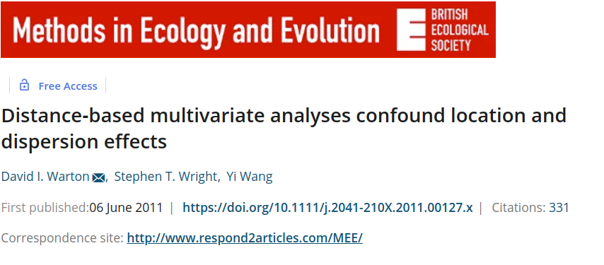

```{r setup, include=FALSE}
library(knitr)

default_source_hook <- knit_hooks$get('source')
default_output_hook <- knit_hooks$get('output')

knit_hooks$set(
  source = function(x, options) {
    paste0(
      "\n::: {.codebox data-latex=\"\"}\n\n",
      default_source_hook(x, options),
      "\n\n:::\n\n")
  }
)

knit_hooks$set(
  output = function(x, options) {
    paste0(
      "\n::: {.codebox data-latex=\"\"}\n\n",
      default_output_hook(x, options),
      "\n\n:::\n\n")
  }
)

knitr::opts_chunk$set(echo = TRUE)
```

# Outline


## Questions so far?

\center

{width=40%}

## Criteria for a good ordination

(no artefacts)

## How I first wanted to approach this

- Theory
- Equations
- Boring

## Something slightly more interesting

- There is decades of literature on the performance of ordination methods
- Let's compare to GLLVMs to get a good feeling for how the method behaves
- PCA, CA, DCA, NMDS vs GLLVM all have their deficits that we can check against

1) PCA has a horseshoe
2) CA has an arch
3) DCA has a tongue
4) NMDS has.. something

## Name that method


## Name that method: hint


\columnsbegin
\column{0.5\textwidth}

- NMDS
- PCA
- CA
- PCoA

\column{0.5\textwidth}

- DCA
- UMAP
- tSNE
- GLLVM

\columnsend

## Let's go exploring 

So let us use some "notorious" data and explore these

- [Podani and Miklos (2002)](https://doi.org/10.1890/0012-9658(2002)083[3331:RCATHE]2.0.CO;2)
- [Minchin (1987)](https://link.springer.com/article/10.1007/BF00038690)

# Podani and Miklos (2002)


## Podani and Miklos (2002)

- Four artificial datasets
- With courtesy of [Gavin Simpson](https://github.com/gavinsimpson/random_code)

1) \textbf{Single gradient with unimodal responses}
2) Single gradient with linear responses
3) Single gradient with unimodal responses (from Legendre and Legendre 1998)

## Load the datasets

```{r, message= FALSE, warning=FALSE}
tmp <- tempfile()
download.file("https://github.com/gavinsimpson/random_code/raw/master/podani.R",
              tmp, method = "wget")
source(tmp)
PM1 <- podani1()
PM2 <- podani2()
PM3 <- podani3()
```

## Have a look at the data

## PM1: PCA

\footnotesize

```{r pca, fig.align="center", dev="png", fig.show="hide"}
PCA <- prcomp(PM1)
vegan::ordiplot(PCA, type = "text", display = "sites", cex = 2)
```

\normalsize

\columnsbegin
\column{0.5\textwidth}

`)

\column{0.5\textwidth}

- First dimension is related to quadratic function of the second
- First and last sites are still close together in two-dimensional space
- Quadratic term comes on first dimension because it explains more variation than the linear term

\columnsend

## PM1: CA

\footnotesize

```{r ca, echo = -1, fig.height = 10, fig.align="center", dev="png", fig.show="hide"}
par(mfrow=c(2,1))
CA <- vegan::cca(PM1)
vegan::ordiplot(CA, type = "text", cex = 5, display = "sites");vegan::ordiplot(CA, type = "text", cex = 5, xlim=c(-1.5,1.5),ylim=c(-1.5,-1))
```

\normalsize

\columnsbegin
\column{0.5\textwidth}

`)

\column{0.5\textwidth}

- First dimension is the quadratic function of the second
- No curvature inwards: first and last sites are not actually close together
- Spread of scores smaller on at beginning and end: edge effect

\columnsend

## PM1: DCA

\footnotesize

```{r dca, fig.height=10, fig.align="center", dev = "png", fig.show="hide"}
DCA <- vegan::decorana(PM1)
vegan::ordiplot(DCA, type = "text", display = "sites", cex = 2)
```

\normalsize

\columnsbegin
\column{0.5\textwidth}

`)

\column{0.5\textwidth}

- I have no idea what DCA did here
- The procedure DCA uses is quite criticized
- It "smashes" the arch, and rescales to improve edge issues

\columnsend

## PM1: NMDS

\footnotesize

```{r nmds, fig.height = 10, fig.align="center", dev = "png", fig.show="hide", warning=FALSE}
NMDS <- vegan::metaMDS(PM1, trace = 0)
vegan::ordiplot(NMDS, type = "text", display = "sites", cex = 2)
```

\normalsize

\columnsbegin
\column{0.5\textwidth}

`)

\column{0.5\textwidth}

- NMDS also shows a horseshoe
- But note the range of the axes
- By default it uses Bray-Curtis distance

\columnsend

## PM1: NMDS

\footnotesize

```{r, fig.height = 5, fig.align="center", warning = FALSE}
NMDS <- vegan::metaMDS(PM1, k =1, trace = 0)
plot(NMDS$points, 1:nrow(PM1), xlab = "Index", ylab = "Dim 1")
```

\normalsize

## PM1: NMDS funny plots

\footnotesize

```{r nmds2, message=FALSE, echo = FALSE, cache = TRUE, fig.height = 10, fig.align="center", dev = "png", fig.show="hide", warning=FALSE}
par(mfrow=c(2,1))
NMDS2 <- vegan::metaMDS(PM1, distance = "mahalanobis", trace = 0)
NMDS3 <- vegan::metaMDS(PM1, distance = "clark", trace = 0)

vegan::ordiplot(NMDS2, type = "text", cex = 2, display = "sites", main = "Mahalanobis")
vegan::ordiplot(NMDS3, type = "text", cex = 2, display = "sites", main = "Clark")
```

\normalsize

\columnsbegin
\column{0.5\textwidth}

`)

\column{0.5\textwidth}

- Doesn't converge
- Not even for one of the axes

\columnsend

## PM1: PCoA

\footnotesize

```{r, message=FALSE, echo = -1, fig.height = 4.5, fig.align="center"}
par(mfrow=c(1,2))
PCoA1 <- cmdscale(vegan::vegdist(PM1))
PCoA2 <- cmdscale(vegan::vegdist(PM1, method = "gower"))
vegan::ordiplot(PCoA1, type = "text", main = "Bray")
vegan::ordiplot(PCoA2, type = "text", main = "Canberra")
```

\normalsize

## PM1: gllvm

\footnotesize

```{r, message=FALSE, echo = -1, cache = TRUE, fig.height = 5, fig.align="center", warning=FALSE}
scores.gllvm <- function(x, display  ="sites", choices = NULL){
sol <- list()
if(is.null(choices) || any(choices>(x$num.lv+x$num.lv.c+x$num.RR))){
choices <- 1:(x$num.lv+x$num.lv.c+x$num.RR)
}
if(display%in%c("sites","both")){
sol$sites <- gllvm::getLV(x)[,choices,drop=FALSE]
if(display=="sites"){
sol <- sol$sites
}
}
if(display%in%c("species","both")){
sol$species <- gllvm::getLoadings(x)[,choices,drop=FALSE]
if(display=="species"){
sol <- sol$species
}
}
return(sol)
}

uord <- gllvm::gllvm(PM1, num.lv = 2, family = "poisson")
vegan::ordiplot(uord, display = "sites", type = "text") # requires scores.gllvm
```

\normalsize

## PM1: gllvm

When we flip that around, disconnect the circle, color it yellow, and we get...


## Pac-man!

\columnsbegin
\column{0.5\textwidth}

```{r echo = FALSE, cache = TRUE, message = FALSE, seed = 1, warning=FALSE}
uord <- update(uord, y = PM1[,1:38])
plot(gllvm::getLV(uord),type="p",xlim=c(-2,2),col="yellow", main = "Pac-Man", cex.lab = 1.5, cex.main = 1.5, cex.axis = 1.5)
# lines(rbind(gllvm::getLV(uord)[40,],gllvm::getLV(uord)),col="yellow")
polygon(rbind(gllvm::getLV(uord)[40,],gllvm::getLV(uord)), col = "yellow")
```

\column{0.5\textwidth}


\columnsend

# Minchin (1987)


- Simulated using the COMPAS software on a lattice
- Skewed and asymmetric response curves
- Found all methods except NMDS to perform poorly

## Lattice


The criterion is simple: if we see this lattice, the method is doing well.

## Load the data

```{r}
MC <- read.csv("https://raw.githubusercontent.com/BertvanderVeen/Examples/master/Minchin87_2b_counts.csv",skip=1)
MC[is.na(MC)] <- 0
```

## Have a look at the data

## MC: PCA

\footnotesize

```{r pcamc, fig.align="center", dev="png", fig.show="hide"}
PCA <- prcomp(MC)
vegan::ordiplot(PCA, type = "text", display = "sites", cex = 2)
```

\normalsize

\columnsbegin
\column{0.5\textwidth}

`)

\column{0.5\textwidth}

No lattice: PCA is not doing well

\columnsend

## MC: CA

\footnotesize

```{r ca2, echo = -1, fig.height = 10, fig.align="center", dev="png", fig.show="hide"}
par(mfrow=c(2,1))
CA <- vegan::cca(MC)
vegan::ordiplot(CA, type = "text",display = "sites");vegan::ordiplot(CA, type = "text", xlim=c(-1.5,1.5),ylim=c(-1.5,-1))
```

\normalsize

\columnsbegin
\column{0.5\textwidth}

`)

\column{0.5\textwidth}

No lattice: CA is not doing well

\columnsend

## MC: DCA

\footnotesize

```{r dca2, fig.height=10, fig.align="center", dev = "png", fig.show="hide"}
DCA <- vegan::decorana(MC)
vegan::ordiplot(DCA, type = "text", display = "sites")
```

\normalsize

\columnsbegin
\column{0.5\textwidth}

`)

\column{0.5\textwidth}

- No lattice: DCA is not doing well
- ter Braak and Smilauer (2015) reanalysed with a log-transform

\columnsend

## MC: DCA

\footnotesize

```{r dca3, fig.height=5, fig.align="center", dev = "png", fig.show="hide"}
DCA2 <- vegan::decorana(log1p(MC))
vegan::ordiplot(DCA2, type = "text", display = "sites")
```

\normalsize

\centering
We start to see a lattice!

## MC: NMDS

\footnotesize

```{r nmds3, fig.height = 10, fig.align="center", dev = "png", fig.show="hide", warning=FALSE}
NMDS <- vegan::metaMDS(MC, trace = 0)
vegan::ordiplot(NMDS, type = "text", display = "sites", cex = 2)
```

\normalsize

\columnsbegin
\column{0.5\textwidth}

`)

\column{0.5\textwidth}

- A lattice: NMDS is doing quite well
- NMDS was found to be robust to different response models
- Partly because it condenses to site-level information (no species)

\columnsend

## MC: NMDS with Mahalanobis distance

\footnotesize

```{r nmds4, message=FALSE, echo = FALSE, cache = TRUE, fig.height = 10, fig.align="center", dev = "png", fig.show="hide", warning=FALSE}
NMDS4 <- vegan::metaMDS(MC, distance = "mahalanobis", trace = 0)
vegan::ordiplot(NMDS4, type = "text", display = "sites", cex = 2)
```

\normalsize

\columnsbegin
\column{0.5\textwidth}

`)

\column{0.5\textwidth}

- This looks terrible
- So the used distance measure matters

\columnsend

## MC: PCoA

\footnotesize

```{r, message=FALSE, echo = -1, fig.height = 4.5, fig.align="center"}
PCoA <- cmdscale(vegan::vegdist(MC))
vegan::ordiplot(PCoA, type = "text", cex = 2)
```

\normalsize

PCoA fails with different distance measures.

## MC: gllvm (Poisson)

\footnotesize

```{r, message=FALSE, cache = TRUE, fig.height = 5, fig.align="center", warning=FALSE}
uord <- gllvm::gllvm(MC, num.lv = 2, family = "poisson")
vegan::ordiplot(uord, display = "sites", type = "text", cex = 2) # requires scores.gllvm
```

\normalsize

## MC: gllvm diagnostics (Poisson)

\footnotesize

```{r, message=FALSE, echo = -1, cache = TRUE, fig.height = 5, fig.align="center", warning=FALSE}
plot(uord, which = 1)
```


Clearly, a Poisson distribution will not cut it. At least we can detect a bad ordination.


## MC: gllvm (NB)

\footnotesize

```{r gllvmnb, message=FALSE, cache = TRUE, fig.height = 5, fig.align="center", warning=FALSE, dev="png", fig.show="hide"}
uord <- gllvm::gllvm(MC, num.lv = 2, family = "negative.binomial", row.eff="random")
vegan::ordiplot(uord, display = "sites", type = "text", cex = 2) # requires scores.gllvm
```

\normalsize

\columnsbegin
\column{0.5\textwidth}
`)

\column{0.5\textwidth}

- A lattice: gllvm is doing quite well
- We did have to use a few tricks (NB + row-effects)
- GLLVMs non-linearly relate the ordination space to the data
 
\columnsend

# Saqib et al. (2017)

## A real dataset

{width=90%}

\columnsbegin
\column{0.4\textwidth}

{width=60%}

\column{0.6\textwidth}

- Abundance of spiders in **brassica** crops
- 3 sites in China
- Sampled spiders at 25-29 points in 50x50m grids
- Grids were in crops and adjacent vegetation

\columnsend

\textcolor{red}{\textbf{Difficulty: many zeros}}


## Classical ordinations of SQ data

```{r spidS, echo = FALSE, fig.height = 5}
Y<-read.csv("../data/SpiderSY.csv", header=TRUE)[,-1]
X<-read.csv("../data/SpiderSX.csv", header=TRUE)[,-1]
X<-X[rowSums(Y)>0,]
Y <- Y[rowSums(Y)>0,]
ord1 <- vegan::metaMDS(Y, trace = 0)
ord2 <- vegan::cca(Y)
ord3 <- vegan::decorana(Y)
ord4 <- cmdscale(vegan::vegdist(Y))
par(mfrow=c(2,2))
vegan::ordiplot(ord1, main = "NMDS")
vegan::ordiplot(ord2, main = "CA")
vegan::ordiplot(ord3, main = "DCA")
vegan::ordiplot(ord4, main = "PCoA")
```

But, what makes for a good ordination method?

## Step 1): A poisson gllvm

\footnotesize
We have abundances, so we (usually) start at fitting a Poisson model

```{r, cache = TRUE, fig.height = 4}
model<-gllvm::gllvm(Y, num.lv=2, family = "poisson", row.eff = ~(1|sites), studyDesign = X, seed = 1)
vegan::ordiplot(model) # requires scores.gllvm
```

An additional random effect is included to account for replication within sites

## Evaluating fit

In GLLVMs we can quantitatively assess if we have a decent model

1) We look at the likelihood (e.g., with information criteria)
2) We check residuals (to see if we have accounted for all data properties)

## Step 2): residuals

\footnotesize

```{r, echo = -1, cache = TRUE, fig.height = 4}
par(mfrow=c(1,4))
plot(model, which = 1:4)
```

\normalsize

We see some deviation in the tail. Maybe we should adjust our model?

## Step 3): checking for zero-inflation

\footnotesize

```{r, fig.height = 3, message = FALSE, results = FALSE}
sim <- do.call("cbind", replicate(1000, c(as.matrix(gllvm::simulate(model,conditional=TRUE))), simplify=FALSE))
dharma <- DHARMa::createDHARMa(simulatedResponse=sim, observedResponse=as.matrix(c(as.matrix(Y))), integerResponse=TRUE, fittedPredictedResponse=c(predict(model)))
DHARMa::testZeroInflation(dharma)
```

\normalsize

## Step 4): Fit a zero-inflated model \tiny (or alternatively, NB)

\footnotesize

```{r, cache = TRUE, fig.height = 5}
model <- update(model, family = "ZIP")
vegan::ordiplot(model)
```

\normalsize

## Step 5): Checking for zero-inflation again

\footnotesize

```{r, fig.height = 3, echo = FALSE, message = FALSE, results = FALSE}
sim <- do.call("cbind", replicate(1000, c(as.matrix(gllvm::simulate(model,conditional=TRUE))), simplify=FALSE))
dharma <- DHARMa::createDHARMa(simulatedResponse=sim, observedResponse=as.matrix(c(as.matrix(Y))), integerResponse=TRUE, fittedPredictedResponse=c(predict(model)))
DHARMa::testZeroInflation(dharma)
```

\normalsize

Looks like now we are predicting too many zeros. Oh well.

# Ordination evaluation

## Classical ordination methods

- Form a loosely connected set of methods
- That makes teaching them challenging
- Are not "state-of-the-art" anymore
- Which would be fine, if they did not have deficits
- Still a very useful set of methods (because they are so easy to use)

\centering

\textcolor{red}{\textbf{In contrast, GLLVMs form a state-of-the-art framework that extends GL(M)Ms}}

## Model-based ordination

\begin{center}
\textbf{Suggested to use Generalized Linear Latent Variable Models for unconstrained ordination}
\end{center}

```{r, echo=F, fig.align="center", out.width="100%", echo = FALSE}
knitr::include_graphics("modelbased.png")
```


## Model-based unconstrained ordination

\center
```{r, out.width="38%",out.height="38%", echo = FALSE}
knitr::include_graphics("modelbased_francis1.jpg")
knitr::include_graphics("modelbased_francis2.jpg")
```
\center
```{r, out.width="65%", echo = FALSE}
knitr::include_graphics("francis_modelbased2.jpg")
```

- GLLVMs perform similarly (or better) than classical methods

## Distance-based ordination has issues

```{r, echo=F, eval=T, fig.show="hold", out.width="60%", fig.align="center"}


```

In essence: not accounting for the properties of your data gives a bad ordination

## (spoiler: yes you should)


- Concludes that both frameworks have their place 

## What makes for a good ordination method?

[Michael Palmer:](https://ordination.okstate.edu/ideal.htm)

The "Ideal" ordination method does not exist, but if it did it would possess the following qualities.

\tiny

1) It recovers gradients without distortion.
2) If clusters exist in nature, this should be obvious in the ordination.
3) It does not produce clusters which do not exist.
4) It gives the same result every time for a given data set.
5) There is a unique solution.
6) Ecological similarity is related to proximity in ordination space.
7) Scaling of axes is related to beta diversity.
8) The method is not sensitive to noise.
9) "Signal" and "Noise" are easily separated.
10) You do not need to pre-specify number of axes.
11) The solution is the same, no matter how many dimensions one chooses to look at.
12) Unless by choice, all sites/stands/quadrats are treated equally.
13) The solution does not take much computer time.
14) The method is robust: it works well for short and for long gradients, for low and high noise, for sparse and full matrices, for big and for small data sets, for species-rich and species-poor systems.
15) For the mathematician: elegant.
16) For the ecologist: available, inexpensive, and easy to understand.

\normalsize

## What makes for a good ordination method?

Gauch (1982):

Three criteria are basic for ordination techniques.

(1) Effective (realistic in assumptions, suitably convey information)
(2) Robust (to real data)
(3) Practical (computer time)

## Conclusion

- I would say that GLLVMs pass almost all of these
- They are effective, robust, and (mostly) practical (ok, it is a work in progress)
- They usually do better than classical methods
- Above all, we can see when they do not perform well
