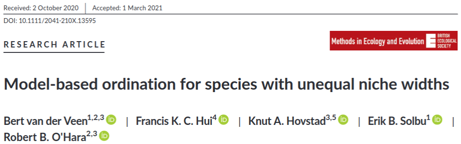
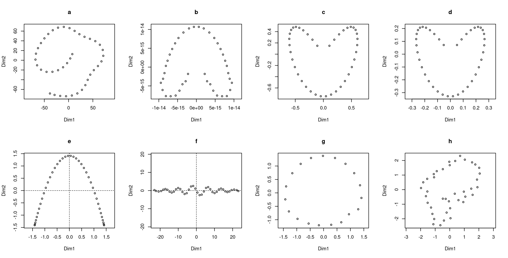

```{r setup, include=FALSE}
library(knitr)

default_source_hook <- knit_hooks$get('source')
default_output_hook <- knit_hooks$get('output')

knit_hooks$set(
  source = function(x, options) {
    paste0(
      "\n::: {.codebox data-latex=\"\"}\n\n",
      default_source_hook(x, options),
      "\n\n:::\n\n")
  }
)

knit_hooks$set(
  output = function(x, options) {
    paste0(
      "\n::: {.codebox data-latex=\"\"}\n\n",
      default_output_hook(x, options),
      "\n\n:::\n\n")
  }
)

knitr::opts_chunk$set(echo = TRUE)
```

# Outline

## Questions so far?

\centering

{width=40%}

# Unimodal models

## Unimodal responses models and ordination

There has been a lot of research on the unimodal response model in multivariate analysis

- Whittaker (1956) introduced the idea
- MacArthur (1970) formalized it
- Gauch et al. (1974) proposed "Gaussian ordination" but it did not work
- ter Braak (1985) popularized the concepts for ordination in terms of CA
- Minchin (1987) and others opposed the idea of a symmetric model

\centering

\textcolor{red}{\textbf{There has been no succesful ordination method that explicitly incorporates a response model}}

## The consensus

- PCA for short gradients (if you zoom in far enough, its linear)
- DCA for long gradients
- NMDS for robustness to deviations from unimodal curves

## Terminology

"Gaussian"
quadratic
unimodal

## Species packing

```{r, fig.align="center", echo = FALSE, fig.height = 4, message=FALSE, results = FALSE}
unimodal <-function(x, opt, tol)exp(1-0.5*(x-opt)^2/tol^2)

plot(NA, type="n", ylim=c(0, exp(1)),yaxs="i",yaxt="n",xaxt="n",xlab="Niche dimension 1", ylab="Frequency", cex.lab=1.8,cex.axis=1.8, xlim = c(-2,2))
sapply(1:10, function(j)lines(seq(-2,2,length.out=1000), unimodal(seq(-2,2,length.out=1000), seq(-2,2,length.out=10)[j], 0.5)))
```

- "Species packing" \tiny MacArthur (1969) \normalsize
  - Competitive exclusion
  - Limiting similarity
  - Leads to CA assumptions (uniform optima, equal maxima, equal tolerances)
- Quadratic in the environment/ niche


##

- Is the species packing assumption realistic?
- Optimal conditions are usually species-specific
- For example: temperature, space (environment or resources)
- But so is the tolerance

```{r, fig.align="center", fig.width=12, echo = FALSE}
#https://stats.stackexchange.com/questions/12209/percentage-of-overlapping-regions-of-two-normal-distributions
min.f1f2 <- function(x, mu1, mu2, sd1, sd2) {
    f1 <- dnorm(x, mean=mu1, sd=sd1)
    f2 <- dnorm(x, mean=mu2, sd=sd2)
    pmin(f1, f2)
}

mu1 <- -2;    sd1 <- 2
mu2 <- 1;    sd2 <- 1

xs <- seq(min(mu1 - 3*sd1, mu2 - 3*sd2), max(mu1 + 3*sd1, mu2 + 3*sd2), .01)
f1 <- dnorm(xs, mean=mu1, sd=sd1)
f2 <- dnorm(xs, mean=mu2, sd=sd2)
par(mar=c(5, 5, 4, 2) + 0.1)
plot(xs, f1, type="l", ylim=c(0, max(f1,f2)), col="green",yaxs="i",yaxt="n",xaxt="n",xlab="Niche dimension 1", ylab="Frequency", cex.lab=1.8,cex.axis=1.8)
axis(1,labels=c(expression(mu[1]),expression(mu[2])),at=c(mu1,mu2),lwd=0,line=NA,cex.axis=1.8)
lines(xs[f2>0.001], f2[f2>0.001], col="blue")
segments(x0=mu1,y0=0,y1=0.2,lty="dashed",col="green")
segments(x0=mu2,y0=0,y1=0.4,lty="dashed",col="blue")

```

##

- Niche width
- Commonly assumed equal (not here)
- What is the probability of niche occurrence?

```{r, fig.align="center", fig.width=12, echo = FALSE}
#https://stats.stackexchange.com/questions/12209/percentage-of-overlapping-regions-of-two-normal-distributions
min.f1f2 <- function(x, mu1, mu2, sd1, sd2) {
    f1 <- dnorm(x, mean=mu1, sd=sd1)
    f2 <- dnorm(x, mean=mu2, sd=sd2)
    pmin(f1, f2)
}

mu1 <- -2;    sd1 <- 2
mu2 <- 1;    sd2 <- 1

xs <- seq(min(mu1 - 3*sd1, mu2 - 3*sd2), max(mu1 + 3*sd1, mu2 + 3*sd2), .01)
f1 <- dnorm(xs, mean=mu1, sd=sd1)
f2 <- dnorm(xs, mean=mu2, sd=sd2)
par(mar=c(5, 5, 4, 2) + 0.1)
plot(xs, f1, type="l", ylim=c(0, max(f1,f2)), col="green",yaxs="i",yaxt="n",xaxt="n",xlab="Niche dimension 1", ylab="Frequency", cex.lab=1.8,cex.axis=1.8)
lines(xs[f2>0.001], f2[f2>0.001], col="blue")
segments(x0=mu1,y0=0,y1=0.2,lty="dashed",col="green")
segments(x0=mu2,y0=0,y1=0.4,lty="dashed",col="blue")
arrows(y0=0.12,x0=mu1,x1=mu1-sd1,code = 3,col="green",length=0.2)
text(mu1-sd1/2,0.13,expression(sigma[1]),cex=1.5)
arrows(y0=0.24,x0=mu2,x1=mu2+sd2,code = 3,col="blue",length=0.2)
text(mu2+sd2/2,0.25,expression(sigma[2]),cex=1.5)
```

# GLLVM

## GLLVM with unimodal response models



van der Veen et al. (2021) developed the first truly unimodal unconstrained ordination method

## GLLVM with unimodal response models

\begin{equation}
\tikzmarknode{t1}{\highlight{red}{\eta_{ij}}}
= 
\tikzmarknode{t2}{\highlight{blue}{\beta_{0j}}}
+
\tikzmarknode{t5}{\highlight{gray}{\ldots}}
+
\tikzmarknode{t3}{\highlight{yellow}{\symbf{z}_i^\top}}
\tikzmarknode{t4}{\highlight{green}{\symbf{\gamma}_j}}
-
\tikz[baseline,remember picture]{
\node[anchor=base,rectangle, draw=red, dashed] (t567) {$
\tikzmarknode{t5}{\highlight{yellow}{\symbf{z}_i^\top}}
\tikzmarknode{t6}{\highlight{orange}{\textbf{D}_j}}
\tikzmarknode{t7}{\highlight{yellow}{\symbf{z}_i}}
$}
}
\end{equation}

\tikzmarknode{n1}{Quadratic term (positive diagonal matrix)}

\begin{tikzpicture}[overlay,remember picture]
        \draw[->] (n1) -| (t567);
\end{tikzpicture}

This allows us to:

- Calculate species optima
- Calculate species tolerances
- Estimate gradient length
- Provide a more ecologically plausible ordination method

## Distributions unimodal response model

\footnotesize 

\begin{table}[h]
\begin{tabu} to \linewidth {*4{X}}
\toprule
Type of data & Distribution & Method & Link\\
\midrule
Normal & Gaussian & VA/\sout{LA} & identity\\
Counts & Poisson & VA/\sout{LA} & log \\
& NB & VA/\sout{LA} & log \\
& ZIP & VA/\sout{LA}  & log \\
& ZINB & VA/\sout{LA} & log \\
& binomial & VA/\sout{LA} & probit \\
& \sout{binomial} & \sout{LA} & \sout{logit} \\ 
Binary & Bernoulli & \sout{EVA} VA/\sout{LA} & probit \sout{logit} \\
Ordinal & Multinomial & VA & cumulative probit \\
\sout{Biomass} & \sout{Tweedie} & \sout{EVA/LA} & \sout{log} \\
Positive continuous & Gamma & VA/LA &log \\
& Exponential & VA/LA & log \\
\sout{Percent cover} & \sout{beta} & \sout{LA/EVA} & \sout{probit/logit} \\
\tiny \sout{with zeros or ones} \normalsize & \sout{ordered beta} & \sout{EVA} & \sout{probit} \\
\bottomrule
\end{tabu}
\end{table}

\normalsize

## Niche width

- "Tolerance" is the same as niche width
- This is (obviously) different for species (some specialist, some generalist)
- CA requires the assumption that this is the same for all species
- We provide three options
  - the same ("equal tolerances", species packing)
  - the same per LV ("common tolerances")
  - not the same ("unequal tolerances")
- Species maxima are usually species-specific (but not in CA)
  
## What does that mean?

```{r, fig.align="center", echo = FALSE, fig.height = 6, results = FALSE, warning=FALSE, message=FALSE}
par(mfrow=c(2,3))
unimodal <-function(x, opt, tol)exp(1-0.5*(x-opt)^2/tol^2)

plot(NA, type="n", ylim=c(0, exp(1)),yaxs="i",yaxt="n",xaxt="n",ylab="Frequency", cex.lab=1.8,cex.axis=1.8, xlim = c(-2,2), main = "Equal tolerances", cex.main = 2.5,xlab="Dimension 1")
sapply(1:10, function(j)lines(seq(-2,2,length.out=1000), unimodal(seq(-2,2,length.out=1000), seq(-2,2,length.out=10)[j], 0.5)))

plot(NA, type="n", ylim=c(0, exp(1)),yaxs="i",yaxt="n",xaxt="n", ylab=NA, cex.lab=1.8,cex.axis=1.8, xlim = c(-2,2), main = "Common tolerances", cex.main = 2.5,xlab="Dimension 1")
sapply(1:10, function(j)lines(seq(-2,2,length.out=1000), unimodal(seq(-2,2,length.out=1000), seq(-2,2,length.out=10)[j], 0.8)))

plot(NA, type="n", ylim=c(0, exp(1)),yaxs="i",yaxt="n",xaxt="n", ylab=NA, cex.lab=1.8,cex.axis=1.8, xlim = c(-2,2), main = "Unequal tolerances", cex.main = 2.5,xlab="Dimension 1")
sapply(1:10, function(j)lines(seq(-2,2,length.out=1000), unimodal(seq(-2,2,length.out=1000), seq(-2,2,length.out=10)[j], runif(1, 0.2,1))))

plot(NA, type="n", ylim=c(0, exp(1)),yaxs="i",yaxt="n",xaxt="n",xlab="Dimension 2", ylab="Frequency", cex.lab=1.8,cex.axis=1.8, xlim = c(0,4))
sapply(1:10, function(j)lines(seq(0,4,length.out=1000), unimodal(seq(0,4,length.out=1000), seq(0,4,length.out=10)[j], 0.5)))


plot(NA, type="n", ylim=c(0, exp(1)),yaxs="i",yaxt="n",xaxt="n",xlab="Dimension 2", ylab=NA, cex.lab=1.8,cex.axis=1.8, xlim = c(0,4))
sapply(1:10, function(j)lines(seq(0,4,length.out=1000), unimodal(seq(0,4,length.out=1000), seq(0,4,length.out=10)[j], 0.1)))


plot(NA, type="n", ylim=c(0, exp(1)),yaxs="i",yaxt="n",xaxt="n",xlab="Dimension 2", ylab=NA, cex.lab=1.8,cex.axis=1.8, xlim = c(0,4))
sapply(1:10, function(j)lines(seq(0,4,length.out=1000), unimodal(seq(0,4,length.out=1000), seq(0,4,length.out=10)[j], runif(1, 0.2,1))))
```

## Rare species

```{r, fig.align="center", echo = FALSE, fig.height = 6, results = FALSE, warning=FALSE, message=FALSE}
par(mfrow=c(2,3))
unimodal <-function(x, maximum, opt, tol)exp(maximum-0.5*(x-opt)^2/tol^2)

plot(NA, type="n", ylim=c(0, exp(1)),yaxs="i",yaxt="n",xaxt="n",xlab=NA,ylab="Frequency", cex.lab=1.8,cex.axis=1.8, xlim = c(-2,2), main = "Frequent specialist \nsufficiently sampled", cex.main = 2.5)
lines(seq(-2,2,length.out=1000), unimodal(seq(-2,2,length.out=1000), 1, 0, 0.1))
rug(seq(-0.5,0.5,length.out=20), ticksize = 0.03, lwd = 1)

plot(NA, type="n", ylim=c(0, exp(1)),yaxs="i",yaxt="n",xaxt="n",xlab=NA, ylab=NA, cex.lab=1.8,cex.axis=1.8, xlim = c(-2,2), main = "Infrequent specialist \nsufficiently sampled", cex.main = 2.5)
lines(seq(-2,2,length.out=1000), unimodal(seq(-2,2,length.out=1000), 0, 0,0.1))
rug(seq(-0.5,0.5,length.out=20), ticksize = 0.03, lwd = 1)

plot(NA, type="n", ylim=c(0, exp(1)),yaxs="i",yaxt="n",xaxt="n", cex.lab=1.8,cex.axis=1.8, xlim = c(-2,2), main = "Infrequent specialist \ninsufficiently sampled", cex.lab=1.8,cex.axis=1.8, xlab = NA, ylab = NA,cex.main=2.5)
lines(seq(-2,2,length.out=1000), unimodal(seq(-2,2,length.out=1000), 0,0, 0.1))
rug(c(seq(-2,-0.5,length.out=10),-0.3,-0.2,-0.1,0.5,0.9,0.9), ticksize = 0.03, lwd = 1)

plot(NA, type="n", ylim=c(0, exp(1)),yaxs="i",yaxt="n",xaxt="n",ylab="Frequency", cex.lab=1.8,cex.axis=1.8, xlim = c(-2,2), main = "Frequent generalist \nsufficiently sampled", cex.main = 2.5,xlab="Dimension 1")
lines(seq(-2,2,length.out=1000), unimodal(seq(-2,2,length.out=1000), 1,0, 0.8))
rug(seq(-2.5,2.5,length.out=50), ticksize = 0.03, lwd = 1)

plot(NA, type="n", ylim=c(0, exp(1)),yaxs="i",yaxt="n",xaxt="n",xlab="Dimension 1", cex.lab=1.8,cex.axis=1.8, xlim = c(-2,2), main = "Infrequent generalist \nsufficiently sampled", cex.lab=1.8,cex.axis=1.8, ylab=NA, cex.main=2.5)
lines(seq(-2,2,length.out=1000), unimodal(seq(-2,2,length.out=1000), 0,0, 0.8))
rug(seq(-2.5,2.2,length.out=50), ticksize = 0.03, lwd = 1)

plot(NA, type="n", ylim=c(0, exp(1)),yaxs="i",yaxt="n",xaxt="n",xlab="Dimension 1", cex.lab=1.8,cex.axis=1.8, xlim = c(-2,2), main = "Infrequent generalist \ninsufficiently sampled", cex.lab=1.8,cex.axis=1.8, ylab=NA, cex.main = 2.5)
lines(seq(-2,2,length.out=1000), unimodal(seq(-2,2,length.out=1000), 0,0, 0.8))
rug(c(seq(-2,-0.5,length.out=20),0,0.5,0.9,0.9), ticksize = 0.03, lwd = 1)
```


## Consequences

- Unconstrained Quadratic Ordination (UQO) is a very complex method
- Unequal tolerances is not achievable for most datasets
- Equal or common tolerances is most suitable in practice
  - An equal tolerances model can be fitted with an ordinary GLLVM

# Distortion

## On non-linear distortions in GLLVMs

\textit{"The arch effect is simply a mathematical artifact, corresponding to no real structure in the data. It arises because the second axis (canonical variate) of RA is constrained to be uncorrelated with the first axis, but is in no way constrained to be independent of it."}

\hfill \tiny (Hill and Gauch, 1980) \normalsize
 
\vspace*{\baselineskip}
 
Recap: a-priori in GLLVMs the latent variables are uncorrelated and independent.

## On non-linear distortions in GLLVMs

\begin{equation}
\text{cov}(\textbf{z}_i^\top\symbf{\gamma}_j, \textbf{z}_i^\top\textbf{D}\textbf{z}_i) = 0
\end{equation}

The linear and quadratic terms are uncorrelated: it is an orthogonal polynomial (useful for interpretation and convergence).

\centering

\textcolor{red}{\textbf{This also means that the linear and quadratic terms can be separately visualized in an ordination plot, and lead to distortions. So we cannot plot the model as an ordinary ordination.}}

## On plotting a quadratic response mode

- One method is to plot the predicted curves per dimension
- For an ordination diagram we can plot the optima with site scores
- Tolerances can be used to draw suitability regions
- Very large optima (due to near linear responses) need to be drawn as arrows (`ordiplot(.)` does this by default)

## On non-linear distortions in GLLVMs

- Horseshoe effect does not exist in GLLVM
- $\mathams{E}(\textbf{z}_i\vert\textbf{y}_i)$ is more flexible than the (prior) normality assumption
- The model will always attempt to capture the data as well as possible
- Attitude: if we see something we do not like, we adjust the model
  - I.e., if we see quadratic curvature, we apply a quadratic response model
  - An ordination plot for quadratic response model cannot exhibit quadratic curvature

## On non-linear distortions in GLLVMs

- A GLLVM without quadratic response model can exhibit non-linear patterns
- We can get into situations where linear terms approximate quadratic terms
- This might especially happen if the variance due to the quadratic term is larger than due to the linear term

\begin{equation}
\tikzmarknode{t1}{\highlight{grey}{\Sigma_{j,l}}} = \tikzmarknode{t2}{\highlight{green}{\symbf{\gamma}_j\symbf{\gamma}_l}} + \tikzmarknode{t3}{\highlight{orange}{\sum^d_{q=1}2D_{jqq}D_{lqq}}}
\end{equation}

## Example non-linear distortion

\footnotesize

```{r, message = FALSE, fig.height = 4.5}
library(gllvm)
data("spider", package = "mvabund");Y <- spider$abund;
model <- gllvm(Y, num.lv = 2, family = "poisson")
ordiplot(model, symbols = TRUE, pch = 16)
```

\normalsize

## Equal tolerances

The quadratic response model with equal tolerances model is:

\begin{equation}
\eta_{ij} = \beta_{0j} + \textbf{z}_i^\top\symbf{\gamma}_j - \textbf{z}_i^\top\textbf{D}\textbf{z}_i
\end{equation}

which is the same as:

\begin{equation}
\eta_{ij} = \alpha_i + \beta_{0j} + \textbf{z}_i^\top\symbf{\gamma}_j, \qquad \text{where } \alpha_i = \textbf{z}_i^\top\textbf{D}\textbf{z}_i
\end{equation}

Under the equal tolerances assumption, the quadratic term only affects the total abundance at sites.

## What does that mean?

- On an ordination plot we can usually interpret species' locations as optima
- Instead of as the main direction of increase
- You need a random site effect in the model

\columnsbegin
\column{0.5\textwidth}

```{r, fig.align="center", echo = FALSE, fig.height = 6, fig.cap = "Species effects as increase direction"}
mu1 <- -2
mu2 <- 1
mu11 <- 2
mu21 <- 1.1
plot(NA,xlab="Niche dimension 1", ylab="Niche dimension 2",xaxt="n",yaxt="n",xlim=c(-4,2),ylim=c(0.5,3), cex.lab=1.5, type ="n")
box()
text(-2,1.5,labels=1,col="black", cex = 2)
text(0,2,labels=2,col="black", cex = 2)
text(0,1,labels=3,col="black", cex = 2)
text(1.2,3,labels=4,col="black", cex = 2)
text(-1,1,labels=5,col="black", cex = 2)
marg <- par("usr")
org <- c(mean(marg[1:2]),mean(marg[3:4]))
abline(v=org[1], h = org[2], lty = "dotted")
arrows(x0=org[1], y0=org[2], x1 = org[1]+(org[1]-mu1), y1 = org[2]+(org[2]-mu11), length = 0.2, col="blue", lwd = 2)
arrows(x0=org[1], y0=org[2], x1 = org[1]+(org[1]-mu2), y1 = org[2]+(org[2]-mu21), length = 0.2, col="darkgreen", lwd = 2)
```


\column{0.5\textwidth}


```{r, fig.align="center", echo = FALSE, fig.height = 6, fig.cap = "Species effects as centroids"}
mu1 <- -2;    sd1 <- 2
mu2 <- 1;    sd2 <- 1
mu11 <- 2;  sd11 <- 1
mu21 <- 1.1; sd21 <- 0.5
par(mar=c(5, 5, 4, 2) + 0.1)
plot(c(mu1,mu2),c(mu11,mu21),xlab="Niche dimension 1", ylab="Niche dimension 2",xaxt="n",yaxt="n",xlim=c(-4,2),ylim=c(0.5,3), cex.lab=1.5, cex = 2)
abline(v=org[1], h = org[2], lty = "dotted")

box()
car::ellipse(c(mu1,mu11),diag(2),c(sd1,sd11),lty="dashed", col="darkgreen", lwd = 2)
car::ellipse(c(mu2,mu21),diag(2),c(sd2,sd21),lty="dashed",col="blue", lwd = 2)
text(-2,1.5,labels=1,col="black", cex = 2)
text(0,2,labels=2,col="black", cex = 2)
text(0,1,labels=3,col="black", cex = 2)
text(1.2,3,labels=4,col="black", cex = 2)
text(-1,1,labels=5,col="black", cex = 2)

```


\columnsend

## Example non-linear distortion (2)

\footnotesize

```{r, echo = -c(1,4), fig.height = 5}
par(mfrow=c(1,2))
model2 <- gllvm(Y, num.lv = 2, row.eff = "random", family = "poisson")
ordiplot(model2, symbols = TRUE, pch = 16, main = "With row effect")
ordiplot(model, symbols = TRUE, pch = 16, main = "Without row effect")
```

\normalsize 

# Gradient length

- One of the popular features of DCA: axes in terms of gradient length
- A unit tolerance curve falls and raises in about 4 units \tiny (Hill and Gauch 1980) \normalsize
- To me, their method is a bit unclear
- But, we can calculate it our way \tiny (van der Veen et al. 2021) \normalsize

```{r, echo=FALSE, fig.align="center", fig.height = 3.4}
curve(dnorm,from=-2,to=2, main = "Std. normal distribution", cex.main=2)
```

## Gradient length

Gradient length is calculated as:
\begin{equation}
4\textbf{G}^{\frac{1}{2}}
\end{equation}

- For common tolerances, $\textbf{G} = 2\textbf{D}$
- Thus, gradient length is $\frac{4}{t}$
  - $t$ is the tolerance 
  - Note that van der Veen et al (2021) has an error
  - So that curves are unit width
- For unequal tolerances we need to choose: mean or median?

```{r, eval = FALSE, echo = FALSE}
d<--model$params$theta[1,3:4]*model$params$sigma.lv^2
tol = 1/sqrt(2*d)
1/sqrt(2*d/(2*d)) #i.e., we need to multiply d by 2 to standardize to unit width
4*sqrt(2*d)#function does 4*sqrt(d)
```

## Turnover

We can calculate the rate of turnover as:
\begin{equation}
2Q(\alpha;t) \qquad \footnotesize \text{(at least with a log-link function)} \normalsize
\end{equation}

- $Q(\cdot)$ is the **quantile** function of a normal distribution
  - At least, that is (more or less) what it is for a log-link
- $\alpha$ is some level of error (since we need to cut off somewhere)
- $t$ is the tolerance
- van der Veen et al. (2021) chose about .999

## When to go unimodal

- Quadratic can accommodate linear, not the other way around
- Linear = very wide unimodal curve
- Quadratic is more complex and involved to fit
- Simplify the model if possible
- Usually only when you have enough data/information can you fit the quadratic
  - And then usually with common tolerances

# Testing

- Podani and Miklis (2002)
- Minchin (1987)

```{r, message= FALSE, warning=FALSE, echo = FALSE}
tmp <- tempfile()
download.file("https://github.com/gavinsimpson/random_code/raw/master/podani.R",
              tmp, method = "wget")
source(tmp)
PM1 <- podani1()
PM2 <- podani2()
PM3 <- podani3()

# Corrected from van der Veen et al. 2021
# That version missed the 2 in 2*d
# Which resulted in an additional sqrt(0.5) in the gradient length
# so the lengths were a factor .71 ish too short
# this came due to the unclarity in 3.2 par 2; \tilde{z} = z\sqrt(2*d)
# I.e., rescaled d needs to be 0.5 for untit tolerance
gradient.length <- function(object) {
  if(!inherits(object,"gllvm.quadratic")){
    stop("Gradient length can only be extracted for a GLLVM where species are a quadratic function of the latent variables.")
  }
  num.lv <- object$num.lv
  p <- ncol(object$y)
  quadratic <- object$quadratic
  tol<-1/sqrt(-2*object$params$theta[,-c(1:num.lv)]%*%diag(object$params$sigma.lv^2))

   if(quadratic!="LV"){
    grad.length <- 4/apply(tol,2,median)
  }else{
    grad.length <- 4/tol[1,]
  }
  
  names(grad.length) <- paste("LV",1:num.lv,sep="")

  return(grad.length) 
}
```

## PM1: overview



## PM1: common tolerances

```{r pm1comquad, echo = FALSE, dev="png", fig.show="hide", fig.height = 5}
# I might have cherry-picked seed 74 for the shape D:
# gllvm's model selection procedure didn't seem to work well for this data
# probably because we are severely overfitting; 5 pars per species on <3 obs
load(file="quadmod.RData")
ordiplot(model,biplot=TRUE, rotate = FALSE, spp.arrows = FALSE, xlim = c(-2,2), s.cex = 1.5, cex.spp = .7)
```


```{r, eval = FALSE}
model <- gllvm(PM1, num.lv = 2, quadratic = "LV", 
               family = "poisson", seed = 74)
ordiplot(model, biplot=TRUE, rotate = FALSE, 
         spp.arrows = FALSE, xlim = c(-2,2))
```

Note that successfully fitting a quadratic model usually takes a few runs, it tends to be numerically less stable than an ordinary GLLVM.

## PM1: common tolerances

`)

## PM1: common tolerances (LV1)

```{r, echo = FALSE, fig.height = 4, results  ="hide"}
LVs = getLV(model)
newLV = cbind(LV1 = seq(min(LVs[,1]), max(LVs[,1]), length.out=1000), LV2 = 0)
preds <- predict(model, type = "response", newLV = newLV)
plot(NA, ylim = range(preds), xlim = c(range(getLV(model))), ylab  = "Predicted response", xlab = "LV1")
segments(x0=optima(model, sd.errors = FALSE)[,1],x1 = optima(model, sd.errors = FALSE)[,1], y0 = rep(0, ncol(PM1)), y1 = apply(preds,2,max), col = "red", lty = "dashed", lwd = 2)
rug(getLV(model)[,1], lwd = 1)
sapply(1:ncol(PM1), function(j)lines(sort(newLV[,1]), preds[order(newLV[,1]),j], lwd = 2))
```

- Each species get a curve
- Red lines are the optima
- Some optima are unobserved
- Rate of turnover is: `r 2*qnorm(.999,sd=1/sqrt(-2*model$params$theta[1,3]*model$params$sigma.lv[1]^2))`

## PM1: common tolerances (LV2)

```{r, echo  = FALSE, fig.height = 4, results  ="hide"}
LVs = getLV(model)
newLV = cbind(LV1 = 0, LV2 =  seq(min(LVs[,2]), max(LVs[,2]), length.out=1000))
preds <- predict(model, type = "response", newLV = newLV)
plot(NA, ylim = range(preds), xlim = c(range(getLV(model))), ylab  = "Predicted response", xlab = "LV2")
segments(x0=optima(model, sd.errors = FALSE)[,2],x1 = optima(model, sd.errors = FALSE)[,2], y0 = rep(0, ncol(PM1)), y1 = apply(preds,2,max), col = "red", lty = "dashed", lwd = 2)
rug(getLV(model)[,2], lwd = 1)
sapply(1:ncol(PM1), function(j)lines(sort(newLV[,2]), preds[order(newLV[,2]),j], lwd = 2))
```

- Each species get a curve
- Red lines are the optima
- Some optima are unobserved
- Rate of turnover is: `r 2*qnorm(.999,sd=1/sqrt(-2*model$params$theta[1,4]*model$params$sigma.lv[2]^2))`

## Minchin

```{r}
MC <- read.csv("https://raw.githubusercontent.com/BertvanderVeen/Examples/master/Minchin87_2b_counts.csv",skip=1)
MC[is.na(MC)] <- 0
```

\centering

{width=50%}

## Minchin

```{r,echo=FALSE}
# model <- gllvm(MC, num.lv = 2, family = "poisson", quadratic = TRUE, n.init = 100, n.init.max = 10)
load("MCquad.RData")
```

```{r,eval = FALSE}
model <- gllvm(MC, num.lv = 2, family = "poisson", 
          quadratic = TRUE, n.init = 100, n.init.max = 10)
```

## Minchin

```{r, fig.align="center", fig.height = 4.5}
ordiplot(model, rotate = FALSE, symbols = TRUE)
```

\centering

Well, that looks like a lattice to me!

# Summary

- For unimodal models we use `quadratic = TRUE` or `quadratic = "LV"`
- Alternatively, a simpler model is with site-specific random effects (equal tolerances)
- We can calculate gradient length, and rates of turnover, similar to DCA
- It is a complex model, and finding a good fit can be challenging
  - But worth it!
- Nicely demonstrates the flexibility of GLLVMs for ecological purposes


