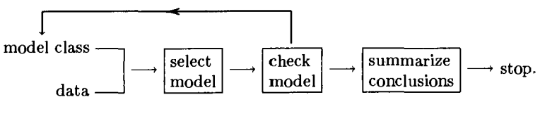
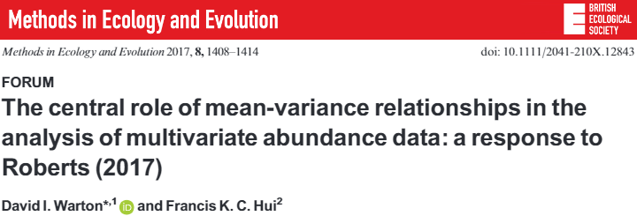
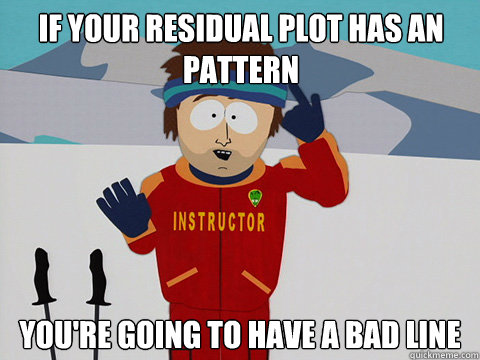
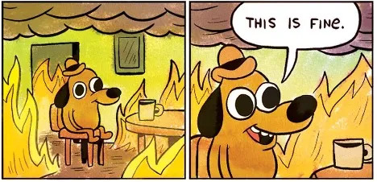

```{r setup, include=FALSE}
library(knitr)

default_source_hook <- knit_hooks$get('source')
default_output_hook <- knit_hooks$get('output')

knit_hooks$set(
  source = function(x, options) {
    paste0(
      "\n::: {.codebox data-latex=\"\"}\n\n",
      default_source_hook(x, options),
      "\n\n:::\n\n")
  }
)

knit_hooks$set(
  output = function(x, options) {
    paste0(
      "\n::: {.codebox data-latex=\"\"}\n\n",
      default_output_hook(x, options),
      "\n\n:::\n\n")
  }
)

knitr::opts_chunk$set(echo = TRUE)
library(gllvm)
TMB::openmp(parallel::detectCores()-1, autopar = TRUE, DLL = "gllvm")
```

# Outline

## Questions so far?

\center

{width=40%}

## Outline

- Defining a residual
- Residual plots for checking VGLM(M) assumptions
- Checking (prior) random effect assumptions
- Model-comparison

## Modeling checking



# Background 

## Assumptions

We have made various assumptions in the models we fitted so far:

1) Poisson/negative-binomial/binomial distributed responses (we could change to negative-binomial)
2) Correct link function, correct variance function
3) Same dispersion for species (move to vector GLM)
4) We have correctly specified the model structure (species-specific vs. common effects, autocorrelation)
5) Species responses are independent (move to JSDM, tomorrow)
6) No outliers

## Mean-variance



The mean-variance relationship has been one of the main drivers of model-based multivariate methods.

## Checking assumptions

Every method/model comes with assumptions. We need to check those to make sure our results are valid.

How do we check those?

## The linear model

Writing the (V)linear model:

\begin{equation}
y_i = \textcolor{red}{\alpha + \textbf{x}_i\symbf{\beta}} + \tikz[baseline,remember picture]{
              \node[anchor=base] (t1)
              {$\textcolor{blue}{\epsilon_i} \sim \mathcal{N}(0,\sigma^2)$}
}
                 \tikz[remember picture,overlay]{
    \draw[->] (t1.south)++(-.5ex,-5ex) to (t1);
    \node[xshift=-5ex, below=5ex] (t1.south) {This error is where we place our assumptions};
    } 
\end{equation}

\pause
\vspace{2\baselineskip}

We can use the the estimate of the error (residual) for assumption checking. This holds all information that is not included in our model.

\pause

\begin{center}
\textcolor{red}{Violated residual assumptions mean that some or all of your model's results are untrustworthy.}
\end{center}


## (V)Generalised linear model

\begin{equation}
\begin{aligned}
 g\{\mathbb{E}(y_i\vert x_i)\} &= \eta_i = \alpha + x_i\beta\\
 \mathbb{E}(y_i\vert x_i) &= g^{-1}(\eta_i) = g^{-1}(\alpha + x_i\beta)
 \end{aligned}
\end{equation}

\center

\textbf{VGLMs do not have an error term, checking is harder}

\textcolor{red}{But we still want to check in the same way}

# Residuals

## Response residuals

We could use the same residual as in linear regression:

$$\textcolor{blue}{\epsilon_i} = y_i - \textcolor{red}{\hat{\mu}_i}$$

But we do not expect these to look nice in (V)GLMs.

- Because the variance depends on the mean
- We want nice looking residuals when a model is good
- We want bad looking residuals otherwise

## (V)GLM residual

Even though we lack the $\epsilon_i$ term in (V)GLMs, we still calculate the residuals similarly

\pause

\begin{equation}
\hat{\epsilon_{i,pearson}} = \frac{y_i-\hat{\mu}_i}{\sqrt{\text{var}(y_i;\hat{\mu_i},\hat{\phi})}}
\end{equation}

\pause

\begin{equation}
\hat{\epsilon_{i,deviance}} = \text{sign}(y_i - \hat{\mu}_i)\sqrt{d_i}, \qquad \text{so that } \sum \limits^n_{i=1} \hat{\epsilon_{deviance,i}}^2
\end{equation}

\pause

\textbf{Approximately normally distributed in large samples}

\pause

\textbf{Still inappropriate for discrete data and small samples}


## In practice

In practice, both Pearson's and Deviance residuals are often non-normally distributed.

## Residual plots: residuals vs. fitted

```{r, eval=T,echo=F, out.width="40%", fig.align="center", fig.show="hold", warning=F, message=F}
par(mar=c(5,5,4,2))
mod <- lm(y1~x1,data=anscombe)
plot(residuals.lm(mod)~fitted(mod), data = anscombe, col="red", cex.lab=2, cex=2, cex.main=2, main="linear", pch=16, xlab="Fitted", ylab="Residuals")
text(5.7,1.2,"Good", cex=6,col="green")

lines(loess.smooth(y=residuals.lm(mod),x=fitted(mod)),col="red", lty="dashed", lwd=4)

mod <- lm(y2~x2,data=anscombe)
plot(residuals.lm(mod)~fitted(mod), data = anscombe, col="red", cex.lab=2, cex=2, cex.main=2, main="non-linear", pch=16, xlab="Fitted", ylab="Residuals")
lines(loess.smooth(y=residuals.lm(mod),x=fitted(mod)),col="red", lty="dashed", lwd=4)
text(5.5,0.7,"Bad", cex=6,col="red")

mod <- lm(y3~x3,data=anscombe)
plot(residuals.lm(mod)~fitted(mod), data = anscombe, col="red", cex.lab=2, cex=2, cex.main=2, main="outlier", pch=16, xlab="Fitted", ylab="Residuals")
lines(loess.smooth(y=residuals.lm(mod),x=fitted(mod)),col="red", lty="dashed", lwd=4)
text(5.5,2.5,"Bad", cex=6,col="red")

mod <- lm(y4~x4,data=anscombe)
plot(residuals.lm(mod)~fitted(mod), data = anscombe, col="red", cex.lab=2, cex=2, cex.main=2, main="outlier", pch=16, xlab="Fitted", ylab="Residuals")
lines(loess.smooth(y=residuals.lm(mod),x=fitted(mod)),col="red", lty="dashed", lwd=4)
text(7.5,1.3,"Bad", cex=6,col="red")

```

# Example 1

```{r echo=F, out.width = "70%", fig.align = "center"}
knitr:::
```


## Wetlands: residual diagnostics

```{r, echo = FALSE}
dat <- read.csv("../data/Wetlands.csv")
y <- dat[,tail(1:ncol(dat),14)]
X <- dat[,head(1:ncol(dat),-14)][,-1]
X$Hydro<-as.factor(X$Hydro)
X$Water_Type<-as.factor(X$Water_Type)
dat <- data.frame(y, X)
long <- reshape(dat, 
                    varying = colnames(y), 
                    v.names = "Count", 
                    idvar = "Site", 
                    timevar = "Species", 
                    direction = "long")

long$Species <- factor(long$Species, 
                           labels = colnames(y))
contr <- contr.sum(levels(long$Species))
```

We had this model:

\footnotesize

```{r pois}
model1 <- glm(Count~0+Species+NO3+NO3:Species, data = long, family = "poisson", contrasts = list(Species = contr))
```

\normalsize

With the following residual plot:

```{r plot1, echo = FALSE, fig.height = 5}
plot(model1, which = 1)
```

\vspace*{-2\baselineskip}

## Wetlands: residual diagnostics

We also had this model:

\footnotesize
 
```{r mod2}
model2 <- MASS::glm.nb(Count~0+Species + NO3:Species, 
             data = long)
```

\normalsize

With the following residual plot:

```{r plot2, echo = FALSE, fig.height = 5}
plot(model2, which = 1)
```

\vspace*{-2\baselineskip}


## Wetlands: residual diagnostics (species)

\footnotesize

```{r plot2b, fig.height = 6, echo = FALSE}
residuals <- residuals(model2)
stripchart(residuals ~ long$Species, vertical= TRUE, las =2, pch = 1, col = rainbow(ncol(y))[rep(1:ncol(y),times=nrow(y))])
```

\vspace*{-\baselineskip}

Clearly, not all these species have the same (residual) dispersion.

# (V)GLMM checking

```{r echo=F, out.width = "70%", fig.align="center"}
knitr:::
```

## Random effects

\begin{columns}
\column{0.6\textwidth}

\begin{equation}
 \tikz[baseline,remember picture]{
              \node[fill=blue!20,anchor=base] (t1)
              {$\textbf{y}$};
            } = 
              \tikz[baseline,remember picture]{
              \node[fill=purple!20,anchor=base] (t3)
              {$\textbf{X}\symbf{\beta}$};
            } + 
            \tikz[baseline,remember picture]{
             \node[fill=gray!20,anchor=base] (t4)
              {$\textbf{Z}\textbf{u}$};
            } + 
            \tikz[baseline,remember picture]{
             \node[fill=yellow!90!black,anchor=base] (t5)
              {$\textbf{e}$};
            }
   \tikz[remember picture,overlay]{
    \draw[->] (t4.south)++(0,-5ex) to (t4);
    \node[xshift=0, below=5ex] (t4.south) {Random effect};
    } 
\end{equation}

\column{0.4\textwidth}

```{r echo=F, out.width="90%", fig.align="center"}
knitr:::
```

\end{columns}

\vskip 0.5in 

\pause
\begin{center}
\textcolor{red}{Random effect estimates $\hat{\textbf{u}}$ have a very relation to the random effect $\textbf{u}$ as the residual $\hat{\symbf{\epsilon}}$ does for the error $\symbf{\epsilon}$.}
\end{center}

##  (V)GLMM residuals

### Conditional
\begin{equation}
\text{g}\{\mathbb{E}(y_{ij} \vert \textbf{x}_i)\} =               \tikz[baseline,remember picture]{
              \node[fill=purple!20,anchor=base] (t3)
              {$\textbf{x}_i^\top\hat{\symbf{\beta}}_j$};
            } + 
            \tikz[baseline,remember picture]{
             \node[fill=gray!20,anchor=base] (t4)
              {$\textbf{z}_i^\top\hat{\textbf{u}}_j$};
            }
\end{equation}

### Unconditional

\begin{equation}
\text{g}\{\mathbb{E}(y_{ij} \vert \textbf{x}_i)\} =  \tikz[baseline,remember picture]{
              \node[fill=purple!20,anchor=base] (t3)
              {$\textbf{x}_i\hat{\symbf{\beta}}_j$};
            } 
\end{equation}

\textbf{How do we calculate the residual?}

- should we condition on the estimate of the random effect?
- simulate from conditional distribution?

\textbf{i.e. a range of options}

## Randomized Quantile residual \tiny (Dunn and Smyth 1996) \normalsize

- Gold standard residual
- Better suited for small samples and discrete data types
- Exactly normally distributed
- Suitable for all kinds of models

### Continuous
\begin{equation}
r_Q = \Phi^{-1}\biggl\{\mathcal{F}\biggl(y_i;\hat{\mu_i},\hat{\phi}\biggr)\biggr\}
\end{equation}

```{r pgamma, eval=T, fig.align="center",out.width="30%", echo=F, warning=F,message=F, fig.show="hold"}
mu <- 2
y <- rpois(100,mu)

hist(qnorm(ppois(y,mu)), main="", cex.main=2, cex.lab=1.5, col="white", xlab="Normal deviates", ylab="")
hist(ppois(y, mu), main="", cex.main=2, cex.lab=1.5, col="white", xlab="Quantiles", ylab="")
```

## Packages that implement Quantile residuals

- You might have heard of \texttt{DHARMa} (Hartig 2024)
- \texttt{mvabund} (Wang et al. 2024)
- \texttt{gllvm} also implements  (conditional) Quantile residuals

## Simulation: grouping of errors

```{r poissim, eval=T, echo=T}
n <- 200
ngroups <- 4
alpha <- 0.5
beta <- -1
x <- rnorm(n, sd = 0.2)

fac<-rep(1:ngroups,each=n/ngroups)
e <- seq(from=-2,to=2,length.out=ngroups)
mu <- exp(alpha + beta*x + e[fac])
y <- rpois(n = n, lambda = mu)
```

## Example: Poisson residuals (grouping)

```{r poisr, eval=T, fig.align="center", echo=F, warning=F,message=F, fig.show="hold", out.width="70%"}
par(mar=c(5,5,4,2))

mod <- glm(y~x, family = "poisson")
mu <- predict.glm(mod, type = "response")

b <- ppois(y,mu)
a <- pmin(b,ppois(y - 1, mu))
quant.resid <- qnorm(runif(n,min=a,max=b))

mu <- predict.glm(mod,type="link")

plot(y=quant.resid, x=mu, main=expression(r[Q]), cex.lab=2, cex=2, xlab="Fitted values", cex.main=2, ylab="Residuals", col=fac, pch=fac, cex.main=4)
lines(loess.smooth(y=quant.resid,x=mu),col="red")
```

## Residual diagnostics: Poisson residuals (grouping)

\columnsbegin
\column{0.5\textwidth}

<!--should transform unconditional residuals due to correlation -->
```{r glmmresid31, eval=T, echo=F}
par(mar=c(5,5,4,2))
n <- 200
ngroups <- 4
alpha <- 0.5
beta <- -1
x <- rnorm(n, sd = 0.2)

fac<-rep(1:ngroups,each=n/ngroups)
e <- seq(from=-2,to=2,length.out=ngroups)
mu <- exp(alpha + beta*x + e[fac])
y <- rpois(n = n, lambda = mu)
library(glmmTMB)
dat <- cbind(y=y,x=x,group=fac)
mod <- glmmTMB(y~x+(1|group), family = "poisson", data = data.frame(dat))
# 
# # U-U
# mu <- glmmTMB:::predict.glmmTMB(mod, type = "response", re.form=NA)
# 
# b <- ppois(y,mu)
# a <- pmin(b,ppois(y - 1, mu))
# quant.resid <- qnorm(runif(n,min=a,max=b))
# 
# mu <- glmmTMB:::predict.glmmTMB(mod,type="link", re.form=NA)
# 
# plot(y=quant.resid, x=mu, main="U-U", cex.lab=2, cex=2, xlab="Fitted values (u)", cex.main=2, ylab="Residuals (u)", col=fac, pch=fac)

# C-U
mu <- glmmTMB:::predict.glmmTMB(mod, type = "response")

b <- ppois(y,mu)
a <- pmin(b,ppois(y - 1, mu))
quant.resid <- qnorm(runif(n,min=a,max=b))

mu <- glmmTMB:::predict.glmmTMB(mod,type="link", re.form=NA)

plot(y=quant.resid, x=mu, main="Conditional residual - Unconditional fitted", cex.lab=2, cex=2, xlab="Fitted values (u)", cex.main=2, ylab="Residuals (c)", col=fac, pch=fac)
# 
# # U-C
# mu <- glmmTMB:::predict.glmmTMB(mod, type = "response", re.form=NA)
# 
# b <- ppois(y,mu)
# a <- pmin(b,ppois(y - 1, mu))
# quant.resid <- qnorm(runif(n,min=a,max=b))
# 
# mu <- glmmTMB:::predict.glmmTMB(mod,type="link")
# 
# plot(y=quant.resid, x=mu, main="U-C", cex.lab=2, cex=2, xlab="Fitted values (c)", cex.main=2, ylab="Residual (u)", col=fac, pch=fac)

```
<!--- what if we misspecify the random effect -->

\column{0.5\textwidth}

```{r glmmresid31a, eval=T, echo=F}
# C-C
mu <- glmmTMB:::predict.glmmTMB(mod, type = "response")

b <- ppois(y,mu)
a <- pmin(b,ppois(y - 1, mu))
quant.resid <- qnorm(runif(n,min=a,max=b))

mu <- glmmTMB:::predict.glmmTMB(mod,type="link")

plot(y=quant.resid, x=mu, main="Conditional residual - conditional fitted", cex.lab=2, cex=2, xlab="Fitted values (c)", cex.main=2, ylab="Residuals (c)", col=fac, pch=fac)
```

\columnsend

##  GLMM: checking random effect assumptions

- random effect is a type of residual
- $\hat{u}_j$ is an estimate of the mean or mode of $p(u_j \vert y_i)$
- we treat $\hat{u}_j$ as a sample of the random effect distribution
- so we check assumptions (marginal normality, constant variance, independence, no outliers)!
- difficult with small number of groups
- needs to be done for every random effect

##  Simulation: GLMM (outlier)

```{r glmmresid34, eval=T, echo=T, fig.align="center", fig.show="hold", out.width="40%"}
n <- 200
ngroups <- 4
alpha <- 0.5
beta <- -1
x <- rnorm(n, sd = 0.2)

fac<-rep(1:ngroups,each=n/ngroups)
e <- seq(from=-2,to=2,length.out=ngroups)
e[4] <- 10
mu <- exp(alpha + beta*x + e[fac])
y <- rpois(n = n, lambda = mu)
```

##  GLMM diagnostics

```{r randomd, eval=T, echo=F, out.width='.49\\linewidth', fig.align="center", fig.show="hold"}
par(mar=c(5,5,4,2))

dat <- cbind(y=y,x=x,group=fac)
mod <- glmmTMB(y~x+(1|group), family = "poisson", data = data.frame(dat))

plot(sort(unlist(ranef(mod))),x=qnorm(ppoints(ngroups)), cex.lab=2, cex.axis=2, cex.lab=2, cex=2, cex.main=2, ylab="", xlab="Theoretical quantiles", main="Normal Q-Q")
abline(lm(quantile(unlist(ranef(mod)),c(0.25,0.75))~qnorm(c(0.25,0.75))), lwd=2,lty="dashed")

h <- hist(unlist(ranef(mod)), main="", cex.main=3, cex.lab=3, col=NULL, xlab="Random effect", ylab="", cex.axis = 2)
```

##  GLMM diagnostics

\columnsbegin
\column{0.5\textwidth}

```{r randomd2a, eval=T, echo=F}
par(mar=c(5,5,4,2))

#Unconditional
mu <- glmmTMB:::predict.glmmTMB(mod, type = "response", re.form=NA)

b <- ppois(y,mu)
a <- pmin(b,ppois(y - 1, mu))
a <- ifelse(a==1,1-1e-6,a)
quant.resid <- qnorm(runif(n,min=a,max=b))

plot(y=quant.resid, x=(1:4)[fac], main="Unconditional residual vs. group", cex.lab=2, cex=2, xlab="Group", cex.main=2, ylab="Residual", col=fac, pch=fac)
```

\column{0.5\textwidth}

```{r randomd2ab, eval=T, echo=F}
#Conditional
mu <- glmmTMB:::predict.glmmTMB(mod, type = "response")

b <- ppois(y,mu)
a <- pmin(b,ppois(y - 1, mu))
a <- ifelse(a==1,1-1e-6,a)
quant.resid <- qnorm(runif(n,min=a,max=b))

plot(y=quant.resid, x=(1:4)[fac], main="Conditional residual vs. group", cex.lab=2, cex=2, xlab="Group", cex.main=2, ylab="", col=fac, pch=fac)
```

\columnsend

## What if constant variance is violated

```{r randomd2b, eval=T, echo=T}
n <- 200
ngroups <- 4
alpha <- 0.5
beta <- -1
x <- rnorm(n, sd = 0.2)

fac<-rep(1:ngroups,each=n/ngroups)
e <- seq(from=-2,to=2,length.out=ngroups)
e[4] <- 10
e2 <- MASS::mvrnorm(1,rep(0,n), diag(rep(c(1,2,3,4),
                                         each=n/ngroups)))
mu <- exp(alpha + beta*x + e[fac] + e2)
y <- rpois(n = n, lambda = mu)
```

## GLMM diagnostics

\columnsbegin
\column{0.5\textwidth}

```{r randomd2, eval=T, echo=FALSE}
par(mar=c(5,5,4,2))
dat <- cbind(y=y,x=x,group=fac)
mod<-update(mod)
#Unconditional
mu <- glmmTMB:::predict.glmmTMB(mod, type = "response", re.form=NA)

b <- ppois(y,mu)
a <- pmin(b,ppois(y - 1, mu))
a <- ifelse(a==1,1-1e-6,a)
quant.resid <- qnorm(runif(n,min=a,max=b))

plot(y=quant.resid, x=(1:4)[fac], main="Unconditional residual vs. group", cex.lab=2, cex=2, xlab="Group", cex.main=2, ylab="Residual", col=fac, pch=fac)
```

\column{0.5\textwidth}

```{r randomd2ab2, eval=T, echo=F}
# Conditional
mu <- glmmTMB:::predict.glmmTMB(mod, type = "response")

b <- ppois(y,mu)
a <- pmin(b,ppois(y - 1, mu))
a <- ifelse(a==1,1-1e-6,a)
quant.resid <- qnorm(runif(n,min=a,max=b))

plot(y=quant.resid, x=(1:4)[fac], main="Conditional residual vs. group", cex.lab=2, cex=2, xlab="Group", cex.main=2, ylab="", col=fac, pch=fac)
```

\columnsend

## Residual checking for mixed effects models

- Check assumptions
  - Use both conditional and marginal residuals
  - Have a look at the \href{https://cran.r-project.org/web/packages/DHARMa/vignettes/DHARMa.html}{\texttt{DHARMa} vignette}
- Correct violations

\begin{center}
\textcolor{red}{Violation of some assumptions might be OK}
\end{center}


# Example 2

```{r swiss, echo = FALSE}
library(gllvm)
invisible(TMB::openmp(parallel::detectCores()-1,autopar=TRUE,DLL="gllvm"))
avi_dat <- read.csv('../data/SwissBirds.csv')
y <- as.matrix(avi_dat[,1:56])
X <- avi_dat[,-c(1:56)]
X <- X[rowSums(y)>0, ]
y <- y[rowSums(y)>0,]
X<-X[,-which(apply(X,2,anyNA))]
X <- data.frame(sapply(X,function(x)if(is.numeric(x)){scale(x)}else{x}, simplify = FALSE))
```

We had this model:

\footnotesize

```{r mod3, cache = TRUE}
model3 <- gllvm(y, X = X, formula = ~(slp+asp|1), 
                family = "binomial", num.lv = 0, beta0com = TRUE)
```

Let's compare it to:

\footnotesize

```{r, mod4, cache = TRUE}
model4 <- gllvm(y, X = X, formula = ~(asp|1), 
                row.eff = ~slp+asp, studyDesign = X,
                family = "binomial", num.lv = 0, beta0com = TRUE)
```

and perhaps

\footnotesize

```{r, mod5, cache = TRUE}
model5 <- gllvm(y, X = X, formula = ~(asp|1), 
                family = "binomial", num.lv = 0, beta0com = TRUE)
```

## Example 2: residuals

The residuals of all three look OK (but perhaps the last looks best):

```{r, echo  =FALSE, fig.height = 7}
par(mfrow=c(2,3))
plot(model3, which = 2)
plot(model4, which = 2)
plot(model5, which = 2)
plot(model3, which = 1)
plot(model4, which = 1)
plot(model5, which = 1)
```

## Example 2: the models

The ecological assumptions of the models are a little different:

1) The first model assumes correlated species-specific responses to aspect and slope
2) The third model assumes species' responses to slope are the same
3) The third model assumes no responses to slope at all

So complexity is 1) > 2) > 3)

The models are nested, so we can use a hypothesis test, or information criteria, for comparison.

## Example 2: comparison

\tiny
```{r}
anova(model4, model5) # model with mean slope effect is "better"
```

```{r}
anova(model3, model4) # Model with slope REs is "better"; note null on the boundary
```

But, anova assumes (a.o.) that the null is *not* on the boundary.

## Example 2: examining the REs

\footnotesize

```{r, fig.height = 6}
qqnorm(coef(model3,"Br")["slp",])
qqline(coef(model3, "Br")["slp",])
```

Some outliers; this might affect the variance estimate. \newline
We might want to consider adjusting the model (e.g., add covariates, change link function).

## Example 2: examining the REs

\tiny

```{r mod6, cache = TRUE, fig.height = 6}
model6 <- gllvm(y, X = X, formula = ~(slp+bio_1+TE_canopy|1), family = "binomial", num.lv = 0, beta0com = TRUE)
qqnorm(coef(model6,"Br")["slp",])
qqline(coef(model6, "Br")["slp",])
```

After adjusting the model, the REs look a bit better.

<!-- model-selection, confidence intervals, tests? -->

<!-- hypothesis test is conservative when the null is on the boundary (when there is no random effect; variance is zero. FAQ BB, so inflated Type I/II error) -->
<!-- - wald tests are then also unreliable -->
<!-- - do not consider significance of random effects? -->

## Example 2: information criteria

```{r}
AIC(model3, model6) # lower is "better"
AICc(model3, model6)
BIC(model3, model6)
```

\footnotesize

Note: we should not combine hypothesis testing and information criteria. Here just for demonstration. \newline

Information criteria is subject to the same boundary issues as LRT is.

## Example 2: summary

\tiny

```{r mod6s, echo = FALSE}
summary(model6)
```

\footnotesize

Wald-statistic relies on large sample asymptotics, is subject to numerical issues, and lack of "quadraticness" of the likelihood

# Model comparison

{height=70%}

So, there are some more things we need to think about, besides formulating the model.

## Likelihood ratio test 

Is improved fit due to noise or is the alternative model actually better?

Procedure

- Fit two models: $M_0$ with $k$ parameters and $M_1$ with $r$
- Calculate likelihood ratio $\Lambda = \log\biggl(\frac{\mathcal{L}(\textbf{y};\Theta_0)_{M_0}}{\mathcal{L}(\textbf{y};\Theta_1)_{M_1}}\biggr)$
- $\mathcal{L}(\textbf{y};\Theta_0)_{M_0} \leq \mathcal{L}(\textbf{y};\Theta_1)_{M_1}$
- $-2\Lambda \sim \mathcal{\chi}^2(k_1-k_0)$ under the null
- $p\geq0.05$ difference in likelihood is due to sampling

## LRT approximation assumptions

- $n\to\infty$
- $\Theta_0$ contained in $\Theta_1$: nested models
- The true parameter is in the interior of the parameter space
- Model is "identifiable"
- Hessian matrix is sufficiently close to the Fisher information
- $y_i$ are independent

\textbf{These assumptions may fail, especially in models more complex than VGLMs} \newline
Alternatively: LRT by simulation.

## Boundary issues

Variances $\sigma^2$ are positive only. If we compare to a model without random effect, it is like saying $\sigma^2=0$, so that it is "on the boundary".

And, the sampling distribution often has a spike at zero.

## Boundary issues: example


```{r, echo = FALSE, fig.height = 6}
# Set parameters
set.seed(123)           # For reproducibility
n <- 10000              # Number of samples
df <- 3                 # Degrees of freedom for the chi-squared distribution
mass_at_0 <- 0.5        # Probability mass at 0
weight_chisq <- 1 - mass_at_0  # Weight of chi-squared distribution

# Generate the mixture distribution
samples <- numeric(n)

for (i in 1:n) {
    if (runif(1) < mass_at_0) {
        # Mass at 0
        samples[i] <- 0
    } else {
        # Sample from a chi-squared distribution
        samples[i] <- rchisq(1, df)
    }
}

# Plot the histogram of the sampled data
hist(samples, probability = TRUE, breaks = 50, col = "gray", 
     main = "Mixture of Chi-squared Distribution with Mass at 0 and 3", 
     xlab = "Value", ylab = "Density")

# Add the density of the chi-squared distribution for comparison
x_vals <- seq(0, max(samples), length.out = 100)
chisq_density <- dchisq(x_vals, df)
lines(x_vals, weight_chisq * chisq_density, col = "red", lwd = 2, lty = "dashed")

# Add the mass at 0 as a vertical line
abline(v = 3, col = "orange", lwd = 2, lty = 2)
```

So two things can happen: we can be too optimistic (test on the boundary) or too conservative (due to mass at 0), either how it is not pretty.


## Wald-statistic

The wald-statistic is reported in `summary`: 

\begin{equation}
W = (\hat{\theta}-\theta)^2/var(\hat{\theta})
\end{equation}

we test if the parameter estimate is different from zero. For this, we make the following assumptions:

- We have a good estimate of the standard error
- The estimator is normally distributed (large samples)
- The estimator is centered around the true parameter

## Information criteria

A different paradigm:\newline
Find the best model amongst a set of models.

Best:

- Penalise complexity (number of parameters)
- By fit (likelihood)

Most commonly:

1) AIC: Akaike's Information Criterion \footnotesize (Akaike 1974) \normalsize
2) BIC: Bayesian Information Criterion \footnotesize (Schwarz 1978) \normalsize

\center

\textbf{Lower = better}

## Akaike's Information Criterion

\begin{equation}
\text{AIC} = -2\mathcal{L}(\textbf{y};\Theta)+2k
\end{equation}

- Penalizes model complexity
- (approximately) Measures information loss to the true data generating process
- Asymptotically

AIC tends to select too complex models with little data. Finite sample correction (Sugiura 1978):
\begin{equation}
\text{AIC}_\text{c} = \text{AIC}+\frac{2k(k+1)}{n-k-1}
\end{equation}

\center 

\textbf{Find the model that predicts best}

## Bayesian Information Criterion

\begin{equation}
\text{BIC} = -2\mathcal{L}(\textbf{y};\Theta)+k\log(n)
\end{equation}

So the penalty is different. \newline 

\center

\textbf{Find the model closest to the "true" model}

## Connection of AIC and LRT

Rule of thumb: difference of 2 points means a model is better

\begin{equation}
\begin{aligned}
\Delta\text{AIC} =&  \text{AIC}_{M_1}-\text{AIC}_{M_0}\\
&=  2\mathcal{L}(\textbf{y};\Theta_0) - 2\mathcal{L}(\textbf{y};\Theta_1) + 2k_1 - 2k_0\\
&=  -2\Lambda + 2(k_1-k_0)
\end{aligned}
\end{equation}

\textbf{So AIC with a rule of \delta = 2 can be seen as a more liberal LRT} \footnotesize (Sutherland et al. 2023) \normalsize

## The cult of (A)IC

[Presentation by Mark Brewer](https://www.youtube.com/watch?v=lEDpZmq5rBw)

\textbf{"Always use (A)IC for model comparison"}

\columnsbegin
\column{0.5\textwidth}
My perspectives

- Use common sense
- Do not blindly test all models ("dredging")
- Use model comparison techniques in moderation

\column{0.5\textwidth}


\columnsend

\textbf{Don't take the "best" model paradigm too seriously}

## Freedman's paradox

Just by chance, predictors with no relationship to the response will be selected.

# Convergence

All of this assumes our model has converged. If the model has not converged, it may not be valid in any way.

\pause

```{r echo=F, out.width="50%",fig.show="hold",fig.align="center"}

```

see [Ben Bolker's GLMM FAQ](https://bbolker.github.io/mixedmodels-misc/glmmFAQ.html), [\texttt{lme4} page on performance](https://cran.r-project.org/web/packages/lme4/vignettes/lmerperf.html), and [the \texttt{glmmTMB} troubleshooting vignette](https://cran.r-project.org/web/packages/glmmTMB/vignettes/troubleshooting.html)

## Maximum Likelihood Estimation

At the maximum of the likelihood:

- The gradient is zero (tangent is straight)
- The hessian (of -LL) should
  - have positive diagonals
  - positive eigenvalues
  - be symmetric
  - and is thus invertible (we go up in both directions)
- Asymptotic covariance matrix is given by the inverse of the negative Hessian

\begin{center}
\textcolor{red}{These are important concepts to understand error messages and convergence in mixed-models.}
\end{center}

\pause

\footnotesize

Note: the method we use for estimating the model (optimisation) also makes assumptions.

## Assessing arrival at the MLE

\begin{enumerate}
\item Stopping criteria
\begin{itemize}
\item Maximum iterations
\item Gradient close to zero
\item Relative criterion: objective function value improvement
\item Absolute criterion: objective function becomes zero (say)
\end{itemize}
\item Gradient
\item Hessian
\end{enumerate}

## \texttt{lme4} warnings: hessian

\footnotesize

\begin{itemize}
\item \texttt{Warning: Problem with Hessian check (infinite or missing values?)}
\item \texttt{Warning: Hessian is numerically singular: parameters are not uniquely determined}
\item \texttt{Warning: Model failed to converge: degenerate Hessian with 2 negative eigenvalues}
\item \texttt{Warning: Model is nearly unidentifiable: very large eigenvalue - Rescale variables?}
\item \texttt{Warning: Model is nearly unidentifiable: very large eigenvalue ratio - Rescale variables?}
\end{itemize}

<!--- eigendecomp failed-->
<!-- cholesky doesnt work on hessian or zero eigenvalues-->
<!-- - small or negative eigenvalues-->
<!-- - max(eigval) / min(eigval) ")-->
<!-- #min(eigval)/max(eigval)is very small-->
\pause

\textcolor{red}{The most warning you will get in \texttt{gllvm} is a "sd.errors could not be calculated, due to singular fit".}

\normalsize

## Singular matrix

- determinant is zero
  - has zero eigenvalue(s)
- does not have inverse

\begin{equation}
\textbf{H} \textbf{A} = \textbf{I}
\end{equation}

## Numerical optimisation: best practices

1. Standardise (center and scale) explanatory variables
2. Try different optimisation routines
3. \textcolor{red}{Different starting values}
4. Carefully consider your model structure

## Mixed-effects model troubleshooting

see \href{https://bbolker.github.io/mixedmodels-misc/glmmFAQ.html}{Ben Bolker's GLMM FAQ}

- Check data for mistakes
- Check model formulation
  - correct distribution and link-function
  - few random effects levels
  - few (non-zero) observations in a category
  - overly complex: drop terms with zero variances
- Double-check hessian calculation (finite differences)
- Use random effect as fixed effect instead (few levels)

\begin{itemize}
\item `?lme4::convergence` (and see the last line "convergence issues" for large datasets)
\end{itemize}

## Difficult things

Everything gets more difficult when we use mixed-effects models:

- Residuals are harder to define
- We should test extra (random effect) assumptions
- Wald-statistic and p-values no longer (really) apply
- Hypothesis test does not always work well (on the boundary)
- Model selection does not usually work well (boundary issues, number of parameters is hard to define)

\pause

\textcolor{red}{And even more so for VGLMMs}

## Crisis

- Inference in GLMMs can be difficult
- Use "ordinary" regression tools with caution



## Take away tips

\begin{center}
\textcolor{red}{\href{https://en.wikipedia.org/wiki/No_free_lunch_theorem}{No free lunch in statistics}}
\end{center}

- There are some technical considerations
  - Predictor scaling
  - Convergence
  - How to safely use tools at your disposal
- Keep your model as simple as possible, but not simpler
- Take warnings seriously and check convergence
- Different packages have different ways of dealing with these issues
  - \texttt{gllvm} vs. \texttt{glmmTMB} vs. \texttt{lme4}
- Always check (residual) assumptions

# End

\center

{width=75%}