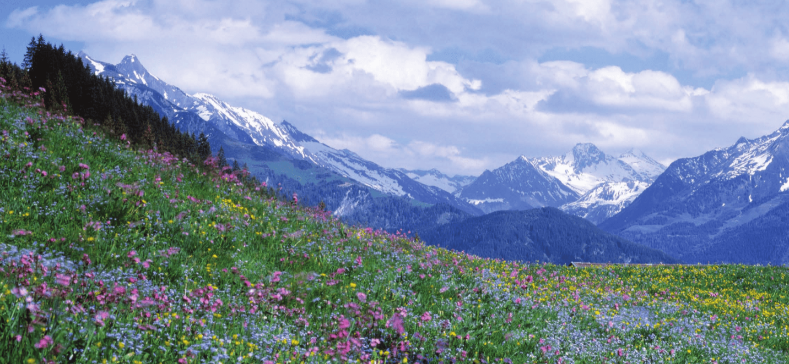

```{r setup, include=FALSE}
library(knitr)

default_source_hook <- knit_hooks$get('source')
default_output_hook <- knit_hooks$get('output')

knit_hooks$set(
  source = function(x, options) {
    paste0(
      "\n::: {.codebox data-latex=\"\"}\n\n",
      default_source_hook(x, options),
      "\n\n:::\n\n")
  }
)

knit_hooks$set(
  output = function(x, options) {
    paste0(
      "\n::: {.codebox data-latex=\"\"}\n\n",
      default_output_hook(x, options),
      "\n\n:::\n\n")
  }
)

knitr::opts_chunk$set(echo = TRUE)
```

# Outline

- Fourth corner
- Phylogenetic

## Questions so far?

\center

{width=40%}

## The model so far

So far, we have studied species' environment responses (niches) with the model:

\begin{equation}
\eta_{ij} = \beta_{0j} + \textbf{x}_i^\top\symbf{\beta}_j + \textbf{z}_i^\top\textbf{u}_j
\end{equation}

where:

- $\textbf{x}_i$ are the covariates
- $\symbf{\beta}_j$ are the fixed effects
- $\textbf{z}_i$ are also covariates
- $\textbf{u}_j$ are random effects

This helps us understand __what environmental conditions species prefer__.

# The 4th corner

## The more interesting question

Taking it a step further, we might want to answer instead:

__Why do species prefer certain environmental conditions?__

But what makes species prefer certain environments?

## Trait-environment relationship

```{r teplot, echo = FALSE, dev = "png", fig.show = "hide", warning=FALSE, fig.height = 5}
# Load libraries
library(ggplot2)

x_vals <- seq(-10, 30, length.out = 300)

suitability1 <- dnorm(x_vals, mean = 1, sd = 2.5)  # e.g., cold environment
suitability2 <- dnorm(x_vals, mean = 15, sd = 4)  # e.g., warm environment

# Create a data frame
df <- data.frame(
  x = rep(x_vals, 2),
  suitability = c(suitability1, suitability2),
  species = factor(rep(c("Species one", "Species two"), each = length(x_vals)))
)

# Plot
ggplot(df, aes(x = x, y = suitability, color = species)) +
  geom_line(linewidth = 1.2) +
  labs(x = "Temperature gradient",
    y = "Suitability"
  ) +
  scale_color_manual(values = c("Species one" = "firebrick", "Species two" = "steelblue")) +
  theme_minimal(base_size = 14)+guides(color = "none")

```

\alt<2>{
\columnsbegin
\column{0.3\textwidth}
\includegraphics{coldplant.jpg}
\column{0.3\textwidth}
\includegraphics{HierarchicalResponses_files/figure-beamer/teplot-1.png}
\column{0.3\textwidth}
\includegraphics{oxalis.jpg}
\columnsend
}{\includegraphics{HierarchicalResponses_files/figure-beamer/teplot-1.png}}

## Fourth corner analysis

\begin{tikzpicture}[
node distance = 5mm,
 inbox/.style = {rectangle, draw, rounded corners,
                 minimum height=18mm, minimum width=32mm ,
                 align=center, inner xsep=6mm, inner ysep=3mm},
outbox/.style = {rectangle, draw=red, densely dashed, rounded corners,
                 inner xsep=3mm, inner ysep=3mm}
                    ]
\node (inner1) [inbox, fill = olive!50!green!40!] {\includegraphics[width=0.1\paperwidth]{beetle.png}};
\node (inner3) [inbox, right=of inner1, fill = blue!80!darkgray!40] {\includegraphics[width=0.1\paperwidth]{wind.png}};
\node (inner2) [inbox, below=of inner1, fill = yellow!30!red!20] {\includegraphics[width=0.1\paperwidth]{wing.png}};
\visible<1>{
    \node (innera) [below=of inner3, right=of inner2] {\vbox {
    \begin{itemize}
    \item $\textbf{Y}$: community data
    \item $\textbf{X}$: environmental variables
    \item $\textbf{TR}$: species traits
    \end{itemize}
}};
}
\visible<2>{
\node (outer1) [outbox, fit = (inner1) (inner3)] {};
   \draw[->,thick] ([yshift=-9mm, xshift = 3mm]inner3.north west) -- ([yshift=-9mm, xshift = -3mm]inner1.north east);
    \node (innerb) [below=of inner3, right=of inner2] {\vbox {
    \begin{itemize}
    \item Species-environment relationship
    \item GLM or CO
    \end{itemize}
}};
}

\only<3>{
\node (outer1) [outbox, fit = (inner1) (inner2)] {};
   \draw[->,thick] ([xshift=-16mm, yshift =-3mm]inner2.north east) -- ([yshift=3mm, xshift = -16mm]inner1.south east);
    \node (innerc) [below=of inner3, right=of inner2] {\vbox {
    \begin{itemize}
    \item Site-trait relationship
    \item GLM or CO \footnotesize (transpose the data)
    \end{itemize}
}};
}
\visible<4>{
\draw[outbox, draw = blue] ([yshift=3mm, xshift=-3mm, ]inner1.north west) -- ([yshift=3mm, xshift=3mm]inner3.north east)
   -- ([yshift=-3mm, xshift=3mm]inner3.south east) -- ([yshift=-3mm]inner3.south west)
   -- ([yshift=2mm, xshift=3mm]inner2.north east) -- ([yshift=-3mm, xshift=3mm]inner2.south east) 
   -- ([yshift=-3mm, xshift=-3mm]inner2.south west) -- cycle;
   
   \node (inner4) [inbox, below=of inner3, fill = purple!20] {$\textbf{???}$};
   
   \draw[->,thick] ([yshift=-9mm, xshift = 3mm]inner3.north west) -- ([yshift=-9mm, xshift = -3mm]inner1.north east);
   \draw[->,thick] ([xshift=-16mm, yshift =-3mm]inner2.north east) -- ([yshift=3mm, xshift = -16mm]inner1.south east);
   
   \draw[->,thick] (inner3.south) -- (inner4.north);
   \draw[->,thick] (inner2.east) -- (inner4.west);

   \draw[->,thick] ([xshift = 3mm, yshift = -3mm]inner4.north west) -- ([yshift=3mm, xshift=-3mm]inner1.south east);
   \node (innera) [right=of inner4, yshift=3mm] {\includegraphics[scale=0.2]{the_4th.jpg}};
}
\end{tikzpicture}

## History of the $4^\text{th}$ corner

\tiny also referred to as RLQ-analysis \normalsize

For a long time, 4th-corner analysis was a recurring problem

- Traditionally solved by ordination \footnotesize Legendre et al. 1997, Dolédec et al. 1996) \normalsize
- Environment-trait effects are tested with permutation \footnotesize (Dray and Legendre 2008, ter Braak et al. 2012) \normalsize
- Statistical models can tackle the problem \footnotesize (Jamil et al. 2012, Brown et al. 2014) \normalsize
- Dray et al. (2014) think the two complementary
- ter Braak et al. (2018) introduce a doubly constrained ordination method
- GLM-based methods have inflated error \footnotesize (ter Braak et al. 2017) \normalsize
- Ovaskainen et al. (20177), Niku et al. (2021) combine with random effects (JSDM)

## Often used trait-based analysis

\begin{columns}
\begin{column}{0.6\textwidth}
\begin{enumerate}
\item RLQ \footnotesize Doledec et al. (1996) \normalsize
\item CWM + RDA
\item Double constrained ordination \footnotesize Lebreton et al. (1988), ter Braak et al. (2018) \normalsize
\item Fourth corner LVMs \footnotesize Ovaskainen at al. (2017), Niku et al. (2021) \normalsize
\end{enumerate}
\end{column}
\begin{column}{0.4\textwidth}

```{r echo=F, fig.align="center", fig.cap="Quadriplot \\newline \\footnotesize \\textit{ter Braak et al. (2018)} \\normalsize", dpi=300, out.width="99%"}
knitr:::include_graphics("quadriplot.jpg")
```
\end{column}
\end{columns}

<!-- ##  -->

<!-- McGill (2006) argued that functional traits should be central to community ecology. -->


## Intraspecific trait variation: snowshoe hare example

 \footnotesize Intraspecific variation is ignored. Is there such a thing as "species traits"?
 
 \columnsbegin
 \column{0.4\textwidth}
 
 \begin{figure}
 \includegraphics{snowshoe1.jpeg}
 \caption{\href{https://www.pnas.org/doi/full/10.1073/pnas.1222724110}{Mills et al. 2013}}
 \end{figure}

\column{0.6\textwidth}

\pause

 \begin{figure}
 \includegraphics{snowshoe2.png}
 \caption{\href{https://onlinelibrary.wiley.com/doi/10.1111/ele.12568}{Zimova et al. 2016}}
 \end{figure}
 
\columnsend

# Example 1

## Example: trait-environment GLM (no REs)


Traits can enter the model "just" as an interaction. That is the model we will explore here, first:

\begin{equation}
\eta_{ij} = \beta_{0j} + \textbf{x}_i^\top\symbf{\beta}_x + \textbf{x}_i^\top\textbf{B}_{x,tr}\textbf{tr}_j
\end{equation}

- $\symbf{\beta}_{x}$ are the species-common effects
- $\textbf{B}_{x,tr}$ are the environment-trait interaction coefficients

## Example: alpine plants in France

```{r ex1, echo = FALSE, message = FALSE, fig.align = "center"}
Y <- read.csv("../data/alpine2Y.csv")[,-1]
X <- read.csv("../data/alpine2X.csv")[,-1]
X <- X[rowSums(Y)>0, ]
Y <- Y[rowSums(Y)>0,]
X <- scale(X[,c(1,2,3,4,6)])
TR <- read.csv("../data/alpine2TR.csv")[,-1]
TR <- TR[colSums(Y)>0,]
Y <- Y[,colSums(Y)>0]
library(gllvm)
library(corrplot)
```

- Data by [Choler 2005](https://www.tandfonline.com/doi/full/10.1657/1523-0430%282005%29037%5B0444%3ACSIAPT%5D2.0.CO%3B2)
- Occurrence of 92 species at 75 5 by 5 plots
- 6 environmental variables: aspect, slope, microscale landform, disturbance level (physical and trampling/burrowing), and mean Julian snowmelt date
- 7 traits: height, spread, angle, area, thick, sla, N_mass, seed
- In [the jSDM package](https://ecology.ghislainv.fr/jSDM/index.html)

{width=75%}

## Example: Fitting a $4^\text{th}$-corner VGLM

First recall, the VGLM:

\footnotesize

```{r}
model1 <- gllvm(Y, X, 
                formula = ~Aspect + Slope, 
                family = "binomial", num.lv = 0)
```


The model with traits:

\footnotesize


```{r}
model2 <- gllvm(Y, X, TR, 
                formula = ~Aspect + Slope + (Aspect + Slope) : (Height + SLA), 
                family = "binomial", num.lv = 0)
```

## Example: species responses

Compared to the (without traits) VGLM, species responses:

- have a common component: $\symbf{\beta}_x$ (recall from yesterday)
- have a trait component: $\textbf{tr}_j^\top\textbf{B}_{x,tr}$ 

so we can write: $\symbf{\beta}_j = \symbf{\beta}_{x} + \textbf{tr}_j^\top\textbf{B}_{x,tr}$

Extracting the coefficients:
\footnotesize 
```{r trait1a}
B <- (coef(model2, "B"))
Bx <- B[1:2]
Bxtr <- matrix(B[-c(1:2)], ncol = 2, byrow =  TRUE)
beta <- Bx + model2$TR%*%Bxtr
```

You can also get $\hat{\textbf{B}}_{x,tr}$ via `gllvm:::getFourthCorner(model2)`

## Example: examining statistical significance

\tiny
```{r, echo = FALSE}
summary(model2)
```

## Example: fourth-corner interpretation

```{r, echo = FALSE}
Bx
```

\footnotesize

__On average__ Aspect (north, south, west, flat) decreases the probability occurrence and Slope increases it.

\normalsize

```{r, echo = FALSE}
row.names(Bxtr) <- colnames(model2$X);colnames(Bxtr)<-colnames(model2$TR)
Bxtr
```

\footnotesize

High plants with thin leaves occur more in flat areas, and small plants with thick leaves least. \newline
High plants with thick leaves occur more in steep places, while small plants with thin leavs occur more in flat places.

\tiny (but there is only enough evidence for slope and slope:SLA) to conclude an effect; thicker leaves in steep places

## Example: species responses results (coefplot)

\columnsbegin
\column{0.5\textwidth}
\textbf{No traits}

```{r trait1c, echo = FALSE, fig.height = 12}
coefplot(model1, order = FALSE, mar = c(5,4,4,2))
```

\column{0.5\textwidth}
\textbf{With traits}

```{r trait1d, echo = FALSE, fig.height = 12}
# calculating confidence intervals beta from trait model
covb <- model2$Hess$cov.mat.mod[-c(1:ncol(Y)),-c(1:ncol(Y))]
C <- cbind(1,1,model2$TR, model2$TR)
sumvec <- c(1,0,1,1,0,0)
varb <- (C%*%covb*C)%*%t(rbind(sumvec, 1-sumvec))
UI <- beta + qnorm(0.975)*sqrt(varb)
LI <- beta + qnorm(1-0.975)*sqrt(varb) 

par(mfrow=c(1,2))
for(i in 1:2){
col.seq <- rep("black", ncol(Y))
col.seq[LI[,i] < 0 & UI[,i] > 0] <- "grey"
plot(beta[,i], 1:ncol(Y), yaxt = "n", xlab = colnames(model2$X)[i], xlim = range(c(UI[,i],LI[,i])), ylab = NA, pch = "x", cex.lab = 1.3, col = col.seq)
segments(x0 = LI[,i], y0 = 1:ncol(Y), x1 = UI[,i], y1 = 1:ncol(Y), col = col.seq)
abline(v = 0, lty = 1)
axis(2, at = 1:ncol(Y), labels = colnames(Y), las = 1, cex.axis = 0.5)
}
```

\columnsend

## Example: comparison

\footnotesize
 
```{r}
anova(model1, model2)
```

There are a lot more "free" parameters in the VGLM. The second model is either "constrained", or alternative; we provide is (much) more information.

# Hierarchical responses

The model we implemented has one main limitation: it assumes species environmental responses are fully determined by the traits. But what if we measure the wrong traits?

We can extend our model to incorporate "residual" information on species responses:

$\symbf{\beta}_j = \symbf{\beta}_{x} + \textbf{tr}_j^\top\textbf{B}_{x,tr} + \textbf{b}_j$

with $\textbf{b}_j \sim \mathcal{N}(\textbf{0}, \symbf{\Sigma}_r)$ so that  $\symbf{\beta}_j \sim \mathcal{N}(\symbf{\beta}_x + \textbf{tr}_j^\top\textbf{B}_{x,tr})$

this is much more similar to our VGLM, except that we now have a VGLMM with traits.

##  The full fourth corner model

\begin{equation}
\eta_{ij} = \beta_{0j} + \textbf{x}_i^\top(\tikzmarknode{t1}{\symbf{\beta}_x} + \tikzmarknode{t2}{\textbf{b}_j}) + \tikzmarknode{t4}{\textbf{tr}_j^\top} \tikzmarknode{t3}{\textbf{B}_{xtr}}\textbf{x}_i
\end{equation}

\begin{itemize}
\item \tikzmarknode{n1}{$\symbf{\beta}_x$ community effects}
\item \tikzmarknode{n2}{$\textbf{b}_j$ species-specific random effects}
\item \tikzmarknode{n3}{ $\textbf{B}_{xtr}$ 4th-corner coefficients }
\end{itemize}

\begin{tikzpicture}[overlay,remember picture]
        \draw[->] (t1) -- ([yshift=0.3cm]t1.north) -| ([xshift = -0.8cm]n1.west) |- ([xshift = -0.5cm]n1.west);
        \draw[->] (t2.south) |- (n2.east);
        \draw[->] ([xshift=-0.1cm]t3.south) |- (n3.east);
        \draw[->] (t4.north) -- ++ (0,1) node[above] {Traits};
\end{tikzpicture}

\pause

So, if $\symbf{\Sigma}\approx\textbf{0}$, there is no (excess) species-specific variation in responses.

## Testing trait-environment interactions

A lot of attention has gone to testing environment-trait interactions.

Niku et al. (2021) concluded that omitting $\textbf{b}_j$ leads to inflated Type I  error (over optimistic conclusions w.r.t traits).

\pause

Main issue: the model becomes \textbf{much} slower.

# Community Phylogenetics

## Trait evolution

Traits develop by selection: you develop a trait if it increases your survival

- Related species might be similar
- Their evolutionary divergence is more recent, so less time to develop different characteristics
- Also in the environment, we might expect to see them in the same place


```{r, echo = FALSE, fig.height = 4}
plot(ape::rtree(12))
```

## Brownian motion

\footnotesize

At time $t$ our species $j$ has the trait $tr^t_{j,k}$ given by the equation: $tr^t_{j,k} = tr^{t-1}_{j,k} + \epsilon_k^t \sim \mathcal{N}(0, \sigma^2_k)$ with covariance of the tips proportional to the shared branch length.

\vspace*{-2\baselineskip}

```{r, echo = FALSE, fig.height = 6}
# courtesy of http://blog.phytools.org/2012/08/discrete-time-brownian-motion.html
# discrete time BM simulation
n<-30; t<-100; sig2<-1/t # set parameters
time<-0:t
X<-rbind(rep(0,n),matrix(rnorm(n*t,sd=sqrt(sig2)),t,n))
Y<-apply(X,2,cumsum)
plot(time,Y[,1],ylim=range(Y),xlab="Time",ylab="Trait", type="l")
apply(Y,2,lines,x=time)
```


\tikzset{
  mybox/.style={
    draw=red,
    very thick,
    rectangle,
    rounded corners,
    inner sep=10pt,
    fill = white,
    fill opacity = 0.8,
    text width = 0.8\paperwidth
  }
}
\only<2>{
\begin{tikzpicture}[remember picture, overlay]
\node[mybox] at (current page.center){We assume the rate of evolution is stable over time.};
\end{tikzpicture}
}

## Competitive exclusion

{width=50%}

Species can (stably) co-occur, if they segregate their resource use.

## Phylogenetic random effects

- In the 4th corner model $\textbf{b}_j$ cab be structured by Phylogeny
- More closely related species have similar responses to the environment

\vspace*{2\baselineskip}
\centering
\textcolor{red}{The Phylogeny provides more information and makes for more accurate estimation}

\tiny (and we can predict for species without data)

## Phylogenetic random effects

Here I will omit traits for brevity. So our model is:

\begin{equation}
\symbf{\eta} = \textbf{1}\beta_{0j}^\top + \textbf{X}\textbf{B}
\end{equation}

- Now, $\textbf{B}$ are the species random slopes for covariates
- In the simplest case we assume $\textbf{B} \sim \mathcal{N}(\textbf{0}, \symbf{\Sigma}_m \otimes \symbf{\Sigma}_r)$
- $\symbf{\Sigma}_r$ covariance matrix of random effects \footnotesize ("traits") \normalsize
- $\symbf{\Sigma}_m$ correlation matrix due to phylogeny \footnotesize ("tips") \normalsize

\centering
\textcolor{red}{\textbf{We assume that all our random effects are structured by the Phylogeny}}

## Phylogenetic random effects

\begin{equation}
\symbf{\Sigma}_m = \textbf{C}\rho + (1-\rho)\textbf{I}
\end{equation}

1) $\textbf{C}$ is a correlation matrix due to the Phylogeny (`ape::vcv(., corr = TRUE)`)
2) $0\leq\rho\leq1$ is Pagel's $\lambda$: the Phylogenetic signal parameter

\pause

\textcolor{red}{This model only generates positive species associations.}

## Phylogenetic signal

\vspace*{-0.25\baselineskip}

  - 1: Fully phylogenetically structured responses
  - 0: Normal ("iid") random effects
  
When it is 0, it does not mean there is nothing going on.

Absence of phylogenetic signal:

\vspace*{-0.25\baselineskip}

  - Scale mismatch
  - Evolution moves very fast
  - Too little information
  - Traits are phylogenetically structured
  - There are other (flexible) terms in the model
  - Model misspecification

\vspace*{-0.25\baselineskip}
  
Presence of phylogenetic signal:

- Related species have similar "traits" (environmental response)
- Occupy similar environments

## Model limitation

This phylogenetic model assumes traits evolve following the Brownian motion model of evolution. This can only generate positive associations. \newline

\vspace*{-\baselineskip}

But, competitive exclusion tells us that species evolve to differentiate resource.

- Similar species can (stably) co-occur if they utilize a different resource
- Similar species that utilize the same resource should not (stably) co-occur

The latter results in negative correlations, but no corresponding model for trait evolution has been developed

\footnotesize
* unless species do not stably co-occur and/or evolution is still ongoing

# Example 2

## Example with fungi data (Abrego 2021)

\centering


## Example with fungi data 

\footnotesize

```{r, echo = FALSE}
Y = read.csv("../data/fungiY.csv",)[,-1]
X = read.csv("../data/fungiX.csv")[,-1]
tree = ape::read.tree("../data/fungiTree.txt")
```

- 215 species (after cleaning)
- 1666 sites
- 19 covariates of various kinds

](fungi.png){width=90%}

## Example with fungi data

```{r tree, fig.align="center", fig.height = 6, echo = FALSE}
plot(tree, show.tip.label = FALSE)
```

## Example with fungi data

Phylogenetic models in \texttt{gllvm} use a **nearest neighbour approximation**

- We need to set the number of tips to consider on the tree
- [The ordering of species matters!](https://jenniniku.github.io/gllvm/articles/vignette7.html)

```{r}
covMat <- ape::vcv(tree)
e <- eigen(covMat)
distMat <- ape::cophenetic.phylo(tree)
ord <- gllvm:::findOrder(covMat = covMat, distMat = distMat, nn = 15, order = order(e$vectors[,1]))$order
species <- colnames(covMat)[ord]
Y <- Y[, species]
covMat <- covMat[species, species]
distMat <- distMat[species, species]
```

## Ordering species

{height=70%}

## Example with fungi data

\tiny

```{r fita, cache = TRUE, message = FALSE, warnings=FALSE, results="hide"}
TMB::openmp(parallel::detectCores()-1, autopar = TRUE, DLL = "gllvm")
model3 <- gllvm::gllvm(y = Y, X=X, family = "binomial", num.lv = 0, beta0com = TRUE,
      row.eff = ~(1 | REGION/RESERVE), studyDesign = X[,c("REGION","RESERVE")],
      formula = ~(DBH.CM+AVERDP+I(AVERDP^2)+CONNECT10+TEMPR+PRECIP+log.AREA|1), 
      colMat = list(covMat, dist = distMat), nn.colMat = 15, max.iter = 10e3, optim.method = "L-BFGS-B")
```

\normalsize

This takes a while to fit, but is really incredibly fast (it is just a complex model)

## Example with fungi data

\supertiny

```{r fitas}
summary(model3)
```

## Example with fungi data

\footnotesize

```{r, fig.height = 5, echo = FALSE}
corrplot::corrplot(cov2cor(model3$params$sigmaB), type = "lower", diag = FALSE)
```

Correlated effects: trait syndromes. Fungi with a particular preference in temperature range, might also have a preference for less precipitation.

## Example with fungi data

\footnotesize

```{r heatmap, cache = TRUE, fig.height = 5, dpi = 150, fig.align="center"}
gllvm::phyloplot(model3, tree)
```

## Conclusion:

There is phylogenetic structuring; species environmental responses are more similar if they have a shared evolutionary history. \newline

Of course, this might be covariate dependent (`colMat.rho.struct = "term"`)

# Summary

- JSDMs is a framework for analysing species co-occurrence data
- Focussed on prediction, but also suitable for inference
- We can also fit models with non-binary data (e.g., counts or biomass)
- The GLLVM framework is used here to implement JSDM efficiently
- We can incorporate random effects
- Phylogenetically structure species' effects
- Above all: we incorporate correlation of species
