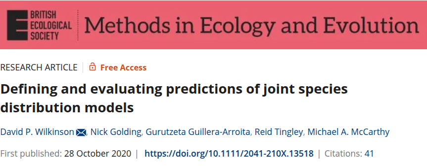

```{r setup, include=FALSE}
library(knitr)

default_source_hook <- knit_hooks$get('source')
default_output_hook <- knit_hooks$get('output')

knit_hooks$set(
  source = function(x, options) {
    paste0(
      "\n::: {.codebox data-latex=\"\"}\n\n",
      default_source_hook(x, options),
      "\n\n:::\n\n")
  }
)

knit_hooks$set(
  output = function(x, options) {
    paste0(
      "\n::: {.codebox data-latex=\"\"}\n\n",
      default_output_hook(x, options),
      "\n\n:::\n\n")
  }
)

knitr::opts_chunk$set(echo = TRUE)
```


<!--# Still need something on how traits can induce co-occurrence; site-specific trait effect can be captured by the lvs-->

# Outline 

- JSDM
- GLLVMs background
- \texttt{gllvm} \texttt{R}-package

## Questions so far?

\center

{width=40%}

# Background


## Distribution Modelling

If you have presence-absence data of a species, you fit a Species Distribution Model of the form:

\begin{equation}
y_{ij} = \alpha + \textbf{x}_i^\top\symbf{\beta}
\end{equation}

- $\textbf{x}_i$ is usually a bioclimatic variable
- Then you want to predict where a species may occur
- Potentially based on future climate scenarios
- Similar to the model from yesterday; it requires

## Co-occurrence of Swiss birds

```{r alphamap, dpi = 300, echo = FALSE, cache = TRUE, warning=FALSE,message=FALSE, fig.height = 7, dev = "png", fig.show="hide"}
model6 <- knitr::load_cache(path="../1Tuesday/VGLMMs_cache/beamer/", "cor","model6")

slp_scale <- knitr::load_cache(path="../1Tuesday/VGLMMs_cache/beamer/", "maprep","slp_scale")
asp_scale <- knitr::load_cache(path="../1Tuesday/VGLMMs_cache/beamer/", "maprep","asp_scale")

source("../1Tuesday/switzerland/slope.R")
x = as.matrix(data.frame(1,(terra::values(slope)-attr(slp_scale,"scaled:center"))/attr(slp_scale,"scaled:scale"),(terra::values(aspect)-attr(asp_scale,"scaled:center"))/attr(asp_scale,"scaled:scale")))
alpha = slope
terra::values(alpha) = rowSums(x*(x%*%model6$params$sigmaB))

library(ggplot2)
library(tidyr)
library(dplyr)
dat <- as.data.frame(alpha,xy=TRUE) %>%
  pivot_longer(cols = -c(x, y), names_to = "layer", values_to = "value")

plt<-ggplot() +         # layer 3
  theme_classic()+theme(text = element_text(size = 20),axis.text=element_blank(), axis.ticks=element_blank())+scale_fill_viridis_c(name="Alpha diversity", na.value="white")+geom_raster(data=dat, aes(x=x, y=y, fill = value), interpolate=TRUE)+coord_fixed()+xlab(NULL)+ylab(NULL)+ggtitle("Bird alpha diversity (due to mean abundance, aspect and slope)")
plt
```

```{r predmap, cache = TRUE, echo = FALSE, message = FALSE, warning=FALSE, dpi = 300, fig.width = 3, fig.height = 4.5, dev = "png", fig.show="hide"}
source("../1Tuesday/switzerland/slope.R")
X = cbind(1, 
          (terra::values(aspect)-attr(asp_scale,"scaled:center"))/attr(asp_scale,"scaled:scale"),
          (terra::values(slope)-attr(slp_scale,"scaled:center"))/attr(slp_scale,"scaled:scale"))
eta=replicate(ncol(model6$y),as.matrix(X)%*%c(model6$params$beta0[1],model6$params$B))[,1,]+as.matrix(X)%*%model6$params$Br
preds <- pnorm(eta)
predrast <- terra::rast(slope, nl=ncol(model6$y))
values(predrast) <- preds

library(ggplot2)
library(dplyr)
library(tidyr)
# arrange data for plot
offset = 10000
dat <- as.data.frame(predrast,xy=TRUE) %>%
  pivot_longer(cols = -c(x, y), names_to = "layer", values_to = "value") %>%
  mutate(layer_index = as.numeric(gsub("[^0-9]", "", layer)),
         x = x,# + offset * 0.05,
         y = y + offset * (layer_index - 1))

plt<-ggplot() +         # layer 3
  theme_classic()+theme(text = element_text(size = 12),axis.text=element_blank(), axis.ticks=element_blank())+scale_fill_viridis_c(name="Prob", na.value="white", labels= c(0,0.25,0.5,0.75,1), breaks = c(0,0.25,0.5,0.75,1))+geom_raster(data=dat, aes(x=x, y=y, fill = value), interpolate=TRUE)+coord_fixed()+xlab(NULL)+ylab(NULL)
plt
# cannot manage to add borders; the coordinates are somehow incorrect
# swiss = rnaturalearth::ne_countries(country = 'switzerland', scale = 'large', returnclass = "sf") %>% sf::st_transform(crs(slope))
  
# swiss <- sf::st_as_sf(aggregate(geodata::gadm(country="CHE", level=1, path=tempdir())))
# swiss <- sf::st_transform(swiss, crs(slope))
# library(sf)
# st_shift <- function(geom, off) {
#   st_geometry(geom) + c(off[1], off[2])
# }
# swiss_layers <- lapply(unique(dat$layer_index), function(i) {
#   shifted_geom <- st_shift(st_geometry(swiss), c(0, offset * (i - 1)))
#   st_sf(geometry = shifted_geom, layer_index = i)
# }) %>% do.call(rbind, .)
# 
# plt + geom_sf(data = swiss_layers, fill = NA, color = "black", linewidth = 0.3)
```

\textbf{Can the distribution of one species inform us of anothers'?}

\begin{columns}[c] % [c] ensures vertical centering within the column
  \column{0.5\textwidth}
  \centering
  \tikzmarknode{leftimg}{\includegraphics[width=0.9\linewidth]{JSDM_files/figure-beamer/alphamap-1.png}}

  \column{0.5\textwidth}
  \centering
  \tikzmarknode{rightimg}{\includegraphics[width=0.8\linewidth]{JSDM_files/figure-beamer/predmap-1.png}}
\end{columns}

\begin{tikzpicture}[remember picture, overlay]
  \draw[-{Triangle[width=18pt,length=8pt]}, line width=10pt] (rightimg) -- (leftimg);
\end{tikzpicture}

## Leveraging shared information

In our mixed-effects model yesterday, we had some components already shared for all species:

The random effect $\symbf{\beta}_j \sim \mathcal{N}(\symbf{\mu}, \symbf{\Sigma})$:

- had mean $\symbf{\mu}$ the same for all species
- had covariance $\symbf{\Sigma}$ the same for all species

Sharing information across species helps; on some species we have more information than others, which we can use to inform ourselves on the occurrence of less frequent species. \newline

\pause

\textcolor{red}{This is also the idea of JSDM: use co-occurrence information to improve the model's knowledge of the community}

## Co-occurrence patterns

- if one species occurs somewhere, we know another does too, for various reasons

## Species correlation

If we fit a GLM to data of multiple species, we assume \textbf{independence} \footnotesize (so we need much more information for accurate estimates) \normalsize

\textcolor{red}{But, observations of the same species form groups. Co-occurring species have  more similar observations than for other species}

In GLMM language: \textbf{observations of species exhibit correlation}

1) Part of this can be explained by shared environmental responses
2) The other part remains

We never know how much of the "remainder" is explainable by the environment.

## Independence

Correlation means non-independence. Violation of the independence assumption cannot be ignored:

- Fixed effect parameter estimates are biased (estimated environmental preferences are wrong)
- Standard errors are too small (inflated type I error; too optimistic)
  - Consequently, p-values and CIs are too small
- Predictions may be poor
- Equivalently, means we have pseudoreplication
- Random effect estimates can be inaccurate

\textcolor{red}{So, there is also a statistical need to adjust the model}

## Assessing the independence assumption

This is done via:

- Nature of the data (clustering)
- Visually via residual diagnostics (see yesterday)

## The previous model

```{r, echo  =FALSE, message=FALSE, warning=FALSE}
dat <- read.csv("../data/Wetlands.csv")
# data2018<-data[data$Year=="2018",]
# row.names(data2018) <- data2018$Site
y <- dat[,tail(1:ncol(dat),14)]
X <- dat[,head(1:ncol(dat),-14)][,-1]
X$Hydro<-as.factor(X$Hydro)
X$Water_Type<-as.factor(X$Water_Type)
```

\tiny

```{r}
model4 <- gllvm::gllvm(y, X = X, formula = ~NO3, num.lv = 0, 
                       family = "negative.binomial")
```

\normalsize

We can see this in the correlations of the residuals from our model:

\tiny

```{r, fig.height = 4}
corrplot::corrplot(cor(residuals(model4)$resi), type = "lower", diag = FALSE, tl.pos = "l", tl.cex = 0.5)
```

# JSDM

## Joint Species Distribution Modeling

A decade ago, Joint Species Distribution Models (JSDM) were introduced to model binary data of multiple species

- [Pollock et al. (2015): co-occurrence of frogs and trees](https://besjournals.onlinelibrary.wiley.com/doi/10.1111/2041-210X.12180)
- [Clark et al. (2015): co-occurrence of trees](https://esajournals.onlinelibrary.wiley.com/doi/10.1890/13-1015.1)

\centering

\textcolor{red}{The goal: to incorporate covariation of species for better predictions}


## Species associations

What induces covariation between species?

\begin{columns}
\column{0.5\textwidth}
\begin{itemize}
\item Shared environmental responses (abiotic conditions)
\item Biotic interactions
\end{itemize}
\column{0.5\textwidth}

\begin{figure}
\includegraphics[height=25mm]{Pollock_et_al_fig1b.png}
\caption{\footnotesize Pollock et al. (2015, fig. 1)}
\end{figure}
\end{columns}
\begin{columns}
\column{0.5\textwidth}
\begin{figure}
\includegraphics[height=25mm]{Pollock_et_al_fig1a.png}
\end{figure}
\column{0.5\textwidth}
\begin{figure}
\includegraphics[height=25mm]{Pollock_et_al_fig1c.png}
\end{figure}
\end{columns}

## Interactions and co-occurrence


Interactions induce correlation, but we cannot infer interactions from (non-temporal) co-occurrence data.

## The niche concept

We can also take a different angle; correlation is introduced to improve our estimates for species' responses.

```{r, echo = FALSE, fig.height  = 4}
# Load necessary package
library(ggplot2)

# Define environmental gradient
x <- seq(0, 10, length.out = 500)

# Define fundamental niches as Gaussian curves
species1_fundamental <- exp(-0.5 * ((x - 4)^2) / 1.0)
species2_fundamental <- exp(-0.5 * ((x - 6)^2) / 1.0)

# Define a smooth competition effect (sigmoid transition)
competition_effect <- 1 - 1 / (1 + exp(-10 * (x - 5)))  # sigmoid drop after x=5
species1_realized <- species1_fundamental * competition_effect

# Create a data frame for plotting
df <- data.frame(
  x = x,
  Species1Fund = species1_fundamental,
  Species2Fund = species2_fundamental,
  Species1Real = species1_realized
)

# Plot using ggplot2
ggplot(df, aes(x = x)) +
  geom_line(aes(y = Species1Fund), linetype = "dashed", color = "blue") +
  geom_line(aes(y = Species2Fund), linetype = "dashed", color = "darkgreen") +
  geom_ribbon(aes(ymin = 0, ymax = Species1Real), fill = "blue", alpha = 0.4) +
  geom_ribbon(aes(ymin = 0, ymax = Species2Fund), fill = "darkgreen", alpha = 0.2) +
  labs(
    x = "Environmental gradient",
    y = "Prob. occurrence",
    title = "Fundamental vs Realized Niches of Two Species"
  ) +
  theme_minimal()
```

\footnotesize 

Fundamental niche: total occupiable space without other species' intervention \newline
Realized niche: the space occupied due to other species

## When reality kicks in

\centering

](niche.jpg){width=50%}

Niches are shaped more than by environment and interactions; historical limitations, dispersal, and other processess prevent us from estimating the fundamental niche.

\tikzset{
  mybox/.style={
    draw=red,
    very thick,
    rectangle,
    rounded corners,
    inner sep=10pt,
    fill = white,
    fill opacity = 0.8,
    text width = 0.8\paperwidth
  }
}
    
\begin{tikzpicture}[remember picture, overlay]
\node[mybox] at (current page.center){Incorporating potential biotic sources of covariation is a step in the right direction};
\end{tikzpicture}

## JSDM vs. classical multivariate analysis

\begin{table}[ht]
\begin{tabularx}{\linewidth}{|>{\raggedleft\arraybackslash}p{2.3cm}|>{\raggedright\arraybackslash}p{3.5cm}|>{\raggedright\arraybackslash}p{4cm}|}
\toprule
  & Classic & JSDM\\
 \midrule
Focus  & Low-dimensional space & Distributions\\
Goal  & Inference & Prediction \\
Data type  & Usually quantitative & Binary \\
Scale  & Local & Regional \\
Covariates  & Environmental & Bioclimatic \\ 
Presentation  & Ordination diagram & Correlation plot/map \\
Audience  & Community ecologists & Macro ecologists\\
\bottomrule
\end{tabularx}
\end{table}

\pause

\centering

\textcolor{red}{That is not to say JSDMs cannot be used for non-binary data, for inference, or for local scales}

## Typical questions in the framework

\begin{center}
\scalebox{0.85}{
\begin{tikzpicture}[
node distance = 5mm,
 inbox/.style = {rectangle, draw, rounded corners,
                 minimum height=18mm, minimum width=32mm ,
                 align=center, inner xsep=6mm, inner ysep=3mm},
outbox/.style = {rectangle, draw=red, densely dashed, rounded corners,
                 inner xsep=3mm, inner ysep=3mm}]
\node (inner1) [inbox, fill = olive!50!green!40!] {$\textbf{Y} \footnotesize \text{ community}$};
\node (inner3) [inbox, right=of inner1, fill = blue!80!darkgray!40] {$\textbf{X} \footnotesize \text{ environment}$};
\node (inner2) [inbox, below=of inner1, fill = yellow!30!red!20] {$\textbf{R} \footnotesize \text{ traits}$};
\visible<2->{\node (inner4) [inbox, below=of inner3, fill = yellow!40] {A model};}
\node (inner5) [inbox, below=of inner4, fill = grey!30] {$\textbf{C} \footnotesize \text{ phylogeny}$};
\only<5->\node (inner7) [inbox, below=of inner2, fill = red!30, double=red, double distance=1.2pt] {$\scriptsize \text{Associations}$};
\node (inner6)[anchor=center, right=of inner4.east, yshift=-2cm]{
};

\draw<2->[->,thick] (inner3.west) -- (inner1.east);<!--arrow from X to Y-->
\draw<2->[->,thick] (inner4.north) -- (inner3.south); <!-- beta to X-->
\draw<3->[->,thick] (inner2.east) -- (inner4.west); <!--R to beta-->
\draw<4->[->,thick] (inner5.north) -- (inner4.south); <!--C to beta-->
\only<5->\draw[->,very thick, red] (inner7.west) -- ([xshift = -0.8cm]inner7.west) -- ([xshift = -0.8cm]inner1.west) -- (inner1.west); <!--LVs to y-->
\end{tikzpicture}
}
\end{center}

\only<2>{Q: How does the environment structure the community? \textcolor{red}{environmental filtering}}
\only<3>{Q: How do traits affect species' responses to the environment? \textcolor{red}{environmental filtering \footnotesize (more later)}}
\only<4>{Q: Do species with shared evolutionary history co-occur? (phylogenetic structuring) \textcolor{red}{environmental filtering}}
\only<5>{Q: Do species co-occur \textbf{after} the environment has been considered? \textcolor{red}{biotic filtering}}

## Joint Species Distribution Modeling

\centering

\begin{figure}
\includegraphics[height = 60mm]{Ovaskainen.png}
\caption{Figure from Ovaskainen et al. (2017)}
\end{figure}

## Joint Species Distribution Modeling

The aim of JSDMs is to incorporate \textit{species associations}

- Species may co-occur due to biotic interactions
- Due to similar environmental preferences
- Or because they have a similar history

Either how, it results in correlations between responses

## Joint Species Distribution Model (JSDM)

- For community data, we want to incorporate correlation of species
- We have \textcolor{red}{Multivariate} data (in contrast to multivariable)

\begin{equation}
g\{\mathams{E}(\textbf{y}_i \vert \symbf{\epsilon}_i)\} = \symbf{\beta}_0 + \textbf{x}_i^\top\symbf{\beta} + \symbf{\epsilon}_i
\end{equation}

- we add $\symbf{\epsilon}_i$ relative to the VGLM(M)
- This random effect takes care of the left-over (co)variation of species
- so we assume $\symbf{\epsilon}_i \sim \mathcal{N}(\textbf{0}, \symbf{\Sigma})$
- $\symbf{\Sigma}$ is the matrix of **species associations**

## JSDM: the model 

\begin{equation}
\tikzmarknode{t1}{\highlight{red}{\eta_{ij}}}
= 
\tikzmarknode{t2}{\highlight{blue}{\beta_{0j}}}
+
\tikzmarknode{t3}{\highlight{gray}{\ldots}}
+
\tikzmarknode{t4}{\highlight{yellow}{\epsilon_{ij}}}
\end{equation}

- $\tikzmarknode{n1}{\highlight{gray}{\text{The stuff from yesterday}}}$
- $\tikzmarknode{n2}{\highlight{yellow}{\symbf{\epsilon}_i \sim \mathcal{N}(0,\symbf{\Sigma})}}$
- $\symbf{\Sigma}$ is the matrix of \textit{species associations}
- So we expect a positive values of species co-occur, and negative if they do not

\begin{tikzpicture}[overlay,remember picture]
        \draw[->] (n1) -| (t3);
        \draw[->] (n2) -| (t4);
\end{tikzpicture}

## Species associations

- Difficult to estimate: there are usually too many parameters
- The number of pairwise associations grows quadratically
  - 2 with 2 species, 6 for 4 species, 45 for 10 species, 4950 for 100

\begin{equation}
\symbf{\Sigma} = \begin{bmatrix}
 1 & sp_{12} & \cdots & & sp_{1j} \\
 sp_{21} & 1 & \cdots & & sp_{2j} \\
 \vdots &  &\ddots &  &\vdots \\
 sp_{j1} & sp_{j2} &\cdots & & 1\\
 \end{bmatrix}
\end{equation}

\center
\textcolor{red}{This very quickly becomes an issue for fitting models}

## JSDM: it is just a mixed-effects model

The JSDM is "just" a mixed-effects model. So we can fit it with available software:

In \texttt{lme4}: \newline
\footnotesize
```{r,eval=FALSE}
glmer(abundance ~ species + x:species + (0+species|sites), data = data)
```
\normalsize

- There are $p(p+1)/2$ correlations between species
- This model becomes (very) large very quickly \footnotesize do not try this at home
\normalsize
- Will usually not fit
- So we need to do something smart!

## JSDM software implementations

\centering

\textcolor{red}{There are many!}

\pause 

\begin{itemize}
\itemsep-0.5em
\item Boral (Bayesian, slow and somewhat outdated)
\item sJSDM (Bayesian, relatively slow, but faster than Boral)
\item Hmsc (Bayesian, generally slow, loads of functionality)
\item ecoCopla (Frequentist, very fast but limited functionality)
\item CBFM (Frequentist, geared towards spatio-temporal analysis)
\item sjSDM (Frequentist, very fast but limited functionality, requires python)
\item glmmTMB (Frequentist, fast and very versatile, not purpose-coded)
\item gllvm (Frequentist, fast and very versatile, purpose-coded)
\end{itemize}

\pause

\textcolor{red}{Which software is most suitable on your aim, data type, and model.}

# Example 1

## Example: alpine plants in France

```{r ex1, echo = FALSE, message = FALSE, fig.align = "center"}
Y <- read.csv("../data/alpine2Y.csv")[,-1]
X <- read.csv("../data/alpine2X.csv")[,-1]
X <- scale(X[,c(1,2,3,4,6)])
library(gllvm)
library(corrplot)
```

- Data by [Choler 2005](https://www.tandfonline.com/doi/full/10.1657/1523-0430%282005%29037%5B0444%3ACSIAPT%5D2.0.CO%3B2)
- Occurrence of 92 species at 75 5 by 5 plots
- 6 environmental variables: aspect, slope, microscale landform, disturbance level (physical and trampling/burrowing), and mean Julian snowmelt date
- In [the jSDM package](https://ecology.ghislainv.fr/jSDM/index.html)

{width=75%}

## Example: fitting a JSDM

\footnotesize

```{r, warning=FALSE, cache = TRUE} 
model1 <- gllvm(Y, family = "binomial")
```

\normalsize

Pretty straightforward! 

## Example: visualizing associations

\footnotesize

```{r, fig.align = "center", eval = FALSE}
cors <- getResidualCor(model1)
corrplot(cors, type = "lower", diag = FALSE, tl.pos = "l", order = "AOE", tl.cex = 0.5)
```

\columnsbegin
\column{0.5\textwidth}

```{r cors1, fig.align = "left", echo = FALSE, dev = "png"}
cors <- getResidualCor(model1)
corrplot(cors, type = "lower", diag = FALSE, tl.pos = "l", order = "AOE", tl.cex = 0.5, main = "model 1")
```

\column{0.5\textwidth}
Blue: species that are predicted to co-occur\newline
Red: species that are predicted to avoid each other
\columnsend

## Example: adding a environmental variable

\footnotesize

Now that we have incorporated associations, we can add in environmental variables as yesterday (fixed or random):


```{r cors2, warning=FALSE, cache = TRUE, echo = -c(2,3), dev = "png", fig.show="hide"} 
model2 <- gllvm(Y, X = X, formula = ~Snow, family = "binomial")
cors2 <- getResidualCor(model2)
corrplot(cors, type = "lower", diag = FALSE, tl.pos = "l", order = "AOE", tl.cex = 0.5, main = "model 2")
```

```{r, echo = FALSE, fig.height = 3}
coefplot(model2, xlim = list(c(-20,10)))
```

\normalsize

Adding environmental covariates tends to improve the model, but reduce the signal in the associations.

## Example: comparing the models

\tiny

```{r cors3, cache = TRUE, echo = -c(2,3),dev = "png", fig.show="hide", warning = FALSE}
model3 <- gllvm(Y, X = X, formula = ~Snow+Form+Slope+Aspect, family = "binomial")
cors3 <- getResidualCor(model3)
corrplot(cors3, type = "lower", diag = FALSE, tl.pos = "l", order = "AOE", tl.cex = 0.5, main = "model 3")
AIC(model1, model2, model3)
```

\columnsbegin
\column{0.3\textwidth}
\includegraphics{JSDM_files/figure-beamer/cors1-1.png}
\column{0.3\textwidth}
\includegraphics{JSDM_files/figure-beamer/cors2-1.png}
\column{0.3\textwidth}
\includegraphics{JSDM_files/figure-beamer/cors3-1.png}
\columnsend

# GLLVM
## Generalized Linear Latent Variable Models \footnotesize (GLLVMs)

\centering

{height=75%}

## Generalized Linear Latent Variable Models \footnotesize (GLLVMs)

\columnsbegin
\column{.8\textwidth}
\begin{itemize}
\item A framework for model-based multivariate analysis
\item That does dimension reduction
\item Similarly as in VGLMM, you need to specify:
\begin{enumerate}  
  \item A distribution
  \item A link function
  \item The model its structure
\end{enumerate}
\item But now also the number of dimensions for the associations
\end{itemize}

\column{.2\textwidth}

```{r echo=F, eval=T, out.width="99%"}
knitr::include_graphics("MathCaution.png")
```

\columnsend

## Factor analysis to the rescue

- GLLVMs were introduced to ecology as a technical solution to this problem
- We represent the covariance matrix with fewer **dimensions**: $\symbf{\Sigma} \approx \symbf{\Gamma}\symbf{\Gamma}^\top$

"The factor analytic solution" because factor analysis \tiny (Spearman, 1904) \normalsize is the precursor of GLLVMs

## GLLVM: the model 

\begin{equation}
\tikzmarknode{t1}{\highlight{red}{\eta_{ij}}}
= 
\tikzmarknode{t2}{\highlight{blue}{\beta_{0j}}}
+
\tikzmarknode{t3}{\highlight{gray}{\ldots}}
+
\tikzmarknode{t4}{\highlight{yellow}{\epsilon_{ij}}}
\end{equation}

- $\tikzmarknode{n1}{\highlight{gray}{\text{The stuff from yesterday}}}$
- \alt<2>{$\tikzmarknode{n2}{\highlight{yellow}{\symbf{\epsilon}_i = \textbf{u}_i^\top\symbf{\Gamma}^\top \sim \mathcal{N}(0,\symbf{\Gamma}\symbf{\Gamma}^\top)}}$}{$\tikzmarknode{n2}{\highlight{yellow}{\symbf{\epsilon}_i \sim \mathcal{N}(0,\symbf{\Sigma})}}$}
- $\symbf{\Sigma}$ is the matrix of \textit{species associations}
- So we expect a positive values of species co-occur, and negative if they do not

\begin{tikzpicture}[overlay,remember picture]
        \draw[->] (n1) -|  (t3);
        \draw[->] (n2) -| (t4);
\end{tikzpicture}

# Prediction

So, we represent:

\begin{equation}
\symbf{\Sigma} \approx \symbf{\Gamma}\symbf{\Gamma}^\top
\end{equation}

The number of columns in $\symbf{\Gamma}$ is equal to the number of latent variables.

- The more latent variables we use, the better we represent the associations
- But, more latent variables slows down the model!
- So; it is a trade-off that we need to measure (somehow)
  - Can use information criteria or hypothesis tests
  - Variation explained
  - Cross-validation
  - Or some measure of predictive performance
 
## Does it improve predictions?

\columnsbegin
\column{0.5\textwidth}
Yes


\column{0.5\textwidth}
No



\columnsend

It depends how you evaluate it. Statistically, we need to incorporate non-independence.

## Prediction of focal species

For a subset of species we are particularly interested in \textbf{A}, we can do __conditional__ prediction: utilize information from other species $\textbf{B}$ to improve its prediction. We define our residual covariance matrix:

\begin{equation}
\symbf{\Sigma} = 
\begin{bmatrix}
\symbf{\Sigma}_{A} & \symbf{\Sigma}_{AB} \\
\symbf{\Sigma}_{BA} & \symbf{\Sigma}_{B}
\end{bmatrix}
\end{equation}

we set $\symbf{\epsilon}_{iA} = \symbf{\Sigma}_{AB}\symbf{\Sigma}_{B}^{-1}\symbf{\epsilon}_{iB}$ 

Now, even if species \textbf{A} is absent somewhere, we are also using its known relation with species $\textbf{B}$. But, this does not work if we don't have response data at a site.

\pause

\textcolor{red}{Note, this requires $\symbf{\Sigma}$ to be full rank.}

## The residual variance

$\symbf{\Sigma}$ is of full rank, as long as we also have residual variance.

We write our model with a residual:

\begin{equation}
\eta_{ij} = \beta_{0j} + \epsilon_{ij} + e_{ij}
\end{equation}

- where $\epsilon_{ij}$ is our term for covariation as before
- $e_{ij} \sim \mathcal{f}(0,\phi_j)$ is an independent residual

$e_{ij}$ takes different forms depending on the response distribution. In some cases (Poisson) it is hard to define.

## Link functions: probit

In probit regression, we use a latent variable $\eta^\star_{ij}$ for thresholding. \pause

\columnsbegin
\column{0.5\textwidth}
\begin{equation}
y_{ij} =
\begin{cases}
1, & \text{if}\ \eta_{ij}^\star>0\\
0, & \text{otherwise}\\
\end{cases}
\nonumber
\end{equation}

\pause

and we model this auxiliary variable:
\begin{equation}
\eta^\star_{ij} = \eta_{ij} +  E_{ij}\sim\mathcal{N}(0,1)
\nonumber
\end{equation}

\pause

Which is the same as:
\begin{equation}
\begin{aligned}
p_i &= \Phi(\eta_{ij})
\nonumber
\end{aligned}
\end{equation}

\column{0.5\textwidth}
```{r, echo = FALSE}
par(mar=c(5,5,4,2))
eta = -1
x <- seq(-5,5,length.out=1000)
plot(y=dnorm(x),x,type="l", ylab = expression(paste("dnorm(", eta[ij]^"*", ")")), xlab=expression(eta[ij]^"*"))
axis(1, at = c(-4,-2,-1,0,1,2,4))
polygon(c(x[x<eta],rev(x[x<eta])),c(rep(0,sum(x<eta)),rev(dnorm(x[x<eta]))), col = "red")
```

\pause

\centering
**if $\eta^\star_{ij}$ is positive, we have 1 and 0 if it is negative**
\pause

So, really, $\symbf{\Sigma} = \symbf{\Gamma}\symbf{\Gamma}^\top + \textbf{I}$
\columnsend

# Example 2

## Example: alpine plants in Switzerland

```{r ex2, echo = FALSE, message = FALSE, fig.align = "center"}
Y <- read.csv("../data/alpineY.csv")[,-1]
X <- read.csv("../data/alpineX.csv")[,-1]
X <- X[rowSums(Y)>0,]
Y <- Y[rowSums(Y)>0,]
library(gllvm)
invisible(TMB::openmp(parallel::detectCores()-1, DLL = "gllvm", autopar = TRUE))
```

- Data by [D'amen et al. (2017)](https://nsojournals.onlinelibrary.wiley.com/doi/10.1111/ecog.03148)
- Occurrence of 175 species at 840 $4m^2$ plots
- Environmental variables: Degree days above zero, slope, moisture, solar radiation, topography \footnotesize  (and coordinates)

```{r ex2map, message = FALSE, cache = TRUE, echo = FALSE, fig.height = 6, warning=FALSE}
library(dplyr)
swiss = rnaturalearth::ne_countries(country = 'switzerland', scale = 'large', returnclass = "sf") %>% sf::st_transform("EPSG:21781")
pts <- sf:::st_as_sf(X, coords=c("X","Y"),crs = "EPSG:21781")
ch <- sf::st_convex_hull(sf::st_union(pts))
plot(ch, lty = "dashed", lwd = 2)
chb <- sf::st_buffer(ch, dist =20000)
invisible(capture.output(bg <- maptiles::get_tiles(chb, crop = TRUE, zoom = 13)))
swissc <- sf::st_intersection(swiss, sf::st_as_sfc(sf::st_bbox(bg)))
terra::plotRGB(bg, add = TRUE)
plot(ch, lty = "dashed", lwd = 2, add = TRUE)
plot(swissc, border = "red", add = TRUE, col = NA, lwd = 2)
```

## Example: fit JSDMs

\tiny 
```{r, fit, cache = TRUE}
model5 <- gllvm(Y, num.lv = 2, family = "binomial", sd.errors = FALSE, diag.iter = 0, optim.method = "L-BFGS-B")
model6 <- gllvm(Y, num.lv = 3, family = "binomial", sd.errors = FALSE, diag.iter = 0, optim.method = "L-BFGS-B")
model7 <- gllvm(Y, num.lv = 4, family = "binomial", sd.errors = FALSE, diag.iter = 0, optim.method = "L-BFGS-B")
```

Calculate predictive performance

\tiny

```{r ex2cors, cache = TRUE, echo = -c(4:6), dev="png", fig.height = 10} 
goodnessOfFit(Y, object = model5, measure = "RMSE")$RMSE
goodnessOfFit(Y, object = model6, measure = "RMSE")$RMSE
goodnessOfFit(Y, object = model7, measure = "RMSE")$RMSE
corrplot::corrplot(getResidualCor(model5), type = "lower", diag = FALSE, tl.pos = "l", tl.cex = 0.2, order = "AOE")
corrplot::corrplot(getResidualCor(model6), type = "lower", diag = FALSE, tl.pos = "l", tl.cex = 0.2, order = "AOE")
corrplot::corrplot(getResidualCor(model7), type = "lower", diag = FALSE, tl.pos = "l", tl.cex = 0.2, order = "AOE")
```

## Example: resulting associations

\columnsbegin
\column{0.3\textwidth}
\includegraphics{JSDM_files/figure-beamer/ex2cors-1.png}
\column{0.3\textwidth}
\includegraphics{JSDM_files/figure-beamer/ex2cors-2.png}
\column{0.3\textwidth}
\includegraphics{JSDM_files/figure-beamer/ex2cors-3.png}
\columnsend

## Example: conditional prediction

Let's take one of the models, and do a conditional prediction.

```{r condPred, echo = -c(1,5)}
conditionalPredict <- function(A, object){
  if(missing(A)){
    stop("Must choose focal species 'A'")
  }
  
  eta <- predict(object, level = 0)
  theta <- object$params$theta[,1:(object$num.lv+object$num.lv.c)]%*%diag(object$params$sigma.lv)
  invisible(S <- getResidualCov(object)$cov)
  e <- object$lvs%*%t(theta[-A,])%*%solve(S[-A,-A])%*%S[-A,A]
  
  return(eta[,A]+e)
}
condPred <- pnorm(conditionalPredict(c(43,88),model7))
pred <- pnorm(predict(model7)[,c(43,88)])
colnames(pred) = NULL
pts <- sf:::st_as_sf(X, coords=c("X","Y"),crs = "EPSG:21781")
pts = cbind(pts, condPred = condPred)
pts = cbind(pts, pred = pred)
pts2 <- terra::vect(pts)
```

## Example: result of conditional prediction

```{r, echo = FALSE}
par(mfrow=c(1,2))
terra::plot(terra:::rasterize(pts2, field = "condPred.1", terra::rast(pts2, nrow=50,ncol=50))-terra:::rasterize(pts2, field = "pred.1", terra::rast(pts2,nrow=50,ncol=50)), main = "Difference spp 43")
terra::plot(terra:::rasterize(pts2, field = "condPred.2", terra::rast(pts2, nrow=50,ncol=50))-terra:::rasterize(pts2, field = "pred.2", terra::rast(pts2,nrow=50,ncol=50)), main = "Difference spp 88")
```

# Summary

## Defining predictions


Wilkinson et al. defined multiple types of predictions:

- marginal (from `predict`)
- conditional marginal (aforementioned)
- joint: occurrence of multiple species simultaneously
- \tiny conditional joint: occurrence of two or more species together, given the information from another

The prediction to use depends on your ecological question.

## Summary

- JSDMs were introduced: models to incorporate species' correlation
- JSDM mostly focuses on predicting (e.g., on a map)
- Usually, JSDMs are implemented using latent variables
  - The number used affects predictive performance
- Conditional predictions can facilitate a focus on focal species
- There are different types of predictions possible, to target particular ecological questions


<!-- Let's fit a new model to predict: -->

<!-- \footnotesize -->

<!-- ```{r mod7, cache = TRIE} -->
<!-- # get some bioclim variables -->
<!-- bio <- geodata::worldclim_country("che", "bio", path = tempdir(), res = 2.5) -->
<!-- bio <- terra::project(bio, terra::crs(swiss)) -->
<!-- bio <- terra::crop(bio, swiss, mask = TRUE) -->
<!-- names(bio) <- paste0("bio", 1:19) -->
<!-- Xnew <- terra::extract(bio, pts) -->
<!-- model8 <- gllvm(Y, X = Xnew, formula = ~bio1 + bio4 + bio12, num.lv = 2, family = "binomial", sd.errors = FALSE, diag.iter = 0, optim.method = "L-BFGS-B") -->
<!-- goodnessOfFit(Y, object = model8, measure = "RMSE") -->
<!-- ``` -->

<!-- ## Example: conditional prediction -->

