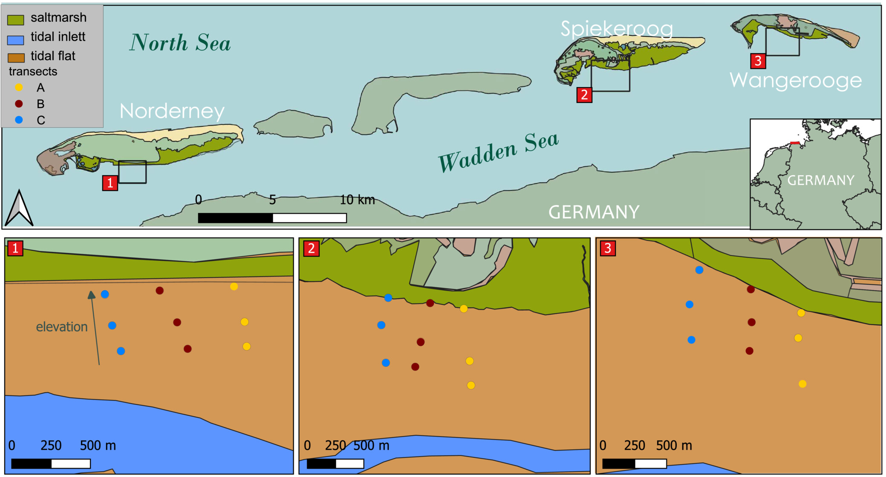

```{r setup, include=FALSE, message = FALSE}
library(knitr)

default_source_hook <- knit_hooks$get('source')
default_output_hook <- knit_hooks$get('output')

knit_hooks$set(
  source = function(x, options) {
    paste0(
      "\n::: {.codebox data-latex=\"\"}\n\n",
      default_source_hook(x, options),
      "\n\n:::\n\n")
  }
)

knit_hooks$set(
  output = function(x, options) {
    paste0(
      "\n::: {.codebox data-latex=\"\"}\n\n",
      default_output_hook(x, options),
      "\n\n:::\n\n")
  }
)

knitr::opts_chunk$set(echo = TRUE)
library(gllvm)
TMB::openmp(parallel::detectCores()-1,autopar=TRUE, DLL = "gllvm")
```

# Recap

So far, we have covered three types of ordination. \only<2->{\textcolor{red}{Choosing between these is relatively straightforward:}}

- Unconstrained ordination\only<2->{: \textcolor{red}{ when you do not have covariates}}
- Constrained ordination\only<2->{: \textcolor{red}{ when there is no residual covariation}}
- Concurrent ordination\only<2->{: \textcolor{red}{ when you have covariates and residual covariation}}

## Questions so far?

\center

{width=40%}

# Nested designs

## Ordination with nested design

Imagine a study with nested design (e.g., plots $k = 1\ldots K$ in sites $i = 1 \ldots n$), and our usual model:

\begin{equation}
\tikzmarknode{t1}{\highlight{red}{\eta_{ijk}}}
= 
\tikzmarknode{t2}{\highlight{blue}{\beta_{0j}}}
+
\tikzmarknode{t6}{\highlight{yellow}{\textbf{u}_{ik}^\top}}
\tikzmarknode{t7}{\highlight{green}{\symbf{\gamma}_j}}
\end{equation}

Here, we are incorporating the plots into the ordination (which can be quite messy).

## Ordination with nested design

But, perhaps we think an ordination "lives" at the site-level. We define $\textbf{u}_{ik} = \textbf{u}_i + \textbf{u}_k$:

\begin{equation}
\tikzmarknode{t1}{\highlight{red}{\eta_{ijk}}}
= 
\tikzmarknode{t2}{\highlight{blue}{\beta_{0j}}}
+
\tikzmarknode{t6}{\highlight{yellow}{(\textbf{u}_k+\textbf{u}_i)}^\top}
\tikzmarknode{t7}{\highlight{green}{\symbf{\gamma}_j}}
\end{equation}

Now we have two (connected by loadings) ordinations in the model: 1) $\highlight{yellow}{\textbf{u}_i^\top}\highlight{green}{\symbf{\gamma}_j}$ and 2) $\highlight{yellow}{\textbf{u}_k^\top}\highlight{green}{\symbf{\gamma}_j}$.

- 1) is a site-specific ordination
- 2) is a plot-specific ordination
- We assume these have the same dimensions
- We assume these have the same loadings
- So the covariance matrix remains similar: $\symbf{\Sigma} = 2\symbf{\Gamma} \symbf{\Gamma}^\top$

## Connection to ordination with predictors

The ordination with nested design from before:

\begin{equation}
\tikzmarknode{t1}{\highlight{red}{\eta_{ijk}}}
= 
\tikzmarknode{t2}{\highlight{blue}{\beta_{0j}}}
+
\tikzmarknode{t6}{\highlight{yellow}{(\textbf{u}_k+\textbf{u}_i)}^\top}
\tikzmarknode{t7}{\highlight{green}{\symbf{\gamma}_j}}
\end{equation}

Is a type of constrained ordination, because we can write the latent variable $\textbf{u}_{ik} = \textbf{B}^\top\textbf{x}^{lv}_{ik}$ with

\columnsbegin
\column{0.2\textwidth}
$\textbf{B} = \begin{bmatrix}\textbf{u}_1\\ \vdots \\ \textbf{u}_i \\ \textbf{u}_1 \\ \vdots \\ \textbf{u}_k \end{bmatrix}$ 
\column{0.9\textwidth}
$\begin{aligned}\textbf{X}^{lv} &= \begin{array}{c|ccc|ccc@{}} & \text{site 1} & \text{site 2} & \text{site 3} & \text{plot 1} & \text{plot 2} & \text{plot 3} \\ \cline{2-7}\noalign{\vskip -5pt} \\ \text{1.1} & 1 & 0 & 0 & 1 & 0 & 0 \\ \text{2.3} & 0 & 1 & 0 & 0 & 0 & 1 \\ \text{3.1} & 0 & 0 & 1 & 1 & 0 & 0 \end{array}\end{aligned}$
\columnsend

## Ordination with nested design

Following similar logic, we can relax the assumptions a little:

\begin{equation}
\tikzmarknode{t1}{\highlight{red}{\eta_{ijk}}}
= 
\tikzmarknode{t2}{\highlight{blue}{\beta_{0j}}}
+
\tikzmarknode{t6}{\highlight{yellow}{\textbf{u}_i}}\tikzmarknode{t7}{\highlight{green}{\symbf{\gamma}_j}}
+ \tikzmarknode{t6}{\highlight{yellow}{\textbf{u}_k}}\tikzmarknode{t7}{\highlight{green}{\symbf{\theta}_j}}
\end{equation}

\pause

- Now we have two separate ordinations
- These can have different dimensions
- The covariance matrix is now: $\symbf{\Sigma} = \symbf{\Gamma} \symbf{\Gamma}^\top + \symbf{\Theta}\symbf{\Theta}^\top$

## Ordination with nested design

What happens if we just omit the variation at the plot-level?

\pause

It depends on the true model, but for example:

\begin{equation}
\tikzmarknode{t1}{\highlight{red}{\eta_{ijk}}}
= 
\tikzmarknode{t2}{\highlight{blue}{\beta_{0j}}}
+
\tikzmarknode{t6}{\highlight{yellow}{\textbf{u}_{i}^\top}}
\tikzmarknode{t7}{\highlight{green}{\symbf{\gamma}_j}}
+ \epsilon_{kj}
\end{equation}

We could be omitting a plot-level random effect.

# Example 1

## Example 1: Wadden data

Wadden sea data [Dewenter et al. (2023)](https://onlinelibrary.wiley.com/doi/full/10.1002/ece3.10815)

\begin{columns}
\column{0.5\textwidth}
\begin{itemize}
\item Abundance (counts) or Biomass of macrozoobenthos
\item Covariates
\item \textbf{Transects at islands (Norderney, Spiekeroog, Wangerooge)}
\end{itemize}
\column{0.5\textwidth}
\begin{figure}[h]
\centering
\includegraphics{macrozoobenthos.jpg}
\caption{nioz.nl}
\end{figure}
\end{columns}

\tiny

```{r dat, echo = -4}
Y <- read.csv("../data/waddenY2.csv")[,-c(1:2)]
Y <- Y[, colSums(ifelse(Y==0,0,1))>2]
X <- read.csv("../data/waddenX.csv")
X <- X[,!apply(X,2,anyNA)]
X[,unlist(lapply(X,is.numeric))] <- scale(X[,unlist(lapply(X,is.numeric))])
```

## Example 1: Study design

{height=90%}

## Example 1: group-level ordination

\tiny

```{r gord1, cache = TRUE, warning = FALSE, message = FALSE, dev = "png", fig.show = "hide", echo = -3}
model1 <- gllvm(y = Y, num.lv = 2, 
                lvCor = ~(1|island), studyDesign = X,
                family = "tweedie", Power = NULL, n.init = 3, disp.formula = rep(1,ncol(Y)))
model2 <- update(model1, lvCor = ~(1|island) + (1|transect))
gllvm::ordiplot(model1, s.cex = 2);gllvm::ordiplot(model2, s.cex = 2)
```

\vspace*{\baselineskip}

\columnsbegin
\column{0.5\textwidth}
\includegraphics{Conditioning_files/figure-beamer/gord1-1.png}
This is an ordination at the island-level.
\column{0.5\textwidth}
\includegraphics{Conditioning_files/figure-beamer/gord1-2.png}
These are two ordinations with the same loadings.
\columnsend

## Example 1: two ordinations with different loadings


\tiny

```{r gord2, cache = TRUE, warning = FALSE, message = FALSE, dev = "png", fig.show = "hide", echo = -2}
model3 <- gllvm(y = Y, num.lv = 2, lvCor = ~(1|island), studyDesign = X,
                num.RR  = 2, lv.formula = ~diag(1|transect), X = X, randomB = "LV",
                family = "tweedie", Power = NULL, n.init = 3, disp.formula = rep(1,ncol(Y)))
gllvm::ordiplot(model3, s.cex = 2, type = "marginal", arrow.ci = FALSE);gllvm::ordiplot(model3, s.cex = 2, type = "residual")
```

\vspace*{\baselineskip}

\columnsbegin
\column{0.5\textwidth}
\includegraphics{Conditioning_files/figure-beamer/gord2-1.png}
\column{0.5\textwidth}
\includegraphics{Conditioning_files/figure-beamer/gord2-2.png}
\columnsend

\begin{center}
These are two ordinations with different loadings.
\end{center}

# Conditioning


## Ordination with nested design

Another model may be:

\begin{equation}
\tikzmarknode{t1}{\highlight{red}{\eta_{ijk}}}
= 
\tikzmarknode{t2}{\highlight{blue}{\beta_{0j}}}
+
\tikzmarknode{t3}{\highlight{blue}{\alpha_{k}}}
+
\tikzmarknode{t6}{\highlight{yellow}{\textbf{u}_i^\top}}
\tikzmarknode{t7}{\highlight{green}{\symbf{\gamma}_j}}
\end{equation}

or even:

\begin{equation}
\tikzmarknode{t1}{\highlight{red}{\eta_{ijk}}}
= 
\tikzmarknode{t2}{\highlight{blue}{\beta_{0j}}}
+
\tikzmarknode{t4}{\highlight{grey}{\textbf{z}_k^\top\boldsymbol{\lambda}_j}}
+
\tikzmarknode{t6}{\highlight{yellow}{\textbf{u}_i^\top}}
\tikzmarknode{t7}{\highlight{green}{\symbf{\gamma}_j}}
\end{equation}

What is the difference between these two models? What assumptions do we make in these models?

## Conditioning

In classical methods, we can use `Condition` to  remove effects due to a covariate from the ordination. Here, we adjust our model with terms outside of the ordination:

\begin{equation}
\eta_{ij} = \beta_{0j} + \tikzmarknode{t1}{\highlight{grey}{...}} + \textbf{u}_i^\top\symbf{\gamma}_j
\end{equation}

\begin{tikzpicture}[overlay,remember picture]
        \draw[->] ([yshift = -0.8cm]t1.south) -- (t1);
\end{tikzpicture}

\tikzmarknode{n1}{Which can be a fixed or random effect (fixed in classical ordination)}

## Conditioning with covariates

Sometimes, we want to deliberately \textbf{remove information} from the ordination:

- Observer effects
- Nested designs
- Spatial/temporal effects
- Confounders

To improve interpretability of the ordination: this is called "conditioning" or "partial" ordination.

Constrained and concurrent ordination instead \textbf{include information} in the ordination.

\pause

We can combine these two concepts by conditioning on covariates.

## Conditioning: example

Imagine an example where we have treatments (say fertilizer use) under different conditions (say soil type).

If we are interested in the effect of the treatment, but we need to \textbf{control} for soil type, we include both in a model:

\pause

$\eta_{ij} =\beta_{0j} + \textbf{x}_i^{\text{soil type}\top}\boldsymbol{\beta}_j^\text{soil type} + \textbf{x}_i^{\text{fertilizer}\top}\boldsymbol{\beta}_j^\text{fertilizer}$

\pause

Now, the effect of fertilizer is \textbf{conditional} on the effect of soil type. In essence, we keep soil type constant for determining the effect of fertilizer. \newline

What happens if we do not control for soil type? \pause \textcolor{red}{If we administer fertilizer to already rich soils we probably find no effect.}

## Conditioning: ordination

The same applies to the ordination. If we condition, the ordination captures what is not captured by the conditioning term, for example:

\begin{equation}
\eta_{ij} = \beta_{0j} + \textbf{x}_i^{\text{soil type}\top}\boldsymbol{\beta}_j^\text{soil type} + \textbf{u}_i^\top\boldsymbol{\gamma}_j
\end{equation}

## Sparse data

Ultimately, the goal of ordination is to facilitate analysis of sparse community data.

We can only have so many effects outside of the ordination.

- Each effect outside of the ordination "costs" one parameter per species
- Each effect inside the ordination "costs" one parameter per latent variable
- Conditioning effects can be of interest
- Effects that we want to represent with higher accuracy
- For example, an elevation gradient
- The ordination accounts for patterns thereafter

## The model: partial ordination \alt<2>{interface}{components}

\begin{equation}
\tikzmarknode{t1}{\highlight{red}{\eta_{ij}}}
= 
\tikzmarknode{t2}{\highlight{blue}{\beta_{0j}}}
+
\tikzmarknode{t3}{\highlight{blue}{\alpha_i}}
+
\tikzmarknode{t4}{\highlight{grey}{\nu_{ij}}}
+
\tikzmarknode{t6}{\highlight{yellow}{\textbf{u}_i^\top}}
\tikzmarknode{t7}{\highlight{green}{\symbf{\gamma}_j}}
\end{equation}

As before, the index of $\highlight{yellow}{\textbf{u}_i}$ is flexible \only<2>{and controlled with `lvCor`}.

- We always condition on $\tikzmarknode{t2}{\highlight{blue}{\beta_{0j}}}$
- $\highlight{blue}{\alpha_i} = \textbf{x}_i^{r,\top}\symbf{\beta}^r + \textbf{z}_i^{r,\top}\symbf{\lambda}^r$ \alt<2>{is controlled with `row.eff`}{are species common or row effects outside of the ordination}
- $\highlight{grey}{\nu_{ij}} = \textbf{x}_i^\top\symbf{\beta}_j + \textbf{z}_i^\top\symbf{\lambda}_j$ \alt<2>{is controlled with `formula`}{are species-specific effects outside of the ordination}

## Model specification

We can only completely eliminate an effect from the ordination if the model is specified correctly:

- Consider non-linear effects of variables (e.g., quadratic)
- Species-specific random effects are more flexible than row-specific effects
- Random if we consider a confounder "nuisance"
- Fixed if we are interested in full-rank estimation of an effect

\pause

Note: random effects in `formula` assume species independence, in `randomB` they do not.

# Example 2

## Example: alpine plants in Switzerland

```{r alpine, echo = FALSE, message = FALSE, fig.align = "center"}
Y <- read.csv("../data/alpineY.csv")[,-1]
X <- read.csv("../data/alpineX.csv")[,-1]
X <- data.frame(scale(X[rowSums(Y)>0,]))
Y <- Y[rowSums(Y)>0,]
```

- Data by [D'amen et al. (2017)](https://nsojournals.onlinelibrary.wiley.com/doi/10.1111/ecog.03148)
- Occurrence of 175 species at 840 $4m^2$ plots
- Sampled on an elevation gradient

\vspace*{-\baselineskip}

```{r alpinemap, message = FALSE, cache = TRUE, echo = FALSE, fig.height = 6, warning=FALSE}
library(dplyr)
swiss = rnaturalearth::ne_countries(country = 'switzerland', scale = 'large', returnclass = "sf") %>% sf::st_transform("EPSG:21781")
pts <- sf:::st_as_sf(X, coords=c("X","Y"),crs = "EPSG:21781")
ch <- sf::st_convex_hull(sf::st_union(pts))
plot(ch, lty = "dashed", lwd = 2)
chb <- sf::st_buffer(ch, dist =20000)
invisible(capture.output(bg <- maptiles::get_tiles(chb, crop = TRUE, zoom = 13)))
swissc <- sf::st_intersection(swiss, sf::st_as_sfc(sf::st_bbox(bg)))
terra::plotRGB(bg, add = TRUE)
plot(ch, lty = "dashed", lwd = 2, add = TRUE)
plot(swissc, border = "red", add = TRUE, col = NA, lwd = 2)
```

## Example: elevation effect

\tiny 
```{r, alpinefit, cache = TRUE}
model4 <- gllvm(Y, num.lv = 2, family = "binomial", sd.errors = FALSE, diag.iter = 0, optim.method = "L-BFGS-B")
model5 <- update(model4, X = X, formula=~ELEV)
model6 <- update(model4, X = X, formula=~ELEV + I(ELEV^2))
```

```{r alpord1, cache = TRUE, dev ="pdf", fig.show = "hide", fig.height = 10, echo = FALSE}
par(mar=c(5, 5.5, 4, 2))
ncut = 20
elevcol <- colorRampPalette(c(
  "#004529",   # dark green (lowlands)
  "#78c679",   # light green (foothills)
  "#ffffcc",   # pale yellow (plains)
  "#fdae61",   # tan (mid elevation)
  "#d7191c",   # red-orange (high)
  "#7f3b08"    # dark brown (highest)
))
cols = elevcol(ncut)[(as.numeric(cut(X$ELEV, ncut)))]
gllvm::ordiplot(model4, symbols = TRUE, s.colors = cols, pch = 16, cex.main = 4, s.cex = 4, cex.lab = 4, main = "2 LVs")
gllvm::ordiplot(model5, symbols = TRUE, s.colors = cols, pch = 16, cex.main = 4, s.cex = 4, cex.lab = 4, main = "ELEV + 2LVs")
gllvm::ordiplot(model6, symbols = TRUE, s.colors = cols, pch = 16, cex.main = 4, s.cex = 4, cex.lab = 4, main = "ELEV + ELEV^2 + 2LVs")
```

\footnotesize

\vspace*{\baselineskip}

\columnsbegin
\column{0.34\textwidth}
\includegraphics{Conditioning_files/figure-beamer/alpord1-1.pdf}
\column{0.34\textwidth}
\includegraphics{Conditioning_files/figure-beamer/alpord1-2.pdf}
\column{0.34\textwidth}
\includegraphics{Conditioning_files/figure-beamer/alpord1-3.pdf}
\columnsend

## Example: elevation effect (2)

```{r, echo = FALSE}
cbind(data.frame("2 LVs" = diag(cor(getLV(model4), cbind(X$ELEV, X$ELEV^2))), check.names = FALSE, row.names = c("ELEV", "ELEV^2")), 
           data.frame("ELEV + 2LVs " = diag(cor(getLV(model5), cbind(X$ELEV, X$ELEV^2))), check.names = FALSE), 
           data.frame("ELEV + ELEV^2 + 2LVs" = diag(cor(getLV(model6), cbind(X$ELEV, X$ELEV^2))), check.names = FALSE))
```

- Without conditioning the ordination reflects the elevation gradient
- While conditioning on the linear term, the ordination still approximately reflects a quadratic effect of elevation
- Conditioning on both, the elevation effect is filtered from the ordination

## Example: variation explained

\footnotesize

\begin{itemize}
\itemsep-0.5em
\item The variation explained by the unconstrained ordination is `r format(round(getResidualCov(model4)$trace, 2), nsmall = 2L)` \newline
\item The variation explained by the first residual ordination is `r format(round(getResidualCov(model5)$trace, 2), nsmall = 2L)` \newline
\item The variation explained by the second residual ordination is `r format(round(getResidualCov(model6)$trace, 2), nsmall = 2L)` \newline
\end{itemize}

\vspace*{\baselineskip}

\tiny

\columnsbegin
\column{0.3\textwidth}
```{r}
VP(model4, group = c(1,1))
```
\column{0.3\textwidth}
```{r}
VP(model5, group = c(1,2,2))
```
\column{0.3\textwidth}
```{r}
VP(model6, group = c(1,1,2,2))
```
\columnsend


\vspace*{\baselineskip}

\footnotesize

There is more going on than just elevation! But no strong correlation with any observed covariates; Moisture, degree days above zero, slope, solar radiation, topography index.

## Example: inferring the new gradients

\vspace*{-\baselineskip}

```{r, echo = FALSE, fig.width = 10, fig.height = 4.5}
par(mar=c(5,6,2,2))
row.names(model6$params$theta) <- vegan::make.cepnames(colnames(model6$y))
gllvm::ordiplot(model6, symbols = TRUE, s.colors = "gray", pch = 16, biplot = TRUE, cex.spp = ifelse(vegan::make.cepnames(colnames(model6$y))%in%c("Anthodor", "Saxioppo","Trifrepe","Scabluci"),1.2,0.5), alpha = 0.6, xlim = c(-3, 3), spp.colors =ifelse(vegan::make.cepnames(colnames(model6$y))%in%c("Anthodor", "Saxioppo","Trifrepe","Scabluci"),"orange","black"), main = NA)
```


\vspace*{-\baselineskip}

\columnsbegin
\column{0.25\textwidth}
\begin{figure}
\captionsetup{labelformat=empty}
\caption{\tiny Anthoxanthum odoratum}
 \tikz[remember picture,baseline] \node[inner sep=0pt] (anthodor){
  \includegraphics[height=0.4\textheight]{anthoxanthum_odoratum.jpg}
};
\end{figure}
\column{0.25\textwidth}
\begin{figure}
\captionsetup{labelformat=empty}
\caption{\tiny Trifolium repens}
\tikz[remember picture,baseline] \node[inner sep=0pt] (trifrepe){
\includegraphics[height=0.4\textheight]{trifolium_repens.jpg}
};
\end{figure}
\column{0.25\textwidth}
\begin{figure}
\captionsetup{labelformat=empty}
\caption{\tiny Scabiosa lucida}
\tikz[remember picture,baseline] \node[inner sep=0pt] (scabluci){
\includegraphics[height=0.4\textheight]{scabiosa_lucida.jpg}
};
\end{figure}
\column{0.25\textwidth}
\begin{figure}
\captionsetup{labelformat=empty}
\caption{\tiny Saxifraga oppositifolia}
\tikz[remember picture,baseline] \node[inner sep=0pt] (saxioppo){
\includegraphics[height=0.4\textheight]{saxifraga_oppositifolia.jpg}
};
\end{figure}
\columnsend

\vspace*{-\baselineskip}

\begin{tikzpicture}[remember picture, overlay]
\only<1->{
  \draw[->, thick, red] (anthodor) -- ++(3, 4.6); % relative arrow
}
\only<1->{
  \draw[->, thick, red] (saxioppo) -- ++(-3.1, 4.9); % relative arrow
}
\only<1->{
  \draw[->, thick, red] (trifrepe) -- ++(1, 3.8); % relative arrow
}
\only<1->{
  \draw[->, thick, red] (scabluci) -- ++(-1.6, 5.7); % relative arrow
}
\end{tikzpicture}

<!-- - Potentilla aurea (top) vs. Saxifraga oppositifolia (bottom) -->
<!-- - Ranunculus repens (left) vs. Phyteuma orbiculare (right) -->

<!-- P. aurea prefers rich soils and S. oppositifolia prefers nutrient poor soils \newline -->
<!-- R. repens occurs in intensively managed fields, P. oobiculare in semi-natural grasslands -->

## The gradient of interest

Do you want to condition on ordination here?

- Not if you want to see the effect of elevation in the ordination
- But if you want to explore or find "alternative" gradients

Neither model here is right or wrong, it depends on your goal. \newline

What we have to keep in mind: omitted variable bias.

# Partial ordination

So far, we filtered unconstrained ordinations with covariates (discrete, or continuous). \newline
When we combine these concepts with constrained or concurrent methods, we get a \textbf{partial} ordination.

Combining multiple concepts: taking information out of the ordination, \textbf{and} specifying what information we want inside the ordination. \newline


I.e., separating drivers of community composition.

## Partial constrained ordination

We again take our model from before:

\begin{equation}
\eta_{ij} = \beta_{0j} + \tikzmarknode{t1}{\highlight{grey}{\textbf{x}_i^\top\boldsymbol{\beta}_j}}
\end{equation}

Note, that the \tikzmarknode{t1}{\highlight{grey}{\text{grey term}}} can be represented as a constrained ordination. We take some of those covariates, and put them into an ordination:
 
\pause
 
\begin{equation}
\eta_{ij} = \beta_{0j} + \tikzmarknode{t1}{\highlight{grey}{\textbf{x}_i^\top\boldsymbol{\beta}_j}} + \highlight{yellow}{\textbf{x}_i^{lv,\top}\textbf{B}}\highlight{green}{\boldsymbol{\gamma}_j}
\end{equation}

\pause

Now, we are conditioning our constrained ordination on $\highlight{grey}{\textbf{x}_i^\top\boldsymbol{\beta}_j}$

## Hybrid ordination

Our next step could be to add residual latent variables:

\begin{equation}
\eta_{ij} = \beta_{0j} + \textbf{x}_i^\top\boldsymbol{\beta}_j +  \highlight{grey}{\textbf{x}_i^\top\textbf{B}\boldsymbol{\gamma}_j} + \textbf{u}_i^\top\symbf{\gamma}_j
\end{equation}

- Combined constrained and unconstrained ordination is \textbf{hybrid} ordination
- It is related to conditioning; we condition the unconstrained ordination on the constrained ordination
- In essence, we reduce the parameters of the conditioning part for when we have sparse data

## Hybrid ordination: spillover

The "residual" latent variables may absorb covariate effects (from the constrained ordination)  \newline
\vspace*{\baselineskip}
There are $K$ covariates and we have $d$ constrained dimensions. The remaining $K-d$ are incorporated into the residual ordination. \newline
\vspace*{\baselineskip}
So, inference is more challenging, but it does improve the model (\textit{and can change the constrained ordination}).

# Example 3

## Example: Dutch Dune data

\footnotesize

```{r, echo = FALSE, eval = TRUE, message=FALSE}
data(dune, package = "vegan"); Y <- dune
data(dune.env, package = "vegan"); X <- dune.env
knitr::kable(head(dune, 5), format="latex", booktabs = T)
```

- A classic dataset, originally by Jongman et al. (1995)
- Ordinal classes for 30 plant species at 20 sites
- 5 covariates; A1, Moisture (5 groups), Management (4 groups), Use (3 groups), Manure (3 groups)

## Example: unconstrained ordination \tiny (from this morning)

\tiny

```{r duneord, cache = TRUE, dev = "png", fig.show = "hide", fig.height = 10, warning=FALSE}
model7 <- gllvm(Y, num.lv = 2, family = "ordinal")
gllvm::ordiplot(model7, symbols = TRUE, 
                s.colors = model.matrix(~0+., dune.env)[,5]+1, 
                pch = model.matrix(~0+., dune.env)[,7]+16, s.cex = 4)
```

\vspace*{\baselineskip}
\footnotesize

\columnsbegin
\column{0.5\textwidth}
\includegraphics[height=0.5\paperheight]{Conditioning_files/figure-beamer/duneord-1.png}
\column{0.5\textwidth}
\begin{itemize}
\item Color by Moisture 5
\item Shape by Management NM
\end{itemize}

What happens when we condition on Moisture 5 and Management NM?
\columnsend

## Example: partial constrained ordination

\tiny

```{r duneord1, cache = TRUE, dev = "png", fig.show = "hide", fig.height = 10, warning=FALSE, echo = -c(1,2, 5, 6,  7)}
dune.env$Moisture <- factor(dune.env$Moisture, ordered = FALSE);dune.env$Use <- factor(dune.env$Use, ordered = FALSE);dune.env$Manure <- factor(dune.env$Manure, ordered = FALSE)
dune.env[,"A1"] <- scale(dune.env[,"A1"])
X = model.matrix(~., dune.env)[, -1]
model8 <- gllvm(Y, X, formula = ~Moisture5 + ManagementNM, 
                lv.formula = ~A1 + Moisture2 + Moisture4 + ManagementHF + ManagementSF + UseHaypastu + UsePasture +
Manure1 + Manure2 + Manure3 + Manure4, 
                num.RR = 2, family = "ordinal", randomB = "LV", n.init = 3)
gllvm::ordiplot(model8, symbols = TRUE, 
                s.colors = model.matrix(~0+., dune.env)[,5]+1, 
                pch = model.matrix(~0+., dune.env)[,7]+16, s.cex = 4, arrow.ci = FALSE, cex.env =  2, main = "With conditioning", cex.main = 2)
model9 <- gllvm(Y, dune.env, num.RR = 2, family = "ordinal", randomB = "LV", n.init = 3)
gllvm::ordiplot(model9, symbols = TRUE, 
                s.colors = model.matrix(~0+., dune.env)[,5]+1, 
                pch = model.matrix(~0+., dune.env)[,7]+16, s.cex = 4, arrow.ci = FALSE, cex.env =  2, main = "Without conditioning", cex.main = 2)
```

\vspace*{\baselineskip}
\footnotesize

\columnsbegin
\column{0.5\textwidth}
\includegraphics[height=0.5\paperheight]{Conditioning_files/figure-beamer/duneord1-1.png}
\column{0.5\textwidth}
\alt<2>{
\includegraphics[height=0.5\paperheight]{Conditioning_files/figure-beamer/duneord1-2.png}
}{
\begin{itemize}
\item Color by Moisture 5
\item Shape by Management NM
\end{itemize}

Now, the arrow for Moisture 5 and Management NM have disappeared, and the groups have been pulled together.
}
\columnsend

## Example: hybrid ordination

\tiny

```{r duneord2, cache = TRUE, dev = "png", fig.show = "hide", fig.height = 10, warning=FALSE, echo = -c(2,3), warning=FALSE}
model10 <- update(model8, num.lv = 2, jitter.var = 0.1, seed = 936, n.init = 1)
gllvm::ordiplot(model10, symbols = TRUE, 
                s.colors = model.matrix(~0+., dune.env)[,5]+1, 
                pch = model.matrix(~0+., dune.env)[,7]+16, s.cex = 4, arrow.ci = FALSE, cex.env =  2, cex.main = 2, type = "marginal")
gllvm::ordiplot(model10, symbols = TRUE, 
                s.colors = model.matrix(~0+., dune.env)[,5]+1, 
                pch = model.matrix(~0+., dune.env)[,7]+16, s.cex = 4, arrow.ci = FALSE, cex.env =  2, cex.main = 2, type = "residual")
```

\vspace*{\baselineskip}
\footnotesize

\columnsbegin
\column{0.5\textwidth}
\includegraphics[height=0.5\paperheight]{Conditioning_files/figure-beamer/duneord2-1.png}
\column{0.5\textwidth}
\includegraphics[height=0.5\paperheight]{Conditioning_files/figure-beamer/duneord2-2.png}
\columnsend

The residual ordination contains spillover from the covariate effects. How do we interpret it?

## Example: hybrid ordination VP

\tiny

```{r}
VP(model10, group=c(1,2,3,3,3,3,3,3,3,3,3,3,3,4,4), groupnames = c("Moisture5", "ManagementNM", "CLV", "LV"))
```

It does give us an impression how much residual information there still is. A frame of reference for another constrained LV:

```{r, cache = TRUE, warning=FALSE, message=FALSE}
model11 <- update(model10, num.RR = 3, n.init = 100, n.init.max = 10, seed = 1)
VP(model11, group=c(1,2,3,3,3,3,3,3,3,3,3,3,3,4,4), groupnames = c("Moisture5", "ManagementNM", "CLV", "LV"))
```

Information criteria give us the same conclusion.

# Conclusion

## Mis(specification)

There is a lot to choose in constructing your ordination:

- Effects inside or outside
- Fixed effects or random effects
- Constrained, concurrent, unconstrained or a combination

We have some tools to assist our decision:

- Information criteria
- Variance partitioning
- Predictive performance

## Mis(specification)

We need to go through a careful procedure to ensure we have the "right" or "best" ordination.

- Usually it will capture the dominant gradients
- But what happens after that?
- If we specify the model incorrectly, our conclusions may be wrong or incomplete
- Inflated standard errors, biased parameter estimates, and so on.

Use information criteria and variance partitioning to guide model formulation.

## The "true" model

Be aware:

- Yes, if your model is specified incorrectly there may be issues
- Be careful not to get caught in the "best model trap"
- Your expectation for "the true model" should lead the model formulation, not blind use of some tool
- Is it (ecologically) realistic to have covariates outside and inside the ordination?
- Conditioning is a powerful tool when the ordination is our primary inference vehicle
- Also when we have (too) sparse data (and many effects to estimate)

## With great power..

