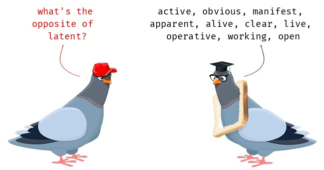
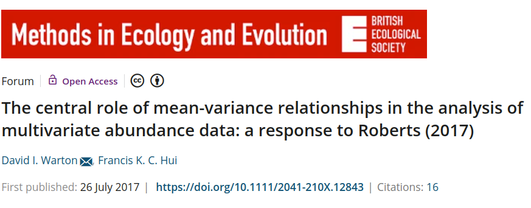
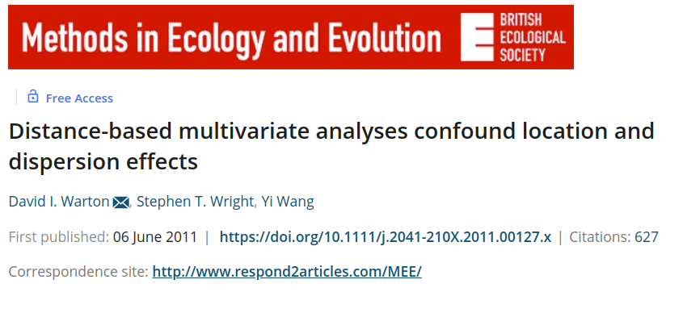
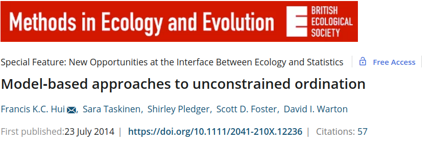
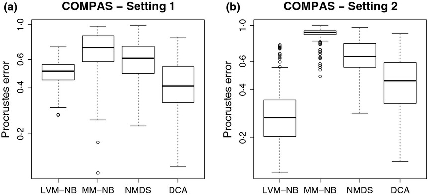
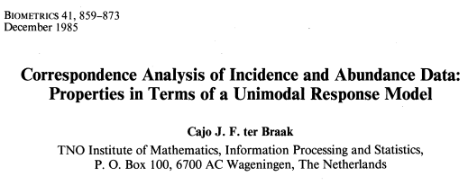
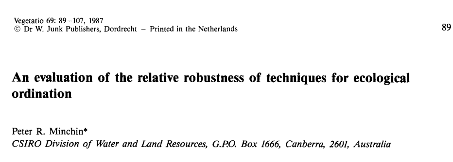
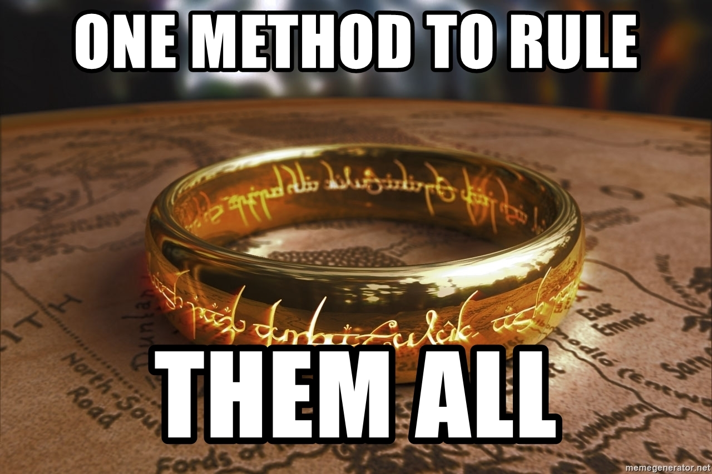

```{r setup, include=FALSE, message = FALSE}
library(knitr)

default_source_hook <- knit_hooks$get('source')
default_output_hook <- knit_hooks$get('output')

knit_hooks$set(
  source = function(x, options) {
    paste0(
      "\n::: {.codebox data-latex=\"\"}\n\n",
      default_source_hook(x, options),
      "\n\n:::\n\n")
  }
)

knit_hooks$set(
  output = function(x, options) {
    paste0(
      "\n::: {.codebox data-latex=\"\"}\n\n",
      default_output_hook(x, options),
      "\n\n:::\n\n")
  }
)

knitr::opts_chunk$set(echo = TRUE)
library(gllvm)
```

# Outline

What should I cover in this workshop

- Model-based ordination
- Rotation (and post-hoc rotation)
- Variation explained
- Adding row-effects (and what role it plays)
- Conditioning
- Compositional data (or rather, different data types)
- Double-zero problem

## Questions so far?

\center

{width=40%}

## Outline

...

# Ordination

Goodall (1954) introduced the word "ordination"

1) Ordination summarizes data
2) Ordination **embeds** in a low-dimensional space
3) Ordination **orders** samples and species

## Ordination

\textbf{Goal}: to explore co-occurrence patterns \newline
\textbf{Problem}: data forms high-dimensional space

\columnsbegin
\column{0.6\textwidth}
\begin{itemize}
\item Why do species co-occur?
\begin{itemize}
  \item Similar environmental preferences
  \item Similar history in the environment
  \item Might results in \textit{Interactions}
\end{itemize}
\item But sometimes we lack measurements of the environment
\item Thus cannot test anything
\end{itemize}

\column{.4\textwidth}
\center
```{r,out.width="70%",out.height="70%",fig.cap="NIBIO", echo = FALSE}
knitr::include_graphics("heath.jpg")
```
\columnsend


## The ecological process

\textbf{Ecological gradient theory informs us about the process}

- Type of response curve
- Measured and/or unmeasured components
- Spatial and/or temporal components
- Functional traits or Phylogeny
- Et cetera.

In contrast to traditional ordination methods, we have a more process-based view (sampling process and ecological process)

## Gradients


\footnotesize

There are different types of gradient, for example:

\normalsize

- Environmental gradient
- Complex ecological gradient
- Coenoclines

## Ordination axes

"Ordination axis" has become synonymous to "latent variable"



\centering

**In essence: an unobserved gradient**

## Ecological gradients

\vspace*{\baselineskip}

"Few major complex ecological gradients normally account for most of the variation in species composition."  \tiny (Halvorsen, 2012) \normalsize

\pause

\vspace*{\baselineskip}

Which is synonymous to saying "we can probably get a way with fitting a JSDM using only a few dimensions"

## Ordination as latent variable model

Many ordination methods are thought of as implementing a latent variable model

- [ter Braak (1985)](https://www.jstor.org/stable/2530959?origin=crossref)
- Jongman et al. (1995)
- [van der Veen et al. (2022, section 3 chapter 1)](https://ntnuopen.ntnu.no/ntnu-xmlui/handle/11250/2980780)

\pause

They approximately implement:

\begin{equation}
y_{ij} = \beta_{0j} + \textbf{u}_i^\top\symbf{\gamma}_j
\end{equation}

This makes GLLVMs a framework for many types of ordination, with foundations in existing methods.

\tikzset{
  mybox/.style={
    draw=red,
    very thick,
    rectangle,
    rounded corners,
    inner sep=10pt,
    fill = white,
    text width = 0.8\paperwidth
  }
}
    
\pause
\begin{tikzpicture}[remember picture, overlay]
\node[mybox] at (current page.center){The main issue? We do not know how approximate it is! We cannot validate!};
\end{tikzpicture}

## Classical ordination

Traditionally the go-to method for multivariate analysis

**From $p$ columns to $d << m$ dimensions**

- Principal Component Analysis \footnotesize (PCA; Pearson 1901)
- Factor Analysis \footnotesize (FA; Spearman 1904)
- Correspondence Analysis \footnotesize (CA; Hirschfeld 1935)
- Non-metric Multidimensional Scaling \footnotesize (NMDS; Kruskal 1964a,b)
- Principal Coordinate Analysis \footnotesize (PCoA; Gower 1967)
- Detrended Correspondence Analysis \footnotesize (DCA; Hill and Gauch 1980)

## Main benefits of these methods

1) Easy to use
2) Loads of resources
3) Isuess, artefacts, usecases are all well known
4) Permutation testing is readily available
5) Variance partitioning is straightforward

## Problems with classical methods

```{r, out.width="70%",fig.align="center", echo = FALSE} 

```

```{r, out.width="70%",fig.align="center", echo  =FALSE} 

```

## Validation

A "bad" looking ordination plot has often been used as indicator that the ordination method does not do well.

- PCA: horseshoe effect
- CA: arch effect
- DCA: tongue effect (and very heuristic)
- PCoA: similar to PCA
- NMDS: no species effects, no variation explained, no hypothesis testing, \tiny I can go on

Small eigenvalues: also bad.

# Model-based ordination

## Model-based ordination

\begin{center}
\textbf{Suggested to use Generalized Linear Latent Variable Models for unconstrained ordination}
\end{center}

```{r, echo=F, fig.align="center", out.width="100%", echo = FALSE}

```

Building on a long history of using latent variables in ecology (e.g., ter Braak 1985)

## Unconstrained ordination

\centering

```{r, out.width="31%",out.height="31%", echo = FALSE}
knitr::include_graphics("modelbased_francis1.jpg")
knitr::include_graphics("modelbased_francis2.jpg")
```

```{r, out.width="50%",out.height="50%", echo = FALSE}

```

\footnotesize Figures from **Hui et al. 2015**

## Generalised Linear Latent Variable Model

Unlike in the JSDM, model-based ordination has a focus on the latent variables. The model is:

\begin{equation}
\eta_{ij} = \beta_{0j} + \textbf{u}_i^\top\symbf{\gamma}_j
\end{equation}

but now, we have a much stronger focus on the lower dimensions. And the ordination axis can be treated as fixed or random effect (but usually random).

## Conditioning

In classical method, we can use `Condition` to  remove variation due to a covariate from the ordination. Here, we add an effect outside of the ordination:

\begin{equation}
\eta_{ij} = \beta_{0j} + \tikzmarknode{t1}{\highlight{grey}{...}} + \textbf{u}_i^\top\symbf{\gamma}_j
\end{equation}

\begin{tikzpicture}[overlay,remember picture]
        \draw[->] ([yshift = -0.8cm]t1.south) -- (t1);
\end{tikzpicture}

\tikzmarknode{n1}{Which can be a fixed or random effect (fixed in classical ordination)}


## So how is this different from JSDM

1. Ordination and JSDM use the same statistical framework (GLLVMs)
2. The models take a different angle (associations versus latent variables)
3. JSDM \textbf{can} be an LVM, ordination \textbf{is} an LVM

## JSDM vs. ordination

\centering

\textcolor{red}{JSDMs build more heavily on SDMs than on traditional multivariate analysis} \vspace*{0.5\baselineskip} \newline
\textcolor{red}{Ordination methods have been criticised for being too
descriptive rather than predictive nature}\newline
\hfill\footnotesize Ovaskainen and Abrego 2021 \normalsize

\pause

<!-- **but JSDMs leverage from FA, an ordination method, and they do not even cite Walker and Jackson 2011** \newline -->
**ordination did it first** \footnotesize Walker and Jackson 2011 \normalsize

## JSDM vs. ordination

The differences is in how we think of the model:

- Do we formulate on the basis of latent variables or associations
- Do we look at patterns in the ordination, or patterns on a map?
- Do we believe the "axes" have meaning, or not?
- The scale at which we operate: local or macroecological
- Is the **the sampling process** considered?

\pause

\centering

\textcolor{red}{Both of the angles have a lot to teach us about community ecology}

## A new approach!..or is it?

\begin{itemize}
\itemsep-0.5em
\item Community ecology has been doing it for a hundred years
\item e.g. Forbes (1907) or Goodall (1954)
\item Walker and Jackson (2011): Random-effects ordination!
\item Hui et al. (2015): Model-based unconstrained ordination
\end{itemize}

```{r out.width="70%",fig.align="center", echo = FALSE} 

```

## GLLVMs vs. classical ordination: main differences

\columnsbegin
\column{0.7\textwidth}

1) GLLVMs have a real model
2) GLLVMs incorporate distributions, not distances
3) There are no eigenvalues (but there is variance)
4) Number of dimensions are set \emph{a-priori} as in NMDS
5) Latent variables are found by "best fit"
6) You might not get the same solution every time
7) Forget about permutation testing
8) We do not care much about rotation
9) $\scalebox{3}{\to}$ \normalsize

\column{0.3\textwidth}


\columnsend


## Rotation and orthogonality

Ordination methods are defined by their rotation (except NMDS?), here:

- Latent variables are orthogonal \textbf{a-priori}
- The latent variables are \textbf{not} maximum variance-rotated
- \textbf{A-posteriori} the latent variables are not orthogonal

We can rotate them afterwards in whatever manner we want, with the \texttt{GPArotation} package

## When to use ordination

Mostly when we want to do dimension reduction. But also when:

\begin{enumerate}
\item We want to determine latent variables
\begin{itemize}
\item Especially when we have not measured the environment
\end{itemize}
\item \textbf{We have too sparse data to estimate species effects}
\item We want to make pretty pictures
\end{enumerate}

## Classifying ordination 

\begin{center}
\textbf{\textcolor{red}{There are many ways to group ordination methods}}
\end{center}

- Indirect or direct
- Linear or unimodal
- Unconstrained or constrained
- Simple-method or distance-based

## Gradient analysis

\textbf{Indirect gradient analysis}: patterns in species composition that may be due to environment, but without studying environmental variables \newline
\textbf{Direct gradient analysis}: estimate how species are affected by environmental variables\newline

\textcolor{red}{Both are used to analyze patterns in ecological communities}

## Unconstrained ordination

Used to: 

- Visualize patterns in data
- Draw 2D plots
- Generate hypotheses
- Explore drivers of community composition

\centering

\textcolor{red}{\textbf{To infer environmental conditions from species relationships}}

# Plot

## Reading an Ordination plot

```{r ord1, echo = FALSE, fig.height = 6, warning=FALSE, fig.align="center", dev = "png", fig.show = "hide"}
mu1 <- -1
mu2 <- 0.5
mu11 <- 1
mu21 <- 1.5
parold<-par()
par(mar=c(5, 5, 0.5, 2) + 0.1)
plot(c(mu1,mu2),c(mu11,mu21),xlab="Dimension 1", ylab="Dimension 2",xaxt="n",yaxt="n",xlim=c(-2,2),ylim=c(-2,2), cex.lab=1.8,type = "n")
abline(v=0,h=0,col="red",lty="dashed", lwd = 1.5)
points(x=mu1,y=mu11,pch=20,col="blue",cex=3)
text(x=mu1,y=mu11,labels = "Species 1",col="blue",pos = 3, cex = 2)
points(x=mu2,y=mu21,pch=20,col="green",cex=3)
text(x=mu2,y=mu21,labels = "Species 2",col="green",pos = 3, cex = 2)
box()
text(-1,1.5,labels=1,col="black", cex = 2)
text(0,2,labels=2,col="black", cex = 2)
text(1,-1,labels=3,col="black", cex = 2)
text(1.2,1.5,labels=4,col="black", cex = 2)
text(-1.5,-1.5,labels=5,col="black", cex = 2)
library(shape)
par(parold)
```

\columnsbegin
\column{0.5\textwidth}
\footnotesize
\begin{itemize}
\item Ordination plots capture the main patterns in the data
\item Two coordinates close together are similar
\item Close sites have similar community composition
\item Close species have similar niches
\item Distance in the ordination plot is analogous to correlation of JSDM
\item We usually assume the environment drives patterns in an ordination 
\end{itemize}
\column{0.5\textwidth}
\includegraphics{ModelbasedOrdination_files/figure-beamer/ord1-1.png}
\columnsend

## Ordination plot

```{r ord2, echo = FALSE, fig.height = 6, warning=FALSE, fig.align="center", dev = "png", fig.show = "hide"}
mu1 <- -1
mu2 <- 0.5
mu11 <- 1
mu21 <- 1.5
parold<-par()
par(mar=c(5, 5, 0.5, 2) + 0.1)
plot(c(mu1,mu2),c(mu11,mu21),xlab="Dimension 1", ylab="Dimension 2",xaxt="n",yaxt="n",xlim=c(-2,2),ylim=c(-2,2), cex.lab=1.8,type = "n")
abline(v=0,h=0,col="black",lty="dashed", lwd = 1.5)
points(x=mu1,y=mu11,pch=20,col="blue",cex=3)
text(x=mu1,y=mu11,labels = "Species 1",col="blue",pos = 3, cex = 2)
points(x=mu2,y=mu21,pch=20,col="green",cex=3)
text(x=mu2,y=mu21,labels = "Species 2",col="green",pos = 1, cex = 2)
text(-1,1.5,labels=1,col="black", cex = 2)
text(0,2,labels=2,col="black", cex = 2)
text(1,-1,labels=3,col="black", cex = 2)
text(1.2,1.5,labels=4,col="black", cex = 2)
text(-1.5,-1.5,labels=5,col="black", cex = 2)
arrows(x0=0,y0=0,x1=0.2,y1=0.2, length=0.3, col = "red", lwd = 1.5)
arrows(x0=0,y0=0,x1=-0.5,y1=0.5, length=0.3, col = "red", lwd = 1.5)
arrows(x0=0,y0=0,x1=0.1,y1=-2, length=0.3, col = "red", lwd = 1.5)

library(shape)
par(parold)
```


\columnsbegin
\column{0.5\textwidth}
\footnotesize
\begin{itemize}
\item We interpret sites relative to sites, and species to species \tiny (so not usually species to sites) \footnotesize
\item Coordinates are interpreted relative to the axes (LVs)
\item In constrained ordination, arrows represent the axes-environment association
\item Long arrows have a (relative) stronger effect
\item The angle of arrows to the axes represent the association \tiny (orthogonal with no association) \footnotesize
\item So, covariates help interpret the ordination
\end{itemize}
\column{0.5\textwidth}
\includegraphics{ModelbasedOrdination_files/figure-beamer/ord2-1.png}
\columnsend

# Example 1

## Example: Dutch Dune data

\footnotesize

```{r, echo = FALSE, eval = TRUE, message=FALSE}
library(vegan)
data(dune); Y <- dune
data(dune.env); X <- dune.env
knitr::kable(head(dune, 10), format="latex", booktabs = T)
```

\normalsize

- A classic dataset, originally by Jongman et al. (1995)
- Ordinal classes for 30 plant species at 20 sites
- 5 covariates; A1, Moisture, Management, Use, Manure

## The ordinal model: proportional odds

More commonly, the categories are ordered.

\begin{equation}
\text{pr}(y_{ij}\leq k) = \Phi(\tau_{jk} - \eta_{ij})
\end{equation}

and 

\begin{equation}
\text{pr}(y_{ij} = k) = \Phi(\tau_{jk} - \eta_{ij}) - \Phi(\tau_{jk-1} - \eta_{ij})
\end{equation}

\footnotesize

- $\tau_{jk}$ are cut-off parameters that induce ordering
- $\tau_{jk}$ requires having at least one observation in every category
- If we have missing classes, we can re-order and skip some
- Alternatively, we can assume $\tau_{jk} = \tau_k$; same cut-offs for all species
- Controlled with `zeta.struc =  common` but defaults to `species`

\textcolor{red}{Called "proportional odds" because the effects $\eta_{ij}$ are the same for all categories}

## Example: unconstrained ordination

\footnotesize

```{r duneord1, cache = TRUE, dev ="png", fig.show = "hide", echo = -2, fig.height = 6}
model1 <- gllvm(Y, num.lv = 2, family = "ordinal")
gllvm::ordiplot(model1, s.colors =  colorRampPalette(c("mediumspringgreen", "blue"))(10)[(as.numeric(cut(X$A1, 10)))], s.cex = 2)
```

\normalsize

## Example: making an ordination plot

\footnotesize

```{r duneord2, fig.height = 6, echo = - c(2:5), dev = "png", fig.show = "hide", message=FALSE}
gllvm::ordiplot(model1, biplot = TRUE, s.cex = 2)
invisible(capture.output(nmds <- metaMDS(dune)))
ca <- cca(dune)
plot(nmds, display = "sites", cex = 2, type = "t") # annoying that the defaults aren't the same
plot(ca, display = "sites", cex =  2)
```

\columnsbegin
\column{0.5\textwidth}
\textbf{GLLVM}
\includegraphics{ModelbasedOrdination_files/figure-beamer/duneord2-1.png}
\column{0.5\textwidth}
\textbf{CA}
\includegraphics{ModelbasedOrdination_files/figure-beamer/duneord2-3.png}
\textbf{NMDS}
\includegraphics{ModelbasedOrdination_files/figure-beamer/duneord2-2.png}
\columnsend

## Example: conditioning or "residual" ordination

\footnotesize

```{r duneord3, cache = TRUE, echo = -2, dev = "png", warning=FALSE, fig.height = 6, fig.show = "hide"}
model2 <- gllvm(Y, X = X, formula = ~scale(A1), num.lv = 2, family = "ordinal", starting.val = "zero")
gllvm::ordiplot(model2, s.colors =  colorRampPalette(c("mediumspringgreen", "blue"))(10)[(as.numeric(cut(X$A1, 10)))], s.cex =2)
```

\columnsbegin
\column{0.5\textwidth}
\textbf{Without A1 covariate}
\includegraphics{ModelbasedOrdination_files/figure-beamer/duneord1-1.png}
\column{0.5\textwidth}
\textbf{With A1 covariate}
\includegraphics{ModelbasedOrdination_files/figure-beamer/duneord3-1.png}
\columnsend

## Example: conditioning or "residual" ordiantion

\footnotesize 

```{r}
cor(getLV(model1), X$A1)
cor(getLV(model2), X$A1)
```

The ordination of the model including the covariate is uncorrelated with the covariate.

## Example: prediction

```{r, echo = FALSE, fig.height = 5}
A1new <- seq(0,max(X$A1),length.out=100)
preds <- predict(model2, newX=data.frame(A1=A1new), level = 0, type = "response")[,,1]
plot(1,xlim=c(min(A1new),max(A1new)),ylim=c(0,1), xlab = "A1", ylab="Predicted probability", cex.lab=1.5, cex = 2, type = "n")
lines(A1new, preds[1,], lwd = 2, lty = 1)
lines(A1new, preds[2,], lwd = 2, lty = 2)
lines(A1new, preds[3,], lwd = 2, lty = 3)
lines(A1new, preds[4,], lwd = 2, lty = 4)
lines(A1new, preds[5,], lwd = 2, lty = 5)
lines(A1new, preds[6,], col = "orange", lwd = 2, lty = 1)
lines(A1new, preds[7,], col = "orange", lwd = 2, lty = 2)
lines(A1new, preds[8,], col = "orange", lwd = 2, lty = 3)
lines(A1new, preds[9,], col = "orange", lwd = 2, lty = 4)
lines(A1new, preds[10,], col = "orange", lwd = 2, lty = 5)
```

\footnotesize

Note that ordering has introduces some shapes. \newline
Class 1-5: black with linetype 1-5 \newline
Class 6-10: orange with linetype 6-10 \newline

# Good ordinations

## What makes for a good ordination method?

[Michael Palmer:](https://ordination.okstate.edu/ideal.htm)

\begin{enumerate}
\item \alt<2>{\normalsize It recovers gradients without distortion.}{\tiny It recovers gradients without distortion.}
\item \alt<3>{\normalsize If clusters exist in nature, this should be obvious in the ordination.}{\tiny If clusters exist in nature, this should be obvious in the ordination.}
\item \alt<4>{\normalsize It does not produce clusters which do not exist.}{\tiny It does not produce clusters which do not exist.}
\item \alt<5>{\normalsize It gives the same result every time for a given data set.}{\tiny It gives the same result every time for a given data set.}
\item \alt<6>{\normalsize There is a unique solution.}{\tiny There is a unique solution.}
\item \alt<7>{\normalsize Ecological similarity is related to proximity in ordination space.}{\tiny Ecological similarity is related to proximity in ordination space.}
\item \alt<8>{\normalsize Scaling of axes is related to beta diversity.}{\tiny Scaling of axes is related to beta diversity.}
\item \alt<9>{\normalsize "Signal" and "Noise" are easily separated.}{\tiny "Signal" and "Noise" are easily separated.}
\item \alt<10>{\normalsize You do not need to pre-specify number of axes.}{\tiny You do not need to pre-specify number of axes.}
\item \alt<11>{\normalsize The solution is the same, no matter how many dimensions one chooses to look at.}{\tiny The solution is the same, no matter how many dimensions one chooses to look at.}
\item \alt<12>{\normalsize Unless by choice, all sites/stands/quadrats are treated equally.}{\tiny Unless by choice, all sites/stands/quadrats are treated equally.}
\item \alt<13>{\normalsize The solution does not take much computer time.}{\tiny The solution does not take much computer time.}
\item \alt<14>{\normalsize The method is robust: it works well for short and for long gradients, for low and high noise, for sparse and full matrices, for big and for small data sets, for species-rich and species-poor systems.}{\tiny The method is robust: it works well for short and for long gradients, for low and high noise, for sparse and full matrices, for big and for small data sets, for species-rich and species-poor systems.}
\item \alt<15>{\normalsize For the mathematician: elegant.}{\tiny For the mathematician: elegant.}
\item \alt<16>{\normalsize For the ecologist: available, inexpensive, and easy to understand.}{\tiny For the ecologist: available, inexpensive, and easy to understand.}
\end{enumerate}

## What makes for a good ordination method? \tiny a shorter list \normalsize

Gauch (1982):

Three criteria are basic for ordination techniques.

(1) Effective (realistic in assumptions, suitably convey information)
(2) Robust (to real data)
(3) Practical (computer time)

## 1) Effective

- realistic in assumptions
- suitably conveys information

We can test assumptions in GLLVMs, or adjust the method to relax them.

## 2) Robust

Classical methods have artefacts, in model-based ordination they can crop-up: but we adjust the model (non-linearity)

# Example 2

In 1987, Minchin concluded that NMDS was the "most robust" ordination method, as it allowed deviation from a parametric response model.

- 56 "Species"
- 48 "Sites"
- Simulated from COMPAS with a skewed response model



```{r, echo = FALSE}
Y <- read.csv("../data/Minchin_2b.csv")[,-1]
Y[is.na(Y)]<-0
```

## Example 2: fitting the model

\footnotesize

```{r ordim1, echo = c(-1, -3,-4), cache = TRUE, dev = "png", fig.show = "hide"}
invisible(capture.output(TMB::openmp(parallel::detectCores()-1, autopar = TRUE)))
model3 <- gllvm(Y, num.lv = 2, family = "poisson", sd.errors = FALSE, maxit = 10e6)
gllvm::ordiplot(model3,s.col=rep(1:4,each=12), pch=rep(1:4,each=12), s.cex = 1.5, symbols = TRUE)
plot(model3, which = 1)
```

\columnsbegin
\column{0.5\textwidth}
\includegraphics{ModelbasedOrdination_files/figure-beamer/ordim1-1.png}
\column{0.5\textwidth}
\includegraphics{ModelbasedOrdination_files/figure-beamer/ordim1-2.png}
\columnsend

## Example 2: we "just" change the model!

\footnotesize

```{r ordim2, echo = c(-1, -3,-4), cache = TRUE, dev = "png", fig.show = "hide"}
model4 <- gllvm(Y, num.lv = 2, family = "negative.binomial", sd.errors = FALSE, maxit = 10e6, row.eff = "random", n.init = 3)
gllvm::ordiplot(model4, rotate = FALSE, s.col=rep(1:4,each=12), pch=rep(1:4,each=12), s.cex = 1.5, symbols=TRUE)
plot(model4, which = 1)
```

\columnsbegin
\column{0.5\textwidth}
\includegraphics{ModelbasedOrdination_files/figure-beamer/ordim2-1.png}
\column{0.5\textwidth}
\includegraphics{ModelbasedOrdination_files/figure-beamer/ordim2-2.png}
\columnsend

## Example 2: the competition

```{r, echo=F, message=F, warning=F, fig.align="center", fig.height = 6, echo = FALSE}
library(vegan)
# Download the minchin dataset
minchin <- read.csv("https://raw.githubusercontent.com/BertvanderVeen/Examples/master/Minchin87_2b_counts.csv") # Data frmo minchin 1987
# All missing values are zeros
minchin[is.na(minchin)] <- 0
minchin<-minchin[,-1]
# We will first do some classical ordination methods
# Correspondence analysis
CA_minchin <- cca(minchin)
# Detrended CA
DCA_minchin <- decorana(minchin)
logDCA_minchin <- decorana(log1p(minchin))

# NMDS
NMDS_minchin <- metaMDS(minchin, k = 2, trace = F)
par(mfrow=c(2,2))
# Let's have a look at the results
plot(scores(CA_minchin,display="sites"), main="CA",col=rep(1:4,each=12),pch=rep(1:4,each=12), cex = 1.5) # arch effect
plot(scores(DCA_minchin)[,1:2], main="DCA",col=rep(1:4,each=12),pch=rep(1:4,each=12), cex = 1.5) # This has the tongue effect
plot(scores(logDCA_minchin, display="sites"), main="log-DCA",col=rep(1:4,each=12),pch=rep(1:4,each=12), cex = 1.5) # suggestion from paper CTB
plot(NMDS_minchin$points, main="NMDS",col=rep(1:4,each=12),pch=rep(1:4,each=12), cex = 1.5) # This looks pretty OK!
```

# Summary

## So what if I

- Have an arh(-like) effect
- Have non-linear responses (later today)
- Have data type ...?
- Have double-zeros
- Have compositional data

\pause

\centering

\textcolor{red}{You adjust to model to acommodate whatever property of the data}

## Unconstrained or constrained

a) Unconstrained ordination: explore main drivers of variation \newline (i.e., indirect gradient analysis)
b) Constrained ordination: filter variation due to covariates \newline (i.e., gradient analysis)
c) \textcolor{grey}{(Concurrent ordination)}

Unconstrained is mostly descriptive, constrained can also be used for hypothesis testing.\newline
Both can be understood as estimating latent variables.\newline

## Model-based ordination

\centering



## Group-level ordination

Not covered, but use `lvCor` or `num.RR` (more later)