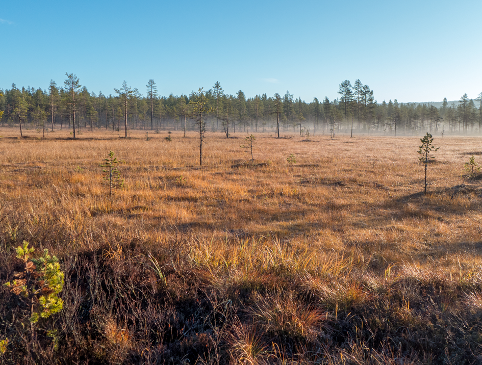
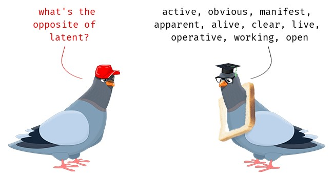
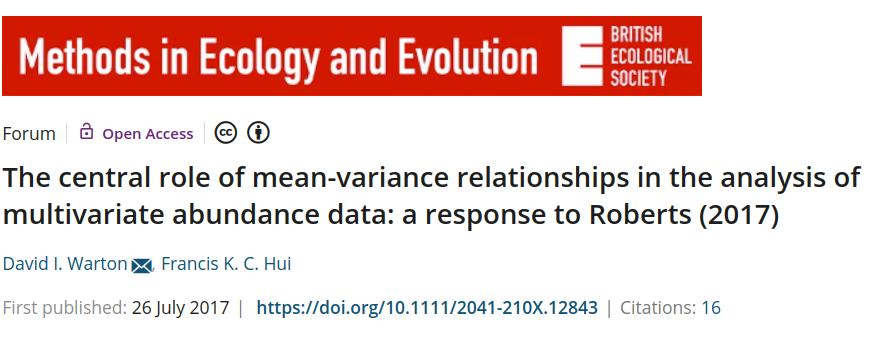
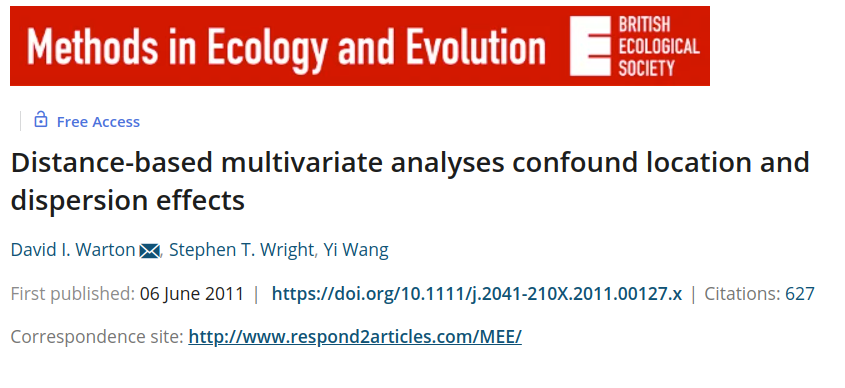
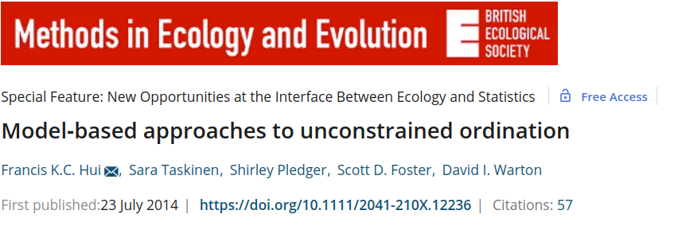
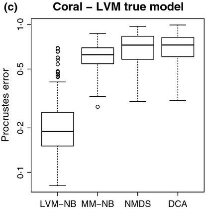
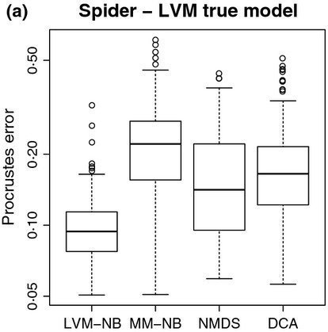
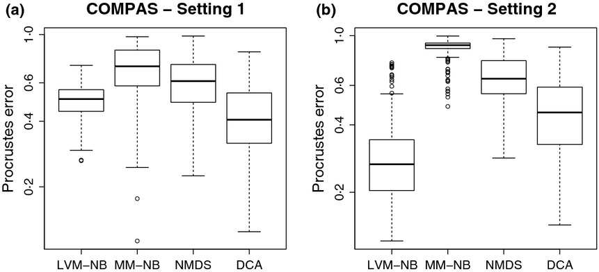
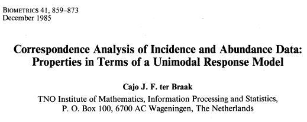

```{r setup, include=FALSE, message = FALSE}
library(knitr)

default_source_hook <- knit_hooks$get('source')
default_output_hook <- knit_hooks$get('output')

knit_hooks$set(
  source = function(x, options) {
    paste0(
      "\n::: {.codebox data-latex=\"\"}\n\n",
      default_source_hook(x, options),
      "\n\n:::\n\n")
  }
)

knit_hooks$set(
  output = function(x, options) {
    paste0(
      "\n::: {.codebox data-latex=\"\"}\n\n",
      default_output_hook(x, options),
      "\n\n:::\n\n")
  }
)

knitr::opts_chunk$set(echo = TRUE)
library(gllvm)
```

# Outline

- Model-based (unconstrained) ordination: gradients, latent variables, reading plots
- Ordination with covariates: constrained and concurrent ordination
- Taking information out: conditioning, partial ordination, and model specification

## Questions so far?

\center

{width=40%}

# Ordination

## Ordination

Goodall (1954) introduced the word "ordination"

1) Ordination summarizes data
2) Ordination **embeds** in a low-dimensional space
3) Ordination **orders** samples and species

<!-- double zero not covered yet -->


## Why ordination?

\textbf{Goal}: to explore co-occurrence patterns \newline
\textbf{Problem}: data forms high-dimensional space

\columnsbegin
\column{0.6\textwidth}
\begin{itemize}
\item Why do species co-occur?
\begin{itemize}
  \item Similar environmental preferences
  \item Similar history in the environment
  \item Might result in \textit{Interactions}
\end{itemize}
\item But sometimes we lack measurements of the environment
\item Thus cannot test anything
\end{itemize}

\column{.4\textwidth}
\center
```{r,out.width="70%",out.height="70%",fig.cap="NIBIO", echo = FALSE}

```
\columnsend


## The ecological process

\textbf{Ecological gradient theory informs us about the process}

- Type of response curve
- Measured and/or unmeasured components
- Spatial and/or temporal components
- Functional traits or Phylogeny
- Et cetera.

In contrast to traditional ordination methods, we have a more process-based view (sampling process and ecological process)

## Gradients


\footnotesize

There are different types of gradient, for example:

\normalsize

- Environmental gradient
- Complex ecological gradient
- Coenoclines

## Ordination axes

"Ordination axis" has become synonymous to "latent variable"

{width=80%}

\centering

**In essence: an unobserved gradient**

## Ecological gradients

\vspace*{\baselineskip}

"Few major complex ecological gradients normally account for most of the variation in species composition."  \tiny (Halvorsen, 2012) \normalsize

\pause

\vspace*{\baselineskip}

Which is synonymous to saying "we can probably get away with fitting a JSDM using only a few dimensions"

## Ordination as latent variable model

Many ordination methods are thought of as implementing a latent variable model

- [ter Braak (1985)](https://www.jstor.org/stable/2530959?origin=crossref)
- Jongman et al. (1995)
- [van der Veen et al. (2022, section 3 chapter 1)](https://ntnuopen.ntnu.no/ntnu-xmlui/handle/11250/2980780)

\pause

They approximately implement:

\begin{equation}
y_{ij} = \beta_{0j} + \textbf{u}_i^\top\symbf{\gamma}_j
\end{equation}

This makes GLLVMs a framework for many types of ordination, with foundations in existing methods.

\tikzset{
  mybox/.style={
    draw=red,
    very thick,
    rectangle,
    rounded corners,
    inner sep=10pt,
    fill = white,
    text width = 0.8\paperwidth
  }
}
    
\pause
\begin{tikzpicture}[remember picture, overlay]
\node[mybox] at (current page.center){The main issue? We do not know how approximate it is! We cannot validate!};
\end{tikzpicture}

## Classical ordination

Traditionally the go-to method for multivariate analysis

**From $p$ columns to $d << m$ dimensions**

- Principal Component Analysis \footnotesize (PCA; Pearson 1901)
- Factor Analysis \footnotesize (FA; Spearman 1904)
- Correspondence Analysis \footnotesize (CA; Hirschfeld 1935)
- Non-metric Multidimensional Scaling \footnotesize (NMDS; Kruskal 1964a,b)
- Principal Coordinate Analysis \footnotesize (PCoA; Gower 1967)
- Detrended Correspondence Analysis \footnotesize (DCA; Hill and Gauch 1980)

## Main benefits of these methods

1) Easy to use
2) Loads of resources
3) Issues, artefacts, use cases are all well known
4) Permutation testing is readily available
5) Variance partitioning is straightforward

## Problems with classical methods

```{r, out.width="70%",fig.align="center", echo = FALSE} 

```

```{r, out.width="70%",fig.align="center", echo  =FALSE} 

```

## Validation

A "bad" looking ordination plot has often been used as indicator that the ordination method does not do well.

- PCA: horseshoe effect
- CA: arch effect
- DCA: tongue effect (and very heuristic)
- PCoA: similar to PCA
- NMDS: no species effects, no variation explained, no hypothesis testing, \tiny I can go on

Small eigenvalues: also bad.

# Model-based ordination

## Model-based ordination

\begin{center}
\textbf{Suggested to use Generalized Linear Latent Variable Models for unconstrained ordination}
\end{center}

```{r, echo=F, fig.align="center", out.width="100%", echo = FALSE}

```

Building on a long history of using latent variables in ecology (e.g., ter Braak 1985)

## Unconstrained ordination

\centering

```{r, out.width="31%",out.height="31%", echo = FALSE}


```

```{r, out.width="50%",out.height="50%", echo = FALSE}

```

\footnotesize Figures from **Hui et al. 2015**

## Generalised Linear Latent Variable Model

Unlike in the JSDM, model-based ordination has a focus on the latent variables. The model is:

\begin{equation}
\eta_{ij} = \beta_{0j} + \textbf{u}_i^\top\symbf{\gamma}_j
\end{equation}

but now, we have a much stronger focus on the lower dimensions. And the ordination axis can be treated as fixed or random effect (but usually random).

## So how is this different from JSDM

1. Ordination and JSDM use the same statistical framework (GLLVMs)
2. The models take a different angle (associations versus latent variables)
3. JSDM \textbf{can} be an LVM, ordination \textbf{is} an LVM

## JSDM vs. classical multivariate analysis

\begin{table}[ht]
\footnotesize
\begin{tabularx}{\linewidth}{>{\raggedleft\arraybackslash}p{2.3cm}>{\raggedright\arraybackslash}p{3.5cm}>{\raggedright\arraybackslash}p{4cm}}
\toprule
  & Classic & JSDM \\
\midrule
Focus       & Low-dimensional   & Distributions \\
Goal        & Inference         & Prediction \\
Data type   & Usually quantitative & Binary \\
Scale       & Local             & Regional \\
Covariates  & Environmental     & Bioclimatic \\
Presentation & Ordination diagram & Correlation plot/map \\
Audience    & Community ecologists & Macro ecologists \\
\bottomrule
\end{tabularx}
\end{table}

\pause

\centering

\textcolor{red}{Model-based ordination bridges these two worlds: it uses the JSDM framework with an explicit focus on latent structure and local scales.}

## JSDMs and ordination: the debate

\centering

\textcolor{red}{JSDMs build more heavily on SDMs than on traditional multivariate analysis} \vspace*{0.5\baselineskip} \newline
\textcolor{red}{Ordination methods have been criticised for being too
descriptive rather than of a predictive nature}\newline
\hfill\footnotesize Ovaskainen and Abrego 2021 \normalsize

\pause

<!-- **but JSDMs leverage from FA, an ordination method, and they do not even cite Walker and Jackson 2011** \newline -->
**ordination did it first** \footnotesize Walker and Jackson 2011 \normalsize

## JSDM vs. ordination

The differences are in how we think of the model:

- Do we formulate on the basis of latent variables or associations
- Do we look at patterns in the ordination, or patterns on a map?
- Do we believe the "axes" have meaning, or not?
- The scale at which we operate: local or macroecological
- Is the **the sampling process** considered?

\pause

\centering

\textcolor{red}{Both of the angles have a lot to teach us about community ecology}

## When to use ordination

Mostly when we want to do dimension reduction. But also when:

\begin{enumerate}
\item We want to determine latent variables
\begin{itemize}
\item Especially when we have not measured the environment
\end{itemize}
\item \textbf{We have too sparse data to estimate species effects}
\item We want to make pretty pictures
\end{enumerate}

## A new approach!..or is it?

\begin{itemize}
\itemsep-0.5em
\item Community ecology has been doing it for a hundred years
\item e.g. Forbes (1907) or Goodall (1954)
\item Walker and Jackson (2011): Random-effects ordination!
\item Hui et al. (2015): Model-based unconstrained ordination
\end{itemize}

```{r out.width="70%",fig.align="center", echo = FALSE} 

```

## GLLVMs vs. classical ordination: main differences

\columnsbegin
\column{0.7\textwidth}

1) GLLVMs have a real model
2) GLLVMs incorporate distributions, not distances
3) There are no eigenvalues (but there is variance)
4) Number of dimensions are set \emph{a-priori} as in NMDS
5) Latent variables are found by "best fit"
6) You might not get the same solution every time
7) Forget about permutation testing
8) We do not care much about rotation
9) $\scalebox{3}{\to}$ \normalsize

\column{0.3\textwidth}


\columnsend

## Classifying ordination 

\begin{center}
\textbf{\textcolor{red}{There are many ways to group ordination methods}}
\end{center}

- Indirect or direct
- Linear or unimodal
- Unconstrained or constrained
- Simple-method or distance-based

## Gradient analysis

\textbf{Indirect gradient analysis}: patterns in species composition that may be due to environment, but without studying environmental variables \newline
\textbf{Direct gradient analysis}: estimate how species are affected by environmental variables\newline

\textcolor{red}{Both are used to analyze patterns in ecological communities}

## Unconstrained ordination

Used to: 

- Visualize patterns in data
- Draw 2D plots
- Generate hypotheses
- Explore drivers of community composition

\centering

\textcolor{red}{\textbf{To infer environmental conditions from species relationships}}

# Plot

## Reading an ordination plot

```{r ord1, echo = FALSE, fig.height = 6, warning=FALSE, fig.align="center", dev = "png", fig.show = "hide"}
mu1 <- -1
mu2 <- 0.5
mu11 <- 1
mu21 <- 1.5
parold<-par()
par(mar=c(5, 5, 0.5, 2) + 0.1)
plot(c(mu1,mu2),c(mu11,mu21),xlab=NA, ylab=NA,xaxt="n",yaxt="n",xlim=c(-2,2),ylim=c(-2,2), cex.lab=1.8,type = "n")
abline(v=0,h=0,col="red",lty="dashed", lwd = 1.5)
text(x=-1, y=0.1, 'Dimension 1', col = "red", cex = 1.3)
text(y=-1, x=-0.1, 'Dimension 2', col = "red", cex = 1.3, srt = 90)

points(x=mu1,y=mu11,pch=20,col="blue",cex=3)
text(x=mu1,y=mu11,labels = "Species 1",col="blue",pos = 3, cex = 2)
points(x=mu2,y=mu21,pch=20,col="green",cex=3)
text(x=mu2,y=mu21,labels = "Species 2",col="green",pos = 3, cex = 2)
box()
text(-1,1.5,labels=1,col="black", cex = 2)
text(0,2,labels=2,col="black", cex = 2)
text(1,-1,labels=3,col="black", cex = 2)
text(1.2,1.5,labels=4,col="black", cex = 2)
text(-1.5,-1.5,labels=5,col="black", cex = 2)

# 45 rotated plot
mu1 <- -1
mu2 <- 0.5
mu11 <- 1
mu21 <- 1.5
parold<-par()
par(mar=c(5, 5, 0.5, 2) + 0.1)
plot(c(mu1,mu2),c(mu11,mu21),xlab=NA, ylab=NA,xaxt="n",yaxt="n",xlim=c(-2,2),ylim=c(-2,2), cex.lab=1.8,type = "n")
abline(a=0,b=1,col="red",lty="dashed", lwd = 1.5)
abline(a=0,b=-1,col="red",lty="dashed", lwd = 1.5)
text(x=(-1-0.1)/sqrt(2), y=(-1+0.1)/sqrt(2), 'Dimension 1', col = "red", cex = 1.3)
text(y=c(-1+0.1)/sqrt(2), x=(1-0.15)/sqrt(2), 'Dimension 2', col = "red", cex = 1.3)

points(x=(mu1-mu11)/sqrt(2),y=(mu1+mu11)/sqrt(2),pch=20,col="blue",cex=3)
text(x=(mu1-mu11)/sqrt(2),y=(mu1+mu11)/sqrt(2),labels = "Species 1",col="blue",pos = 3, cex = 2)
points(x=(mu2-mu21)/sqrt(2),y=(mu2+mu21)/sqrt(2),pch=20,col="green",cex=3)
text(x=(mu2-mu21)/sqrt(2),y=(mu2+mu21)/sqrt(2),labels = "Species 2",col="green",pos = 3, cex = 2)
box()
text((-1-1.5)/sqrt(2),(-1+1.5)/sqrt(2),labels=1,col="black", cex = 2)
text((0-2)/sqrt(2),(0+2)/sqrt(2),labels=2,col="black", cex = 2)
text((1+1)/sqrt(2),(1-1)/sqrt(2),labels=3,col="black", cex = 2)
text((1.2-1.5)/sqrt(2),(1.2+1.5)/sqrt(2),labels=4,col="black", cex = 2)
text((-1.5+1.5)/sqrt(2),(-1.5-1.5)/sqrt(2),labels=5,col="black", cex = 2)

# swapped axes
mu1 <- -1
mu2 <- 0.5
mu11 <- 1
mu21 <- 1.5
parold<-par()
par(mar=c(5, 5, 0.5, 2) + 0.1)
plot(c(mu2,mu1),c(mu21,mu11),xlab=NA, ylab=NA,xaxt="n",yaxt="n",xlim=c(-2,2),ylim=c(-2,2), cex.lab=1.8,type = "n")
abline(v=0,h=0,col="red",lty="dashed", lwd = 1.5)
text(x=-1, y=0.1, 'Dimension 2', col = "red", cex = 1.3)
text(y=-1, x=-0.1, 'Dimension 1', col = "red", cex = 1.3, srt = 90)

points(y=mu1,x=-mu11,pch=20,col="blue",cex=3)
text(y=mu1,x=-mu11,labels = "Species 1",col="blue",pos = 3, cex = 2)
points(y=mu2,x=-mu21,pch=20,col="green",cex=3)
text(y=mu2,x=-mu21,labels = "Species 2",col="green",pos = 3, cex = 2)
box()
text(y=-1,-1.5,labels=1,col="black", cex = 2)
text(y=0,-2,labels=2,col="black", cex = 2)
text(y=1,1,labels=3,col="black", cex = 2)
text(y=1.2,-1.5,labels=4,col="black", cex = 2)
text(y=-1.5,1.5,labels=5,col="black", cex = 2)

par(parold)
```

\columnsbegin
\column{0.5\textwidth}
\footnotesize
\begin{itemize}
\item Ordination plots capture the main patterns in the data
\item Two coordinates close together are similar
\item Close sites have similar community composition
\item Close species have similar niches
\item Distance in the ordination plot is analogous to correlation of JSDM
\item We usually assume the environment drives patterns in an ordination 
\end{itemize}
\column{0.5\textwidth}
\includegraphics[width=\linewidth]{ModelbasedOrdination_files/figure-beamer/ord1-1.png}
\columnsend

## Ordination plot

```{r ord2, echo = FALSE, fig.height = 6, warning=FALSE, fig.align="center", dev = "png", fig.show = "hide"}
mu1 <- -1
mu2 <- 0.5
mu11 <- 1
mu21 <- 1.5
parold<-par()
par(mar=c(5, 5, 0.5, 2) + 0.1)
plot(c(mu1,mu2),c(mu11,mu21),xlab="Dimension 1", ylab="Dimension 2",xaxt="n",yaxt="n",xlim=c(-2,2),ylim=c(-2,2), cex.lab=1.8,type = "n")
abline(v=0,h=0,col="black",lty="dashed", lwd = 1.5)
points(x=mu1,y=mu11,pch=20,col="blue",cex=3)
text(x=mu1,y=mu11,labels = "Species 1",col="blue",pos = 3, cex = 2)
points(x=mu2,y=mu21,pch=20,col="green",cex=3)
text(x=mu2,y=mu21,labels = "Species 2",col="green",pos = 1, cex = 2)
text(-1,1.5,labels=1,col="black", cex = 2)
text(0,2,labels=2,col="black", cex = 2)
text(1,-1,labels=3,col="black", cex = 2)
text(1.2,1.5,labels=4,col="black", cex = 2)
text(-1.5,-1.5,labels=5,col="black", cex = 2)
arrows(x0=0,y0=0,x1=0.2,y1=0.2, length=0.3, col = "red", lwd = 1.5)
arrows(x0=0,y0=0,x1=-0.5,y1=0.5, length=0.3, col = "red", lwd = 1.5)
arrows(x0=0,y0=0,x1=0.1,y1=-2, length=0.3, col = "red", lwd = 1.5)

par(parold)
```


\columnsbegin
\column{0.5\textwidth}
\footnotesize
\begin{itemize}
\item We interpret sites relative to sites, and species to species \tiny (so not usually species to sites) \footnotesize
\item Coordinates are interpreted relative to the axes (LVs)
\item In constrained ordination, arrows represent the axes-environment association
\item Long arrows have a (relative) stronger effect
\item The angle of arrows to the axes represent the association \tiny (orthogonal with no association) \footnotesize
\item So, covariates help interpret the ordination
\end{itemize}
\column{0.5\textwidth}
\includegraphics[width=\linewidth]{ModelbasedOrdination_files/figure-beamer/ord2-1.png}
\columnsend

## Rotation and orthogonality

Ordination methods are defined by their rotation (except NMDS?), here:

- Latent variables are orthogonal \textbf{a-priori}
- The latent variables are \textbf{not} maximum variance-rotated
- \textbf{A-posteriori} the latent variables are not orthogonal

\pause We can rotate them afterwards in whatever manner we want \footnotesize (e.g., with the \texttt{GPArotation} package) \normalsize. \pause \textcolor{red}{The model doesn't care.}

## Rotation of ordination

\only<1>{\includegraphics[width=\linewidth]{ModelbasedOrdination_files/figure-beamer/ord1-1.png}}
\only<2>{\includegraphics[width=\linewidth]{ModelbasedOrdination_files/figure-beamer/ord1-2.png}}
\only<3>{\includegraphics[width=\linewidth]{ModelbasedOrdination_files/figure-beamer/ord1-3.png}}

\only<3>{\vspace*{-\baselineskip} Our inference of site and species (dis)similarity remains the same.}

# Example 1

## Example: Dutch Dune data

\footnotesize

```{r, echo = FALSE, eval = TRUE, message=FALSE}
library(vegan)
data(dune); Y <- dune
data(dune.env); X <- dune.env
knitr::kable(head(dune, 10), format="latex", booktabs = T)
```

- A classic dataset, originally by Jongman et al. (1995)
- Ordinal classes for 30 plant species at 20 sites
- 5 covariates; A1, Moisture (5 groups), Management (4 groups), Use (3 groups), Manure (3 groups

## The ordinal model: cumulative probit

More commonly, the categories are ordered. \vspace*{-\baselineskip}

\begin{equation}
\text{pr}(y_{ij}\leq k) = \Phi(\tau_{jk} - \eta_{ij})
\end{equation}

and \vspace*{-\baselineskip}

\begin{equation}
\text{pr}(y_{ij} = k) = \Phi(\tau_{jk} - \eta_{ij}) - \Phi(\tau_{jk-1} - \eta_{ij})
\end{equation}

\footnotesize

- $\tau_{jk}$ are cut-off parameters that induce ordering
- $\tau_{jk}$ requires having at least one observation in every category
- If we have missing classes, we can re-order and skip some
- Alternatively, we can assume $\tau_{jk} = \tau_k$; same cut-offs for all species
- Controlled with `zeta.struc =  common` but defaults to `species`

\textcolor{red}{The effects $\eta_{ij}$ are the same for all categories}

## Example: unconstrained ordination

\footnotesize

```{r duneord1, cache = TRUE}
model1 <- gllvm(Y, num.lv = 2, family = "ordinal")
```

\normalsize

## Example: making an ordination plot

\tiny

```{r duneord2, fig.height = 10, dev = "png", fig.show = "hide", message=FALSE}
gllvm::ordiplot(model1, symbols = TRUE, 
                s.colors = model.matrix(~0+., dune.env)[,5]+1, 
                pch = model.matrix(~0+., dune.env)[,7]+16, s.cex = 4)
```

\columnsbegin
\column{0.5\textwidth}
\includegraphics[height=0.5\paperheight]{ModelbasedOrdination_files/figure-beamer/duneord2-1.png}
\column{0.5\textwidth}
\begin{itemize}
\item Color by Moisture 5
\item Shape by Management NM
\end{itemize}
\columnsend

## Example: comparing ordinations

\footnotesize

```{r duneord3, fig.height = 6, echo = - c(2:5), dev = "png", fig.show = "hide", message=FALSE, include = FALSE}
invisible(capture.output(nmds <- metaMDS(dune)))
ca <- cca(dune)
plot(ca, type = "none")
points(ca, col = model.matrix(~0+., dune.env)[,5]+1, pch= model.matrix(~0+., dune.env)[,7]+16 , cex = 4)
plot(nmds, type = "none")
points(nmds, col = model.matrix(~0+., dune.env)[,5]+1, pch= model.matrix(~0+., dune.env)[,7]+16 , cex = 4)
```

\columnsbegin
\column{0.5\textwidth}
\textbf{GLLVM}
\includegraphics[width=\linewidth]{ModelbasedOrdination_files/figure-beamer/duneord2-1.png}
\column{0.5\textwidth}
\textbf{CA}
\includegraphics[width=\linewidth]{ModelbasedOrdination_files/figure-beamer/duneord3-1.png}
\textbf{NMDS}
\includegraphics[width=\linewidth]{ModelbasedOrdination_files/figure-beamer/duneord3-2.png}
\columnsend

## Example: comparing ordinations (2)

\tiny

```{r duneproc, message=FALSE}
GLLVMscores <- getLV(model1)
CAscores <- vegan::scores(ca)
NMDSscores <- vegan::scores(nmds)
vegan::procrustes(GLLVMscores, CAscores, symmetric = TRUE)
vegan::procrustes(GLLVMscores, NMDSscores, symmetric = TRUE)
```


## Species-specific cut-offs

\tiny 

```{r mod2, cache = TRUE}
model2 <- gllvm(apply(Y, 2, function(x)as.numeric(as.factor(x))), num.lv = 2, family = "ordinal", n.init = 3)
```

\footnotesize

Can also explicitly be controlled with `zeta.struc = "common"` and `zeta.struc = "species"`

## Example: Comparing ordinations (3)

\footnotesize

```{r duneord4, fig.height = 10, dev = "png", fig.show = "hide", message=FALSE, echo = FALSE}
row.names(model2$lvs)<-1:nrow(model2$y)
gllvm::ordiplot(model2, symbols = TRUE, 
                s.colors = model.matrix(~0+., dune.env)[,5]+1, 
                pch = model.matrix(~0+., dune.env)[,7]+16, s.cex = 4)
```

\columnsbegin
\column{0.5\textwidth}
\textbf{Species-common cut-offs}
\includegraphics[width=\linewidth]{ModelbasedOrdination_files/figure-beamer/duneord2-1.png}
\column{0.5\textwidth}
\textbf{Species-specific cut-offs}
\includegraphics[width=\linewidth]{ModelbasedOrdination_files/figure-beamer/duneord4-1.png}
\columnsend

## Example: Comparing ordinations (4)

\tiny
```{r duneproc2, message=FALSE}
GLLVMscores2 <- getLV(model2)
vegan::procrustes(GLLVMscores, GLLVMscores2, symmetric = TRUE)
```

\footnotesize

```{r}
AIC(model1, model2)
```

Note: $1263-(150-97*2) =  1157$

# Tools

## Tools

What tools do we have for drawing conclusions from unconstrained ordinations?

- Visualizations
- Prediction
- Variation explained

## Prediction

We take our model to find out what happens under conditions that we have not observed. Here, with the latent variable.

## Example: prediction

\footnotesize
```{r}
lvs <- getLV(model1)
lv1new <- seq(from = min(lvs[,1]), to = max(lvs[,2]), length.out = 100)
preds <- predict(model1, newLV=data.frame(LV1 = lv1new, LV2 = 0), 
                 type = "response")
```

## Example: prediction

```{r dunepred1, echo = FALSE, fig.height = 6, warning=FALSE, dev = "png", dpi = 150, fig.show = "hide"}
spp = 2
plot(1,xlim=c(min(lvs[,1]),max(lvs[,2])),ylim=c(0,1.05), xlab = "LV1", ylab="Predicted probability", cex.lab=1.5, cex = 2, type = "n", main = paste0("Species: ", colnames(dune)[spp]))
lines(lv1new, preds[1,,spp], lwd = 2, lty = 1)
lines(lv1new, preds[2,,spp], lwd = 2, lty = 2)
lines(lv1new, preds[3,,spp], lwd = 2, lty = 3)
lines(lv1new, preds[4,,spp], lwd = 2, lty = 4)
lines(lv1new, preds[5,,spp], lwd = 2, lty = 5)
lines(lv1new, preds[6,,spp], col = "orange", lwd = 2, lty = 1)
lines(lv1new, preds[7,,spp], col = "orange", lwd = 2, lty = 2)
lines(lv1new, preds[8,,spp], col = "orange", lwd = 2, lty = 3)
lines(lv1new, preds[9,,spp], col = "orange", lwd = 2, lty = 4)
lines(lv1new, preds[10,,spp], col = "orange", lwd = 2, lty = 5)
rug(lvs[,1], lwd = 1)
text(x=lv1new[apply(preds[,,spp],1,which.max)], apply(preds[,,spp],1,max)+0.05, labels = 1:10)

spp = 17
plot(1,xlim=c(min(lvs[,1]),max(lvs[,2])),ylim=c(0,1.05), xlab = "LV1", ylab="Predicted probability", cex.lab=1.5, cex = 2, type = "n", main = paste0("Species: ", colnames(dune)[spp]))
lines(lv1new, preds[1,,spp], lwd = 2, lty = 1)
lines(lv1new, preds[2,,spp], lwd = 2, lty = 2)
lines(lv1new, preds[3,,spp], lwd = 2, lty = 3)
lines(lv1new, preds[4,,spp], lwd = 2, lty = 4)
lines(lv1new, preds[5,,spp], lwd = 2, lty = 5)
lines(lv1new, preds[6,,spp], col = "orange", lwd = 2, lty = 1)
lines(lv1new, preds[7,,spp], col = "orange", lwd = 2, lty = 2)
lines(lv1new, preds[8,,spp], col = "orange", lwd = 2, lty = 3)
lines(lv1new, preds[9,,spp], col = "orange", lwd = 2, lty = 4)
lines(lv1new, preds[10,,spp], col = "orange", lwd = 2, lty = 5)
rug(lvs[,1], lwd = 1)
text(x=lv1new[apply(preds[,,spp],1,which.max)], apply(preds[,,spp],1,max)+0.05, labels = 1:10)
```

\alt<2>{
\includegraphics[height=0.75\paperheight]{ModelbasedOrdination_files/figure-beamer/dunepred1-2.png}
}{
\includegraphics[height=0.75\paperheight]{ModelbasedOrdination_files/figure-beamer/dunepred1-1.png}
}

\footnotesize

Note that ordering has introduces some shapes. \newline
Class 1-5: black with linetype 1-5 \newline
Class 6-10: orange with linetype 6-10 \newline

## Example: prediction (2) 

```{r dunepred2, echo = FALSE, fig.height = 6, warning=FALSE, dev = "png", dpi = 150, fig.show = "hide"}
spp = 2
lvs <- getLV(model2)
lv1new <- seq(min(lvs[,1]), max(lvs[,2]), length.out = 100)
preds <- predict(model2, newLV=data.frame(LV1=lv1new, LV2 = 0), type = "response")
plot(1,xlim=c(min(lvs[,1]),max(lvs[,2])),ylim=c(0,1.05), xlab = "LV1", ylab="Predicted probability", cex.lab=1.5, cex = 2, type = "n", main = paste0("Species: ", colnames(dune)[spp]))
lines(lv1new, preds[1,,spp], lwd = 2, lty = 1)
lines(lv1new, preds[2,,spp], lwd = 2, lty = 2)
lines(lv1new, preds[3,,spp], lwd = 2, lty = 3)
lines(lv1new, preds[4,,spp], lwd = 2, lty = 4)
lines(lv1new, preds[5,,spp], lwd = 2, lty = 5)
lines(lv1new, preds[6,,spp], col = "orange", lwd = 2, lty = 1)
lines(lv1new, preds[7,,spp], col = "orange", lwd = 2, lty = 2)
rug(lvs[,1], lwd = 1)
text(x=lv1new[apply(preds[1:max(model2$y[,spp]),,spp],1,which.max)], apply(preds[1:max(model2$y[,spp]),,spp],1,max)+0.05, labels = 1:max(model2$y[,spp]))

spp = 17
plot(1,xlim=c(min(lvs[,1]),max(lvs[,2])),ylim=c(0,1.05), xlab = "LV1", ylab="Predicted probability", cex.lab=1.5, cex = 2, type = "n", main = paste0("Species: ", colnames(dune)[spp]))
lines(lv1new, preds[1,,spp], lwd = 2, lty = 1)
lines(lv1new, preds[2,,spp], lwd = 2, lty = 2)
lines(lv1new, preds[3,,spp], lwd = 2, lty = 3)
lines(lv1new, preds[4,,spp], lwd = 2, lty = 4)
lines(lv1new, preds[5,,spp], lwd = 2, lty = 5)
lines(lv1new, preds[6,,spp], col = "orange", lwd = 2, lty = 1)
lines(lv1new, preds[7,,spp], col = "orange", lwd = 2, lty = 2)
rug(lvs[,1], lwd = 1)
text(x=lv1new[apply(preds[1:max(model2$y[,spp]),,spp],1,which.max)], apply(preds[1:max(model2$y[,spp]),,spp],1,max)+0.05, labels = 1:max(model2$y[,spp]))
```

\columnsbegin
\column{0.5\textwidth}
\textbf{Species-common cut-offs}
\includegraphics[height=0.75\paperheight, width = \linewidth]{ModelbasedOrdination_files/figure-beamer/dunepred1-1.png}
\includegraphics[height=0.75\paperheight, width = \linewidth]{ModelbasedOrdination_files/figure-beamer/dunepred1-2.png}
\column{0.5\textwidth}
\textbf{Species-specific cut-offs}
\includegraphics[height=0.75\paperheight, width = \linewidth]{ModelbasedOrdination_files/figure-beamer/dunepred2-1.png}
\includegraphics[height=0.75\paperheight, width = \linewidth]{ModelbasedOrdination_files/figure-beamer/dunepred2-2.png}
\columnsend

## Variation explained

In classical ordination, the eigenvalues tells us the variation explained by each dimension. \newline
Latent variable models are not that straightforward. \newline

- We do not estimate all axes
- We have no variation explained on the response scale
- We can do model selection (in a way similar to "stress" in NMDS)
- Or get a relative measure of variation explained

\pause

\textcolor{red}{Try not to confuse variation explained with ecological importance}

## (Relative) variation explained

\begin{equation}
\begin{aligned}
\symbf{\eta}_i &= \beta_{0j} + \sum \limits^d_{q=1} z_{iq}\symbf{\gamma}_q, \qquad \text{where } \textbf{z}_i \sim  \mathcal{N}(\textbf{0},\textbf{I})\\
&= \beta_{0j} + \symbf{\epsilon}_i, \qquad \text{where } \symbf{\epsilon}_i \sim \mathcal{N}(\textbf{0}, \sum \limits^d_{q=1}\symbf{\gamma}_q)
\end{aligned}
\end{equation}

\pause

```{r, eval = FALSE}
var.q = getResidualCov(model1)$var.q
var.q;var.q/sum(var.q)
```

\columnsbegin
\column{0.5\textwidth}

```{r, echo = FALSE}
var.q = getResidualCov(model1)$var.q
var.q
```

\column{0.5\textwidth}
```{r, echo = FALSE}
var.q/sum(var.q)
```
\columnsend

## What does this mean for importance of dimensions?

- Importance does not equal variation explained
- The first dimension may or may not be most relevant
- Dimensions with less variation may be equally important to represent the community
- We measure "importance" differently (e.g., by fit via `AIC` or `BIC`)

# Example 2

## Example: alpine plants in Switzerland

```{r alpine, echo = FALSE, message = FALSE, fig.align = "center"}
Y <- read.csv("../data/alpineY.csv")[,-1]
X <- read.csv("../data/alpineX.csv")[,-1]
X <- X[rowSums(Y)>0,]
Y <- Y[rowSums(Y)>0,]
library(gllvm)
invisible(TMB::openmp(parallel::detectCores()-1, DLL = "gllvm", autopar = TRUE))
```

- Data by [D'Amen et al. (2018)](https://nsojournals.onlinelibrary.wiley.com/doi/10.1111/ecog.03148)
- Occurrence of 175 species at 840 $4m^2$ plots
- Sampled on an elevation gradient

\vspace*{-\baselineskip}

```{r alpinemap, message = FALSE, cache = TRUE, echo = FALSE, fig.height = 6, warning=FALSE}
library(dplyr)
swiss = rnaturalearth::ne_countries(country = 'switzerland', scale = 'large', returnclass = "sf") %>% sf::st_transform("EPSG:21781")
pts <- sf:::st_as_sf(X, coords=c("X","Y"),crs = "EPSG:21781")
ch <- sf::st_convex_hull(sf::st_union(pts))
plot(ch, lty = "dashed", lwd = 2)
chb <- sf::st_buffer(ch, dist =20000)
invisible(capture.output(bg <- maptiles::get_tiles(chb, crop = TRUE, zoom = 13)))
swissc <- sf::st_intersection(swiss, sf::st_as_sfc(sf::st_bbox(bg)))
terra::plotRGB(bg, add = TRUE)
plot(ch, lty = "dashed", lwd = 2, add = TRUE)
plot(swissc, border = "red", add = TRUE, col = NA, lwd = 2)
```

## Example: fit unconstrained ordinations

\tiny 
```{r, alpinefit, cache = TRUE}
model3 <- gllvm(Y, num.lv = 2, family = "binomial", sd.errors = FALSE, diag.iter = 0, optim.method = "L-BFGS-B")
model4 <- gllvm(Y, num.lv = 3, family = "binomial", sd.errors = FALSE, diag.iter = 0, optim.method = "L-BFGS-B")
model5 <- gllvm(Y, num.lv = 4, family = "binomial", sd.errors = FALSE, diag.iter = 0, optim.method = "L-BFGS-B")
```

```{r alpord1, cache = TRUE, dev ="pdf", fig.show = "hide", fig.height = 10, echo = FALSE}
par(mar=c(5, 5.5, 4, 2))
ncut = 20
elevcol <- colorRampPalette(c(
  "#004529",   # dark green (lowlands)
  "#78c679",   # light green (foothills)
  "#ffffcc",   # pale yellow (plains)
  "#fdae61",   # tan (mid elevation)
  "#d7191c",   # red-orange (high)
  "#7f3b08"    # dark brown (highest)
))
cols = elevcol(ncut)[(as.numeric(cut(X$ELEV, ncut)))]
gllvm::ordiplot(model3, symbols = TRUE, s.colors = cols, pch = 16, main = "2 LV model", cex.main = 4, s.cex = 4, cex.lab = 4)
gllvm::ordiplot(model4, symbols = TRUE, s.colors = cols, pch = 16, main = "3 LV model", cex.main = 4, s.cex = 4, cex.lab = 4)
gllvm::ordiplot(model5, symbols = TRUE, s.colors = cols, pch = 16, main = "4 LV model", cex.main = 4, s.cex = 4, cex.lab = 4)
```

\footnotesize

\vspace*{\baselineskip}

\columnsbegin
\column{0.34\textwidth}
\includegraphics[width = \linewidth]{ModelbasedOrdination_files/figure-beamer/alpord1-1.pdf}
\column{0.34\textwidth}
\includegraphics[width = \linewidth]{ModelbasedOrdination_files/figure-beamer/alpord1-2.pdf}
\column{0.34\textwidth}
\includegraphics[width = \linewidth]{ModelbasedOrdination_files/figure-beamer/alpord1-3.pdf}
\columnsend

- After rotation all three show the same (elevation) pattern
- Before rotation, the 3LV model exhibits elevational patterns on LV 1 and 3

## Example: re-rotating 3 LV model

\tiny

```{r}
vegan::procrustes(getLV(model3), getLV(model4)[, 1:2], symmetric = TRUE)$ss
```

```{r}
rot <- GPArotation::Varimax(getLoadings(model4))$Th
vegan::procrustes((getLV(model4)%*%rot)[,1:2], getLV(model3), symmetric = TRUE)$ss
cbind(cor(getLV(model4), X$ELEV), cor(getLV(model4)%*%rot, X$ELEV))
```

## Example: variation

```{r, echo = FALSE}
plyr::rbind.fill(data.frame(rbind(model3 = getResidualCov(model3)$var.q)),
data.frame(rbind(model4 = getResidualCov(model4)$var.q)),
data.frame(rbind(model5 = getResidualCov(model5)$var.q)))
```

The dominant gradient occurs on different LVs, but does explain most variation here.


## Example: model selection

\tiny

```{r, echo = c(-2,-3, -4)}
IC <- cbind(AIC(model3, model4, model5)[,2], AICc(model3, model4, model5)[,2], BIC(model3, model4, model5)[,2])
row.names(IC) = c("2 LVs", "3 LVs", "4 LVs")
colnames(IC) <- c("AIC", "AICc", "BIC")
IC
```

```{r}
c("2 LV" = goodnessOfFit(model3$y, object = model3)$RMSE,
"3 LV" = goodnessOfFit(model4$y, object = model4)$RMSE,
"4 LV" = goodnessOfFit(model5$y, object = model5)$RMSE)
```

\pause

Predictive performance might not be best from the model with 2 dimensions, but it will usually capture the dominant gradients correctly.

## Example: inference

<!-- \columnsbegin -->

<!-- \column{0.5\textwidth} -->
<!-- ```{r, echo = FALSE} -->
<!-- gllvm::ordiplot(model3, symbols = TRUE, s.colors = cols, pch = 16, main = "2 LV model: Sites", cex.main = 2, s.cex = 2, cex.lab = 2) -->
<!-- ``` -->

<!-- \column{0.5\textwidth} -->

<!-- ```{r, echo = FALSE} -->
<!-- row.names(model3$params$theta) <- vegan::make.cepnames(colnames(model3$y)) -->
<!-- gllvm::ordiplot(model3, s.colors = "transparent", main = "2 LV model: 20 Species", cex.main = 2, cex.lab = 2, biplot = TRUE, cex.spp = 2, ind.spp = 20, xlim = c(-4,4)) -->
<!-- ``` -->

<!-- \columnsend -->

\vspace*{-\baselineskip}

```{r, echo = FALSE, fig.width = 10, fig.height = 4.5}
par(mar=c(5,6,2,2))
row.names(model3$params$theta) <- vegan::make.cepnames(colnames(model3$y))
gllvm::ordiplot(model3, symbols = TRUE, s.colors = adjustcolor(cols,alpha.f=0.5), pch = 16, main = NA, cex.lab = 1, biplot = TRUE, cex.spp = 1.2, ind.spp = 21, xlim = c(-3.5,3.5), alpha = 0.6)
```

\vspace*{-\baselineskip}

\columnsbegin
\column{0.33\textwidth}
\begin{figure}
\captionsetup{labelformat=empty}
\caption{\scriptsize Pritzelago alpine}
 \tikz[remember picture,baseline] \node[inner sep=0pt] (pritz){
  \includegraphics[height=0.4\textheight]{pritzelago_alpina.jpg}
};
\end{figure}
\column{0.33\textwidth}
\begin{figure}
\captionsetup{labelformat=empty}
\caption{\scriptsize Salix retusa}
\tikz[remember picture,baseline] \node[inner sep=0pt] (salix){
\includegraphics[height=0.4\textheight]{salix_retusa.jpg}
};
\end{figure}
\column{0.25\textwidth}
\begin{figure}
\captionsetup{labelformat=empty}
\caption{\scriptsize Lolium perenne}
\tikz[remember picture,baseline] \node[inner sep=0pt] (loli){
\includegraphics[height=0.4\textheight]{lolium_perenne.jpg}
};
\end{figure}
\columnsend

\begin{tikzpicture}[remember picture, overlay]
\only<3->{
  \draw[->, thick, red] (pritz) -- ++(2.4, 4.85); % relative arrow
}
\only<3->{
  \draw[->, thick, red] (salix) -- ++(-0.5, 3.8); % relative arrow
}
\only<3->{
  \draw[->, thick, red] (loli) -- ++(-4, 6); % relative arrow
}
\end{tikzpicture}

## Example: prediction regions

```{r, echo = FALSE, fig.width = 10, cache = TRUE, warning=FALSE}
par(mar=c(5,6,2,2))
ses <- se.gllvm(model3) # for prediction regions
model3$sd <- ses$sd
model3$Hess <- ses$Hess
row.names(model3$params$theta) <- vegan::make.cepnames(colnames(model3$y))
gllvm::ordiplot(model3, symbols = TRUE, s.colors = cols, pch = 16, main = NA, cex.lab = 1, biplot = TRUE, cex.spp = 1.2, ind.spp = 21, xlim = c(-3.5,3.5), predict.region = TRUE, alpha = 0.6, col.ellips = adjustcolor(cols,alpha.f=0.5))
```


# Conclusion

## Summary

- Ordination is used to reduce parameters in a complex model
- Ecologically, to explore co-occurrence patterns via a low-dimensional space
- Unconstrained ordination only arranges sites and species based on the community data
- Without information on the environment, we use species' known preferences for inference
- Model-based ordination leverages from regression and ordination tools
    - Biplots
    - Uncertainties
    - Residual diagnostics
    - Information criteria
    - A flexible model
    - Prediction
    - And so on