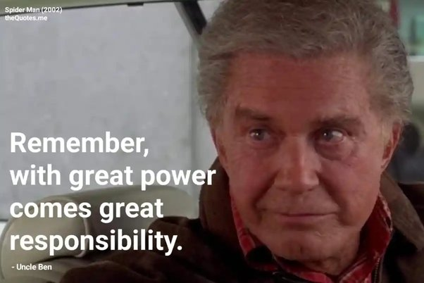

```{r setup, include=FALSE}
library(knitr)

default_source_hook <- knit_hooks$get('source')
default_output_hook <- knit_hooks$get('output')

knit_hooks$set(
  source = function(x, options) {
    paste0(
      "\n::: {.codebox data-latex=\"\"}\n\n",
      default_source_hook(x, options),
      "\n\n:::\n\n")
  }
)

knit_hooks$set(
  output = function(x, options) {
    paste0(
      "\n::: {.codebox data-latex=\"\"}\n\n",
      default_output_hook(x, options),
      "\n\n:::\n\n")
  }
)

knitr::opts_chunk$set(echo = TRUE)
```

# Outline

- Studying gradients more deeply
- Constrained ordination
- Concurrent ordination

\pause

\textbf{Many bells and whistles to present}

## Questions so far?

\center

{width=40%}

## Background

So far: only unconstrained ordination

- Which is fun, but not if you want to assess species-environment relationships
- Here we will focus on including covariates in the model
- Beneficial if you have \textbf{sparse} data and cannot estimate species-specific effects
- Will also cover: **residual** ordination, and **concurrent** ordination

## Constrained ordination methods

- Redundancy analysis \footnotesize (RDA, Rao 1964) \normalsize
- Canonical Correspondence Analysis \footnotesize (CCA, ter Braak 1985)\normalsize

\begin{enumerate}
\item These methods filter the variation in the community based on covariates. \newline
\item Although referred to as "ordination" they do not perform dimension reduction! \newline
\item That makes them (essentially) vector GLMs
\end{enumerate}

# Constrained

## Constrained ordination

\textbf{Goal}: to determine if (how) environment affects community composition \newline
\textbf{Problem}: many possible drivers (if not, multivariate GLM would do the trick)

\columnsbegin
\column{0.6\textwidth}
\begin{itemize}
\item Why are sites different?
\item Why do species co-occur (or not)?
\item Which components of the environment are most important for the community?
\end{itemize}

\column{0.4\textwidth}
```{r, echo=F, eval=T, out.width="99%", fig.cap="ter Braak 1986"}
knitr::include_graphics("CCA.png")
```

\columnsend

## Constrained ordination 

```{r, echo=F, eval=T, out.width="60%", fig.cap="ter Braak 1986", fig.align="center"}
knitr::include_graphics("CCA.png")
```

Now three quantities: so we call this a **triplot**. The arrows show the association of covariates to the axes.


## Canonical Correspondence Analysis

- Although RDA was developed much earlier, CCA has been the leading constrained ordination method
- ter Braak (1986) developed CCA as a combination of ordination and regression
- Each axis is restricted (constrained) by covariate information
- CCA approximates Gaussian Ordination \tiny (i.e., to the unimodal model, Johnson and Altman, 1999) \normalsize

## Canonical Correspondence Analysis: arrows

The covariate coefficients $\textbf{B}$ are referred to as **canonical** coefficients.

- \texttt{vegan} does not use these for plotting
- Instead it uses sample correlation coefficients as recommended by ter Braak (1986)
- The canonical coefficients can be "unstable" due to multicollinearity
- In \texttt{gllvm}, we do use $\textbf{B}$ (more details later)

## Model-based methods for constrained ordination 

\begin{itemize}
\item RR-VGLMs \tiny (Yee et al. 1996,2003,2010,2015) \normalsize
\item Row-column interaction models  \tiny (Hawinkel  et al. 2019) \normalsize
\item GLLVMs \tiny (van der Veen  et al. 2023) \normalsize
\end{itemize}

Model-based constrained ordination had been around for a while, but not so often used (lack of user-friendly software). \newline
It is a type of VGLM for sparse data; RR-VGLM.

## Software for constrained ordination

### In R e.g.

For constrained ordination:
\begin{itemize}
\item \texttt{vegan} - classical methods
\item \texttt{VGAM} - only fixed effects
\item \texttt{glmmTMB} - only random effects
\item \texttt{gllvm} - easy to use, random or fixed effects
\end{itemize}

## Constrained ordination: the model

\begin{equation}
\tikzmarknode{t1}{\highlight{red}{\eta_{ij}}}
= 
\tikzmarknode{t2}{\highlight{blue}{\beta_{0j}}}
+
\tikzmarknode{t3}{\highlight{yellow}{\textbf{u}_i^\top}}
\tikzmarknode{t4}{\highlight{green}{\symbf{\gamma}_j}}
\end{equation}

So far, we have assumed that the latent variable is estimated by species information alone: $\textbf{u}_i =  \symbf{\epsilon}_i$ \pause \newline
Constrained ordination instead assumes that we also have covariates in the ordination: $\textbf{u}_i = \textbf{B}^\top\textbf{x}_i$

## Constrained ordination: the model

Plugging in  $\symbf{u}_i =  \textbf{B}^\top\textbf{x}_i$ we get:
\begin{equation}
\tikzmarknode{t1}{\highlight{red}{\eta_{ij}}}
= 
\tikzmarknode{t2}{\highlight{blue}{\beta_{0j}}}
+
\tikzmarknode{t3}{\highlight{yellow}{\textbf{x}_i^\top\symbf{B}}}
\tikzmarknode{t4}{\highlight{green}{\symbf{\gamma}_j}}
\end{equation}

From this we see that $\symbf{\beta}_j \overset{d}{\approx} \textbf{B}\symbf{\gamma}_j$

- These are the (reduced rank) approximated species-specific covariate coefficients
- We can extract these, and inspect them with statistical uncertainty
- So we use information across the whole community, to estimate species-specific responses

# Example 1

## Example: Dune data

```{r, echo=F, eval=T, fig.align="center", out.width="55%", message=FALSE}

library(vegan)
data(dune); Y = dune
data(dune.env); X = dune.env
X[,1] <- scale(X[,1]) # always center/scale your covariates for gllvm
X[,c(2:5)] <- data.frame(lapply(X[,c(2:5)],factor,ordered=FALSE)) # I do not want ordered factors
library(gllvm)
invisible(capture.output(TMB::openmp(parallel::detectCores()-1, autopar = TRUE, DLL = "gllvm")))
```

Same data as before, now we bring the covariate \textbf{in} the ordination, instead of taking information \textbf{out} of the ordination.

## Example: fit the model

\footnotesize

```{r cord, cache = TRUE, echo = -c(1,3,4), fig.height = 4, warning = FALSE, message = FALSE}
par(mfrow=c(1,2))
model1 <- gllvm(y = Y, X, num.RR = 2, family = "ordinal",
        lv.formula = ~A1 + Management + Moisture + Use + Manure)
ordiplot(model1, biplot = TRUE, main  ="With species loadings") # can get weird placement due to insufficient data
ordiplot(model1, main = "Without species loadings")
```

\normalsize

## Example: \footnotesize extracting species-specific coefficients with 95% CI \normalsize
\footnotesize

```{r cord1, fig.height = 5, dev = "png", echo = -c(2,3)}
coefplot(model1, which.Xcoef = "A1")
model2 <- gllvm(Y, X = X, formula = ~A1 + Management + Moisture + Use + Manure, family = "ordinal", num.lv = 0, starting.val = "zero")
coefplot(model2, which.Xcoef = "A1")
```

\normalsize

\columnsbegin
\textbf{VGLM}
\column{0.5\textwidth}
\includegraphics{OrdWithPred_files/figure-beamer/cord1-2.png}
\column{0.5\textwidth}
\textbf{RR-VGLM}
\includegraphics{OrdWithPred_files/figure-beamer/cord1-1.png}
\columnsend

# Continued 

## Constrained ordination

- Species effects can be retrieved for any covariate
- Extreme results occur, usually due to insufficient data
- GLLVMs picks up on extreme clustering -very- well

## Constrained ordination

The first implementation of CO that can be combined with random effects

- Random site effects (outside ordination)
- Random canonical coefficients (more in a few slides)

## Common misconception

\textcolor{red}{Post-hoc relating unconstrained ordination axes to environmental covariates is \textbf{not} equivalent to a constrained ordination}

Also it is bad practice: please do not do it. Instead \textbf{adjust your model}.

## Hybrid ordination

- Incorporate both constrained and unconstrained ordination
- But without explicit connection
- Default in \texttt{vegan} and you can also do it in \texttt{gllvm} (use both `num.RR` and `num.lv`)

# Concurrent

## Concurrent ordination

- In practice, constrained and unconstrained ordination are often combined into an analysis \newline

- Variation not due to the environment is discarded, while potentially of large importance

- \textit{Concurrent ordination} is a new type of ordination method that combines unconstrained and constrained ordination

## Concurrent ordination

\textit{Concurrent:'existing or happening at the same time'} \tiny (Oxford's dictionary) \normalsize

\only<2>{
\begin{enumerate}
\itemsep-0.5em
\item Suggested in van der Veen et al. (2023)
\item Performs both unconstrained and constrained ordination \textbf{simultaneously}\newline
\item Ordination axes have \textbf{measured} and \textbf{unmeasured} components
\item Covariates \textbf{inform} rather than \textbf{constrain}
\item Separates out drivers of community composition
\end{enumerate}
}

## Concurrent ordination: \alt<6>{site scores}{the model}

\begin{equation}
\tikzmarknode{t1}{\highlight{red}{\eta_{ij}}}
= 
\tikzmarknode{t2}{\highlight{blue}{\beta_{0j}}}
+
\tikzmarknode{t3}{\highlight{yellow}{\textbf{u}_i^\top}}
\tikzmarknode{t4}{\highlight{green}{\symbf{\gamma}_j}}
\end{equation}

The model is flexible, $\tikzmarknode{n1}{\textbf{u}_i}$ can be all kinds of things.

\begin{tikzpicture}[overlay,remember picture]
        \draw[->] (t3) |- ([yshift = 0.5cm]n1.north) -- (n1);
        \draw<2->[->] (n1) |- ([xshift = -0.8cm]n2.north west) |- ([xshift = -0.5cm]n2.west);
        \draw<3->[->] ([xshift = -0.8cm]n2.north west) |- ([xshift = -0.5cm]n3.west);
        \draw<4->[->] ([xshift = -0.8cm]n3.north west) |- ([xshift = -0.5cm]n4.west);
\end{tikzpicture}

\begin{enumerate}
\item<2-6> $\tikzmarknode{n2}{\highlight{yellow}{\textbf{u}_i}} = \symbf{\epsilon}_i,$ \alt<6>{\textcolor{red}{residual}}{\textbf{unconstrained}}
\item<3-6> $\tikzmarknode{n3}{\highlight{yellow}{\textbf{u}_i}} = \textbf{B}^\top\textbf{x}_i,$ \alt<6>{\textcolor{red}{marginal}}{\textbf{constrained}}
\item<4-6> $\tikzmarknode{n4}{\highlight{yellow}{\textbf{u}_i}} = \textbf{B}^\top\textbf{x}_i + \symbf{\epsilon}_i,$ \alt<6>{\textcolor{red}{conditional}}{\underline{\textbf{concurrent}}}
\item<5-6>[] Often unconstrained and concurrent ordinations are similar
\end{enumerate}

## Concurrent ordination: the model

\begin{center}
\textcolor{red}{Essentially a linear mixed-effects model of the latent variable $\textbf{u}_i$}
\scriptsize{(hiearchcally)}
\end{center}

\pause 

We can use the LV-level error variance for a measure of explained variation.

## Concurrent ordination with \texttt{gllvm}

```{r, echo=F, eval=T, fig.align="center", out.width="55%"}

```

# Example 2

## Example 2: Wadden data

Wadden sea data [Dewenter et al. (2023)](https://onlinelibrary.wiley.com/doi/full/10.1002/ece3.10815)

\begin{columns}
\column{0.5\textwidth}
\begin{itemize}
\item Abundance (counts) or Biomass of macrozoobenthos
\item Covariates
\item Transects at islands (Norderney, Spiekeroog, Wangerooge)
\end{itemize}
\column{0.5\textwidth}
\begin{figure}[h]
\centering
\includegraphics{macrozoobenthos.jpg}
\caption{nioz.nl}
\end{figure}
\end{columns}

\tiny

```{r dat, echo = -4}
Y <- read.csv("../data/waddenY2.csv")[,-c(1:2)]
Y <- Y[, colSums(ifelse(Y==0,0,1))>2]
X <- read.csv("../data/waddenX.csv")
X <- X[,!apply(X,2,anyNA)]
X[,unlist(lapply(X,is.numeric))] <- scale(X[,unlist(lapply(X,is.numeric))])
```

## Study design

{height=90%}

## Example 2: Fit the model

\footnotesize

```{r cnord1, cache = TRUE, warning = FALSE, message = FALSE}
model3 <- gllvm(y = Y, X, num.lv.c = 2, 
                family = "tweedie", Power = NULL,
         lv.formula = ~elevation+TOC+DIN+RDP+Chl.a+silt_clay+season, 
         row.eff = ~(1|island/transect), studyDesign = X[, c("island","transect")],
         disp.formula = rep(1,ncol(Y)), n.init = 3)
coef(model3, parm="Cancoef")
```

## Example 2: Ordination plots of different scores

```{r cnord_ordi, cache = FALSE, warning = FALSE, message = FALSE, dev="png", fig.show = "hide", fig.height = 7, dpi = 150}
layout(matrix(c(1,1,2,3), 2, 2, byrow=TRUE))
gllvm::ordiplot(model3, type= "conditional", rotate = FALSE) 
gllvm::ordiplot(model3, type = "marginal", rotate = FALSE) 
gllvm::ordiplot(model3, type = "residual", rotate = FALSE)
```

## Example 2: Ordination plots of different scores

\centering

`)

# Bouncing

## The bouncing beta problem

When there is collinearity, and we resample the data, the covariate effect my change a lot (and thus the arrows in the ordination plot). Also if we change the model.

- This is due to estimation instability
- Due to identifiability problems (two covariate effects cannot be separated)
- When we resample, the collinearity structure may change considerably

It is not a problem for the model, but we might want to stabilize things. This is why classical ordination does not use the canonical coefficients.

## Random canonical coefficients

We can treat the canonical coefficients as random effects with `randomB` (with constrained and with concurrent ordination)

- This is usually faster
- Treats the "bouncing beta" problem
- Models associations of species due to environment (extracted with `getResidualCov/r`)

\begin{enumerate}
\itemsep-0.5em
\item LV: coefficients on the same axis have the same variance
\begin{itemize}
\item Shrinkage over LVs
\end{itemize}
\item P: coefficient of the same covariate have the same variance
\begin{itemize}
\item Shrinkage over LVs and covariates \footnotesize (e.g., for automated model selection) \normalsize
\end{itemize}
\item single: all coefficients have the same variance
\end{enumerate}

\pause

\tikzset{
  mybox/.style={
    draw=red,
    very thick,
    rectangle,
    rounded corners,
    inner sep=10pt,
    fill = white,
    text width = 0.8\paperwidth
  }
}
    
\pause

\begin{tikzpicture}[remember picture, overlay]
\node[mybox] at (current page.center){ \centering

Consider this an RR-VGLMMs
So, we can use the variance of the random effects for proportion of explained variation!
};
\end{tikzpicture}

## Random canonical coefficients

We can also incorporate \textbf{correlation} of the effects. This is a model where we have:

- Associations due to environment `getEnvironCor`
- Correlation between environment effects (requires `lv.formula` \texttt{lme4}-style)
- Which means we can examine the reduced-rank approximated random effects `RandomCoefPlot`

## Random canonical coefficients: mathy bits

Define $\symbf{\Sigma}_{lv}$ as correlation matrix, then:

`randomB = "LV"`: $\textbf{b}_q \sim \mathcal{N}(\textbf{0}, \symbf{\Sigma}\sigma_k^2)$ \newline
`randomB = "P"`: $\textbf{B} \sim \mathcal{MN}\{\textbf{0}, \text{diag}(\sigma_1 \ldots \sigma_k)\symbf{\Sigma}\text{diag}(\sigma_1 \ldots \sigma_k), \text{diag}(1, \sigma^2_2 \ldots \sigma^2_d)\}$ \newline

but otherwise the same model. The estimate of $\symbf{\Sigma}$ will get better with the number of LVs. This is the same matrix as in the VGLMM, just estimated in reduced rank. You can also combine this with full rank random effects in `formula`.

# Example 3

\footnotesize

```{r cnord2, cache = TRUE, warning = FALSE, message = FALSE}
model4 <- gllvm(y = Y, X = X, num.lv.c = 2, randomB = "P",
          family = "tweedie", Power =  NULL,
          lv.formula = ~(0+elevation+TOC+DIN+RDP+Chl.a+silt_clay+season|1), 
          row.eff = ~(1|island/transect), studyDesign = X[, c("island","transect")],
          disp.formula = rep(1,ncol(Y)), n.init = 3, maxit = 10e5)
```

`lv.formula` follows standard random-effects style (correlation for effects in same brackets):

## Example 3: summary

\tiny 

```{r, eval = FALSE}
summary(model4)
```

```{r, echo = FALSE}
sum <- summary(model4)
print(sum$REbcovs, row.names=FALSE,right=FALSE)
``` 

## Example 3: correlation plot

\tiny

```{r, echo = FALSE}
colnames(model4$params$corsLvXcoef) <- row.names(model4$params$corsLvXcoef) <- colnames(model4$lv.X.design)
corrplot::corrplot(model4$params$corsLvXcoef, type = "lower", diag = FALSE, tl.pos="l")
```

## Example 3: ordination plots

```{r cnord2_ordiplot, cache = TRUE, warning = FALSE, message = FALSE, fig.height = 6, echo = FALSE, dpi = 150}
layout(matrix(c(1,1,2,3), 2, 2, byrow=TRUE))
gllvm::ordiplot(model4, type= "conditional", rotate = FALSE) 
gllvm::ordiplot(model4, type = "marginal", rotate = FALSE) 
gllvm::ordiplot(model4, type = "residual", rotate = FALSE)
```

## Example 3: Random coefficient plot of species

```{r cnord2_rancoef, cache = TRUE, warning = FALSE, message = FALSE, fig.height = 5, fig.align="center"}
gllvm::randomCoefplot(model4, which.Xcoef="elevation")
```

# Summary

## Model-comparison note

The usual caveats apply:

- No parameters on the boundary
- Nestedness

Note:

- Random effect constrained ordination is nested in unconstrained ordination \footnotesize with `randomB = "LV"` \normalsize
- Fixed effects constrained ordination is nested in fixed effects unconstrained ordination
- Constrained and unconstrained ordination are nested in concurrent ordination

`anova` and `AIC` can, in principle, be used. 

## `summary`

You can test effects over all LVs/covariates with `summary`:

- `summary(model, by = "all")`:  test per coefficient (identify horizontal/vertical separation)
- `summary(model, by = "terms")`: per covariate across LVs ("does the ordination depend on __this__ covariate")
- `summary(model, by = "LV)`: test per LV ("does LV depend on covariates at all?")

Wald statistics have low power (compared to LRT), and make strong (but usually) reasonable assumptions.

## Summary

\footnotesize

- Ordination with covariates has three flavours in GLLVM:
  - Residual ordination (covariate outside of the ordination)
  - Constrained ordination 
  - Concurrent ordination (simultaneous unconstrained and constrained)
- In each of these we can apply conditioning for a partial ordination; with random effects or fixed effects
- Random canonical coefficients can be implemented via the `randomB` argument, for reduced rank effects
- Via `num.RR` you can also do fixed effects unconstrained ordination

\hfill {width=50%}
