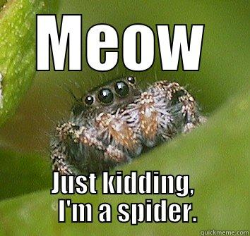
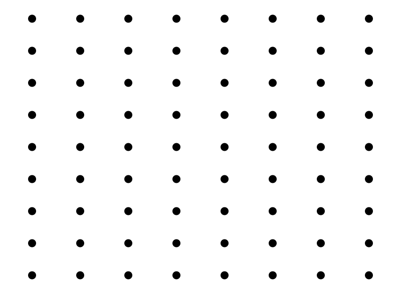

```{r setup, include=FALSE}
library(knitr)

default_source_hook <- knit_hooks$get('source')
default_output_hook <- knit_hooks$get('output')

knit_hooks$set(
  source = function(x, options) {
    paste0(
      "\n::: {.codebox data-latex=\"\"}\n\n",
      default_source_hook(x, options),
      "\n\n:::\n\n")
  }
)

knit_hooks$set(
  output = function(x, options) {
    paste0(
      "\n::: {.codebox data-latex=\"\"}\n\n",
      default_output_hook(x, options),
      "\n\n:::\n\n")
  }
)

knitr::opts_chunk$set(echo = TRUE)
library(gllvm)
TMB::openmp(parallel::detectCores()-1, autopar=TRUE, DLL = "gllvm")
```

# Outline

## Questions so far?

\centering

{width=40%}

# Unimodal model

## Unimodal responses models and ordination

There has been a lot of research on the unimodal response model in multivariate analysis

- Whittaker (1956) introduced the idea
- MacArthur (1970) formalized it
- Gauch et al. (1974) proposed "Gaussian ordination" but it did not work
- ter Braak (1985) popularized the concepts for ordination in terms of CA
- Minchin (1987) and others opposed the idea of a symmetric model

\centering

\pause

\textcolor{red}{\textbf{There has been no succesful ordination method that explicitly incorporates a response model}}

## The consensus

- PCA for short gradients (if you zoom in far enough, its linear)
- DCA for long gradients
- NMDS for robustness to deviations from unimodal curves

\pause

Based on how "good" an ordination looks: PCA gives horseshoe and CA gives arch.

## Terminology

\begin{center}

"Gaussian" = quadratic \newline

Both are unimodal

\end{center}

## Species packing

```{r, fig.align="center", echo = FALSE, fig.height = 4, message=FALSE, results = FALSE}
unimodal <-function(x, opt, tol)exp(1-0.5*(x-opt)^2/tol^2)

plot(NA, type="n", ylim=c(0, exp(1)),yaxs="i",yaxt="n",xaxt="n",xlab="Niche dimension 1", ylab="Frequency", cex.lab=1.8,cex.axis=1.8, xlim = c(-2,2))
sapply(1:10, function(j)lines(seq(-2,2,length.out=1000), unimodal(seq(-2,2,length.out=1000), seq(-2,2,length.out=10)[j], 0.5)))
```

- "Species packing" \tiny MacArthur (1969) \normalsize
  - Competitive exclusion
  - Limiting similarity
  - Leads to CA assumptions (uniform optima, equal maxima, equal tolerances)
- Quadratic in the environment/ niche


##

- Is the species packing assumption realistic?
- Optimal conditions are usually species-specific
- For example: temperature, space (environment or resources)
- But so is the tolerance

```{r, fig.align="center", fig.width=12, echo = FALSE}
#https://stats.stackexchange.com/questions/12209/percentage-of-overlapping-regions-of-two-normal-distributions
min.f1f2 <- function(x, mu1, mu2, sd1, sd2) {
    f1 <- dnorm(x, mean=mu1, sd=sd1)
    f2 <- dnorm(x, mean=mu2, sd=sd2)
    pmin(f1, f2)
}

mu1 <- -2;    sd1 <- 2
mu2 <- 1;    sd2 <- 1

xs <- seq(min(mu1 - 3*sd1, mu2 - 3*sd2), max(mu1 + 3*sd1, mu2 + 3*sd2), .01)
f1 <- dnorm(xs, mean=mu1, sd=sd1)
f2 <- dnorm(xs, mean=mu2, sd=sd2)
par(mar=c(5, 5, 4, 2) + 0.1)
plot(xs, f1, type="l", ylim=c(0, max(f1,f2)), col="green",yaxs="i",yaxt="n",xaxt="n",xlab="Niche dimension 1", ylab="Frequency", cex.lab=1.8,cex.axis=1.8)
axis(1,labels=c(expression(mu[1]),expression(mu[2])),at=c(mu1,mu2),lwd=0,line=NA,cex.axis=1.8)
lines(xs[f2>0.001], f2[f2>0.001], col="blue")
segments(x0=mu1,y0=0,y1=0.2,lty="dashed",col="green")
segments(x0=mu2,y0=0,y1=0.4,lty="dashed",col="blue")

```

##

- Niche width
- Commonly assumed equal (not here)
- What is the probability of niche occurrence?

```{r, fig.align="center", fig.width=12, echo = FALSE}
#https://stats.stackexchange.com/questions/12209/percentage-of-overlapping-regions-of-two-normal-distributions
min.f1f2 <- function(x, mu1, mu2, sd1, sd2) {
    f1 <- dnorm(x, mean=mu1, sd=sd1)
    f2 <- dnorm(x, mean=mu2, sd=sd2)
    pmin(f1, f2)
}

mu1 <- -2;    sd1 <- 2
mu2 <- 1;    sd2 <- 1

xs <- seq(min(mu1 - 3*sd1, mu2 - 3*sd2), max(mu1 + 3*sd1, mu2 + 3*sd2), .01)
f1 <- dnorm(xs, mean=mu1, sd=sd1)
f2 <- dnorm(xs, mean=mu2, sd=sd2)
par(mar=c(5, 5, 4, 2) + 0.1)
plot(xs, f1, type="l", ylim=c(0, max(f1,f2)), col="green",yaxs="i",yaxt="n",xaxt="n",xlab="Niche dimension 1", ylab="Frequency", cex.lab=1.8,cex.axis=1.8)
lines(xs[f2>0.001], f2[f2>0.001], col="blue")
segments(x0=mu1,y0=0,y1=0.2,lty="dashed",col="green")
segments(x0=mu2,y0=0,y1=0.4,lty="dashed",col="blue")
arrows(y0=0.12,x0=mu1,x1=mu1-sd1,code = 3,col="green",length=0.2)
text(mu1-sd1/2,0.13,expression(sigma[1]),cex=1.5)
arrows(y0=0.24,x0=mu2,x1=mu2+sd2,code = 3,col="blue",length=0.2)
text(mu2+sd2/2,0.25,expression(sigma[2]),cex=1.5)
```

# Ordination model

## GLLVM with unimodal response models

\begin{equation}
\tikzmarknode{t1}{\highlight{red}{\eta_{ij}}}
= 
\tikzmarknode{t2}{\highlight{blue}{\beta_{0j}}}
+
\tikzmarknode{t5}{\highlight{gray}{\ldots}}
+
\tikzmarknode{t3}{\highlight{yellow}{\textbf{u}_i^\top}}
\tikzmarknode{t4}{\highlight{green}{\symbf{\gamma}_j}}
-
\tikz[baseline,remember picture]{
\node[anchor=base,rectangle, draw=red, dashed] (t567) {$
\tikzmarknode{t5}{\highlight{yellow}{\textbf{u}_i^\top}}
\tikzmarknode{t6}{\highlight{orange}{\textbf{D}_j}}
\tikzmarknode{t7}{\highlight{yellow}{\textbf{u}_i}}
$}
}
\end{equation}

\tikzmarknode{n1}{Quadratic term (positive diagonal matrix)}

\begin{tikzpicture}[overlay,remember picture]
        \draw[->] (n1) -| (t567);
\end{tikzpicture}

This allows us to:

- Calculate species optima
- Calculate species tolerances
- Estimate gradient length
- Provide a more ecologically plausible ordination method

## Niche width

- "Tolerance" is a measure of niche width
- Ecologically, we expect this to be different for species (some specialist, some generalist)
- CA requires the assumption that this is the same for all species
- We provide three options
  - the same ("equal tolerances", species packing)
  - the same per LV ("common tolerances")
  - not the same ("unequal tolerances")
- Species maxima are usually species-specific (but not in CA)
  
## What does that mean?

```{r, fig.align="center", echo = FALSE, fig.height = 6, results = FALSE, warning=FALSE, message=FALSE}
par(mfrow=c(2,3))
unimodal <-function(x, opt, tol)exp(1-0.5*(x-opt)^2/tol^2)

plot(NA, type="n", ylim=c(0, exp(1)),yaxs="i",yaxt="n",xaxt="n",ylab="Frequency", cex.lab=1.8,cex.axis=1.8, xlim = c(-2,2), main = "Equal tolerances", cex.main = 2.5,xlab="Dimension 1")
sapply(1:10, function(j)lines(seq(-2,2,length.out=1000), unimodal(seq(-2,2,length.out=1000), seq(-2,2,length.out=10)[j], 0.5)))

plot(NA, type="n", ylim=c(0, exp(1)),yaxs="i",yaxt="n",xaxt="n", ylab=NA, cex.lab=1.8,cex.axis=1.8, xlim = c(-2,2), main = "Common tolerances", cex.main = 2.5,xlab="Dimension 1")
sapply(1:10, function(j)lines(seq(-2,2,length.out=1000), unimodal(seq(-2,2,length.out=1000), seq(-2,2,length.out=10)[j], 0.8)))

plot(NA, type="n", ylim=c(0, exp(1)),yaxs="i",yaxt="n",xaxt="n", ylab=NA, cex.lab=1.8,cex.axis=1.8, xlim = c(-2,2), main = "Unequal tolerances", cex.main = 2.5,xlab="Dimension 1")
sapply(1:10, function(j)lines(seq(-2,2,length.out=1000), unimodal(seq(-2,2,length.out=1000), seq(-2,2,length.out=10)[j], runif(1, 0.2,1))))

plot(NA, type="n", ylim=c(0, exp(1)),yaxs="i",yaxt="n",xaxt="n",xlab="Dimension 2", ylab="Frequency", cex.lab=1.8,cex.axis=1.8, xlim = c(0,4))
sapply(1:10, function(j)lines(seq(0,4,length.out=1000), unimodal(seq(0,4,length.out=1000), seq(0,4,length.out=10)[j], 0.5)))


plot(NA, type="n", ylim=c(0, exp(1)),yaxs="i",yaxt="n",xaxt="n",xlab="Dimension 2", ylab=NA, cex.lab=1.8,cex.axis=1.8, xlim = c(0,4))
sapply(1:10, function(j)lines(seq(0,4,length.out=1000), unimodal(seq(0,4,length.out=1000), seq(0,4,length.out=10)[j], 0.1)))


plot(NA, type="n", ylim=c(0, exp(1)),yaxs="i",yaxt="n",xaxt="n",xlab="Dimension 2", ylab=NA, cex.lab=1.8,cex.axis=1.8, xlim = c(0,4))
sapply(1:10, function(j)lines(seq(0,4,length.out=1000), unimodal(seq(0,4,length.out=1000), seq(0,4,length.out=10)[j], runif(1, 0.2,1))))
```

## Rare species

```{r, fig.align="center", echo = FALSE, fig.height = 6, results = FALSE, warning=FALSE, message=FALSE}
par(mfrow=c(2,3))
unimodal <-function(x, maximum, opt, tol)exp(maximum-0.5*(x-opt)^2/tol^2)

plot(NA, type="n", ylim=c(0, exp(1)),yaxs="i",yaxt="n",xaxt="n",xlab=NA,ylab="Frequency", cex.lab=1.8,cex.axis=1.8, xlim = c(-2,2), main = "Frequent specialist \nsufficiently sampled", cex.main = 2.5)
lines(seq(-2,2,length.out=1000), unimodal(seq(-2,2,length.out=1000), 1, 0, 0.1))
rug(seq(-0.5,0.5,length.out=20), ticksize = 0.05, lwd = 2)

plot(NA, type="n", ylim=c(0, exp(1)),yaxs="i",yaxt="n",xaxt="n",xlab=NA, ylab=NA, cex.lab=1.8,cex.axis=1.8, xlim = c(-2,2), main = "Infrequent specialist \nsufficiently sampled", cex.main = 2.5)
lines(seq(-2,2,length.out=1000), unimodal(seq(-2,2,length.out=1000), 0, 0,0.1))
rug(seq(-0.5,0.5,length.out=20), ticksize = 0.05, lwd = 2)

plot(NA, type="n", ylim=c(0, exp(1)),yaxs="i",yaxt="n",xaxt="n", cex.lab=1.8,cex.axis=1.8, xlim = c(-2,2), main = "Infrequent specialist \ninsufficiently sampled", cex.lab=1.8,cex.axis=1.8, xlab = NA, ylab = NA,cex.main=2.5)
lines(seq(-2,2,length.out=1000), unimodal(seq(-2,2,length.out=1000), 0,0, 0.1))
rug(c(seq(-2,-0.5,length.out=10),-0.3,-0.2,-0.1,0.5,0.9,0.9), ticksize = 0.05, lwd = 2)

plot(NA, type="n", ylim=c(0, exp(1)),yaxs="i",yaxt="n",xaxt="n",ylab="Frequency", cex.lab=1.8,cex.axis=1.8, xlim = c(-2,2), main = "Frequent generalist \nsufficiently sampled", cex.main = 2.5,xlab="Dimension 1")
lines(seq(-2,2,length.out=1000), unimodal(seq(-2,2,length.out=1000), 1,0, 0.8))
rug(seq(-2.5,2.5,length.out=50), ticksize = 0.05, lwd = 2)

plot(NA, type="n", ylim=c(0, exp(1)),yaxs="i",yaxt="n",xaxt="n",xlab="Dimension 1", cex.lab=1.8,cex.axis=1.8, xlim = c(-2,2), main = "Infrequent generalist \nsufficiently sampled", cex.lab=1.8,cex.axis=1.8, ylab=NA, cex.main=2.5)
lines(seq(-2,2,length.out=1000), unimodal(seq(-2,2,length.out=1000), 0,0, 0.8))
rug(seq(-2.5,2.2,length.out=50), ticksize = 0.05, lwd = 2)

plot(NA, type="n", ylim=c(0, exp(1)),yaxs="i",yaxt="n",xaxt="n",xlab="Dimension 1", cex.lab=1.8,cex.axis=1.8, xlim = c(-2,2), main = "Infrequent generalist \ninsufficiently sampled", cex.lab=1.8,cex.axis=1.8, ylab=NA, cex.main = 2.5)
lines(seq(-2,2,length.out=1000), unimodal(seq(-2,2,length.out=1000), 0,0, 0.8))
rug(c(seq(-2,-0.5,length.out=20),0,0.5,0.9,0.9), ticksize = 0.05, lwd = 2)
```


## Consequences

- Unconstrained Quadratic Ordination (UQO) is a very complex method
- The most complex ecological ordinaiton method to date
  - \footnotesize Still, it assumes a symmetric curve, which some deem an unrealistic ecological model
  - \footnotesize But, no one has done better
- Unequal tolerances is not achievable for most datasets
- Equal or common tolerances is most suitable in practice
  - An equal tolerances model can be fitted with an ordinary GLLVM

# Distortion

## On non-linear distortions in GLLVMs

\textit{"The arch effect is simply a mathematical artifact, corresponding to no real structure in the data. It arises because the second axis (canonical variate) of RA is constrained to be uncorrelated with the first axis, but is in no way constrained to be independent of it."}

\hfill \tiny (Hill and Gauch, 1980) \normalsize
 
\vspace*{\baselineskip}
 
Recap: a-priori in GLLVMs the latent variables are normally distributed and uncorrelated, thus independent and orthogonal.

## On non-linear distortions in GLLVMs

\begin{equation}
\text{cov}(\textbf{u}_i^\top\symbf{\gamma}_j, \textbf{u}_i^\top\textbf{D}_j\textbf{u}_i) = 0
\end{equation}

The linear and quadratic terms are uncorrelated: it is an orthogonal polynomial (useful for interpretation and convergence).

\centering

\textcolor{red}{\textbf{This also means that the linear and quadratic terms can be separately visualized in an ordination plot, and lead to distortions. So we cannot use a biplot.}}

## On plotting a quadratic response model

- One method is to plot the predicted curves per dimension
- For an ordination diagram we can plot the optima with site scores
- Tolerances can be used to draw suitability regions
- Very large optima (due to near linear responses) need to be drawn as arrows (`ordiplot(.)` does this by default)

## On non-linear distortions in GLLVMs

- Horseshoe effect does not exist in GLLVM
- $\mathams{E}(\textbf{u}_i\vert\textbf{y}_i)$ is more flexible than the (prior) normality assumption
- The model will always attempt to capture the data as well as possible
- Attitude: if we see something we do not like, we adjust the model
  - I.e., if we see quadratic curvature, we apply a quadratic response model
  - An ordination plot for quadratic response model cannot exhibit quadratic curvature

## On non-linear distortions in GLLVMs

- A GLLVM without quadratic response model can exhibit non-linear patterns
- We can get into situations where linear terms approximate quadratic terms
- This might especially happen if the variance due to the quadratic term is larger than due to the linear term

The species associations matrix of a quadratic GLLVM is:

\begin{equation}
\tikzmarknode{t1}{\highlight{grey}{\symbf{\Sigma}}} = \tikzmarknode{t2}{\highlight{green}{\symbf{\Gamma}\symbf{\Gamma}^\top}} + \tikzmarknode{t3}{\highlight{orange}{\sum^d_{q=1}2\symbf{\Delta}\symbf{\Delta}^\top}}
\end{equation}

## Quadratic model as row-effect

The quadratic response model with equal, or common, tolerance assumption is:

\begin{equation}
\eta_{ij} = \beta_{0j} + \textbf{u}_i^\top\symbf{\gamma}_j - \textbf{u}_i^\top\textbf{D}\textbf{u}_i
\end{equation}

which we can write as a linear model with site-specific random effect:

\begin{equation}
\eta_{ij} = \alpha_i + \beta_{0j} + \textbf{u}_i^\top\symbf{\gamma}_j, \qquad \text{where } \alpha_i = \textbf{u}_i^\top\textbf{D}\textbf{u}_i
\end{equation}

\footnotesize

because the quadratic term does not depend on the species index. Under the common/equal tolerance assumption, the quadratic term only affects the total abundance at sites.

## Quadratic model as row-effect

But the site random effect $\alpha_i \sim \mathcal{N}(\textbf{0}, \sigma^2)$ while $\textbf{u}_i^\top\textbf{D}\textbf{u}_i \sim d_q\mathcal{\chi}^2_1$. 

- The random row effect can \textbf{approximate} a quadratic term
- There is a distributional discrepancy; the quadratic form is generalized $\chi^2$ distributed
  - and $\chi^2$ under equal tolerances
- A-posteriori (after the model has seen the data) this is not (very) relevant
- This is also why random site effects can accommodate non-linearity in the ordination

## How to interpre the ordination plot

- On an ordination plot we can usually interpret species' locations as optima
- Instead of as the main direction of increase as in (for example) PCA
- You need at least a random site effect in the model

\columnsbegin
\column{0.5\textwidth}

```{r, fig.align="center", echo = FALSE, fig.height = 6, fig.cap = "Species effects as increase direction"}
mu1 <- -2
mu2 <- 1
mu11 <- 2
mu21 <- 1.1
plot(NA,xlab="Niche dimension 1", ylab="Niche dimension 2",xaxt="n",yaxt="n",xlim=c(-4,2),ylim=c(0.5,3), cex.lab=1.5, type ="n")
box()
text(-2,1.5,labels=1,col="black", cex = 2)
text(0,2,labels=2,col="black", cex = 2)
text(0,1,labels=3,col="black", cex = 2)
text(1.2,3,labels=4,col="black", cex = 2)
text(-1,1,labels=5,col="black", cex = 2)
marg <- par("usr")
org <- c(mean(marg[1:2]),mean(marg[3:4]))
abline(v=org[1], h = org[2], lty = "dotted")
arrows(x0=org[1], y0=org[2], x1 = org[1]+(org[1]-mu1), y1 = org[2]+(org[2]-mu11), length = 0.2, col="blue", lwd = 2)
arrows(x0=org[1], y0=org[2], x1 = org[1]+(org[1]-mu2), y1 = org[2]+(org[2]-mu21), length = 0.2, col="darkgreen", lwd = 2)
```


\column{0.5\textwidth}


```{r, fig.align="center", echo = FALSE, fig.height = 6, fig.cap = "Species effects as centroids"}
mu1 <- -2;    sd1 <- 2
mu2 <- 1;    sd2 <- 1
mu11 <- 2;  sd11 <- 1
mu21 <- 1.1; sd21 <- 0.5
par(mar=c(5, 5, 4, 2) + 0.1)
plot(c(mu1,mu2),c(mu11,mu21),xlab="Niche dimension 1", ylab="Niche dimension 2",xaxt="n",yaxt="n",xlim=c(-4,2),ylim=c(0.5,3), cex.lab=1.5, cex = 2)
abline(v=org[1], h = org[2], lty = "dotted")

box()
car::ellipse(c(mu1,mu11),diag(2),c(sd1,sd11),lty="dashed", col="darkgreen", lwd = 2)
car::ellipse(c(mu2,mu21),diag(2),c(sd2,sd21),lty="dashed",col="blue", lwd = 2)
text(-2,1.5,labels=1,col="black", cex = 2)
text(0,2,labels=2,col="black", cex = 2)
text(0,1,labels=3,col="black", cex = 2)
text(1.2,3,labels=4,col="black", cex = 2)
text(-1,1,labels=5,col="black", cex = 2)

```


\columnsend

# Example 1

## Example: spider data

- Data by [van der Aart and Smeek-Enserink (1975)](https://rdrr.io/cran/gllvm/man/eSpider.html)
- 12 species of hunting spider at 100 sites (pitfall traps)
- 26 predictor variables at 28 of the sites (soil dry matter content, reflection, amount of fallen leaves and such)
- A classical dataset



## Example: non-linear distortion

\footnotesize

```{r, message = FALSE, fig.height = 4.5, echo = -c(1:2), fig.show  = "hold"}
data(spider, package = "mvabund")
Y = spider$abund
model1 <- gllvm(Y, num.lv = 2, family = "poisson")
ordiplot(model1, symbols = TRUE, pch = 16)
plot(model1, which = 1)
```

We see: an arch! The residuals also do not look good (fanning)

## Example: non-linear distortion (2)

To deal with it: we adjust the model.
\footnotesize

```{r spid1, fig.height = 5, dev = "png"}
model2 <- gllvm(Y, num.lv = 2, family = "poisson", row.eff = "random")
ordiplot(model2, symbols = TRUE, pch = 16, main = "With row effect")
ordiplot(model1, symbols = TRUE, pch = 16, main = "Without row effect")
plot(model2, which = 1)
```

\columnsbegin
\column{0.5\textwidth}
\includegraphics{Unimodal_files/figure-beamer/spid1-1.png}
\column{0.5\textwidth}
\alt<2>{
\includegraphics{Unimodal_files/figure-beamer/spid1-3.png}
}{
\includegraphics{Unimodal_files/figure-beamer/spid1-2.png}
}

\columnsend

## Example: information criteria confirms

```{r}
AIC(model1, model2)
```

# Gradient

## Gradient length

- One of the popular features of DCA: axes in terms of gradient length
- A unit tolerance curve falls and raises in about 4 units \tiny (Hill and Gauch 1980) \normalsize
- To me, their method is a bit unclear
- But, we can calculate it in our own way \tiny (van der Veen et al. 2021) \normalsize

```{r, echo=FALSE, fig.align="center", fig.height = 3.4}
curve(dnorm,from=-2,to=2, main = "Std. normal distribution", cex.main=2)
```

## Gradient length

Gradient length is (the width of the standard normal for the LVs) is calculated as:
\begin{equation}
4\textbf{G}^{\frac{1}{2}}
\end{equation}

- For common tolerances, $\textbf{G} = 2\textbf{D}$
- Thus, gradient length is $\frac{4}{t}$
  - $t$ is the tolerance 
  - Note that van der Veen et al (2021) has an error
  - So that curves are unit width
- For unequal tolerances we need to choose: mean or median?
- \footnotesize Ultimately, we can rescale in whatever way we want: its all relative

```{r, eval = FALSE, echo = FALSE}
d<--model$params$theta[1,3:4]*model$params$sigma.lv^2
tol = 1/sqrt(2*d)
1/sqrt(2*d/(2*d)) #i.e., we need to multiply d by 2 to standardize to unit width
4*sqrt(2*d)#function does 4*sqrt(d)
```

## Turnover

We can calculate the (average) rate of turnover as (rate at which species appear-disappear):

\begin{equation}
2Q(\alpha;t) \qquad \footnotesize \text{(at least with a log-link function)} \normalsize
\end{equation}

- $Q(\cdot)$ is the **quantile** function of a normal distribution
  - At least, that is (more or less) what it is for a log-link
- $\alpha$ is some level of error (since we need to cut off somewhere)
- $t$ is the tolerance
- van der Veen et al. (2021) chose about $\alpha = .999$

\pause

Note: we are working on a new framework that might incorporate a different definition.

## When to go unimodal

- Quadratic can accommodate linear, not the other way around
- Linear = very wide unimodal curve
- Quadratic is more complex and involved to fit
- Simplify the model if possible
- Usually only when you have enough data/information can you fit the quadratic
  - And then usually with common tolerances
  
\pause

If we misspecify the model as linear, we can miss the dominat gradient altogether.

# Example 2

## Example 2: Swiss alpine plants

The Swiss alpine community, sampled on an elevation gradient.

```{r swissa}
Y <- read.csv("../data/alpineY.csv")[,-1]
X <- read.csv("../data/alpineX.csv")[,-c(1:3)]
X <- X[rowSums(Y)>0,]
Y <- Y[rowSums(Y)>0,]
```

## Example 2: fit the models

\tiny

```{r, cache = TRUE, warning=FALSE}
model3 <- gllvm(Y, num.lv = 2, family = "binomial", quadratic = TRUE, sd.errors = FALSE, optim.method = "L-BFGS-B")
model4 <- gllvm(Y, num.lv = 2, family = "binomial", quadratic = "LV", sd.errors = FALSE, optim.method = "L-BFGS-B", maxit = 10e3)
model5 <- gllvm(Y, num.lv = 2, family = "binomial", row.eff = "random", sd.errors = FALSE, optim.method = "L-BFGS-B")
model6 <- gllvm(Y, num.lv = 2, family = "binomial", sd.errors = FALSE, optim.method = "L-BFGS-B")
```

## Example 2: the estimated latent variable

The ordination can differ significantly depending on the specified model; it can miss the main gradient.

\footnotesize

```{r, echo = FALSE}
res <- rbind(cbind(data.frame(model = "quadratic unequal"), cor(getLV(model3), X)),
      cbind(data.frame(model = "quadratic common"), cor(getLV(model4), X)),
      cbind(data.frame(model = "linear row"), cor(getLV(model5), X)),
      cbind(data.frame(model = "linear"), cor(getLV(model6), X)))
print(res, row.names = FALSE)
```

## Example 2: curve plotting from common tolerances

```{r, echo = FALSE, fig.height = 4, results  ="hide"}
LVs = getLV(model4)
newLV = cbind(LV1 = seq(min(LVs[,1]), max(LVs[,1]), length.out=1000), LV2 = 0)
preds <- predict(model4, type = "response", newLV = newLV)
plot(NA, ylim = range(preds), xlim = c(range(getLV(model4))), ylab  = "Predicted response", xlab = "LV1")
segments(x0=optima(model4, sd.errors = FALSE)[,1],x1 = optima(model4, sd.errors = FALSE)[,1], y0 = rep(0, ncol(Y)), y1 = apply(preds,2,max), col = "red", lty = "dashed", lwd = 2)
rug(getLV(model4)[,1], lwd = 1)
sapply(1:ncol(Y), function(j)lines(sort(newLV[,1]), preds[order(newLV[,1]),j], lwd = 2))
```

- Each species get a curve
- Red lines are the optima
- Some optima are unobserved
- Rate of turnover is: `r 2*qnorm(.999,sd=1/sqrt(-2*model4$params$theta[1,3]*model4$params$sigma.lv[1]^2))`

## Example 2: common tolerances (LV2)

```{r, echo  = FALSE, fig.height = 4, results  ="hide"}
LVs = getLV(model4)
newLV = cbind(LV1 = 0, LV2 =  seq(min(LVs[,2]), max(LVs[,2]), length.out=1000))
preds <- predict(model4, type = "response", newLV = newLV)
plot(NA, ylim = range(preds), xlim = c(range(getLV(model4))), ylab  = "Predicted response", xlab = "LV2")
segments(x0=optima(model4, sd.errors = FALSE)[,2],x1 = optima(model4, sd.errors = FALSE)[,2], y0 = rep(0, ncol(Y)), y1 = apply(preds,2,max), col = "red", lty = "dashed", lwd = 2)
rug(getLV(model4)[,2], lwd = 1)
sapply(1:ncol(Y), function(j)lines(sort(newLV[,2]), preds[order(newLV[,2]),j], lwd = 2))
```

- Each species get a curve
- Red lines are the optima
- Some optima are unobserved
- Rate of turnover is: `r 2*qnorm(.999,sd=1/sqrt(-2*model4$params$theta[1,4]*model4$params$sigma.lv[2]^2))`

# Comparison

There has been a lot of talk about the ideal ordination model. Supposedly not skewed and such, and should avoid artifacts

- Podani and Miklos (2002)
- Minchin (1987)

Minchin we already know: simulated from skewed responses and NMDS did best. \newline
Podani and Miklos simulated data that creates artifacts, despite following a linear model.

```{r, message= FALSE, warning=FALSE, echo = FALSE}
tmp <- tempfile()
download.file("https://github.com/gavinsimpson/random_code/raw/master/podani.R",
              tmp, method = "wget")
source(tmp)
PM1 <- podani1()
PM2 <- podani2()
PM3 <- podani3()

# Corrected from van der Veen et al. 2021
# That version missed the 2 in 2*d
# Which resulted in an additional sqrt(0.5) in the gradient length
# so the lengths were a factor .71 ish too short
# this came due to the unclarity in 3.2 par 2; \tilde{z} = z\sqrt(2*d)
# I.e., rescaled d needs to be 0.5 for untit tolerance
gradient.length <- function(object) {
  if(!inherits(object,"gllvm.quadratic")){
    stop("Gradient length can only be extracted for a GLLVM where species are a quadratic function of the latent variables.")
  }
  num.lv <- object$num.lv
  p <- ncol(object$y)
  quadratic <- object$quadratic
  tol<-1/sqrt(-2*object$params$theta[,-c(1:num.lv)]%*%diag(object$params$sigma.lv^2))

   if(quadratic!="LV"){
    grad.length <- 4/apply(tol,2,median)
  }else{
    grad.length <- 4/tol[1,]
  }
  
  names(grad.length) <- paste("LV",1:num.lv,sep="")

  return(grad.length) 
}
```

## PM1: one-dimensional gradient

\centering

](PM1.png){height=75%}

## PM1: traditional methods

```{r, message=FALSE, echo = FALSE, fig.height = 5, fig.align="center", warning=FALSE}
par(mfrow=c(2,4))
PCA <- prcomp(PM1)
vegan::ordiplot(PCA, type = "text", display = "sites", cex = 2, main = "PCA")
CA <- vegan::cca(PM1)
vegan::ordiplot(CA, type = "text", cex = 2, display = "sites", main = "CA")
DCA <- vegan::decorana(PM1)
vegan::ordiplot(DCA, type = "text", display = "sites", cex = 2, main = "DCA")
plot.new()
NMDS <- vegan::metaMDS(PM1, k =1, trace = 0)
plot(NMDS$points, xlab = "Index", ylab = "Dim 1", main = "1D NMDS")
NMDS <- vegan::metaMDS(PM1, k =2, trace = 0)
plot(NMDS$points, xlab = "Index", ylab = "Dim 1", main = "2D NMDS")
PCoA1 <- cmdscale(vegan::vegdist(PM1))
PCoA2 <- cmdscale(vegan::vegdist(PM1, method = "gower"))
vegan::ordiplot(PCoA1, type = "text", main = "PCoA Bray")
vegan::ordiplot(PCoA2, type = "text", main = "PCoA Canberra")
```

Safe to say, they all do not do great.

## PM1: ordination plot from quadratic model

```{r pm1comquad, echo = FALSE, dev="png", fig.height = 5}
# I might have cherry-picked seed 74 for the shape D:
# gllvm's model selection procedure didn't seem to work well for this data
# probably because we are severely overfitting; 5 pars per species on <3 obs
load(file="quadmodnew.RData")
gllvm::ordiplot(model, s.cex = 2)
```

Note that successfully fitting a quadratic model usually takes a few runs, it tends to be numerically less stable than an ordinary GLLVM.

## Minchin

```{r,, echo = FALSE}
MC <- read.csv("https://raw.githubusercontent.com/BertvanderVeen/Examples/master/Minchin87_2b_counts.csv",skip=1)
MC[is.na(MC)] <- 0
```

\centering

{width=50%}

## Recall: Results Minchin dataset

```{r, echo=F, message=F, warning=F, fig.align="center", fig.height = 6, echo = FALSE}
library(vegan)
# Download the minchin dataset
minchin <- read.csv("https://raw.githubusercontent.com/BertvanderVeen/Examples/master/Minchin87_2b_counts.csv") # Data frmo minchin 1987
# All missing values are zeros
minchin[is.na(minchin)] <- 0
minchin<-minchin[,-1]
# We will first do some classical ordination methods
# Correspondence analysis
CA_minchin <- cca(minchin)
# Detrended CA
DCA_minchin <- decorana(minchin)
logDCA_minchin <- decorana(log1p(minchin))

# NMDS
NMDS_minchin <- metaMDS(minchin, k = 2, trace = F)
par(mfrow=c(2,2))
# Let's have a look at the results
plot(scores(CA_minchin,display="sites"), main="CA",col=rep(1:4,each=12),pch=rep(1:4,each=12), cex = 1.5) # arch effect
plot(scores(DCA_minchin)[,1:2], main="DCA",col=rep(1:4,each=12),pch=rep(1:4,each=12), cex = 1.5) # This has the tongue effect
plot(scores(logDCA_minchin, display="sites"), main="log-DCA",col=rep(1:4,each=12),pch=rep(1:4,each=12), cex = 1.5) # suggestion from paper CTB
plot(NMDS_minchin$points, main="NMDS",col=rep(1:4,each=12),pch=rep(1:4,each=12), cex = 1.5) # This looks pretty OK!
```

## Minchin

```{r,echo=FALSE}
# model <- gllvm(MC, num.lv = 2, family = "poisson", quadratic = TRUE, n.init = 100, n.init.max = 10)
load("MCquad.RData")
```

```{r,eval = FALSE}
model <- gllvm(MC, num.lv = 2, family = "poisson", 
          quadratic = TRUE, n.init = 100, n.init.max = 10)
```

## Minchin

```{r, fig.align="center", fig.height = 5, echo = FALSE}
gllvm::ordiplot(model, rotate = FALSE, symbols = TRUE)
```

\centering

Well, it really does not get better than that.

# Summary

## With covariates

The unimodal response model can be combined with all ordination methods;

- Unconstrained ordination
- Constrained ordination (random or fixed)
- Concurrent ordination (random or fixed canonical coefficients)

But, in the latter two the LVs are not orthogonal and convergence might be more challenging.

## Summary

- To fit unimodal models we use `quadratic = TRUE` or `quadratic = "LV"`
- A simpler, sometimes more realistic, model is with site-specific random effects (equal/common tolerances)
- We can calculate gradient length, and rates of turnover, similar to DCA
- It is a complex model, and finding a good fit can be challenging
  - But worth it!
- Nicely demonstrates the flexibility of GLLVMs for ecological purposes
- Handles almost any artifact splendidly


