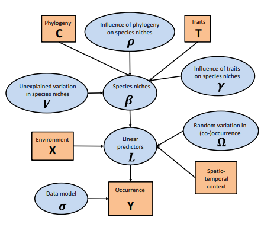
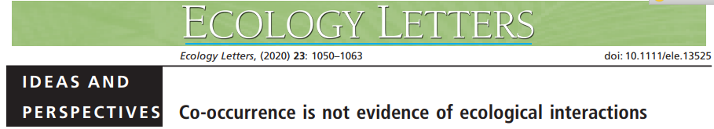
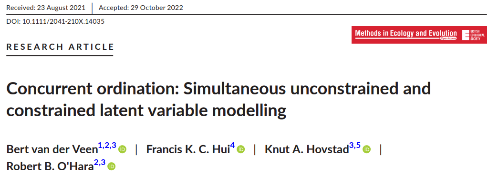
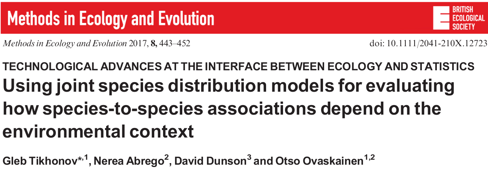
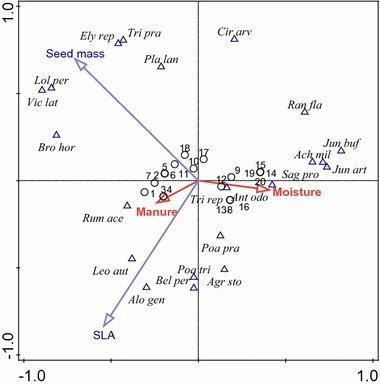
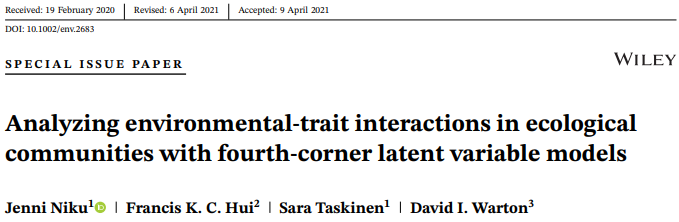
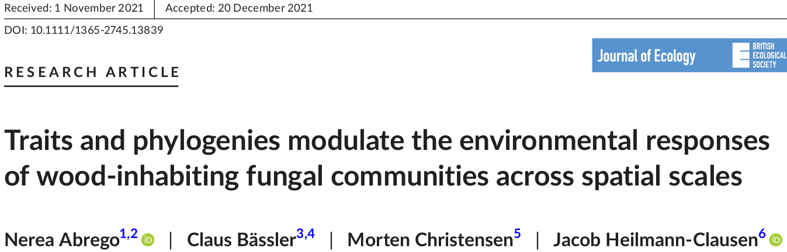

```{r setup, include=FALSE}
library(knitr)

default_source_hook <- knit_hooks$get('source')
default_output_hook <- knit_hooks$get('output')

knit_hooks$set(
  source = function(x, options) {
    paste0(
      "\n::: {.codebox data-latex=\"\"}\n\n",
      default_source_hook(x, options),
      "\n\n:::\n\n")
  }
)

knit_hooks$set(
  output = function(x, options) {
    paste0(
      "\n::: {.codebox data-latex=\"\"}\n\n",
      default_output_hook(x, options),
      "\n\n:::\n\n")
  }
)

knitr::opts_chunk$set(echo = TRUE)
```

# Outline

- Attitude
- Species associations
- Residual correlations concurrent ordination
- Fourth corner LVMs
- Phylogenetic models

## Questions so far?

\center

{width=40%}

## Background

If you have presence-absence data of a species, you fit a Species Distribution Model of the form:

\begin{equation}
y_{ij} = \alpha + \textbf{x}_i^\top\symbf{\beta}
\end{equation}

- $\textbf{x}_i$ is usually a bioclimatic variable
- Then you want to predict where a species may occur
- Potentially based on future climate scenarios
- But what if you have data on multiple species?
  - Fitting multiple SDMs requires \textit{independence}

# JSDM

## Joint Species Distribution Modeling

A decade ago, Joint Species Distribution Models (JSDM) were introduced to model data of multiple species

- [Pollock et al. (2015): co-occurrence of frogs and trees](https://besjournals.onlinelibrary.wiley.com/doi/10.1111/2041-210X.12180)
- [Clark et al. (2015): co-occurrence of trees](https://esajournals.onlinelibrary.wiley.com/doi/10.1890/13-1015.1)

\centering

Both of these are multivariate probit models

## Joint Species Distribution Modeling


\centering

{width=75%}

## Joint Species Distribution Modeling

The idea of JSDMs was to incorporate \textit{species associations}

- Species may co-occur due to biotic interactions
- Due to similar environmental preferences
- Or because they have a similar history

Either how, it results in correlations between responses



## JSDM: the model 

\begin{equation}
\tikzmarknode{t1}{\highlight{red}{\eta_{ij}}}
= 
\tikzmarknode{t2}{\highlight{blue}{\beta_{0j}}}
+
\tikzmarknode{t3}{\highlight{gray}{\ldots}}
+
\tikzmarknode{t4}{\highlight{yellow}{\epsilon_{ij}}}
\end{equation}

- $\tikzmarknode{n1}{\highlight{yellow}{\symbf{\epsilon}_i \sim \mathcal{N}(0,\symbf{\Sigma})}}$
- $\symbf{\Sigma}$ is the matrix of \textit{species associations}
- So we expect a positive values of species co-occur, and negative if they do not
- Problem: its size grows very quickly

\begin{tikzpicture}[overlay,remember picture]
        \draw[->] (n1) -| ([xshift=0.1cm]n1.east) |- ([xshift=0.1cm, yshift = 0.3cm]n1.east) -| (t4);
\end{tikzpicture}

## Species associations

- Difficult to estimate: there are usually too many parameters
- Can only fir this way when there are (much) more sites than species
- The number of pairwise associations grows quadratically
  - 2 with 2 species, 6 for 4 species, 45 for 10 species, 4950 for 100

\begin{equation}
\symbf{\Sigma} = \begin{bmatrix}
 1 & sp_{12} & \cdots & & sp_{1j} \\
 sp_{21} & 1 & \cdots & & sp_{2j} \\
 \vdots &  &\ddots &  &\vdots \\
 sp_{j1} & sp_{j2} &\cdots & & 1\\
 \end{bmatrix}
\end{equation}

\center
\textcolor{red}{This very quickly becomes an issue for fitting models}

## Ordination to the rescue

GLLVMs were introduced as a technical solution to this problem

- The species loadings represent correlation of species, for random effect LVs
- $\epsilon_{ij} \overset{d}{\approx} \symbf{z}_i^\top\symbf{\gamma}_j$
- The square of species loadings forms the species association matrix: $\symbf{\Sigma} \approx \symbf{\Gamma}\symbf{\Gamma}^\top$

"The factor analytic solution" because factor analysis \tiny (Spearman, 1904) \normalsize is the precursor of GLLVMs

## Ordination vs. JSDMs

O'Hara and van der Veen (submitted) discuss some differences. Generally:

\begin{table}[ht]
\begin{tabularx}{\linewidth}{|>{\raggedleft\arraybackslash}p{2.3cm}|>{\raggedright\arraybackslash}p{3.5cm}|>{\raggedright\arraybackslash}p{4cm}|}
\toprule
  & Ordination & JSDM\\
 \midrule
Focus  & Species relationships & Distributions\\
Goal  & Inference & Prediction \\
Data type  & Usually quantitative & Binary \\
Scale  & Local & Regional \\
Covariates  & Environmental & Bioclimatic \\ 
Presentation  & Ordination diagram & Correlation plot/map \\
Audience  & Community ecologists & Macro ecologists\\
\bottomrule
\end{tabularx}
\end{table}

## Ordination vs. JSDMs

The models formulated are usually different:

\textbf{Ordination}: formulate models based on LVs \newline
\textbf{JSDM}: formulate models based on species associations

\columnsbegin
\column{0.5\textwidth}

 

\column{0.5\textwidth}



\columnsend

## Ordination and species associations

In \texttt{gllvm} we can also extract species associations: one more tool for examining our results \newline
With the `getResidualCov` and `getResidualCor`, or `getEnvironmentalCov` and `getEnvironmentalCor` functions

# Example

## Example with Eucalyptus data (Pollock et al. 2015)

```{r}
Y <- read.csv("../data/eucalyptY.csv")[,-1]
X <- read.csv("../data/eucalyptX.csv")[,-1]
X <- data.frame(lapply(X, function(x)if(is.numeric(x)){scale(x)}else{as.factor(x)}))
```

- 20 species
- 458 sites
- Soil covariates and a few bioclimatic

## Example with Eucalyptus data

\footnotesize

```{r, cache = TRUE, message = FALSE, warning=FALSE}
cnord <- gllvm::gllvm(Y, X = X, lv.formula = 
  ~ Rockiness + Loaminess + Sandiness + cvTemp + PPTann + VallyBotFlat, 
  family = "binomial", num.lv.c = 2, randomB="LV", reltol=1e-15,maxit=6e3,
  starting.val="res",seed=1, optim.method="L-BFGS-B", 
  link = "logit",n.init=100, n.init.max=10)
```

\normalsize

- First LV has little unmeasured variation
- Second LV has a lot of unmeasured variation

## Example with Pollock et al (2015) data

\footnotesize

```{r jsdm, eval = TRUE, echo = -1, fig.show="hide", dev="png", warning=FALSE, fig.height = 6, dpi = 150}
par(mfrow=c(1,2))
Covar.cor <- gllvm::getEnvironCor(cnord)
Resid.cor <- gllvm::getResidualCor(cnord)
ReOrderNames <- c("ALA", "ARE", "GON", "PAU", "SER", "VER", "VIC", 
  "ARO", "BAX", "CAM", "LEU", "MEL", "OBL", "OVA", "RAD", "RUB", "SAB", "VIMcyg", "VIMvim", "WIL")
Covar.cor <- Covar.cor[ReOrderNames, ReOrderNames]
Resid.cor <- Resid.cor[ReOrderNames, ReOrderNames]
# LV above diagonal, covariates below
Covar.cor.tmp <- Covar.cor
Covar.cor.tmp[lower.tri(Covar.cor.tmp, diag = TRUE)] <- 0
Resid.cor.tmp <- Resid.cor
Resid.cor.tmp[upper.tri(Resid.cor.tmp, diag = TRUE)] <- 0
Correlations <- Covar.cor.tmp + Resid.cor.tmp
# Covariates on lower triangle, residual on upper triangle
corrplot::corrplot(Correlations, tl.cex = 1, win.asp = 1.5)
gllvm::ordiplot(cnord, biplot = TRUE, s.colors = "transparent", 
xlim = c(-5,5), cex.spp = 1.5, cex.env = 1.5, arrow.scale = 2, rotate = FALSE)
```

## Example with Pollock et al (2015) data

`)

# The 4th corner

At present, model-based ordination techniques are lacking that incorporate traits \newline

## Fourth corner analysis

\begin{tikzpicture}[
node distance = 5mm,
 inbox/.style = {rectangle, draw, rounded corners,
                 minimum height=18mm, minimum width=32mm ,
                 align=center, inner xsep=6mm, inner ysep=3mm},
outbox/.style = {rectangle, draw=red, densely dashed, rounded corners,
                 inner xsep=3mm, inner ysep=3mm}
                    ]
\node (inner1) [inbox, fill = olive!50!green!40!] {\includegraphics[width=0.1\paperwidth]{beetle.png}};
\node (inner3) [inbox, right=of inner1, fill = blue!80!darkgray!40] {\includegraphics[width=0.1\paperwidth]{wind.png}};
\node (inner2) [inbox, below=of inner1, fill = yellow!30!red!20] {\includegraphics[width=0.1\paperwidth]{wing.png}};
\visible<1>{
    \node (innera) [below=of inner3, right=of inner2] {\vbox {
    \begin{itemize}
    \item $\textbf{Y}$: community data
    \item $\textbf{X}$: environmental variables
    \item $\textbf{TR}$: species traits
    \end{itemize}
}};
}
\visible<2>{
\node (outer1) [outbox, fit = (inner1) (inner3)] {};
   \draw[->,thick] ([yshift=-9mm, xshift = 3mm]inner3.north west) -- ([yshift=-9mm, xshift = -3mm]inner1.north east);
    \node (innerb) [below=of inner3, right=of inner2] {\vbox {
    \begin{itemize}
    \item Species-environment relationship
    \item GLM or CO
    \end{itemize}
}};
}

\only<3>{
\node (outer1) [outbox, fit = (inner1) (inner2)] {};
   \draw[->,thick] ([xshift=-16mm, yshift =-3mm]inner2.north east) -- ([yshift=3mm, xshift = -16mm]inner1.south east);
    \node (innerc) [below=of inner3, right=of inner2] {\vbox {
    \begin{itemize}
    \item Species-trait relationship
    \item GLM or CO
    \end{itemize}
}};
}
\visible<4>{
\draw[outbox, draw = blue] ([yshift=3mm, xshift=-3mm, ]inner1.north west) -- ([yshift=3mm, xshift=3mm]inner3.north east)
   -- ([yshift=-3mm, xshift=3mm]inner3.south east) -- ([yshift=-3mm]inner3.south west)
   -- ([yshift=2mm, xshift=3mm]inner2.north east) -- ([yshift=-3mm, xshift=3mm]inner2.south east) 
   -- ([yshift=-3mm, xshift=-3mm]inner2.south west) -- cycle;
   
   \node (inner4) [inbox, below=of inner3, fill = purple!20] {$\textbf{???}$};
   
   \draw[->,thick] ([yshift=-9mm, xshift = 3mm]inner3.north west) -- ([yshift=-9mm, xshift = -3mm]inner1.north east);
   \draw[->,thick] ([xshift=-16mm, yshift =-3mm]inner2.north east) -- ([yshift=3mm, xshift = -16mm]inner1.south east);
   
   \draw[->,thick] (inner3.south) -- (inner4.north);
   \draw[->,thick] (inner2.east) -- (inner4.west);

   \draw[->,thick] ([xshift = 3mm, yshift = -3mm]inner4.north west) -- ([yshift=3mm, xshift=-3mm]inner1.south east);
   \node (innera) [right=of inner4, yshift=3mm] {\includegraphics[scale=0.2]{the_4th.jpg}};
}
\end{tikzpicture}

## Trait-based analysis

\begin{columns}
\begin{column}{0.6\textwidth}
\begin{enumerate}
\item CWM + RDA \footnotesize \textit{Doledec et al. (1996)} \normalsize
\item Double constrained ordination \footnotesize \textit{Lebreton et al. (1988), ter Braak et al. (2018)} \normalsize
\item Fourth corner (LV) Models \footnotesize \textit{Brown et al. (2014), Ovaskainen at al. (2017), Niku et al. (2021)} \normalsize
\end{enumerate}
\end{column}
\begin{column}{0.4\textwidth}

```{r echo=F, fig.align="center", fig.cap="Quadriplot \\newline \\footnotesize \\textit{ter Braak et al. (2018)} \\normalsize", dpi=300, out.width="99%"}
knitr:::
```
\end{column}
\end{columns}

##  Fourth-corner LVMs

A kind of LVM (JSDM) that also includes traits



##  Fourth-corner LVMs

\begin{equation}
\eta_{ij} = \beta_{0j} + \textbf{x}_i^\top(\tikzmarknode{t1}{\symbf{\beta}_x} + \tikzmarknode{t2}{\textbf{b}_j}) + \tikzmarknode{t4}{\textbf{tr}_j^\top} \tikzmarknode{t3}{\textbf{B}_{xtr}}\textbf{x}_i
\end{equation}

\begin{itemize}
\item \tikzmarknode{n1}{$\symbf{\beta}_x$ community effects}
\item \tikzmarknode{n2}{$\textbf{b}_j$ species-specific effects}
\item \tikzmarknode{n3}{ $\textbf{B}_{xtr}$ 4th-corner coefficients }
\end{itemize}

\begin{tikzpicture}[overlay,remember picture]
        \draw[->] (t1) -- ([yshift=0.3cm]t1.north) -| ([xshift = -0.8cm]n1.west) |- ([xshift = -0.5cm]n1.west);
        \draw[->] (t2.south) |- (n2.east);
        \draw[->] ([xshift=-0.1cm]t3.south) |- (n3.east);
        \draw[->] (t4.north) -- ++ (0,1) node[above] {Traits};
\end{tikzpicture}

## Fourth-corner LVMs

Hierarchically this means:

\begin{equation}
\symbf{\beta}_j = \symbf{\beta}_x + \symbf{B}_{xtr}\textbf{tr}_j + \textbf{b}_j
\end{equation}

So, we are modeling our species coefficients of covariates

- With an mean effect: $\symbf{\beta}_x$
- Slopes for traits: $\symbf{B}_{xtr}$, these describe how our species' environment responses depend on traits
    - Can be used nicely for hypothesis testing
- An error term $\textbf{b}_j$ to capture everything left

##  Fourth-corner LVMs

- With a 4th corner LVM we can examine trait-environment relationships
- Figure out \textbf{why} species prefer particular conditions
- While still incorporating **other reasons**  for co-occuring (or not)

# Example

## Example with Eucalyptus data

\footnotesize

```{r}
TR <- read.csv("../data/eucalyptTR.csv");row.names(TR) <- TR$TAXON
```

## Example with Eucalyptus data

\footnotesize 

```{r, cache = TRUE, message = FALSE, warning=FALSE, message = FALSE, results = "hide"}
library(gllvm)
TMB::openmp(7)
fit4th <- gllvm(Y, X, TR = TR, 
formula = ~ Rockiness + Loaminess + Sandiness + cvTemp + PPTann + VallyBotFlat + 
(Rockiness + Loaminess + Sandiness + cvTemp + PPTann + VallyBotFlat):
( MedianSLA + MaxHeight.m. + MedianSeedMass.mg.),
randomX = ~ Rockiness + Loaminess + Sandiness + cvTemp + PPTann + VallyBotFlat,
                   , family = "binomial", seed = 1, n.init = 3)
```

## Example with Eucalyptus data

\supertiny

```{r}
summary(fit4th)
```

## Example with Eucalyptus data

\footnotesize 

```{r 4th, cache = TRUE, fig.height = 5}
gllvm::coefplot(fit4th)
```

## Example with Eucalyptus data

\footnotesize

```{r 4th2, echo = -1, cache = TRUE, fig.height = 5}
fourth <- fit4th$fourth.corner
a <- 1.5
colort <- colorRampPalette(c("blue", "white", "red"))
plot.4th <- lattice::levelplot((as.matrix(fourth)), xlab = "Environmental Variables", 
                      ylab = "Species traits", col.regions = colort(100), cex.lab = 1.3, 
                      at = seq(-a, a, length = 100), scales = list(x = list(rot = 45)))
plot.4th
```

## Example with Eucalyptus data

```{r, cache = TRUE, fig.height = 5}
gllvm::randomCoefplot(fit4th, which.Xcoef = "cvTemp")
```

## Example with Eucalyptus data

```{r, cache = TRUE, fig.height = 4}
corrplot::corrplot(gllvm::getResidualCor(fit4th), order = "AOE")
```

## Example with Eucalyptus data

Fit random effect model without traits (in dev version)

\footnotesize

```{r, cache = TRUE}
library(gllvm)
TMB::openmp(parallel::detectCores()-1)
fit <- gllvm(Y, X, 
formula = ~ (0+Rockiness + Loaminess + Sandiness + cvTemp + PPTann + VallyBotFlat|1),
                   , family = "binomial", seed = 1, n.init = 3)
```

Note: such random effects can be combined with ordination methods

## Example with Eucalyptus data

\supertiny

```{r}
summary(fit)
```

## Example with Eucalyptus data

\footnotesize

```{r}
anova(fit4th, fit)
```

We accept the alternative hypothesis: species responses to the environment are structured by traits

# Community Phylogenetics

Models with species random effects in \texttt{gllvm} are new. \newline

\textcolor{red}{This is still in (very) active development, and only available in the development version}

## Phylogenetic random effects

So far, we have been discussing **unstructured** species associations\newline
But what if we have information to provide?

## Phylogenetic random effects

- In the 4th corner model $\textbf{b}_j$ could be structured by Phylogeny
- I.e., More closely related species have similar responses to the environment
- Can also structure species-random effects

\vspace*{2\baselineskip}
\centering
\textcolor{red}{The Phylogeny provides more information and makes for more accurate estimation}

\tiny (and we can predict for species without data)

## Phylogenetic random effects

Here I will omit traits and LVs for brevity. So our model is:

\begin{equation}
\symbf{\eta} = \textbf{1}\beta_{0j}^\top + \textbf{X}\textbf{B}
\end{equation}

- Now, $\textbf{B}$ are species random slopes for covariates
- And we assume $\textbf{B} \sim \mathcal{N}(\textbf{0}, \symbf{\Sigma}_m \otimes \symbf{\Sigma}_r)$
- $\symbf{\Sigma}_r$ covariance matrix of random effects
- $\symbf{\Sigma}_m$ correlation matrix due to phylogeny

\centering
\textcolor{red}{\textbf{We assume that all our random effects are structured by the Phylogeny}}

## Phylogenetic random effects

\begin{equation}
\symbf{\Sigma}_m = \textbf{C}\rho + (1-\rho)\textbf{I}
\end{equation}

1) $\textbf{C}$ is a correlation matrix due to the Phylogeny (`ape::vcv(., corr = TRUE)`)
2) $0\leq\rho\leq1$ is Pagel's $\lambda$: the Phylogenetic signal parameter
  - 1: Fully phylogenetically structured responses
  - 0: Normal ("iid") random effects

So: this model only generates positive species associations.

# Example

## Example with fungi data (Abrego 2021)

\centering



## Example with fungi data 

\footnotesize

```{r}
Y = read.csv("../data/fungiY.csv",)[,-1]
X = read.csv("../data/fungiX.csv")[,-1]
tree = ape::read.tree("../data/fungiTree.txt")
```

- 215 species (after cleaning)
- 1666 sites
- 19 covariates of various kinds

## Example with fungi data

```{r tree, fig.align="center", fig.height = 5}
plot(tree, show.tip.label = FALSE)
```

## Example with fungi data

\footnotesize

```{r fita, cache = TRUE, message = FALSE, warnings=FALSE, results="hide"}
TMB::openmp(parallel::detectCores()-1)
fita <- gllvm(y=Y, X=X, family = "binomial", num.lv = 0, sd.errors = FALSE, 
      row.eff = ~(1 | REGION/RESERVE), studyDesign = X[,c("REGION","RESERVE")],
      formula = ~(0+DBH.CM+AVERDP+I(AVERDP^2)+CONNECT10+TEMPR+PRECIP+log.AREA|1), 
      colMat = list(ape::vcv(tree)[colnames(Y),colnames(Y)], 
              dist = ape::cophenetic.phylo(tree)[colnames(Y),colnames(Y)]), 
                    nn.colMat = 5, max.iter=10e3, n.init = 3)
```

## Example with fungi data

\supertiny

```{r fitas, cache = TRUE, message = FALSE, warnings=FALSE}
summary(fita)
```

## Example with fungi data

\footnotesize

```{r heatmap, cache = TRUE, fig.height = 3, out.height = "50%", dev ="png", fig.show = "hide", dpi = 150}
heatmap(t(fita$params$Br),
Rowv = phylogram::as.dendrogram(tree), Colv=NA, 
col = colorRampPalette(c("blue","white","red"))(ncol(Y)), scale = "none")
```

```{r, eval = FALSE, echo = FALSE}
fita <- knitr::load_cache("fita_609072d8481796004d57cce0fab086e4", path="JSDM_cache/beamer/", object = "fita")
```
## Example with fungi data

\centering

`)

# Summary

- Ordination and JSDMs are two frameworks for analysing species co-occurrence data
- One focuses on inference, the other prediction
- The GLLVM framework is used differently in both
- We formulate models differently
- But can (and really should) learn from each other
- Model-based ordination with traits and Phylogeny to follow in the future