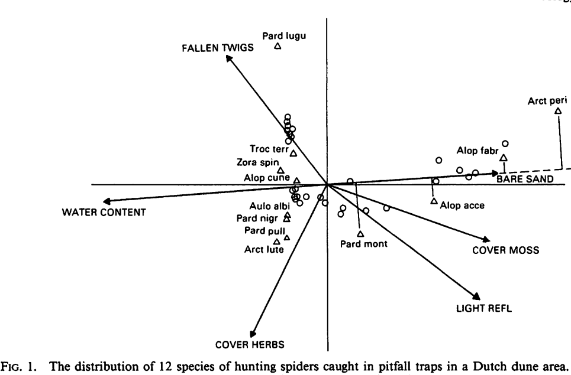

```{r setup, include=FALSE}
library(knitr)

default_source_hook <- knit_hooks$get('source')
default_output_hook <- knit_hooks$get('output')

knit_hooks$set(
  source = function(x, options) {
    paste0(
      "\n::: {.codebox data-latex=\"\"}\n\n",
      default_source_hook(x, options),
      "\n\n:::\n\n")
  }
)

knit_hooks$set(
  output = function(x, options) {
    paste0(
      "\n::: {.codebox data-latex=\"\"}\n\n",
      default_output_hook(x, options),
      "\n\n:::\n\n")
  }
)

knitr::opts_chunk$set(echo = TRUE)
```

# Outline

- Background
- Constrained ordination
- Concurrent ordination

## Questions so far?

\center

{width=40%}

## Background

So far: only unconstrained ordination

- Which is fun, but not if you want to assess species-environment relationships
- Here we will focus on including covariates in the model
  - One form of that **constrained** ordination
- Will also cover: **residual** ordination, and **concurrent** ordination

# Residual ordination

## Residual ordination: the model

\begin{equation}
\tikzmarknode{t1}{\highlight{red}{\eta_{ij}}}
= 
\tikzmarknode{t2}{\highlight{blue}{\beta_{0j}}}
+
\tikz[baseline,remember picture]{
\node[anchor=base,rectangle, draw=grey, fill=grey!17, dashed] (t34) {$
\tikzmarknode{t3}{\highlight{grey}{\textbf{x}_i^\top}}
\tikzmarknode{t4}{\highlight{grey}{\symbf{\beta}_j}}
$}
}
+
\tikzmarknode{t5}{\highlight{yellow}{\textbf{z}_i^\top}}
\tikzmarknode{t6}{\highlight{green}{\symbf{\gamma}_j}}
\end{equation}

\tikzmarknode{n1}{Covariates with species-specific coefficients ("conditioning")}

\begin{tikzpicture}[overlay,remember picture]
        \draw[->] (n1) -| ([xshift=0.1cm]n1.east) |- ([xshift=0.1cm, yshift = 0.3cm]n1.east) -| (t34);
\end{tikzpicture}

- No longer an unconstrained ordination: covariates are involved
- For binary data it is a JSDM (more later)
- We can also use it to adjust the ordination (take an effect out)
- We estimate species-specific effect $\symbf{\beta}_j$ so need a good amount of data

# Constrained ordination

\textbf{Goal}: to determine if (how) environment affects community composition \newline
\textbf{Problem}: many possible drivers (if not, multivariate GLM would do the trick)

\columnsbegin
\column{0.6\textwidth}
\begin{itemize}
\item Why are sites different?
\item Why do species co-occur (or not)?
\item Which components of the environment are most important for the community?
\end{itemize}

\column{0.4\textwidth}
```{r, echo=F, eval=T, out.width="99%", fig.cap="ter Braak 1986"}

```

\columnsend

## Constrained ordination 

```{r, echo=F, eval=T, out.width="75%", fig.cap="ter Braak 1986", fig.align="center"}

```

Now three quantities: so we call this a **triplot**. The arrows show the association of covariates to the axes.

## Methods for constrained ordination 

\begin{itemize}
\item Redundancy Analysis \tiny (Rao 1964)  \normalsize
\item Canonical Correspondence Analysis \tiny (ter Braak 1986) \normalsize
\item RR-GLMs \tiny (Yee et al. 1996,2003,2010,2015) \normalsize
\item Row-column interaction models  \tiny (Hawinkel  et al. 2019) \normalsize
\item GLLVMs \tiny (van der Veen  et al. 2023) \normalsize
\end{itemize}

## Canonical Correspondence Analysis

- Although RDA was developed much earlier, CCA has been the leading constrained ordination method
- ter Braak (1986) developed CCA as a combination of ordination and regression
- Each axis is restricted (constrained) by covariate information
- CCA approximates Gaussian Ordination \tiny (i.e., to the unimodal model, Johnson and Altman, 1999) \normalsize

## Canonical Correspondence Analysis: arrows

The covariate coefficients $\textbf{B}$ are referred to as **canonical** coefficients.

- \texttt{vegan} does not use these for plotting
- Instead it uses sample correlation coefficients as recommended by ter Braak (1986)
- The canonical coefficients can be "unstable" due to multicollinearity
- In \texttt{gllvm}, we do use $\textbf{B}$ (more details later)

## Canonical Correspondence Analysis example

\footnotesize

```{r constr, fig.align="center", fig.height = 4}
data(dune,dune.env, package = "vegan");Y=dune;X=dune.env
cca <- vegan::cca(Y, X)
vegan::ordiplot(cca)
```

\normalsize

Canonical coefficients can be retrieved `vegan::scores(cca, display = "reg")`

## Different scores

The CCA algorithm gives raise to two sets of site scores:

1) Weighted average (WA) scores
2) Linear combination (LC) scores

WA scores are usually recommended for plotting \tiny (Palmer, 1993) \normalsize

## Constrained ordination

### In R e.g.

For constrained ordination:
\begin{itemize}
\item \texttt{vegan} - classical methods
\item \texttt{VGAM} - cool algorithm, faster than \texttt{gllvm}, but not so easy to use (and no random effects)
\item \texttt{gllvm} - easy to use
\end{itemize}

## Constrained ordination: the model

\begin{equation}
\tikzmarknode{t1}{\highlight{red}{\eta_{ij}}}
= 
\tikzmarknode{t2}{\highlight{blue}{\beta_{0j}}}
+
\tikzmarknode{t3}{\highlight{yellow}{\textbf{z}_i^\top}}
\tikzmarknode{t4}{\highlight{green}{\symbf{\gamma}_j}}
\end{equation}

So far, we have assumed $\textbf{z}_i =  \symbf{\epsilon}_i$ \newline
Constrained ordination instead assumes $\textbf{z}_i = \textbf{B}^\top\textbf{x}_i$

## Constrained ordination: the model

Plugging in  $\symbf{z}_i =  \symbf{\epsilon}_i$ we get:
\begin{equation}
\tikzmarknode{t1}{\highlight{red}{\eta_{ij}}}
= 
\tikzmarknode{t2}{\highlight{blue}{\beta_{0j}}}
+
\tikzmarknode{t3}{\highlight{yellow}{\textbf{x}_i^\top\symbf{B}}}
\tikzmarknode{t4}{\highlight{green}{\symbf{\gamma}_j}}
\end{equation}

From this we see that $\symbf{\beta}_j \overset{d}{\approx} \textbf{B}\symbf{\gamma}_j$

- These are the (reduced rank) approximated species-specific covariate coefficients
- We can extract these, and inspect them with statistical uncertainty
- So we use information across the whole community, to estimate species-specific responses

## Constrained ordination with \texttt{gllvm}

```{r, echo=F, eval=T, fig.align="center", out.width="55%"}
knitr::include_graphics("demonstration.jpg")
```

## Example with Dune data

\footnotesize

```{r, cache = TRUE, echo = -c(1,5,6), fig.height = 4, warning = FALSE, message = FALSE}
par(mfrow=c(1,2))
X[,1] <- scale(X[,1]) # always center/scale your covariates for gllvm
X[,c(2:5)] <- data.frame(lapply(X[,c(2:5)],factor,ordered=FALSE)) # I do not want ordered factors
cord <- gllvm::gllvm(y = Y, X, num.RR = 2, family = "ordinal",
            starting.val="res",zeta.struc="common", seed = 2160)
gllvm::ordiplot(cord, biplot = TRUE, main  ="With species loadings") # can get weird placement due to insufficient data
gllvm::ordiplot(cord, main = "Without species loadings")
```

\normalsize

## Example with Dune data

\tiny

```{r}
summary(cord)
```

## Example with Dune data

\tiny

```{r}
summary(cord, by = "terms")
```

These are to reduce the cognitive load, please do not stare at them \textbf{too} much.

## Example with Dune data

\footnotesize

```{r, fig.align="center", fig.height = 5}
gllvm::coefplot(cord, which.Xcoef="A1")
```

\normalsize

Species effects with 95% confidence interval

## Constrained ordination

- Species effects can be retrieved for any covariate
- Extreme results occur, usually due to insufficient data
- GLLVMs picks up on extreme clustering -very- well

## Constrained ordination

The first implementation of CO that can be combined with random effects

- Random site effects (outside ordination)
- Random canonical coefficients (more in a few slides)

## Common misconception

\textcolor{red}{Post-hoc relating unconstraied ordination axes to environmental covariates is \textbf{not} equivalent to a constrained ordination}

Also it is bad practice: please do not do it. Instead \textbf{adjust your model}.

## Hybrid ordination

- Incorporate both constrained and unconstrained ordination
- But without explicit connection
- Default in \texttt{vegan} can also do it in \texttt{gllvm} (use both `num.RR` and `num.lv`)

# Concurrent ordination

- In practice, constrained and unconstrained ordination are often combined into an analysis \newline

- Variation not due to the environment is discared, while potentially of large importance

- \textit{Concurrent ordination} is a new type of ordination method that combines unconstrained and constrained ordination

## Concurrent ordination

\textit{Concurrent:'existing or happening at the same time'} \tiny (Oxford's dictionary) \normalsize

\only<2>{
\begin{enumerate}
\item Suggested in van der Veen et al. (accepted MEE)
\item Performs both unconstrained and constrained ordination \textbf{simultaneously}\newline
\item Ordination axes have \textbf{measured} and \textbf{unmeasured} components
\item Covariates \textit{inform} rather than \textit{constrain}
\item Separates out drivers of community composition
\end{enumerate}
}

## Concurrent ordination: \alt<7>{site scores}{the model}

\begin{equation}
\tikzmarknode{t1}{\highlight{red}{\eta_{ij}}}
= 
\tikzmarknode{t2}{\highlight{blue}{\beta_{0j}}}
+
\tikzmarknode{t3}{\highlight{yellow}{\textbf{z}_i^\top}}
\tikzmarknode{t4}{\highlight{green}{\symbf{\gamma}_j}}
\end{equation}

The model is flexible, $\tikzmarknode{n1}{\textbf{z}_i}$ can be all kinds of things.

\begin{tikzpicture}[overlay,remember picture]
        \draw[->] (t3) |- ([yshift = 0.5cm]n1.north) -- (n1);
        \draw<3->[->] (n1) |- ([xshift = -0.8cm]n2.north west) |- ([xshift = -0.5cm]n2.west);
        \draw<4->[->] ([xshift = -0.8cm]n2.north west) |- ([xshift = -0.5cm]n3.west);
        \draw<5->[->] ([xshift = -0.8cm]n3.north west) |- ([xshift = -0.5cm]n4.west);
\end{tikzpicture}

\begin{enumerate}
\item<3-7> $\tikzmarknode{n2}{\highlight{yellow}{\textbf{z}_i}} = \symbf{\epsilon}_i,$ \alt<7>{\textcolor{red}{residual}}{\textbf{unconstrained}}
\item<4-7> $\tikzmarknode{n3}{\highlight{yellow}{\textbf{z}_i}} = \textbf{B}^\top\textbf{x}_i,$ \alt<7>{\textcolor{red}{marginal}}{\textbf{constrained}}
\item<5-7> $\tikzmarknode{n4}{\highlight{yellow}{\textbf{z}_i}} = \textbf{B}^\top\textbf{x}_i + \symbf{\epsilon}_i,$ \alt<7>{\textcolor{red}{conditional}}{\underline{\textbf{concurrent}}}
\item<6-7>[] Often unconstrained and concurrent ordinations are similar
\end{enumerate}

## Concurrent ordination: the model

\begin{center}
\textcolor{red}{Essentially a linear mixed-effects model of $\textbf{z}_i$} \newline
\scriptsize{(pending an improved software implementation)}
\end{center}

## Concurrent ordination with \texttt{gllvm}

```{r, echo=F, eval=T, fig.align="center", out.width="55%"}
knitr::include_graphics("demonstration.jpg")
```

## Example with Dune data

\footnotesize

```{r, cache = TRUE, warning = FALSE, message = FALSE}
cnord <- gllvm::gllvm(y = Y, X, num.lv.c = 2, family = "ordinal",
            starting.val="res", seed = 5882)
coef(cnord, parm="Cancoef")
```

## Example with Dune data

```{r cnord, cache = TRUE, warning = FALSE, message = FALSE, dev="png", fig.show = "hide", fig.height = 7, dpi = 150}
layout(matrix(c(1,1,2,3), 2, 2, byrow=TRUE))
gllvm::ordiplot(cnord, type= "conditional", rotate = FALSE) 
gllvm::ordiplot(cnord, type = "marginal", rotate = FALSE) 
gllvm::ordiplot(cnord, type = "residual", rotate = FALSE)
```

## Example with Dune data

\centering

`)


## Random canonical coefficients

We can treat the canonical coefficients as random with `randomB`

- This is usually faster
- Treats the "bouncing beta" problem
- Models correlation between species due to environment

1) LV: canonical coefficients of the same ordination axis come from the same distribution
  - Shrinkage over LVs
2) P: canonical coefficients of the same covariate come from the same distribution
  - Shrinkage over covariates
3) single: all come from the same distribution

## Example with Dune data

\footnotesize

```{r, cache = TRUE, warning = FALSE, message = FALSE}
cnord2 <- gllvm::gllvm(y = Y, X = X, num.lv.c = 2, family = "ordinal",
            starting.val="res", randomB="LV", seed = 318)
```

\normalsize

## Example with Dune data

```{r, cache = TRUE, warning = FALSE, message = FALSE, fig.height = 7, echo = FALSE, dpi = 150}
layout(matrix(c(1,1,2,3), 2, 2, byrow=TRUE))
gllvm::ordiplot(cnord2, type= "conditional", rotate = FALSE) 
gllvm::ordiplot(cnord2, type = "marginal", rotate = FALSE) 
gllvm::ordiplot(cnord2, type = "residual", rotate = FALSE)
```

## Example with Dune data

\footnotesize

```{r, cache = TRUE, warning = FALSE, message = FALSE, fig.height = 5}
summary(cnord2)
```

## Example with Dune data

\footnotesize

```{r, cache = TRUE, warning = FALSE, message = FALSE, fig.height = 5}
coef(cnord2, "Cancoef")
```

## Example with Dune data

\footnotesize

```{r, cache = TRUE, warning = FALSE, message = FALSE, fig.height = 5}
gllvm::getPredictErr(cnord2)$b.lv
```

## Example with Dune data

```{r, cache = TRUE, warning = FALSE, message = FALSE, fig.height = 5, fig.align="center"}
gllvm::randomCoefplot(cnord2, which.Xcoef="A1")
```

# Summary

- Ordination with covariates has three flavours in GLLVM:
  - Residual ordination (actually, not really an ordination with covariates)
  - Constrained ordination
  - Concurrent ordination (combining unconstrained and constrained)
- Random canonical coefficients via the `randomB` argument 
- Many other useful functions for these models

\hfill {width=50%}
