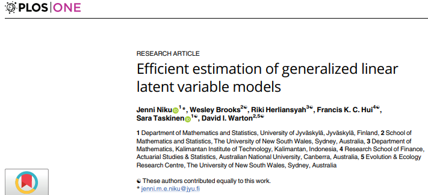

```{r setup, include=FALSE}
library(knitr)

default_source_hook <- knit_hooks$get('source')
default_output_hook <- knit_hooks$get('output')

knit_hooks$set(
  source = function(x, options) {
    paste0(
      "\n::: {.codebox data-latex=\"\"}\n\n",
      default_source_hook(x, options),
      "\n\n:::\n\n")
  }
)

knit_hooks$set(
  output = function(x, options) {
    paste0(
      "\n::: {.codebox data-latex=\"\"}\n\n",
      default_output_hook(x, options),
      "\n\n:::\n\n")
  }
)

knitr::opts_chunk$set(echo = TRUE)
```

# Outline

## Questions so far?

\centering

{width=40%}

## Background

- GLLVMs are complex models
- Convergence can be difficult
- Presenting results can be challenging

Here I present some tips/tricks that can be useful \newline
Apologies in advance, it will be a bit all over the place

## GLMM FAQ

Need something like [Ben Bolker's GLMM FAQ](https://bbolker.github.io/mixedmodels-misc/glmmFAQ), but for GLLVMs \newline
But most (all?) from GLMs and GLMMs also applies to GLLVMs

## Outline: a collection of tools, tips and tricks

<!-- this is essentially an FAQ-->

\columnsbegin
\column{0.5\textwidth}

\textbf{Tools}

- Confidence intervals
- Information criteria
- Hypothesis testing
- Residuals (and code for \texttt{DHARMa})
- \texttt{emmeans} and `MuMIn::dredge`
- Concurrent and $r^2$
- `ordiplot`, `coefplot`, `randomCoefPlot`
- `summary` and plot summary (dev)
- Using \texttt{vegan}

\column{0.5\textwidth}

\textbf{Tips or tricks}

- LV parameterisation
- Missing response data
- Using a saved \texttt{gllvm} object
- Parallelisation
- Ggplotting a \texttt{gllvm}
- Optimisation and all that
- Starting values
- Small LV values
- Large loadings, small sigma.lv
- (Very) small standard errors
- Predicting/intervals
- Variation partitioning

\columnsend

\center
\textbf{\textcolor{red}{More?}}

# Tools

## Information criteria

\texttt{gllvm} provides support for BIC and AIC(c)

- BIC: finds the model closest to the truth
- AIC: finds the model that predicts best
- AICc: penalizes a little stronger than AIC, but was developed for linear models

You can use these, but do so sparingly. They are sensitive to (e.g.,)

- Model misspecification
- Boundary effects (constrained parameters)
- Large sample asymptotics
- Focus issues

## Information criteria

Depending on the problem, there are many ways to do selection

- The covariates?
- The random effects?
- The latent variables?
- Combinations thereof?

## Information criteria: example

\footnotesize

```{r, cache=TRUE, echo = FALSE, fig.height = 3, warning=FALSE}
data(dune,dune.env,package="vegan");Y=dune;X=dune.env
X[,1] <- scale(X[,1]) # always center/scale your covariates for gllvm
X[,c(2:5)] <- data.frame(lapply(X[,c(2:5)],factor,ordered=FALSE)) 

model1 <- gllvm::gllvm(Y, family = "ordinal", num.lv = 2)
model2 <- gllvm::gllvm(Y, family = "ordinal", num.lv = 3)
AIC(model1, model2)
```

1) It seems that the model with 2 LVs is better
2) But what if one of the models has poorly converged?

## Information criteria

Take-away: 

1) Apply carefully
2) Avoid as much as possible
3) Use if necessary
 
## Hypothesis testing

Likelihood ratio test (`anova`) is a similar story:

- Use carefully
- Mind convergence
- Do not use with a large difference in parameters

The same for wald-tests. Do not stare at any of these results for too long.

## Confidence intervals

The `confint(.)` function provides some (approximate) wald confidence intervals

E.g.,

\tiny

```{r}
confint(model1, "theta")
```

- Presenting statistical uncertainty is good practice
- These are large sample CIs, but work pretty well

## Profile CIs

You can also profile parameters thanks to the \texttt{TMB} \texttt{R}-package. These have better properties, but (very) slow to compute.\newline
Finding the right parameter can take some doing (see `model$TMBfn$par`).

For example:

\footnotesize

```{r prof, warning = FALSE, results  ="hide", dev="png", fig.show="hide", dpi =150}
prof <- TMB::tmbprofile(model1$TMBfn, which(names(model1$TMBfn$par)=="lambda")[1])
plot(prof, xlim = c(-7,0))
CIs <- confint(model1);
abline(v = CIs[grepl("theta",row.names(CIs)),][2,1], col = "red", lty = "dotted")
abline(v = CIs[grepl("theta",row.names(CIs)),][2,2], col = "red", lty = "dotted")
abline(v=coef(model1,"loadings")[2,1],col="red",lty="dashed")
```

## Profile CIs

`)


## Using vegan 

The \texttt{vegan} \texttt{R}-package has a lot of useful functions. Some of these can be used with GLLVMs:

- `procrustes`: for comparison of ordinations,
- `ordiplot`: for plotting, though I have yet to work out how to get it to plot arrows
  - this does require a `scores.gllvm` function (present on github in a presentation)
- `ordisurf`? maybe not
- perhaps other functions, I have yet to discover them

## `scores.gllvm`

\supertiny

```{r}
scores.gllvm <- function(x, display  ="sites", choices = NULL){
  sol <- list()
  
  if(is.null(choices) || any(choices>(x$num.lv+x$num.lv.c+x$num.RR))){
    choices <- 1:(x$num.lv+x$num.lv.c+x$num.RR)
  }

  if(display%in%c("sites","both")){
    sol$sites <- gllvm::getLV(x)[,choices,drop=FALSE]
      if(display=="sites"){
        sol <- sol$sites
      }
  }

  if(display%in%c("species","both")){
    sol$species <- gllvm::getLoadings(x)[,choices,drop=FALSE]
      if(display=="species"){
        sol <- sol$species
      }
    }

  return(sol)
}

```

## Using ordiplot in \texttt{gllvm}

This clashes with \texttt{vegan}'s `ordiplot`, so if it errs..

- Scaling is applied by default: does not always work well with unimodal models or with covariates in the ordination
- Arrows for covariates are **relative** so you can make them bigger
- Turn pink due to uncertainty (but you can turn it off)
- `fac.center` is new
- Prediction regions of sites
- By default shows square plots


## Ordiplot

For when `num.lv`, `num.lv.c`, `num.RR` are in the model. \newline
It is very difficult to create a plotting function that always does well.

- Remember that ordination plots are \textbf{conditional} on other effects in the model
- \texttt{vegan}`::ordiplot` will clash with \texttt{gllvm}
- `biplot` adds species coordinates
- Note that `ordiplot` scales and rotates, so it will not (exactly) be the same
  - But inference should not be affected
  
## Ordiplot

- Bad scaling can occur for constrained/concurrent ordination
  - Usually due to extreme clustering: species with too few observations
- Bad scaling can occur for unimodal models
  - Optima that are far outside of the estimated gradient mess things up
  - Draw arrows with `spp.arrows` instead
- Arrows for covariates are drawn from the middle, not from 0
- `fac.center` to draw categorical effects as points
- `type` to select which scores to plot for concurrent or hybrid ordination
- `predict.region`
- use `getLV` and `getLoadings`(new) or `optima.gllvm` to create your own plot

## Using ordiplot in \texttt{vegan}

- If you have `scores.gllvm` you can use \texttt{vegan}'s ordiplot
- I have not yet looked into adding the arrows
- It does not do post-hoc scaling or rotation, which is usually needed

## Using procrustes 

\footnotesize

```{r}
vegan::procrustes(gllvm::getLV(model1), 
                  vegan::scores(vegan::decorana(Y), choices = 1:2), 
                  symmetric = TRUE)
```

The procrustes error is very useful if you want to compare ordinations. \newline
It is a kind of RMSE that accounts for the different in rotation and scale. \newline

## Example with Dune data

\footnotesize

```{r, echo = -1, warning = FALSE, fig.height = 4}
par(mfrow=c(1,2))
cnord <- gllvm::gllvm(Y,X, num.lv.c=2,randomB="LV",family="ordinal", seed = 5882)
gllvm::ordiplot(cnord, predict.region = TRUE, arrow.ci = FALSE)
```

```{r}
vegan::ordisurf(model1, dune.env$A1)
```

## Example with Dune data

\tiny

```{r, fig.height = 4.5, results="hide"}
gllvm::ordiplot(cnord, predict.region = FALSE, fac.center = TRUE, arrow.ci = FALSE, ylim = c(-3,3))
LV = gllvm::getLV(cnord)
rot <- svd(LV)$v
alpha <- 0.5
norms <- sqrt(colSums(LV^2))*sqrt(colSums(gllvm::getLoadings(cnord)^2))
LV <- sweep(LV, 2, (norms^alpha)/sqrt(colSums(LV^2)), "*")%*%rot
vegan::ordisurf(LV, dune.env$A1, add = TRUE, col = "blue")
```

## Residuals and \texttt{DHARMa}

\texttt{gllvm} natively provides randomized quantile residuals. It is possible to use the \texttt{DHARMa} package if preferred, though there is no official support. \texttt{DHARMa} has various tests that can be useful:

1) Zero-inflation
2) Overdispersion
3) Other?

This requires use of `createDHARMa`

## Example

\footnotesize

We do simulations and predictions with \texttt{gllvm}:

```{r sim, cache = TRUE}
# Simulate with model 1000x
sim <- do.call("cbind", replicate(1000, 
        c(as.matrix(gllvm::simulate(cnord, conditional=TRUE))), simplify=FALSE))
preds <- c(predict(cnord))
obs <- c(as.matrix(Y))
```

Note that these need to be in long format. \texttt{DHARMa} handles the rest:

```{r}
dharma <- DHARMa::createDHARMa(
  simulatedResponse=sim, 
  observedResponse=obs, 
  integerResponse=TRUE, 
  fittedPredictedResponse= preds)
```

## Example

```{r, fig.align="center", dpi = 150}
plot(dharma)
```

## Residuals and \texttt{DHARMa}

Do not attempt to use the functions that require refitting models.

- GLLVMs (at present) are not suitable for this
- Refitting will take long
- Refitting without monitoring convergence is a recipe for disaster

## \texttt{emmeans}

When using categorical variables, \texttt{R} by default uses treatment contrasts. So, the first category is dropped.

A popular choice for inspecting categorical variables is the \texttt{emmeans} package. I recently developed some code to support this (not part yet of \texttt{gllvm})

- Can be used with JSDM/Residual ordination
- Can be used with constrained ordination (without random slopes)

[The functions you need are available on the gllvm github discussions page](https://github.com/JenniNiku/gllvm/discussions/159)

## Example with Dune data

```{r emmeans, echo  =FALSE}
recover_data.gllvm <- function(object, component = c("main", "LV"), ...){
    component <- match.arg(component)
    if(component == "main"){
        fcall <- getCall(object)
        X = object$X
        if(is.null(fcall$formula)){
            stop("Model without formula not yet implemented. Please refit your model using the formula argument.")
            # fcall$formula = as.formula(object$formula)
        }
    }else{
        fcall <- getCall(object)
        X = object$lv.X
        object$X <- X
        if(is.null(fcall$lv.formula)){
            stop("Model without lv.formula not yet implemented. Please refit your model using the formula argument.")
        }
        fcall$formula <- fcall$lv.formula
    }
    
    fcall$formula <- as.formula(paste0("~0+species+",paste0("species:", labels(terms(as.formula(fcall$formula))), collapse = "+")))
    X = cbind(do.call("rbind",replicate(ncol(object$y),data.frame(X,check.rows = FALSE),simplify=FALSE)),species = as.factor(rep(colnames(object$y),each=nrow(object$X))))
    frm = model.frame(fcall$formula, X)
    
    emmeans:::recover_data.call(getCall(object), trms = terms(fcall$formula), na.action = NULL, data = X, params = "pi", frame = frm, pwts = NULL, addl.vars = NULL)
}
emm_basis.gllvm = function(object, trms, xlev, grid, component = c("main", "LV"), ...){
  # if(is.null(object$call$formula)){
  #   fcall <- getCall(object)
  #   fcall$formula = as.formula(object$formula)
  #   fcall$formula <- as.formula(paste0("~0+",paste0(labels(terms(as.formula(fcall$formula))),":species",collapse = "+")))
  #   trms = terms(as.formula(object$formula))
  #   }
  component = match.arg(component)
  xlev$species = colnames(object$y)
  
  if(component == "main"){
    m = model.frame(trms, grid, na.action = na.pass, xlev = xlev)
    X = model.matrix(trms, m)
    
    bhat = cbind(object$param$beta0,object$params$Xcoef)
    V = vcov(object) # per species organized
    V <- V[row.names(V)=="b", colnames(V)=="b"]
    #reorder V to per covariate
    V <- V[order(rep(1:ncol(bhat),times=ncol(object$y))),order(rep(1:ncol(bhat),times=ncol(object$y)))]
  }else if((object$num.lv.c+object$num.RR)>0 && component == "LV"){
    m = model.frame(trms, grid, xlev = xlev)
    X = model.matrix(trms, m)
    
    bhat = cbind(object$params$beta0, object$params$theta[,1:(object$num.lv.c+object$num.RR),drop=FALSE]%*%t(object$params$LvXcoef))
    V = gllvm:::RRse(object, return.covb = TRUE) # per covariate organised
    covMat <- object$Hess$cov.mat.mod
    colnames(covMat) <- row.names(covMat) <- names(object$TMBfn$par[object$Hess$incl])
    Sb <- covMat[colnames(covMat)=="b",colnames(covMat)=="b"]
    if(!object$beta0com){
      bidx <- rep(c(TRUE,rep(FALSE,ncol(Sb)/ncol(object$y)-1)), ncol(object$y))
    }else{
      bidx <- c(TRUE,rep(FALSE, ncol(Sb)-1))
    }
    Sb <- Sb[bidx,bidx]
    
    # Add covariances for intercept.
    K = ncol(object$lv.X.design)
    d = object$num.lv.c+object$num.RR
    p = ncol(object$y)

    covMat <- covMat[colnames(covMat)%in%c("b","b_lv","lambda"),colnames(covMat)%in%c("b","b_lv","lambda")]
    covMat <- covMat[c(bidx,rep(TRUE,sum(colnames(covMat)%in%c("b_lv","lambda")))),c(bidx,rep(TRUE,sum(colnames(covMat)%in%c("b_lv","lambda"))))]
    #add first row and column of zeros before b_lv, for first species
    covMat <- rbind(covMat[1:(p+d*K),, drop=FALSE],0,covMat[-c(1:(p+d*K)),, drop=FALSE])
    covMat <- cbind(covMat[,1:(p+d*K), drop=FALSE],0,covMat[,-c(1:(p+d*K)), drop=FALSE])
    
    if(d>1){
      idx<-which(c(upper.tri(object$params$theta[,1:d],diag=T)))[-1]
      
      #add zeros where necessary
      for(q in 1:length(idx)){
        covMat <- rbind(covMat[1:(p+d*K+idx[q]-1),],0,covMat[(p+d*K+idx[q]):ncol(covMat),])
        covMat <- cbind(covMat[,1:(p+d*K+idx[q]-1)],0,covMat[,(p+d*K+idx[q]):ncol(covMat)])
      }
    }
    row.names(covMat)[row.names(covMat)==""]<-colnames(covMat)[colnames(covMat)==""]<-"lambda"
    
    covLb <- covMat[colnames(covMat) =="lambda",colnames(covMat)=="b",drop=FALSE]
    if(object$beta0com){
      covLb <- do.call(cbind,replicate(ncol(object$y),covLB, simplify=FALSE))
    }
    covLB <- covMat[colnames(covMat)=="lambda",colnames(covMat)=="b_lv", drop=FALSE]
    covb_lvb <- covMat[colnames(covMat) =="b_lv",colnames(covMat)=="b",drop=FALSE]
    if(object$beta0com){
      covb_lvb <- do.call(cbind,replicate(ncol(object$y),covb_lvb, simplify=FALSE))
    }
    covBb <- matrix(0,  K*p,ncol(object$y))

    for(k in 1:K){
        for(j in 1:p){
          for(j2 in 1:p){
            for(q in 1:d){
              covBb[j+p*(k-1),j2] <- covBb[j+p*(k-1),j2]+object$params$LvXcoef[k,d]*covLb[j+p*(q-1),j2]+object$params$theta[j,q]*covb_lvb[(q-1)*K+k,j2]
            }
        }
        }
    }
  V = rbind(cbind(Sb,t(covBb)),cbind(covBb,V))
  }else{
    stop("Invalid model.")
  }

  nbasis=matrix(NA)
  dfargs = list(df = Inf)
  dffun <- function(k, dfargs)Inf
  list(X=X, bhat=c(bhat), nbasis = nbasis, V=V,dffun = dffun, dfargs = dfargs)
}
emmeans::.emm_register("gllvm","gllvm")
```

\supertiny

```{r, messages = FALSE, warning=FALSE, cache = TRUE}
library(emmeans)
coord <- gllvm:::gllvm(Y, X, lv.formula = ~A1+Manure+Moisture+Management, num.RR=2,family="ordinal")
emmeans(coord, ~Manure:species, component = "LV")
```

## Dredge

Similar to \texttt{emmeans} very limited functionality is supported for `MuMIn::dredge`:

- Not for `lv.formula` type arguments (unless you can figure it out and tell me how)
- not for effects in `formula`
- Repeated disclaimer: blindly fitting without convergence check is icky
- If you figure out more, let me know!

## Example with Dune data

\footnotesize

```{r, warning=FALSE}
fit <- gllvm:::gllvm(y = Y, X = X, formula = ~Manure+A1, family = "ordinal")
tab <- MuMIn::dredge(fit,varying=list(num.lv=1:2), rank="AICc")
tab
```

## Example with Dune data

These warnings are fine

\footnotesize

```{r}
fit <- gllvm:::gllvm(y = Y, X = X, formula = ~Manure+A1, family = "ordinal")
```


## Variable selection generally

Variable selection is a very difficult problem. What do we do it for?

- Do not get too obsessed with "a good" model
- Use the magnitude of parameter estimators
- In combination with statistical uncertainties

There is (not quite) one exception: adaptive shrinkage

## Adaptive shrinkage

- Fit the full model
- Penalize the parameters
- Let a method work its magic

Random effects kind of do this with their quadratic penalty. \newline
This is also what the `randomB` argument is for.

## Summary

The summary function is a work in progress

- You can plot it (new - dev version)
- It shows correlations of the random effects
- Canonical coefficients
- Other parameter estimates
- But not if there are no standard errors, or for random effects
- It also has a `rotate` arguments for ordination with covariates; rotates to the same direction as the ordination (which also has `rotate`)

# Plots

## Summary example

\footnotesize

```{r, echo = -1, fig.height = 5}
par(mfrow=c(1,2))
plot(summary(coord), mar=c(4,10,2,4))
plot(summary(coord, rotate = FALSE), mar = c(4,10,2,4))
```


## Coefplot

For models with fixed effects

\columnsbegin
\column{0.5\textwidth}

- Makes a "Caterpillar" plot with 95% confidence intervals
- If `which.Xcoef` does not work, double check names (e.g., categorical covariates have one effect per factor level)
- Grey effects have confidence intervals that cross zero
- Also for constrained/concurrent ordination - effects inside or outside of the ordination

\column{0.5\textwidth}

```{r, echo  =FALSE, fig.height = 5}
gllvm:::coefplot(coord, which.Xcoef = "A1")
```

\columnsend

## randomCoefplot

For models with random effects

\columnsbegin
\column{0.5\textwidth}

- Makes a "Caterpillar" plot with 95% prediction intervals
- If `which.Xcoef` does not work, double check names (e.g., categorical covariates have one effect per factor level)
- Grey effects have prediction intervals that cross zero
- Also for constrained/concurrent ordination - effects inside or outside of the ordination

\column{0.5\textwidth}

```{r, echo = FALSE, fig.height = 5}
gllvm:::randomCoefplot(cnord, which.Xcoef = "A1")
```

\columnsend

## Residual diagnostic plots in \texttt{gllvm}

```{r resid, fig.height = 4}
plot(coord, which = 2)
```

- Always check the residuals and make corrections if needed
- Envelopes are included to help check the plots
- QQ-plot: points should fall in the envelopes (more or less)
- No weird patterns in any of the plots = good
- Colors correspond to species
- For many species and sites, turn smooth off

# Tips or tricks

## NAs in responses 

It is possible to have missing data in the responses $\textbf{Y}$

- Maybe an experiment went wrong
- Perhaps to "trick" the Phylogenetic model into predicting for ancestors
- Or another reason

\texttt{gllvm} will skip the likelihood evaluation and predict the observation instead (i.e., incorporate uncertainty).

\centering

\textcolor{red}{\textbf{Missing data in covariates is not allowed}}

## Using a saved \texttt{gllvm} object

You might want to save a model object when you have finished your analysis. I.e.,:

```{r, eval = FALSE}
save(cnord,file="cnord.RData")
```

and use it another time:

```{r, eval = FALSE}
load("cnord.RData")
```

perhaps you ran the model with `sd.errors = FALSE` (as it is faster) and still need to calculate the standard errors with `se.gllvm`.

## Using a saved \texttt{gllvm} object

If you try to do that you will be met with this screen:


Generically; this means something has gone wrong (can also occur at a different time)

## Using a saved \texttt{gllvm} object

We first need to retape:

```{r, eval=FALSE}
cnord$TMBfn$retape()
ses <- gllvm:::se(cnord)
```

And can then safely use the TMB object again.

## Parallelisation

Not yet on CRAN, since parallel computation is still very new in \texttt{gllvm}

- Parallel computation: use multiple CPU for model fitting
- Can also slow model fitting down (e.g., small models)
- Creating the TMB object is by default sequential due to memory spikes
  - Can be changed via `TMB::config`
- It works by setting `TMB::openmp(...)`
  - ... is the number of CPU to use (see `parallel::detectCores()`)
- Needs to be reset after re-taping

## Optimisation and convergence

\texttt{gllvm} uses numerical optimisation. There is no guarantee for finding "the best" solution.

- Switching optimisation routine can help
  - `optimizer` and `optim.method`
- Sometimes you need to increase the number of iterations
- Sometimes you need to increase `reltol`
- Constrained/concurrent ordination has an additional constraint on $\textbf{B}$
  - This has separate optimisation routines
  - Separate convergence criterium `reltol.c`
    - If this is not reached, you will get a warning
- Good starting values can make a big difference `starting.val`
- Fit your model repeatedly with `n.init` and `n.init.max`

\textcolor{red}{\textbf{There are many other control arguments for the approximation, and otherwise.}}

## Optimisation and convergence

I am currently trying to find more robust optimisation routines for improved usability.

## Starting values



Niku et al. article looked into starting values. 

## Starting values

Generally, repeated fits with different starting values is recommended.

`starting.val` has three options: `zero`, `random`, and `res` (default):

- `zero`: Start everything at zero (or 1)
- `random`: Start at randomly generated values
- `res`: Start at smartly generated values

`jitter.var` to add a little noise to `res`

## Multiple starts

`n.init`: number times to refit the model (and pick best)
`n.init.max`: `n.init` exit after this many unsuccessful fits (defaults quite high)

## Small LV values

- It can happen that you get a lot of small values for the LVs
- Usually in NB or binomial models
- Indicates either lack of convergence, or little data
- For NB you can try to switch to `method = "EVA"` or `"LA"`
- For EVA you can try to switch to `link = "logit"`, or change method
- Also repeatedly fit the model with `n.init`
- If nothing works, omit an LV

## Large loadings or small sigma.lv

Usually indicates lack of convergence

- Try reordering the responses: most frequently observed species first
  - Especially for constrained ordination
- Refit the model multiple times
- Sometimes it is normal
- If nothing works, omit an LV

## Checking convergence

Checking arrival at the maximum is challenging

- Use `gradient.check = TRUE`
- Or try `hist(model$TMBfn$gr())` - these should near zero
  - If not, refit or change model (lack of convergence)
- \texttt{gllvm} might tell you standard errors could not be calculated
  - This indicates lack of convergence, the model **might** be poor
  - Unclear if a **singular** Hessian should be accepted
- We could use more checks on the Hessian
  - If you get a warning about the determinant of the Hessian, something is wrong (simplify/refit)

\textcolor{red}{\textbf{Standard error calculation in \texttt{gllvm} is really quite robust (two fail safes). If it fails, something is wrong}}

## Small standard errors

For a reason that we do not -quite- understand yet the SEs sometimes get very small

- Worst case: overfitting
- Best case: lack of convergence
- Intermediate case: Hessian is being weird

Usually: repeatedly refit the model, change the model, or change `method` \newline

On the calculation of standard errors: an improvement is coming

## Prediction and intervals

The predict function works as with a `glm`. It is a work in progress, especially for random effects. There are no intervals available (yet). \newline
\vspace*{\baselineskip}

You can try [simulation](https://github.com/JenniNiku/gllvm/issues/24).

## Variance partitioning in gllvms

Jenni Niku is working on this for \texttt{gllvm}, but:

- [van der Veen et al (2023) has an $R^2$ for concurrent ordination](https://zenodo.org/records/11112431)
- [Nakagawa and Schielzeth (2012)](https://besjournals.onlinelibrary.wiley.com/doi/full/10.1111/j.2041-210x.2012.00261.x) can be constructed for GLLVMs
- `getResidualCov` and `getEnvironmentalCov`

## Citing \texttt{gllvm}

\textbf{Please} cite the software version `citation("gllvm")`. \newline
Always cite the research articles that developed the method. \newline
Package development and maintenance is **a lot** of work that is not otherwise rewarded. \newline

\textcolor{red}{\textbf{This is good practice for all packages that you use.}}

## Citing \texttt{gllvm}

\supertiny

To cite the 'gllvm' package in publications use:

  Niku, J., Brooks, W., Herliansyah, R., Hui, F. K. C., Korhonen, P., Taskinen, S., van der
  Veen, B., and Warton, D. I.  (2023). gllvm: Generalized Linear Latent Variable Models.R
  package version 1.4.3.

accompanied by any of associated research articles, as applicable:

  Niku, J., Hui, F. K. C., Taskinen, S., and Warton, D. I. (2019). gllvm - Fast analysis of
  multivariate abundance data with generalized linear latent variable models in R. Methods in
  Ecology and Evolution, 10, 2173-2182.

  Niku, J., Hui, F. K. C., Taskinen, S., and Warton, D. I. (2021). Analyzing
  environmental-trait interactions in ecological communities with fourth-corner latent variable
  models. Environmetrics, 32, 1-17.

  van der Veen, B., Hui, F. K. C., Hovstad, K.A., Solbu, E.B., and O'Hara, R.B. (2021).
  Model-based ordination for species with unequal niche widths. Methods in Ecology and
  Evolution, 12, 1288-1300.

  van der Veen, B., Hui, F. K. C., Hovstad, K.A., and O'Hara, R.B. (2023). Concurrent
  ordination: simultaneous unconstrained and constrained latent variable modelling. Methods in
  Ecology and Evolution, 14, 683-695.

  Korhonen, P., Hui, F. K. C., Niku, J., and Taskinen, S. (2023). Fast and universal estimation
  of latent variable models using extended variational approximations. Statistics and
  Computing, 33, 1-16.

# Conclusion

- More points, let me know
- Suggestions to improve usability, let us know
- [Questions on github discussions](https://github.com/JenniNiku/gllvm/discussions)
- [Bug reports on github under issues](https://github.com/JenniNiku/gllvm/issues)