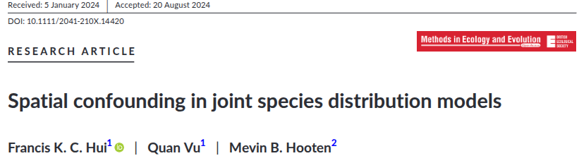
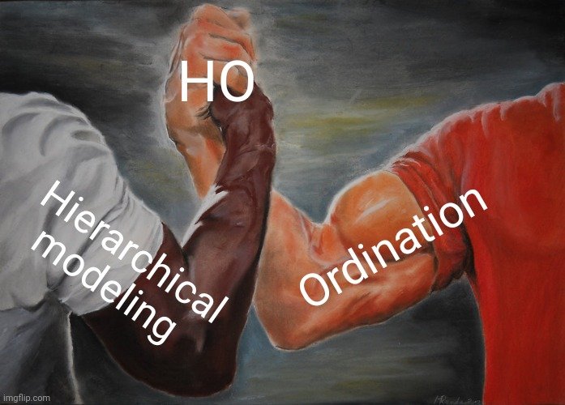
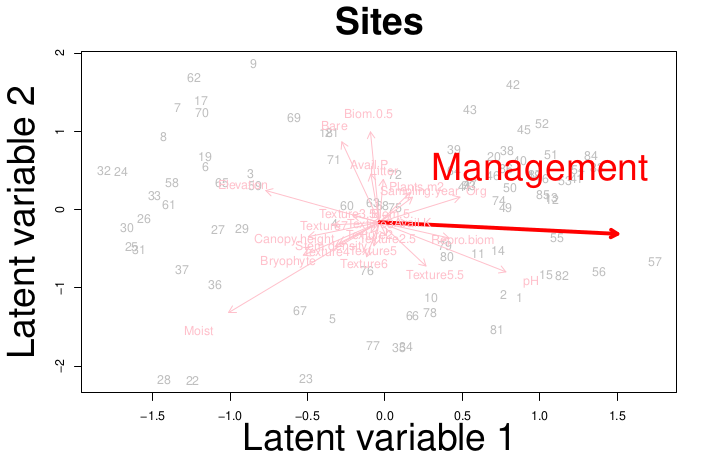
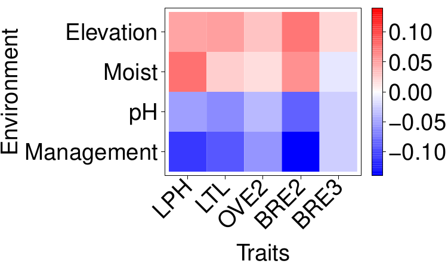
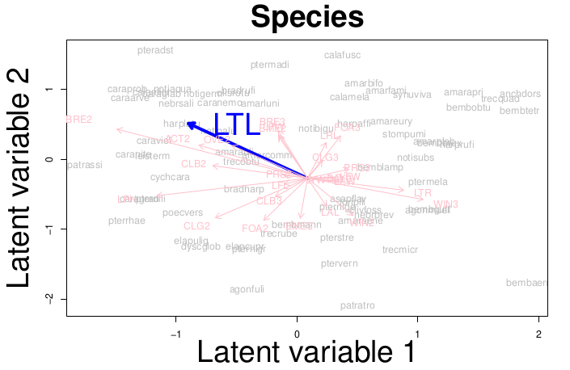

```{r setup, include=FALSE}
library(knitr)

default_source_hook <- knit_hooks$get('source')
default_output_hook <- knit_hooks$get('output')

knit_hooks$set(
  source = function(x, options) {
    paste0(
      "\n::: {.codebox data-latex=\"\"}\n\n",
      default_source_hook(x, options),
      "\n\n:::\n\n")
  }
)

knit_hooks$set(
  output = function(x, options) {
    paste0(
      "\n::: {.codebox data-latex=\"\"}\n\n",
      default_output_hook(x, options),
      "\n\n:::\n\n")
  }
)

knitr::opts_chunk$set(echo = TRUE)
```

# Outline

## Questions so far?

\center

{width=40%}

# Overview

## Some topics covered in this workshop

- Community data, Vector GLM and, GLMMs (day 1)
- Residual diagnostics and model comparison, fourth-corner approach and phylogenetic random effects, JSDM (day 2)
- All forms of ordination (day 3)
- Other R packages and beyond GLLVMs (day 4)


## Topics not covered in this workshop

- Joint models with imperfect detection \tiny ([Tobler et al. 2019](https://doi.org/10.1002/ecy.2754), [Doser et al. 2023](https://doi.org/10.1002/ecy.4137), [Hogg et al. 2021](https://doi.org/10.1111/2041-210X.13614)) \normalsize
- Mixture models for clustering species \tiny ([Hui et al. 2015](https://besjournals.onlinelibrary.wiley.com/doi/10.1111/2041-210X.12236), [Hui 2017](https://doi.org/10.1016/j.csda.2016.07.008)) \normalsize
- Large scale spatio-temporal analysis
- Other methods for analysing community ecological data
- Ordination of excess zeros

# Correlated LVs

At present, it is possible to incorporate spatially or temporally correlated LVs in GLLVMs.

\begin{equation}
\textbf{u}_q \sim \mathcal{N}(\textbf{0}, \symbf{\Sigma})
\end{equation}

As we know: assuming independence messes up our results. Space/time is no different than species' correlation.

\centering




\tikzset{
  mybox/.style={
    draw=red,
    very thick,
    rectangle,
    rounded corners,
    inner sep=10pt,
    fill = white,
    fill opacity = 0.8,
    text width = 0.8\paperwidth
  }
}

\pause

\begin{tikzpicture}[remember picture, overlay]
\node[mybox] at (current page.center){Biased covariate effects and the ordination
};
\end{tikzpicture}

## Spatial latent variable models

The goal: sites in close vicinity are plased close together in the ordination (incorporate extra information)

- Difficult to fit quickly; we have a site by site covariance matrix
- With (for example) 1000 sites, we need to invert a very big matrix
- Tricks need to be applied to avoid that; similar issue to the phylogenetic model
- This is why (e.g.,) INLA \footnotesize (Rue et al., 2009) was developed \normalsize

\texttt{gllvm}, like \texttt{glmmTMB}, does not yet handle this in an efficient fashion


# Example 1

## Example: Wadden data

```{r, echo = FALSE, warning=FALSE, message=FALSE, fig.cap = "Map of the sampled locations"}
Y <- read.csv("../data/waddenY2.csv")[,-c(1:2)]
X <- read.csv("../data/waddenX.csv")
X <- X[,-which(apply(X,2,anyNA))]
site_coords <- sf::st_as_sf(X, coords = c("longitude","latitude"), crs = "EPSG:4326")
library(dplyr)
germany = rnaturalearth::ne_countries(country = 'germany', scale = 'large', returnclass = "sf") %>% sf::st_transform("EPSG:4326")
plot(site_coords$geometry, pch = 16)
plot(germany, add = TRUE)
site_coords_utm <- sf::st_transform(site_coords, "EPSG:32632")
coords <- sf::st_coordinates(site_coords_utm)
```

## Example: fit correlated LVs

\footnotesize

```{r, echo = -c(1,2), message=FALSE, cache = TRUE, warning=FALSE}
library(gllvm)
invisible(capture.output(TMB::openmp(parallel::detectCores()-1,autopar=TRUE, DLL = "gllvm")))
model1 <- gllvm(Y, studyDesign = X[,"island",drop=FALSE],
                num.lv = 2, lvCor = ~corExp(1|island), 
                distLV = aggregate(coords, FUN = mean, by =list(X$island))[,-1], 
                family = "tweedie", Power = NULL, 
                maxit = 10e4, sd.errors = FALSE)
# Compare to IID LVs
model2 <- gllvm(Y, studyDesign = X[,"island",drop=FALSE],
                num.lv = 2, lvCor = ~(1|island), family = "tweedie", 
                sd.errors = FALSE, Power = NULL)
``` 

## Example: ordination plots

```{r spatord, echo = FALSE, dev = "png", fig.show = "hide"}
gllvm::ordiplot(model1, main = "With spatial LVs")
gllvm::ordiplot(model2, main = "Without spatial LVs")
```

\columnsbegin
\column{0.5\textwidth}
\includegraphics{Beyond_files/figure-beamer/spatord-1.png}
\column{0.5\textwidth}
\includegraphics{Beyond_files/figure-beamer/spatord-2.png}
\columnsend

Spatial field parameters: `r 1/model1$params$rho.lv`


## Phylogenetic latent variable models

To bring phylogeny in the ordination (or other species information) the ideas are the same, but requires the loadings to be random effects.

# HO

## Background

\columnsbegin
\column{0.6\textwidth}
\begin{enumerate}
\item CWM + RDA \footnotesize \textit{Doledec et al. (1996)} \normalsize
\item Double constrained ordination \footnotesize \textit{Lebreton et al. (1988), ter Braak et al. (2018)} \normalsize
\item Fourth corner (LV) Models \footnotesize \textit{Brown et al. (2014), Ovaskainen at al. (2017), Niku et al. (2021)} 
\item Model-based double constrained ordination (Yee's \texttt{VGAM}, ter Braak and van Rossum's \texttt{douconca})
\normalsize
\end{enumerate}

\column{0.4\textwidth}

```{r echo=F, fig.align="center", fig.cap="Quadriplot \\newline \\footnotesize \\textit{ter Braak et al. (2018)} \\normalsize", dpi=300, out.width="99%"}
knitr:::include_graphics("quadriplot.jpg")
```

\columnsend

<!-- ## Example: \texttt{douconca} -->

<!-- ```{r, echo = FALSE} -->
<!-- library(douconca) -->
<!-- Y <- read.csv("../data/alpine2Y.csv")[,-1] -->
<!-- X <- read.csv("../data/alpine2X.csv")[,-1] -->
<!-- X <- X[rowSums(Y)>0, ] -->
<!-- Y <- Y[rowSums(Y)>0,] -->
<!-- X <- scale(X[,c(1,2,3,4,6)]) -->
<!-- TR <- read.csv("../data/alpine2TR.csv")[,-1] -->
<!-- TR <- TR[colSums(Y)>0,] -->
<!-- Y <- Y[,colSums(Y)>0] -->
<!-- ``` -->

<!-- ```{r} -->
<!-- dCCA <- douconca::dc_CA(formulaEnv = Y~Aspect+Slope+Form+PhysD+Snow, formulaTraits = ~Height + Spread + Angle + Area + Thick + SLA + N_mass + Seed, -->
<!--                  dataEnv=X,dataTraits=TR) -->

<!-- ## no plotting method? -->
<!-- ``` -->

## Reduced-rank modeling

\begin{equation}
\tikzmarknode{t1}{\highlight{green}{g}}
\biggl\{
\tikzmarknode{t2}{\highlight{blue}{\mathbb{E}(\textbf{Y} \vert \textbf{E})}}
\biggr\} = 
\tikzmarknode{t3}{\highlight{purple}{\textbf{1}\symbf{\beta}^\top}}
+
\alt<1-4>{
\alt<2->{
\tikzmarknode{t4}{\highlight{red}{\textbf{E}, \qquad \symbf{\epsilon}_i \sim \mathcal{N}(\textbf{0},
\tikzmarknode[rectangle,dashed,draw]{t4}{\highlight{yellow}{\symbf{\Gamma}\symbf{\Gamma}^\top}}}}
}{
\tikzmarknode{t4}{\highlight{red}{\textbf{E}, \qquad \symbf{\epsilon}_i \sim \mathcal{N}(\textbf{0},\symbf{\Sigma})}}
}
}{
\tikzmarknode[rectangle,dashed,draw]{t4}{\highlight{yellow}{\textbf{U}\symbf{\Gamma}^\top}}, \qquad \textbf{U} \sim \mathcal{N}(\textbf{0},\textbf{I})
}
\end{equation}
\alt<1>{
\hfill \footnotesize This is a GLMM \normalsize
}{
\hfill \footnotesize This is an unconstrained ordination \normalsize
}
\uncover<3->{
\begin{equation}
\tikzmarknode{t1}{\highlight{green}{g}}
\biggl\{
\tikzmarknode{t2}{\highlight{blue}{\mathbb{E}(\textbf{Y} \vert \textbf{X})}}
\biggr\} = 
\tikzmarknode{t3}{\highlight{purple}{\textbf{1}\symbf{\beta}^\top}}
+
\alt<4-5>{
\alt<5>{
\tikzmarknode[rectangle,draw,dashed]{t4}{\highlight{yellow}{\textbf{U}\symbf{\Gamma}^\top}}
,\qquad \textbf{U} = \textbf{X}\textbf{B}
}{
\tikzmarknode[rectangle,draw,dashed]{t5}{\highlight{yellow}{\textbf{X}\textbf{B}_{lv}\symbf{\Gamma}^\top}}
}
}{
\tikzmarknode[rectangle,draw,dashed]{t5}{\highlight{yellow}{\textbf{X}\textbf{B}}}
}
\end{equation}
\alt<4->{
\hfill \footnotesize This is a constrained ordination \normalsize
}
{
\hfill \footnotesize This is a GLM \normalsize
}
}


## 4th corner reduced-rank

What if we plug the model from yesterday:

\begin{equation}
\eta_{ij} = \beta_{0j} + \textbf{x}_i^\top(\tikzmarknode{t1}{\symbf{\beta}_x} + \tikzmarknode{t2}{\textbf{b}_j}) + \tikzmarknode{t4}{\textbf{tr}_j^\top} \tikzmarknode{t3}{\textbf{B}_{xtr}}\textbf{x}_i
\end{equation}

into the reduced rank model.

## Reduced-rank 4th corner

\begin{equation}
\eta_{ij} = \highlight{purple}{\beta_{0j}} + \highlight{gray}{...} + \highlight{yellow}{\textbf{u}_i^\top\symbf{\gamma}_j}, \qquad \text{where } \symbf{\gamma}_j = \symbf{\varepsilon}_j + \textbf{B}_{x,tr}\textbf{tr}_j
\end{equation}

if you recall from yesterday (where I wrote $\textbf{b}_j$ instead of $\symbf{\varepsilon}_j$), the covariate effects were random. So now, we get random loadings in the ordination.

<!-- Usually we have many traits. And many covariates. \newline -->
<!-- So, how can we reduce this down to fewer dimensions? -->

## Hierarchical ordination \footnotesize [(O'Hara & van der Veen, 2022)](https://ntnuopen.ntnu.no/ntnu-xmlui/handle/11250/2980780)


This is the idea behind "hierarchical ordination".

\begin{equation}
\tikzmarknode{t1}{\highlight{green}{g}}
\biggl\{
\tikzmarknode{t2}{\highlight{blue}{\mathbb{E}(\textbf{Y} \vert \textbf{U}, \symbf{\Gamma})}}
\biggr\} = 
\tikzmarknode{t3}{\highlight{yellow}{\textbf{1}\symbf{\beta}^\top}}
+
\tikzmarknode[rectangle,dashed,draw]{t4}{\highlight{grey}{\textbf{U}\symbf{\Sigma}\symbf{\Gamma}^\top}}
\end{equation}

\tikzmarknode{n3}{Intercept}
\hfill \tikzmarknode{n4}{Ordination}

\begin{tikzpicture}[overlay,remember picture,->]
        \draw (n3) -| (t3);
        \draw (n4) -| (t4);
\end{tikzpicture}

\alt<2>{
This becomes an ordination with a true varimax rotation; the axes are orthogonal and ordered, not sensitive to species ordering.
}{
All effects go into the ordination\newline
\textcolor{green}{\textbf{Pros}}: fewer parameters, easy visualization\newline
\textcolor{red}{\textbf{Cons}}: generally more difficult to fit/estimate
}

## Hierarchical ordination

```{r, out.width="70%", fig.align = "center", echo = FALSE}

```


## The "Hierarchical" in ordination

\begin{center}
Concurrent ordination:
\end{center}

\begin{equation}
\textbf{U} = 
\tikzmarknode[rectangle,dashed,draw]{t1}{\highlight{yellow}{\textbf{X}_{lv}\symbf{\Beta}_{lv}}}
+
\tikzmarknode[rectangle,dashed,draw]{t2}{\highlight{red}{\textbf{E}}}
\end{equation}

\begin{enumerate}
\item Covariate effects \tikz[na,remember picture]\node[coordinate] (n1) {};
\item LV-level errors \tikz[na,remember picture]\node[coordinate] (n2) {};
\end{enumerate}

\begin{tikzpicture}[overlay,remember picture,->]
        \draw[->] (n1) -| (t1);
        \draw[->] (n2) -| (t2);
\end{tikzpicture}

\hfill \footnotesize \textit{van der Veen et al. (2023)} \normalsize

<!-- \only<2>{ -->
<!-- \begin{center} -->
<!-- \tcbox[enhanced,boxrule=0pt,colback=red!50,interior style={opacity=1},frame style={opacity=1},nobeforeafter,tcbox raise base,shrink tight,extrude by=5mm]{Next: hierarchically modeling the loadings} -->
<!-- \end{center} -->
<!-- } -->

## Hierarchical ordination: the framework

\Large
\begin{center}
\noindent\resizebox{\textwidth}{!}{
\begin{tikzpicture}[>=latex,spy using outlines={rectangle, magnification=2,blue},
outbox/.style = {rectangle, draw=red, densely dashed, rounded corners,
                 inner xsep=3mm, inner ysep=3mm}
                    ]
% nodes
% main model components
\node (y)[draw, ellipse, align=center, fill = red!40!yellow!30,thick] {Community data \\ $y_{ij}$};
\node (lp)[above=of y,draw, ellipse, align=center, fill = blue!80!darkgray!40,thick] {Linear predictor \\$\eta_{ij}$};
\node (beta)[left=of lp,draw, ellipse, align=center, fill = olive!50!green!40!,thick] {Intercept \\ $\beta_{0j}$};
\node (other)[right=of lp,draw, ellipse, align=center,thick,fill = red!20] {Other effects};

\node (ord)[above=of lp,draw, ellipse, align=center,fill = blue!80!darkgray!40,thick] {Ordination \\ $\textbf{u}_i^\top\symbf{\Sigma}\symbf{\gamma}_j$};

% ordination components
\node (Z)[above left=of ord,draw, ellipse, align=center, xshift = -30mm, fill = blue!80!darkgray!40,thick] {Latent variables \\$\textbf{u}_i$};
\node (G)[above right=of ord,draw, ellipse, align=center, xshift = 30mm, fill = blue!80!darkgray!40,thick] {Loadings \\$\symbf{\gamma}_j$};
\node (lvSD)[above=of ord,draw, ellipse, align=center, fill = olive!50!green!40!,thick] {LV variation \\$\symbf{\Sigma}$};
\only<5>{\node (lvSD)[above=of ord,draw, ellipse, align=center, fill = olive!50!green!40!,thick, draw = red, ultra thick] {LV variation \\$\symbf{\Sigma}$};}


% Z components
\node (lv1)[above left=of Z, xshift  = -10mm,draw, ellipse, align=center, fill = blue!80!darkgray!40,thick] {$z_{i1}$};
\node (lv2)[above right=of Z, xshift  = 10mm,draw, ellipse, align=center, fill = blue!80!darkgray!40,thick] {$z_{i2}$};

\node (xb1)[above right=of lv1,draw, ellipse, align=center, fill = blue!80!darkgray!40,thick] {$\textbf{x}_i^\top\textbf{b}_1$};
\node (xb2)[above left=of lv2,draw, ellipse, align=center, fill = blue!80!darkgray!40,thick] {$\textbf{x}_i^\top\textbf{b}_2$};
\node (lab1)[below=of xb1,thick] at ($(xb1)!0.5!(xb2)$) {Environment effect};

\node (x)[above= of xb1,draw, ellipse, align=center, fill = red!40!yellow!30,thick] at ($(xb1)!0.5!(xb2)$) {Environmental variables \\ $\textbf{x}_i$};

\node (b1)[above left=of xb1,draw, ellipse, align=center, fill = olive!50!green!40!,thick] {$\textbf{b}_1$};
\node (b2)[above right=of xb2,draw, ellipse, align=center, fill = olive!50!green!40!,thick] {$\textbf{b}_2$};

\node (eps1)[above left=of lv1,draw, ellipse, align=center, fill = gray!20,thick] {Residual (LV) effect \\ $\epsilon_{i1}$};
\node (eps2)[above right=of lv2,draw, ellipse, align=center, fill = gray!20,thick] {$\epsilon_{i2}$};
\node (S)[below=of eps1,draw, ellipse, align=center, fill = red!20,thick] {Spatiotemporal effect};

\node (sig1)[above=of eps1,draw, ellipse, align=center, yshift = 5mm,thick] {Unexplained (LV) variation\\$\sigma^2_1$};
\node (sig2)[above=of eps2,draw, ellipse, align=center,thick] {$\sigma^2_2$};

% Gamma components
\node (g1)[above left=of G, xshift  = -10mm,draw, ellipse, align=center, fill = blue!80!darkgray!40,thick] {$\gamma_{j1}$};
\node (g2)[above right=of G, xshift  = 10mm,draw, ellipse, align=center, fill = blue!80!darkgray!40,thick] {$\gamma_{j2}$};

\node (ro1)[above right=of g1,draw, ellipse, align=center, fill = blue!80!darkgray!40,thick] {$\textbf{tr}_j^\top\symbf{\omega}_1$};
\node (ro2)[above left=of g2,draw, ellipse, align=center, fill = blue!80!darkgray!40,thick] {$\textbf{tr}_j^\top\symbf{\omega}_2$};
\node (lab2)[below=of ro1,thick] at ($(ro1)!0.5!(ro2)$) {Trait effect};

\node (r)[above= of ro1,draw, ellipse, align=center, fill = red!40!yellow!30,thick] at ($(ro1)!0.5!(ro2)$) {Trait variables \\ $\textbf{tr}_j$};

\node (o1)[above left=of ro1,draw, ellipse, align=center, fill = olive!50!green!40!,thick] {$\symbf{\omega}_1$};
\node (o2)[above right=of ro2,draw, ellipse, align=center, fill = olive!50!green!40!,thick] {$\symbf{\omega}_2$};

\node (vareps1)[above left=of g1,draw, ellipse, align=center, fill = gray!20,thick] {$\varepsilon_{j1}$};
\node (vareps2)[above right=of g2,draw, ellipse, align=center, fill = gray!20,thick] {Residual (loadings) effect \\ $\varepsilon_{j2}$};
\node (P)[below=of vareps2,draw, ellipse, align=center, fill = red!20,thick] {Phylogenetic effect};

\node (del1)[above=of vareps1,draw, ellipse, align=center,thick] {$\delta^2_1$};
\node (del2)[above=of vareps2,draw, ellipse, align=center,yshift=5mm,thick] {Unexplained (loadings) variation\\$\delta^2_2$};

% arrows
\draw[->,thick] (lp) to node[xshift=5mm] {$g(\cdot)$} (y);
\draw[->,thick] (ord) -- (lp);
\draw[->,thick] (beta) -- (lp);
\draw[->,thick,dashed] (other) -- (lp);
\draw[->,thick] (lvSD) -- (ord);
\only<5>{
\draw[->, ultra thick, red] (lvSD) -- (ord);
}
\only<6>{
\draw[->, ultra thick, red] (ord) -- (lp);
\draw[->, ultra thick, red] (beta) -- (lp);
\draw[->, ultra thick, red] (other) -- (lp);
}
% lv arrows

\draw[->,thick] (Z) -- (ord);
\draw[->,thick] (lv1) -- (Z);
\draw[->,thick] (lv2) -- (Z);
\draw[->,thick] (xb1) -- (lv1);
\draw[->,thick] (xb2) -- (lv2);
\draw[->,thick] (eps1) -- (lv1);
\draw[->,thick] (eps2) -- (lv2);
\draw[->,thick] (sig1) -- (eps1);
\draw[->,thick, dashed] (S) -- (eps1);
\draw[->,thick] (sig2) -- (eps2);
\draw[->,thick] (x) -- (xb1);
\draw[->,thick] (x) -- (xb2);
\draw[->,thick] (b1) -- (xb1);
\draw[->,thick] (b2) -- (xb2);

\only<2-3>{
\draw[->, ultra thick, red] (Z) -- (ord);
\draw[->, ultra thick, red] (lv1) -- (Z);
\draw[->, ultra thick, red] (lv2) -- (Z);
\draw[->, ultra thick, red] (xb1) -- (lv1);
\draw[->, ultra thick, red] (xb2) -- (lv2);
\draw[->, ultra thick, red] (eps1) -- (lv1);
\draw[->, ultra thick, red] (eps2) -- (lv2);
\draw[->, ultra thick, red] (sig1) -- (eps1);
\draw[->, ultra thick, red] (sig2) -- (eps2);
\draw[->, ultra thick, red] (x) -- (xb1);
\draw[->, ultra thick, red] (x) -- (xb2);
\draw[->, ultra thick, red] (b1) -- (xb1);
\draw[->, ultra thick, red] (b2) -- (xb2);
}

% loadings arrows
\draw[->,thick] (G) -- (ord);
\draw[->,thick] (g1) -- (G);
\draw[->,thick] (g2) -- (G);
\draw[->,thick] (ro1) -- (g1);
\draw[->,thick] (ro2) -- (g2);
\draw[->,thick] (vareps1) -- (g1);
\draw[->,thick, dashed] (P) -- (vareps2);
\draw[->,thick] (vareps2) -- (g2);
\draw[->,thick] (del1) -- (vareps1);
\draw[->,thick] (del2) -- (vareps2);
\draw[->,thick] (r) -- (ro1);
\draw[->,thick] (r) -- (ro2);
\draw[->,thick] (o1) -- (ro1);
\draw[->,thick] (o2) -- (ro2);

\only<4>{
\draw[->, ultra thick, red] (G) -- (ord);
\draw[->, ultra thick, red] (g1) -- (G);
\draw[->, ultra thick, red] (g2) -- (G);
\draw[->, ultra thick, red] (ro1) -- (g1);
\draw[->, ultra thick, red] (ro2) -- (g2);
\draw[->, ultra thick, red] (vareps1) -- (g1);
\draw[->, ultra thick, red] (vareps2) -- (g2);
\draw[->, ultra thick, red] (del1) -- (vareps1);
\draw[->, ultra thick, red] (del2) -- (vareps2);
\draw[->, ultra thick, red] (r) -- (ro1);
\draw[->, ultra thick, red] (r) -- (ro2);
\draw[->, ultra thick, red] (o1) -- (ro1);
\draw[->, ultra thick, red] (o2) -- (ro2);
}

% boxes around nodes and spy
\only<2>{
\node (outinner1) [fit = (xb1) (xb2) (lab1) (x) (b1) (b2)] {};
\spy[width=20cm,height=13cm,every spy on node/.append style={line width=5pt}] on (outinner1) in node [fill=white,line width=5pt, blur shadow={shadow blur steps=10,shadow yshift=0.5cm, shadow xshift=-0.5cm}] at (lp.east)[yshift=3cm,xshift=3cm];
}
\only<3>{
\node (outer1) [fit = (lv1) (lv2) (xb1) (xb2) (lab1) (x) (b1) (b2) (eps1) (eps2) (S) (sig1) (sig2), label ={[font=\huge,text=red, xshift=4cm,yshift=-1.5cm,align=center]:Concurrent ordination \\ \textit{van der Veen et al. (2023)}}] {};
\spy[width=38cm,height=18cm,every spy on node/.append style={line width=5pt}] on (outer1) in node [fill=white,line width=5pt, blur shadow={shadow blur steps=10,shadow yshift=0.5cm, shadow xshift=-0.5cm}] at (other.east);
}
\only<4>{
\node (outer2) [fit = (g1) (g2) (ro1) (ro2) (lab2) (r) (o1) (o2) (vareps1) (vareps2) (P) (del1) (del2), label ={[font=\huge,text=red, xshift=-5cm,yshift=-1.5cm,align=center]:Hierarchical species loadings}] {};
\spy[width=38cm,height=17cm,every spy on node/.append style={line width=5pt}] on (outer2) in node [fill=white,line width=5pt, blur shadow={shadow blur steps=10,shadow yshift=0.5cm, shadow xshift=-0.5cm}] at (other.east);
}
\only<5>{
\node (lvSD) [fit = (lvSD) (ord)] {};
\spy[width=10cm,height=11cm,every spy on node/.append style={line width=5pt}] on (lvSD) in node [fill=white,line width=5pt, blur shadow={shadow blur steps=10,shadow yshift=0.5cm, shadow xshift=-0.5cm}, xshift=-1cm] at (other.east);
}
\only<6>{
\node (outer3) [fit = (ord) (beta) (other)] {};
\spy[width=37cm,height=18cm,every spy on node/.append style={line width=5pt}] on (lp.east) in node [fill=white, line width=5pt, blur shadow={shadow blur steps=10,shadow yshift=0.5cm, shadow xshift=-0.5cm}] at (other.east);
}
\end{tikzpicture}
}
\end{center}
\normalsize

## HO $\to$ 4th corner

\begin{equation}
\begin{aligned}
& \tikzmarknode{t1}{\highlight{yellow}{\textbf{U}}}
\tikzmarknode{t2}{\highlight{grey}{\symbf{\Sigma}}}
\tikzmarknode{t3}{\highlight{blue}{\symbf{\Gamma}^\top}}
             = \\
              &\tikz[baseline,remember picture]{
             \alt<2>{
               \node[anchor=base,rectangle, draw=red, dashed] (t456) {$
            \underbrace{
           \tikzmarknode{t4}{\highlight{yellow}{\textbf{X}\symbf{\Beta}}}
            \tikzmarknode{t5}{\highlight{grey}{\symbf{\Sigma}}}
            \tikzmarknode{t6}{\highlight{blue}{\symbf{\mathcal{E}}^\top}}
            }_\text{Main effects}
              $}
}{
 \node[anchor=base] (t456) {$
            \underbrace{
           \tikzmarknode{t4}{\highlight{yellow}{\textbf{X}\symbf{\Beta}}}
            \tikzmarknode{t5}{\highlight{grey}{\symbf{\Sigma}}}
            \tikzmarknode{t6}{\highlight{blue}{\symbf{\mathcal{E}}^\top}}
            }_\text{Main effects}
              $}
}
              }
            +
            \overbrace{
          \tikzmarknode{t7}{\highlight{yellow}{\textbf{X}\symbf{\Beta}}}
          \tikzmarknode{t8}{\highlight{grey}{\symbf{\Sigma}}}
          \tikzmarknode{t9}{\highlight{blue}{\symbf{\Omega}^\top\textbf{TR}^\top}}
            }^\text{4th corner terms}
            +
            \tikz[baseline,remember picture]{
            \alt<2>{
             \node[anchor=base,rectangle, draw=red, dashed] (t101112) {$
            \underbrace{
          \tikzmarknode{t10}{\highlight{yellow}{\textbf{E}}}
          \tikzmarknode{t11}{\highlight{grey}{\symbf{\Sigma}}}
          \tikzmarknode{t12}{\highlight{blue}{(\textbf{TR}\symbf{\Omega} + \symbf{\mathcal{E}})^\top}}
            }_\text{Other stuff}
            $}
}{
              \node[anchor=base] (t101112) {$
            \underbrace{
          \tikzmarknode{t10}{\highlight{yellow}{\textbf{E}}}
          \tikzmarknode{t11}{\highlight{grey}{\symbf{\Sigma}}}
          \tikzmarknode{t12}{\highlight{blue}{(\textbf{TR}\symbf{\Omega} + \symbf{\mathcal{E}})^\top}}
            }_\text{Other stuff}
            $}
            }
            }
\end{aligned}
\end{equation}

\begin{enumerate}
    \item Induces site correlations
        \tikz[na,remember picture]\node[coordinate] (n1) {};
    \item Induces species correlations
        \tikz[na,remember picture]\node[coordinate] (n2) {};
\end{enumerate}

\begin{tikzpicture}[overlay,remember picture]
        \draw[->] (n1) -| ([xshift=0.1cm]n1) |- ([yshift=-1cm]t8.south) -| (t456);
        \draw[->] (n2) -| (t101112);
\end{tikzpicture}

## HO $\to$ 4th corner

Then we also have:

\begin{equation}
\symbf{\beta} =  \tikzmarknode{t4}{\highlight{yellow}{\symbf{\Beta}}}
            \tikzmarknode{t5}{\highlight{grey}{\symbf{\Sigma}}}
            \tikzmarknode{t6}{\highlight{blue}{\symbf{\mathcal{E}}^\top}}
            +
             \tikzmarknode{t7}{\highlight{yellow}{\symbf{\Beta}}}
          \tikzmarknode{t8}{\highlight{grey}{\symbf{\Sigma}}}
          \tikzmarknode{t9}{\highlight{blue}{\symbf{\Omega}^\top\textbf{TR}^\top}}
\end{equation}

I.e., a hierarchical linear regression again of species responses to the environment.

# Example 2

## Example: carabid beetles

\columnsbegin
\column{0.6\textwidth}
\begin{itemize}
\item Data from \footnotesize \textit{Ribera et al. (2001)} \normalsize
\begin{itemize}
\item Counts
\item 87 sites
\item 68 species
\end{itemize}
\begin{itemize}
  \item Beetles caught with pitfall traps
  \item 26 environmental variables and 27 traits
  \item in Scotland
    \begin{itemize}
    \item Management, elevation, soil moisture, pH
    \end{itemize}
\end{itemize}
\end{itemize}
\column{0.4\textwidth}

```{r, out.width="99%", fig.align = "right", echo  =FALSE}

```

\columnsend

\only<2>{
\begin{center}
\tcbox[enhanced,boxrule=0pt,colback=red!50,interior style={opacity=1},frame style={opacity=1},nobeforeafter,tcbox raise base,shrink tight,extrude by=5mm]{4887 $\to$ 484 parameters (for two dimensions)}
\end{center}
}

## Case study: results$^*$

\columnsbegin
\column{0.5\textwidth}
\begin{itemize}
\item Reduced-rank approximated terms (e.g., 4th corner)
\item Ordination plots
\item Residual correlation plots
\end{itemize}

\column{.5\textwidth}



\columnsend
\vspace*{-\baselineskip}
\columnsbegin
\column{0.5\textwidth}



\textit{* fitted with Nimble} \tiny ([de Valpine et al., 2017](https://doi.org/10.1080/10618600.2016.1172487)) \normalsize

\column{.5\textwidth}



\columnsend
    
# Next generation ordination

I think its been demonstrate, model-based multivariate analysis has many advantages

- Explicit and flexible model
- Testable assumptions
- Random effects to induce correlation
- Makes good ordinations

## Sampling processes

In \texttt{gllvm} we think a lot about modeling ecological processes. However,

- Data are often not randomly sampled
- Might contain bias
- Presence-only from citizen scientists
- Mixed response types

\centering

Acommodating the sampling processes warrants further research.

## Potential next steps

The big benefit of this model-based multivariate framework: we can adjust to model to accommodate our wishes. \footnotesize as far as technically possible \normalsize

\pause

More response types for unimodal response model? \newline

Phylogenetic ordination \newline

Ordination of the zero-inflated component \newline

Spatio-temporal modeling is still a challenge. 

## Spatio-temporal modeling

- In space and/or time dimensions are usually large
- This slows down models considerably
- Requires additional approximations (e.g, as in INLA, CBFM, or NNGPs as in HMSC)

## Wishlist \texttt{gllvm}

We continue to work on things such as:

- Improvements in usability
- Improvements of robustness (optimisation)
- Fast spatial random effects
- Incorporate space, traits and Phylogeny into ordinations

\pause

Do you have any wishes?

## The end

\textcolor{red}{\textbf{One thing is clear: some very good multivariate methods have been developed in the last decade.}}
