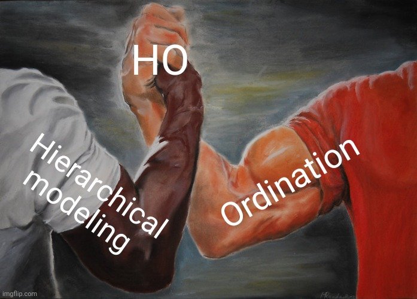
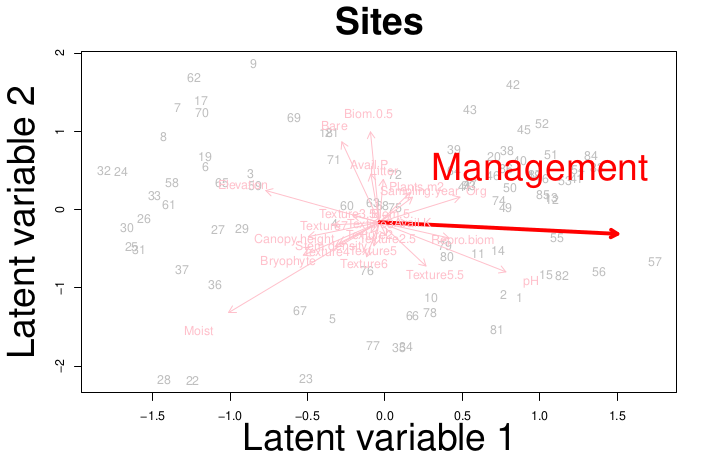
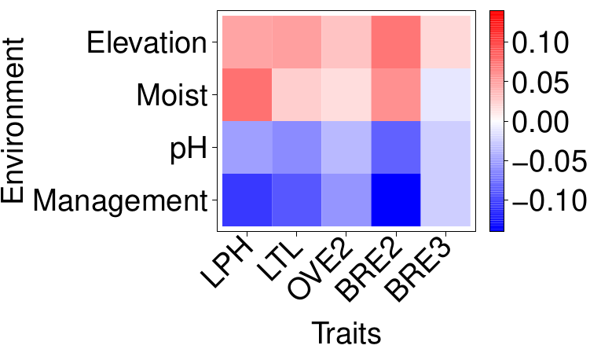
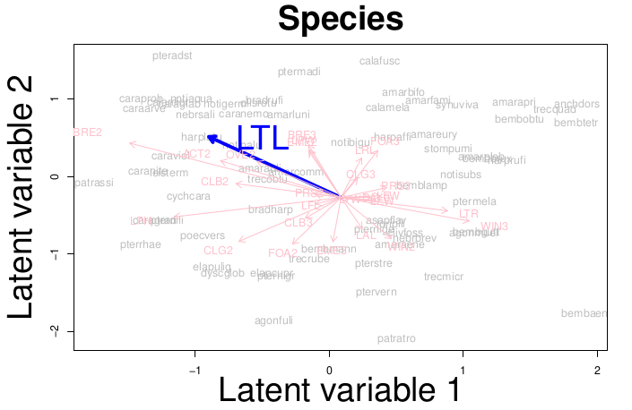

```{r setup, include=FALSE}
library(knitr)

default_source_hook <- knit_hooks$get('source')
default_output_hook <- knit_hooks$get('output')

knit_hooks$set(
  source = function(x, options) {
    paste0(
      "\n::: {.codebox data-latex=\"\"}\n\n",
      default_source_hook(x, options),
      "\n\n:::\n\n")
  }
)

knit_hooks$set(
  output = function(x, options) {
    paste0(
      "\n::: {.codebox data-latex=\"\"}\n\n",
      default_output_hook(x, options),
      "\n\n:::\n\n")
  }
)

knitr::opts_chunk$set(echo = TRUE)
```

# Outline

## Questions so far?

\center

{width=40%}

## Some topics covered in this workshop

- Vector GLMs, GLMMs and recap (day 1)
- Model-based unconstrained ordination: UO, UQO (day 2)
- Ordination with covariates  (day 3)
- JSDMs: 4th corner model, Phylogenetic random effects (day 3)

## Topics not covered in this workshop

- Joint models with imperfect detection \tiny ([Tobler et al. 2019](https://doi.org/10.1002/ecy.2754), [Doser et al. 2023](https://doi.org/10.1002/ecy.4137), [Hogg et al. 2021](https://doi.org/10.1111/2041-210X.13614)) \normalsize
- Mixture models for clustering species ([Hui et al. 2015](https://besjournals.onlinelibrary.wiley.com/doi/10.1111/2041-210X.12236), [Hui 2017](https://doi.org/10.1016/j.csda.2016.07.008))
- Spatio-temporal analysis
- Other methods for analysing community ecological data
- Much, much more.

## Next steps

More response types for unimodal response model? \newline

Spatio-temporal modeling is still a challenge. 

- In space and/or time dimensions are usually large
- This slows down models considerably
- Requires additional approximations (e.g, as in INLA, CBFM, or NNGPs as in HMSC)

## Next steps

In \texttt{gllvm} we mostly think about modeling ecological processes. However,

- Data are often not randomly sampled
- Might contain bias
- Presence-only from citizen scientists
- Mixed response types

\centering

This warrants further developments.

## Next steps for me

I have an article on Phylogenetic random effects in the works. However, it is the precursor for a few other developments:

- Improvements in usability (get methods to a larger audience)
- Incorporate traits and Phylogeny into ordinations
- Improvements of robustness (optimisation)

# HO

## Trait-based analysis

\columnsbegin
\column{0.6\textwidth}
\begin{enumerate}
\item CWM + RDA \footnotesize \textit{Doledec et al. (1996)} \normalsize
\item Double constrained ordination \footnotesize \textit{Lebreton et al. (1988), ter Braak et al. (2018)} \normalsize
\item Fourth corner (LV) Models \footnotesize \textit{Brown et al. (2014), Ovaskainen at al. (2017), Niku et al. (2021)} 
\item Model-based double constrained ordination (VGAM)
\normalsize
\end{enumerate}

\column{0.4\textwidth}

```{r echo=F, fig.align="center", fig.cap="Quadriplot \\newline \\footnotesize \\textit{ter Braak et al. (2018)} \\normalsize", dpi=300, out.width="99%"}
knitr:::include_graphics("quadriplot.jpg")
```

\columnsend

## Reduced-rank modeling

\begin{equation}
\tikzmarknode{t1}{\highlight{green}{g}}
\biggl\{
\tikzmarknode{t2}{\highlight{blue}{\mathbb{E}(\textbf{Y} \vert \textbf{E})}}
\biggr\} = 
\tikzmarknode{t3}{\highlight{yellow}{\textbf{1}\symbf{\beta}^\top}}
+
\alt<1-4>{
\alt<2->{
\tikzmarknode{t4}{\highlight{red}{\textbf{E}, \qquad \symbf{\epsilon}_i \sim \mathcal{N}(\textbf{0},
\tikzmarknode[rectangle,dashed,draw]{t4}{\highlight{grey}{\symbf{\Gamma}\symbf{\Gamma}^\top}}}}
}{
\tikzmarknode{t4}{\highlight{red}{\textbf{E}, \qquad \symbf{\epsilon}_i \sim \mathcal{N}(\textbf{0},\symbf{\Sigma})}}
}
}{
\tikzmarknode[rectangle,dashed,draw]{t4}{\highlight{grey}{\textbf{Z}\symbf{\Gamma}^\top}}, \qquad \textbf{z}_i \sim \mathcal{N}(\textbf{0},\textbf{I})
}
\end{equation}
\alt<1>{
\hfill \footnotesize This is a GLMM \normalsize
}{
\hfill \footnotesize This is an unconstrained ordination \normalsize
}
\uncover<3->{
\begin{equation}
\tikzmarknode{t1}{\highlight{green}{g}}
\biggl\{
\tikzmarknode{t2}{\highlight{blue}{\mathbb{E}(\textbf{Y} \vert \textbf{X})}}
\biggr\} = 
\tikzmarknode{t3}{\highlight{yellow}{\textbf{1}\symbf{\beta}^\top}}
+
\alt<4-5>{
\alt<5>{
\tikzmarknode[rectangle,draw,dashed]{t4}{\highlight{grey}{\textbf{Z}\symbf{\Gamma}^\top}}
}{
\tikzmarknode[rectangle,draw,dashed]{t5}{\highlight{grey}{\textbf{X}\textbf{B}_{lv}\symbf{\Gamma}^\top}}
}
}{
\tikzmarknode[rectangle,draw,dashed]{t5}{\highlight{grey}{\textbf{X}\textbf{B}}}
}
\end{equation}
\alt<4->{
\hfill \footnotesize This is a constrained ordination \normalsize
}
{
\hfill \footnotesize This is a GLM \normalsize
}
}


## 4th corner LVM

From yesterday:

\begin{equation}
\eta_{ij} = \beta_{0j} + \textbf{x}_i^\top(\tikzmarknode{t1}{\symbf{\beta}_x} + \tikzmarknode{t2}{\textbf{b}_j}) + \tikzmarknode{t4}{\textbf{tr}_j^\top} \tikzmarknode{t3}{\textbf{B}_{xtr}}\textbf{x}_i
\end{equation}

Usually we have many traits. And many covariates. \newline
So, how can we reduce this down to fewer dimensions?

## Hierarchical ordination
<!--transpose on beta since column vector is default and beta is a row vector-->

\begin{equation}
\tikzmarknode{t1}{\highlight{green}{g}}
\biggl\{
\tikzmarknode{t2}{\highlight{blue}{\mathbb{E}(\textbf{Y} \vert \textbf{Z}, \symbf{\Gamma})}}
\biggr\} = 
\tikzmarknode{t3}{\highlight{yellow}{\textbf{1}\symbf{\beta}^\top}}
+
\tikzmarknode[rectangle,dashed,draw]{t4}{\highlight{grey}{\textbf{Z}\symbf{\Sigma}\symbf{\Gamma}^\top}}
\end{equation}

\tikzmarknode{n3}{Intercept}
\hfill \tikzmarknode{n4}{Ordination}

\begin{tikzpicture}[overlay,remember picture,->]
        \draw (n3) -| (t3);
        \draw (n4) -| (t4);
\end{tikzpicture}

All effects go into the ordination\newline
\textcolor{green}{\textbf{Pros}}: fewer parameters, easy visualization\newline
\textcolor{red}{\textbf{Cons}}: generally more difficult to fit/estimate


## Hierarchical ordination

```{r, out.width="70%", fig.align = "center", echo = FALSE}

```


## The "Hierarchical" in ordination

\begin{center}
Hierarchically modeling the latent variables:
\end{center}

\begin{equation}
\textbf{Z} = 
\tikzmarknode[rectangle,dashed,draw]{t1}{\highlight{yellow}{\textbf{X}_{lv}\symbf{\Beta}_{lv}}}
+
\tikzmarknode[rectangle,dashed,draw]{t2}{\highlight{red}{\textbf{E}}}
\end{equation}

\begin{enumerate}
\item Fixed effects \tikz[na,remember picture]\node[coordinate] (n1) {};
\item LV-level errors \tikz[na,remember picture]\node[coordinate] (n2) {};
\item (Additional random effects)
\end{enumerate}

\begin{tikzpicture}[overlay,remember picture,->]
        \draw[->] (n1) -| (t1);
        \draw[->] (n2) -| (t2);
\end{tikzpicture}

\hfill \footnotesize \textit{van der Veen et al. (2023)} \normalsize

\only<2>{
\begin{center}
\tcbox[enhanced,boxrule=0pt,colback=red!50,interior style={opacity=1},frame style={opacity=1},nobeforeafter,tcbox raise base,shrink tight,extrude by=5mm]{Next: hierarchically modeling the loadings}
\end{center}
}

## Hierarchical ordination

\Large
\begin{center}
\noindent\resizebox{\textwidth}{!}{
\begin{tikzpicture}[>=latex,spy using outlines={rectangle, magnification=2,blue},
outbox/.style = {rectangle, draw=red, densely dashed, rounded corners,
                 inner xsep=3mm, inner ysep=3mm}
                    ]
% nodes
% main model components
\node (y)[draw, ellipse, align=center, fill = red!40!yellow!30,thick] {Community data \\ $y_{ij}$};
\node (lp)[above=of y,draw, ellipse, align=center, fill = blue!80!darkgray!40,thick] {Linear predictor \\$\eta_{ij}$};
\node (beta)[left=of lp,draw, ellipse, align=center, fill = olive!50!green!40!,thick] {Intercept \\ $\beta_{0j}$};
\node (other)[right=of lp,draw, ellipse, align=center,thick,fill = red!20] {Other effects};

\node (ord)[above=of lp,draw, ellipse, align=center,fill = blue!80!darkgray!40,thick] {Ordination \\ $\textbf{z}_i^\top\symbf{\Sigma}\symbf{\gamma}_j$};

% ordination components
\node (Z)[above left=of ord,draw, ellipse, align=center, xshift = -30mm, fill = blue!80!darkgray!40,thick] {Latent variables \\$\textbf{z}_i$};
\node (G)[above right=of ord,draw, ellipse, align=center, xshift = 30mm, fill = blue!80!darkgray!40,thick] {Loadings \\$\symbf{\gamma}_j$};
\node (lvSD)[above=of ord,draw, ellipse, align=center, fill = olive!50!green!40!,thick] {LV variation \\$\symbf{\Sigma}$};
\only<5>{\node (lvSD)[above=of ord,draw, ellipse, align=center, fill = olive!50!green!40!,thick, draw = red, ultra thick] {LV variation \\$\symbf{\Sigma}$};}


% Z components
\node (lv1)[above left=of Z, xshift  = -10mm,draw, ellipse, align=center, fill = blue!80!darkgray!40,thick] {$z_{i1}$};
\node (lv2)[above right=of Z, xshift  = 10mm,draw, ellipse, align=center, fill = blue!80!darkgray!40,thick] {$z_{i2}$};

\node (xb1)[above right=of lv1,draw, ellipse, align=center, fill = blue!80!darkgray!40,thick] {$\textbf{x}_i^\top\textbf{b}_1$};
\node (xb2)[above left=of lv2,draw, ellipse, align=center, fill = blue!80!darkgray!40,thick] {$\textbf{x}_i^\top\textbf{b}_2$};
\node (lab1)[below=of xb1,thick] at ($(xb1)!0.5!(xb2)$) {Environment effect};

\node (x)[above= of xb1,draw, ellipse, align=center, fill = red!40!yellow!30,thick] at ($(xb1)!0.5!(xb2)$) {Environmental variables \\ $\textbf{x}_i$};

\node (b1)[above left=of xb1,draw, ellipse, align=center, fill = olive!50!green!40!,thick] {$\textbf{b}_1$};
\node (b2)[above right=of xb2,draw, ellipse, align=center, fill = olive!50!green!40!,thick] {$\textbf{b}_2$};

\node (eps1)[above left=of lv1,draw, ellipse, align=center, fill = gray!20,thick] {Residual (LV) effect \\ $\epsilon_{i1}$};
\node (eps2)[above right=of lv2,draw, ellipse, align=center, fill = gray!20,thick] {$\epsilon_{i2}$};
\node (S)[below=of eps1,draw, ellipse, align=center, fill = red!20,thick] {Spatiotemporal effect};

\node (sig1)[above=of eps1,draw, ellipse, align=center, yshift = 5mm,thick] {Unexplained (LV) variation\\$\sigma^2_1$};
\node (sig2)[above=of eps2,draw, ellipse, align=center,thick] {$\sigma^2_2$};

% Gamma components
\node (g1)[above left=of G, xshift  = -10mm,draw, ellipse, align=center, fill = blue!80!darkgray!40,thick] {$\gamma_{j1}$};
\node (g2)[above right=of G, xshift  = 10mm,draw, ellipse, align=center, fill = blue!80!darkgray!40,thick] {$\gamma_{j2}$};

\node (ro1)[above right=of g1,draw, ellipse, align=center, fill = blue!80!darkgray!40,thick] {$\textbf{tr}_j^\top\symbf{\omega}_1$};
\node (ro2)[above left=of g2,draw, ellipse, align=center, fill = blue!80!darkgray!40,thick] {$\textbf{tr}_j^\top\symbf{\omega}_2$};
\node (lab2)[below=of ro1,thick] at ($(ro1)!0.5!(ro2)$) {Trait effect};

\node (r)[above= of ro1,draw, ellipse, align=center, fill = red!40!yellow!30,thick] at ($(ro1)!0.5!(ro2)$) {Trait variables \\ $\textbf{tr}_j$};

\node (o1)[above left=of ro1,draw, ellipse, align=center, fill = olive!50!green!40!,thick] {$\symbf{\omega}_1$};
\node (o2)[above right=of ro2,draw, ellipse, align=center, fill = olive!50!green!40!,thick] {$\symbf{\omega}_2$};

\node (vareps1)[above left=of g1,draw, ellipse, align=center, fill = gray!20,thick] {$\varepsilon_{j1}$};
\node (vareps2)[above right=of g2,draw, ellipse, align=center, fill = gray!20,thick] {Residual (loadings) effect \\ $\varepsilon_{j2}$};
\node (P)[below=of vareps2,draw, ellipse, align=center, fill = red!20,thick] {Phylogenetic effect};

\node (del1)[above=of vareps1,draw, ellipse, align=center,thick] {$\delta^2_1$};
\node (del2)[above=of vareps2,draw, ellipse, align=center,yshift=5mm,thick] {Unexplained (loadings) variation\\$\delta^2_2$};

% arrows
\draw[->,thick] (lp) to node[xshift=5mm] {$g(\cdot)$} (y);
\draw[->,thick] (ord) -- (lp);
\draw[->,thick] (beta) -- (lp);
\draw[->,thick,dashed] (other) -- (lp);
\draw[->,thick] (lvSD) -- (ord);
\only<5>{
\draw[->, ultra thick, red] (lvSD) -- (ord);
}
\only<6>{
\draw[->, ultra thick, red] (ord) -- (lp);
\draw[->, ultra thick, red] (beta) -- (lp);
\draw[->, ultra thick, red] (other) -- (lp);
}
% lv arrows

\draw[->,thick] (Z) -- (ord);
\draw[->,thick] (lv1) -- (Z);
\draw[->,thick] (lv2) -- (Z);
\draw[->,thick] (xb1) -- (lv1);
\draw[->,thick] (xb2) -- (lv2);
\draw[->,thick] (eps1) -- (lv1);
\draw[->,thick] (eps2) -- (lv2);
\draw[->,thick] (sig1) -- (eps1);
\draw[->,thick, dashed] (S) -- (eps1);
\draw[->,thick] (sig2) -- (eps2);
\draw[->,thick] (x) -- (xb1);
\draw[->,thick] (x) -- (xb2);
\draw[->,thick] (b1) -- (xb1);
\draw[->,thick] (b2) -- (xb2);

\only<2-3>{
\draw[->, ultra thick, red] (Z) -- (ord);
\draw[->, ultra thick, red] (lv1) -- (Z);
\draw[->, ultra thick, red] (lv2) -- (Z);
\draw[->, ultra thick, red] (xb1) -- (lv1);
\draw[->, ultra thick, red] (xb2) -- (lv2);
\draw[->, ultra thick, red] (eps1) -- (lv1);
\draw[->, ultra thick, red] (eps2) -- (lv2);
\draw[->, ultra thick, red] (sig1) -- (eps1);
\draw[->, ultra thick, red] (sig2) -- (eps2);
\draw[->, ultra thick, red] (x) -- (xb1);
\draw[->, ultra thick, red] (x) -- (xb2);
\draw[->, ultra thick, red] (b1) -- (xb1);
\draw[->, ultra thick, red] (b2) -- (xb2);
}

% loadings arrows
\draw[->,thick] (G) -- (ord);
\draw[->,thick] (g1) -- (G);
\draw[->,thick] (g2) -- (G);
\draw[->,thick] (ro1) -- (g1);
\draw[->,thick] (ro2) -- (g2);
\draw[->,thick] (vareps1) -- (g1);
\draw[->,thick, dashed] (P) -- (vareps2);
\draw[->,thick] (vareps2) -- (g2);
\draw[->,thick] (del1) -- (vareps1);
\draw[->,thick] (del2) -- (vareps2);
\draw[->,thick] (r) -- (ro1);
\draw[->,thick] (r) -- (ro2);
\draw[->,thick] (o1) -- (ro1);
\draw[->,thick] (o2) -- (ro2);

\only<4>{
\draw[->, ultra thick, red] (G) -- (ord);
\draw[->, ultra thick, red] (g1) -- (G);
\draw[->, ultra thick, red] (g2) -- (G);
\draw[->, ultra thick, red] (ro1) -- (g1);
\draw[->, ultra thick, red] (ro2) -- (g2);
\draw[->, ultra thick, red] (vareps1) -- (g1);
\draw[->, ultra thick, red] (vareps2) -- (g2);
\draw[->, ultra thick, red] (del1) -- (vareps1);
\draw[->, ultra thick, red] (del2) -- (vareps2);
\draw[->, ultra thick, red] (r) -- (ro1);
\draw[->, ultra thick, red] (r) -- (ro2);
\draw[->, ultra thick, red] (o1) -- (ro1);
\draw[->, ultra thick, red] (o2) -- (ro2);
}

% boxes around nodes and spy
\only<2>{
\node (outinner1) [fit = (xb1) (xb2) (lab1) (x) (b1) (b2)] {};
\spy[width=20cm,height=13cm,every spy on node/.append style={line width=5pt}] on (outinner1) in node [fill=white,line width=5pt, blur shadow={shadow blur steps=10,shadow yshift=0.5cm, shadow xshift=-0.5cm}] at (lp.east)[yshift=3cm,xshift=3cm];
}
\only<3>{
\node (outer1) [fit = (lv1) (lv2) (xb1) (xb2) (lab1) (x) (b1) (b2) (eps1) (eps2) (S) (sig1) (sig2), label ={[font=\huge,text=red, xshift=4cm,yshift=-1.5cm,align=center]:Concurrent ordination \\ \textit{van der Veen et al. (2023)}}] {};
\spy[width=38cm,height=18cm,every spy on node/.append style={line width=5pt}] on (outer1) in node [fill=white,line width=5pt, blur shadow={shadow blur steps=10,shadow yshift=0.5cm, shadow xshift=-0.5cm}] at (other.east);
}
\only<4>{
\node (outer2) [fit = (g1) (g2) (ro1) (ro2) (lab2) (r) (o1) (o2) (vareps1) (vareps2) (P) (del1) (del2)] {};
\spy[width=38cm,height=17cm,every spy on node/.append style={line width=5pt}] on (outer2) in node [fill=white,line width=5pt, blur shadow={shadow blur steps=10,shadow yshift=0.5cm, shadow xshift=-0.5cm}] at (other.east);
}
\only<5>{
\node (lvSD) [fit = (lvSD) (ord)] {};
\spy[width=10cm,height=11cm,every spy on node/.append style={line width=5pt}] on (lvSD) in node [fill=white,line width=5pt, blur shadow={shadow blur steps=10,shadow yshift=0.5cm, shadow xshift=-0.5cm}, xshift=-1cm] at (other.east);
}
\only<6>{
\node (outer3) [fit = (ord) (beta) (other)] {};
\spy[width=37cm,height=18cm,every spy on node/.append style={line width=5pt}] on (lp.east) in node [fill=white, line width=5pt, blur shadow={shadow blur steps=10,shadow yshift=0.5cm, shadow xshift=-0.5cm}] at (other.east);
}
\end{tikzpicture}
}
\end{center}
\normalsize

## HO $\to$ 4th corner

\begin{equation}
\begin{aligned}
& \tikzmarknode{t1}{\highlight{yellow}{\textbf{Z}}}
\tikzmarknode{t2}{\highlight{grey}{\symbf{\Sigma}}}
\tikzmarknode{t3}{\highlight{blue}{\symbf{\Gamma}^\top}}
             = \\
              &\tikz[baseline,remember picture]{
             \alt<2>{
               \node[anchor=base,rectangle, draw=red, dashed] (t456) {$
            \underbrace{
           \tikzmarknode{t4}{\highlight{yellow}{\textbf{X}\symbf{\Beta}}}
            \tikzmarknode{t5}{\highlight{grey}{\symbf{\Sigma}}}
            \tikzmarknode{t6}{\highlight{blue}{\symbf{\mathcal{E}}^\top}}
            }_\text{Main effects}
              $}
}{
 \node[anchor=base] (t456) {$
            \underbrace{
           \tikzmarknode{t4}{\highlight{yellow}{\textbf{X}\symbf{\Beta}}}
            \tikzmarknode{t5}{\highlight{grey}{\symbf{\Sigma}}}
            \tikzmarknode{t6}{\highlight{blue}{\symbf{\mathcal{E}}^\top}}
            }_\text{Main effects}
              $}
}
              }
            +
            \overbrace{
          \tikzmarknode{t7}{\highlight{yellow}{\textbf{X}\symbf{\Beta}}}
          \tikzmarknode{t8}{\highlight{grey}{\symbf{\Sigma}}}
          \tikzmarknode{t9}{\highlight{blue}{\symbf{\Omega}^\top\textbf{TR}^\top}}
            }^\text{4th corner terms}
            +
            \tikz[baseline,remember picture]{
            \alt<2>{
             \node[anchor=base,rectangle, draw=red, dashed] (t101112) {$
            \underbrace{
          \tikzmarknode{t10}{\highlight{yellow}{\textbf{E}}}
          \tikzmarknode{t11}{\highlight{grey}{\symbf{\Sigma}}}
          \tikzmarknode{t12}{\highlight{blue}{(\textbf{TR}\symbf{\Omega} + \symbf{\mathcal{E}})^\top}}
            }_\text{Other stuff}
            $}
}{
              \node[anchor=base] (t101112) {$
            \underbrace{
          \tikzmarknode{t10}{\highlight{yellow}{\textbf{E}}}
          \tikzmarknode{t11}{\highlight{grey}{\symbf{\Sigma}}}
          \tikzmarknode{t12}{\highlight{blue}{(\textbf{TR}\symbf{\Omega} + \symbf{\mathcal{E}})^\top}}
            }_\text{Other stuff}
            $}
            }
            }
\end{aligned}
\end{equation}

\begin{enumerate}
    \item Induces site correlations
        \tikz[na,remember picture]\node[coordinate] (n1) {};
    \item Induces species correlations
        \tikz[na,remember picture]\node[coordinate] (n2) {};
\end{enumerate}

\begin{tikzpicture}[overlay,remember picture]
        \draw[->] (n1) -| ([xshift=0.1cm]n1) |- ([yshift=-1cm]t8.south) -| (t456);
        \draw[->] (n2) -| (t101112);
\end{tikzpicture}

## HO $\to$ 4th corner

Then we also have:

\begin{equation}
\symbf{\beta} =  \tikzmarknode{t4}{\highlight{yellow}{\symbf{\Beta}}}
            \tikzmarknode{t5}{\highlight{grey}{\symbf{\Sigma}}}
            \tikzmarknode{t6}{\highlight{blue}{\symbf{\mathcal{E}}^\top}}
            +
             \tikzmarknode{t7}{\highlight{yellow}{\symbf{\Beta}}}
          \tikzmarknode{t8}{\highlight{grey}{\symbf{\Sigma}}}
          \tikzmarknode{t9}{\highlight{blue}{\symbf{\Omega}^\top\textbf{TR}^\top}}
\end{equation}

I.e., a hierarchical linear regression again of species responses to the environment. The "intercept" term follows from including an intercept column in the trait matrix.

## Example: carabid beetles

\columnsbegin
\column{0.6\textwidth}
\begin{itemize}
\item Data from \footnotesize \textit{Ribera et al. (2001)} \normalsize
\begin{itemize}
\item Counts
\item 87 sites
\item 68 species
\end{itemize}
\begin{itemize}
  \item Beetles caught with pitfall traps
  \item 26 environmental variables and 27 traits
  \item in Scotland
    \begin{itemize}
    \item Management, elevation, soil moisture, pH
    \end{itemize}
\end{itemize}
\end{itemize}
\column{0.4\textwidth}

```{r, out.width="99%", fig.align = "right", echo  =FALSE}

```

\columnsend

\only<2>{
\begin{center}
\tcbox[enhanced,boxrule=0pt,colback=red!50,interior style={opacity=1},frame style={opacity=1},nobeforeafter,tcbox raise base,shrink tight,extrude by=5mm]{4887 $\to$ 484 parameters (for two dimensions)}
\end{center}
}

## Case study: results$^*$

\columnsbegin
\column{0.5\textwidth}
\begin{itemize}
\item Reduced-rank approximated terms (e.g., 4th corner)
\item Ordination plots
\item Residual correlation plots
\end{itemize}

\column{.5\textwidth}



\columnsend
\vspace*{-\baselineskip}
\columnsbegin
\column{0.5\textwidth}



\textit{* fitted with Nimble} \tiny ([de Valpine et al., 2017](https://doi.org/10.1080/10618600.2016.1172487)) \normalsize

\column{.5\textwidth}



\columnsend
    
## Hierarchical ordination

Read more here:

[O'Hara & van der Veen (2022)](https://ntnuopen.ntnu.no/ntnu-xmlui/handle/11250/2980780)

# Algorithm-based ordination

This workshop focussed strongly on model-based methods for dimension reduction. However, recall that there are three **schools** of ordination:

1) \textcolor{orange}{"Simple-method"}

2) \textcolor{blue}{"Algorithm-based"} \footnotesize (also called "distance-based") \normalsize

3) \textcolor{forestgreen}{"Model-based"}

## Algorithm-based ordination

- Hierarchical Ordination doubles down on the "model" and ordination angles of these methods
- JSDMs are in the opposite direction: ordination is an afterthought
- Algorithm-based methods go the other direction: they double down on the ordination

JSDMs and Algorithm-based oridnation both focus on **prediction**

## Algorithm-based ordination

A set of methods that we have not covered:

- Machine learning methods for dimension reduction
- These can be thought of as similar to NMDS
- I.e., iterative algorithms that have a geometric interpretation
- This includes for example: t-SNE, UMAP, Laplacian eigenmaps, isomap, LLE
- [Many, many more](https://en.wikipedia.org/wiki/Nonlinear_dimensionality_reduction)
- No focus (as far as I know) on including covariates

## Algorithm-based ordination

NMDS is still very popular, but there have been advances. In all directions, new approaches for co-occurrence analysis are not really adopted in ecology (besides JSDMs).

I will go through a few contemporary algorithm-based ordination methods here.

\centering

\textcolor{red}{\textbf{Disclaimer: I am not an expert at these methods}}

## The paradigm

The idea is very different from model-based methods:

1) There is no model
2) We have a manifold (high dimensional topology)
3) Dimension reduction is performed to visualize it in (usually) 2D
4) Sites are located the that manifold, and we want to represent their association (no interest in species)

Common in (for example) processing large amounts of data; image processing. Or a biological example: morphometrics.

## Topologies

- In ecology, we do not (yet) have hypotheses about high dimensional topologies
- Well, kind of. The unimodal model
- If there is a shape, it is usually consider an "artifact"

Consequently, not many of these methods have made it to ecology.

## Clustering

Clustering and ordination are different things. But:

- Often has focus for algorithm-based ordination
- A good method supposedly retrieves either, or both, global and local structure
  - Global: overal patterns, clusters, orderings
  - Local: relationship of sites that are close together
- Many of these methods artificially introduces clusters when they do not exist

## Example with handwritten letters

\footnotesize

```{r, echo = -1, warning=FALSE, message=FALSE, fig.height = 4}
par(mfrow=c(1,3))
data(usps, package = "Rdimtools")
image(t(matrix(usps$data[4400,],nrow=16)[16:1,]))
image(t(matrix(usps$data[9900,],nrow=16)[16:1,]))
image(t(matrix(usps$data[6600,],nrow=16)[16:1,]))
```

## GLLVM

\footnotesize

```{r, echo = -1, message = FALSE, results="hide", cache = TRUE, warning=FALSE, fig.height = 4}
par(mfrow=c(1,2))
HW = t(matrix(usps$data[6600,],nrow=16)[16:1,]) # 6
model<-gllvm::gllvm(HW, num.lv = 2, family = "negative.binomial", 
          starting.val="res",quadratic=TRUE, n.init = 1, seed = 2)
image(predict(model,type="response"), main = "Prediction")
image(HW, main = "Data")
```

## t-nearest Stochastic Neighbour Embedding ("t-SNE")

t-SNE was popular a few years ago. Developed by [van der Maarten  (2008)](https://www.jmlr.org/papers/volume9/vandermaaten08a/vandermaaten08a.pdf)

- Mostly because it is very fast
- Focus is on placing dissimilar sites far away
- Distances in the data are represented with a normal distribution, in the ordination with a t-distribution
- Just as in VA it minimizes Kullback-Leibler divergence

## Example with Podani data

\footnotesize

```{r, message= FALSE, warning=FALSE, echo = FALSE}
tmp <- tempfile()
download.file("https://github.com/gavinsimpson/random_code/raw/master/podani.R",
              tmp, method = "wget")
source(tmp)
PM1 <- podani1()
PM2 <- podani2()
PM3 <- podani3()
```

```{r tsne1, cache = TRUE, fig.align="center", results = "hide", fig.height = 4}
ord1 <- labdsv::besttsne(vegan::vegdist(PM1), perplexity = 13)
plot(ord1)
```

Here, "perplexity" is a trade-off between local and global structure.

## Example with the Minchin data

\footnotesize

```{r, echo = FALSE}
MC <- read.csv("https://raw.githubusercontent.com/BertvanderVeen/Examples/master/Minchin87_2b_counts.csv",skip=1)
MC[is.na(MC)] <- 0
```

```{r tsne2, cache = TRUE, fig.align="center", results = "hide", fig.height = 4}
ord2 <- labdsv::besttsne(vegan::vegdist(MC), perplexity=15)
plot(ord2)
```

OK, we can see the lattice!

## Example with the Minchin data

```{r tsne3, echo = FALSE, cache = TRUE, fig.align="center", echo = FALSE, results = "hide", fig.height = 5}
par(mfrow=c(2,2))
ordt <- labdsv::besttsne(vegan::vegdist(MC), perplexity=1)
plot(ordt$points, main = "Perplexity = 1", xlab = "t-SNE 1", ylab = "t-SNE 2")
ordt <- labdsv::besttsne(vegan::vegdist(MC), perplexity=5)
plot(ordt$points, main = "Perplexity = 5", xlab = "t-SNE 1", ylab = "t-SNE 2")
ordt <- labdsv::besttsne(vegan::vegdist(MC), perplexity=10)
plot(ordt$points, main = "Perplexity = 10", xlab = "t-SNE 1", ylab = "t-SNE 2")
ordt <- labdsv::besttsne(vegan::vegdist(MC), perplexity=15)
plot(ordt$points, main = "Perplexity = 15", xlab = "t-SNE 1", ylab = "t-SNE 2")
```

Not better than NMDS or GLLVMs, but definitely not bad.

## Example with handwritten letters

\footnotesize

```{r tsne4, cache = TRUE, fig.align="center", results = "hide", fig.height = 4}
ord3 <- labdsv::besttsne(vegan::vegdist(HW),perplexity=5)
plot(ord3)
```

## Example the dune dataset

Finally a real dataset:

```{r tsne5, echo = -1, cache = TRUE, fig.align="center", results="hide", fig.height = 4}
data(dune, package="vegan")
ord3 <- labdsv::besttsne(vegan::vegdist(dune), perplexity=6)
plot(ord3)
```

Now we see clusters of sites that might not be real.

## Uniform manifold approximation and projection for dimension reduction ("UMAP")

Is even more recent than t-SNE, developed by [McInnes and Healey (2018)](https://arxiv.org/abs/1802.03426)

- Supposed to be an improvement over t-SNE
- Better ability to retain global structure
- Faster and scales better

## Example with Podani data

\footnotesize

```{r umap1, cache = TRUE, fig.align="center", results = "hide", fig.height = 4}
ord4 <- umap::umap(MC)
plot(ord4$layout, xlab = "UMAP 1", ylab = "UMAP 2")
```

Various \texttt{R}-packages implement UMAP, others have some settings to tune ("epochs", and nearest neighbours in \texttt{uwot}). \newline
This looks terrible (`vegdist` did not improve it much).

## Example with handwritten letters

\footnotesize

```{r umap2, cache = TRUE, fig.align="center", results = "hide", fig.height = 4}
ord5 <- umap::umap(HW)
plot(ord5$layout)
```

Clearly, it does not do better than t-SNE.

## Locally-linear embedding

Introduced by [Roweis and Saul (2000)](https://www.science.org/doi/10.1126/science.290.5500.2323)

- Also based on finding a fixed number of nearest neighbours
- Based on euclidean distance
- McCune and Grace (2002): it is more similar to PCA than to NMDS

## Example with Podani data

\footnotesize

```{r lle1, cache = TRUE, fig.align="center", results = "hide", fig.height = 4}
ord6 <- Rdimtools::do.lle(as.matrix(PM1), type = c("proportion", 0.2))
plot(ord6$Y, xlab = "LLE1 1", ylab = "LLE 2")
```

It made us a heart. But clearly not a good method.

## Laplacian eigenmaps

Also a method based on eigendecomposition, by Belkin and Niyogi (2003) 

```{r, warning=FALSE, message=FALSE, results="hide", fig.align="center", fig.height = 4}
ord7 <- Rdimtools::do.lapeig(PM1, type=c("proportion", 0.5))
plot(ord7$Y, xlab  = "Dimension 1", ylab = "Dimension 2")
```

## isomap

Isomap, also known as Principal Curves \footnotesize (Hastie 1984) \normalsize

- Has a constrained variant \footnotesize (De'eath 1999) \normalsize
- Uses geodesic distances
- Various parameters to tune: `epsilon`, `k`

## Example with Podani data

```{r isomap1, cache = TRUE, fig.align="center", results = "hide", fig.height = 4}
ord8 <- vegan::isomap(vegan::vegdist(PM1), k = 3)
plot(ord8)
```
 
## Constrained algorithm-based ordination

There are some constrained methods

- constrained NMDS exists (and not difficult to implement)
- db-RDA

But general focus is on unconstrained ordination.

# Next generation ordination

I have given a brief overview of a few alternative ordination methods.

- Context is important to see: \texttt{gllvm} peforms very well
- GLLVMs have a wide range of tools for inference, but also prediction
- They could be adjusted towards topological spaces, but why would we?
- Dimension reduction is a very broad class of methods
- Developments are ongoing, and it is important to keep an eye on the competition!

\textcolor{red}{\textbf{One thing is clear: some very good methods have been developed in the last decades.}}
