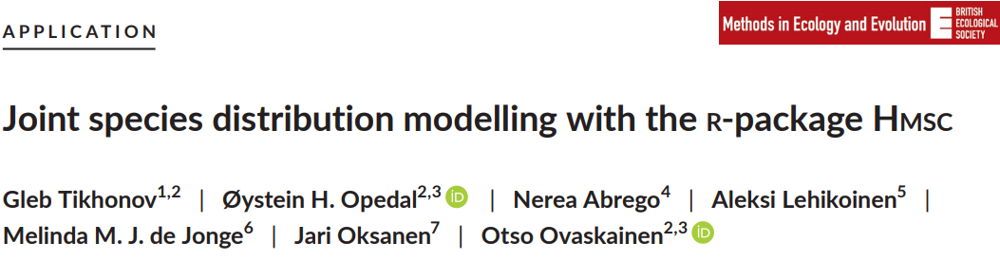
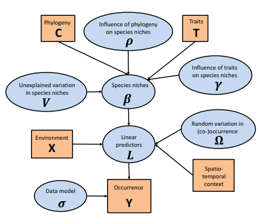
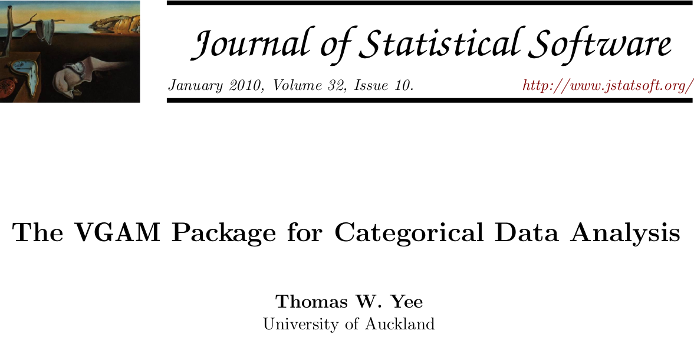

```{r setup, include=FALSE}
library(knitr)

default_source_hook <- knit_hooks$get('source')
default_output_hook <- knit_hooks$get('output')

knit_hooks$set(
  source = function(x, options) {
    paste0(
      "\n::: {.codebox data-latex=\"\"}\n\n",
      default_source_hook(x, options),
      "\n\n:::\n\n")
  }
)

knit_hooks$set(
  output = function(x, options) {
    paste0(
      "\n::: {.codebox data-latex=\"\"}\n\n",
      default_output_hook(x, options),
      "\n\n:::\n\n")
  }
)

knitr::opts_chunk$set(echo = TRUE)
```

# Outline

## Questions so far?

\center

{width=40%}

## Different packages

I will briefly go through the different model-based ordination packages \newline
I will contrast each package to \texttt{gllvm} \newline
Each of these packages really warrants its own presentation 

## Examples with Bird counts (from CANOCO 5)

\footnotesize

```{r}
Y <- read.csv("../data/birdY.csv", header = TRUE, skip = 1, row.names = 1);
Y[is.na(Y)] <- 0;
Y <- Y[,order(colSums(ifelse(Y==0,0,1)),decreasing=TRUE)] #reorder by frequency
Y <- as.matrix(Y)
row.names(Y)<-1:nrow(Y) # for VGAM
X <- read.csv("../data/birdX.csv", header = TRUE, skip = 1, row.names = 1);
X[,c(1:3,5:9)] <- scale(X[,c(1:3,5:9)])
X[,-c(1:3,5:9)] <- data.frame(lapply(X[,-c(1:3,5:9)], as.factor))
```

# \texttt{boral}

## Bayesian Ordination and regression AnaLysis

```{r, fig.align="center", out.width = "80%", echo=F}
knitr::include_graphics("Boral.png")
```

## \texttt{boral}

\columnsbegin
\column{0.5\textwidth}

- The first model-based ordination package for community ecology
- For unconstrained (or residual) ordination (and JSDM)
- Based on JAGS \tiny (Plummer, 2012) \normalsize
- Writes the model to a file, loads it into JAGS, returns results
- Runs on a single MCMC chain

\column{0.5\textwidth}

\textbf{Features}

- Covariates
- 4th corner model
- Row intercepts
- Structured LVs
- Natively includes gold-standard residuals

\columnsend

## \texttt{boral}


## \texttt{boral}: code

\footnotesize

```{r boral, echo=T, cache = TRUE, dev="png", dpi = 150, fig.show="hide", warning=FALSE, message = FALSE}
model <- boral::boral(Y, X, formula.X = ~ Forest + Altit, lv.control=list(num.lv = 2), family = "poisson", save.model = TRUE)
boral::lvsplot(model)
```

\normalsize

vignette: see paper

## \texttt{boral}: plot

`)

## \texttt{boral}

    

## \texttt{boral}: MCMC

- MCMC is (kind of) like optimisation, you need to check convergence
- MCMC needs "burn-in", i.e., forget the initial state
- But samples of parameters are stored; so we can expect them
- MCMC needs to mix well (explore whole parameter space)
- The chain is stationary if we have reached a good state
- We can check this visually, or with statistics
- If it has not converged, it needs to be run longer (or your model is poorly formulated)

## \texttt{boral}: `calc.varpart`

Partition variance per species over model terms

\tiny

```{r}
boral::calc.varpart(model)
```

## \texttt{boral}

Has a few other helpful functions:

- `get.enviro.cor` and `get.residualcor`
- `predict.boral` and `plot.boral`
- `coefsplot` and `ranefsplot`

## \texttt{boral}: compared to \texttt{gllvm}

\begin{table}[h]
\begin{tabularx}{\linewidth}{*{2}{X}}
\toprule
\textbf{\texttt{boral}} & \textbf{\texttt{gllvm}} \\
\midrule
Bayesian & Frequentist \\
MCMC & Likelihood approximation \\
Slow & Fast \\
Correlated LVs & Not yet \\
Single row effect & Multiple row effects \\
Stochastic Variable Selection & Adaptive shrinkage? \\
\bottomrule
\end{tabularx}
\end{table}

There is little reason to use \texttt{boral} at this point, except for the SVSS and correlation of LVs.

# \texttt{HMSC}

## Hierarchical Modeling of Species Communities

```{r, fig.align="center", echo=F, out.width = "80%"}

```

## \texttt{HMSC}

\centering

{width=75%}

## \texttt{HMSC}

HMSC was introduced by Ovaskainen et al. (2017) [but has been expanded a lot since then](https://www.helsinki.fi/en/researchgroups/statistical-ecology/software/hmsc) \newline

\columnsbegin
\column{0.5\textwidth}


\vfill

\column{0.5\textwidth}

{width=80%}

\columnsend

## \texttt{HMSC}

\columnsbegin
\column{0.5\textwidth}

- Bayesian; fits with MCMC
- Custom Gibbs samplers
- Flexible package for multispecies hierarchical modeling
- Focuses on prediction and species associations

\column{0.5\textwidth}

\footnotesize

- Phylogenetic effects
- Efficiently implements spatial models with nearest neighbors
- 4th corner model
- Various extra random effects (intercepts and such)
- Effects can be specified at different sampling levels, including sets of LVs
- The "infinite factor model"
- Have a preprint on parallelisation
- Very little support for ordination
- Supports mixed response types

\columnsend

## \texttt{HMSC}: code

\footnotesize

```{r HMSC2, echo=T, dev = "png", dpi = 150, fig.show="hide", cache = TRUE}
# need to set-up LVs
studyDesign = data.frame(sample=as.factor(1:nrow(Y)))
rL <- Hmsc::HmscRandomLevel(units = studyDesign$sample)
model <- Hmsc::Hmsc(Y, XFormula = ~Forest+Altit, XData= X,
distr = "lognormal poisson", studyDesign = studyDesign, 
ranLevels = list(sample = rL))
# Run mcmc
run =  Hmsc::sampleMcmc(model, samples = 1000, nChains = 3, 
              transient = 2500)
# make biplot
etaPost=Hmsc::getPostEstimate(run, "Eta")
lambdaPost=Hmsc::getPostEstimate(run, "Lambda")
Hmsc::biPlot(run, etaPost = etaPost, lambdaPost = lambdaPost, factors = c(1,2))
```

\normalsize

[Quite detailed vignettes with code](https://cran.r-project.org/web/packages/Hmsc/vignettes/)

## \texttt{HMSC}: plot

`)
  
## \texttt{HMSC}

\footnotesize

\begin{table}[h]
\begin{tabularx}{\linewidth}{*{2}{X}}
\toprule
\textbf{\texttt{HMSC}} & \textbf{\texttt{gllvm}} \\
\midrule
Bayesian & Frequentist \\
MCMC & Likelihood approximation \\
Slow (but getting quicker) & Fast \\
normal, Bernoulli, Poisson, lognormal Poisson & Wide range of response types \\
Effects at different sampling levels & Only at one sampling level \\
Infinite factor model & Number of LVs fixed \emph{a-priori} \\
Efficient spatial implementation & Spatial is a work in progress \\
Few tools for ordination & many tools for ordination\\
\bottomrule
\end{tabularx}
\end{table}

Ultimately, the focus of these two packages is very different. HMSC focuses on prediction and JSDMs, \texttt{gllvm} can do that, but its main focus is different (IMO).

# \texttt{ecoCopula}

```{r, fig.align="center", echo=F, out.width = "80%"}
knitr::include_graphics("ecoCopula.png")
```

- Employs graphical models for determining species associations
- Requires a secondary model
- Is -very- fast for ordination (faster than NMDS!)
- Can estimate "direct associations" (not as quick)
- Supports mixed response types

## \texttt{ecoCopula}: code

\footnotesize

```{r, echo=T, dev="png", fig.show="hide", dpi = 150, cache = TRUE}
preModel <- ecoCopula::stackedsdm(Y, formula_X =~1, data = X)
model <- ecoCopula::cord(preModel)
plot(model, biplot=TRUE)
```

\normalsize

[vignette](https://cran.r-project.org/web/packages/ecoCopula/vignettes/the_basics.html)

## \texttt{ecoCopula}

\footnotesize

\begin{table}[h]
\begin{tabularx}{\linewidth}{*{2}{X}}
\toprule
\textbf{\texttt{ecoCopula}} & \textbf{\texttt{gllvm}} \\
\midrule
Frequentist & Frequentist \\
Gaussian Copula & Likelihood approximation \\
Faster & Fast \\
A decent number of distributions & Wide range of response types \\
Direct species associations & Correlative \\
None & Many other random effects \\
Secondary model in parallel & Working on parallel computation \\
Native residuals &  Native residuals \\
Biplot function & Biplot function \\
Marginal interpretaiton & Conditional interpretation \\
\bottomrule
\end{tabularx}
\end{table}

\texttt{ecoCopula} has a lot of potential due to its speed, but lacks in support, maintenance, and perhaps some maturity.

# \texttt{VGAM}

## Vector Generalised Linera and Additive Models

```{r, fig.align="center", echo=F, out.width = "80%"}

```

## Vector Generalised Linera and Additive Models

\columnsbegin
\column{0.5\textwidth}
- Package with a wide range of model types **VGLMs** 
- Massive package with a lot of functionality
- An incredible range of response distributions
- Unconstrained and constrained ordination (fixed effects formulation)
- Quadratic and additive ordinations

\column{0.5\textwidth}
- Supposed to fit quickly with IWLS
- In my experience, fitting is often difficult (errs often) and can be unstable
- Has some residuals
- Plotting functions are a bit different
- No random effects
- Now (recently) has doubly-constrained ordination!

\columnsend

Centers around `vglm()`, `vgam()`, `rrvglm()`, `cqo()`, `cao()`, `rcim()`

## VGAM

The first (model-based) constrained ordination method

\centering


## \texttt{VGAM}: code

\footnotesize

```{r VGAM, echo=T, dev="png", fig.show ="hide", cache = TRUE, warning=FALSE, dpi = 150}
model1 <- VGAM::rcim(Y, Rank = 2, family = VGAM::poissonff)
VGAM::lvplot(model1)
# Could not get this to work :(
# model2 <- VGAM::rrvglm(Y ~ model.matrix(~.,X[,1:4])[,-1], Rank = 2, family = poissonff)
```

\normalsize

[vignette: see reference card](https://www.stat.auckland.ac.nz/~yee/VGAM/doc/VGAMrefcard.pdf)

## \texttt{VGAM}: code

`)

## \texttt{VGAM}

\footnotesize

\begin{table}[h]
\begin{tabularx}{\linewidth}{*{2}{X}}
\toprule
\textbf{\texttt{VGAM}} & \textbf{\texttt{gllvm}} \\
\midrule
Frequentist & Frequentist \\
ML via IWLS & pproximate marginal likelihood \\
Fast & Fast \\
Incredible range of responses & Wide range of response types \\
Not robust fitting & Relatively robust \\
No random effects & Many other random effects \\
UQO, CQO, CAO & UQO, CQO\\
VGAMs & No smooths \\
Native residuals &  Native residuals \\
Biplot function & Biplot function \\
\bottomrule
\end{tabularx}
\end{table}

\texttt{VGAM} has a lot of potentially useful tools, but I do not find it very usable.

# \texttt{glmmTMB}

```{r, fig.align="center", echo=F, out.width = "80%"}

```

- Kind of similar to \texttt{gllvm} in that it uses approximate methods
- Laplace approximation with TMB (state-of-the-art)
- Great usability
- Can include many random-effects
- Unconstrained and constrained ordination (RE formulation)
- Slower than \texttt{gllvm}'s VA (I think?)
- Structured random effects (e.g., spatial) soon Phylogenetic
- No other support for ordinations
- Zero-inflated modeling

## \texttt{glmmTMB}: code

Note: data needs to be in long format

\footnotesize

```{r glmmtmb, echo=T, echo = -1, dev = "png", results = "hide", dpi = 150, fig.show="hide"}
extract_rr <- function(object){
  listname <- "cond"
  cnms <- object$modelInfo$reTrms[[listname]]$cnms   ## list of (named) terms and X columns
  flist <- object$modelInfo$reTrms[[listname]]$flist ## list of grouping variables
  flist_asgn <- attr(flist, "assign")
  levs <- lapply(seq_along(flist_asgn), function(i) levels(flist[[flist_asgn[i]]]))
  
  reStruc <- object$modelInfo$reStruc[[paste0(listname, "ReStruc")]] ## random-effects structure
  nc <- vapply(reStruc, function(x) x$blockSize, numeric(1)) ## number of RE params per block
  pl <- object$obj$env$parList(object$fit$par, object$fit$parfull)
  
  #function to split b by the random effect terms
  split.bseq <- function(object){
    listname <- "cond"
    reStruc <- object$modelInfo$reStruc[[paste0(listname, "ReStruc")]] ## random-effects structure
    nc <- vapply(reStruc, function(x) x$blockSize, numeric(1)) ## number of RE params per block
    nb <- vapply(reStruc, function(x) x$blockReps, numeric(1)) ## number of blocks per RE (may != nlevs in some cases)
    ### splitting the b's into their respective random effects
    nbseq <- rep.int(seq_along(nb), nb * nc) ## splitting vector
    return(nbseq)
  }
  nbseq <- split.bseq(object)      ## splitting vector
  ml.b <- split(pl$b, nbseq)
  ml <- ml.b
  
  for (i in seq_along(ml.b)) {
    ml[[i]] <- matrix(ml.b[[i]], ncol = nc[i], byrow = TRUE,
                      dimnames = list(levs[[i]], cnms[[i]]))
  }
  
  get_rank <- function(x){
    if(x[["blockCode"]]==9){
      p <- x$blockSize
      nt <- x$blockNumTheta
      rank <- (2*p + 1 - sqrt((2*p+1)^2 - 8*nt))/2
    } else
      rank <- 0
    return(rank)
  }
  
  rank <- vapply(object$modelInfo$reStruc$condReStruc,
                 get_rank,
                 FUN.VALUE=numeric(1))
  nlv <- rank[rank > 0]
  rrName <- names(nlv)
  rrBlock <- which(rank > 0)
  b = ml[[rrBlock]][,1:nlv]
  colnames(b) <- paste0("lv", 1:nlv)
  fact_load <- object$obj$env$report(object$fit$parfull)$fact_load[[rrBlock]]
  rownames(fact_load) <- cnms[[rrBlock]]
  
  return(list(fl = fact_load, b = b))
}

# organize data into long format
tmp <- data.frame(Y)
tmp$id <- 1:nrow(tmp)
glmmDat <- reshape(tmp,
                     idvar = "id",
                     timevar = "col",
                     times =  colnames(Y),
                     varying = list(colnames(Y)),
                     v.names = "y",
                     direction = "long")
model <- glmmTMB::glmmTMB(y ~ col + rr(col + 0|id, d = 2), data = glmmDat, family = "poisson")
rrstuf <- extract_rr(model) # see here: https://github.com/glmmTMB/glmmTMB/issues/1012
plot(rbind(rrstuf$b,rrstuf$fl), type = "n");
text(rrstuf$b);text(rrstuf$fl, col = "red")
```

\normalsize

[vignette](https://cran.r-project.org/web/packages/glmmTMB/vignettes/covstruct.html)

## \texttt{glmmTMB}: plot

`)

## \texttt{glmmTMB}

\footnotesize

\begin{table}[h]
\begin{tabularx}{\linewidth}{*{2}{X}}
\toprule
\textbf{\texttt{glmmTMB}} & \textbf{\texttt{gllvm}} \\
\midrule
Frequentist & Frequentist \\
Laplace & VA (default) or Laplace \\
Fast & Fast(er) \\
Wide range of response types & Wide range of response types \\
Many (structured) random effects & Many random effects \\
Can also fit with MCMC & No \\
Zero-inflated modeling & Work in progress \\
No residuals &  Native residuals \\
No plotting function & Biplot function \\
Large community & Small community \\
Excellent developers & No comment :) \\
\bottomrule
\end{tabularx}
\end{table}

\texttt{glmmTMB} is especially useful if you want user friendliness and many other random effects. Ordination is an afterthought in a package supposed to do many other things (but also still new).

# \texttt{gmf}

## Generalized Matrix Factorization

\columnsbegin
\column{0.5\textwidth}

```{r, fig.align="center", echo=F, out.width = "99%"}

```

\column{0.5\textwidth}

- Very quick; fits by penalized likelihood
- Unconstrained or residual ordination only
- No extra random-effects
- Can be unstable due to the approximation
- Stale package not on CRAN

\columnsend

## \texttt{gmf}: code

\footnotesize

```{r gmf, echo=T, dev="png", results="hide", dpi=150, fig.show="hide"}
# devtools::install_github("kidzik/gmf")
model <- gmf::gmf(Y, family = poisson(), p = 2)
plot(rbind(model$u,model$v), type = "n", xlab="LV1", ylab="LV2")
text(model$u)
text(model$v, col="red")
```

## \texttt{gmf}: plot

`)

## \texttt{gmf}

\begin{table}[h]
\begin{tabularx}{\linewidth}{*{2}{X}}
\toprule
\textbf{\texttt{gmf}} & \textbf{\texttt{gllvm}} \\
\midrule
Frequentist & Frequentist \\
Penalized likelihood & VA or LA approximation \\
Fast(er) & Fast \\
A few response types & Wide range of response types \\
Fitting is fine & Relatively robust \\
No random effects & Many other random effects \\
\bottomrule
\end{tabularx}
\end{table}

A skeleton of a package, not very useful at this point.

# \texttt{RCM}

```{r, fig.align="center", echo=F, out.width = "80%"}
knitr::include_graphics("RCIM.png")
```

\footnotesize

- Does both unconstrained and unconstrained ordination
- Even additive constrained ordination
- All based on fixed effects formulations, no random effects
- Only the negative binomial distribution
- Not a "true" statistical model \tiny (according to the authors) \footnotesize
- Permanova functionality
- Residual plots

## RCM: code

```{r RCM, echo=T, dev="png", fig.show="hide", dpi = 150, message=FALSE, results ="hide"}
# devtools::install_github("CenterForStatistics-UGent/RCM")
model <- RCM::RCM(Y, k = 2)
plot(model)
```

[vignette](https://bioconductor.org/packages/release/bioc/vignettes/RCM/inst/doc/RCMvignette.html)

## RCM: plot

`)

## RCM

\begin{table}[h]
\begin{tabularx}{\linewidth}{*{2}{X}}
\toprule
\textbf{\texttt{RCM}} & \textbf{\texttt{gllvm}} \\
\midrule
Frequentist & Frequentist \\
Maximum likelihood & Approximate marginal likelihood \\
Fast & Fast \\
Only NB & Wide range of response types \\
UO, CO, CQO, CAO & UO, CO, CQO \\
No random effects & Many other random effects \\
\bottomrule
\end{tabularx}
\end{table}

\texttt{RCM} seems good at what it does, but functionality is limited.

## Experimental: latent INLA

```{r, fig.align="center", echo=F, out.width = "70%"}

```

- Relatively fast; Bayesian with Laplace approximation
- Unconstrained, concurrent \sout{, and hierarchical ordination }
- Fast fitting of large spatial effects
- \textbf{Very much a work in progress}

## latent INLA: code

\textcolor{red}{don't try, this crashed :(}

```{r, eval = FALSE}
# devtools::install_github("oharar/LatentINLA")
model <- LatentINLA::FitGLLVM(Y=Y, Family="poisson", nLVs = 2)
LatentINLA::biplot(model)
```

[vignettes](https://github.com/oharar/LatentINLA/blob/main/vignettes/How-A-Simple-Model-Works.Rmd)


# \texttt{CBFM}

## Community-level basis function models 

```{r, fig.align="center", echo=F, out.width = "70%"}
# devtools::install_github("fhui28/CBFM")

```

- Most recent developments: GAM for multiple species
- Specifically targeted on spatio,temporal or spatio-temporal analysis
- This is something GLLVMs are not -terribly- good at yet (but very much an area of interest)
- Based on the idea of LVMs, but not with LVs
- Fitting using \texttt{TMB}
- I.e., JSDM-oriented, not ordination

## CBFM

\footnotesize

\begin{table}[h]
\begin{tabularx}{\linewidth}{*{2}{X}}
\toprule
\textbf{\texttt{CBFM}} & \textbf{\texttt{gllvm}} \\
\midrule
Frequentist & Frequentist \\
Penalized Quasi-likelihood & Approximate marginal likelihood \\
For large spatio-temporal problems & Not an option (yet?) \\
Wide range of response types & Wide range of response types \\
Post-hoc ordination & Is an ordination method \\
Can include extra "random effects" as smooths & Many other random effects \\
Parallelisation & Parallelisation\\
No traits of Phylogeny & Traits and Phylogeny\\
\bottomrule
\end{tabularx}
\end{table}

Sorry, no example yet. Bird data does not have coordinates, and CBFM only fits models with space it seems?

# Software summary

\footnotesize
\begin{table}[h]
\centering
\makebox[\linewidth][c]{
\setlength{\tabcolsep}{.5pt}
\begin{threeparttable}
\begin{tabularx}{0.9\paperwidth}{@{}>{\raggedright\arraybackslash}X*{10}{>{\centering\arraybackslash}X}@{}}
\toprule
\tiny Package & cran\tnote{1} & UO\tnote{2} & CO\tnote{3} & CN\tnote{4} & RE\tnote{5} & CI\tnote{6} & traits & \tiny Phylogeny & Space & \tiny framework\tnote{7} \\
\midrule
gllvm & yes & yes & yes & yes & yes & yes & yes & yes & Not really & F \\
\tiny Boral & yes & yes & no & no & some & yes & yes & no & yes & B \\
HMSC & yes & yes & no & no & yes & yes & yes & yes & yes & B \\
\tiny ecoCopula & yes & yes & no & no & no & no & kind of & no & no & F \\
VGAM & yes & yes & yes & no & no & some & new? & no & no & F \\
\tiny glmmTMB & yes & yes & yes & no & yes & yes & yes & soon & Kind of & F \\
gmf & no & yes & no & no & no & no & no & no & no & F \\
RCM & no & yes & yes & no & no & no & no & no & no & F \\
\tiny latent INLA & no & no & no & yes & yes & yes & soon & no & yes & B \\
CBFM & no & no & no & no & yes & yes & no & no & yes & B \\
\bottomrule
\end{tabularx}
\begin{tablenotes}
\footnotesize
\item \textsuperscript{1}cran: Package available on CRAN. \textsuperscript{2}UO: Unconstrained ordination. \textsuperscript{3}CO: Constrained. \textsuperscript{4}CN: Concurrent. \textsuperscript{5}RE: Random effects. \textsuperscript{6}CI: Confidence/Credible intervals. \textsuperscript{7}framework: The underlying framework of the model (F: Frequentist, B: Bayesian).
\end{tablenotes}
\end{threeparttable}
}
\end{table}

## When to use what package?

- \texttt{HMSC} for extensive support for JSDMs
- \texttt{VGAM} is what you want is not supported by \texttt{gllvm}
- \texttt{glmmTMB} for many (structured) random effects
- \texttt{ecoCopula} if you have a \huge huge \normalsize dataset and \texttt{gllvm} is too slow
- \texttt{CBFM} for large spatial/temporal models

\centering

\textcolor{red}{\texttt{gllvm} for all your ordination needs}

## Summary

New software implementations are continuously being developed. Dimension reduction methods for ecology have entered a new era.

- It is important that we continue to explore new and better methods
- Especially the application of ordination methods are still a bit stuck in the past
- Generally speaking, there is still a lot of work to be done on multivariate methods for ecommunity ecology
- There are more packages for model-based analysis that I have not mentioned
- E.g., \texttt{jSDM}, \texttt{sjSDM}, \texttt{BayesComm}
